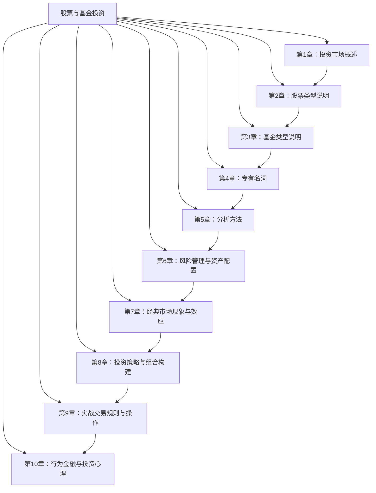

# 股票与基金投资 知识精要与实战指南

> 资料来源：
> - 官方监管机构：中国证监会 http://www.csrc.gov.cn/、上交所 http://www.sse.com.cn/、深交所 http://www.szse.cn/、北交所 http://www.bse.cn/
> - 港美股监管：港交所 https://www.hkex.com.hk/、美国 SEC https://www.sec.gov/
> - 行业组织：中国证券投资基金业协会 https://www.amac.org.cn/、中证指数公司 https://www.csindex.com.cn/
> - 国际权威：CFA Institute https://www.cfainstitute.org/、GARP（FRM）https://www.garp.org/
> - 核心社区：雪球 https://xueqiu.com/、天天基金网 https://fund.eastmoney.com/、晨星网 https://www.morningstar.cn/
>
> 目标版本：2026年7月（含2026年7月6日交易新规）
> 适合人群：初学者至中级投资者
> 生成时间：2026-07-07

---

## 知识体系总览

**章节导航**：
1. [投资市场概述](#第1章-投资市场概述) — 金融市场功能、主要交易所、A股/港股/美股特点、参与者与监管
2. [股票类型说明](#第2章-股票类型说明) — 普通/优先股、市值划分、价值/成长股、ST股、行业分类
3. [基金类型说明](#第3章-基金类型说明) — 开放/封闭、ETF/LOF、主动/被动、QDII、FOF/TDF
4. [专有名词](#第4章-专有名词) — PE/PB/ROE、DCF/DDM、Alpha/Beta、除权除息、安全边际
5. [分析方法](#第5章-分析方法) — 基本面/技术/量化、杜邦分析、估值方法、龙虎榜
6. [风险管理与资产配置](#第6章-风险管理与资产配置) — MPT/CAPM、VaR、风险平价、夏普比率
7. [经典市场现象与效应](#第7章-经典市场现象与效应) — 动量/反转、PEAD、一月效应、黑天鹅、反身性
8. [投资策略与组合构建](#第8章-投资策略与组合构建) — 价值/成长/指数、核心-卫星、全天候、耶鲁模式
9. [实战交易规则与操作](#第9章-实战交易规则与操作) — 开户、T+1、涨跌停、港股通、融资融券、税收
10. [行为金融与投资心理](#第10章-行为金融与投资心理) — 前景理论、处置效应、确认偏误、羊群效应

**学习路径建议**：
- **新手入门**：按 1→2→3→4→9 顺序学习，先建立基础概念与交易常识
- **进阶深化**：再学 5→6→7，掌握分析方法与风险管理
- **实战应用**：最后学 8→10，构建投资策略并克服行为偏差

---

