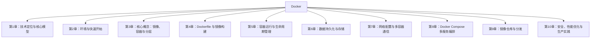

# Docker 知识精要与实战指南

> 资料来源：
> - 官方文档：https://docs.docker.com/
> - API 文档：https://docs.docker.com/engine/api/
> - 官方仓库：https://github.com/moby/moby
> - 核心社区：Stack Overflow、Docker Forums、GitHub Discussions
>
> 目标版本：Docker Engine 25.x / Docker Compose v2
> 适合人群：初学者 → 高级
> 生成时间：2026-07-02

---

## 知识体系总览



**章节导航**：
1. [技术定位与核心模型](#第1章-技术定位与核心模型)
2. [环境与快速开始](#第2章-环境与快速开始)
3. [核心概念：镜像、容器与分层](#第3章-核心概念镜像容器与分层)
4. [Dockerfile 与镜像构建](#第4章-dockerfile-与镜像构建)
5. [容器运行与生命周期管理](#第5章-容器运行与生命周期管理)
6. [数据持久化与存储](#第6章-数据持久化与存储)
7. [网络配置与多容器通信](#第7章-网络配置与多容器通信)
8. [Docker Compose 多服务编排](#第8章-docker-compose-多服务编排)
9. [镜像仓库与分发](#第9章-镜像仓库与分发)
10. [安全、性能优化与生产实践](#第10章-安全性能优化与生产实践)

**附加内容**：
- [费曼总结：用最朴素的话讲清 Docker](#费曼总结用最朴素的话讲清-docker)
- [综合实践问题（跨章节）](#综合实践问题跨章节)
- [最难挑战（深度问题）](#最难挑战深度问题)
- [学习检查清单](#学习检查清单)
- [进一步学习资源](#进一步学习资源)

---

## 第1章 技术定位与核心模型

### 核心知识点

> 高度概括，用自己的话解释，不照搬官网。

**1. Docker 是什么 / "在我机器上能跑"问题**
- 概念解释：Docker 是一个基于 Linux 内核特性（Namespace、Cgroup、UnionFS）实现的轻量级应用打包与运行平台。它把应用连同其依赖的库、配置、运行环境一起封装成标准化的"镜像"，再以"容器"的形式分发运行，做到"一次构建，到处运行"。
- 核心作用：消除"在我机器上能跑、到你机器上就崩"的环境差异问题。把环境本身变成可版本化、可分发、可复现的制品，让开发、测试、生产环境完全一致。
- 基本用法：
  ```bash
  # 拉取镜像并运行一个容器
  docker run -d --name web -p 8080:80 nginx:alpine

  # 查看运行中的容器
  docker ps

  # 基于当前代码构建自己的镜像
  docker build -t myapp:1.0 .
  ```
- 注意事项：Docker 解决的是"环境一致性"和"交付标准化"问题，但它不解决"应用本身的 bug"，也不天然解决性能问题；容器不是银弹，有共享内核带来的隔离性弱点。

---

**2. 容器 vs 虚拟机（VM）的本质区别**
- 概念解释：虚拟机（VM）通过 Hypervisor（如 KVM、VMware）虚拟出完整硬件，每个 VM 都跑一个完整的客户机操作系统（Guest OS）。容器则共享宿主机内核，只是在用户态用 Namespace 划出隔离的进程空间，用 Cgroup 限制资源。
- 核心作用：容器省去了 Guest OS 这一层，启动以秒/毫秒计，镜像体积通常几十到几百 MB（VM 常是 GB 级），单机可跑成百上千容器。本质是用"共享内核 + 进程级隔离"换取轻量。
- 基本用法对比：
  ```bash
  # VM：需要先装 Guest OS，启动慢
  # 容器：直接复用宿主内核
  docker run --rm alpine echo "hello"
  ```
- 注意事项：① 容器共享内核，所以内核漏洞或配置不当会波及所有容器，隔离性弱于 VM；② 想运行不同内核版本的 OS（如在 Linux 上跑 Windows 容器）需特殊支持；③ 强隔离场景（多租户、不可信代码）建议用 Kata Containers / gVisor 等沙箱运行时。

---

**3. Docker 的 C/S 架构（客户端 / 守护进程）**
- 概念解释：Docker 采用 C/S 架构。`dockerd`（守护进程，Daemon）负责构建、运行、分发容器，监听 Unix socket 或 TCP；`docker` CLI 是客户端，通过 REST API 与 dockerd 通信。两者可以不在同一台机器。
- 核心作用：解耦"用户操作入口"与"实际执行引擎"，使得远程管理、多节点编排成为可能。
- 基本用法：
  ```bash
  # 查看 daemon 信息
  docker info

  # 让客户端连远程 daemon
  docker -H tcp://192.168.1.10:2375 ps

  # 配置 daemon（/etc/docker/daemon.json）
  {
    "data-root": "/data/docker",
    "registry-mirrors": ["https://mirror.example.com"],
    "log-driver": "json-file",
    "log-opts": { "max-size": "10m", "max-file": "3" }
  }
  ```
- 注意事项：① TCP 暴露 daemon 默认无认证，生产必须配 TLS 或走 SSH 隧道（`ssh://user@host`）；② `data-root` 一旦变更需先停服务并迁移目录；③ daemon 重启不会杀掉正在运行的容器（默认行为）。

---

**4. 镜像、容器、仓库三大核心对象**
- 概念解释：
  - **镜像（Image）**：只读的分层模板，包含应用运行所需的所有文件和元数据，通过 UnionFS 叠加而成。
  - **容器（Container）**：镜像的运行实例，在镜像顶层加一个可写层（容器层），用 Namespace 隔离。
  - **仓库（Registry）**：存储和分发镜像的服务（如 Docker Hub、Harbor），镜像以 `仓库地址/仓库名:标签` 唯一标识。
- 核心作用：把"软件交付物"标准化为镜像制品，让镜像成为构建、分发、运行的统一单位。
- 基本用法：
  ```bash
  docker pull nginx:1.27-alpine       # 从仓库拉镜像
  docker images                        # 查看本地镜像
  docker tag nginx:1.27-alpine myrepo/nginx:dev
  docker push myrepo/nginx:dev         # 推送到仓库
  docker commit web myapp:debug        # 容器层提交成新镜像（不推荐用于正式流程）
  docker save -o app.tar myapp:1.0     # 导出镜像
  docker load -i app.tar               # 导入镜像
  ```
- 注意事项：① 生产镜像别用 `commit` 生成，应通过 `Dockerfile` 可复现构建；② `:latest` 标签会漂移，生产环境必须用具体版本号或 digest；③ 镜像分层共享，删镜像不会立即释放空间，需注意 dangling 镜像清理（`docker image prune`）。

---

**5. Linux Namespaces——容器的隔离基石**
- 概念解释：Namespace 是 Linux 内核提供的一种资源视图隔离机制，让进程以为自己独占某些系统资源。Docker 主要使用 6 种：
  - `pid`：进程号隔离（容器内 PID 从 1 开始）
  - `net`：网络栈隔离（独立网卡、IP、端口、路由表）
  - `mnt`：挂载点视图隔离（独立文件系统树）
  - `uts`：主机名/域名隔离
  - `ipc`：进程间通信隔离（消息队列、共享内存）
  - `user`：用户和用户组 ID 映射隔离（容器内 root 映射为宿主非特权用户）
- 核心作用：让容器看起来像独立系统，但实际只是宿主机上隔离的进程。
- 基本用法：
  ```bash
  # 查看某容器的 namespace
  docker inspect --format '{{.State.Pid}}' web
  ls -l /proc/<pid>/ns/          # 看到各 namespace 链接

  # 进入容器对应的 namespace
  nsenter --target <pid> --mount --net --pid /bin/sh

  # 运行时指定 user namespace 重映射
  docker run --userns=host --rm alpine id
  ```
- 注意事项：① Namespace 是"视图隔离"不是"安全边界"，共享内核意味着内核漏洞可逃逸；② `user` namespace 默认未必开启，需在 daemon.json 配置 `userns-remap`；③ `--pid=host`、`--network=host` 会破坏隔离，仅在调试时用。

---

**6. Cgroups——资源限制基石**
- 概念解释：Cgroups（Control Groups）是 Linux 内核用于限制、记录、隔离进程组资源的机制，主要管 CPU、内存、IO、设备等。Docker 借助 cgroup v1/v2 对容器做配额与限制。
- 核心作用：防止单个容器吃光宿主机资源（OOM、CPU 饥饿），实现多容器间的公平调度。
- 基本用法：
  ```bash
  # 限制 CPU 与内存
  docker run -d --name api \
    --cpus="1.5" \
    --memory="512m" \
    --memory-swap="1g" \
    --pids-limit=200 \
    myapp:1.0

  # 查看容器 cgroup
  docker inspect --format '{{.State.Pid}}' api
  cat /proc/<pid>/cgroup
  ```
- 注意事项：① `--memory` 必须设，否则容器可触发宿主 OOM；② cgroup v2 与 v1 路径和语义不同，新系统多为 v2；③ `--cpus` 是 CPU 配额，`--cpu-shares` 是相对权重，别混淆；④ IO 限制对某些存储驱动效果有限。

---

**7. UnionFS / OverlayFS——分层存储基石**
- 概念解释：UnionFS 是一种把多个目录"联合挂载"成一个目录的文件系统。Docker 用它实现镜像分层：每条 Dockerfile 指令生成一层，多层只读叠加，再在最上面加一个可写容器层。现代默认驱动是 `overlay2`（基于 OverlayFS）。
- 核心作用：① 镜像分层共享，节省存储和拉取带宽；② 构建缓存加速；③ 容器层写时复制（CoW，Copy-on-Write）。
- 基本用法：
  ```bash
  docker info | grep -i storage        # 查看存储驱动
  docker history nginx:alpine          # 查看镜像各层

  # OverlayFS 三层结构：lowerdir（只读镜像层）+ upperdir（容器可写层）+ workdir + merged
  mount | grep overlay
  ```
- 注意事项：① 容器写文件会先把文件从下层复制到上层（CoW），频繁改大文件性能差，日志/数据库数据应放 volume；② `overlay2` 要求内核 ≥ 4.0、推荐 ext4/xfs；③ 删除文件其实是在上层写"whiteout"，不会真正删下层，镜像不会变小。

---

**8. 容器运行时：containerd 与 runc**
- 概念解释：现代 Docker 内部其实是分层架构：`dockerd`（上层）→ `containerd`（守护进程，管镜像和容器生命周期）→ `runc`（底层 OCI 运行时，真正创建/运行容器进程）。containerd 是 CNCF 毕业项目，runc 是 OCI 运行时参考实现。
- 核心作用：职责分层，使运行时可替换（如换为 `kata-runtime`、`crun`、`gVisor` 的 `runsc`），也使 containerd 可被 Kubernetes 直接使用（通过 CRI 接口）。
- 基本用法：
  ```bash
  # 看到容器在底层其实就是 runc
  docker info | grep -i runtime
  docker info | grep -i "runc version"

  # containerd 自带 CLI
  ctr containers ls
  crictl ps        # K8s 场景下查看容器
  ```
- 注意事项：① `ctr` 是 containerd 调试工具，不替代 `docker` CLI；② 切换默认运行时要装 runtime 并在 daemon.json 的 `runtimes` 注册；③ Docker 25.x 内部仍依赖 containerd（默认随 Docker Engine 一起发布）。

---

**9. Docker 与 Kubernetes 的关系定位**
- 概念解释：Docker 是单机层面的"构建+运行"工具；Kubernetes（K8s）是跨多机的"编排+调度"平台。两者不是替代关系：K8s 负责把容器调度到合适节点、保证副本数、滚动升级、服务发现，而容器运行时（如 containerd）才是 K8s 真正直接调用的对象。
- 核心作用：明确分工——Docker 解决"如何打包和运行一个容器"，K8s 解决"如何管理成百上千个容器组成的应用"。
- 基本用法：
  ```bash
  # 单机：docker 足够
  docker compose up -d

  # 多机：用 K8s，K8s 通过 CRI 调用 containerd（而非 docker）
  kubectl run nginx --image=nginx
  kubectl get pods
  ```
- 注意事项：① 自 K8s 1.24 起，dockershim 被移除，K8s 不再直接支持 Docker Engine，而是走 CRI 调用 containerd/CRI-O；② Docker 构建的 OCI 镜像仍能在 K8s 中运行，因为镜像格式是标准的；③ 开发本地仍用 docker/compose，集群用 K8s，这是常见组合。

---

**10. OCI 标准（镜像规范 + 运行时规范）**
- 概念解释：OCI（Open Container Initiative）是 2015 年由 Docker 等发起的开放标准，包含三部分：① **Image Spec**（镜像规范，定义镜像清单、配置、层格式，产物为 `.tar` 的 OCI image）；② **Runtime Spec**（运行时规范，定义如何把镜像解包成"文件系统包 bundle"并启动，runc 是其参考实现）；③ **Distribution Spec**（分发规范，定义 registry API）。
- 核心作用：避免厂商锁定，让镜像和运行时可互换——Podman、containerd、CRI-O 都能跑 Docker 构建的镜像。
- 基本用法：
  ```bash
  # 用 Docker 构建 OCI 标准镜像
  docker build -t myapp:1.0 .
  docker buildx build --output type=oci,dest=myapp.tar .   # 输出 OCI 格式

  # 用 skopeo 检查镜像是否符合规范
  skopeo inspect docker://nginx:alpine
  ```
- 注意事项：① Docker 镜像格式与 OCI 镜像格式历史上略有差异（manifest v2 vs OCI manifest），现在基本兼容；② 符合 OCI 的镜像可跨运行时迁移，但容器运行时行为（如默认 cgroup、seccomp）仍有差异；③ 关注 `org.opencontainers.image.*` 标签规范来标注镜像元信息。

---

### 章节题目（≥10道）

> 来源多样化：面试/论坛/期末/官网/实战。难度分层：基础/进阶/深度/实战

#### 【面试题】

**Q1. 容器和虚拟机最本质的区别是什么？为什么说容器隔离性弱于虚拟机？**（难度：基础）
- 答案：最本质区别在于"是否共享内核"。虚拟机通过 Hypervisor 虚拟出完整硬件，每个 VM 跑独立的 Guest OS 内核，硬件级隔离；容器共享宿主机内核，只是用 Namespace 做进程视图隔离、Cgroup 做资源限制，是进程级隔离。正因共享内核，一旦内核存在漏洞（如 Dirty COW）或容器配置不当（`--privileged`、挂载 `/`），攻击者可能"逃逸"到宿主机，所以隔离性弱于 VM。强隔离需求要用 Kata Containers、gVisor 等沙箱运行时。
- 考点：容器 vs VM、隔离边界、内核共享

**Q2. 请简述 Docker 的整体架构，以及 dockerd / containerd / runc 各自的职责。**（难度：进阶）
- 答案：Docker 是 C/S 架构。`docker` CLI 通过 REST API 调用 `dockerd`（守护进程，负责镜像构建、网络、卷管理等上层逻辑）。`dockerd` 把容器生命周期管理委托给 `containerd`（CNCF 项目，管理镜像拉取、容器创建、快照、容器运行时调用）。`containerd` 再调用符合 OCI 规范的底层运行时 `runc`，由 runc 真正设置 Namespace、Cgroup 并启动容器进程。三者分层的好处是职责清晰、运行时可替换，containerd 也能被 K8s 通过 CRI 直接使用。
- 考点：Docker 架构、运行时分层、containerd/runc

**Q3. Docker 镜像是如何实现分层和共享的？删除一个文件后镜像体积会变小吗？**（难度：深度）
- 答案：镜像由多层只读的文件系统层组成，通过 UnionFS（默认 overlay2）联合挂载。每条 Dockerfile 指令（RUN/COPY/ADD）生成一层，层之间可被多个镜像共享（如多个镜像都基于同一个 `alpine` 层，磁盘只存一份）。容器运行时在最上层加一个可写层，修改文件采用写时复制（CoW）——先把文件从下层复制到可写层再修改。删除文件实际上是在上层写一个 whiteout 标记，下层的那一层并未删除，所以镜像体积不会变小。要真正减小体积，应在同一层里创建并删除文件（如 `RUN apt-get install ... && rm -rf /var/lib/apt/lists/*` 放在同一条 RUN 中），或多阶段构建把需要的产物复制到全新镜像。
- 考点：UnionFS、分层、CoW、镜像瘦身

#### 【论坛题】

**Q4. "Docker 容器里跑的就是个进程，那我为什么还要用 Docker？"**（难度：基础）
- 来源：知乎 / Stack Overflow
- 答案：技术上容器确实是宿主机上的进程（`ps -ef` 能看到），但 Docker 提供的远不止"跑进程"：① 环境一致性——把依赖、配置、库一起打包成镜像，消除"在我机器上能跑"；② 标准化交付——镜像是不可变制品，CI/CD 流水线统一；③ 隔离与资源限制——Namespace + Cgroup 让多服务互不干扰；④ 分发——Registry 让镜像一键拉取部署；⑤ 生态——Compose/K8s 编排、卷/网络抽象。如果只是跑个二进制，进程够了；但凡涉及多环境部署、团队协作、微服务，Docker 价值就显现。
- 考点：Docker 价值定位、容器本质

**Q5. "`docker run --privileged` 到底做了什么？为什么大家都说不安全？**（难度：进阶）
- 来源：Stack Overflow
- 答案：`--privileged` 会：① 关闭大部分安全隔离（seccomp、AppArmor、默认 capability 限制全部移除，赋予所有 capability）；② 把宿主机所有设备（`/dev/*`）挂载进容器；③ 让容器能访问宿主机 PCI、USB 设备；④ 不再启用 user namespace。这等于"容器几乎等于宿主机 root"，一旦容器被攻破即可逃逸。仅在需要挂载外部设备、运行 Docker-in-Docker、调试内核模块时才用，且应限定在受控环境。更安全的做法是用 `--cap-add` 精确授予所需 capability（如 `SYS_ADMIN`），配合 `--device` 只挂载特定设备。
- 考点：特权容器、安全、capability

**Q6. "K8s 1.24 弃用了 Docker，那我以前用 Docker 构建的镜像还能在 K8s 跑吗？"**（难度：进阶）
- 来源：Stack Overflow / GitHub Discussions
- 答案：能。K8s 弃用的是 `dockershim`（Kubelet 调用 Docker Engine 的适配层），不是 Docker 公司或 Docker 镜像。K8s 节点改用符合 CRI 标准的运行时（containerd、CRI-O）。由于 Docker 构建的镜像符合 OCI 镜像规范，containerd 完全能拉取和运行。所以：① 镜像照常用 `docker build` 构建；② 集群节点把运行时换成 containerd 即可；③ CI/CD 流程基本不变。真正受影响的是那些直接通过 Docker API（而不是 K8s API）操作节点的工具，需改用 `crictl`。
- 考点：dockershim、CRI、OCI 镜像兼容性

#### 【期末题/认证题】

**Q7. （Linux 基金会 / CKA 认证风格）下列关于 Linux Namespace 的说法，正确的是？**（难度：进阶）
A. Namespace 提供硬件级隔离，与虚拟机等价
B. `pid` namespace 让容器内进程对宿主机不可见，宿主机也看不到容器进程
C. `user` namespace 默认在所有 Docker 安装中启用
D. `--network=host` 会让容器与宿主机共享网络栈

- 答案：D。A 错，Namespace 是进程级视图隔离，非硬件级；B 错，宿主机能看到容器进程（在宿主 `ps` 里能看到，只是 PID 不同）；C 错，user namespace 默认未启用，需 `userns-remap` 配置；D 正确，`--network=host` 让容器复用宿主机 net namespace。
- 考点：Namespace 各类型语义

**Q8. （DCA 认证风格）关于 cgroup v2 与资源限制，下列哪项描述正确？**（难度：深度）
A. `--cpu-shares` 是硬性 CPU 上限
B. `--memory` 不设时，容器内存无上限，可能触发宿主 OOM Killer
C. cgroup v2 与 v1 的层级结构完全相同
D. `--cpus=2` 表示容器一定独占 2 个 CPU 核心

- 答案：B。A 错，`--cpu-shares` 是相对权重，不是上限；B 正确，不设内存限制时容器可用完宿主内存，触发 OOM；C 错，v2 是统一层级，v1 是按控制器分多个层级；D 错，`--cpus` 是配额（CPU quota），是时间片限制，不独占物理核心。
- 考点：cgroup、CPU/内存限制语义

#### 【官网题】

**Q9. （Docker 官方文档 - Docker overview）Docker Engine 主要由哪几个组件构成？**（难度：基础）
- 答案：根据官方文档，Docker Engine 是 C/S 应用，包含三部分：① **Docker Daemon（dockerd）**：守护进程，监听 Docker API 请求，管理镜像、容器、网络、卷；② **REST API**：客户端与 daemon 通信的接口；③ **Docker CLI（docker）**：用户与之交互的命令行客户端。daemon 之下还集成了 containerd 和 runc 负责实际容器运行时功能。
- 考点：Docker Engine 架构
- 来源：https://docs.docker.com/get-started/docker-concepts/the-basics/what-is-a-container/

**Q10. （Docker 官方文档 - Storage）为什么推荐使用 Docker managed volume 而不是容器可写层来存储数据库数据？**（难度：进阶）
- 答案：容器可写层使用 UnionFS 的写时复制（CoW）机制：① 性能差——每次修改大文件都要从下层复制到上层，且多了一层间接；② 生命周期短——容器删除后可写层随之消失，数据丢失；③ 不便共享与备份。Volume 由 Docker 独立管理，存储在宿主机特定目录（默认 `/var/lib/docker/volumes`），绕过 UnionFS 直接读写宿主文件系统，性能接近原生，且独立于容器生命周期，可挂载到多个容器、方便备份迁移。所以数据库、日志、上传文件等持久化数据必须用 volume 或 bind mount。
- 考点：存储驱动、volume、CoW
- 来源：https://docs.docker.com/engine/storage/

#### 【实战题】

**Q11. 你接手一个老项目，开发说"在我电脑上能跑"，但部署到生产服务器就启动失败。如何用 Docker 化方案彻底解决这个问题？请给出关键步骤。**（难度：实战）
- 答案：① 用 Dockerfile 把应用运行环境固化：基于固定版本基础镜像（如 `python:3.11-slim`），`COPY` 代码、`pip install` 锁定版本（`requirements.txt` 或 `poetry.lock`），声明 `CMD`；② 用多阶段构建保证镜像精简且可复现；③ 用 `docker compose` 定义应用+依赖（DB、Redis）及其版本，配置环境变量与挂载卷；④ CI 流水线构建镜像并推送 Registry，生产从 Registry 拉取同一 digest 的镜像运行；⑤ 配置只通过环境变量/配置文件挂载注入，不 baked 进镜像。这样开发、测试、生产跑的是同一个不可变镜像，环境差异被消除。
- 考点：Dockerfile、Compose、不可变交付

**Q12. 线上一个 Java 服务容器经常被 OOM Kill，但 JVM 配置的 `-Xmx` 远小于容器内存限制，为什么？如何修复？**（难度：实战）
- 答案：根因是老版本 JVM（< 8u191 / 10 之前）默认按"宿主机总内存"而非"容器内存限制"计算堆大小，导致 JVM 以为自己有大内存、实际被 cgroup 限制后触发 OOM Kill。修复：① 升级 JDK 到 8u191+ 或 11+，它们支持 `+UseContainerSupport`（默认开启），会按 cgroup 限制计算；② 显式设置 `-XX:MaxRAMPercentage=75.0` 而不是写死 `-Xmx`，让 JVM 自适应容器；③ 同时确保 `docker run` 设了 `--memory`；④ 别忘了容器内非堆内存（Metaspace、线程栈、Direct Memory）也占内存，给 JVM 留出 25% 余量。可用 `docker stats` 观察容器内存使用验证。
- 考点：JVM 容器感知、cgroup 内存限制、OOM

---

### 项目常用场景

**场景1：开发环境标准化（消除"在我机器上能跑"）**
- 背景：团队多人开发、本地系统各异（macOS/Windows/Linux），依赖版本不一致导致联调困难。
- 解决方案：
  ```bash
  # docker-compose.yml 定义完整开发环境
  cat > docker-compose.yml <<'EOF'
  services:
    web:
      build: .
      ports: ["8080:8080"]
      volumes: ["./src:/app/src"]
      environment:
        DB_HOST: db
    db:
      image: postgres:16-alpine
      environment:
        POSTGRES_PASSWORD: dev
      volumes: ["pgdata:/var/lib/postgresql/data"]
  volumes:
    pgdata:
  EOF
  docker compose up -d
  ```
- 最佳实践：① 基础镜像固定版本（如 `postgres:16-alpine` 而非 `latest`）；② 源码用 bind mount 实现热重载，数据用 named volume 持久化；③ 把 `.env` 文件用于环境差异，不进版本库；④ 一条 `docker compose up` 让新成员 5 分钟跑起项目。

**场景2：CI/CD 中的镜像构建与交付**
- 背景：需要在 GitLab CI / GitHub Actions 中构建镜像、扫描、推送、部署，保证交付物可复现。
- 解决方案：
  ```yaml
  # GitHub Actions 片段
  - uses: docker/setup-buildx-action@v3
  - uses: docker/login-action@v3
    with:
      registry: ghcr.io
      username: ${{ github.actor }}
      password: ${{ secrets.GITHUB_TOKEN }}
  - uses: docker/build-push-action@v5
    with:
      context: .
      push: true
      tags: |
        ghcr.io/org/app:${{ github.sha }}
        ghcr.io/org/app:1.0.${{ github.run_number }}
      cache-from: type=gha
      cache-to: type=gha,mode=max
  ```
- 最佳实践：① 标签用 Git SHA + 语义版本，不用 `latest`；② 启用 BuildKit 缓存（`type=gha` 或 registry cache）加速；③ 构建后跑 `trivy image` 漏洞扫描；④ 生产部署用 digest 锁定（`app@sha256:abc...`）防止标签漂移。

---

### 易混淆知识点

| 概念A | 概念B | 核心区别 | 使用场景 |
|-------|-------|---------|---------|
| 容器 | 虚拟机（VM） | 容器共享宿主内核、进程级隔离、秒级启动、MB 级；VM 有独立 Guest OS、硬件级隔离、分钟级启动、GB 级 | 容器：微服务、CI、快速伸缩；VM：强隔离、运行异构 OS、不可信负载 |
| Docker | Kubernetes | Docker 是单机构建+运行容器；K8s 是跨多机编排+调度平台，通过 CRI 调用 containerd | Docker：本地开发、单机部署、Compose；K8s：生产集群、大规模微服务 |
| 镜像（Image） | 容器（Container） | 镜像是只读分层模板（制品）；容器是镜像的运行实例，加一个可写层 | 镜像：构建、分发、版本管理；容器：实际运行应用 |
| containerd | runc | containerd 是高层守护进程（管镜像、生命周期、快照）；runc 是底层 OCI 运行时（真正设置 ns/cgroup 启动进程） | containerd：作为 K8s/Docker 的运行时核心；runc：被 containerd 调用，可替换为 kata/gVisor |
| Namespace | Cgroup | Namespace 管"能看到什么"（视图隔离）；Cgroup 管"能用多少"（资源限制） | Namespace：隔离 PID/网络/挂载点；Cgroup：限制 CPU/内存/IO |
| `--cpus` | `--cpu-shares` | `--cpus` 是 CPU 配额（绝对上限，如 1.5 核）；`--cpu-shares` 是相对权重（仅竞争时生效） | `--cpus`：硬性限制；`--cpu-shares`：弹性按权重分配 |
| OCI 镜像 | Docker 镜像 | 历史上格式略有差异，现已基本兼容；OCI 是开放标准，Docker 镜像也遵循 OCI | 都能被 containerd/Podman/CRI-O 运行，可互换 |

---

### 常见陷阱与坑点

**陷阱1：用 `:latest` 标签部署生产，导致"同一个镜像名行为漂移"**
- 现象：昨天部署正常，今天重新 `docker pull app:latest && docker run` 后行为变了，甚至启动失败。
- 原因：`:latest` 是可变标签，仓库里的 latest 会被新构建覆盖。本地可能还用着缓存的老镜像，不同节点拉到的 latest 可能不一致。
- 解决方案：① 生产用不可变版本号或 digest：`app:1.2.3` 或 `app@sha256:abc...`；② `docker-compose.yml` 里所有镜像写死版本；③ 部署前用 `docker image inspect` 确认 digest。
- 预防措施：CI 流水线构建时输出 digest 并写入部署清单，禁止生产用 `:latest`。

**陷阱2：以为 `docker commit` 是构建镜像的正确方式**
- 现象：开发者在容器里手动装了一堆包、改了配置，然后 `docker commit` 生成镜像交付，结果下次重 build 完全不一致，且镜像巨大。
- 原因：`commit` 只是把容器可写层固化为新层，不记录任何"如何构建"的信息，不可复现、不可审计、包含大量临时文件。
- 解决方案：始终用 `Dockerfile` 构建镜像，把所有变更写成可复现指令；用多阶段构建分离构建环境与运行环境。
- 预防措施：团队约定禁止 `commit` 进生产流程，CI 只接受带 Dockerfile 的 PR。

**陷阱3：在 Dockerfile 的不同 RUN 里删除文件，以为镜像变小了**
- 现象：写了 `RUN apt-get install -y xxx`，下一行 `RUN rm -rf /var/lib/apt/lists/*`，结果镜像体积没变小。
- 原因：每条 `RUN` 是一层，第一层装了包，第二层只是写了 whiteout 标记"删除"，但第一层的包文件还在镜像里，两层叠加后体积不变。
- 解决方案：把安装与清理放在同一条 `RUN` 中，用 `&&` 串联，确保在同一层内删除：
  ```dockerfile
  RUN apt-get update \
      && apt-get install -y --no-install-recommends curl \
      && rm -rf /var/lib/apt/lists/*
  ```
- 预防措施：用 `dive` 工具分析每层体积，用多阶段构建只复制最终产物到精简镜像。

**陷阱4：容器内进程以 root 运行，逃逸即等于宿主 root**
- 现象：很多基础镜像默认 USER 是 root，应用也以 root 跑，一旦容器被攻破，攻击者拿到容器 root，配合漏洞可直接逃逸成宿主 root。
- 原因：默认未启用 user namespace 重映射，容器内 root UID=0 在宿主也是 UID=0。
- 解决方案：① Dockerfile 里 `RUN adduser` 后用 `USER appuser` 切换非 root；② daemon.json 启用 `"userns-remap": "default"`，让容器 root 映射为宿主高 UID 普通用户；③ 配合 `--read-only`、`--cap-drop=ALL` 收紧权限。
- 预防措施：所有生产镜像默认非 root 运行，安全基线检查中强制要求。

---

### 实践信号

#### 官方进阶文档
- **Docker overview（核心概念全景）**：https://docs.docker.com/get-started/docker-concepts/ - 学习重点：理解 Engine/镜像/容器/Registry 的整体关系，作为本章知识体系的官方对照。
- **Storage drivers（存储驱动原理）**：https://docs.docker.com/engine/storage/drivers/ - 学习重点：深入理解 overlay2、CoW、镜像分层如何落地，是理解"镜像为何分层"的关键。
- **Open Container Initiative（OCI 标准）**：https://opencontainers.org/ - 学习重点：理解 Image Spec / Runtime Spec / Distribution Spec 三大规范，明白为何镜像能跨运行时。

#### 社区热议话题
- **话题："K8s 弃用 Docker 之后，Docker 还值得学吗？"**：来源于 知乎 / Reddit r/docker
  - 讨论要点：dockershim 移除只影响 K8s 节点运行时，不影响镜像构建；Docker 仍是本地开发与 CI 构建的事实标准。
  - 高赞答案摘要：Docker 作为"构建+本地运行"工具仍不可替代，但生产集群运行时应转向 containerd；开发掌握 docker/compose，运维再学 containerd/CRictl 即可。
- **话题："生产环境到底要不要开 user namespace 重映射？"**：来源于 Docker GitHub Issues / Stack Overflow
  - 讨论要点：开启 `userns-remap` 后容器内 root 映射为宿主非特权用户，提升安全性，但带来权限/挂载兼容性问题。
  - 高赞答案摘要：多租户或运行不可信镜像时强烈建议开启；但需测试现有镜像在 userns 下的文件权限兼容性，逐步迁移。

#### 动手验证
请完成以下实践任务：

1. **观察容器的本质——它就是宿主机上的进程**
   - 要求：运行一个 `nginx` 容器，在宿主机用 `ps -ef | grep nginx` 找到它，记录其宿主机 PID；然后用 `docker inspect --format '{{.State.Pid}}' <容器名>` 对照，确认两者是同一进程；最后 `ls -l /proc/<宿主PID>/ns/` 查看它所处的 6 个 namespace。
   - 预期输出：能看到容器进程在宿主 `ps` 中真实存在，`inspect` 输出的 PID 与 `ps` 一致，`/proc/<pid>/ns/` 下有 pid/net/mnt/uts/ipc/user 等符号链接，且与宿主 init 进程的 namespace 链接 inode 不同。
   - 提示：macOS 用户需在 Docker Desktop 提供的 Linux VM 内执行 `ps`（可 `docker run --rm --privileged --pid=host alpine ps -ef | grep nginx` 间接观察）。

2. **验证镜像分层与 CoW 行为**
   - 要求：① 用 `docker history nginx:alpine` 观察镜像各层及其指令、大小；② 运行容器后在容器内修改 `/usr/share/nginx/html/index.html`，回到宿主用 `docker diff <容器名>` 查看哪些文件被改（C/A/D 标记）；③ 删除容器后再 `docker run` 同一镜像，确认改动消失，理解可写层生命周期。
   - 预期输出：`history` 显示多条分层记录；`docker diff` 列出被修改文件（如 `C /usr/share/nginx/html/index.html`）；重新运行后文件恢复原状。
   - 提示：`docker diff` 只看容器可写层相对镜像层的差异，这正是 CoW 留下的痕迹。

3. **对比 cgroup 资源限制效果**
   - 要求：分别运行两个容器：A `docker run -d --name limited --cpus="0.5" --memory="128m" progrium/stress --cpu 1 --vm 1 --vm-bytes 100M`，B 不加限制。用 `docker stats` 观察两者 CPU% 和 MEM USAGE / LIMIT，验证 A 被 cgroup 限制在约 50% CPU 和 128MB 内存。
   - 预期输出：`docker stats` 中 limited 容器 CPU% ≈ 50%、MEM LIMIT 为 128MiB，超出会被 OOM Killed；无限制容器可吃满空闲 CPU 与内存。
   - 提示：stress 镜像可换为 `polinux/stress`；观察 OOM 用 `docker inspect limited --format '{{.State.OOMKilled}}'`。

---

## 章节小结

本章从"在我机器上能跑"这一经典工程难题切入，厘清了 Docker 的技术定位——基于 Linux Namespace（隔离）、Cgroup（限流）、UnionFS（分层）三大内核特性构建的轻量级应用打包与运行平台，区别于共享内核带来的弱隔离性虚拟机；并梳理了 Docker 的 C/S 架构、镜像/容器/仓库三大对象、containerd/runc 分层运行时与 OCI 开放标准，以及它与 Kubernetes"单机运行 vs 多机编排"的互补关系，为后续章节的镜像构建、容器运行与生产实践打下概念地基。


---

## 第2章 环境与快速开始

### 核心知识点

> 本章聚焦「把 Docker 跑起来」这一目标，覆盖安装、验证、第一条命令、镜像加速与清理。理解 Desktop 与 Engine 的差异，是后续排查所有环境问题的基础。

**Docker Desktop**
- 概念解释：Docker 官方面向开发者的一体化桌面应用，把 Docker Engine、Docker CLI、Compose、BuildKit、Kubernetes（可选）打包成一个图形化安装包，内部通过一个轻量虚拟机运行 Linux 容器。
- 核心作用：让 Mac/Windows 用户无需手动配置 Linux 内核即可获得完整容器体验，统一了不同操作系统的开发体验。
- 基本用法：
  ```bash
  # Mac/Windows 安装后直接使用
  docker version
  docker run -d -p 8080:80 nginx
  ```
- 注意事项：Docker Desktop 在大型企业（≥250 员工）商业使用需付费订阅；Mac 上默认使用 Apple Virtualization Framework 或 QEMU 作为后端，M 系列芯片运行 amd64 镜像需通过 `--platform linux/amd64` 模拟，性能有损耗。

**Docker Engine（服务器版）**
- 概念解释：纯粹的容器运行时与服务端组件，包含 `dockerd` 守护进程、containerd、runc，无 GUI、无桌面集成，是 Linux 服务器上的标准安装方式。
- 核心作用：在生产服务器、CI Runner 上以最小依赖提供容器能力，资源占用低、启动快、行为可预期。
- 基本用法：
  ```bash
  # Ubuntu/Debian 一键安装（官方脚本）
  curl -fsSL https://get.docker.com | sudo sh
  sudo systemctl enable --now docker
  sudo usermod -aG docker $USER   # 免 sudo，需重新登录生效
  ```
- 注意事项：仅支持 Linux；与 Docker Desktop 不能在同一台机器同时安装（Linux Desktop 也会冲突）；版本分为 `stable` 和 `test` 通道，生产应锁版本。

**各平台安装差异**
- 概念解释：Mac 通过 Hypervisor.framework 启动一个 LinuxKit VM；Windows 依赖 WSL2 后端运行 Linux 内核；Linux 原生直接调用内核 cgroup/namespace，无虚拟化层。
- 核心作用：理解差异有助于排查「为什么 Linux 上正常，Mac 上慢」「为什么 WSL2 磁盘占用暴涨」等问题。
- 基本用法：
  ```bash
  # Windows 验证 WSL2 后端
  wsl --status
  docker context ls                # Desktop on Windows 默认使用 desktop-linux context

  # Mac 切换虚拟化后端（Settings → Resources → Advanced）
  # 命令行查看当前架构
  docker info | grep -i "operating system\|architecture"
  ```
- 注意事项：WSL2 模式下镜像与卷实际存储在 `%LOCALAPPDATA%\Docker\wsl\` 的 ext4 虚拟磁盘里，`docker system prune` 不会回收已分配的 vhdx 空间，需用 `wsl --shutdown` + `diskpart compact` 压缩。

**镜像加速器（registry mirror）**
- 概念解释：在 `daemon.json` 中配置 `registry-mirrors`，让 dockerd 拉取镜像时优先走国内代理源，而不是直连 Docker Hub。
- 核心作用：解决国内访问 `registry-1.docker.io` 慢、超时、TLS 握手失败等问题。
- 基本用法：
  ```json
  // /etc/docker/daemon.json （Linux）
  // 或 Docker Desktop → Settings → Docker Engine （Mac/Windows）
  {
    "registry-mirrors": [
      "https://docker.1ms.run",
      "https://docker.xuanyuan.me"
    ]
  }
  ```
  ```bash
  sudo systemctl restart docker     # Linux 重启生效
  docker info | grep -A5 "Registry Mirrors"   # 验证
  ```
- 注意事项：镜像源频繁失效，2024-2025 年大量公共加速器关停；企业内应自建 Harbor 做代理缓存；mirror 只影响拉取，不影响 push（push 仍走原仓库地址）。

**第一个容器**
- 概念解释：`hello-world` 是官方最小镜像，仅打印一段说明后退出；`nginx` 是经典 Web 服务镜像，常用于验证端口映射与后台运行。
- 核心作用：用最小成本验证「安装是否成功、网络是否通、端口映射是否生效」。
- 基本用法：
  ```bash
  docker run hello-world                       # 验证安装
  docker run -d --name web -p 8080:80 nginx    # 后台跑 nginx 并映射端口
  curl http://localhost:8080                    # 看到 Welcome to nginx!
  docker logs web                               # 查看日志
  docker stop web && docker rm web              # 停止并删除
  ```
- 注意事项：`hello-world` 退出后容器状态为 `Exited`，需 `docker rm` 清理；本地无 nginx 镜像时会自动拉取，首次较慢；`-p 8080:80` 中宿主机端口在前、容器端口在后，易写反。

**命令结构总览**
- 概念解释：Docker CLI 采用 `docker <管理对象> <子命令> <参数>` 的三段式结构（即 Docker 1.13 后的统一格式），管理对象称为 management command。
- 核心作用：理解结构后可举一反三，新版本命令都能「猜」出来，不必死记。
- 基本用法：
  ```bash
  docker container ls                      # = docker ps
  docker image ls                          # = docker images
  docker volume create mydata
  docker network create mynet
  docker compose up -d                     # Compose v2 已作为 docker 子命令
  ```
- 注意事项：老式短命令（`docker ps`、`docker images`、`docker rm`）仍保留为别名，但脚本中推荐用新格式可读性更好；`docker compose`（v2，Go 实现）与 `docker-compose`（v1，Python）是两个不同二进制，新环境只用前者。

**环境验证三件套**
- 概念解释：`docker version` 展示 Client/Server 版本号；`docker info` 展示运行时全局状态；`docker context ls` 展示当前连接的 daemon。
- 核心作用：排障第一步永远是这三个命令，能快速判断「CLI 装了没、daemon 起没起、连的是哪个 daemon」。
- 基本用法：
  ```bash
  docker version          # 看 Client/Server 的 Version、API version、OS/Arch
  docker info             # 看 Containers、Images、Storage Driver、Registry Mirrors、Cgroup Version
  docker context ls       # Desktop 多端点切换关键
  ```
- 注意事项：`docker version` 同时有 Client 与 Server 两段，若只看到 Client 段说明 daemon 未启动；`docker info` 中 `Cgroup Version: 2` 是现代系统标配，cgroup v1 在新发行版已淘汰；`Server Version` 与 `API version` 不同，API 向下兼容，CLI 比 Server 新也能用。

**用户体验四件套（-it / -d / -p / -v）**
- 概念解释：`-i` 保持 stdin 打开、`-t` 分配伪终端（合用 `-it` 进交互）；`-d` 后台运行；`-p` 端口映射；`-v` 卷挂载（新写法 `--mount`）。
- 核心作用：覆盖 90% 日常容器启动需求，是「用得最多」的四个开关。
- 基本用法：
  ```bash
  docker run -it alpine sh                                   # 进容器交互
  docker run -d --name redis -p 6379:6379 redis:7            # 后台 + 端口
  docker run -d -p 8080:80 -v "$PWD/html":/usr/share/nginx/html nginx   # 挂载静态站点
  docker run --mount type=bind,source=/data,target=/data alpine ls /data # 推荐写法
  ```
- 注意事项：`-it` 与 `-d` 可同时用（后台跑但 stdin 备好），但单独 `-d` 后台时容器内进程若不是 TTY 可能立即退出；`-v` 用相对路径会创建匿名卷，务必用绝对路径或 `--mount`；Mac/Windows 挂载默认走 osxfs/9p/virtiofs，IO 性能远低于 Linux 原生 bind mount。

**卸载与清理**
- 概念解释：`docker system prune` 一次性清理停止的容器、悬空镜像、未使用网络、构建缓存；`docker system prune -a --volumes` 更激进，连非悬空镜像和卷一并清除。
- 核心作用：回收磁盘空间、卸载前清场、CI Runner 跑完归零。
- 基本用法：
  ```bash
  docker system df                       # 看磁盘占用
  docker system prune -f                 # 默认清理（不含卷、不含未使用镜像）
  docker system prune -a --volumes -f    # 全清，慎用！会删数据卷
  # 卸载 Engine（Ubuntu）
  sudo apt-get purge docker-ce docker-ce-cli containerd.io docker-buildx-plugin docker-compose-plugin
  sudo rm -rf /var/lib/docker /var/lib/containerd
  ```
- 注意事项：`-a` 会删除所有当前未被任何容器使用的镜像（不只是悬空），下次启动容器要重新拉；`--volumes` 会删数据卷，数据库数据会丢；卸载前务必确认数据卷已备份。

---

### 章节题目（≥10道）

#### 【面试题】

**1. Docker Desktop 和 Docker Engine 有什么区别？生产环境该用哪个？**
- 答案：Desktop 是面向开发者的桌面一体化产品，内置 GUI、Kubernetes、文件共享、WSL2/Hypervisor 虚拟化层，运行在 Mac/Windows/Linux 桌面；Engine 是纯服务端组件（dockerd + containerd + runc），仅 Linux，无 GUI，资源占用低。生产环境必须用 Docker Engine，Desktop 的许可协议也禁止大型企业无订阅商用，且其虚拟化层引入额外开销与不可控因素，不适合服务器。
- 考点：产品定位、许可协议、虚拟化层差异、生产选型。

**2. 执行 `docker version` 只显示了 Client 段，没有 Server 段，是什么原因？如何排查？**
- 答案：说明 docker CLI 无法连接 dockerd。常见原因：1）daemon 未启动（Linux 上 `systemctl status docker` 应为 running）；2）当前用户不在 docker 组、且未用 sudo，导致无法访问 `/var/run/docker.sock`；3）Mac/Windows 上 Docker Desktop 未启动；4）`DOCKER_HOST` 环境变量指向了不可达的远程 daemon；5）`docker context` 切错了端点。排查顺序：`systemctl status docker` → `ls -l /var/run/docker.sock` → `docker context ls` → `echo $DOCKER_HOST`。
- 考点：CLI/Server 通信机制、unix socket 权限、context 概念。

**3. `docker system prune`、`docker system prune -a`、`docker system prune -a --volumes` 三者区别？**
- 答案：默认 prune 只删停止的容器、悬空镜像（`<none>` tag）、未使用网络、悬空构建缓存；加 `-a` 会删除所有未被任何容器引用的镜像（含具名镜像）；再加 `--volumes` 会删除未被任何容器使用的命名卷，相当于清空数据。生产慎用后两者，数据库卷被删不可恢复。
- 考点：清理范围、`-a` 与 `--volumes` 语义、数据安全。

#### 【论坛题】

**4.（来源：v2ex /r/docker）国内拉取 docker hub 镜像一直 timeout，配置了 `daemon.json` 的 registry-mirrors 仍报错，怎么办？**
- 答案：1）确认 `daemon.json` JSON 格式正确，重启 dockerd 后 `docker info` 能看到 Registry Mirrors 段；2）2024 年起多数公共加速器（如阿里云、网易、中科大）已关停或限速，建议改用仍在维护的源如 `https://docker.1ms.run`、`https://docker.xuanyuan.me`，或企业自建 Harbor 做 proxy cache；3）配置 HTTPS_PROXY 走代理也是常见方案；4）永久方案是改用国内镜像仓库（如阿里云 ACR、腾讯 TCR）托管自有镜像。
- 考点：mirror 配置验证、加速器现状、替代方案。

**5.（来源：StackOverflow）`docker run -d nginx` 后容器立即 Exited (0)，但 `docker run -d -it nginx` 能常驻，为什么？**
- 答案：nginx 官方镜像的 ENTRYPOINT 是 `/docker-entrypoint.sh`，CMD 是 `nginx -g 'daemon off;'`，本身应能常驻。若 Exited (0)，常见原因是镜像被覆盖了 CMD（如指定了 `bash` 而非 `-it`，bash 读不到 stdin 立即退出），或容器内进程不是 PID 1 且后台化后被 dockerd 认为容器结束。加 `-it` 让 stdin 保持打开 + 分配 TTY，前台进程得以挂住。正确做法是不要随意覆盖 CMD，或用 `docker run -d nginx` 不附加命令。
- 考点：容器生命周期、PID 1、`-it` 与 `-d` 配合、ENTRYPOINT/CMD。

**6.（来源：GitHub docker/for-win Issues）WSL2 模式下 `docker system prune` 后 vhdx 文件并没变小，怎么回收？**
- 答案：prune 只删除容器内对象，vhdx 是稀疏虚拟磁盘，删除后空间标记为可用但不会自动归还给 Windows。需手动压缩：1）`wsl --shutdown`；2）`diskpart` 中 `select vdisk file="...\docker-desktop.vhdx"` → `attach vdisk readonly` → `compact vdisk` → `detach vdisk`；或用 `Optimize-VHD` PowerShell cmdlet（需 Hyper-V 模块）。预防：定期 prune + 限制 `--storage-opt` 配额。
- 考点：WSL2 存储模型、稀疏磁盘、空间回收。

#### 【期末题/认证题】

**7.（DCA 认证风格）下列命令中，哪条能正确将容器 80 端口映射到宿主机 8080，并以守护态运行 nginx？**
- A. `docker run -p 80:8080 -d nginx`
- B. `docker run -p 8080:80 -d nginx`
- C. `docker run -d -p 80 nginx`
- D. `docker run -d -P 8080:80 nginx`
- 答案：B。`-p` 格式为 `宿主机端口:容器端口`，A 写反；C 不指定宿主机端口会随机分配；D `-P`（大写）是 Publish All，无需指定映射，写法错误。
- 考点：`-p` 端口顺序、`-p` 与 `-P` 区别。

**8.（高校期末）Docker CLI 的命令结构是 `docker <对象> <动作> <参数>`。请写出与下列旧命令等价的新格式命令：`docker ps`、`docker images`、`docker rm`、`docker rmi`。**
- 答案：
  - `docker ps` → `docker container ls`
  - `docker images` → `docker image ls`
  - `docker rm` → `docker container rm`
  - `docker rmi` → `docker image rm`
- 考点：管理对象分组、新旧命令等价关系。

**9.（DCA 认证风格）在 Linux 服务器上安装 Docker Engine 后，普通用户执行 `docker ps` 报 `permission denied while trying to connect to the Docker daemon socket`，最安全的解决方式？**
- 答案：将用户加入 docker 组：`sudo usermod -aG docker $USER`，然后重新登录（或 `newgrp docker`）生效。原理：`/var/run/docker.sock` 由 docker 组拥有。注意：加入 docker 组等价于赋予 root 权限（可挂载任意路径），多租户环境应改用 rootless mode 或限制 socket 权限。
- 考点：socket 权限模型、安全风险、rootless 替代方案。

#### 【官网题】

**10.（来源：官方安装文档 https://docs.docker.com/engine/install/ubuntu/）Ubuntu 上用 apt 仓库安装 Docker Engine 的正确步骤顺序是？**
- 答案：1）卸载旧版本 `for pkg in docker.io docker-doc docker-compose podman-docker containerd runc; do sudo apt-get remove $pkg; done`；2）设置 apt 仓库：`sudo apt-get update`、安装 ca-certificates/curl、添加 Docker 官方 GPG key 到 `/etc/apt/keyrings/docker.asc`、写入 `/etc/apt/sources.list.d/docker.list` 仓库源（含 `[signed-by=/etc/apt/keyrings/docker.asc]`）；3）`sudo apt-get update`；4）`sudo apt-get install docker-ce docker-ce-cli containerd.io docker-buildx-plugin docker-compose-plugin`。注意新版已废弃 `apt-key`，统一用 keyring 文件。
- 考点：apt 仓库配置、GPG key 新规范、必装组件清单。

**11.（来源：https://docs.docker.com/engine/reference/commandline/cli/）`docker context` 的作用是什么？如何切换到远程 daemon？**
- 答案：context 是 docker CLI 的「连接配置」集合，保存 name、description、docker endpoint（unix socket 或 tcp）、kubernetes endpoint 等。切换到远程 daemon 步骤：`docker context create remote --docker "host=ssh://user@1.2.3.4"` → `docker context use remote` → `docker context ls` 验证。常用场景：Mac Desktop 连服务器上的 Engine、CI 中多 daemon 切换、k8s 上下文与 docker 上下文联动。
- 考点：context 概念、远程 daemon 连接、多端点管理。

#### 【实战题】

**12.（项目场景）团队新成员入职，Mac M2 电脑，需配置一套能跑 Spring Boot + MySQL + Redis 的本地开发环境。请给出完整步骤。**
- 答案：
  1. 安装 Docker Desktop for Mac（Apple Silicon 版），启用 Use Virtualization framework + Rosetta for x86/amd64 emulation；
  2. Settings → Resources：CPU 8、Memory 8G、Swap 2G、Disk 64G；
  3. Settings → Docker Engine：配置 `registry-mirrors: ["https://docker.1ms.run"]`，`features.buildkit: true`；
  4. 项目根目录写 `docker-compose.yml`，定义 mysql:8.4（platform linux/amd64 或 arm64 镜像）、redis:7-alpine、应用服务用 `build: .` 走本地 Dockerfile；
  5. `docker compose up -d` 启动，`docker compose logs -f app` 看日志；
  6. 数据卷挂到 `./data/mysql` 与 `./data/redis`，便于热重载与备份；
  7. 提示：M2 跑 amd64 mysql 有性能损耗，优先选 arm64 原生镜像（mysql 官方已提供）。
- 考点：M 系列芯片适配、Desktop 资源调优、Compose 编排、数据持久化。

**13.（项目场景）CI Runner（Ubuntu 22.04）每次构建后磁盘很快被占满，请设计清理策略。**
- 答案：1）每次 job 末尾执行 `docker system prune -a -f --filter "until=6h"`，只删 6 小时前的对象，避免影响并发 job；2）构建缓存单独管理：`docker builder prune --filter "until=24h" -f`；3）定期（cron 每日凌晨）跑 `docker system prune -a --volumes -f` 全清；4）启用 BuildKit 的 `--no-cache-filter` 避免无效缓存堆积；5）监控：`docker system df -v` 输出接 Prometheus node-exporter textfile；6）配置 `/etc/docker/daemon.json` 的 `log-opts.max-size` 与 `max-file` 限制日志增长；7）极端方案：给 `/var/lib/docker` 单独挂盘，定期 `dd` 备份后重建。
- 考点：CI 磁盘治理、prune filter、构建缓存、日志限制。

---

### 项目常用场景

**场景1：国内开发环境配置（Mac/Windows）**
- 背景：新员工入职或新机器初始化，拉镜像超时、构建慢，影响开发体验。
- 解决方案：
  ```bash
  # 1. Docker Desktop → Settings → Docker Engine，写入：
  cat <<'EOF' > ~/Library/Group\ Containers/group.com.docker/settings-store.json
  （通过 GUI 修改更安全，下面是 daemon.json 内容）
  EOF
  # daemon.json 实际内容：
  {
    "registry-mirrors": ["https://docker.1ms.run", "https://docker.xuanyuan.me"],
    "features": { "buildkit": true },
    "builder": { "gc": { "defaultKeepStorage": "20GB" } }
  }
  # 2. 重启 Docker Desktop
  # 3. 验证
  docker info | grep -A5 "Registry Mirrors"
  docker pull alpine:3.20   # 应秒级完成
  ```
- 最佳实践：企业内统一通过自建 Harbor 的「代理仓库」做 cache，mirror URL 指向 Harbor，可缓存所有上游镜像；开发文档中固化配置，新机初始化脚本一键写入。

**场景2：CI 环境（GitHub Actions / GitLab Runner）安装 Docker**
- 背景：CI Runner 通常是临时 VM，每次都要从零装 Docker 并跑构建。
- 解决方案（GitHub Actions 示例）：
  ```yaml
  jobs:
    build:
      runs-on: ubuntu-22.04
      steps:
        - uses: docker/setup-buildx-action@v3      # 自动装 buildx
        - uses: docker/login-action@v3
          with:
            registry: ghcr.io
            username: ${{ github.actor }}
            password: ${{ secrets.GITHUB_TOKEN }}
        - uses: docker/build-push-action@v5
          with:
            context: .
            push: true
            tags: ghcr.io/org/app:${{ github.sha }}
            cache-from: type=gha
            cache-to: type=gha,mode=max
  ```
  自托管 Runner 装机脚本：
  ```bash
  curl -fsSL https://get.docker.com | sudo sh
  sudo usermod -aG docker gitlab-runner
  sudo systemctl enable --now docker
  echo '{"log-opts":{"max-size":"10m","max-file":"3"}}' | sudo tee /etc/docker/daemon.json
  sudo systemctl restart docker
  ```
- 最佳实践：用官方 action 而非手写脚本；构建缓存用 `cache-from/cache-to` 持久化到 GHA cache 或 registry；日志大小必须限制，否则跑几千次后磁盘爆满。

---

### 易混淆知识点

| 概念A | 概念B | 核心区别 | 使用场景 |
|-------|-------|---------|---------|
| Docker Desktop | Docker Engine | Desktop 含 GUI + VM + K8s + 文件共享，Mac/Windows/Linux 桌面用；Engine 纯 dockerd，仅 Linux | 开发本地用 Desktop，生产服务器用 Engine |
| `-it`（交互） | `-d`（后台） | `-it` 前台占终端、stdin 打开；`-d` 释放终端、后台运行 | 调试用 `-it`，长跑服务用 `-d`，可叠加 `-dit` |
| `-p 8080:80` | `-P`（大写） | `-p` 指定宿主:容器端口映射；`-P` 自动把 Dockerfile 里所有 EXPOSE 端口映射到宿主机 49000-49900 随机端口 | 明确端口用 `-p`，临时调试用 `-P` |
| `docker system prune` | `docker rm`/`docker rmi` | prune 批量清理未被引用的对象；rm/rmi 精确删单个对象 | 日常空间回收用 prune，定向清理用 rm/rmi |
| `docker compose`（v2） | `docker-compose`（v1） | v2 是 docker CLI 的 Go 插件，随 Desktop/Engine 一起分发；v1 是独立 Python 二进制，已停止维护 | 新环境一律用 `docker compose`（空格） |
| `-v /host:/container` | `--mount type=bind,...` | `-v` 老语法，相对路径会变匿名卷；`--mount` 显式声明类型，参数顺序清晰 | 脚本与文档推荐 `--mount`，快速命令用 `-v` |

---

### 常见陷阱与坑点

**陷阱1：WSL2 未启用导致 Docker Desktop 启动失败**
- 现象：Windows 上 Docker Desktop 启动报 `WSL 2 installation is incomplete`，或一直卡在 "Docker Desktop starting..."。
- 原因：WSL2 组件未启用、内核未更新，或 BIOS 未开虚拟化（VT-x/AMD-V）。
- 解决方案：
  ```powershell
  # 管理员 PowerShell
  dism.exe /online /enable-feature /featurename:Microsoft-Windows-Subsystem-Linux /all /norestart
  dism.exe /online /enable-feature /featurename:VirtualMachinePlatform /all /norestart
  wsl --set-default-version 2
  wsl --update                  # 更新 WSL 内核
  # 重启后 BIOS 确认虚拟化开启
  ```
- 预防措施：装机文档前置 WSL2 检查；IT 镜像预装 WSL2 + 最新内核；用 `wsl --status` 做健康检查脚本。

**陷阱2：docker.sock 权限问题**
- 现象：普通用户 `docker ps` 报 `permission denied while trying to connect to the Docker daemon socket at unix:///var/run/docker.sock`。
- 原因：`/var/run/docker.sock` 由 root:docker 拥有，权限 660，当前用户不在 docker 组。
- 解决方案：`sudo usermod -aG docker $USER` 然后 `newgrp docker` 或重新登录；临时方案 `sudo docker ps`。
- 预防措施：装机脚本自动加用户到 docker 组；提醒「docker 组 = root 权限」，敏感环境改用 rootless mode（`dockerd-rootless.sh`）或 Podman。

**陷阱3：磁盘占用过大（Mac/Windows vhdx 不回收）**
- 现象：Docker Desktop 用了几个月，`Docker.raw` 或 `docker-desktop.vhdx` 涨到 60G+，但容器实际只占 10G，`prune` 后文件不缩小。
- 原因：Desktop 在 Mac 用 sparsebundle、Windows 用 vhdx，文件系统删除只标记空闲，不归还给宿主 FS。
- 解决方案：
  - Mac：Settings → Resources → Disk image size 调小后重启；或 `docker system prune -a --volumes -f` 后用 `hdiutil compact` 压缩 sparsebundle。
  - Windows：`wsl --shutdown` → `diskpart` `compact vdisk` 压缩 vhdx。
  - 终极方案：删除 DockerDesktop.vhdx 重建（先备份卷数据！）。
- 预防措施：定期 `docker system prune -a -f`；限制 Desktop 磁盘配额；CI Runner 每次构建后归零；敏感数据用命名卷而非容器内临时文件。

**陷阱4：`-v` 相对路径悄悄变成命名卷**
- 现象：`docker run -v data:/data alpine` 与 `docker run -v ./data:/data alpine` 行为完全不同，前者创建名为 data 的命名卷，后者才是 bind mount；写成 `docker run -v data:/data` 时如果当前目录恰好有 `data` 子目录，仍按命名卷处理。
- 原因：`-v` 第一段若以 `/` 开头视为绝对路径 bind mount，否则视为卷名；`--mount` 则用 `type=` 显式区分。
- 解决方案：统一用 `--mount type=bind,source="$(pwd)/data",target=/data`，避免歧义。
- 预防措施：CI 脚本与 compose 文件强制用 `--mount`；代码审查关注卷挂载写法。

---

### 实践信号

#### 官方进阶文档
- **Docker Engine 安装（Ubuntu）**：https://docs.docker.com/engine/install/ubuntu/ - 学习重点：apt 仓库标准配置、GPG keyring 新规范、卸载步骤、从旧版本迁移。
- **Docker Desktop for Mac**：https://docs.docker.com/desktop/mac/ - 学习重点：虚拟化后端选择（Apple Virtualization vs QEMU）、资源配额、文件共享性能、Rosetta 模拟。
- **docker context 命令参考**：https://docs.docker.com/engine/reference/commandline/context/ - 学习重点：多 daemon 切换、远程端点配置、与 k8s context 关系。
- **daemon.json 配置参考**：https://docs.docker.com/engine/reference/commandline/dockerd/#daemon-configuration-file - 学习重点：registry-mirrors、log-opts、storage-driver、builder GC 等关键项。

#### 社区热议话题
- **话题：国内 Docker Hub 镜像加速器大面积失效后的替代方案**
  - 来源：v2ex、掘金、知乎「docker 镜像加速」相关讨论
  - 讨论要点：2024 年 6 月起阿里云、网易、中科大等公共加速器陆续关停或限速，社区转向 `1ms.run`、`xuanyuan.me` 等小站镜像；长期方案是自建 Harbor proxy cache 或迁到国内镜像仓库（ACR/TCR）。
  - 高赞答案摘要：企业自建 Harbor 配 proxy cache 指向 docker.io，再让 daemon.json mirror 指向 Harbor，既稳定又能缓存所有上游。
- **话题：Docker Desktop 商业许可调整后的开源替代**
  - 来源：Hacker News、Reddit r/docker 关于 Docker Subscription 的讨论
  - 讨论要点：≥250 员工企业需付费，社区讨论 Podman、Rancher Desktop、OrbStack、colima 等替代方案。
  - 高赞答案摘要：Mac 个人开发推荐 OrbStack（轻量、快、兼容 docker CLI）；企业 CI 推荐 Podman（无 daemon、rootless）；需要完整兼容则 Rancher Desktop（基于 k3s + moby）。

#### 动手验证
请完成以下实践任务：

1. **安装验证与第一条容器**
   - 要求：在你的机器上完成 Docker 安装，执行 `docker run hello-world` 成功输出，并执行 `docker run -d -p 8080:80 --name web nginx` 后用 `curl http://localhost:8080` 拿到 nginx 默认页。
   - 预期输出：`hello-world` 打印 "Hello from Docker!"；`curl` 返回包含 "Welcome to nginx!" 的 HTML；`docker ps` 看到 web 容器 STATUS 为 Up。
   - 提示：若拉取超时，先配置 registry-mirrors；Mac M 系列无需手动指定 platform，nginx 有 arm64 镜像。

2. **镜像加速器配置与验证**
   - 要求：修改 `daemon.json`（Linux 路径 `/etc/docker/daemon.json`，Mac/Windows 在 Docker Desktop → Settings → Docker Engine），加入至少一个 mirror，重启 daemon 后用 `docker info` 验证。
   - 预期输出：`docker info` 输出包含 `Registry Mirrors:` 段且列出你配置的 URL；`time docker pull alpine:3.20` 在 5 秒内完成。
   - 提示：JSON 格式错误会导致 dockerd 启动失败，可用 `jq . /etc/docker/daemon.json` 先校验。

3. **磁盘占用分析与清理**
   - 要求：执行 `docker system df -v` 记录当前占用；然后 `docker pull` 3 个不同镜像（如 alpine、redis、postgres）；再执行 `docker system prune -a -f`；对比 prune 前后的 `docker system df` 输出。
   - 预期输出：prune 前显示多个镜像占用，prune 后 RECLAIMABLE 列大幅下降；理解 `-a` 会删所有未被容器引用的镜像。
   - 提示：生产环境禁止加 `--volumes`，会删数据卷。

4. **多 context 切换远程 daemon**（进阶）
   - 要求：在一台 Linux 服务器上开启 dockerd TCP 监听（`-H tcp://0.0.0.0:2375`，仅实验环境，生产必须 TLS）；在本地用 `docker context create` 创建指向该服务器的 context 并切换；`docker info` 验证 Server 段变为远程服务器信息。
   - 预期输出：`docker context ls` 显示新 context；切换后 `docker info` 的 `Name:` 与 `Operating System:` 反映远程服务器。
   - 提示：2375 无加密无认证，仅在隔离实验网使用；生产必须用 2376 + TLS 证书，或用 `ssh://` 通道（`docker context create --docker host=ssh://user@host`）。

---

## 章节小结
本章把 Docker 跑起来：区分 Desktop 与 Engine 两种安装形态，掌握各平台差异与国内镜像加速配置，用 `docker run` 完成第一条容器验证，理解命令结构与 `-it/-d/-p/-v` 四件套，最后学会用 `docker system prune` 治理磁盘——这些是后续镜像构建、容器编排、生产部署的所有实践的地基。


---

## 第3章 核心概念：镜像、容器与分层

### 核心知识点

> 本章是 Docker 的「理论地基」。镜像、容器、分层三者构成一条递进链：镜像是只读模板，容器是镜像的可写实例，分层是二者共用的存储机制。真正理解分层与 Copy-on-Write，才能解释「为什么磁盘只占一份」「为什么容器删了数据没了」「为什么构建顺序影响镜像大小」等所有后续问题。

**镜像（Image）的本质**
- 概念解释：镜像是一个**只读的、分层的、内容寻址的**文件系统模板，包含运行应用所需的全部文件（代码、运行时、库、配置）与元数据。它本身不是单个文件，而是一组按序堆叠的 layer 加一份 config（JSON 元数据）。
- 核心作用：把「环境」固化成可分发、可复现、可校验的制品，解决「在我机器上能跑」问题。
- 基本用法：
  ```bash
  docker images                          # 列出本地镜像
  docker image inspect nginx:1.27        # 查看 config 与各层 digest
  docker image history nginx:1.27        # 查看每一层构建指令与大小
  docker pull nginx:1.27-alpine          # 显式指定 tag
  docker pull nginx@sha256:6af79ae5d4... # 用 digest 锁定具体内容
  ```
- 注意事项：镜像**不可变**，任何修改都生成新镜像（新层）；`latest` 是个 tag 不是版本号，可能被覆盖；同一内容寻址 ID 的镜像在本地只存一份。

**容器（Container）的本质与可写层**
- 概念解释：容器是镜像的一个**运行实例**，在镜像所有只读层之上额外叠加一层**可写层（container layer / writable layer）**。所有对容器的写操作（新建文件、修改、删除）都落在这层，绝不回写镜像。
- 核心作用：让「同一镜像跑 N 份互不干扰」成为可能——N 个容器共享只读层，各自维护薄薄的可写层，存储成本几乎不增加。
- 基本用法：
  ```bash
  docker run -d --name app1 nginx:1.27
  docker run -d --name app2 nginx:1.27    # 与 app1 共享镜像层，磁盘几乎不增加
  docker exec app1 sh -c 'echo hi > /tmp/x'   # 写入可写层
  docker diff app1                        # 查看可写层相对镜像的改动（A/C/D）
  ```
- 注意事项：**容器删除即丢失可写层**——这是「数据丢了」最常见的根因，持久数据必须用 volume 或 bind mount；可写层默认用 OverlayFS 的 upperdir 实现，性能低于直接读写卷；`docker cp` 拷出文件不会保留可写层。

**分层存储（Layer）与 Copy-on-Write**
- 概念解释：镜像由多个 **layer** 顺序堆叠，每个 layer 对应 Dockerfile 中一条会改文件系统的指令（`RUN`/`COPY`/`ADD`，以及 `FROM` 引入的基镜层）。多个镜像共享相同底层（如都基于 `alpine`）时，磁盘上只存一份。**Copy-on-Write（CoW）** 指：容器读文件时按层从上往下查找，命中即读；首次修改时才把文件从下层复制到可写层再改，避免改动只读层。
- 核心作用：分层带来**存储复用**（共享层）、**构建缓存**（指令未变复用缓存层）、**分发增量**（pull/push 只传缺失层），是 Docker 性能与效率的根基。
- 基本用法：
  ```bash
  docker image history redis:7           # 每行一个 layer，显示 CREATED BY 指令
  docker image inspect redis:7 --format '{{json .RootFS.Layers}}'
  # 观察共享层：拉两个共享 base 的镜像，看 /var/lib/docker 大小变化
  docker pull alpine:3.20
  docker pull nginx:1.27-alpine          # 只下载多出来的层
  ```
- 注意事项：CoW 的「首次写复制」对大文件有性能惩罚（如日志文件、数据库数据文件），应挂载到 volume；删除下层文件其实是在上层创建一个 **whiteout 文件**「遮住」它，磁盘空间并不立即释放；层越多镜像越胖，应合理合并指令。

**OverlayFS 存储驱动**
- 概念解释：`overlay2` 是 Docker 25.x 在 Linux 上的默认存储驱动，基于内核 OverlayFS。它把镜像各层作为 **lowerdir**（只读，可多层）、容器可写层作为 **upperdir**（可写，单层），合并挂载出一个统一视图的 **merged** 目录。
- 核心作用：用内核原生联合文件系统高效实现分层与 CoW，相比早期的 `aufs`/`devicemapper` 更稳定、性能更好、已进入主线内核。
- 基本用法：
  ```bash
  docker info | grep -i "storage driver"   # 通常是 Storage Driver: overlay2
  # 查看某容器的 OverlayFS 四元组
  docker inspect <cid> --format '{{.GraphDriver.Data}}'
  # 在宿主机查看（Linux 原生部署）
  ls /var/lib/docker/overlay2/<id>/        # diff/ work/ merged/ link
  ```
- 注意事项：OverlayFS 要求内核 ≥ 3.18（现代发行版均满足）；Mac/Windows 上 Docker Desktop 在 LinuxKit VM 内仍是 overlay2，宿主机看不到；`vfs` 驱动无 CoW、每层全量拷贝，仅用于不支持 overlay 的环境，磁盘占用爆炸；不支持在镜像层上做「修改」，只能新增层。

**镜像标识四件套：ID / Name / Tag / Digest**
- 概念解释：
  - **Image ID**：镜像 config JSON 的 sha256 哈希（前 12 位常用于显示，完整 64 位），**内容寻址**，同内容必同 ID。
  - **Name**：仓库地址 `registry/repo`（如 `docker.io/library/nginx`），仅是「名字标签」。
  - **Tag**：可变的人类可读标签（如 `1.27`、`alpine`、`latest`），**可被覆盖**，不保证内容稳定。
  - **Digest**：manifest 的 sha256（`sha256:...`），**内容寻址且不可变**，是锁定「确切这一份镜像」的唯一可靠方式。
- 核心作用：区分「名字（可变）」与「内容（不可变）」是镜像可复现分发的关键，生产环境必须用 digest 而非 tag 锁定版本。
- 基本用法：
  ```bash
  docker images --digests nginx          # 同时显示 Tag 与 Digest
  docker pull nginx@sha256:6af79ae5d4... # digest 拉取，必定得到同一内容
  docker image ls --no-trunc             # 显示完整 Image ID
  ```
- 注意事项：同一 Image ID 可有多个 tag（`nginx:1.27` 与 `nginx:latest` 指向同一 ID 是常态）；`docker images` 显示的 `<none>:<none>` 即「悬空镜像」——有 ID 无 tag；Tag 可被仓库覆盖，今天 `1.27` 与明天 `1.27` 可能内容不同，供应链安全要求用 digest。

**镜像拉取/推送流程：manifest / config / blob**
- 概念解释：OCI/Docker Registry 协议下，一个镜像由三类对象组成：
  - **manifest**：清单（JSON），列出 config 的 digest 和每个 layer 的 digest，是「目录」。
  - **config**：镜像配置（JSON），含环境变量、入口命令、架构、各层历史等，其 sha256 即 Image ID。
  - **blob**：层文件（gzip 压缩的 tar），实际文件内容，按 digest 存于 registry 的 blob store。
  pull 流程：拉 manifest → 按 digest 拉 config → 逐个按 digest 拉 blob（已存在则跳过）。push 反之。
- 核心作用：内容寻址 + 清单驱动，使得「按需拉取」「层复用」「完整性校验」三者天然成立。
- 基本用法：
  ```bash
  # 直接调 registry API 观察 manifest
  curl -H 'Accept: application/vnd.oci.image.manifest.v1+json' \
    https://registry-1.docker.io/v2/library/nginx/manifests/1.27
  # docker pull 增量调试
  docker pull nginx:1.27-alpine   # 第二次拉取会看到已存在层: Already exists
  docker push myrepo/app:v1       # 只 push 本地缺失于 registry 的层
  ```
- 注意事项：manifest 有 v2 schema 1（已淘汰）、schema 2、OCI 三种格式，25.x 默认产生 OCI；多架构镜像（manifest list / index）指向多个单架构 manifest，`docker pull` 会按当前架构自动选；digest 是对 manifest 内容的哈希，故改 tag 不改 digest，改任何层则 digest 必变。

**容器生命周期：created → running → paused → stopped → deleted**
- 概念解释：容器有 5 个核心状态：
  - `created`：已创建（分配了 ID、可写层、网络配置）但未启动进程。
  - `running`：进程在运行。
  - `paused`：用 `cgroup freezer` 冻结容器内所有进程，内存保留，CPU 不调度。
  - `stopped`（exited）：主进程退出，可写层仍保留在磁盘，可 `start` 重启。
  - `deleted`：`docker rm` 后可写层被删除，数据彻底丢失。
- 核心作用：理解状态机才能正确选择 `stop`/`pause`/`kill`/`rm`，避免误删数据。
- 基本用法：
  ```bash
  docker create --name web nginx:1.27     # created
  docker start web                         # → running
  docker pause web                         # → paused
  docker unpause web                       # → running
  docker stop web                          # → stopped（先 SIGTERM，10s 后 SIGKILL）
  docker rm web                            # → deleted
  docker rm -f web                         # running 也强删（先 kill 再 rm）
  ```
- 注意事项：`pause` ≠ `stop`——pause 不发信号、进程不退出、重启不丢；stop 是优雅退出；`docker restart` = stop + start；`docker kill` 直接发 SIGKILL 不给清理机会；只有 `rm` 才释放可写层，stop 后容器仍占磁盘。

**内容寻址与可信分发（DCT / Cosign）**
- 概念解释：内容寻址（content-addressable）指用内容哈希（sha256）作为唯一标识，内容变则哈希变，天然防篡改。**Docker Content Trust (DCT / Notary v1)** 用 ECDSA 对 manifest 签名，pull/push 时通过 `DOCKER_CONTENT_TRUST=1` 强制校验。**Cosign**（Sigstore 项目）是新一代 OCI 签名方案，把签名作为独立对象存于 registry，支持透明日志 Rekor、密钥无状态化，已逐步取代 Notary v1。
- 核心作用：在镜像分发链路上提供「这是我构建的、未被篡改的」可验证证据，是供应链安全（SLSA）的核心组件。
- 基本用法：
  ```bash
  # DCT（传统）
  DOCKER_CONTENT_TRUST=1 docker pull myrepo/app:1.0
  docker trust sign myrepo/app:1.0
  docker trust inspect myrepo/app:1.0

  # Cosign（现代）
  cosign sign --key cosign.key myrepo/app:1.0
  cosign verify --key cosign.pub myrepo/app:1.0
  cosign sign --identity-token $OIDC_TOKEN myrepo/app:1.0  # keyless，基于 OIDC
  ```
- 注意事项：DCT 在 25.x 仍支持但社区重心已转向 OCI 签名（Cosign/Notation）；DCT 只签名 manifest，不签名 config/blob 的独立完整性（虽 manifest 内含其 digest）；keyless 签名依赖 Sigstore 公共 Rekor 日志，离线环境需自建；`docker pull` 默认不校验签名，需策略（如 policy.json）强制。

---

### 章节题目

#### 【面试题】
**Q1（基础）**：为什么 100 个基于同一 nginx 镜像的容器，磁盘占用接近 1 份镜像而非 100 份？
- 答案：因为镜像层对所有容器**只读共享**，每个容器只在镜像之上叠加一层薄薄的可写层（OverlayFS 的 upperdir）。100 个容器共享同一组 lowerdir（镜像层），各自独立维护自己的 upperdir。读时所有容器看到同一份镜像文件，写时通过 Copy-on-Write 把要改的文件复制到自己的可写层。所以总占用 ≈ 镜像大小 + 100 × 可写层增量。
- 考点：分层共享 + 可写层 + CoW 三者联动；区分「镜像层共享」与「数据隔离」。

**Q2（进阶）**：`docker pull nginx:1.27` 今天和昨天拉到的镜像内容可能不同吗？如何保证两次拉到完全相同的内容？
- 答案：可能不同。`1.27` 是可变 tag，仓库维护者可以重新构建并覆盖该 tag（如打安全补丁）。要保证完全一致，应使用 **digest** 拉取：`docker pull nginx@sha256:<固定digest>`。digest 是 manifest 内容的 sha256，内容变则 digest 变，故 digest 拉取是内容寻址的，必定得到同一份内容。可在 `docker images --digests` 或 registry API 中获取 digest。
- 考点：Tag vs Digest 的本质区别；内容寻址的可复现性。

**Q3（深度）**：容器里 `rm` 一个来自镜像层的文件，磁盘空间会立即释放吗？为什么？
- 答案：不会。镜像层是只读的，`rm` 实际是在容器的可写层创建一个 **whiteout 文件**（OverlayFS 中是 character device 0/0），「遮住」下层同名文件。下层原始文件仍存在于镜像层中，被其他容器或镜像共享，不会被删除。所以从该容器视图看文件没了，但磁盘空间未释放。要真正减小镜像体积，必须在构建镜像时删除（且在同一层删除或使用多阶段构建，避免下层仍保留）。
- 考点：whiteout 机制、CoW 的「删除」语义、层不可变。

#### 【论坛题】
**Q4（基础）** —— Stack Overflow #25377908：What is the difference between a Docker image and a container?
- 答案：**Image** 是只读的分层模板（一组 layer + config），存在 `/var/lib/docker/overlay2/`，可被 push/pull/tag；**Container** 是镜像的运行实例，= 镜像只读层 + 一个可写层 + namespace 隔离的进程 + cgroup 资源限制。类比：Image 是类（class），Container 是实例（object）。`docker ps` 看容器，`docker images` 看镜像；同一 image 可起多个 container。
- 考点：基本概念区分；类比例比的理解。

**Q5（进阶）** —— Stack Overflow #43498022：Why does my Docker image size not decrease after I `rm` files in a later `RUN`?
- 答案：因为每一层是独立 tar 包，下层 `RUN` 安装的文件已经固化在那个层里，后续 `RUN rm` 在新层创建 whiteout 遮住文件，但下层 tar 仍包含原文件，push/pull 时仍会传输。镜像大小是各层大小之和。正确做法：在同一 `RUN` 中清理（如 `RUN apt-get install -y foo && rm -rf /var/lib/apt/lists/*`），或用**多阶段构建**（multi-stage build），只把最终需要的文件 COPY 到一个干净的 base 镜像。
- 考点：层叠加不可缩减、多阶段构建、构建优化。

#### 【期末题/认证题】
**Q6（基础）**：以下关于 Docker 容器可写层的描述，正确的是（多选）：
A. 可写层在容器删除后仍然保留
B. 多个容器共享同一镜像的可写层
C. 可写层默认基于 OverlayFS 的 upperdir 实现
D. 容器内对文件的修改会回写到镜像层
- 答案：**C**。A 错（rm 即删可写层）；B 错（可写层每容器独立，共享的是只读镜像层）；D 错（CoW 写可写层，绝不回写镜像）。
- 考点：可写层独立性、CoW、生命周期。

**Q7（进阶）**：DCA 认证题型——下列哪条命令能获取镜像 `redis:7` 的 manifest 中各层的 sha256 digest？
A. `docker images redis:7`
B. `docker image history redis:7`
C. `docker image inspect redis:7 --format '{{json .RootFS.Layers}}'`
D. `docker ps -a`
- 答案：**C**。`docker image inspect` 返回的 `RootFS.Layers` 字段是各层 diffID（未压缩 sha256）列表；要获取 manifest 中的压缩层 digest 需查 registry 或 `--format '{{json .}}'` 进一步解析。A 只列名字/tag；B 显示构建历史但不一定显示 digest；D 是容器命令。
- 考点：inspect 字段含义、diffID vs digest 区别。

#### 【官网题】
**Q8（基础）** —— 据 Docker 官方文档，`docker pause` 与 `docker stop` 的实现机制有何不同？
- 答案：`docker pause` 使用 **cgroup freezer**（`SIGSTOP` 给所有进程或 cgroup v1 freezer 子系统），冻结容器内全部进程，不发送应用层信号，内存状态完整保留，CPU 不再调度，可 `unpause` 立即恢复。`docker stop` 先向主进程发 `SIGTERM`（默认 10s 超时，可用 `-t` 调整），让应用优雅退出；超时后发 `SIGKILL` 强杀，进程退出，容器进入 exited 状态，需 `start` 重启（应用重新初始化）。
- 考点：pause vs stop 的内核机制；信号语义；来源 docs.docker.com/engine/reference/commandline/pause/。

**Q9（进阶）** —— 据 Docker 官方文档，`overlay2` 驱动要求哪些条件？为何 `vfs` 不推荐用于生产？
- 答案：`overlay2` 要求 Linux 内核 ≥ 3.18（推荐 4.0+），且 backing filesystem 为 `ext4`/`xfs`（xfs 需 `d_type=true`，即 `ftype=1`）。它是 OverlayFS 的 Docker 实现，原生支持 CoW 与分层。`vfs` 驱动不使用联合文件系统，每个层**全量拷贝**到下一层，无 CoW、无层共享，磁盘占用随层数线性爆炸，仅作为不支持 overlay 环境的兜底，绝不可用于生产。
- 考点：存储驱动选型、xfs d_type、vfs 的代价；来源 docs.docker.com/storage/storagedriver/select-storage-driver/。

#### 【实战题】
**Q10（实战）**：你发现 `docker images` 中有大量 `<none>:<none>` 镜像占用数 GB 磁盘，请给出排查与清理的完整方案，并说明如何避免再次产生。
- 答案：
  ```bash
  # 1. 列出悬空镜像（dangling）
  docker images -f dangling=true
  # 2. 安全清理（只删 dangling，不动在用镜像）
  docker image prune -f
  # 3. 进一步清理未使用的镜像（慎用，会删所有未被容器引用的镜像）
  docker image prune -a --filter "until=168h"
  # 4. 查看磁盘整体占用
  docker system df -v
  ```
  成因：① 重新 `docker build` 同名 tag 镜像，旧镜像失去 tag 变 dangling；② 多阶段构建中间层；③ `pull` 了同名新 tag。预防：CI 中固定 digest；构建用 `--label` 标注版本；定期 `docker image prune`；用多阶段构建减小中间层；用 `dive` 工具分析镜像层。
- 考点：dangling 镜像治理、prune 的过滤、构建纪律。

**Q11（实战）**：用一条命令查看容器 `app` 相对其镜像发生的文件改动，并解释 `A`/`C`/`D` 标记的含义；如何把改动后的文件拷到宿主机？
- 答案：
  ```bash
  docker diff app            # 查看可写层改动
  docker cp app:/path/in/container /host/path   # 拷出
  ```
  `A` = Added（可写层新增）；`C` = Changed（CoW 复制并修改）；`D` = Deleted（whiteout 遮挡）。`docker diff` 不显示挂载的 volume 内的改动（那些不在可写层）。
- 考点：可写层观测、CoW 痕迹、docker cp 的边界。

---

### 项目常用场景

**场景1：镜像层共享优化 CI 拉取时间**
- 背景：CI 矩阵跑 20 个 job，每个都 `docker pull` 一个 800MB 的私有镜像，registry 带宽吃紧、单 job 拉取 2 分钟。
- 解决方案：让所有镜像共享同一个稳定 base 层（如 `python:3.12-slim`），业务镜像只在其上叠 2-3 层。配合 registry 缓存与本地 `--pull=missing`（默认）策略，第二个 job 起只下载差异层。进一步用 BuildKit 的 `--cache-from` 跨 job 复用构建缓存。
- 最佳实践：Dockerfile 把**变化频率低的指令放前面**（如 `apt install`、依赖安装），**变化高的放后面**（如 `COPY src/`），最大化层缓存命中；`.dockerignore` 排除 `node_modules`、`.git` 避免无关变动使缓存失效。

**场景2：容器数据持久化与可写层隔离**
- 背景：开发者在容器里跑 MySQL，`docker rm` 后数据库数据全丢。
- 解决方案：所有持久化数据必须用 **named volume** 或 **bind mount**，让数据脱离可写层生命周期。可写层只放临时、可重建的状态。
  ```bash
  docker volume create pgdata
  docker run -d --name pg -v pgdata:/var/lib/postgresql/data postgres:16
  # 即使 docker rm -f pg，pgdata volume 仍保留，重新 run 数据仍在
  docker volume ls
  docker volume rm pgdata          # 显式删 volume 才会丢
  ```
- 最佳实践：生产用 named volume（由 Docker 管理、性能好、可迁移）；开发热重载用 bind mount；`docker rm` 默认不删 volume，需 `docker rm -v` 或 `docker volume prune` 清理；定期 `docker system df -v` 监控 volume 增长。

**场景3：用 digest 锁定生产镜像版本**
- 背景：K8s 部署清单写 `image: app:1.2.3`，某天 registry 上的 `1.2.3` 被重新构建覆盖（修了紧急 bug 但引入回归），所有 pod 重新拉取后行为不一致。
- 解决方案：CI 构建产物**同时打 tag 和 digest**，部署清单用 digest：`image: app@sha256:abc...`。Tag 用于人读，digest 用于机器锁定。配合 Cosign 签名，部署前用 policy 校验签名才允许拉取。
  ```bash
  docker pull myrepo/app:1.2.3
  docker inspect myrepo/app:1.2.3 --format '{{index .RepoDigests 0}}'
  # 输出 myrepo/app@sha256:abc...，把该字符串写入 K8s manifest
  cosign verify --key cosign.pub myrepo/app@sha256:abc...
  ```
- 最佳实践：CI 产出 SBOM + 签名 + digest 三件套；生产清单用 digest + 注释保留 tag 信息（`app@sha256:... # was app:1.2.3`）；用 OPA Gatekeeper / Kyverno 在集群准入阶段强制校验签名。

---

### 易混淆知识点

| 概念A | 概念B | 核心区别 | 使用场景 |
|---|---|---|---|
| **镜像（Image）** | **容器（Container）** | 镜像只读、分层、可分发；容器是镜像的运行实例，多一层可写层 + 隔离进程 | 镜像用于构建/分发/存储；容器用于运行应用 |
| **Tag** | **Digest** | Tag 是可变的人类标签（可被覆盖）；Digest 是 manifest 的 sha256，内容寻址不可变 | Tag 用于易读引用；Digest 用于生产锁定/可复现/供应链校验 |
| **Image ID** | **Digest** | Image ID 是 config JSON 的 sha256（本地概念）；Digest 是 manifest 的 sha256（registry 概念）。同一镜像不同 push 的 manifest 可能不同 → digest 不同，但 config 相同 → Image ID 相同 | Image ID 用于本地去重；Digest 用于 registry 寻址与跨环境一致性 |
| **COPY** | **ADD** | COPY 只拷贝本地文件到镜像，行为可预测；ADD 还能自动解压 tar、拉取 URL（行为隐式、不推荐） | 99% 用 COPY；仅在需自动解压本地 tar 时用 ADD |
| **pause** | **stop** | pause 用 cgroup freezer 冻结进程（内存保留、不退出、unpause 立即恢复）；stop 发 SIGTERM 优雅退出（需 start 重启） | pause 用于临时暂停（调试、节省 CPU）；stop 用于正常关闭 |
| **lowerdir** | **upperdir** | lowerdir 是镜像只读层（多层堆叠）；upperdir 是容器可写层（单层），所有写操作落此 | 理解 OverlayFS 时区分二者；备份/迁移时只关心 upperdir 的 diff |
| **diffID** | **digest** | diffID 是层**未压缩** tar 的 sha256（存于 config）；digest 是层**压缩后** blob 的 sha256（存于 manifest） | diffID 用于本地层校验；digest 用于 registry 传输寻址 |

---

### 常见陷阱与坑点

**陷阱1：悬空镜像（dangling image）悄悄吃磁盘**
- 现象：`docker images` 出现大量 `<none>:<none>` 镜像，`docker system df` 显示镜像占用数 GB，但实际在用的镜像远没那么多。
- 原因：重新构建同名 tag 镜像时，旧镜像失去 tag 变为 dangling；多阶段构建的中间镜像、`pull` 覆盖也会产生。dangling 镜像不会被任何容器引用，但 Docker 不会自动删。
- 解决方案：`docker image prune -f` 安全删 dangling；`docker image prune -a` 删所有未被容器引用的镜像（慎用）。
- 预防措施：CI 中构建后立即清理；用 `--label` 给镜像打元数据便于批量管理；定期 `docker system df -v` 审计。

**陷阱2：容器删了，数据没了**
- 现象：`docker rm` 后容器内写入的数据库文件、上传文件、日志全部消失。
- 原因：所有写操作落在**可写层**，`docker rm` 删除可写层即删除数据。可写层不等于持久存储。
- 解决方案：所有需要持久化的路径必须挂载 named volume 或 bind mount，让数据脱离可写层生命周期。
- 预防措施：Dockerfile/部署文档强制规定数据目录挂载；用 `docker inspect <cid> --format '{{.Mounts}}'` 验证挂载；`docker rm` 默认保留 volume，需 `-v` 才删（注意 `-v` 会删匿名 volume，不删 named volume）。

**陷阱3：Tag 被覆盖导致「同一版本」行为不一致**
- 现象：部署清单写 `app:v1.2.3`，今天部署正常，明天同样的清单部署后行为异常。
- 原因：registry 上的 `v1.2.3` tag 被重新构建覆盖了（可能是热修、也可能是误操作），Tag 是可变的、不保证内容稳定。
- 解决方案：生产部署清单**必须用 digest**：`app@sha256:...`；CI 产出后记录 digest 并写入部署清单。
- 预防措施：启用 Docker Content Trust 或 Cosign 强制签名校验；registry 配置 tag 不可变策略（部分 registry 支持 immutable tags）；部署策略层用 Kyverno/Gatekeeper 拒绝纯 tag 引用。

**陷阱4：在 Dockerfile 后续层 `rm` 文件不减镜像体积**
- 现象：`RUN apt-get install -y X` 后接 `RUN rm -rf /var/lib/apt/lists/*`，但镜像大小几乎没减。
- 原因：第一条 `RUN` 已把文件固化在它那一层，第二条 `RUN` 在新层用 whiteout 遮住文件，下层 tar 仍包含原文件，传输与存储按层计。
- 解决方案：在同一 `RUN` 中安装并清理（`&&` 连接）；或用多阶段构建把最终产物 COPY 到干净 base。
- 预防措施：用 `dive` 工具分析每层实际新增内容；多阶段构建是治本方案。

---

### 实践信号

#### 官方进阶文档
- Docker 存储驱动原理与 overlay2：https://docs.docker.com/storage/storagedriver/
- OverlayFS 驱动详解：https://docs.docker.com/storage/drivers/overlayfs/
- Docker Content Trust（镜像签名）：https://docs.docker.com/engine/security/trust/
- OCI 镜像 manifest 规范（registry 协议）：https://docs.docker.com/registry/spec/manifest-v2-2/

#### 社区热议话题
- Sigstore Cosign vs Notary v2 / DCT 取代之争：https://github.com/sigstore/cosign
- Stack Overflow 高频问题「Docker image vs container」：https://stackoverflow.com/questions/23735149
- 镜像层为何不可缩减（whiteout 机制讨论）：https://stackoverflow.com/questions/43498022

#### 动手验证（可执行任务）
1. **观察 CoW 的「首次写复制」**：
   ```bash
   docker run -d --name cow-test alpine sleep 3600
   docker exec cow-test sh -c 'ls -la /usr/bin/busybox; cp /etc/hostname /usr/bin/busybox'
   docker diff cow-test           # 应看到 C /usr/bin/busybox（CoW 触发）
   docker inspect cow-test --format '{{.GraphDriver.Data.UpperDir}}'
   # 在宿主机（Linux 原生）ls 上述 UpperDir，应能看到被复制出来的 busybox 文件
   docker rm -f cow-test
   ```
2. **验证层共享与增量拉取**：
   ```bash
   docker system df -v            # 记录 pull 前 RECLAIMABLE 大小
   docker pull alpine:3.20
   docker pull nginx:1.27-alpine  # 输出中应有 "Already exists" 的层
   docker system df -v            # 对比镜像总大小 vs 共享后实际磁盘，理解 SHARED SIZE 列
   docker image history nginx:1.27-alpine   # 看到每层指令与大小
   ```
3. **用 digest 锁定并验证不可变**：
   ```bash
   docker pull nginx:1.27
   DIGEST=$(docker inspect nginx:1.27 --format '{{index .RepoDigests 0}}')
   echo $DIGEST                    # 形如 nginx@sha256:6af79ae5...
   docker rmi nginx:1.27
   docker pull $DIGEST             # digest 拉取，必定同一内容
   docker images --digests nginx   # 对照 tag 与 digest
   ```

---

## 章节小结

本章建立了 Docker 三大核心概念的完整心智模型：**镜像**是只读、分层、内容寻址的模板；**容器**是镜像的运行实例，靠一层可写层承载所有运行时改动；**分层存储**通过 OverlayFS 的 CoW 机制让镜像层可跨容器共享、可跨镜像复用、可增量分发。务必牢记四组区分：Tag（可变名字）vs Digest（不可变内容寻址）、Image ID（config 哈希）vs Digest（manifest 哈希）、pause（冻结）vs stop（退出）、可写层（临时）vs Volume（持久）。掌握内容寻址与可信分发（DCT/Cosign）是走向生产级供应链安全的门槛。后续章节的构建优化、网络、存储卷都是建立在本章分层与可写层模型之上。


---

## 第4章 Dockerfile 与镜像构建

### 核心知识点

> 本章是 Docker 学习的分水岭：从「会用现成镜像」转向「自己造镜像」。Dockerfile 是一份纯文本的"镜像配方"，每条指令对应一层（layer），构建本质是指令序列 → 分层文件系统 → 可复用缓存的过程。掌握本章意味着你能写出小、快、安全、可复现的生产级镜像，并能用 BuildKit 把构建时间从十几分钟压到几十秒。

**Dockerfile 是什么**
- 概念解释：Dockerfile 是一份纯文本构建脚本，由一组按顺序执行的指令（instruction）组成，每条指令描述镜像的一个变更动作（装包、拷贝文件、设环境变量、声明启动命令等）。`docker build` 读取它并产出 OCI 格式的镜像。
- 核心作用：把"环境搭建"从手工操作固化为可版本化、可 review、可复现的代码，是 Infrastructure as Code 思想在容器领域的体现。
- 基本用法：
  ```dockerfile
  # Dockerfile
  FROM nginx:1.27-alpine
  COPY ./html /usr/share/nginx/html
  EXPOSE 80
  CMD ["nginx", "-g", "daemon off;"]
  ```
  ```bash
  docker build -t my-site:1.0 .
  docker run -d -p 8080:80 my-site:1.0
  ```
- 注意事项：指令大小写不敏感，但约定俗成全大写；注释以 `#` 开头且必须独占一行；文件名默认 `Dockerfile`（无扩展名），用 `-f` 可指定其他路径。

**FROM：构建起点**
- 概念解释：FROM 是 Dockerfile 的第一条非注释指令（多阶段构建中每个 stage 都以 FROM 开头），指定基础镜像。任何镜像都不是"凭空"开始的，必须站在已有镜像肩膀上。
- 核心作用：决定镜像的操作系统、初始包集合、架构（amd64/arm64），是镜像体积和安全基线的最大决定因素。
- 基本用法：
  ```dockerfile
  FROM ubuntu:24.04
  FROM node:22-alpine
  FROM scratch              # 空镜像，用于打包静态二进制
  FROM golang:1.23 AS builder   # 多阶段构建命名阶段
  FROM --platform=linux/arm64 alpine:3.20   # 指定目标架构
  ```
- 注意事项：务必钉版本（`nginx:1.27.3-alpine` 而非 `nginx:latest`），否则同一 Dockerfile 在不同时间构建结果不同；`scratch` 不是真实镜像，是从零开始的特殊占位符。

**RUN：构建期执行命令**
- 概念解释：RUN 在构建时执行任意 shell 命令（装包、编译、解压、创建目录等），其结果被 commit 成一个新层。RUN 只在 build 阶段跑一次，运行容器时不再执行。
- 核心作用：把"环境初始化"固化进镜像，避免每次启动容器都重装一遍。
- 基本用法：
  ```dockerfile
  # shell 形式（默认 /bin/sh -c）
  RUN apt-get update && apt-get install -y --no-install-recommends curl ca-certificates \
      && rm -rf /var/lib/apt/lists/*

  # exec 形式（不经过 shell，无变量展开、无管道）
  RUN ["/usr/bin/apt-get", "install", "-y", "curl"]
  ```
- 注意事项：每条 RUN 产生一层，应将相关命令用 `&&` 串联并清理缓存（apt 缓存、npm cache、pip cache）以减小体积；`apt-get update` 与 `apt-get install` 必须在同一条 RUN 中，否则缓存层会导致"包列表过期但被复用"的安全隐患。

**COPY 与 ADD：把文件装进镜像**
- 概念解释：COPY 把本地文件/目录原样复制到镜像内；ADD 在 COPY 基础上多两个能力——自动解压本地 tar 包、支持远程 URL（但远程下载能力已被官方明确不推荐）。
- 核心作用：把源码、配置、二进制等本地资产注入镜像。
- 基本用法：
  ```dockerfile
  COPY ./app /app
  COPY package.json package-lock.json /app/
  COPY nginx.conf /etc/nginx/nginx.conf

  # ADD 解压 tar（唯一推荐用 ADD 的场景）
  ADD rootfs.tar.gz /
  ```
- 注意事项：复制目录时，源路径末尾是否带 `/` 影响行为；COPY 默认以 root:root 创建文件，可用 `COPY --chown=node:node --chmod=0644` 调整（BuildKit 支持）；远程 URL 下载用 ADD 不会校验校验和，应改用 `RUN curl ... && sha256sum`。

**WORKDIR / ENV / ARG：环境与元数据**
- 概念解释：WORKDIR 设置后续指令的工作目录（不存在会自动创建）；ENV 设置运行时常驻的环境变量；ARG 设置仅在构建期可见、可被 `--build-arg` 覆盖的变量。
- 核心作用：WORKDIR 让路径可读且避免相对路径歧义；ENV 影响容器运行时行为（如 `NODE_ENV=production`）；ARG 用于参数化构建（如版本号、镜像架构）。
- 基本用法：
  ```dockerfile
  ARG NODE_VERSION=22
  FROM node:${NODE_VERSION}-alpine
  WORKDIR /app
  ENV NODE_ENV=production \
      PATH=/app/node_modules/.bin:$PATH
  COPY package*.json ./
  RUN npm ci --omit=dev
  ```
- 注意事项：ENV 写入镜像元数据，会泄露到 `docker inspect`；敏感信息（Token、密码）绝不能用 ENV，应改用 secret mount 或运行时注入；ARG 在 FROM 之前声明的叫"全局 ARG"，只能用于 FROM 行。

**CMD vs ENTRYPOINT：容器启动命令**
- 概念解释：CMD 是容器默认启动命令，可在 `docker run` 后被任意命令覆盖；ENTRYPOINT 是固定执行的入口程序，`docker run` 后的参数会作为 ENTRYPOINT 的入参追加。两者可组合：ENTRYPOINT 定程序、CMD 定默认参数。
- 核心作用：CMD 适合"可被替换的默认行为"（如 shell 工具镜像）；ENTRYPOINT 适合"固定服务程序"（如 nginx、mysql）；组合用法是生产镜像的标准模式。
- 基本用法：
  ```dockerfile
  # exec 形式（推荐，能接收信号）
  CMD ["nginx", "-g", "daemon off;"]
  ENTRYPOINT ["python", "app.py"]
  CMD ["--host", "0.0.0.0", "--port", "8000"]

  # shell 形式（实际执行 /bin/sh -c "..."，PID 1 是 sh，收不到 SIGTERM）
  CMD nginx -g "daemon off;"
  ```
- 注意事项：exec 形式是 JSON 数组，必须用双引号；shell 形式会被包装成 `sh -c`，导致应用不是 PID 1，无法优雅退出；ENTRYPOINT 用 shell 形式会使 CMD/`docker run` 参数完全失效，是常见坑。

**多阶段构建（Multi-stage Build）**
- 概念解释：在一个 Dockerfile 中写多个 FROM，每个 FROM 开启一个独立的构建阶段；用 `AS` 给阶段命名，再用 `COPY --from=<阶段名>` 把前一阶段的产物拷到后一阶段。最终镜像只保留最后一个阶段。
- 核心作用：把"构建工具链"（编译器、SDK、源码）与"运行时"分离，让最终镜像只含二进制 + 最小运行时，体积可从 1GB 降到 20MB。
- 基本用法：
  ```dockerfile
  # ---- stage 1: build ----
  FROM golang:1.23-alpine AS builder
  WORKDIR /src
  COPY go.mod go.sum ./
  RUN go mod download
  COPY . .
  RUN CGO_ENABLED=0 go build -o /out/app -ldflags="-s -w" ./cmd/server

  # ---- stage 2: runtime ----
  FROM gcr.io/distroless/static-debian12:nonroot
  COPY --from=builder /out/app /app
  USER nonroot:nonroot
  ENTRYPOINT ["/app"]
  ```
- 注意事项：阶段名建议用语义化命名（builder、test、runtime）而非数字；`COPY --from=0` 用索引也行但不直观；可以从外部镜像 `COPY --from=nginx:1.27-alpine /usr/sbin/nginx /usr/sbin/nginx`；多阶段不会自动并行，依赖关系决定顺序。

**BuildKit 特性：cache / secret / ssh mount**
- 概念解释：BuildKit 是 Docker 23.0 起默认的构建后端（25.x 仍默认启用），通过 `# syntax=docker/dockerfile:1` 头部解锁高级特性。`RUN --mount=type=cache` 把缓存目录持久化到构建机、跨构建复用；`type=secret` 把机密文件临时挂入不写入镜像层；`type=ssh` 把宿主 SSH agent 转发进构建以拉私有 Git 仓库。
- 核心作用：cache mount 让 npm/pip/maven 缓存复用，二次构建从分钟级降到秒级；secret mount 解决"构建需要 token 又不能写进镜像"的难题。
- 基本用法：
  ```dockerfile
  # syntax=docker/dockerfile:1
  FROM node:22-alpine
  WORKDIR /app

  # 包缓存复用
  RUN --mount=type=cache,target=/root/.npm \
      npm ci

  # 私密 token 不留痕
  RUN --mount=type=secret,id=npmrc,target=/root/.npmrc \
      npm install

  # 拉私有 Git 仓库
  RUN --mount=type=ssh \
      git clone git@github.com:org/private-repo.git
  ```
  ```bash
  DOCKER_BUILDKIT=1 docker build \
    --secret id=npmrc,src=$HOME/.npmrc \
    --ssh default=$SSH_AUTH_SOCK \
    -t app:1.0 .
  ```
- 注意事项：cache mount 默认是本地缓存，跨机器构建需配合 `--cache-from/--cache-to` 类型为 `registry` 或 `gha`；secret mount 文件不会出现在最终镜像的任何层，`docker history` 也看不到；`type=ssh` 需要 `--ssh` 参数转发 agent，且 Dockerfile 内不要 `COPY ~/.ssh`。

**镜像分层与构建缓存**
- 概念解释：Dockerfile 每条指令（RUN/COPY/ADD）产生一个只读层（layer），所有层堆叠成镜像 rootfs。构建时 BuildKit 自上而下检查每条指令的输入是否变化，未变化则复用缓存层，一旦某层失效，其后所有层重建。
- 核心作用：分层 + 缓存让"增量构建"成为可能，是 Docker 构建快的根本原因；理解缓存机制才能写出"改一行代码不重装依赖"的高效 Dockerfile。
- 基本用法：
  ```dockerfile
  # ❌ 错误顺序：源码一变就重装依赖
  COPY . .
  RUN npm ci

  # ✅ 正确顺序：先拷依赖清单，再装依赖，最后拷源码
  COPY package*.json ./
  RUN npm ci
  COPY . .
  ```
  ```bash
  docker build --no-cache -t app:1.0 .          # 强制忽略缓存
  docker build --build-arg VERSION=1.2.3 -t app:1.0 .   # 传 ARG
  docker build --target builder -t app:builder . # 只构建到某阶段
  ```
- 注意事项：`COPY` 的缓存键是文件内容哈希，连时间戳变化都会失效，需用 `.dockerignore` 排除 `node_modules`、`.git` 等；`ARG` 值变化会让使用它的 RUN 失效；`--no-cache` 不影响外部 base image 拉取缓存。

**构建优化：基础镜像选择与层合并**
- 概念解释：基础镜像三档——`full`（如 `node:22`，含完整 Debian、构建工具，~1GB）、`slim`（如 `node:22-slim`，精简 Debian，~200MB）、`alpine`（基于 musl libc，~50MB）、`distroless`（无 shell、无包管理器，仅运行时）。镜像越小，拉取越快、攻击面越小。
- 核心作用：在"兼容性"与"体积/安全"间权衡；生产推荐 slim 或 distroless，alpine 因 musl libc 对 Node/Python 原生模块有兼容性风险。
- 基本用法：
  ```dockerfile
  # distroless + 多阶段，最终镜像无 shell、无 root
  FROM node:22 AS build
  WORKDIR /app
  COPY package*.json ./
  RUN npm ci
  COPY . .
  RUN npm run build

  FROM gcr.io/distroless/nodejs22-debian12:nonroot
  WORKDIR /app
  COPY --from=build /app/node_modules ./node_modules
  COPY --from=build /app/dist ./dist
  USER nonroot
  CMD ["dist/server.js"]
  ```
- 注意事项：distroless 无 shell，`CMD` 必须用 exec 形式，无法 `docker exec -it ... sh` 进容器调试（可加 `:debug` 标签版本）；alpine 装 Python 包若含 C 扩展常因 musl 报错，需 `apk add build-base`；slim 缺 `curl`、`ca-certificates` 时要手动补。

**命名与打标签**
- 概念解释：镜像名格式 `registry/repo:tag`（如 `registry.cn-hangzhou.aliyuncs.com/myorg/web:1.2.3`）。`docker tag` 不复制镜像，只是给同一个 image ID 加一个引用指针。未指定 tag 默认 `:latest`，但 `latest` 是个普通标签，不会自动指向最新版本。
- 核心作用：标签是镜像版本管理的唯一手段，规范命名能让 CI/CD、回滚、漏洞扫描有据可依。
- 基本用法：
  ```bash
  # 本地构建打标签
  docker build -t myorg/web:1.2.3 -t myorg/web:latest -t myorg/web:git-abc1234 .

  # 给已存在镜像追加标签
  docker tag myorg/web:1.2.3 registry.cn-hangzhou.aliyuncs.com/myorg/web:1.2.3

  # 推送到远程仓库
  docker push registry.cn-hangzhou.aliyuncs.com/myorg/web:1.2.3
  ```
- 注意事项：生产推荐"语义化版本 + git sha"双标签（`1.2.3` + `git-a1b2c3`），便于溯源；`latest` 标签用于 dev 环境可以，但生产环境部署 `latest` 等于"部署了什么自己都不知道"；私有 registry 推送前需 `docker login`。

---

### 章节题目

#### 【面试题】

**Q1（高频题）：CMD 和 ENTRYPOINT 有什么区别？如何配合使用？**
- 难度：进阶
- 来源：阿里、字节、美团等大厂面试高频题
- 答案：
  - CMD 是默认命令，可被 `docker run <image> <cmd>` 完全覆盖；
  - ENTRYPOINT 是固定入口，`docker run` 后的参数会作为 ENTRYPOINT 的入参追加，不会被覆盖；
  - 两者都有 shell 形式（`CMD nginx -g "..."`，实际 `sh -c`）和 exec 形式（`CMD ["nginx","-g","daemon off;"]`）；
  - 推荐组合：`ENTRYPOINT ["python","app.py"]` + `CMD ["--help"]`，前者定程序，后者定可被覆盖的默认参数；
  - 若 ENTRYPOINT 用 shell 形式，CMD 和 `docker run` 参数都会失效，是经典坑；
  - 生产镜像优先 exec 形式，因为 shell 形式下 PID 1 是 sh，无法接收 SIGTERM 优雅退出。
- 考点：理解 ENTRYPOINT/CMD 的覆盖语义、shell vs exec 形式对信号处理的影响。

**Q2：写一个 Dockerfile，要求镜像体积最小、能接收 SIGTERM 优雅退出、不带 shell。**
- 难度：深度
- 来源：腾讯云、Shopee 面试真题
- 答案：
  ```dockerfile
  # syntax=docker/dockerfile:1
  FROM golang:1.23-alpine AS builder
  WORKDIR /src
  COPY go.mod go.sum ./
  RUN --mount=type=cache,target=/root/.cache/go-build \
      --mount=type=cache,target=/go/pkg/mod \
      go mod download
  COPY . .
  RUN CGO_ENABLED=0 GOOS=linux go build -ldflags="-s -w" -o /app ./cmd/server

  FROM gcr.io/distroless/static-debian12:nonroot
  COPY --from=builder /app /app
  USER nonroot:nonroot
  ENTRYPOINT ["/app"]   # exec 形式，PID 1 是 /app，能收信号
  ```
  关键点：多阶段 + distroless（无 shell）+ exec 形式 ENTRYPOINT + nonroot 用户 + cache mount。
- 考点：综合多阶段、distroless、信号处理、缓存优化。

**Q3：为什么 `apt-get update` 和 `apt-get install` 必须在同一条 RUN 里？**
- 难度：进阶
- 来源：Google SRE 面试、SRE 岗位常见
- 答案：分两条 RUN 时，`apt-get update` 产生的包列表会被固化为一个缓存层；下次构建若该层未失效会被复用，但 `install` 层若因依赖变化而重建，用的就是过期的包列表，导致装到旧版本包（安全漏洞）。合并为一条 RUN 让两者在同一层原子完成，且在末尾 `rm -rf /var/lib/apt/lists/*` 清理。
- 考点：缓存层复用与安全的关系。

#### 【论坛题】

**Q4：为什么我的 `docker build` 把整个 `node_modules` 都上传了，构建巨慢？**
- 难度：基础
- 来源：Stack Overflow 高赞问题 #32754022（"docker build sending context to daemon very slow"）
- 答案：`docker build` 会把构建上下文（当前目录）整个打包发给 daemon，再由 Dockerfile 决定 COPY 哪些。`node_modules`、`.git`、`dist` 等不该进镜像的目录若没排除，会被全量上传。解决：在项目根加 `.dockerignore`：
  ```
  node_modules
  .git
  dist
  *.log
  .env
  .vscode
  ```
- 考点：构建上下文与 `.dockerignore` 的作用。

**Q5：alpine 镜像跑 Node 报 `Error: cannot find module ...` 或 `musl` 相关错误，怎么办？**
- 难度：进阶
- 来源：Node.js 官方 issue #40531、Reddit r/docker 热帖
- 答案：Node 官方镜像基于 glibc，但 alpine 用 musl libc，含原生模块（如 `sharp`、`bcrypt`、`node-sass`、`canvas`）的包需重新编译为 musl 版本，否则报错。三种解法：
  1. 改用 `node:22-slim`（基于 Debian，glibc，兼容性好，体积仅比 alpine 大 ~150MB）；
  2. 留 alpine 但加 `apk add --no-cache python3 make g++` 并 `npm rebuild`；
  3. 用多阶段：在 `node:22` 中编译原生模块，再拷到 `node:22-alpine`。
  生产建议直接用 slim，避免 musl 陷阱。
- 考点：alpine musl libc 与 Node 原生模块的兼容性。

**Q6：`COPY` 和 `ADD` 到底该用哪个？官方为什么说 ADD 不推荐？**
- 难度：基础
- 来源：Stack Overflow #24958136 "COPY vs ADD in Dockerfile"
- 答案：COPY 只做本地文件复制，语义清晰；ADD 多了两个隐式行为——自动解压本地 tar、支持远程 URL 下载。这两个"魔法"行为让阅读 Dockerfile 的人无法一眼看出会发生什么，且远程下载无校验和、不缓存。官方 Dockerfile best practices 明确建议：除"自动解压本地 tar"这一场景外，全部用 COPY。
- 考点：COPY vs ADD 的语义差异与最佳实践。

#### 【期末题/认证题】

**Q7（DCA 认证题）：下面 Dockerfile 中，容器启动后实际执行什么命令？**
```dockerfile
FROM alpine
ENTRYPOINT ["/bin/echo", "Hello"]
CMD ["World"]
```
运行 `docker run myimage` 和 `docker run myimage Alice` 分别输出什么？
- 难度：进阶
- 来源：Docker Certified Associate (DCA) 真题样例
- 答案：
  - `docker run myimage` → 输出 `Hello World`（ENTRYPOINT + CMD 拼接为 `echo Hello World`）；
  - `docker run myimage Alice` → 输出 `Hello Alice`（CMD 被 `Alice` 覆盖，与 ENTRYPOINT 拼成 `echo Hello Alice`）。
  - 规则：exec 形式的 ENTRYPOINT 与 CMD 会拼接成一个命令行；`docker run` 后的参数替换 CMD 部分。
- 考点：ENTRYPOINT + CMD 组合时的参数拼接语义。

**Q8（期末题）：判断对错——"Dockerfile 中每条 RUN 指令都会生成一个新层，因此应尽量把命令写在一行。"**
- 难度：基础
- 来源：某高校《云计算》课程期末题
- 答案：前半句对，后半句片面。每条 RUN 确实产生一层，但"合并到一行"不是唯一目标，更应关注：(1) 相关命令合并以避免中间层残留无用文件（如 apt 缓存）；(2) 不相关命令分开以充分利用缓存（如装系统包与装 npm 包应分开，让前者命中缓存）。无脑合并会让缓存粒度变粗，一处变化导致整块重建。
- 考点：分层、缓存与 RUN 拆分的权衡。

**Q9（认证题）：`ARG` 和 `ENV` 都能定义变量，下列说法正确的是？**
  A. ARG 在运行时可见，ENV 仅在构建时可见
  B. ARG 仅在构建时可见（除非显式 ENV 引用），ENV 在构建和运行时都可见
  C. 两者都可通过 `--build-arg` 覆盖
  D. ENV 的值不会出现在 `docker inspect` 中
- 难度：进阶
- 来源：Linux Foundation 容器工程师认证样题
- 答案：B。ARG 默认只在构建期可见，不会进入运行时环境；ENV 进入镜像元数据，运行时和 `docker inspect` 都能看到。`--build-arg` 只能覆盖 ARG。要把 ARG 传到运行时需 `ENV VERSION=$VERSION`。
- 考点：ARG vs ENV 的可见性差异。

#### 【官网题】

**Q10：根据 Dockerfile reference，`COPY --from` 可以从哪些来源拷贝？**
- 难度：进阶
- 来源：https://docs.docker.com/engine/reference/builder/#copy---from
- 答案：`COPY --from` 的来源可以是：
  1. 同一 Dockerfile 中前序阶段的名字（`COPY --from=builder`）或索引（`COPY --from=0`）；
  2. 任意外部镜像（`COPY --from=nginx:1.27-alpine /usr/sbin/nginx /usr/sbin/nginx`）；
  3. 通过 `--from=image` 指定的、由 BuildKit 解析的镜像（包括 OCI 镜像）。
- 考点：多阶段构建中 `COPY --from` 的多种来源。

**Q11：根据 BuildKit 文档，`RUN --mount=type=cache` 的缓存共享范围默认是什么？如何避免不同分支互相污染？**
- 难度：深度
- 来源：https://docs.docker.com/build/cache/optimize/#use-cache-mounts
- 答案：默认情况下，同一构建机上、同一 `target` 路径、同一 `id` 的 cache mount 在所有构建之间共享（不区分分支、不区分镜像）。为避免污染，可用 `id=` 给不同项目/分支隔离缓存，例如 `RUN --mount=type=cache,id=web-npm,target=/root/.npm`；也可用 `sharing=locked`（默认）或 `sharing=private`（每次构建独占，不共享）控制并发行为。跨机器共享需 `--cache-to type=registry`。
- 考点：cache mount 的共享语义与隔离手段。

**Q12：根据 Dockerfile reference，`HEALTHCHECK` 的 `--interval`、`--timeout`、`--start-period`、`--retries` 默认值分别是多少？**
- 难度：基础
- 来源：https://docs.docker.com/engine/reference/builder/#healthcheck
- 答案：`--interval=30s`（检查间隔）、`--timeout=30s`（单次检查超时）、`--start-period=0s`（启动宽限期，期间失败不计入 retries）、`--retries=3`（连续失败 N 次才标记 unhealthy）。容器启动后首次检查在 `--interval` 后执行。
- 考点：HEALTHCHECK 参数默认值。

#### 【实战题】

**Q13：为一个 Spring Boot 项目（Maven 构建，产出 `app.jar`）写一个生产级 Dockerfile，要求：多阶段、分层、缓存优化、最终镜像基于 `eclipse-temurin:21-jre-alpine`、非 root 运行。**
- 难度：实战
- 来源：企业项目实战（金融行业 Java 微服务上云）
- 答案：
  ```dockerfile
  # syntax=docker/dockerfile:1
  # ---- stage 1: build ----
  FROM maven:3.9-eclipse-temurin-21 AS builder
  WORKDIR /build
  # 先拷 pom 利用缓存下载依赖
  COPY pom.xml .
  RUN --mount=type=cache,target=/root/.m2 \
      mvn dependency:go-offline -B
  COPY src ./src
  RUN --mount=type=cache,target=/root/.m2 \
      mvn package -DskipTests -B && \
      JAR=$(ls target/*.jar | head -1) && cp $JAR /app.jar

  # ---- stage 2: 提取 layers（Spring Boot 分层 jar）----
  FROM builder AS extract
  RUN java -Djarmode=layertools -jar /app.jar extract

  # ---- stage 3: runtime ----
  FROM eclipse-temurin:21-jre-alpine
  RUN addgroup -S spring && adduser -S spring -G spring
  WORKDIR /app
  COPY --from=extract /build/dependencies/ ./
  COPY --from=extract /build/spring-boot-loader/ ./
  COPY --from=extract /build/snapshot-dependencies/ ./
  COPY --from=extract /build/application/ ./
  USER spring
  ENTRYPOINT ["java", "org.springframework.boot.loader.launch.JarLauncher"]
  ```
  关键点：mvn cache mount、Spring Boot layertools 分层（依赖变化只重建 application 层）、非 root 用户、alpine + jre。
- 考点：Java 多阶段构建、分层 jar、缓存优化、非 root。

**Q14：前端 React 项目（Vite 构建）写 Dockerfile，要求：构建产物用 nginx 托管、支持多架构（amd64/arm64）、镜像 < 50MB。**
- 难度：实战
- 来源：互联网公司前端容器化
- 答案：
  ```dockerfile
  # syntax=docker/dockerfile:1
  FROM --platform=$BUILDPLATFORM node:22-alpine AS build
  WORKDIR /app
  COPY package*.json ./
  RUN --mount=type=cache,target=/root/.npm npm ci
  COPY . .
  RUN npm run build

  FROM nginx:1.27-alpine
  COPY --from=build /app/dist /usr/share/nginx/html
  COPY nginx.conf /etc/nginx/conf.d/default.conf
  EXPOSE 80
  HEALTHCHECK --interval=30s --timeout=3s CMD wget -q --spider http://localhost/ || exit 1
  CMD ["nginx", "-g", "daemon off;"]
  ```
  ```bash
  docker buildx build --platform linux/amd64,linux/arm64 -t myorg/web:1.0 --push .
  ```
  关键点：`$BUILDPLATFORM` 让构建在原生架构跑（避免 QEMU 模拟慢）、nginx-alpine 约 50MB、HEALTHCHECK 监活。
- 考点：前端多阶段、多架构构建、nginx 静态托管。

**Q15：构建时需要拉取私有 npm 包，要求 token 不能出现在镜像层、不能出现在 `docker history`。给出方案。**
- 难度：深度
- 来源：企业安全合规实战
- 答案：用 BuildKit 的 secret mount：
  ```dockerfile
  # syntax=docker/dockerfile:1
  FROM node:22-alpine
  WORKDIR /app
  COPY package*.json ./
  RUN --mount=type=secret,id=npmrc,target=/root/.npmrc \
      npm ci --omit=dev
  COPY . .
  CMD ["node", "index.js"]
  ```
  ```bash
  # .npmrc 内容形如：//registry.npmjs.org/:_authToken=${NPM_TOKEN}
  # 构建时通过环境变量注入
  NPM_TOKEN=npm_xxx docker build --secret id=npmrc,env=NPM_TOKEN -t app:1.0 .
  # 或从文件
  docker build --secret id=npmrc,src=$HOME/.npmrc -t app:1.0 .
  ```
  关键点：secret mount 文件只在 RUN 执行时挂入，不写入任何镜像层，`docker history` 和最终镜像都查不到 token；切勿用 `ARG NPM_TOKEN`（会进 history）或 `COPY .npmrc`（会进镜像）。
- 考点：BuildKit secret mount、镜像机密安全。

---

### 项目常用场景

**场景1：多阶段构建 Go 应用（生产标配）**
- 背景：Go 编译后是单一静态二进制，理想最终镜像应只含二进制本身，无需 Go 工具链。直接用 `golang:1.23` 跑会让镜像达 800MB+，且包含编译器、源码，攻击面大。
- 解决方案：
  ```dockerfile
  # syntax=docker/dockerfile:1
  FROM golang:1.23-alpine AS builder
  WORKDIR /src
  # 利用 cache mount 复用 go mod 缓存，二次构建秒级
  COPY go.mod go.sum ./
  RUN --mount=type=cache,target=/root/.cache/go-build \
      --mount=type=cache,target=/go/pkg/mod \
      go mod download
  COPY . .
  ARG VERSION=dev
  RUN --mount=type=cache,target=/root/.cache/go-build \
      --mount=type=cache,target=/go/pkg/mod \
      CGO_ENABLED=0 GOOS=linux go build \
      -ldflags="-s -w -X main.Version=${VERSION}" \
      -o /out/server ./cmd/server

  # 用 scratch 或 distroless，最终镜像 ~20MB
  FROM gcr.io/distroless/static-debian12:nonroot
  COPY --from=builder /out/server /server
  USER nonroot:nonroot
  EXPOSE 8080
  ENTRYPOINT ["/server"]
  ```
- 最佳实践：
  1. `CGO_ENABLED=0` 产出纯静态二进制，才能跑在 scratch/distroless；
  2. `-ldflags="-s -w"` 去掉调试信息，二进制体积减半；
  3. cache mount 让 `go mod download` 和编译缓存跨构建复用；
  4. distroless `:nonroot` 自动以非 root 运行；
  5. 构建：`docker build --build-arg VERSION=$(git describe) -t server:1.0 .`。

**场景2：构建前端 React 项目并托管于 nginx**
- 背景：Vite/Webpack 构建产出静态文件（HTML/JS/CSS），无需 Node 运行时。常见错误是把 `node:22` 当运行时镜像，导致镜像 1GB+ 且暴露源码。
- 解决方案：
  ```dockerfile
  # syntax=docker/dockerfile:1
  FROM node:22-alpine AS build
  WORKDIR /app
  COPY package*.json ./
  RUN --mount=type=cache,target=/root/.npm npm ci
  COPY . .
  RUN npm run build

  FROM nginx:1.27-alpine
  # 删除默认配置，使用 SPA 路由友好配置
  RUN rm /etc/nginx/conf.d/default.conf
  COPY nginx.conf /etc/nginx/conf.d/default.conf
  COPY --from=build /app/dist /usr/share/nginx/html
  EXPOSE 80
  HEALTHCHECK --interval=30s --timeout=3s --start-period=5s --retries=3 \
    CMD wget -q --spider http://localhost/ || exit 1
  CMD ["nginx", "-g", "daemon off;"]
  ```
  `nginx.conf`（SPA 路由回退）：
  ```nginx
  server {
    listen 80;
    root /usr/share/nginx/html;
    location / {
      try_files $uri $uri/ /index.html;
    }
    location ~* \.(js|css|png|jpg|svg|woff2)$ {
      expires 1y;
      add_header Cache-Control "public, immutable";
    }
  }
  ```
- 最佳实践：用 `.dockerignore` 排除 `node_modules`、`dist`、`.git`；多架构构建 `docker buildx build --platform linux/amd64,linux/arm64`；静态资源加长缓存头。

**场景3：Java Maven 项目缓存优化构建**
- 背景：Maven 每次全量下载依赖要十几分钟，是 Java 容器化最大痛点。错误做法是 `COPY . . && mvn package`，导致改一行代码重下所有依赖。
- 解决方案：
  ```dockerfile
  # syntax=docker/dockerfile:1
  FROM maven:3.9-eclipse-temurin-21 AS builder
  WORKDIR /build
  # 1. 先拷 pom，下载依赖（pom 不变则命中缓存）
  COPY pom.xml .
  RUN --mount=type=cache,target=/root/.m2 \
      mvn dependency:go-offline -B
  # 2. 拷源码，编译
  COPY src ./src
  RUN --mount=type=cache,target=/root/.m2 \
      mvn package -DskipTests -B
  # 3. 提取分层 jar（Spring Boot 特性，让依赖与应用分离）
  RUN cp target/*.jar /app.jar && \
      java -Djarmode=layertools -jar /app.jar extract

  FROM eclipse-temurin:21-jre-alpine
  RUN addgroup -S spring && adduser -S spring -G spring
  WORKDIR /app
  # 按变更频率从低到高拷贝，最大化缓存命中
  COPY --from=builder /build/dependencies/ ./
  COPY --from=builder /build/spring-boot-loader/ ./
  COPY --from=builder /build/snapshot-dependencies/ ./
  COPY --from=builder /build/application/ ./
  USER spring
  ENTRYPOINT ["java", "org.springframework.boot.loader.launch.JarLauncher"]
  ```
- 最佳实践：
  1. `--mount=type=cache,target=/root/.m2` 跨构建复用 Maven 本地仓库；
  2. Spring Boot layertools 把 jar 拆成「依赖/loader/snapshot 依赖/应用」四层，改代码只重建最后一层；
  3. 运行时用 `jre-alpine` 而非 `jdk`，体积减半；
  4. 非 root 用户 `spring` 运行。

---

### 易混淆知识点

| 概念A | 概念B | 核心区别 | 使用场景 |
|------|------|---------|---------|
| **CMD** | **ENTRYPOINT** | CMD 可被 `docker run` 参数完全覆盖；ENTRYPOINT 不被覆盖，`docker run` 参数作为其入参追加。两者 exec 形式拼接成最终命令行 | CMD：默认可替换行为（工具镜像）；ENTRYPOINT：固定服务程序；组合：ENTRYPOINT 定程序 + CMD 定默认参数 |
| **COPY** | **ADD** | COPY 仅复制本地文件，语义透明；ADD 额外支持自动解压本地 tar 和远程 URL 下载（后者已不推荐） | COPY：绝大多数文件复制场景；ADD：仅"自动解压本地 tar 包到镜像"这一种场景 |
| **ARG** | **ENV** | ARG 仅构建期可见，不进运行时环境，可被 `--build-arg` 覆盖；ENV 进入镜像元数据，构建期和运行时都可见，会出现在 `docker inspect` | ARG：版本号、架构等构建参数；ENV：运行时配置（NODE_ENV、PATH）。敏感信息两者都不能用 |
| **RUN**（build 阶段） | **CMD**（run 阶段） | RUN 在构建时执行一次，结果固化进镜像层；CMD 在容器启动时执行，定义容器默认行为，不产生镜像层 | RUN：装包、编译、创建目录；CMD：启动服务进程。RUN 写错会撑大镜像，CMD 写错会导致容器启动失败 |
| **shell 形式** | **exec 形式** | shell 形式（`CMD nginx -g "..."`）被包装为 `sh -c "..."`，PID 1 是 sh；exec 形式（`CMD ["nginx","-g","daemon off;"]`）直接 exec，应用是 PID 1 | exec 形式：生产服务（需接收 SIGTERM 优雅退出）；shell 形式：需要变量展开、管道、重定向时（但应尽量避免用于启动命令） |
| **`--build-arg`** | **`docker run -e`** | 前者在构建时传入 ARG，影响镜像内容；后者在运行时传入 ENV，不影响镜像内容，同一镜像可跑不同配置 | `--build-arg`：构建参数化（版本、特性开关）；`-e`：环境差异化配置（数据库地址、日志级别） |

---

### 常见陷阱与坑点

**陷阱1：构建上下文过大导致构建卡在 "sending context to daemon"**
- 现象：`docker build .` 长时间停在 `=> => transferring context`，明明只 COPY 了一个小文件。
- 原因：`docker build` 会把当前目录所有文件打包发给 daemon，再由 Dockerfile 决定用哪些。若目录含 `node_modules`（数百 MB）、`.git`（GB 级）、`dist`、`*.log`、`*.mp4`，全量上传耗时巨大。
- 解决方案：项目根加 `.dockerignore`：
  ```
  node_modules
  .git
  dist
  build
  *.log
  .env
  .env.*
  .vscode
  .idea
  coverage
  *.tar
  *.mp4
  Dockerfile*
  .dockerignore
  ```
- 预防措施：`.dockerignore` 应作为项目脚手架默认文件；CI 中用 `du -sh .` 监控上下文大小；用 `docker build --progress=plain` 观察上下文传输耗时。

**陷阱2：机密信息硬编码进镜像（Token、密码、私钥）**
- 现象：`docker history app:1.0` 能看到 `ARG NPM_TOKEN=npm_xxx` 或 `RUN curl -u admin:password123 ...`，镜像推到 registry 后任何能 pull 的人都能拿到机密。
- 原因：ARG/RUN 的命令行会进镜像元数据层；COPY 进来的 `.env`、`id_rsa` 会进文件层；ENV 的值进 `docker inspect`。
- 解决方案：用 BuildKit `--mount=type=secret`：
  ```dockerfile
  RUN --mount=type=secret,id=npm_token,target=/root/.npmrc \
      npm ci
  ```
  ```bash
  docker build --secret id=npm_token,env=NPM_TOKEN -t app .
  ```
  运行时机密用 `docker run -e`、`--env-file`、Docker Secrets、K8s Secret 注入。
- 预防措施：CI 流水线加 `dive` 或 `trivy fs` 扫描镜像层；禁止在 Dockerfile 中出现 `password`、`token`、`secret` 字样；Code Review 重点查 ARG/COPY/ENV。

**陷阱3：缓存失效雪崩——改一行代码重装所有依赖**
- 现象：`docker build` 每次 5 分钟，明明只改了一个 `.go` 文件。
- 原因：Dockerfile 顺序错误，`COPY . .` 写在 `RUN go mod download` 之前，导致任何源码变化都让 `go mod download` 缓存失效，重新下载所有依赖。
- 解决方案：先拷"依赖清单文件"，再装依赖，最后拷全部源码：
  ```dockerfile
  COPY go.mod go.sum ./
  RUN go mod download
  COPY . .
  RUN go build
  ```
  依赖清单变化频率远低于源码，这样改代码只会让最后两层失效。
- 预防措施：理解缓存失效规则（某层失效其后所有层重建）；用 `dive` 工具查看每层缓存命中情况；CI 中监控构建时间，异常增长即排查。

**陷阱4：alpine 的 musl libc 兼容性问题**
- 现象：Node/Python 镜像从 `node:22` 换成 `node:22-alpine` 后，报 `Error loading shared library ld-musl-x86_64.so.1`、`Module not found`、DNS 解析失败、`getaddrinfo` 报错。
- 原因：alpine 用 musl libc 而非 glibc，含 C 扩展的 npm 包（sharp、bcrypt、canvas、node-sass）、Python 包（numpy、pandas、cryptography）需重新编译为 musl 版本；部分应用硬依赖 glibc 行为（如 DNS 解析器顺序）。
- 解决方案：
  1. 优先用 `node:22-slim` / `python:3.12-slim`（基于 Debian，glibc，兼容性好，体积比 alpine 大 ~150MB 但省心）；
  2. 必须用 alpine 时，加 `apk add --no-cache python3 make g++` 并 `npm rebuild`；
  3. DNS 问题用 `node:22-alpine` 时可加 `--dns` 或在镜像装 `bind-tools`。
- 预防措施：团队默认基础镜像用 slim 而非 alpine；CI 跑 alpine 镜像的 smoke test；Node 项目 `package.json` 锁定原生模块的 musl 预编译版本。

**陷阱5：PID 1 信号处理——容器收不到 SIGTERM，强制 kill 丢数据**
- 现象：`docker stop` 后等 10 秒才退出（默认 grace period），应用日志没有"正在关闭"记录，数据库可能写坏。
- 原因：Dockerfile 用 shell 形式 `CMD nginx -g "daemon off;"`，实际执行 `sh -c "nginx ..."`，PID 1 是 sh 而非 nginx。sh 不转发信号给子进程，nginx 收不到 SIGTERM，10 秒后 Docker 发 SIGKILL 强杀。
- 解决方案：用 exec 形式让应用直接成为 PID 1：
  ```dockerfile
  CMD ["nginx", "-g", "daemon off;"]
  CMD ["node", "server.js"]
  CMD ["java", "-jar", "app.jar"]
  ```
  若应用本身不处理信号（如 shell 脚本启动），用 `tini` 或 `dumb-init` 作为 init：
  ```dockerfile
  RUN apk add --no-cache tini
  ENTRYPOINT ["/sbin/tini", "--"]
  CMD ["node", "server.js"]
  ```
- 预防措施：所有启动命令用 exec 形式；用 `docker inspect -f '{{.State.Pid}}'` 验证 PID 1 是不是应用进程；`docker stop -t 30` 测试优雅退出耗时。

**陷阱6：`latest` 标签陷阱——部署了什么自己都不知道**
- 现象：生产环境 `docker pull myorg/app:latest` 后行为变了，但代码没改；回滚时发现不知道上一版是哪个 tag。
- 原因：`latest` 只是个普通标签名，谁后推就指向谁；不同 registry 的 `latest` 可能是完全不同的镜像；`docker pull` 默认用本地缓存，不会自动拉新 `latest`。
- 解决方案：生产镜像用"语义版本 + git sha"双标签（`1.2.3`、`git-abc1234`），部署清单写死具体 tag；`latest` 仅用于 dev 环境；CI/CD 中 `docker pull` 前先 `docker rmi myorg/app:latest` 或用 `--pull always`。
- 预防措施：K8s 部署 yaml 的 `image:` 字段禁止用 `latest`（用 OPA/Kyra 策略校验）；Git tag 与镜像 tag 一一对应；保留至少最近 10 个版本镜像以便回滚。

---

### 实践信号

#### 官方进阶文档
- **Dockerfile reference**：https://docs.docker.com/engine/reference/builder/ — 学习重点：每条指令的语义、shell/exec 形式区别、`COPY --from` 多阶段用法、`--mount` 各类型说明。这是 Dockerfile 的"语法手册"，遇到不确定的指令行为第一站查这里。
- **BuildKit / docker build 官方文档**：https://docs.docker.com/build/ — 学习重点：构建上下文、缓存策略（`--cache-from`/`--cache-to`）、多平台构建（`buildx`）、`RUN --mount` 高级用法、CI 集成。
- **Dockerfile best practices**：https://docs.docker.com/develop/develop-images/dockerfile_best-practices/ — 学习重点：指令顺序、层合并、`.dockerignore`、基础镜像选择、安全实践。
- **Multi-stage build**：https://docs.docker.com/build/building/multi-stage/ — 学习重点：`AS` 别名、`COPY --from`、`--target` 部分构建、外部镜像作为 stage。

#### 社区热议话题
- **"Alpine vs Slim vs Distroless：生产镜像到底选哪个"**：来源于 Reddit r/docker、Hacker News 周期性热帖。讨论要点：alpine 体积小但 musl 兼容性坑多；slim 兼容性好且体积可接受；distroless 安全性最佳但调试困难。共识：Java/Node/Python 生产优先 slim，Go 静态二进制用 distroless/scratch。
- **"BuildKit cache mount 在 CI 上不生效怎么办"**：来源于 GitHub Actions、GitLab CI 社区。讨论要点：CI Runner 每次新实例，本地 cache mount 不复用；解法用 `--cache-to type=gha`（GitHub Actions）或 `type=registry`（推到 registry 缓存）。
- **"Spring Boot 容器化分层最佳实践"**：来源于 Spring 官方博客与 Stack Overflow。讨论要点：`spring-boot:layertools` 把 jar 拆四层、`BOOT-LAYERS` 配置、与多阶段构建结合。

#### 动手验证
请完成以下实践任务：

1. **多阶段构建体积对比**：写一个 Go HTTP 服务（`main.go` 输出 "hello"），分别用单阶段（`FROM golang:1.23`）和多阶段（`FROM golang:1.23 AS builder` + `FROM scratch`）构建，用 `docker images` 对比体积差异。预期：单阶段 ~850MB，多阶段 ~15MB。再用 `dive` 工具查看每层内容，验证最终镜像无 Go 工具链。

2. **缓存优化验证**：准备一个 Node 项目（含 `package.json` 与 5 个依赖），按"先 COPY package.json、再 npm ci、最后 COPY 源码"的顺序写 Dockerfile。第一次构建记录耗时；修改 `index.js` 一行后第二次构建，用 `--progress=plain` 观察哪些层命中缓存（应只有最后两层重建）。再故意把 `COPY . .` 移到 `npm ci` 前面，重复实验，对比构建时间差异。

3. **secret mount 安全验证**：写一个 Dockerfile，分别用三种方式注入一个假 token：(a) `ARG TOKEN`；(b) `COPY .env`；(c) `RUN --mount=type=secret`。构建后对每个镜像运行 `docker history --no-trunc <image>` 和 `docker run --rm <image> env`，验证只有 secret mount 方式让 token 既不在 history 也不在运行时环境出现。

4. **BuildKit cache mount 跨构建复用**：写一个 Maven 项目 Dockerfile，用 `--mount=type=cache,target=/root/.m2`。第一次构建记录 `mvn dependency:go-offline` 耗时（约 60s）；删除 `target` 目录后第二次构建，验证该步从 60s 降到 <5s。再用 `--no-cache` 对比无缓存场景。

5. **多架构构建实战**：用 `docker buildx create --use` 启用多架构构建器，构建一个 `nginx:alpine` 基础的静态站点镜像，分别产出 `linux/amd64` 和 `linux/arm64`，推送到 Docker Hub。用 `docker buildx imagetools inspect <image>` 验证 manifest list 包含两个架构。

---

## 章节小结

本章是 Docker 实操的核心：Dockerfile 是镜像的"源代码"，掌握它意味着能从"用别人的镜像"升级为"造自己的镜像"。

**核心脉络**：
1. **指令语义**——FROM（起点）、RUN（构建期）、COPY/ADD（装文件）、CMD/ENTRYPOINT（启动）、ENV/ARG（变量）是六大基础指令，理解每条的执行时机与缓存行为是写好 Dockerfile 的前提。
2. **CMD vs ENTRYPOINT** 是最高频考点：CMD 可被覆盖、ENTRYPOINT 固定、组合用法是生产镜像标准；exec 形式是唯一能优雅退出的形式。
3. **多阶段构建** 是生产必备：把构建工具链与运行时分离，镜像体积可降一个数量级，同时减少攻击面。
4. **BuildKit** 把构建从"线性脚本"升级为"可缓存、可注入机密、可并行"的现代构建系统：cache mount 提速、secret mount 保安全、ssh mount 拉私有仓库。
5. **缓存机制** 是性能命门：指令顺序决定缓存命中率，"依赖清单先行、源码后行"是通用法则。
6. **基础镜像选择** 是工程权衡：alpine 小但有 musl 坑、slim 平衡、distroless 安全但难调试；Java/Node/Python 优先 slim，Go 用 distroless/scratch。

**写好 Dockerfile 的心智模型**：把每条指令看作"产生一个不可变层"，思考"这一层什么时候失效、失效后重建代价多大"，把变更频率低的放前面、高的放后面；把"构建期"和"运行期"严格区分——RUN 是构建期、CMD 是运行期；把"机密"和"代码"严格区分——机密用 secret mount、绝不进镜像层。

掌握本章后，你已具备独立容器化任意应用的能力。下一章将进入镜像管理——如何存储、分发、扫描这些构建产物。


---

## 第5章 容器运行与生命周期管理

### 核心知识点

> 容器的运行与生命周期管理是 Docker 使用中最核心的日常操作。掌握 `docker run` 的参数体系、容器从创建到销毁的完整状态流转、信号处理与 PID 1 行为，是排查生产事故、保障服务稳定运行的基础。

**1. docker run 完整参数体系**
- 概念解释：`docker run` 是从镜像创建并启动容器的唯一入口，等价于 `docker create` + `docker start`，参数覆盖了网络、存储、资源、环境、进程等所有维度。
- 核心作用：将镜像实例化为一个隔离的运行环境，并通过参数声明运行时配置。
- 基本用法：
  ```bash
  docker run -d \
    --name web \
    -p 8080:80 \
    -v /data/html:/usr/share/nginx/html:ro \
    -e ENV=prod \
    --restart unless-stopped \
    --network mynet \
    --memory=512m --cpus=1.5 \
    -u 1000:1000 \
    -w /app \
    --entrypoint "/app/run.sh" \
    nginx:1.25
  ```
- 常用参数分组：
  - **运行模式**：`-d`（后台）、`-it`（交互前台）、`--rm`（退出即删）
  - **标识**：`--name`、`-h`（hostname）、`-u`（user:group）
  - **网络**：`-p 主机:容器`、`--network`、`--dns`、`--add-host`
  - **存储**：`-v 主机:容器[:ro]`、`--mount type=bind/volume/tmpfs`、`--tmpfs`
  - **环境**：`-e K=V`、`--env-file`、`-w`（工作目录）
  - **进程**：`--entrypoint`、命令参数
  - **资源**：`--cpus`、`--cpu-shares`、`--memory`、`--memory-swap`、`--pids-limit`、`--ulimit`
  - **重启**：`--restart no|on-failure[:N]|always|unless-stopped`
  - **健康**：`--health-cmd`、`--health-interval`、`--health-retries`
- 注意事项：
  - `--entrypoint` 会清除镜像中的 `ENTRYPOINT`，但不会自动清空 `CMD`，需显式覆盖。
  - `-v` 使用绝对路径是 bind mount，使用名称是 named volume，二者语义不同。
  - `-it` 与 `-d` 通常不并用；`-itd` 会让容器进入交互但后台运行，常用于保留 stdin。

**2. 容器生命周期状态机**
- 概念解释：容器从 `create` 到 `rm` 经历一组明确状态：`created → running → paused → stopped(exited) → deleted`。
- 核心作用：理解状态流转才能正确选择管理命令，避免误操作（如对 paused 容器执行 stop 无效）。
- 状态流转：
  ```
  docker create        → created
  docker start         → running
  docker pause         → paused（冻结进程，Cgroups freezer）
  docker unpause       → running
  docker stop          → exited(0)（先 SIGTERM，10s 后 SIGKILL）
  docker kill          → exited(137)（直接 SIGKILL）
  docker restart       → stop + start
  docker rm            → deleted（必须先 stopped）
  docker rm -f         → 强制 kill + rm
  ```
- 注意事项：
  - `paused` 容器进程仍在内存中，但不调度执行，stop/kill 命令仍可对其生效但需先 unpause。
  - `exited` 状态的容器仍占用磁盘空间（写时复制层 + 日志），需 `rm` 才能彻底清理。
  - `docker restart` 与 `docker stop && docker start` 在重启策略 `--restart` 计数上行为不同。

**3. 进入容器：exec vs attach**
- 概念解释：`docker exec` 在运行中的容器内启动一个**新进程**；`docker attach` 连接到容器 PID 1 的标准输入输出。
- 核心作用：exec 用于调试/运维，attach 用于"接管"前台进程。
- 基本用法：
  ```bash
  docker exec -it web bash           # 开一个新 shell
  docker exec web nginx -t           # 不分配 TTY 执行检查
  docker attach web                  # 接管 PID 1 输出
  # 退出 attach 而不杀容器：Ctrl-P, Ctrl-Q（detach keys）
  ```
- 注意事项：
  - `attach` 退出时（`exit` 或 Ctrl-D）会向 PID 1 发送 SIGHUP，**容器会停止**，这是最常见的踩坑点。
  - `exec` 退出不影响容器主进程，推荐优先使用 exec。
  - 若镜像基于 distroless 没有 shell，`exec sh` 会失败，需使用 `exec /bin/busybox` 或在镜像中预留调试入口。

**4. 查看容器运行状态**
- 概念解释：Docker 提供多个层次的观测命令：列表、进程、资源、元数据。
- 核心命令：
  ```bash
  docker ps                  # 仅运行中的容器
  docker ps -a               # 含已退出的所有容器
  docker ps -q -f status=exited          # 筛选 exited 容器 ID
  docker ps --format '{{.Names}}\t{{.Status}}'
  docker top web             # 容器内进程列表（宿主机视角）
  docker stats               # 实时资源占用（CPU/内存/网络/IO）
  docker stats --no-stream   # 单次快照
  docker inspect web         # 完整 JSON 元数据
  docker inspect -f '{{.State.Pid}}' web   # 取宿主机 PID
  docker inspect -f '{{range .NetworkSettings.Networks}}{{.IPAddress}}{{end}}' web
  ```
- 注意事项：
  - `docker stats` 默认是流式输出，脚本中要加 `--no-stream`。
  - `docker inspect` 的 `State.ExitCode`、`State.OOMKilled`、`State.Error` 是排查异常退出的关键字段。
  - `docker top` 显示的是宿主机命名空间下的 PID，与容器内 PID（`State.Pid` 视角）不同。

**5. 容器日志与日志驱动**
- 概念解释：容器 stdout/stderr 被 Docker 守护进程接管，按日志驱动持久化或转发。
- 基本用法：
  ```bash
  docker logs web                          # 全部日志
  docker logs -f web                       # 跟踪（类似 tail -f）
  docker logs --tail 100 web               # 最后 100 行
  docker logs --since 30m web              # 最近 30 分钟
  docker logs --since 2026-07-01T00:00:00 --until 2026-07-01T12:00:00 web
  docker logs -t web                       # 带 RFC3339 时间戳
  docker logs --details web                # 显示附加键值
  ```
- 日志驱动（`--log-driver`）：
  - `json-file`（默认）：每个容器一个 JSON 文件，**无大小限制会撑爆磁盘**。
  - `none`：不收集日志（容器内 stdout 仍可见，但 docker logs 拿不到）。
  - `syslog` / `journald`：转发到系统日志。
  - `fluentd` / `gelf` / `awslogs` / `gcplogs`：转发到外部日志系统。
  - `local`：Docker 18.9+ 引入，自带轮转，推荐替代 json-file。
- 关键配置（json-file 防爆）：
  ```bash
  docker run --log-driver json-file \
             --log-opt max-size=10m \
             --log-opt max-file=3 \
             nginx
  ```
  或在 `/etc/docker/daemon.json` 全局配置：
  ```json
  {
    "log-driver": "json-file",
    "log-opts": { "max-size": "50m", "max-file": "5" }
  }
  ```
- 注意事项：`docker logs` 仅对 `json-file` / `journald` / `local` 驱动有效，其他驱动需到目标系统查看。

**6. 容器退出码（Exit Code）**
- 概念解释：容器退出后 `State.ExitCode` 反映终止原因，是排查的首要线索。
- 常见退出码：
  | 退出码 | 含义 |
  |--------|------|
  | 0 | 正常退出 |
  | 1 | 应用通用错误 |
  | 125 | docker run 本身失败（参数错误） |
  | 126 | 命令不可执行（无 x 权限） |
  | 127 | 命令未找到 |
  | 137 | 被 SIGKILL（128+9），常见于 OOM 或 `docker kill`、stop 超时 |
  | 139 | 段错误 SIGSEGV（128+11） |
  | 143 | 收到 SIGTERM 正常退出（128+15），常见于 `docker stop` |
- 排查命令：
  ```bash
  docker inspect -f '{{.State.ExitCode}} {{.State.OOMKilled}} {{.State.Error}}' web
  docker events --filter container=web    # 查看历史事件
  dmesg | grep -i 'killed process'       # 宿主机内核日志确认 OOM
  ```
- 注意事项：137 不一定是 OOM，也可能是 `docker kill` 或 stop 超时，需结合 `OOMKilled` 字段判断。

**7. 重启策略（Restart Policy）**
- 概念解释：`--restart` 决定容器退出后是否由 Docker 守护进程自动拉起。
- 四种策略：
  - `no`（默认）：不重启。
  - `on-failure[:N]`：仅当退出码非 0 时重启，可限制最大重启次数 N（避免无限重启风暴）。
  - `always`：任何退出都重启，包括 `docker stop` 后被守护进程重启（除非手动 rm）。
  - `unless-stopped`：类似 always，但若容器被 `docker stop` 显式停止，**守护进程重启后不再拉起**。
- 基本用法：
  ```bash
  docker run -d --restart unless-stopped nginx
  docker run -d --restart on-failure:5 nginx
  docker update --restart always web      # 在线修改
  ```
- 注意事项：
  - `always` 在宿主机重启后会拉起所有 `always` 容器，可能造成启动风暴。
  - `on-failure` 的次数计数器在容器手动 `start` 后重置。
  - 守护进程重启时，对 `always` 与 `unless-stopped` 的处理差异是面试高频点。

**8. 资源限制与 OOM Killer**
- 概念解释：通过 Cgroups v1/v2 限制容器可用的 CPU、内存、PID 等资源，防止单容器耗尽宿主机。
- 基本用法：
  ```bash
  docker run -d \
    --cpus="1.5"            \  # 总 CPU 核数（最直观）
    --cpu-shares=512        \  # 相对权重（默认 1024，争抢时按比例）
    --cpuset-cpus=0,1       \  # 绑定到指定 CPU 核
    --memory=512m           \  # 内存硬上限
    --memory-swap=1g        \  # 内存+swap 上限（必须 >= memory）
    --memory-reservation=256m \ # 软限，内存紧张时回收到此值
    --kernel-memory=128m    \  # 内核内存（已废弃，v2 不支持）
    --oom-kill-disable=true \  # 禁止 OOM 杀该容器（慎用，可能拖垮宿主）
    --pids-limit=200        \  # 最大进程数
    nginx
  ```
- OOM Killer 行为：
  - 当容器内存超过 `--memory` 且无法回收，内核 OOM Killer 杀掉容器内 oom_score 最高的进程（通常是主进程），容器退出码 137，`State.OOMKilled=true`。
  - 若 `--oom-kill-disable` 且容器超限，内核会杀宿主机其他进程，**生产慎用**。
  - Cgroups v2 中 `--memory-swap` 行为有变化，swap 上限需单独配置。
- 注意事项：
  - `--memory-swap` 设置为 `-1` 表示无限 swap；设置为与 `--memory` 相同值表示禁用 swap。
  - Java 应用需让 JVM 堆 < `--memory` 的 60-70%，预留元空间、线程栈、堆外内存。

**9. 健康检查（HEALTHCHECK）**
- 概念解释：Docker 内置健康检查机制，定期执行命令判定容器是否健康，状态变化触发 `health_status` 事件。
- Dockerfile 中定义：
  ```dockerfile
  HEALTHCHECK --interval=30s --timeout=3s --start-period=10s --retries=3 \
    CMD curl -f http://localhost/ || exit 1
  ```
- 运行时覆盖：
  ```bash
  docker run --health-cmd="curl -f http://localhost/ || exit 1" \
             --health-interval=30s \
             --health-timeout=3s \
             --health-retries=3 \
             --health-start-period=10s \
             nginx
  docker run --no-healthcheck nginx   # 禁用镜像中的 HEALTHCHECK
  ```
- 健康状态：
  - `starting` → `healthy` → `unhealthy`（连续 `--retries` 次失败）
  - 查询：`docker inspect -f '{{.State.Health.Status}}' web`
  - 失败日志：`docker inspect -f '{{json .State.Health.Log}}' web`
- 注意事项：
  - HEALTHCHECK 不等于 readiness probe，它仅修改状态，不自动重启容器；需配合 `--restart on-failure` 或编排系统（K8s/Swarm）才生效。
  - 健康检查命令在容器命名空间内执行，需确保检查工具（curl/wget）已安装。

**10. PID 1 与信号处理（生产关键）**
- 概念解释：容器内第一个进程（PID 1）承担特殊职责：接收信号、回收僵尸子进程。多数语言的默认行为不具备这些能力。
- 核心问题：
  - **信号转发缺失**：Java、Node.js、Python 的进程作为 PID 1 时，往往不会将 SIGTERM 转发给子进程，`docker stop` 等待 10s 超时后 SIGKILL，导致数据未落盘。
  - **僵尸进程累积**：PID 1 若不调用 `waitpid` 回收子进程，子进程退出后变为僵尸（Z 状态），长期累积耗尽 PID。
  - **SIGTERM 忽略**：某些 shell（如 `/bin/sh`）作为 PID 1 时不响应 SIGTERM，必须 SIGKILL。
- 解决方案：
  1. **使用 tini / dumb-init 作为 init 进程**：
     ```dockerfile
     # 方式一：Docker 25.x 内置
     # docker run --init nginx
     ENTRYPOINT ["/usr/bin/tini", "--"]
     CMD ["./app"]
     ```
     `--init` 标志自动注入 tini（位于 `/usr/bin/docker-init`），无需修改镜像。
  2. **应用直接注册信号处理**：
     ```python
     import signal, sys
     def handle(sig, frame):
         cleanup(); sys.exit(0)
     signal.signal(signal.SIGTERM, handle)
     ```
  3. **避免 shell 形式 ENTRYPOINT**：
     ```dockerfile
     # 错误：/bin/sh -c "python app.py"，信号被 sh 吞掉
     CMD python app.py
     # 正确：exec 形式，python 直接是 PID 1
     CMD ["python", "app.py"]
     ```
  4. **延长 stop 超时**：`docker stop -t 30 web` 给应用更多优雅退出时间。
- 注意事项：
  - Kubernetes Pod 的 `terminationGracePeriodSeconds` 默认 30s，超时后 SIGKILL，需与容器内 stop 超时协调。
  - Spring Boot 2.3+ 已内置优雅停机，但仍需 PID 1 能转发信号。
  - `docker run --init` 是最低成本的最佳实践，建议所有生产容器开启。

---

### 章节题目

#### 【面试题】

**Q1：docker exec 和 docker attach 的本质区别是什么？生产环境该用哪个？为什么？**
- 答案：
  - `exec` 在容器内**新开一个进程**（独立 PID），与 PID 1 互不影响，退出后容器继续运行。
  - `attach` **连接到 PID 1 的 stdin/stdout/stderr**，所有 attach 的终端共享同一输出流；退出（exit/Ctrl-D）会向 PID 1 发 SIGHUP 导致容器停止，仅 Ctrl-P Ctrl-Q 可安全 detach。
  - 生产环境优先用 `exec -it bash`（或 `sh`）调试；`attach` 仅在需要查看前台进程实时输出或交互接管时使用，且必须知道 detach keys。
- 考点：进程模型、信号语义、生产安全。难度：★★★

**Q2：四种重启策略（no/on-failure/always/unless-stopped）的对比，并说明 Docker 守护进程重启后的行为差异。**
- 答案：
  | 策略 | 退出码 0 | 退出码≠0 | 守护进程重启后 |
  |------|---------|----------|----------------|
  | no | 不重启 | 不重启 | 不重启 |
  | on-failure[:N] | 不重启 | 重启（计数 N 次） | 按当前状态判断，已 stop 的不拉起 |
  | always | 重启 | 重启 | **总是拉起**（即使之前被 stop） |
  | unless-stopped | 重启 | 重启 | 若之前**未被显式 stop**，则拉起；否则不拉起 |
  - 关键差异：`always` 在 daemon 重启后会拉起所有 always 容器（包括手动 stop 过的）；`unless-stopped` 尊重用户手动 stop 的意图，不再拉起。
- 考点：重启策略语义、daemon 重启行为。难度：★★★★

**Q3：容器内 PID 1 不处理 SIGTERM 会带来什么问题？如何解决？**
- 答案：
  - 问题：`docker stop` 发 SIGTERM 后，PID 1 不响应，Docker 等待 10s（默认 `-t 10`）后发 SIGKILL，应用无法优雅退出，导致：未刷盘数据丢失、连接未关闭、注册中心残留、消息队列消息丢失。
  - 解决方案：① 使用 `docker run --init` 注入 tini 作为 PID 1 转发信号并回收僵尸进程；② 应用层注册 SIGTERM handler；③ Dockerfile 使用 exec 形式 `CMD ["java", "-jar", "app.jar"]` 避免 shell 吞信号；④ 适当延长 `docker stop -t 30`。
- 考点：PID 1 责任、信号处理、生产优雅停机。难度：★★★★

#### 【论坛题】

**Q4：【来源：Stack Overflow】容器运行 `docker stop web` 卡住很久才退出，最后显示 exited(137)，怎么解决？**
- 答案：
  - 原因：容器 PID 1 未捕获 SIGTERM（典型为 shell 启动的 Java 进程、或未注册信号的 Node.js），10s 超时后被 SIGKILL，退出码 137。
  - 排查：`docker inspect web` 查看 `State.ExitCode` 与 `StopSignal`；检查 Dockerfile 是否用了 shell 形式 `CMD java -jar app.jar`。
  - 解决：① 改为 exec 形式 `CMD ["java","-jar","app.jar"]`；② 加 `docker run --init`；③ 应用注册 shutdown hook；④ 临时延长 `docker stop -t 60`。
- 考点：信号处理、stop 超时机制。难度：★★★

**Q5：【来源：Reddit r/docker】容器跑了几天后宿主机磁盘满了，但容器内文件不大，原因是什么？**
- 答案：
  - 首要嫌疑：json-file 日志驱动未配置轮转，`/var/lib/docker/containers/<id>/<id>-json.log` 持续增长。
  - 排查：`docker inspect -f '{{.LogPath}}' web` 找到日志文件路径，`du -sh /var/lib/docker/containers/*/` 定位大文件。
  - 解决：① 立即 `truncate -s 0 <log-path>`；② 配置 `/etc/docker/daemon.json`：
    ```json
    { "log-driver":"json-file", "log-opts":{"max-size":"50m","max-file":"5"} }
    ```
    重启 docker daemon 后对**新容器**生效；③ 或对单容器 `docker run --log-opt max-size=10m --log-opt max-file=3`；④ 长期方案切换 `--log-driver=local`（自带轮转）。
- 考点：日志驱动、磁盘治理。难度：★★★

**Q6：【来源：Docker Forums】容器日志明明有输出，为什么 `docker logs` 没有任何内容？**
- 答案：
  - 原因：日志驱动不是 `json-file` / `journald` / `local`，而是 `none` / `syslog` / `fluentd` 等，`docker logs` 命令对这些驱动不支持。
  - 排查：`docker inspect -f '{{.HostConfig.LogConfig.Type}}' web` 查看驱动类型。
  - 解决：① 改用 `--log-driver json-file` 重建容器；② 或到对应后端查看（如 `journalctl`、`/var/log/syslog`、fluentd）。
- 考点：日志驱动兼容性。难度：★★

#### 【期末题/认证题】

**Q7：【CKA 风格】给定一个 Running 状态的 Pod，其容器状态显示 `OOMKilled`，如何确认是容器资源限制触发，而不是宿主机 OOM？**
- 答案：
  - 步骤：
    1. `kubectl describe pod <name>` 查看 `Last State: Terminated, Reason: OOMKilled, Exit Code: 137`。
    2. `docker inspect <container-id>`（在节点上）确认 `State.OOMKilled: true`，区分于宿主机 OOM。
    3. 检查容器 `--memory` / Pod resources.limits.memory 是否过小。
    4. 宿主机层面：`dmesg | grep -i 'killed process'`，若被杀进程在容器 cgroup 内则为容器 OOM，否则为宿主机 OOM。
    5. `kubectl get events --field-selector involvedObject.name=<pod>` 看是否记录 `OOMKilling` 事件。
  - 解决：调大 limits.memory；优化应用内存（JVM -Xmx）；排查内存泄漏。
- 考点：OOM 判定、容器与宿主机边界。难度：★★★★

**Q8：【Docker 认证 DCA】下列关于 `docker run --rm` 的说法哪些是正确的？**
A. 容器退出后自动删除容器及其匿名 volume
B. 容器退出后自动删除容器，但保留 named volume
C. 与 `-d` 不能同时使用
D. 删除时会一并清理容器在 docker run 时创建的 network
- 答案：**B、D**
  - A 错：`--rm` 只删除匿名 volume（即 `-v /path` 形式），不删除 named volume（`-v name:/path`）。
  - B 对。
  - C 错：`-d` 与 `--rm` 可同时使用，常用于一次性后台任务。
  - D 对：`--rm` 会删除 `--network` 创建的匿名网络（但保留外部 named network）。
- 考点：--rm 清理范围、volume 类型。难度：★★★

#### 【官网题】

**Q9：【来源 docker run reference】`docker run -it` 中 `-i` 和 `-t` 各代表什么？为什么通常一起使用？**
- 答案（依据 docs.docker.com/engine/reference/run/）：
  - `-i` (`--interactive`)：保持 STDIN 打开，即使未 attach。
  - `-t` (`--tty`)：分配一个伪终端（pseudo-TTY）。
  - 一起使用场景：交互式 shell（如 `bash`）需要 TTY 才能正确显示提示符、支持命令行编辑与颜色；缺 `-t` 则退格/方向键乱码，缺 `-i` 则无法输入。
  - 单独使用：`-i` 常用于管道输入 `echo "data" | docker run -i alpine cat`；`-t` 单独使用很少。
  - 注意：脚本中调用容器应避免 `-t`，否则管道行为异常。
- 考点：TTY/STDIN 概念、参数组合。难度：★★

**Q10：【来源 docker run reference】`--memory-swap` 与 `--memory` 的关系如何？设置为 `-1` 或与 memory 相等分别意味着什么？**
- 答案（依据 docs.docker.com/engine/reference/run/#user-memory-constraints）：
  - `--memory-swap` = `--memory` + swap 上限，必须 >= `--memory`。
  - 设为 `-1`：容器可使用无限 swap（仅受宿主机限制）。
  - 设为与 `--memory` 相同值：**禁用 swap**（swap 部分为 0）。
  - 默认未设置时：容器 swap 上限 = 宿主机 swap 上限，且与 memory 无强约束。
  - 注意：Cgroups v2 下 swap 计算方式不同，`memory.swap.max` 是 swap 独占部分，而非总和。
- 考点：内存限制语义、Cgroups v1/v2 差异。难度：★★★★

#### 【实战题】

**Q11：生产环境中一个 Java 8 容器（镜像 openjdk:8-jre）频繁 OOMKilled，但 JVM 堆 dump 显示堆未满。如何排查与解决？**
- 答案：
  - 根因：Java 8 早期版本未感知 Cgroups，`-Xmx` 默认取宿主机内存的 1/4，导致 JVM 堆 + 元空间 + 堆外（线程栈、DirectByteBuffer、JNI）超过容器 `--memory` 限制触发 OOM。
  - 排查步骤：
    1. `docker inspect -f '{{.State.OOMKilled}} {{.HostConfig.Memory}}' <c>` 确认容器 OOM 与限制值。
    2. `docker stats` 观察容器内存增长曲线。
    3. 进入容器 `jcmd <pid> VM.native_memory`（需 Native Memory Tracking）查看堆外占用。
    4. `jinfo -flags` 确认 Xmx 是否被错误放大。
  - 解决方案：
    1. 升级到 Java 8u191+ 或 Java 11（已支持 Cgroups v1/v2，`UseContainerSupport` 默认开启）。
    2. 显式限制 JVM：`-XX:MaxRAMPercentage=75 -XX:InitialRAMPercentage=50`。
    3. 容器 `--memory=2g` 时，JVM 堆建议 ≤ 1.4g，预留 30% 给堆外。
    4. 监控 DirectByteBuffer、线程数（`--pids-limit`、`-XX:ThreadStackSize`）。
  - 预防：所有 Java 容器统一启用 `--init` + 显式 RAMPercentage，监控容器 RSS 而非 JVM 堆。
- 考点：Java 容器化、Cgroups 感知、堆外内存。难度：★★★★★

**Q12：批量清理已退出的容器但保留 named volume，写出命令并解释。**
- 答案：
  ```bash
  # 方法一：筛选删除
  docker rm $(docker ps -aq -f status=exited)

  # 方法二：docker container prune（更推荐，保留 volume）
  docker container prune -f
  # 等价于
  docker container prune --filter "until=24h" -f   # 只删 24h 前退出的
  ```
  - 说明：
    - `docker rm` 默认不删除 volume（无论 named 还是匿名），匿名 volume 会变成 dangling。
    - `docker container prune` 同样不删 volume，清理 volume 需 `docker volume prune`（仅删 dangling 匿名 volume，named 需 `-f` 或显式 `docker volume rm`）。
    - 生产建议先 `docker ps -a -f status=exited --format '{{.Names}} {{.Mounts}}'` 人工核对再删。
- 考点：批量操作、prune 与 rm 的清理范围、volume 保留。难度：★★★

**Q13：容器卡在 `paused` 状态，`docker stop` 提示无响应，如何强制清理？**
- 答案：
  - 原因：paused 状态下进程被 Cgroups freezer 冻结，stop 的 SIGTERM 无法被处理。
  - 步骤：
    1. `docker unpause <c>` 解除冻结（可能本身卡住，因 Docker daemon 与 runc 通信问题）。
    2. 若 unpause 也卡，重启 Docker daemon 前先 `docker kill <c>`（直接 SIGKILL）。
    3. 若 daemon 也卡死：定位容器进程 `docker inspect -f '{{.State.Pid}}' <c>` → 宿主机 `kill -9 <pid>`，再 `docker rm -f <c>`。
    4. 极端情况需重启 dockerd：`systemctl restart docker`，期间所有容器网络短暂中断。
  - 预防：避免对生产容器用 pause（暂停期间连接超时），改用滚动更新或临时摘流。
- 考点：pause 机制、daemon 卡死排查。难度：★★★★

---

### 项目常用场景

**场景1：限制 Java/Spring Boot 应用的内存与 CPU**
- 背景：Java 容器 OOM 是生产事故 Top1，根因多为 JVM 不感知容器内存限制。
- 解决方案：
  ```bash
  docker run -d \
    --name order-service \
    --restart unless-stopped \
    --init \                              # tini 处理信号与僵尸
    --memory=2g --memory-swap=2g \        # 禁用 swap
    --cpus=2 \
    --pids-limit=1000 \
    --health-cmd="curl -f http://localhost:8080/actuator/health || exit 1" \
    --health-interval=30s --health-retries=3 \
    --log-driver json-file \
    --log-opt max-size=50m --log-opt max-file=5 \
    -e JAVA_OPTS="-XX:MaxRAMPercentage=70 -XX:+UseG1GC -XX:+ExitOnOutOfMemoryError" \
    -p 8080:8080 \
    openjdk:17-jre-slim \
    java $JAVA_OPTS -jar /app/app.jar
  ```
- 最佳实践：
  - `MaxRAMPercentage=70`：堆占总内存 70%，预留 30% 给元空间/线程栈/堆外。
  - `ExitOnOutOfMemoryError`：OOM 时进程立即退出，配合 `--restart on-failure` 快速重启。
  - `--init` 必开，避免 Spring Boot 的 shutdown hook 因信号未转发而失效。
  - 禁用 swap（`memory-swap=memory`）让 OOM 行为可预测。

**场景2：生产容器日志实时查看与归档**
- 背景：容器多、日志量大，需要实时排查问题并长期归档。
- 解决方案：
  ```bash
  # 实时跟踪多个容器（聚合到一处）
  docker logs -f --tail=50 --since=10m order-service

  # 导出某时段日志到文件
  docker logs --since 2026-07-01T00:00:00 \
              --until 2026-07-01T06:00:00 \
              -t order-service > /tmp/order-$(date +%Y%m%d).log

  # 宿主机直接读取 json-file（容器还在运行）
  LOG_PATH=$(docker inspect -f '{{.LogPath}}' order-service)
  sudo cat "$LOG_PATH" | jq -r '.log' > /tmp/order-full.log

  # 配置 daemon.json 全局轮转（所有新容器生效）
  cat <<'EOF' | sudo tee /etc/docker/daemon.json
  {
    "log-driver": "json-file",
    "log-opts": { "max-size": "100m", "max-file": "10" }
  }
  EOF
  sudo systemctl restart docker
  ```
- 最佳实践：
  - 单容器日志上限 = `max-size × max-file`（如 100m×10=1G）。
  - 长期归档建议 `--log-driver=fluentd` 转发到 ELK / Loki，不依赖本地文件。
  - 切换 `--log-driver=local`（Docker 18.9+）可省去 max-size 配置，自带二进制轮转。

**场景3：排查容器异常退出（exit 137）**
- 背景：服务容器频繁自动重启，事件显示 exit 137，需定位是 OOM 还是 kill。
- 排查流程：
  ```bash
  # 1. 确认退出码与 OOM 标记
  docker inspect -f 'Exit={{.State.ExitCode}} OOMKilled={{.State.OOMKilled}} Reason={{.State.Error}}' order-service

  # 2. 查看容器事件历史
  docker events --since 1h --until now --filter container=order-service

  # 3. 宿主机内核日志确认 OOM
  sudo dmesg -T | grep -iE 'oom|killed process' | tail -50

  # 4. 查看资源使用历史（需先开启 docker stats 监控或 Prometheus）
  docker stats --no-stream order-service

  # 5. 查看重启次数
  docker inspect -f '{{.RestartCount}}' order-service

  # 6. 应用日志线索
  docker logs --since 30m order-service | tail -200
  ```
- 决策树：
  - `OOMKilled=true`：上调 `--memory` 或优化应用内存，配合 cAdvisor 监控 RSS。
  - `OOMKilled=false` 但 dmesg 有 OOM：宿主机级 OOM 杀了容器进程，需扩容宿主机或疏散容器。
  - `OOMKilled=false` 且 dmesg 无 OOM：被人为 `docker kill` 或编排系统杀，查 `docker events`。
- 最佳实践：所有生产容器接入 cAdvisor + Prometheus + Grafana，监控 `container_memory_rss`、`container_oom_events_total`。

**场景4：优雅滚动重启而不丢请求**
- 背景：Spring Boot 服务需发版，不能让用户感知到 5xx。
- 解决方案：
  ```bash
  # 1. 先摘流（如从负载均衡摘除）
  curl -X POST http://lb:9090/deregister/order-service

  # 2. 等待处理中的请求完成（actuator 暴露 inFlightRequests）
  while [ "$(curl -s localhost:8080/actuator/metrics/tomcat.threads.busy | jq .measurements[0].value)" -gt 0 ]; do
    sleep 1
  done

  # 3. 优雅 stop（给 60s 处理 SIGTERM）
  docker stop -t 60 order-service

  # 4. 拉新版本
  docker run -d --name order-service ... order-service:v2

  # 5. 健康检查通过后注册回 LB
  until curl -sf localhost:8080/actuator/health; do sleep 2; done
  curl -X POST http://lb:9090/register/order-service
  ```
- 最佳实践：
  - 应用层 `server.shutdown=graceful`（Spring Boot 2.3+）。
  - Dockerfile exec 形式 + `--init` 保证 SIGTERM 到达。
  - `docker stop -t` 应大于应用最大请求处理时间。

---

### 易混淆知识点

| 概念A | 概念B | 核心区别 | 使用场景 |
|-------|-------|----------|----------|
| `docker exec -it` | `docker attach` | exec 开新进程；attach 接管 PID 1 的 stdio，退出会停容器 | 调试用 exec；查看/接管前台进程用 attach（需 Ctrl-P Q 退出） |
| `docker stop` | `docker kill` | stop 先 SIGTERM 等待 10s 后 SIGKILL（优雅）；kill 默认 SIGKILL（强制，退出码 137） | 正常运维用 stop；紧急强制用 kill；kill 也可发其他信号 `kill -s SIGUSR1` |
| `docker pause` | `docker stop` | pause 用 Cgroups freezer 冻结进程（仍在内存）；stop 终止进程 | pause 用于临时冻结（如做镜像快照）；stop 用于正常停止 |
| `--restart always` | `--restart unless-stopped` | daemon 重启后 always 总是拉起（含手动 stop 过的）；unless-stopped 尊重手动 stop | 生产服务用 always（daemon 重启自动恢复）；unless-stopped 适合开发环境（手动 stop 后不希望被拉起） |
| `--rm` | 手动 `docker rm` | --rm 退出即删（含匿名 volume + 匿名 network）；手动 rm 需容器已停止，不删 volume | 一次性任务用 --rm；长跑容器需保留退出状态用于排查，用手动 rm |
| `kill` 默认信号 | `stop` 默认信号 | kill 默认 SIGKILL（不可捕获，退出码 137）；stop 默认 SIGTERM（可捕获，10s 后升级为 SIGKILL） | 需要应用处理就用 stop 或 `kill -s TERM`；紧急就 `kill` |
| `-v /data:/data` | `-v data:/data` | 前者是 bind mount（绝对路径，宿主机直接挂载）；后者是 named volume（Docker 管理，生命周期独立） | 配置文件/日志用 bind mount；数据/共享卷用 named volume |
| `docker logs` | 容器内 `cat /var/log/app.log` | 前者读 stdout/stderr（由 docker 接管）；后者读应用写到容器内文件的日志 | 应用输出到 stdout 用 docker logs；应用写到文件需进容器或挂载日志卷 |

---

### 常见陷阱与坑点

**陷阱1：`-d` 后台运行后看不到输出，以为容器没启动**
- 现象：`docker run -d nginx` 返回容器 ID，但 `docker ps` 看不到，`docker ps -a` 显示已 exited。
- 原因：容器内前台进程（如 nginx daemon off）启动失败或立即退出，`-d` 只是后台化启动过程，不代表持续运行。
- 解决：`docker logs <id>` 查看退出原因（如端口冲突、配置错误）；`docker run -d nginx` 后立即 `docker ps` 确认状态。
- 预防：`docker run -d` 后用 `docker ps -f name=xxx` 校验 Running 状态，配合 `--health-cmd` 自动检测。

**陷阱2：容器内 PID 1 不处理 SIGTERM，stop 永远超时**
- 现象：`docker stop` 卡 10s 才生效，日志无优雅退出记录。
- 原因：Dockerfile 用了 shell 形式 `CMD java -jar app.jar`，实际 PID 1 是 `/bin/sh -c`，sh 不转发信号给 java。
- 解决：改 exec 形式 `CMD ["java","-jar","app.jar"]`；或加 `docker run --init`；或应用注册 `Runtime.addShutdownHook`。
- 预防：所有生产镜像统一使用 exec 形式 ENTRYPOINT/CMD + `--init`。

**陷阱3：json-file 日志撑爆磁盘，宿主机不可用**
- 现象：宿主机 `/var/lib/docker` 占满，新容器无法启动，docker daemon 异常。
- 原因：默认 `json-file` 驱动无大小限制，容器 stdout 高频输出，单日志文件增长到数十 GB。
- 解决：紧急 `truncate -s 0 /var/lib/docker/containers/*/*-json.log`；长期在 `/etc/docker/daemon.json` 配置 `max-size` + `max-file`，重启 daemon。
- 预防：① 上线前在 daemon.json 配置全局轮转；② 高日志量服务改用 `fluentd` 转发；③ 定期 `docker system df` 监控。

**陷阱4：容器 OOM 被杀但应用无感知，数据丢失**
- 现象：容器退出码 137，应用日志无任何异常，部分事务未提交。
- 原因：内核 OOM Killer 直接 SIGKILL 容器进程，应用来不及执行 cleanup；`--memory` 设得太小或 JVM 堆外内存超预期。
- 解决：① 上调 `--memory`；② 应用层 `ExitOnOutOfMemoryError` 让 OOM 时快速退出由重启策略拉起；③ 监控 `container_memory_rss` 接近阈值时告警。
- 预防：所有容器显式设置 `--memory` 与 `--cpus`，避免无限制；Java 应用 `MaxRAMPercentage` 控制堆占比。

**陷阱5：`docker run -it` 进入容器后 Ctrl-C 直接杀掉容器**
- 现象：在 `docker run -it nginx bash` 中按 Ctrl-C 想终止当前命令，结果整个容器退出。
- 原因：Ctrl-C 发送 SIGINT 到 PID 1（bash），bash 作为 PID 1 退出导致容器停止。
- 解决：用 `docker exec -it <c> bash` 进入已运行容器，Ctrl-C 只影响当前前台命令；或在原 run 命令中用 `--detach-keys=ctrl-e` 改 detach 键。
- 预防：调试优先 exec 而非 run -it；生产容器不用 `-it` 启动。

**陷阱6：`--memory-swap` 比 `--memory` 小导致启动失败**
- 现象：`docker run --memory=1g --memory-swap=512m nginx` 报错 `Minimum memoryswap limit should be larger than memory limit`。
- 原因：swap 总额 = memory + swap，必须 >= memory。
- 解决：设为 `--memory-swap=2g`（允许 1g swap）；或与 memory 相等禁用 swap；或 `-1` 不限 swap。
- 预防：理解公式 `swap_total = memory + swap_exclusive`，先设 memory 再设 swap。

---

### 实践信号

#### 官方进阶文档
- docker run reference（参数最全）：https://docs.docker.com/engine/reference/run/
- docker run CLI 命令：https://docs.docker.com/engine/reference/commandline/run/
- 容器资源管理（CPU/Memory/OOM）：https://docs.docker.com/config/containers/resource_constraints/
- 日志与日志驱动：https://docs.docker.com/config/containers/logging/
- 健康检查：https://docs.docker.com/engine/reference/builder/#healthcheck
- 重启策略：https://docs.docker.com/config/containers/start-containers-automatically/
- docker init（tini）：https://docs.docker.com/engine/reference/run/#specify-an-init-process

#### 社区热议话题
- **PID 1 与僵尸进程问题**：https://github.com/krallin/tini （tini 项目与背景说明）以及 phusion baseimage 经典讨论 "Docker and the PID 1 zombie reaping problem"。
- **Java 容器内存感知**：Java 8u191 后 `UseContainerSupport` 演进，社区大量对比 MaxRAMPercentage vs -Xmx 的实践（OpenJDK 官方博客 "Java in Containers"）。
- **docker logs 性能瓶颈**：json-file 在高并发下成为 daemon 锁瓶颈，社区推荐 local 或 fluentd（Docker GitHub issue #28641 等）。
- **--init 是否必选**：Reddit r/devops 与 Hacker News 多次讨论是否所有生产容器都该开 --init。

#### 动手验证
1. **观察信号处理差异**：
   ```bash
   # 不加 --init
   docker run -d --name no-init --entrypoint sh alpine -c 'trap "echo got TERM; exit 0" TERM; while true; do sleep 1; done'
   time docker stop no-init    # 观察耗时与日志

   # 加 --init
   docker run -d --init --name with-init --entrypoint sh alpine -c 'trap "echo got TERM; exit 0" TERM; while true; do sleep 1; done'
   time docker stop with-init
   ```
   验证：对比 stop 耗时与日志中是否出现 "got TERM"。

2. **复现并解决 OOM**：
   ```bash
   docker run -d --name oom-test --memory=100m python:3.11-slim \
     python -c "x=[]; [x.append(b'*'*1024*1024) for _ in range(200)]"
   sleep 5
   docker inspect -f '{{.State.ExitCode}} {{.State.OOMKilled}}' oom-test
   dmesg | tail -20
   ```
   验证：看到 exit 137、OOMKilled=true，dmesg 有 killed process。

3. **对比四种重启策略**：
   ```bash
   for p in no on-failure always unless-stopped; do
     docker run -d --name test-$p --restart $p alpine sh -c 'exit 1'
   done
   sleep 10
   docker ps -a --filter "name=test-" --format '{{.Names}} {{.Status}}'
   # 观察 on-failure 重启次数 vs always/unless-stopped 一直重启
   ```

4. **验证日志轮转配置**：
   ```bash
   docker run -d --name log-test \
     --log-driver json-file \
     --log-opt max-size=1m --log-opt max-file=3 \
     alpine sh -c 'while true; do echo "$(date) hello"; done'
   LOG=$(docker inspect -f '{{.LogPath}}' log-test)
   watch "ls -lh $(dirname $LOG)"
   ```
   验证：日志文件达到 ~1M 后轮转，最多保留 3 个。

---

## 章节小结

本章覆盖了容器运行与生命周期的全链路：从 `docker run` 的完整参数体系，到容器从 created 到 deleted 的状态流转，再到 exec/attach、日志、退出码、重启策略、资源限制、健康检查与 PID 1 信号处理。

生产实践中最关键的四个要点：
1. **PID 1 与信号处理**：所有生产容器统一 `--init` + exec 形式 ENTRYPOINT，是优雅停机与避免僵尸进程的最低成本保障。
2. **资源限制显式声明**：`--memory` + `--cpus` 必须显式设置，Java 应用配合 `MaxRAMPercentage`，避免 OOM 不可预测。
3. **日志轮转必须配置**：daemon.json 全局 `max-size` + `max-file`，否则 json-file 必然撑爆磁盘。
4. **重启策略区分 always 与 unless-stopped**：daemon 重启后的拉起行为不同，生产服务用 always，需尊重手动 stop 的场景用 unless-stopped。

理解容器=进程 + 隔离 + 资源限制的本质，所有生命周期操作都是对这一组进程的管理，命令背后的 Cgroups、Namespace、信号机制才是排查问题的根。


---

## 第6章 数据持久化与存储

### 核心知识点

> 容器的设计哲学是"无状态、即用即弃"，但现实业务几乎都需要持久化数据。Docker 提供三种存储机制（volume / bind mount / tmpfs）来打破容器可写层与容器同生命周期的限制。理解三者的差异、卷的存储位置与驱动模型、以及容器内 UID/GID 与主机用户的映射关系，是避免生产数据丢失与权限事故的关键。

**1. 为什么容器数据会丢：可写层与写时复制（CoW）**
- 概念解释：镜像由一组只读层（layer）叠加而成，容器启动时 Docker 在最顶层加一个**可写层（writable layer）**，所有对文件系统的修改都写入这一层。这一层与容器同生命周期，容器一删，数据即失。
- 核心作用：理解可写层的存在与局限，才能知道何时必须引入 volume。
- 行为细节：
  - **写时复制（Copy-on-Write, CoW）**：容器内修改镜像中已存在的文件时，Docker 先把该文件从只读层复制到可写层，再写入。读未修改的文件仍走只读层。
  - **性能损耗**：CoW 复制开销 + overlay2/aufs 的元数据查找开销，使可写层写入性能低于直接写主机文件系统；大量小文件写入时尤其明显。
  - **存储位置**：可写层位于 `/var/lib/docker/overlay2/<container-id>/diff`，由 storage driver 管理。
- 验证命令：
  ```bash
  docker run -d --name box alpine sh -c 'echo hi > /tmp/x; sleep 600'
  docker inspect -f '{{.GraphDriver.Data.UpperDir}}' box   # 可写层路径
  sudo ls "$(docker inspect -f '{{.GraphDriver.Data.UpperDir}}' box)"   # 看到 tmp/x
  docker rm -f box    # 可写层随之销毁，数据丢失
  ```
- 注意事项：
  - 数据库、消息队列、用户上传文件等有状态数据**严禁**写在可写层。
  - 可写层与镜像共享只读层，多个容器对同一文件的修改互不影响（各自 CoW）。
  - 容器 commit 会把可写层变成新镜像的只读层，但不应作为持久化方案。

**2. 三种存储类型对比：volume / bind mount / tmpfs**
- 概念解释：Docker 提供三种让数据脱离容器可写层的机制：
  | 类型 | 存储位置 | 由谁管理 | 跨平台 | 典型场景 |
  |------|---------|---------|--------|---------|
  | **volume（命名卷/匿名卷）** | `/var/lib/docker/volumes/` 下由 Docker 管理 | Docker | 是 | 数据库数据、应用状态、跨主机共享 |
  | **bind mount** | 主机任意绝对路径 | 用户（自己负责路径与权限） | 部分（Windows 路径行为不同） | 本地开发源码挂载、配置文件注入 |
  | **tmpfs** | 主机内存（RAM） | Docker | 是 | 敏感临时数据、高频读写缓存 |
- 核心作用：volume 是 Docker 官方推荐的首选；bind mount 适合开发态把主机目录映射进容器；tmpfs 适合不想落盘的临时数据。
- 选用决策树：
  - 需要跨主机迁移 / 不关心主机路径 → **volume**
  - 需要在主机直接编辑源码 / 配置 → **bind mount**
  - 数据敏感且不需要持久化 / 追求内存级 IO → **tmpfs**
- 注意事项：
  - bind mount 在 macOS/Windows 上通过虚拟机转发，性能与 Linux 原生不同（macOS 25.x 用 VirtioFS 改善但仍弱于 Linux 原生）。
  - tmpfs 大小受 `--tmpfs` 或 `--mount type=tmpfs,tmpfs-size` 限制，默认占用主机一半内存。
  - volume 在容器删除后仍存在，需要显式 `docker volume rm` 或 `docker volume prune` 清理。

**3. Volume（命名卷）：Docker 管理的持久化卷**
- 概念解释：命名卷由 Docker 创建并管理，存放在 `/var/lib/docker/volumes/<name>/_data`，独立于任何容器生命周期。卷可被多个容器同时挂载，可指定 volume driver 接入 NFS、云盘、分布式存储。
- 核心作用：在多主机、多平台环境中提供一致、可迁移、可共享的持久化存储。
- 基本用法：
  ```bash
  docker volume create pg_data              # 创建命名卷
  docker volume ls                          # 列出所有卷
  docker volume inspect pg_data             # 查看挂载点与 driver
  docker volume rm pg_data                  # 删除卷（无容器引用时）
  docker volume prune                       # 清理 dangling 卷（未被任何容器引用）
  docker volume prune -f --filter "until=24h"   # 清理 24h 前的 dangling 卷

  # 挂载到容器（推荐 --mount 语法）
  docker run -d --name pg \
    --mount type=volume,src=pg_data,dst=/var/lib/postgresql/data \
    -e POSTGRES_PASSWORD=secret postgres:16

  # 等价 -v 写法
  docker run -d --name pg -v pg_data:/var/lib/postgresql/data -e POSTGRES_PASSWORD=secret postgres:16
  ```
- 卷的存储位置：默认 `/var/lib/docker/volumes/<volume-name>/_data`，元数据放在同目录 `_data` 同级的目录中。可通过 `docker volume inspect -f '{{.Mountpoint}}' pg_data` 查询。
- 卷驱动（volume plugin）：
  - `local`（默认）：本机磁盘，可选 NFS/CIFS/sshfs 等子选项。
  - `local` + NFS：
    ```bash
    docker volume create --driver local \
      --opt type=nfs \
      --opt o=addr=10.0.0.5,rw \
      --opt device=:/export/pg \
      nfs_pg
    ```
  - 第三方驱动：RexRay、Portworx、GlusterFS、Ceph RBD、云厂商 AWS EBS / Azure Disk / GCE PD 等，用于跨主机持久化。
- 注意事项：
  - 命名卷在**首次被容器挂载**时，Docker 会把镜像中目标目录已存在的文件**复制到卷中**（初始化），这是与 bind mount 最大的语义差异之一。
  - 卷的命名卷与匿名卷区别：匿名卷（`-v /var/lib/pg` 不带名称）会生成一长串哈希名，容器删除后易成 dangling。
  - 跨主机共享需借助 NFS/分布式 driver，单机命名卷不能直接被另一台机器读取。

**4. Bind Mount：挂载主机路径**
- 概念解释：bind mount 把主机上一个**绝对路径**直接映射到容器内某路径，绕过 Docker 的卷管理层。容器内对挂载点的读写等于对主机目录的读写。
- 核心作用：开发态源码热重载、向容器注入配置文件、让容器产物直接落盘到主机。
- 基本用法：
  ```bash
  # 推荐写法
  docker run -d --name web \
    --mount type=bind,src=/Users/work1/Documents/ontion/webapp,dst=/app \
    node:20-alpine

  # 等价 -v 写法（必须绝对路径）
  docker run -d --name web -v /Users/work1/Documents/ontion/webapp:/app node:20-alpine

  # 只读挂载（配置注入场景）
  docker run -d --name web \
    --mount type=bind,src=/etc/nginx/conf.d,dst=/etc/nginx/conf.d,readonly \
    nginx:1.25
  ```
- 注意事项：
  - **必须用绝对路径**；`-v ./app:/app` 这种相对路径在 `-v` 中会被当作命名卷（见陷阱章节）。
  - **不会初始化**：bind mount 目标目录若主机路径不存在，Docker 会自动创建（属主 root）；容器内挂载点的原内容会被主机目录"遮蔽"（masked），卸载后才恢复可见。
  - **权限问题高发**：容器内进程 UID 与主机 UID 是同一套数字身份，主机目录的属主/权限直接决定容器能否读写（详见知识点 8）。
  - macOS/Windows 上 bind mount 性能弱于 Linux 原生，开发大项目时建议用命名卷或开启 VirtioFS / gRPC FUSE 缓存。

**5. tmpfs：内存挂载**
- 概念解释：tmpfs mount 把一段主机内存挂载到容器内，不落盘。容器停止即销毁，无法在容器间共享（仅限单容器）。
- 核心作用：存放敏感临时数据（如 token、session）或追求内存级 IO 的临时缓存，避免敏感数据写盘。
- 基本用法：
  ```bash
  # --mount 写法
  docker run -d --name cache \
    --mount type=tmpfs,dst=/cache,tmpfs-size=64m,tmpfs-mode=1777 \
    redis:7-alpine

  # --tmpfs 简写（不支持细粒度选项）
  docker run -d --name cache --tmpfs /cache:64m,mode=1777 redis:7-alpine
  ```
- 注意事项：
  - tmpfs 仅 Linux 支持，Windows 容器不支持。
  - 默认大小为主机内存的 50%，超出会触发 ENOSPC 报错。
  - tmpfs 无法在多个容器间共享；如需共享内存数据，需用 `--ipc` 共享 IPC 命名空间或外置 Redis。

**6. -v 与 --mount 两种语法：区别与推荐**
- 概念解释：Docker 历史上先后出现两套挂载语法：
  - `-v` / `--volume`：旧语法，三段式 `src:dst[:mode]`，通过字段顺序与是否以 `/` 开头来**隐式推断**类型（绝对路径→bind，名称→volume，省略 src→匿名卷）。
  - `--mount`：新语法（17.06+ 推荐），键值对 `type=...,src=...,dst=...,readonly=...`，**显式声明**类型与每个字段。
- 语法对比：
  | 维度 | `-v` / `--volume` | `--mount` |
  |------|------------------|-----------|
  | 字段顺序 | 必须按 `src:dst:opts` 顺序 | 键值对，顺序无关 |
  | 类型推断 | 隐式（看是否 `/` 开头） | 显式 `type=bind/volume/tmpfs` |
  | 错误提示 | 易被静默当作命名卷 | 路径不存在/类型错误会明确报错 |
  | 可读性 | 简短但易错 | 略长但语义清晰 |
  | 推荐度 | 历史兼容、Compose 仍大量使用 | **官方推荐**，生产与脚本首选 |
- 示例对照：
  ```bash
  # bind mount
  -v /host/app:/app:ro
  --mount type=bind,src=/host/app,dst=/app,readonly

  # named volume
  -v pg_data:/var/lib/postgresql/data
  --mount type=volume,src=pg_data,dst=/var/lib/postgresql/data

  # anonymous volume
  -v /var/lib/postgresql/data
  --mount type=volume,dst=/var/lib/postgresql/data

  # tmpfs
  --tmpfs /cache:64m
  --mount type=tmpfs,dst=/cache,tmpfs-size=64m
  ```
- 注意事项：
  - `--mount` 的只读用 `readonly` 或 `readonly=true`，不能写 `ro`（`ro` 是 `-v` 的语法）。
  - Docker Compose 仍主要用 `-v` 短语法，但 v3.x 也支持 `--mount` 风格的 long syntax。
  - 生产脚本、CI/CD 强烈建议统一用 `--mount`，避免"相对路径被当命名卷"类陷阱。

**7. 容器间共享数据：命名卷共享、volumes_from（已弃用）、只读挂载**
- 概念解释：多个容器共享同一份数据，三种典型做法：命名卷共享、`--volumes-from`（已弃用）、只读挂载 `:ro`。
- 命名卷共享（推荐）：
  ```bash
  docker volume create shared
  docker run -d --name app1 --mount type=volume,src=shared,dst=/data web:1.0
  docker run -d --name app2 --mount type=volume,src=shared,dst=/data web:1.0
  # 两个容器同时读写 /data，底层是同一卷
  ```
- `--volumes-from`（已弃用但仍可用）：
  ```bash
  docker run -d --name app1 -v shared:/data web:1.0
  docker run -d --name app2 --volumes-from app1 web:1.0
  # app2 继承 app1 的所有挂载（含 bind mount）
  ```
  - 弃用原因：隐式耦合（app2 依赖 app1 的挂载声明）、不利于编排系统理解。生产应改用命名卷显式共享。
- 只读挂载 `:ro` / `readonly`：
  ```bash
  docker run -d --name web \
    --mount type=bind,src=/etc/nginx/conf.d,dst=/etc/nginx/conf.d,readonly \
    nginx:1.25
  ```
  - 用途：把配置/静态资源以只读方式注入容器，防止容器内进程误改主机文件，是安全最佳实践。
  - 注意：只读是对挂载点的限制；容器内若再写子路径会报 read-only file system。
- 注意事项：
  - 多容器并发写同一卷需应用层加锁，Docker 不提供并发控制。
  - `--volumes-from` 在 Docker 25.x 仍工作但官方文档建议迁移到命名卷。

**8. 权限与 UID/GID 一致性问题（生产高频问题）**
- 概念解释：Linux 的文件权限基于数字 UID/GID，**容器内的 UID 与主机 UID 是同一套数字空间**。容器进程以哪个 UID 运行，在主机看来就是哪个 UID 在读写挂载目录。
- 典型冲突场景：
  - 容器内进程以 root（UID 0）运行，bind mount 主机目录后写入的文件属主变成 root，主机普通用户无法读取/删除。
  - 主机目录属主是 `1000:1000`，容器内进程默认 root，写入报 `Permission denied`（若主机开了 SELinux/AppArmor）或写入后属主错乱。
  - 镜像内置用户（如 postgres UID 999、mysql UID 999、nginx UID 101）与主机目录属主不一致，启动时报权限错误。
- 解决方案：
  1. **统一 UID/GID**：构建镜像时创建与主机用户相同 UID 的用户，或运行时用 `-u 1000:1000` 指定：
     ```bash
     docker run -d --name web -u $(id -u):$(id -g) \
       -v /home/me/app:/app node:20
     ```
  2. **chown 主机目录**：把主机目录属主改成容器内用户的 UID（如 `chown -R 999:999 /var/lib/pg`）。
  3. **使用命名卷规避**：命名卷由 Docker 管理，初始权限由 Docker 设置，多数情况能避免属主错乱；但跨用户访问仍需注意。
  4. **BuildKit 的 `--user` + `useradd -u`**：构建期动态创建用户。
  5. **rootless Docker**：以非 root 身份运行整个 Docker daemon，UID 通过 subuid/subuid 映射隔离，从根本上解决权限污染。
- 注意事项：
  - `chown` 主机目录可能影响其他服务，需评估副作用。
  - SELinux（CentOS/RHEL）下需加 `:z`（共享）或 `:Z`（私有）标签：`-v /host/app:/app:z`，否则容器无法访问。
  - Kubernetes 中类似问题用 `securityContext.runAsUser` + `fsGroup` 解决。

---

### 章节题目

#### 【面试题】

**Q1：Docker 的三种存储类型 volume / bind mount / tmpfs 各自的存储位置、生命周期与适用场景是什么？生产数据库该选哪种？**
- 答案：
  | 类型 | 存储位置 | 生命周期 | 适用场景 |
  |------|---------|---------|---------|
  | volume | `/var/lib/docker/volumes/<name>/_data`（Docker 管理） | 独立于容器，需 `docker volume rm` 才删 | 数据库、应用状态、跨主机共享 |
  | bind mount | 主机任意绝对路径 | 取决于主机路径 | 开发热重载、配置注入 |
  | tmpfs | 主机内存 | 容器停止即销毁 | 敏感临时数据、内存级缓存 |
  - 生产数据库应选 **volume（命名卷）**：① 独立生命周期，容器重建不丢数据；② Docker 管理权限，避免 UID 错乱；③ 可换 driver 接 NFS/云盘做跨主机；④ 备份/迁移有成熟工具链。
- 考点：三种存储对比、生产选型。难度：★★★

**Q2：`docker run -v` 与 `--mount` 的核心区别是什么？为什么官方推荐 `--mount`？**
- 答案：
  - `-v` 用三段式 `src:dst:opts`，**通过字段顺序与是否以 `/` 开头隐式推断类型**（绝对路径→bind，名称→volume，省略 src→匿名卷）；`--mount` 用键值对 `type=...,src=...,dst=...` **显式声明类型**。
  - 推荐原因：
    1. **语义明确**：`type=bind` 一眼可辨，避免 `-v ./app:/app` 这种相对路径被静默当作命名卷。
    2. **错误更早暴露**：`--mount` 在 bind 主机路径不存在时报错；`-v` 会自动创建空目录，导致"挂上了但没数据"的诡异现象。
    3. **字段无歧义**：`readonly` vs `ro`、`tmpfs-size` vs 简写，`--mount` 的 long syntax 更清晰。
    4. 与 Compose long syntax 一致，便于迁移。
  - 兼容性：`-v` 仍广泛使用（尤其 Compose），Docker 25.x 不会废弃，但生产脚本推荐 `--mount`。
- 考点：语法差异、生产规范。难度：★★★

**Q3：bind mount 在 macOS 上的性能为什么比 Linux 差？有哪些缓解方案？**
- 答案：
  - 根因：macOS 上 Docker 运行在 LinuxKit 虚拟机中，bind mount 需通过 gRPC-FUSE / VirtioFS 把 macOS 主机目录转发到 VM 内的容器，IO 路径多了一跳；文件系统事件（inotify）也要跨边界传递，热重载常失效。
  - 缓解方案：
    1. 升级到 Docker Desktop 4.6+ 启用 **VirtioFS**（性能显著优于旧的 osxfs/gRPC-FUSE）。
    2. 改用命名卷（数据存在 VM 内 ext4，无跨边界开销），需要同步源码时用 `docker cp` 或挂载点内 git clone。
    3. 大型前端项目用 **Mutagen / docker-sync** 双向同步，避免直接 bind mount。
    4. 关闭不需要文件系统事件的容器（如非热重载服务）改用命名卷。
    5. 必要时迁移开发环境到 Linux 主机或远程 DevContainer。
- 考点：跨平台存储行为、性能优化。难度：★★★★

#### 【论坛题】

**Q4：【来源：Stack Overflow 高赞】bind mount 后容器内写入文件，主机上看到属主是 root，导致主机用户无法读取/删除，怎么解决？**
- 答案：
  - 根因：容器内进程默认以 root（UID 0）运行，写入的文件属主自然是 root；容器与主机共享数字 UID 空间。
  - 解决方案（按优先级）：
    1. **运行时指定 UID**：`docker run -u $(id -u):$(id -g) -v $PWD/app:/app node:20`，写入文件属主与主机用户一致。
    2. **构建镜像时创建匹配用户**：`RUN useradd -u 1000 -m appuser && USER appuser`。
    3. **改用命名卷**：Docker 初始化卷时设置合理权限，避免属主污染；需在主机直接访问时用 `docker run --rm -v myvol:/data alpine ls -l /data` 中转。
    4. **事后修复**：`sudo chown -R $USER:$USER ./app` 改回属主，再下次用 `-u` 启动。
  - 预防：开发环境统一用 `-u $(id -u):$(id -g)`；生产用 rootless Docker 或非 root 镜像。
- 考点：UID/GID 映射、bind mount 权限。难度：★★★★

**Q5：【来源：Reddit r/docker】容器删除后数据没了，但明明用了 `-v`，怎么回事？**
- 答案：
  - 排查方向：
    1. **用的是匿名卷 + `--rm`**：`docker run --rm -v /var/lib/pg ...` 创建的是匿名卷，容器退出时 `--rm` 会一并删除匿名卷。
    2. **bind mount 的主机路径不对**：`-v ./data:/data` 在某些 shell 下 `./data` 解析成相对路径被当作命名卷 `data`，实际数据写在 `/var/lib/docker/volumes/data/_data` 而非 `./data`。
    3. **挂载目标路径写错**：容器内进程实际写到了非挂载路径（如 `/data` 挂载但应用写到 `/var/data`），数据进了可写层。
    4. **docker volume prune 误删**：dangling 的匿名卷会被 `docker volume prune` 清掉。
  - 验证：`docker inspect <c> -f '{{json .Mounts}}' | jq` 看实际挂载类型与路径。
  - 预防：① 用 `--mount` 显式声明 `type=volume,src=命名卷名,dst=...`；② 生产数据库用命名卷且不用 `--rm`；③ 关键数据卷加标签 `docker volume create --label app=pg` 便于审计。
- 考点：匿名卷 vs 命名卷、--rm 行为、路径解析。难度：★★★★

**Q6：【来源：Docker Forums】SELinux 系统上 bind mount 报 `Permission denied`，但权限看着没问题，为什么？**
- 答案：
  - 根因：SELinux 强制访问控制给每个文件/进程打标签（如 `system_u:object_r:container_file_t:s0`），主机目录默认标签不被容器进程允许访问。
  - 解决方案：
    1. `-v /host/app:/app:z` —— `:z` 让 Docker 自动给主机路径打"共享"标签 `container_file_t`，可被多个容器共享。
    2. `-v /host/app:/app:Z` —— `:Z` 打"私有"标签，仅当前容器可访问。
    3. 手动 `chcon -Rt container_file_t /host/app` 永久改标签。
    4. 临时关闭 SELinux（`setenforce 0`）—— **不推荐**，仅排查用。
  - 用 `--mount` 等价语法：`--mount type=bind,src=/host/app,dst=/app,bind-propagation=shared,z`（注意 `:z` 是 `-v` 的简写）。
  - 注意：`:z` / `:Z` 仅 SELinux 系统有意义，非 SELinux 系统会被忽略。
- 考点：SELinux 标签、bind mount 安全。难度：★★★★

#### 【期末题/认证题】

**Q7：【DCA 认证题】下列关于 Docker volume 的说法，哪些是正确的？**
A. 命名卷在容器删除后仍存在，需 `docker volume rm` 才能删除
B. 匿名卷在容器删除时一定会被删除
C. 命名卷首次挂载时，Docker 会把镜像中目标目录的文件复制到卷中
D. 卷只能存放在 `/var/lib/docker/volumes/` 下
E. 卷可指定 driver 接入 NFS 或云盘
- 答案：**A、C、E**
  - A 对：命名卷独立于容器生命周期。
  - B 错：匿名卷在容器删除时**默认保留**，仅在使用 `--rm` 启动时才会随容器删除。`docker volume prune` 才会清理 dangling 匿名卷。
  - C 对：这是 volume 与 bind mount 的关键差异，称为"初始化"。
  - D 错：通过 volume driver 可挂载 NFS/云盘/分布式存储，数据不在本地。
  - E 对：volume driver 机制支持多种后端。
- 考点：volume 生命周期、初始化、driver。难度：★★★

**Q8：【大学期末】简述容器可写层（writable layer）的写时复制（CoW）机制，并说明其对性能的影响。**
- 答案：
  - 机制：镜像由多个只读层叠加，容器启动时在最顶层加一个可写层。容器内**修改**镜像中已存在的文件时，Docker 先把该文件从只读层**复制**到可写层，再进行修改；后续读该文件走可写层，读其他未修改文件仍走只读层。这个"用时才复制"的特性即写时复制（Copy-on-Write）。
  - 性能影响：
    1. **首次写有复制开销**：大文件首次修改需整文件复制，IO 与延迟放大。
    2. **元数据查找开销**：overlay2 需层层查找文件所在层，深镜像下查找成本上升。
    3. **大量小文件写入**：可写层管理分散的小文件性能弱于直接写主机文件系统。
    4. **不适合有状态数据**：数据库、日志等高频写入场景应使用 volume/bind mount，避免可写层成为瓶颈。
  - 缓解：使用 overlay2（最现代的 storage driver）、将高频写入路径挂载到 volume。
- 考点：CoW 原理、性能影响。难度：★★★

#### 【官网题】

**Q9：【来源 docs.docker.com/storage/volumes/】命名卷首次挂载到容器时，Docker 如何处理镜像中目标目录已存在的文件？**
- 答案（依据 https://docs.docker.com/storage/volumes/#populate-a-volume-using-a-container）：
  - 当一个**空的命名卷**首次被容器挂载到某路径时，Docker 会把镜像中该路径下的文件**复制到卷中**（populate），再挂载。这保证了镜像自带的初始数据（如默认配置、初始化脚本）能被容器访问。
  - 若卷**非空**，则直接挂载，镜像中目标路径的内容被遮蔽（masked）。
  - bind mount **不执行**此初始化：主机目录会直接覆盖容器内挂载点，原镜像内容不可见。
  - 示例：
    ```bash
    docker volume create nginx_conf
    docker run --rm -v nginx_conf:/etc/nginx nginx:1.25 ls /etc/nginx
    # 能看到镜像中 /etc/nginx 的初始文件
    docker run --rm -v nginx_conf:/etc/nginx nginx:1.25 cat /etc/nginx/nginx.conf
    # 内容是镜像自带的默认配置
    ```
  - 应用：可用于"提取镜像默认配置"——把空卷挂到镜像目录，再用另一容器 `docker cp` 出来。
- 考点：volume 初始化机制、与 bind mount 的差异。难度：★★★

**Q10：【来源 docs.docker.com/storage/bind-mounts/】bind mount 挂载的主机路径不存在时，Docker 默认行为是什么？如何避免？**
- 答案（依据 https://docs.docker.com/storage/bind-mounts/）：
  - 默认行为：
    - 使用 `-v` 时，若主机路径不存在，Docker **自动创建**该路径（属主 root，权限 755），且不报错。这常导致"以为挂载了已有数据，实际挂载了空目录"。
    - 使用 `--mount type=bind` 时，若主机路径不存在，Docker **报错** `error: bind source path does not exist`，容器启动失败。
  - 避免方式：
    1. 生产脚本统一用 `--mount type=bind`，让路径缺失尽早暴露。
    2. 在 `docker run` 前显式 `mkdir -p` 并校验路径存在。
    3. CI/CD 中加 `test -d /host/path || exit 1` 前置检查。
  - 注意：自动创建的目录属主是 root，可能导致后续权限问题（见陷阱 4）。
- 考点：bind mount 路径处理、`-v` vs `--mount` 错误行为差异。难度：★★★

#### 【实战题】

**Q11：项目场景——把生产 MySQL 数据从单机迁移到新主机，要求零数据丢失，写出完整步骤。**
- 答案：
  - 方案：用命名卷 + 备份/恢复 + 应用层切换。
  ```bash
  # 1. 源主机：停写（让应用切到只读或暂停），等待 binlog 同步
  docker exec src-mysql mysql -uroot -p -e "FLUSH TABLES WITH READ LOCK;"

  # 2. 备份卷数据到主机 tar 包（不需要停容器）
  docker run --rm -v mysql_data:/data:ro -v /backup:/backup alpine \
    tar czf /backup/mysql-$(date +%Y%m%d).tar.gz -C /data .

  # 3. 传输到新主机
  scp /backup/mysql-20260702.tar.gz new-host:/backup/

  # 4. 新主机：创建空命名卷并恢复
  docker volume create mysql_data
  docker run --rm -v mysql_data:/data -v /backup:/backup alpine \
    tar xzf /backup/mysql-20260702.tar.gz -C /data

  # 5. 新主机：启动 MySQL 容器挂载恢复后的卷
  docker run -d --name new-mysql \
    --mount type=volume,src=mysql_data,dst=/var/lib/mysql \
    -e MYSQL_ROOT_PASSWORD=secret \
    -p 3306:3306 \
    mysql:8.0

  # 6. 验证：连接 new-mysql 检查数据量与最近一条记录
  docker exec new-mysql mysql -uroot -p -e "SELECT COUNT(*) FROM orders.order;"

  # 7. 切换应用连接串到新主机，观察一段时间后下线源容器
  ```
  - 最佳实践：
    - 备份前 `FLUSH TABLES WITH READ LOCK` 或用 `mysqldump --single-transaction` 保证一致性。
    - 大数据量用 `mysqldump` 太慢，直接 tar 卷文件更快（InnoDB 文件可热备，但建议配合 binlog 位点）。
    - 跨版本迁移需先 `mysql_upgrade`；同版本同架构直接拷卷最稳。
    - 切换前后都校验 row count 与 binlog 位点（`SHOW MASTER STATUS`）。
- 考点：卷备份恢复、数据库迁移、零丢失实践。难度：★★★★★

**Q12：项目场景——开发一个 Node.js 应用，希望主机改代码容器内立即生效，写出本地开发环境的挂载方案，并说明热重载失效的可能原因。**
- 答案：
  - 方案：用 bind mount 把主机源码目录挂到容器内工作目录，配合 nodemon 监听文件变化。
  ```bash
  docker run -d --name node-dev \
    --mount type=bind,src=/Users/work1/Documents/ontion/webapp,dst=/app \
    -w /app \
    -p 3000:3000 \
    node:20-alpine \
    npx nodemon --legacy-watch index.js
  ```
  - 关键点：
    - `--legacy-watch`：在 macOS/Windows 上强制用轮询模式，因为 bind mount 跨虚拟机边界时 inotify 事件可能丢失。
    - 也可在 `nodemon.json` 中配 `"legacy-watch": true`。
  - 热重载失效的常见原因：
    1. **macOS bind mount 不传 inotify**：升级 VirtioFS 或开 `--legacy-watch` 轮询。
    2. **挂载路径错位**：源码在 `/app/src`，但 nodemon 监听 `/app`，子目录新增文件未触发。
    3. **node_modules 在主机**：主机无 macOS 版依赖，容器用 Linux 版依赖；推荐用匿名卷覆盖 `/app/node_modules`：
       ```bash
       docker run -d --name node-dev \
         --mount type=bind,src=$PWD/webapp,dst=/app \
         --mount type=volume,dst=/app/node_modules \
         ...
       ```
    4. **文件保存时 IDE 没真正写入**：用 atomic write 的编辑器会先写临时文件再 rename，可能绕过监听。
  - 最佳实践：开发环境用 Docker Compose 声明挂载 + 命名卷覆盖 node_modules，配合 `chokidar` 轮询兜底。
- 考点：bind mount 开发场景、热重载、node_modules 卷覆盖。难度：★★★★

**Q13：批量清理 dangling 卷并审计所有命名卷的挂载点，写出命令。**
- 答案：
  ```bash
  # 1. 列出所有 dangling 卷（未被任何容器引用）
  docker volume ls -f dangling=true

  # 2. 清理 dangling 卷（仅匿名 dangling，安全）
  docker volume prune -f

  # 3. 强制清理所有未被引用的卷（含命名卷，慎用！会删命名卷）
  docker volume prune -f --all

  # 4. 审计所有命名卷及其挂载点
  docker volume ls -q | xargs -I {} docker volume inspect {} \
    -f '{{.Name}} {{.Mountpoint}} {{.Driver}} {{.Labels}}'

  # 5. 查找哪些容器在使用某卷
  docker ps -a --format '{{.Names}}' | xargs -I {} sh -c \
    'docker inspect {} -f "{{json .Mounts}}" | grep -q "pg_data" && echo {}'

  # 6. 按标签筛选（创建卷时打标）
  docker volume create --label env=prod --label app=pg pg_data
  docker volume ls -f label=env=prod
  ```
  - 注意：
    - `docker volume prune` 默认只清 dangling（未被任何容器引用的匿名卷）。
    - 加 `--all` 会清所有 dangling 卷（含命名卷），生产慎用，建议先 `docker volume ls -f dangling=true` 人工核对。
    - 关键数据卷创建时打 label，便于审计与批量筛选。
- 考点：卷清理、审计、标签管理。难度：★★★

---

### 项目常用场景

**场景1：MySQL 数据库持久化与备份**
- 背景：生产 MySQL 容器化，要求容器重建后数据不丢，且每周全量备份、每天增量备份。
- 解决方案：
  ```bash
  # 1. 启动 MySQL 用命名卷持久化数据
  docker volume create --label app=mysql --label env=prod mysql_data
  docker run -d --name mysql \
    --restart unless-stopped \
    --mount type=volume,src=mysql_data,dst=/var/lib/mysql \
    -e MYSQL_ROOT_PASSWORD=$(cat /run/secrets/mysql_root) \
    -e MYSQL_DATABASE=orders \
    -p 3306:3306 \
    --memory=4g --cpus=2 \
    mysql:8.0

  # 2. 每周全量备份（用临时容器挂载卷 + mysqldump）
  docker run --rm \
    --mount type=volume,src=mysql_data,dst=/var/lib/mysql,readonly \
    mysql:8.0 \
    mysqldump -uroot -p"$PWD" --single-transaction --routines --triggers orders \
    > /backup/orders-$(date +%Y%m%d).sql

  # 3. 直接备份卷文件（更快，适合大数据量）
  docker run --rm \
    --mount type=volume,src=mysql_data,dst=/data,readonly \
    -v /backup:/backup alpine \
    tar czf /backup/mysql-vol-$(date +%Y%m%d).tar.gz -C /data .

  # 4. binlog 增量备份（按时间点恢复）
  docker exec mysql mysql -uroot -p"$PWD" -e "SHOW MASTER STATUS;"
  # 记录 binlog 文件与 position，定期归档 binlog 文件

  # 5. 自动化（crontab -e）
  0 3 * * 0  /opt/backup/mysql-full.sh
  0 3 * * 1-6 /opt/backup/mysql-binlog.sh
  ```
- 最佳实践：
  - 用命名卷而非 bind mount，权限由 Docker 管理避免 UID 999 与主机冲突。
  - 密码用 `--env-file` 或 Docker Secret，不写在命令行。
  - 备份脚本定期演练恢复（备份不验证等于没备份）。
  - 大数据量用 Percona XtraBackup 物理热备，比 mysqldump 快几个数量级。

**场景2：本地开发源码热重载 + node_modules 隔离**
- 背景：Node.js / Python 项目本地开发，希望主机编辑代码容器内立即热重载，但依赖（node_modules / venv）不应被主机文件覆盖。
- 解决方案：
  ```yaml
  # docker-compose.dev.yml
  services:
    app:
      image: node:20-alpine
      working_dir: /app
      command: npx nodemon --legacy-watch index.js
      ports: ["3000:3000"]
      volumes:
        # 源码 bind mount，热重载
        - type: bind
          source: ./webapp
          target: /app
        # 匿名卷覆盖 node_modules，用容器内 Linux 版依赖
        - type: volume
          target: /app/node_modules
      environment:
        NODE_ENV: development
  ```
  ```bash
  docker compose -f docker-compose.dev.yml up
  ```
- 关键点：
  - **匿名卷覆盖**：在 bind mount 之上再挂一个匿名卷到 `/app/node_modules`，容器内依赖不受主机影响（主机可能无依赖或为 macOS 版）。
  - **--legacy-watch**：macOS bind mount 不传 inotify，nodemon 需开轮询。
  - **缓存卷**：可对 `.cache`、`.next` 等构建产物同样用匿名卷隔离。
- 最佳实践：
  - 开发与生产用不同 Compose 文件，开发用 bind mount + 匿名卷，生产用命名卷。
  - 用 `.dockerignore` 排除 `node_modules`、`.git` 防止构建镜像时被复制。
  - Windows/macOS 上对大项目评估 VirtioFS 性能，必要时用 docker-sync。

**场景3：命名卷数据备份与跨主机迁移**
- 背景：业务容器从主机 A 迁移到主机 B，数据存于命名卷，要求零丢失、最小停机。
- 解决方案（卷级 tar 备份 + scp 恢复）：
  ```bash
  # 主机 A：停容器（或只读模式）保证一致性
  docker stop app

  # 备份命名卷为 tar
  docker run --rm \
    --mount type=volume,src=app_data,dst=/data,readonly \
    -v /backup:/backup alpine \
    tar czf /backup/app_data-$(date +%Y%m%d).tar.gz -C /data .

  # 传输到主机 B
  scp /backup/app_data-20260702.tar.gz user@hostB:/backup/

  # 主机 B：创建空卷并恢复
  docker volume create app_data
  docker run --rm \
    --mount type=volume,src=app_data,dst=/data \
    -v /backup:/backup alpine \
    tar xzf /backup/app_data-20260702.tar.gz -C /data

  # 主机 B：启动容器
  docker run -d --name app \
    --mount type=volume,src=app_data,dst=/data \
    app:1.0
  ```
- 替代方案：
  - **NFS 共享卷**：两个主机都挂同一 NFS 卷，无需迁移数据，但需评估网络延迟。
  - **卷 driver（RexRay/Portworx）**：分布式存储，卷可跨主机漂移，配合编排系统自动迁移。
  - **rsync 同步**：`docker run --rm -v app_data:/data alpine rsync -av /data/ user@hostB:/path/`，但需注意权限。
- 最佳实践：
  - 备份前停容器或切只读，保证文件系统一致性。
  - 大卷用 `pigz`（多线程 gzip）或 `zstd` 加速。
  - 恢复后用应用层校验（row count、文件 hash）确认完整性。
  - 长期方案上分布式存储或对象存储，避免主机级单点。

---

### 易混淆知识点

| 概念A | 概念B | 核心区别 | 使用场景 |
|-------|-------|----------|----------|
| **volume（命名卷）** | **bind mount** | volume 由 Docker 管理在 `/var/lib/docker/volumes/`，独立于主机路径，跨平台一致，首次挂载会初始化镜像数据；bind mount 直接挂主机绝对路径，主机路径必须存在（或被自动创建），不初始化 | 生产数据用 volume；开发源码/配置注入用 bind mount |
| **bind mount** | **tmpfs** | bind mount 落盘到主机文件系统，持久化；tmpfs 落主机内存，容器停即销毁，仅 Linux | 持久数据/配置用 bind mount；敏感临时数据/内存级 IO 用 tmpfs |
| **命名卷** | **匿名卷** | 命名卷有可读名称（如 `pg_data`），便于管理与共享；匿名卷是一长串哈希名，容器删除后易成 dangling 被误清理 | 所有生产数据用命名卷；匿名卷仅用于一次性临时挂载（如覆盖 node_modules） |
| **`-v` / `--volume`** | **`--mount`** | `-v` 三段式 `src:dst:opts` 隐式推断类型；`--mount` 键值对显式声明 `type=...`，错误更早暴露 | Compose 短语法/历史脚本用 `-v`；生产脚本、CI/CD 推荐 `--mount` |
| **`:ro`** | **`:rw`** | `:ro` 只读挂载，容器内无法写入（保护主机文件）；`:rw`（默认）可读写 | 配置文件、静态资源用 `:ro`；数据目录用 `:rw` |
| **容器可写层** | **volume** | 可写层与容器同生命周期，CoW 性能差，容器删即丢；volume 独立生命周期，由 Docker 管理，性能与主机文件系统一致 | 临时/无状态数据可写层；任何持久化数据用 volume |
| **`--volumes-from`** | **命名卷共享** | `--volumes-from` 隐式继承某容器的所有挂载（已弃用，耦合高）；命名卷共享是显式声明同一卷被多容器挂载 | 新项目用命名卷共享；老项目兼容才用 `--volumes-from` |
| **bind mount `:z`** | **`:Z`** | `:z` 打 SELinux 共享标签（多容器可访问）；`:Z` 打私有标签（仅当前容器） | 多容器共享目录用 `:z`；单容器独占用 `:Z` |

---

### 常见陷阱与坑点

**陷阱1：相对路径被当作命名卷**
- 现象：`docker run -v ./app:/app node` 后，主机 `./app` 目录没被挂载，容器内 `/app` 是空目录，但 docker 没报错。
- 原因：`-v` 语法中，源字段**以 `/` 开头**才是 bind mount；`./app` 不以 `/` 开头，被当作**命名卷名**（卷名 `app`，存于 `/var/lib/docker/volumes/app/_data`）。
- 解决：① 用绝对路径 `-v /Users/work1/Documents/ontion/app:/app`；② 或改用 `--mount type=bind,src=$PWD/app,dst=/app` 显式声明。
- 预防：生产脚本统一 `--mount`，并 `echo $PWD` 校验路径。

**陷阱2：匿名卷堆积导致磁盘占用**
- 现象：`docker ps -a` 容器不多，但 `docker system df` 显示卷占几十 GB；`docker volume ls` 列出一堆哈希名卷。
- 原因：Dockerfile 中 `VOLUME /var/lib/...` 指令或 `docker run -v /var/lib/...`（不带卷名）会创建匿名卷，容器删除时**默认不删**匿名卷，长期累积成 dangling。
- 解决：
  ```bash
  docker volume ls -f dangling=true                 # 列出 dangling 卷
  docker volume prune -f                            # 清理 dangling 匿名卷（安全）
  docker volume prune -f --all                      # 含命名卷（慎用）
  ```
- 预防：① 避免在 Dockerfile 中滥用 `VOLUME` 指令；② `docker run` 用命名卷或 `--rm` 让匿名卷随容器销毁；③ 定期 `docker volume prune` 与监控 `docker system df -v`。

**陷阱3：bind mount 主机路径不存在被自动创建**
- 现象：`docker run -v /opt/missing:/data app` 期望挂载已有数据，结果容器内 `/data` 是空目录，主机 `/opt/missing` 被新建（属主 root）。
- 原因：`-v` 在主机路径不存在时**静默创建**空目录，不报错。
- 解决：① 改用 `--mount type=bind,src=/opt/missing,dst=/data`，路径不存在会**报错**；② 启动前 `test -d /opt/missing || exit 1` 校验。
- 预防：CI/CD 与生产脚本统一 `--mount`，让"路径错误"这类问题尽早暴露。

**陷阱4：bind mount 权限错乱（容器内 root 写入主机目录变 root 属主）**
- 现象：开发用 `docker run -v $PWD/app:/app node` 跑容器，主机 `app/` 下新建文件属主变成 root，主机用户无法读取/删除。
- 原因：容器内进程默认以 root（UID 0）运行，写入文件的属主自然是 root；容器与主机共享数字 UID 空间。
- 解决：
  ```bash
  # 运行时指定 UID
  docker run -u $(id -u):$(id -g) -v $PWD/app:/app node

  # 或构建镜像时创建匹配用户
  # Dockerfile: RUN useradd -u 1000 -m appuser && USER appuser

  # 或事后修复
  sudo chown -R $USER:$USER ./app
  ```
- 预防：开发环境统一 `-u $(id -u):$(id -g)`；生产用非 root 镜像或 rootless Docker。

**陷阱5：SELinux 系统下 bind mount 报 Permission denied**
- 现象：CentOS/RHEL 上 `docker run -v /host/app:/app app`，容器内访问 `/app` 报 `Permission denied`，但 `ls -l` 权限看着没问题。
- 原因：SELinux 强制访问控制给文件打标签，主机目录默认标签不被容器进程允许访问。
- 解决：`-v /host/app:/app:z`（共享标签）或 `:Z`（私有标签）；或 `chcon -Rt container_file_t /host/app`。
- 预防：SELinux 系统上所有 bind mount 默认加 `:z`（多容器共享）或 `:Z`（单容器独占）。

**陷阱6：命名卷首次挂载"消失"的镜像数据**
- 现象：第二次用同一命名卷挂到不同镜像（如 nginx 换成 httpd），发现挂载点是上一个镜像留下的文件，而不是新镜像的默认配置。
- 原因：命名卷**首次挂载**时才会从镜像复制初始数据；一旦卷非空，后续挂载直接用卷内现有内容，镜像中目标目录的内容被遮蔽。
- 解决：① 切换镜像时若需重新初始化，先 `docker volume rm` 删除旧卷再创建空卷；② 或在容器内手动 `cp /etc/nginx/nginx.conf.default /etc/nginx/nginx.conf`。
- 预防：理解 volume 初始化只在"空卷首次挂载"时发生；不同应用不要复用同一卷。

---

### 实践信号

#### 官方进阶文档
- **Docker storage 官方总览**：https://docs.docker.com/storage/ - 学习重点：三种存储类型的对比与选用决策树，是本章的权威依据。
- **Volumes 详细文档**：https://docs.docker.com/storage/volumes/ - 学习重点：命名卷的创建、初始化机制（populate）、NFS 卷创建示例、卷 driver 机制。
- **Bind mounts 详细文档**：https://docs.docker.com/storage/bind-mounts/ - 学习重点：bind mount 的 `--mount` 与 `-v` 语法对照、路径不存在时的行为差异、只读挂载。
- **tmpfs mounts 详细文档**：https://docs.docker.com/storage/tmpfs/ - 学习重点：tmpfs 的限制（仅 Linux、单容器）、`tmpfs-size` 与 `tmpfs-mode` 选项。
- **Backup, restore, or migrate data volumes**：https://docs.docker.com/storage/volumes/#back-up-restore-or-migrate-data-volumes - 学习重点：官方推荐的 tar 备份恢复流程。

#### 社区热议话题
- **bind mount 权限问题（UID/GID 映射）**：Stack Overflow 上 `docker bind mount permission denied` 是常青问题，社区方案包括 `-u` 指定、rootless Docker、命名卷替代。讨论核心是容器与主机共享数字 UID 空间这一底层事实。
- **macOS bind mount 性能**：Docker Desktop GitHub issue 与 Reddit r/docker 持续讨论 VirtioFS vs gRPC-FUSE vs osxfs 的性能对比，4.6+ 版本后 VirtioFS 成为默认推荐。开发者社区普遍用 docker-sync / Mutagen 缓解大项目性能问题。
- **匿名卷堆积与清理**：Docker Forums 与 Stack Overflow 大量"docker volume prune 是否安全"的讨论，社区共识是默认 prune 只清匿名 dangling 卷，加 `--all` 才清命名卷，生产慎用。
- **`-v` 相对路径陷阱**：Stack Overflow 上 `docker volume name with relative path` 类问题反复出现，社区强烈推荐迁移到 `--mount` 语法。

#### 动手验证
1. **观察 volume 初始化 vs bind mount 不初始化**：
   ```bash
   # 命名卷首次挂载会复制镜像内文件
   docker volume create test-vol
   docker run --rm --mount type=volume,src=test-vol,dst=/etc/nginx nginx:1.25 \
     ls /etc/nginx
   # 看到 nginx.conf 等镜像自带文件

   # 验证卷内确实有这些文件
   docker run --rm --mount type=volume,src=test-vol,dst=/data alpine ls /data

   # 对比：bind mount 不复制，主机空目录遮蔽镜像内容
   mkdir /tmp/empty-bind
   docker run --rm --mount type=bind,src=/tmp/empty-bind,dst=/etc/nginx nginx:1.25 \
     ls /etc/nginx
   # 看到 /etc/nginx 是空的（被主机空目录遮蔽）

   docker volume rm test-vol
   ```

2. **复现并修复 bind mount 权限问题**：
   ```bash
   # 1. 用 root 容器写入主机目录，观察属主
   mkdir /tmp/perm-test && chmod 777 /tmp/perm-test
   docker run --rm -v /tmp/perm-test:/data alpine sh -c 'echo hi > /data/file'
   ls -l /tmp/perm-test/file    # 属主是 root

   # 2. 用主机 UID 运行，再观察
   docker run --rm -u $(id -u):$(id -g) -v /tmp/perm-test:/data alpine \
     sh -c 'echo hi2 > /data/file2'
   ls -l /tmp/perm-test/file2   # 属主是当前用户

   rm -rf /tmp/perm-test
   ```

3. **完整演练卷备份与恢复**：
   ```bash
   # 1. 创建命名卷并写入数据
   docker volume create backup-demo
   docker run --rm --mount type=volume,src=backup-demo,dst=/data alpine \
     sh -c 'echo "important data" > /data/file.txt'

   # 2. 备份卷
   docker run --rm \
     --mount type=volume,src=backup-demo,dst=/data,readonly \
     -v /tmp:/backup alpine \
     tar czf /backup/backup-demo.tar.gz -C /data .

   # 3. 删除原卷
   docker volume rm backup-demo

   # 4. 创建空卷并恢复
   docker volume create backup-demo
   docker run --rm \
     --mount type=volume,src=backup-demo,dst=/data \
     -v /tmp:/backup alpine \
     tar xzf /backup/backup-demo.tar.gz -C /data

   # 5. 验证数据
   docker run --rm --mount type=volume,src=backup-demo,dst=/data alpine cat /data/file.txt
   # 输出: important data

   docker volume rm backup-demo && rm /tmp/backup-demo.tar.gz
   ```

4. **对比 -v 与 --mount 对路径不存在的处理**：
   ```bash
   # -v 静默创建空目录
   docker run --rm -v /tmp/not-exist-v:/data alpine ls /data
   ls -ld /tmp/not-exist-v   # 被自动创建了
   rmdir /tmp/not-exist-v

   # --mount 报错
   docker run --rm --mount type=bind,src=/tmp/not-exist-mount,dst=/data alpine ls /data
   # 报错: bind source path does not exist
   ```

---

## 章节小结

本章覆盖了 Docker 数据持久化与存储的完整体系：从理解容器可写层与写时复制（CoW）的局限，到三种存储类型（volume / bind mount / tmpfs）的对比与选用，再到 `-v` 与 `--mount` 两套语法的差异、卷的存储位置与 driver 机制、卷的备份/恢复/迁移、容器间数据共享，以及最棘手的 UID/GID 权限问题。

生产实践中最关键的四个要点：
1. **三种存储类型各司其职**：生产数据用命名卷（Docker 管理、独立生命周期、可换 driver）；开发源码热重载用 bind mount；敏感临时数据用 tmpfs。绝不把有状态数据写在容器可写层。
2. **统一使用 `--mount` 语法**：显式声明 `type=...` 避免 `-v` 的隐式推断陷阱（相对路径被当命名卷、主机路径不存在被静默创建），让错误尽早暴露。
3. **权限问题前置规划**：容器与主机共享数字 UID 空间，bind mount 必然遇到权限冲突；开发用 `-u $(id -u):$(id -g)`，生产用非 root 镜像 + rootless Docker，SELinux 系统加 `:z`/`:Z` 标签。
4. **卷的备份与迁移要演练**：命名卷虽独立于容器，但仍可能因 `docker volume prune --all` 误删或主机故障丢失；关键数据定期 tar 备份 + 演练恢复，长期方案上 NFS/分布式 driver 或对象存储。

理解存储的本质：volume 是 Docker 管理的目录、bind mount 是主机路径的直通、tmpfs 是内存的临时挂载——三者都是绕过容器可写层让数据获得独立生命周期的机制。命令背后的 UID 映射、SELinux 标签、storage driver 与卷 driver 才是排查问题的根。


---

## 第7章 网络配置与多容器通信

### 核心知识点

> Docker 网络是容器化部署中仅次于存储的"硬骨头"。理解 CNM 三要素（Sandbox/Endpoint/Network）、各驱动的隔离粒度与流量路径、iptables DNAT 端口映射原理、自定义 bridge 自带 DNS 的解析机制，是写出可跨主机、可调试、可安全对外暴露服务的前提。本章把默认 bridge 与自定义 bridge 的差异、host/none/container 三种特殊模式、overlay 跨主机通信、端口映射底层原理一次性讲透。

**1. Docker 网络模型：CNM（Container Network Model）**
- 概念解释：CNM 是 Docker 提出的容器网络规范，由三个核心对象构成：
  - **Sandbox**：容器的网络栈（网络命名空间），含接口、路由表、DNS 配置，对应一个容器的 network namespace。
  - **Endpoint**：Sandbox 接入网络的"插头"，一个 Endpoint 只属于一个 Sandbox 和一个 Network，本质是 veth pair 的一端。
  - **Network**：一组可互相通信的 Endpoint 集合，由特定驱动（bridge/overlay/macvlan…）实现。
- 核心作用：把"容器网络配置"和"具体实现驱动"解耦，驱动只要实现 CNM 接口即可插拔。
- libnetwork：CNM 的 Go 实现库，负责驱动注册、Endpoint 绑定、Service Discovery 等，Docker daemon 通过它调用网络能力。
- IPAM（IP Address Management）：IP 地址分配子系统，每个网络驱动可指定 IPAM Driver（默认 `default`），负责子网划分、网关、地址池分配。`docker network create --subnet=10.20.0.0/16 --ip-range=10.20.1.0/24` 即调用 IPAM。
- 基本查询：
  ```bash
  docker network ls                       # 列出所有网络
  docker network inspect bridge           # 查看 IPAM、Driver、Containers
  docker info | grep -A2 "Network:"       # 查看 libnetwork 版本
  ```
- 注意事项：
  - 同一容器可同时接入多个网络（多 Endpoint），但每个网络中只能有一个 Endpoint。
  - 自定义 IPAM Driver（如 `nullipam`、Calico/Weave 的 IPAM）常被 K8s CNI 之外的纯 Docker 场景使用。

**2. 内置网络驱动一览**
- Docker 25.x 内置 7 种驱动，行为差异巨大：

| 驱动 | 跨主机 | 隔离级别 | 典型用途 |
|------|--------|----------|----------|
| `bridge` | 否 | 命名空间 + NAT | 单机默认，最常用 |
| `host` | 否 | 无隔离（共享主机栈） | 极致性能、调试 |
| `none` | 否 | 仅 lo | 离线计算、安全沙箱 |
| `container` | 否 | 共享另一容器栈 | Sidecar、调试 |
| `overlay` | 是 | VXLAN 封装 | Swarm 多主机通信 |
| `macvlan` | 是（L2） | 容器有独立 MAC | 让容器直接出现在物理网络 |
| `ipvlan` | 是（L2/L3） | 共享 MAC，不同 IP | 避免 MAC 地址表膨胀 |

- 注意事项：
  - `macvlan` 需要物理网卡开启混杂模式（promiscuous mode），且与主机通信默认不通（防环路），需另建 macvlan bridge。
  - `ipvlan` 解决 macvlan 在某些交换机限制 MAC 数量的问题，但要求上游交换机允许同一 MAC 多 IP。
  - `overlay` 在非 Swarm 模式下创建会被拒绝：`Error response from daemon: overlay networks are only supported for Swarm mode`。

**3. 默认 bridge 网络（docker0）**
- 概念解释：Docker 安装后自动创建名为 `bridge` 的默认网络，驱动为 `bridge`，背后是 Linux bridge `docker0`（172.17.0.1/16）。
- 流量路径：
  - 容器→容器：通过 veth pair 接入 docker0，二层互通，但**默认 bridge 没有 DNS**，只能用 IP 通信。
  - 容器→外网：经过 docker0 → NAT（POSTROUTING 链 MASQUERADE）→ 主机网卡出网。
  - 外网→容器：必须通过 `-p` 端口映射，触发 DNAT。
- iptables 规则（核心，常被忽略）：
  ```bash
  sudo iptables -t nat -L POSTROUTING -n -v   # MASQUERADE 出网
  sudo iptables -t nat -L DOCKER -n -v        # DNAT 端口映射
  sudo iptables -L DOCKER -n -v               # FORWARD 链隔离
  ```
- 注意事项：
  - 默认 bridge 上所有容器在同一子网，**没有网络隔离**，任意容器可用 IP 访问其他容器。
  - 容器名/主机名在默认 bridge 上无法解析，这是从默认 bridge 迁到自定义 bridge 的最主要原因。

**4. 自定义 bridge 网络（重点：DNS 差异）**
- 概念解释：通过 `docker network create -d bridge mynet` 创建的 bridge，独立网段、独立 iptables 规则、**内置 DNS 解析（127.0.0.11）**。
- 核心差异（默认 bridge vs 自定义 bridge）：

| 维度 | 默认 bridge | 自定义 bridge |
|------|-------------|---------------|
| DNS 解析容器名 | ❌ 不支持 | ✅ 自动支持 |
| 网络隔离 | 所有容器互通 | 仅同网络内互通 |
| `--link` 兼容 | 需用 `--link` | 推荐用 DNS，弃用 `--link` |
| 子网/网关 | 固定 172.17.0.0/16 | 可自定义 |
| 推荐用途 | 临时调试 | 生产推荐 |

- 基本用法：
  ```bash
  docker network create -d bridge \
    --subnet 10.10.0.0/24 \
    --gateway 10.10.0.1 \
    appnet

  docker run -d --name web --network appnet nginx:1.25
  docker run -d --name db  --network appnet mysql:8

  # 在 web 容器内可直接 ping db 解析
  docker exec web ping -c2 db
  ```
- DNS 服务器：自定义 bridge 容器内 `/etc/resolv.conf` 中 `nameserver 127.0.0.11`，由 dockerd 内嵌 DNS 转发，未命中的查询转发到宿主机 DNS。
- 注意事项：
  - 容器**重命名**或**重建**后，DNS 自动更新，业务用容器名访问天然支持滚动升级。
  - 同一容器可接入多个自定义 bridge，DNS 解析时按网络命名空间生效。

**5. host 网络模式**
- 概念解释：`--network host` 让容器直接复用主机网络命名空间，无 veth、无 NAT、无端口映射。
- 性能：省去 bridge 转发和 NAT，吞吐与延迟接近裸机，适合高吞吐 UDP/Redis/监控 agent。
- 端口冲突：容器监听的端口等于占用主机端口，多个容器抢同一端口会失败。
  ```bash
  docker run --network host nginx:1.25    # 直接占用主机 80
  # 若主机已有 nginx，则容器启动失败：bind: address already in use
  ```
- 注意事项：
  - host 模式下 `-p` 参数被**静默忽略**，不会报错，初学者易误以为端口映射生效。
  - 安全性最差：容器可看到主机所有网卡、路由、监听端口，仅用于可信镜像。
  - macOS/Windows Desktop 的 host 模式行为不同：实际是 VM 网络栈而非真主机，端口也仅在 VM 内有效，Linux 上才是真 host 模式。

**6. none 网络模式**
- 概念解释：`--network none` 容器只有 lo 接口，无任何外部网络访问。
- 用途：
  - 离线计算（编译、加密计算）防数据外泄。
  - 安全沙箱（分析恶意样本）。
  - 需要自定义网络栈时先 none 再手工 `ip link` 配置。
- 基本用法：
  ```bash
  docker run --network none alpine sh -c "ip a"
  # 仅显示 lo，无 eth0
  ```
- 注意事项：none 容器仍可与主机通过文件（volume）交互，真正隔离需配合 `--cap-drop=ALL --read-only`。

**7. container 网络模式（共享网络栈）**
- 概念解释：`--network container:<name|id>` 让新容器复用目标容器的 network namespace，二者共享网卡、IP、端口表。
- 典型场景：
  - Sidecar 模式：日志/监控 agent 与主应用共享 localhost。
  - 调试：用一个带 netstat/curl 的工具容器接入业务容器网络排查问题。
  ```bash
  docker run -d --name app --network appnet nginx:1.25
  docker run -it --rm --network container:app nicolaka/netshoot
  # 在 netshoot 内 curl http://localhost 即访问 app 的 80
  ```
- 注意事项：
  - 共享方不能再通过 `-p` 声明端口（端口已被目标容器占用），且不能与 `--network` 的其他值并用。
  - 目标容器停止后，共享方容器的网络随之失效。
  - 容器间不共享文件系统、PID，仅网络栈。

**8. overlay 网络（跨主机通信）**
- 概念解释：overlay 驱动基于 VXLAN（默认 VXLAN UDP 4789）在物理网络之上构建二层虚拟网络，让不同主机上的容器像在同一子网。
- 前提：必须先 `docker swarm init`（或在双栈上启用 `--overlay` 集群模式），overlay 网络才能创建。
- 工作原理：
  - 每个 overlay 网络有唯一 VXLAN ID（VNI）。
  - 容器发出的以太网帧在主机被封装为 VXLAN UDP 包，发往目标主机解封装。
  - 控制平面通过 Serf/Gossip 同步容器 IP↔主机映射。
- 基本用法：
  ```bash
  docker swarm init
  docker network create -d overlay --attachable myoverlay
  docker service create --name web --network myoverlay nginx:1.25
  # --attachable 允许普通容器（非 service）接入，便于调试
  docker run -it --rm --network myoverlay nicolaka/netshoot
  ```
- 注意事项：
  - overlay 网络的 DNS 解析对**服务名**（service）和**容器名**均生效，Swarm 内置 VIP 负载均衡。
  - 跨主机 overlay 性能略低于 host/bridge（VXLAN 封装开销），对延迟敏感场景慎用。
  - 端口映射在 overlay 上由 Swarm 的 `--publish mode=host|ingress` 控制，ingress 模式通过 routing mesh 在任意节点可达。

**9. 端口映射原理（iptables DNAT）**
- 概念解释：`-p [主机IP:]主机端口:容器端口[/协议]` 在主机 iptables 的 `nat` 表 `DOCKER` 链添加 DNAT 规则，将流入主机的流量改写到容器 IP:容器端口。
- 命令变体：
  ```bash
  docker run -p 8080:80      nginx      # 所有主机 IP:8080 → 容器:80
  docker run -p 127.0.0.1:8080:80 nginx # 仅本机访问
  docker run -p 8080:80/tcp  nginx      # 显式 tcp（默认）
  docker run -p 8600:53/udp  bind       # UDP 端口
  docker run -P              nginx      # 随机映射到 49000-49900 主机端口
  docker port web            # 查看映射
  ```
- 底层规则（`-p 8080:80`）：
  ```
  -t nat -A DOCKER ! -i docker0 -p tcp -m tcp --dport 8080 \
    -j DNAT --to-destination 172.17.0.2:80
  -A DOCKER -d 172.17.0.2/32 ! -i docker0 -o docker0 -p tcp --dport 80 \
    -j ACCEPT
  ```
- 注意事项：
  - 端口映射在默认 bridge 和自定义 bridge 上均生效；host 模式下被忽略。
  - 主机端口被占用时容器**启动失败**：`bind: address already in use`，需先 `lsof -i:8080` 排查。
  - `-P` 随机端口范围由 `/proc/sys/net/ipv4/ip_local_port_range` 控制，Docker 默认 49000-49900，可用 `--ip-range` 不影响。
  - Docker 25 默认使用 `nftables` 后端（若系统支持），但 `iptables` 命令仍兼容可见。

**10. DNS 解析与 network-alias**
- 概念解释：自定义 bridge 与 overlay 网络内置 DNS（127.0.0.11），自动将容器名解析为容器 IP；`--network-alias` 可为容器在同一网络中追加额外别名。
- 基本用法：
  ```bash
  docker run -d --name api --network appnet --network-alias api.local myapi
  docker run -d --name api-v2 --network appnet --network-alias api.local myapi:v2
  # 同一别名对应多个容器时，DNS 返回多 IP（轮询负载均衡）
  docker run -it --rm --network appnet alpine nslookup api.local
  ```
- 解析优先级：容器内 `/etc/hosts` > 内嵌 DNS（容器名/别名）> 上游 DNS。
- 注意事项：
  - 别名仅在声明的 network 内生效，跨网络不互通。
  - 同名别名多容器，DNS 返回全部 IP，客户端做轮询；若需健康感知负载均衡请用 Swarm service 或 Traefik。
  - 默认 bridge 上 `--network-alias` **无效**，因为没有内嵌 DNS。

**11. docker network 管理命令全集**
- `docker network ls`：列出网络（DRIVER、SCOPE 为 local/swarm）。
- `docker network inspect <name>`：查看 IPAM、Options、Containers、Labels。
- `docker network create [-d bridge] [--subnet …] [--gateway …] [--ip-range …] [--attachable] name`。
- `docker network connect <net> <container>`：把已运行容器接入另一网络（不停机）。
- `docker network disconnect <net> <container>`：移除接入。
- `docker network rm <name>`：删除（必须无容器接入）。
- `docker network prune`：清理所有未使用的自定义网络。
- 注意事项：
  - 默认 3 个网络（bridge/host/none）不可删除。
  - `connect` 时可指定 `--alias`、`--ip`、`--ip6`，用于多网络场景。

**12. 容器间通信实战：Web + DB 多容器**
- 完整示例（自定义 bridge + DNS）：
  ```bash
  docker network create appnet

  docker run -d --name db \
    -e MYSQL_ROOT_PASSWORD=secret \
    --network appnet \
    mysql:8

  docker run -d --name web \
    -e DATABASE_HOST=db \
    -e DATABASE_PORT=3306 \
    -p 8080:80 \
    --network appnet \
    mywebapp:1.0

  # web 内通过 db:3306 直接连数据库，无需 IP
  docker exec web sh -c "nc -zv db 3306"
  ```
- 最佳实践：
  - 永远用自定义 bridge 而非默认 bridge。
  - 用 `--restart unless-stopped` 保证依赖自愈。
  - 多容器复杂依赖用 Docker Compose（自动创建网络、按依赖启动）。
  - 数据库不暴露端口到主机，仅网络内访问。

---

### 章节题目

#### 【面试题】

**题1（高频）**：默认 bridge 和自定义 bridge 有什么区别？生产环境应该用哪个？
- 答案：
  1. 默认 bridge 即 docker0（172.17.0.0/16），所有未指定网络的容器默认接入；自定义 bridge 由用户 `docker network create` 创建。
  2. 默认 bridge **没有内嵌 DNS**，容器之间只能用 IP 通信（或 `--link`，已废弃）；自定义 bridge 自动支持容器名解析（nameserver 127.0.0.11）。
  3. 默认 bridge 上所有容器互相可见，缺乏隔离；自定义 bridge 间默认隔离，需 `connect` 才能互通。
  4. 默认 bridge 不支持每网络独立 MTU/子网配置；自定义 bridge 可精细化配置。
  5. 生产环境**必须用自定义 bridge**，便于服务发现、安全隔离、滚动升级。
- 考点：DNS 差异、隔离性、生产实践。难度：★★★。

**题2**：Docker 容器间通信有哪几种方式？分别适用于什么场景？
- 答案：
  1. **同自定义 bridge**：容器名 DNS 解析，最常用，适合单机多容器。
  2. **默认 bridge + IP**：无 DNS，仅调试用。
  3. **host 模式**：共享主机栈，用 localhost 通信，性能最优但无隔离。
  4. **container 模式**：共享另一容器栈，sidecar/调试。
  5. **overlay 网络**：Swarm 跨主机，service 名解析 + VIP LB。
  6. **端口映射 + 主机网络回环**：容器 A 通过 `主机IP:映射端口` 访问容器 B，性能差，不推荐。
  7. **macvlan/ipvlan**：容器直接接入物理网络，二层互通。
- 考点：网络驱动全景、场景选型。难度：★★★★。

**题3**：`-p 8080:80` 在底层做了什么？为什么 host 网络模式下 `-p` 不生效？
- 答案：
  - `-p 8080:80` 在 iptables `nat` 表 `DOCKER` 链添加 DNAT 规则，把流入主机 8080 的 TCP 流量目标地址改写为容器 IP:80；同时在 `filter` 表 `DOCKER` 链放行到容器 80 的流量。
  - host 模式下容器直接复用主机 network namespace，没有独立的容器 IP/网卡，DNAT 无对象可改写，因此 `-p` 被 dockerd 静默忽略（不报错但不生效）。
- 考点：iptables DNAT、host 模式本质。难度：★★★★。

#### 【论坛题】

**题4**（来源：Stack Overflow 高赞问答 #51506868）：两个容器都在默认 bridge 上，为什么 `ping 容器名` 失败？
- 现象：`docker run --name web nginx`、`docker run --name db mysql`，在 web 内 `ping db` 报 `bad address`。
- 原因：默认 bridge 不带内嵌 DNS，容器名无法解析，`/etc/resolv.conf` 指向的是宿主机 DNS 而非 127.0.0.11。
- 解决方案：创建自定义 bridge 并把两个容器接入：
  ```bash
  docker network create appnet
  docker network connect appnet web
  docker network connect appnet db
  docker exec web ping -c2 db
  ```
- 考点：默认 bridge 无 DNS。难度：★★。

**题5**（来源：GitHub moby/moby issue #32676）：`docker run -p 80:80` 报 `bind: address already in use`，但 `docker ps` 没有任何占用 80 的容器。
- 原因：占用 80 端口的可能是**宿主机进程**（如本机 nginx、apache）或**已停止但未释放的容器**，也可能是上次容器异常退出后 docker-proxy 残留。
- 排查：
  ```bash
  sudo lsof -i:80
  sudo ss -lntp | grep :80
  ps aux | grep docker-proxy
  ```
- 解决：停掉宿主机 nginx，或改用其他端口 `docker run -p 8080:80`，或 `docker rm -f` 残留容器。
- 预防：端口规划文档化，避免主机服务与容器端口冲突。
- 考点：端口占用排查、docker-proxy。难度：★★★。

#### 【期末题/认证题】

**题6**（DCA 认证真题改编）：下列关于 Docker 网络驱动的说法，正确的是？
A. 默认 bridge 网络支持容器名 DNS 解析
B. host 模式下 `-p` 参数被忽略
C. overlay 网络可在非 Swarm 模式下创建
D. macvlan 容器与宿主机默认可直接通信

- 答案：**B**。
  - A 错：默认 bridge 无 DNS。
  - C 错：overlay 必须先 `docker swarm init`。
  - D 错：macvlan 容器与宿主机默认不通（防环路），需另建 macvlan 接入宿主机。
- 考点：网络驱动特性辨析。难度：★★。

**题7**：使用 `docker network create -d bridge --subnet 192.168.10.0/24 prod` 创建网络后，下列哪个命令可以让运行中的容器 `web` 接入 `prod` 网络且不断开现有网络？
A. `docker run --network prod web`
B. `docker network connect prod web`
C. `docker network attach prod web`
D. `docker run --network-add prod web`

- 答案：**B**。`docker network connect` 可在不停机情况下把容器接入额外网络；A/C/D 不是有效语法或会重建容器。
- 考点：动态接入网络。难度：★★。

#### 【官网题】

**题8**（来源 https://docs.docker.com/network/bridge/）：根据官方文档，自定义 bridge 相比默认 bridge 提供了哪些优势？至少列出 4 点。
- 答案（官方列举）：
  1. **自动 DNS 解析**：自定义 bridge 自动提供容器名到 IP 的解析，默认 bridge 不支持。
  2. **更好的隔离**：不同自定义 bridge 之间默认不互通，安全更高。
  3. **每网络独立配置**：可单独设置 MTU、subnet、gateway、ICMP rate。
  4. **容器热接入**：运行中容器可 `network connect` 接入，无需重启。
  5. **默认关闭对外访问**：自定义 bridge 上容器默认不暴露端口，必须显式 `-p`。
- 考点：官方推荐最佳实践。难度：★★。

**题9**（来源 https://docs.docker.com/network/overlay/）：overlay 网络的 `--attachable` 选项作用是什么？为什么生产环境要谨慎使用？
- 答案：
  - `--attachable` 允许**普通容器**（非 Swarm service）通过 `--network myoverlay` 接入 overlay 网络，主要用于调试和需要自定义编排的场景。
  - 谨慎使用原因：
    1. 普通容器不享受 Swarm service 的健康检查与自动重调度，节点故障后无法自愈。
    2. 任意节点上的容器接入会绕过 service 的副本控制，难以审计。
    3. 普通容器的 IP 由 IPAM 分配但不被 routing mesh 识别，外部访问不可达。
  - 推荐做法：仅在临时调试时用 `--attachable`，正式服务一律用 `docker service create`。
- 考点：overlay attachable、Swarm 编排。难度：★★★★。

#### 【实战题】

**题10**（项目场景）：微服务架构有 3 个服务：`gateway`(8080)、`user-service`(8081)、`order-service`(8082)，需要在单机上部署并实现：①服务间通过容器名互访；②仅 gateway 对外暴露；②数据库 `mysql` 仅内部可达。请给出完整命令。
- 解决方案：
  ```bash
  # 1. 创建隔离网络
  docker network create -d bridge --subnet 10.30.0.0/24 microsvc

  # 2. 数据库（不暴露端口）
  docker run -d --name mysql \
    -e MYSQL_ROOT_PASSWORD=secret \
    --network microsvc \
    --restart unless-stopped \
    mysql:8

  # 3. user-service（仅内部）
  docker run -d --name user-service \
    -e DB_HOST=mysql \
    --network microsvc \
    --restart unless-stopped \
    myuser:1.0

  # 4. order-service（仅内部）
  docker run -d --name order-service \
    -e DB_HOST=mysql \
    -e USER_SERVICE=http://user-service:8081 \
    --network microsvc \
    --restart unless-stopped \
    myorder:1.0

  # 5. gateway（对外 8080）
  docker run -d --name gateway \
    -e USER_SERVICE=http://user-service:8081 \
    -e ORDER_SERVICE=http://order-service:8082 \
    -p 8080:8080 \
    --network microsvc \
    --restart unless-stopped \
    mygateway:1.0

  # 验证：gateway 内 curl user-service:8081/health 应成功
  docker exec gateway curl -s user-service:8081/health
  ```
- 考点：自定义 bridge、DNS、最小暴露面、依赖编排。难度：★★★★。

**题11**（项目场景）：3 台主机 A/B/C，每台部署一个 Nginx，要求任意一台上 `curl http://web` 都能负载均衡到三台 Nginx。给出 Swarm overlay 方案。
- 解决方案：
  ```bash
  # A 节点初始化 Swarm
  docker swarm init --advertise-addr <A_IP>
  # 拿到 token 后在 B、C 执行
  docker swarm join --token <token> <A_IP>:2377

  # 创建 overlay 网络
  docker network create -d overlay webnet

  # 创建 service（3 副本，自动 VIP + DNS RR）
  docker service create --name web --replicas 3 \
    --network webnet -p 80:80 nginx:1.25

  # 在任意节点上用 overlay 网络创建调试容器
  docker run -it --rm --network webnet alpine sh -c "apk add curl && for i in 1 2 3 4; do curl -s web | hostname; done"
  ```
- 关键点：Swarm service 名 `web` 自动具备 VIP 负载均衡，跨节点访问由 routing mesh 处理。
- 考点：overlay、service、routing mesh、VIP。难度：★★★★★。

**题12**：用 `container` 网络模式实现 sidecar：主容器 `app` 监听 8080，sidecar 容器 `logger` 通过共享网络栈抓取 `app` 的 8080 流量日志。给出命令与原理。
- 解决方案：
  ```bash
  docker run -d --name app --network appnet myapp:1.0
  docker run -d --name logger --network container:app \
    -v /var/log/app:/var/log mylogger:1.0
  ```
- 原理：`logger` 复用 `app` 的 network namespace，二者 localhost:8080 完全等同；logger 用 tcpdump/ngrep 抓 lo 上的流量即可。
- 注意事项：logger 不能再声明 `-p`，否则冲突报错；logger 退出不影响 app，但 app 退出会带走 logger 的网络。
- 考点：container 模式、sidecar。难度：★★★。

---

### 项目常用场景

**场景1：Web 应用 + 数据库多容器通信（最经典）**
- 背景：单体 Web 需连 MySQL，要求不暴露 MySQL 到主机，且 Web 重启后仍能用容器名连库。
- 解决方案：
  ```bash
  docker network create blognet

  docker run -d --name mysql \
    -e MYSQL_ROOT_PASSWORD=pwd \
    -e MYSQL_DATABASE=blog \
    --network blognet \
    --restart unless-stopped \
    -v mysql_data:/var/lib/mysql \
    mysql:8

  docker run -d --name blog \
    -e DB_HOST=mysql -e DB_USER=root -e DB_PASSWORD=pwd -e DB_NAME=blog \
    -p 80:80 \
    --network blognet \
    --restart unless-stopped \
    wordpress:php8.2-apache
  ```
- 最佳实践：
  - 数据库不带 `-p`，仅网络内可达，最小暴露面。
  - 用 named volume 持久化数据。
  - 应用通过容器名 `mysql` 访问，重建数据库容器 IP 变化也不影响。
  - 用 `--restart unless-stopped` 让依赖自愈；启动顺序由 `depends_on`（Compose）或重试逻辑保证。

**场景2：跨主机 overlay 部署微服务集群**
- 背景：3 节点集群，前端 web 需访问后端 api，要求任意节点宕机服务仍可用。
- 解决方案：
  ```bash
  # 节点1：初始化
  docker swarm init --advertise-addr 10.0.0.11
  # 节点2/3：加入
  docker swarm join --token <token> 10.0.0.11:2377

  # 创建 overlay 网络
  docker network create -d overlay appnet

  # 后端 api（3 副本）
  docker service create --name api --replicas 3 \
    --network appnet myapi:1.0

  # 前端 web（2 副本，对外 80）
  docker service create --name web --replicas 2 \
    --network appnet -p 80:80 myweb:1.0

  # 任意节点 curl http://web 自动路由到某 web 副本
  # web 内 curl http://api 自动 RR 到 3 个 api 副本
  ```
- 最佳实践：
  - service 名作为稳定 DNS，副本变化对调用方透明。
  - 用 `--constraint node.labels==xxx` 控制副本分布。
  - 数据库服务用 `--mount type=volume` + `--constraint` 固定到带数据的节点，或用外部 DB。

**场景3：容器访问宿主机服务（常见坑点）**
- 背景：宿主机跑了一个 Redis 6379，容器内应用需访问，但 `localhost:6379` 不通。
- 原因：容器有独立 network namespace，localhost 指容器自身。
- 解决方案（按推荐顺序）：
  1. **用 `host.docker.internal`**（Desktop 默认支持，Linux 需 `--add-host=host.docker.internal:host-gateway`）：
     ```bash
     docker run -e REDIS_HOST=host.docker.internal \
       --add-host=host.docker.internal:host-gateway \
       myapp:1.0
     ```
  2. **用宿主机 docker0 网关 IP**（Linux，172.17.0.1）：
     ```bash
     docker run -e REDIS_HOST=172.17.0.1 myapp:1.0
     # 同时确保宿主机 Redis 监听 0.0.0.0 或 172.17.0.1
     ```
  3. **host 模式**（不推荐，无隔离）：`docker run --network host myapp:1.0`。
  4. **把 Redis 也容器化**接入同一自定义 bridge（最推荐）。
- 注意事项：方案 2 在自定义 bridge 下网关 IP 不同（如 10.10.0.1），需 `docker network inspect` 确认。

**场景4：让容器拥有物理网络独立 IP（macvlan）**
- 背景：公司内网要求监控 agent 容器以独立 IP 出现在局域网，避免 NAT。
- 解决方案：
  ```bash
  # 创建 macvlan，绑定物理网卡 eth0
  docker network create -d macvlan \
    --subnet=192.168.1.0/24 \
    --gateway=192.168.1.1 \
    -o parent=eth0 macnet

  # 启动容器，分配独立 IP
  docker run -d --name monitor \
    --network macnet --ip 192.168.1.50 \
    --restart unless-stopped \
    prom/node-exporter

  # 解决容器与宿主机不通：在宿主机建 macvlan 子接口
  sudo ip link add macvlan0 link eth0 type macvlan mode bridge
  sudo ip addr add 192.168.1.250/32 dev macvlan0
  sudo ip link set macvlan0 up
  sudo ip route add 192.168.1.50 dev macvlan0
  ```
- 注意事项：
  - 物理网卡需开启 promiscuous mode：`sudo ip link set eth0 promisc on`。
  - 容器 IP 必须在物理网络中可用且不冲突。
  - 交换机若限制 MAC 数量，改用 ipvlan L2 模式。

---

### 易混淆知识点

| 概念A | 概念B | 核心区别 | 使用场景 |
|-------|-------|----------|----------|
| 默认 bridge（docker0） | 自定义 bridge | 默认 bridge 无 DNS、所有容器互通、固定子网；自定义 bridge 有 DNS、网络间隔离、可自定义子网 | 调试用默认；生产一律自定义 |
| bridge 模式 | host 模式 | bridge 有独立 namespace + NAT；host 直接复用主机栈，无隔离无 NAT | bridge 隔离场景；host 高性能/调试 |
| bridge 模式 | overlay 模式 | bridge 仅单机二层；overlay 跨主机 VXLAN 封装，需 Swarm | 单机用 bridge；多机用 overlay |
| `-p 8080:80` | `-P` | 前者指定主机端口；后者随机映射到 49000-49900 | 固定端口用 -p；临时调试用 -P |
| 容器名 DNS | 容器 IP 通信 | DNS 跟随容器名，IP 重建会变；DNS 适合滚动升级，IP 适合静态 | 生产用 DNS；脚本调试用 IP |
| container 模式 | bridge 模式 | container 共享另一容器栈（localhost 互通）；bridge 各自独立栈 | container 做 sidecar；bridge 做隔离 |
| macvlan | ipvlan | macvlan 容器有独立 MAC；ipvlan 共享 MAC 仅 IP 不同 | 交换机允许多 MAC 用 macvlan；受限用 ipvlan |
| `--link`（已废弃） | 自定义 bridge DNS | `--link` 是默认 bridge 上的手动别名；DNS 是自动服务发现 | 历史代码兼容用 --link；新项目用 DNS |

---

### 常见陷阱与坑点

**陷阱1：默认 bridge 用容器名访问失败**
- 现象：容器 A、B 都在默认 bridge，A 内 `curl http://B:8080` 报 `curl: (6) Could not resolve host`。
- 原因：默认 bridge 没有内嵌 DNS（127.0.0.11），`/etc/resolv.conf` 指向宿主机 DNS，无法解析容器名。
- 解决方案：迁移到自定义 bridge：
  ```bash
  docker network create appnet
  docker network connect appnet A
  docker network connect appnet B
  ```
- 预防：新建容器直接 `--network appnet`，避免使用默认 bridge。

**陷阱2：容器互连用 localhost**
- 现象：两个容器在同一 bridge，A 内 `curl http://localhost:8080` 想访问 B 的 8080，结果访问到 A 自己。
- 原因：每个容器有独立 loopback，localhost 指容器自身。
- 解决方案：用容器名 `curl http://B:8080`；若必须用 localhost，则用 `--network container:B` 共享栈（sidecar 场景）。
- 预防：理解 network namespace 隔离，绝不在多容器场景用 localhost 互访。

**陷阱3：host 模式端口冲突难排查**
- 现象：`docker run --network host nginx` 启动失败 `bind: address already in use`，但 `docker ps -a` 看不到任何占用 80 的容器。
- 原因：host 模式下端口占用方是**宿主机进程**（如本机 nginx），与 Docker 无关，`docker ps` 当然看不到。
- 解决方案：
  ```bash
  sudo lsof -i:80
  sudo ss -lntp | grep :80
  # 停掉宿主机 nginx 或换端口
  ```
- 预防：host 模式前先排查主机端口占用；优先用 bridge + `-p`。

**陷阱4：`-P` 随机端口不知道映射到哪**
- 现象：`docker run -P nginx` 启动后无法访问，浏览器打开 80 不通。
- 原因：`-P`（大写）随机映射到主机 49000-49900，不是 80。
- 解决方案：
  ```bash
  docker port <container>          # 查看映射
  docker ps                        # PORTS 列显示 0.0.0.0:49155->80/tcp
  curl http://localhost:49155
  ```
- 预防：明确区分 `-p`（小写，指定端口）与 `-P`（大写，随机）；生产用 `-p` 固定端口。

**陷阱5：macvlan 容器与宿主机不通**
- 现象：用 macvlan 给容器分配了独立 IP，从局域网其他机器能 ping 通，但从宿主机 ping 不通。
- 原因：Linux 为防止环路与 MAC 漂移，默认禁止 macvlan 容器与宿主机直接通信。
- 解决方案：在宿主机创建一个 macvlan 子接口作为"桥梁"：
  ```bash
  sudo ip link add macvlan0 link eth0 type macvlan mode bridge
  sudo ip addr add 192.168.1.250/32 dev macvlan0
  sudo ip link set macvlan0 up
  sudo ip route add 192.168.1.50 dev macvlan0
  ```
- 预防：使用 macvlan 前评估是否真的需要宿主机↔容器互通，必要时改用 bridge。

**陷阱6：overlay 网络在非 Swarm 节点创建失败**
- 现象：单机环境 `docker network create -d overlay mynet` 报 `overlay networks are only supported for Swarm mode`。
- 原因：overlay 控制平面依赖 Swarm 的 Raft/Gossip 同步容器 IP↔主机映射，非 Swarm 模式下无法工作。
- 解决方案：先 `docker swarm init`（单节点也可成 swarm），再创建 overlay；或改用 bridge + 隧道（WireGuard/IPsec）手动实现跨主机。
- 预防：跨主机方案规划阶段确定是否走 Swarm；K8s 集群则用 CNI（Calico/Flannel）而非 overlay。

---

### 实践信号

#### 官方进阶文档
- Docker 网络概述（驱动全景）：https://docs.docker.com/network/
- Bridge 网络详解（含默认 vs 自定义）：https://docs.docker.com/network/bridge/
- Overlay 网络与 Swarm：https://docs.docker.com/network/overlay/
- macvlan 教程：https://docs.docker.com/network/network-tutorial-macvlan/
- iptables 与 Docker（含 nat 表/DOCKER 链说明）：https://docs.docker.com/network/packet-filtering-firewalls/

#### 社区热议话题
- Docker 默认 bridge 无 DNS 是否应废弃（GitHub moby/moby #19203）：开发者长期讨论是否在默认 bridge 也启用 DNS，权衡向后兼容与新手友好。
- host 网络模式在生产的安全性（Reddit r/docker、Docker Forums）：监控/高性能场景推荐 host，但安全团队反对，主流共识是仅在可信镜像下使用。
- bridge NAT 性能损耗（ServerFault、Stack Overflow）：NAT 对吞吐的影响约 5-15%，万兆网络下是否值得用 host 模式是热点。
- macOS Desktop 的 host 模式"假" host（GitHub docker/for-mac #5784）：因 Docker Desktop 在 VM 中运行，host 模式仅 VM 网络栈，与 Linux 行为不同，常被误用。

#### 动手验证
1. **验证默认 bridge 与自定义 bridge 的 DNS 差异**：
   ```bash
   docker run -d --name a1 alpine sleep 3600
   docker run -d --name a2 alpine sleep 3600
   docker exec a1 ping -c1 a2          # 失败：bad address

   docker network create testnet
   docker network connect testnet a1
   docker network connect testnet a2
   docker exec a1 ping -c1 a2          # 成功
   docker exec a1 cat /etc/resolv.conf # nameserver 127.0.0.11
   ```
2. **验证 `-p` 端口映射的 iptables DNAT 规则**：
   ```bash
   docker run -d --name web -p 8080:80 nginx
   sudo iptables -t nat -L DOCKER -n -v
   # 应看到 DNAT tcp dpt:8080 to:172.17.0.X:80
   sudo iptables -L DOCKER -n -v
   # 应看到 ACCEPT tcp dpt:80 到容器 IP
   docker rm -f web
   sudo iptables -t nat -L DOCKER -n -v   # 规则已被 dockerd 自动清理
   ```
3. **验证 container 模式共享 localhost**：
   ```bash
   docker run -d --name app --network appnet nginx
   docker run -it --rm --network container:app curlimages/curl curl -s http://localhost
   # 应返回 nginx 默认页面，证明 localhost 共享
   ```

---

## 章节小结
Docker 网络的核心在于理解 CNM 三层模型与各驱动的隔离粒度：默认 bridge 仅适合调试（无 DNS、所有容器互通），自定义 bridge 是生产标配（自动 DNS、网络隔离、热接入）；host/none/container 是三种特殊模式，分别对应性能/隔离/sidecar 场景；overlay 借助 VXLAN 实现跨主机通信，但依赖 Swarm。端口映射的底层是 iptables nat 表 DNAT，理解这一点能解决 90% 的"端口不通"问题。掌握容器名 DNS、network-alias、最小暴露面原则，即可构建出安全、可调试、可扩展的多容器通信架构。


---

## 第8章 Docker Compose 多服务编排

### 核心知识点

> Compose 用一个 YAML 文件把"多容器应用"声明式地描述清楚——服务、网络、卷、依赖、健康检查、环境变量一次性定义，再以一条 `docker compose up` 拉起整个栈。它本质是"单机编排器"：不解决跨节点调度、不替代 K8s，但在本地开发、CI、小规模生产、Demo 部署中是事实标准。截至 2026 年，Compose v2（Go 实现，`docker compose` 子命令）已是主线，v1（Python `docker-compose`）已停止维护，掌握 v2 的 `depends_on` 条件等待、`profiles`、override 合并规则、变量插值与多文件机制，是从"会写 compose 文件"到"能稳定编排生产级应用"的关键分水岭。

**1. Compose 是什么：声明式多容器应用定义**
- 概念解释：Compose 是 Docker 官方的"单机多容器应用编排工具"。开发者用一份 YAML 文件（默认 `compose.yaml` / `docker-compose.yml`）声明应用由哪些服务组成、它们如何互联、用哪些卷和网络，再通过 `docker compose` 子命令完成构建、启动、停止、销毁等全生命周期管理。其底层仍调用 Docker Engine 的容器/网络/卷 API，并未引入新的运行时。
- 核心作用：把"起一个应用 = N 条 `docker run` + 配网络 + 挂卷 + 设环境变量"的脚本式操作，收敛成可版本化、可复现的声明式配置；同时提供依赖编排、健康等待、批量扩缩、多环境覆盖等能力。
- 基本用法（最小可运行示例）：
  ```yaml
  # compose.yaml
  services:
    web:
      image: nginx:1.27-alpine
      ports:
        - "8080:80"
      volumes:
        - ./html:/usr/share/nginx/html:ro
      depends_on:
        - api
    api:
      image: node:20-alpine
      command: node server.js
      working_dir: /app
      volumes:
        - ./api:/app
      environment:
        NODE_ENV: production
  ```
  ```bash
  docker compose up -d        # 后台启动整个应用栈
  docker compose ps           # 查看服务状态
  docker compose logs -f web  # 跟踪 web 日志
  docker compose down         # 停止并删除容器/默认网络
  ```
- 注意事项：
  - Compose 是"单机"编排，跨主机调度需用 Swarm 或 Kubernetes；不要把 Compose 当生产集群调度器。
  - 默认项目名取自所在目录名（`COMPOSE_PROJECT_NAME` 可覆盖），同名项目共享网络/卷命名空间，容器名默认形如 `<project>-<service>-1`。
  - 一个 Compose 文件描述的是一个"应用（application）"，而不是一个"集群"。

**2. Compose v1（Python）vs v2（Go）区别**
- 概念解释：Compose v1 是独立的 Python 实现，命令为 `docker-compose`（带连字符，独立二进制）；v2 用 Go 重写，作为 Docker CLI 的插件集成，命令为 `docker compose`（带空格，子命令）。v2 在 2023 年转正为默认推荐版本，v1 已停止维护。
- 核心区别：
  | 维度 | v1 `docker-compose` | v2 `docker compose` |
  |------|---------------------|----------------------|
  | 实现语言 | Python | Go（单二进制，无 Python 依赖） |
  | 安装方式 | 独立二进制，需单独安装 | Docker CLI 插件，随 Docker Desktop / engine 一起分发 |
  | 命令形态 | `docker-compose up` | `docker compose up`（空格） |
  | 性能 | 启动慢、内存占用高 | 显著更快、更省内存 |
  | 与 Docker CLI 集成 | 松散 | 紧密（共享 context、buildx、凭证） |
  | 新特性支持 | 不再支持 | `--wait`、`--profile`、`watch`、`include`、`attach` 依赖、`restart: true` 等仅在 v2 |
  | Compose Specification | 部分支持 | 完整实现 |
- 迁移要点：把脚本里的 `docker-compose` 全局替换为 `docker compose`；v2 不再要求 `version:` 字段（写了会被忽略并警告）；`links`、`volumes_from` 等老语法虽兼容但不推荐。
- 注意事项：
  - 官方镜像 `docker/compose` 仍可用于 CI 中需要固定版本 v2 的场景。
  - v2 的 `--profile`、`--wait`、`compose watch` 等是 v1 完全没有的能力，老教程不会覆盖。

**3. compose.yaml 文件结构与核心顶级字段**
- 概念解释：Compose 文件的顶级字段固定为几个：`name`、`services`、`networks`、`volumes`、`configs`、`secrets`，以及 `include`、`extends` 等组合字段。`services` 是必填，其余可选。`version` 字段在 Compose Specification 中已废弃（写了只产生 warning）。
- 核心字段：
  ```yaml
  name: myapp              # 项目名，覆盖目录名推断；v2 推荐用法

  services:                # 必填：定义所有容器服务
    web:
      image: nginx:1.27

  networks:                # 自定义网络（不写则自动建默认网络）
    frontend:
      driver: bridge
    backend:
      driver: bridge
      internal: true       # 内部网络，不可出站

  volumes:                 # 命名卷（named volume），跨容器共享持久化数据
    dbdata:
      driver: local

  configs:                 # 非敏感配置（如 nginx.conf），以文件形式挂入容器
    nginx_conf:
      file: ./nginx.conf

  secrets:                 # 敏感数据（如 DB 密码），以临时文件挂入 /run/secrets
    db_password:
      file: ./db_password.txt
  ```
- 服务引用网络/卷/配置的写法：
  ```yaml
  services:
    web:
      image: nginx
      networks: [frontend]
      configs: [nginx_conf]
      secrets: [db_password]
    db:
      image: postgres:16
      networks: [backend]
      volumes:
        - dbdata:/var/lib/postgresql/data
  ```
- 注意事项：
  - `configs` 与 `secrets` 在单机 Compose 中均以普通文件挂载（`/run/secrets/<name>` 或自定义目标路径），`secrets` 语义上提示"勿入版本库/勿打日志"，并非加密。
  - 顶级 `networks`/`volumes` 是"声明"，服务里引用时是"使用"；声明时给的属性（如 `driver`、`labels`）作用于资源本身。
  - `name` 顶级字段是 v2 推荐写法，可避免因目录名带空格/特殊字符导致的项目名异常。

**4. 服务字段详解（最常用 13 个）**
- 概念解释：每个 service 是一个容器的声明，字段对应 `docker run` 的各类参数。下面是高频字段的最小化样例与语义。
- 字段一览（含示例）：
  ```yaml
  services:
    api:
      image: myapp:latest              # 直接使用镜像
      build:                           # 与 image 二选一或并用（build 优先构建，image 指定标签）
        context: ./api
        dockerfile: Dockerfile
        args:
          VERSION: 1.0
        target: production             # 多阶段构建指定目标 stage
      ports:
        - "8080:80"                    # 主机:容器
        - "127.0.0.1:9090:9090"        # 绑定到本机回环
      volumes:
        - ./src:/app/src               # bind mount（相对路径）
        - appdata:/app/data            # 命名卷
        - type: tmpfs                  # tmpfs 内存盘
          target: /tmp
      environment:
        NODE_ENV: production
        DB_HOST: db
      env_file:
        - .env                         # 从文件加载多个变量
      depends_on:
        db:
          condition: service_healthy   # 等 healthcheck 通过
        redis:
          condition: service_started
      networks: [backend, frontend]
      restart: unless-stopped          # no|always|on-failure|unless-stopped
      healthcheck:
        test: ["CMD", "curl", "-f", "http://localhost/health"]
        interval: 15s
        timeout: 5s
        retries: 5
        start_period: 30s
      command: ["node", "server.js"]   # 覆盖镜像 CMD
      entrypoint: ["/app/entry.sh"]    # 覆盖镜像 ENTRYPOINT
      working_dir: /app
      user: "1000:1000"
      profiles: ["dev"]                # 仅在 --profile dev 时启动
      deploy:                          # 单机下仅 resources/replicas 部分生效
        resources:
          limits:
            cpus: "1.0"
            memory: 512M
  ```
- 字段速查：
  - `image` vs `build`：只用 `image` 直接拉取；用 `build` 时可同时给 `image` 指定构建后标签。
  - `command` 覆盖 `CMD`，`entrypoint` 覆盖 `ENTRYPOINT`；二者均为数组形式时不会被 shell 解析。
  - `restart: unless-stopped` 是最常用的策略：崩溃自动拉起，但用户主动 `stop` 后不再自启。
  - `profiles` 字段让服务"默认不启动"，必须用 `--profile` 显式激活。
- 注意事项：
  - `env_file` 中的变量会出现在容器环境里，但不会进行 `${VAR}` 插值到 compose 文件本身；插值发生在"compose 文件解析阶段"，`env_file` 发生在"容器运行阶段"，二者不是一回事。
  - `deploy` 在单机 Compose 中大部分字段（如 `placement`、`update_config`）被忽略，只有 `resources.limits`、`replicas`（配合 `--scale`）等少量字段生效。生产调度要用 Swarm/K8s。
  - `ports` 短语法 `"8080:80"` 会绑定到 `0.0.0.0`，公网可达；要限本机访问必须用长语法或显式写 `127.0.0.1:8080:80`。

**5. depends_on 与 healthcheck 配合实现就绪等待（重点讲透）**
- 概念解释：`depends_on` 控制启动/停止顺序，但 v1 时代只能等"容器 running"，不等"服务就绪"。v2 引入 `condition`，可声明三种等待条件：`service_started`（默认，等容器进入 running）、`service_healthy`（等 healthcheck 变 healthy）、`service_completed_successfully`（等一次性任务成功退出）。这是 Compose 解决"DB 还没起好 App 就连不上"问题的官方答案。
- 三种 condition 语义：
  - `service_started`：依赖容器进程已启动（进入 running 状态），但不保证能接受连接。最弱保证。
  - `service_healthy`：依赖容器配置了 `healthcheck` 且状态转为 `healthy`。最强保证，但要依赖镜像有可用探针命令。
  - `service_completed_successfully`：依赖容器以 exit code 0 退出，常用于"先跑迁移再起 App"的初始化任务。
- 完整示例（Web 等 Postgres 就绪后再起，并配置 `restart: true` 在依赖重启时联动）：
  ```yaml
  services:
    web:
      build: .
      depends_on:
        db:
          condition: service_healthy
          restart: true          # v2 新增：db 重启时自动重启 web
        redis:
          condition: service_started
      environment:
        DATABASE_URL: postgres://user:pass@db:5432/app
    db:
      image: postgres:16
      environment:
        POSTGRES_USER: user
        POSTGRES_PASSWORD: pass
        POSTGRES_DB: app
      healthcheck:
        test: ["CMD-SHELL", "pg_isready -U user -d app"]
        interval: 10s
        timeout: 5s
        retries: 5
        start_period: 30s        # 启动初期不计数，避免误判
      volumes:
        - dbdata:/var/lib/postgresql/data
    redis:
      image: redis:7-alpine
  volumes:
    dbdata:
  ```
- "先迁移再起 App"模式（一次性任务）：
  ```yaml
  services:
    migrate:
      image: myapp:latest
      command: ["./migrate.sh"]
      depends_on:
        db:
          condition: service_healthy
      restart: "no"
    api:
      image: myapp:latest
      depends_on:
        migrate:
          condition: service_completed_successfully
        db:
          condition: service_healthy
  ```
- 注意事项：
  - `healthcheck` 是 `service_healthy` 的前提，没配 healthcheck 而写 `condition: service_healthy` 会一直阻塞直至超时。
  - `start_period` 很关键：JVM/PG 等慢启动服务在 `start_period` 内的失败不计入 retries，可避免冷启动被误判为 unhealthy。
  - `depends_on` 只解决"启动顺序与就绪等待"，**不解决运行时依赖失效**——DB 崩了 App 不会自动重启，除非配 `restart: true`（v2）或 `restart: unless-stopped`。
  - `condition: service_completed_successfully` 要求依赖容器是"跑完就退出"的任务型服务，不能用于常驻服务。
  - 旧式 `depends_on: [db, redis]` 短语法等价于全部 `service_started`，已不推荐用于有就绪依赖的场景。

**6. profiles：按环境/角色启用服务子集**
- 概念解释：`profiles` 让"调试工具/监控/一次性任务"等服务在默认 `docker compose up` 时**不启动**，仅在指定 `--profile` 时激活。一份文件管理多套角色，避免拆分多个 compose 文件。无 `profiles` 字段的服务始终启用（核心服务应如此）。
- 核心规则（来自官方文档）：
  - 未声明 `profiles` 的服务**总是启用**，任何 `up` 都会启动它们。
  - 声明了 `profiles` 的服务仅在对应 profile 被激活时启动。
  - 显式在命令行指明某个服务（如 `docker compose run db-migrations`）时，会自动激活该服务所属 profile，无需手动 `--profile`。
  - 多个 profile 可同时启用：`--profile a --profile b` 或 `COMPOSE_PROFILES=a,b`。
- 示例（一份文件覆盖开发/调试/迁移三种角色）：
  ```yaml
  services:
    api:
      image: myapp:latest               # 核心，无 profiles，永远启用
      depends_on: [db]
    db:
      image: postgres:16                # 核心，永远启用

    adminer:                            # 调试工具，仅 debug profile
      image: adminer
      ports: ["8080:8080"]
      profiles: ["debug"]

    db-migrations:                      # 一次性任务，仅 tools profile
      image: myapp:latest
      command: ["./migrate.sh"]
      depends_on:
        db:
          condition: service_healthy
      profiles: ["tools"]

    mailhog:                            # 开发用邮件捕获
      image: mailhog/mailhog
      profiles: ["dev", "debug"]        # 多 profile 共享
  ```
  ```bash
  docker compose up -d                            # 仅起 api + db
  docker compose --profile debug up -d            # 起 api + db + adminer + mailhog
  docker compose --profile dev --profile debug up # 启用两个 profile
  docker compose run db-migrations                # 自动激活 tools，跑一次性迁移
  COMPOSE_PROFILES=debug docker compose up        # 通过环境变量启用
  ```
- 注意事项：
  - profile 名正则为 `[a-zA-Z0-9][a-zA-Z0-9_.-]+`，不能以点/横线开头。
  - `docker compose down` 不带 `--profile` 时**只删无 profile 的服务**；带 `--profile debug down` 才会一并清理 debug 服务。这是常见清理残留坑。
  - 若一个有 profile 的服务被无 profile 的服务 `depends_on`，会破坏 profile 语义（依赖永远要被启动），应避免这种交叉。

**7. compose 命令体系与 up 关键参数**
- 概念解释：`docker compose` 子命令族覆盖应用全生命周期。最核心是 `up`（创建并启动），其次是 `down`/`ps`/`logs`/`exec`/`build`/`pull`/`restart`/`top`/`config`。
- 命令速查：
  ```bash
  docker compose up -d                 # 创建+启动，后台运行
  docker compose up --build            # 启动前强制重新构建镜像
  docker compose up --force-recreate   # 强制重建容器（即使配置未变）
  docker compose up --scale web=3      # 水平扩展 web 为 3 副本
  docker compose up --wait             # 阻塞直至所有服务 healthy 才返回（CI 神器）
  docker compose up --no-deps web      # 仅启动 web，不动其依赖
  docker compose down                  # 停止+删除容器+默认网络（保留卷）
  docker compose down -v               # 一并删除命名卷
  docker compose down --rmi local      # 删除本次构建的镜像
  docker compose ps                    # 列出本项目容器
  docker compose ps --services         # 仅列服务名
  docker compose logs -f --tail=200 web
  docker compose exec web sh           # 进入运行中容器
  docker compose run --rm web npm test # 一次性运行（建新容器），--rm 退出即删
  docker compose build                 # 构建所有 build: 服务
  docker compose pull                  # 拉取所有 image: 服务镜像
  docker compose restart web           # 重启某服务（不重建）
  docker compose top                   # 查看各容器内进程
  docker compose config                # 解析并打印合并后的最终配置（含变量插值结果）
  docker compose images                # 列出服务所用镜像
  ```
- `up` 关键参数详解：
  - `-d, --detach`：后台运行，不占终端。CI 中要谨慎，配合 `--wait` 才能拿到就绪信号。
  - `--build`：每次 up 都重新构建镜像，避免使用旧镜像层。CI 推荐必加。
  - `--force-recreate`：即使配置未变也重建容器，用于强制刷新某些状态。
  - `--rebuild`（v2 较新版本）：更激进的重建策略。
  - `--scale SERVICE=NUM`：覆盖某服务副本数。注意端口冲突（见陷阱章节）。
  - `--wait`：阻塞直至所有服务 `running` 且（若有）`healthy` 才返回 0；任一失败则返回非 0。CI 测试栈首选。
  - `--no-deps`：跳过依赖，单独操作某服务。
  - `--remove-orphans`：清理 compose 文件中已不存在但仍在运行的旧容器。
- 注意事项：
  - `docker compose run` 与 `docker compose up` 不同：`run` 创建一个**新**容器执行一次性命令，不复用 `up` 起的容器；常用于跑测试、迁移。
  - `docker compose config` 是排查"为什么我的配置没生效"的终极武器——它会打印变量插值、override 合并后的最终 YAML。
  - `down` 默认不删卷（保护数据），生产环境慎用 `-v`。

**8. 环境变量、.env 文件与变量插值**
- 概念解释：Compose 中存在两层"环境变量"概念，务必分清：
  1. **变量插值（interpolation）**：解析 compose 文件时，把 `${VAR}` 替换成实际值。来源优先级：shell 环境变量 > `.env` 文件 > 默认值 `${VAR:-default}`。这发生在文件被解析阶段。
  2. **容器环境变量（container env）**：通过 `environment` / `env_file` 注入到容器进程内，与插值无关。
- `.env` 文件机制：
  - 默认从执行 `docker compose` 的**当前目录**读取 `.env`（不是 compose 文件所在目录）。
  - 仅用于插值，不会自动注入容器；要让变量进入容器需显式 `env_file: [.env]` 或 `environment:`。
  - 可用 `--env-file ./config/.env` 指定其他文件。
- 插值语法（来自官方 spec）：
  ```yaml
  services:
    db:
      image: postgres:${POSTGRES_VERSION:-16}   # 未设置时用 16
      environment:
        POSTGRES_PASSWORD: ${DB_PASSWORD:?required}  # 未设置则报错中止
  ```
  - `${VAR}`、`${VAR:-default}`（未设置或为空用默认）、`${VAR-default}`（仅未设置用默认）、`${VAR:?err}`（未设置则报错）、`${VAR?err}`（未设置或空则报错）。
- 完整示例（含 `.env`）：
  ```bash
  # .env（与 compose.yaml 同目录）
  POSTGRES_VERSION=16
  DB_PASSWORD=s3cret
  APP_PORT=8080
  ```
  ```yaml
  # compose.yaml
  services:
    db:
      image: postgres:${POSTGRES_VERSION:-16}
      environment:
        POSTGRES_PASSWORD: ${DB_PASSWORD:?DB_PASSWORD is required}
    web:
      image: myapp:latest
      ports:
        - "${APP_PORT}:80"
      env_file:
        - .env                          # 把 .env 内容也注入容器
  ```
- 注意事项：
  - **`$$` 才是字面美元符号**：compose 文件里写 `$$VAR` 会被原样传给容器（不插值），常用于 healthcheck 中需要 shell 解析变量的命令。例如 `pg_isready -U $${POSTGRES_USER}`，单 `$` 会被 compose 先插值掉。
  - shell 中已 export 的同名变量优先级高于 `.env` 文件，CI 里常因预置变量导致 `.env` "不生效"。
  - `.env` 文件位置是当前工作目录而非 compose 文件目录，跨目录运行时易出错。

**9. override 机制、多文件与多环境管理**
- 概念解释：Compose 提供三种"组合多个文件"的机制，叠加 `--profile` 共同支撑多环境管理：
  1. **自动 override**：默认会自动加载 `docker-compose.override.yml`（与主文件同名但加 `.override`）并合并。
  2. **手动 `-f` 多文件**：显式指定多个文件按顺序合并，前者为基础、后者覆盖。
  3. **`extends` / `include`**：在文件内引用其他文件的部分服务，更结构化复用。
- 自动 override 行为：
  - `docker compose up` 默认查找顺序：`compose.yaml` > `compose.yml` > `docker-compose.yaml` > `docker-compose.yml`，并自动追加同名 `.override` 文件。
  - 典型用途：`docker-compose.yml` 放生产基础配置，`docker-compose.override.yml` 放开发覆盖（如挂源码、开调试端口）。
- 合并规则要点：
  - **单值字段**（如 `image`、`command`、`memory`）：后者整体覆盖前者。
  - **多值/列表字段**（如 `ports`、`volumes`、`networks`）：v2 默认**追加**（去重），不是覆盖；但 `environment`/`labels` 这类 map 类型按 key 合并覆盖。
  - 这套规则复杂，正式生产建议用 `docker compose config` 验证合并结果。
- 多文件示例（dev/prod 分离）：
  ```yaml
  # compose.yaml —— 基础配置
  services:
    web:
      image: myapp:latest
      depends_on: [db]
    db:
      image: postgres:16
      volumes: [dbdata:/var/lib/postgresql/data]
  volumes:
    dbdata:
  ```
  ```yaml
  # compose.dev.yml —— 开发覆盖
  services:
    web:
      build: ./web                       # 开发用本地构建
      volumes:
        - ./web/src:/app/src             # 热重载
      environment:
        NODE_ENV: development
      ports:
        - "8080:80"
        - "9229:9229"                    # 调试端口
  ```
  ```yaml
  # compose.prod.yml —— 生产覆盖
  services:
    web:
      image: registry.example.com/myapp:${TAG}
      restart: unless-stopped
      environment:
        NODE_ENV: production
      ports:
        - "80:80"
  ```
  ```bash
  docker compose -f compose.yaml -f compose.dev.yml up -d
  docker compose -f compose.yaml -f compose.prod.yml up -d
  # 简化：用 --profile 或 COMPOSE_FILE 环境变量
  COMPOSE_FILE=compose.yaml:compose.prod.yml docker compose up -d
  ```
- `extends` 复用（在同一文件或跨文件复用单个服务定义）：
  ```yaml
  services:
    web:
      extends:
        file: compose.base.yaml
        service: webapp
      environment:
        ENV: override
  ```
- `include`（v2 新增，引入整个文件）：
  ```yaml
  include:
    - compose.monitoring.yaml
    - compose.logging.yaml
  services:
    web:
      image: myapp:latest
  ```
- 注意事项：
  - 自动 override 是双刃剑：开发爽，生产危险。生产环境务必用 `-f` 显式指定文件，并在 CI 用 `docker compose config` 校验。
  - `extends` 复用单个服务定义，`include` 引入整文件，`-f` 全文件叠加——三者粒度递增，按需选择。
  - 老版本 `extends` 在 v3 曾被废弃，但 Compose Specification 重新支持；v2 完整可用。

**10. YAML 锚点、extension fields 与 extends 复用**
- 概念解释：除 Compose 提供的 `extends`/`include` 外，YAML 原生的"锚点 `&` / 别名 `*` / 合并键 `<<`"也能在文件内复用片段；Compose 还支持 `x-` 前缀的自定义扩展字段（如 `x-common-env`），便于组织大型配置。
- YAML 锚点示例：
  ```yaml
  x-common-env: &common-env            # 定义锚点
    TZ: Asia/Shanghai
    LOG_LEVEL: info

  services:
    api:
      image: myapp:latest
      environment:
        <<: *common-env                 # 合并锚点内容
        SERVICE_ROLE: api
    worker:
      image: myapp:latest
      environment:
        <<: *common-env
        SERVICE_ROLE: worker
  ```
- 注意事项：
  - 锚点是纯 YAML 特性，`docker compose config` 会展开为最终值；调试时用它可看清合并结果。
  - `x-` 字段是 Compose 规范允许的"用户自定义顶级字段"，不会被解释为服务，常用来存放复用片段。
  - 跨文件复用优先用 `extends`/`include`，文件内复用优先用锚点。

**11. Compose 与 Swarm / Kubernetes 的关系**
- 概念解释：三者都基于"声明式"思想（YAML 描述期望状态，控制器驱动到该状态），但定位不同：
  - **Compose**：单机编排，开发/CI/小规模生产，无调度器、无自愈、无滚动升级。
  - **Swarm**：Docker 内置的多机集群模式，`docker stack deploy` 可直接吃 Compose 文件（部分字段），但社区活跃度低，2026 年已基本退出主流。
  - **Kubernetes**：跨机集群编排的事实标准，提供调度、自愈、滚动升级、HPA、Service Mesh 等生产级能力。
- 关系要点：
  - Compose 文件无法直接 `kubectl apply`，需用工具转换：`kompose convert`（社区）、`docker compose bridge`（Docker 官方 2024+ 推出，把 compose.yaml 转成 K8s manifests/Helm chart）。
  - Compose 的 `deploy` 字段（`replicas`、`update_config`、`placement` 等）在单机模式大多被忽略，在 Swarm 模式才生效。
  - "声明式 + 期望状态"的思维方式从 Compose 平滑迁移到 K8s，但 K8s 的 Pod/Service/Deployment/Ingress 模型与 Compose 的 service 模型差异较大。
- 注意事项：
  - 不要把 Compose 当生产集群调度器；生产用 K8s 或 Swarm。
  - 学习 K8s 前，把 Compose 学透能极大降低"声明式思维"的门槛。

---

### 章节题目

#### 【面试题】

**Q1（面试题·高频）**：`depends_on` 能保证服务"就绪"吗？为什么还需要 `healthcheck`？请说明 v2 中如何让 Web 服务等到 Postgres 真正能接受连接后再启动。
- 答案：不能。`depends_on` 的短语法（`depends_on: [db]`）仅保证依赖容器进入 `running` 状态，不等同于"服务就绪"——Postgres 进程启动后仍需数秒初始化才能接受连接。v2 必须用长语法 + `condition: service_healthy`，并在依赖服务上配置 `healthcheck`：
  ```yaml
  services:
    web:
      depends_on:
        db:
          condition: service_healthy
          restart: true
    db:
      image: postgres:16
      healthcheck:
        test: ["CMD-SHELL", "pg_isready -U $$POSTGRES_USER"]
        interval: 10s
        retries: 5
        start_period: 30s
  ```
  `start_period` 给慢启动留缓冲，`restart: true` 让 db 重启时联动重启 web。
- 考点：depends_on 三种 condition、healthcheck 必要性、v2 的 restart: true 联动；属于"就绪等待"核心知识，几乎必考。
- 难度：⭐⭐⭐

**Q2（面试题）**：`docker-compose`（带连字符）和 `docker compose`（带空格）有什么区别？生产应该用哪个？为什么？
- 答案：前者是 Compose v1，独立的 Python 实现二进制；后者是 Compose v2，作为 Docker CLI 插件用 Go 编写。v2 是当前推荐版本：性能更好（无 Python 依赖、启动更快）、与 Docker CLI 集成更紧密（共享 context、buildx）、支持 `--wait`/`--profile`/`watch`/`include` 等 v1 没有的新特性，且 v1 已停止维护。生产应统一用 `docker compose`，并在 CI 中固定 v2 版本（如 `docker/compose:v2.x` 镜像）。
- 考点：v1/v2 实现差异、版本生命周期、新特性归属。
- 难度：⭐⭐

**Q3（面试题·进阶）**：解释 Compose 中 `extends`、`include`、`-f` 多文件三种复用机制的差异，何时选哪个？
- 答案：
  - `-f` 多文件：全文件叠加合并，按合并规则覆盖/追加。适合 dev/prod 这种"整体环境覆盖"。
  - `extends`：在文件内引用另一个文件的**单个服务**定义并可局部覆盖。适合"复用一个服务模板，做小调整"。
  - `include`（v2）：在文件顶部引入整个文件，所有服务/网络/卷并入当前项目。适合"主应用 + 监控/日志子栈"组合。
  - 选择原则：整体环境差异用 `-f`；单服务模板复用用 `extends`；多个独立子栈组合用 `include`。
- 考点：三种组合机制粒度与适用场景。
- 难度：⭐⭐⭐⭐

#### 【论坛题】

**Q4（论坛题·Stack Overflow 高频）**：来源：Stack Overflow 多个高票问题（如"docker-compose.override.yml is loaded unexpectedly"）。问题：我没有写 `-f docker-compose.override.yml`，为什么它还是被加载了？怎么关掉？
- 答案：Compose v1/v2 默认会自动加载与主文件同目录、同名的 `.override` 文件（`docker-compose.override.yml` / `compose.override.yaml` 等）。这是"开发覆盖生产"的便利特性，但生产环境常带来意外覆盖。关闭方法：
  1. 显式指定文件：`docker compose -f compose.yaml -f compose.prod.yml up`，不写 override 它就不会自动加载（显式 `-f` 时自动 override 行为被禁用）。
  2. 删除/重命名 override 文件。
  3. 用 `COMPOSE_FILE` 环境变量显式声明文件列表。
  排查时用 `docker compose config` 看实际合并后的配置，能立刻发现哪些字段被 override 了。
- 考点：override 自动加载机制、关闭方法、config 排查。
- 难度：⭐⭐⭐

**Q5（论坛题·GitHub Issues / Reddit）**：来源：compose 仓库 issue 与 r/docker 高频帖。问题：我在 `.env` 里设了 `DB_PASSWORD`，但 `docker compose up` 报 `DB_PASSWORD is required`（用了 `${DB_PASSWORD:?required}`），为什么 `.env` 没生效？
- 答案：常见原因有三种：
  1. **运行目录不对**：`.env` 必须在执行 `docker compose` 的**当前工作目录**下，而非 compose 文件所在目录。用 `cd` 切到错误目录运行会找不到 `.env`。
  2. **shell 环境变量优先级更高**：如果 shell 已 export 了空的 `DB_PASSWORD=`，会覆盖 `.env` 中的值。检查 `env | grep DB_PASSWORD`。
  3. **`env_file` 与插值混淆**：`env_file: [.env]` 是把变量注入容器，**不**用于 compose 文件插值。插值只用 shell + `.env`。
  排查：`docker compose config` 会显示插值后的最终值；用 `--env-file ./path/.env` 显式指定路径；shell 变量用 `unset DB_PASSWORD` 清掉。
- 考点：.env 文件位置、变量优先级、插值与 env_file 区别。
- 难度：⭐⭐⭐

#### 【期末题/认证题】

**Q6（期末题·单选）**：下列关于 Compose 文件顶级字段的描述，正确的是：
A. `version` 字段在 Compose v2 中是必填的
B. `configs` 和 `secrets` 在单机 Compose 中无法使用，只能在 Swarm 中用
C. `name` 顶级字段用于显式指定项目名，可覆盖目录名推断
D. 一个 compose 文件必须同时声明 `services`、`networks`、`volumes` 三者
- 答案：C。`version` 在 v2 已废弃（A 错）；`configs`/`secrets` 在单机以普通文件挂载，可用（B 错）；只有 `services` 必填，`networks`/`volumes` 可选（D 错）。`name` 是 v2 推荐写法，用于稳定项目名。
- 考点：顶级字段语义、version 废弃、configs/secrets 单机可用性。
- 难度：⭐⭐

**Q7（认证题·多选）**：以下哪些是 `docker compose up` 的合法参数且能影响容器行为？
A. `--build`  B. `--force-recreate`  C. `--scale web=3`  D. `--wait`  E. `--no-cache`
- 答案：A、B、C、D、E 均合法。`--build` 启动前重新构建；`--force-recreate` 强制重建容器；`--scale web=3` 扩展副本；`--wait` 阻塞至所有服务 healthy；`--no-cache` 构建时不使用缓存（实际是 `build --no-cache` 联动）。注意 `--scale` 多副本时若服务静态映射端口会冲突。
- 考点：up 参数体系。
- 难度：⭐⭐⭐

**Q8（期末题·判断）**：`depends_on` 中的 `condition: service_completed_successfully` 适用于常驻服务（如 Web 服务器）。
- 答案：错。`service_completed_successfully` 要求依赖容器以 exit code 0 退出，适用于一次性任务（如数据库迁移、初始化脚本）。常驻服务不会"成功退出"，用它会导致依赖方永远等不到，最终超时失败。常驻服务应用 `service_started` 或 `service_healthy`。
- 考点：三种 condition 的适用对象。
- 难度：⭐⭐

#### 【官网题】

**Q9（官网题·来自 Compose reference profiles 文档）**：根据官方文档，下列配置执行 `docker compose up` 时会启动哪些服务？
  ```yaml
  services:
    frontend:
      image: frontend
      profiles: [frontend]
    phpmyadmin:
      image: phpmyadmin
      depends_on: [db]
      profiles: [debug]
    backend:
      image: backend
    db:
      image: mysql
  ```
- 答案：仅启动 `backend` 和 `db`。无 `profiles` 字段的服务始终启用；`frontend`、`phpmyadmin` 因声明了 profile 而默认不启动。要启动 phpmyadmin 需 `docker compose --profile debug up`（此时 backend、db、phpmyadmin 都启动）。注意：若改执行 `docker compose run phpmyadmin`，会自动激活 debug profile 并连带启动其依赖 db。
- 考点：profiles 默认行为、显式 run 自动激活 profile。
- 来源：https://docs.docker.com/compose/how-tos/profiles/
- 难度：⭐⭐⭐

**Q10（官网题·来自 startup-order 文档）**：官方推荐的"控制启动顺序"方案中，`depends_on` 的 `condition` 有哪三个取值？`restart: true` 起什么作用？
- 答案：三个取值为 `service_started`（默认，仅等容器 running）、`service_healthy`（等 healthcheck 转为 healthy）、`service_completed_successfully`（等依赖容器以 exit 0 退出，用于一次性任务）。`restart: true` 是 v2 新增：当依赖服务因显式 Compose 操作（如 `docker compose restart db`）被重启时，自动重启声明了该依赖的服务，确保重新建立连接。
- 来源：https://docs.docker.com/compose/how-tos/startup-order/
- 难度：⭐⭐⭐

#### 【实战题】

**Q11（实战题）**：请用一份 `compose.yaml` 编排一个 Web 应用 + Postgres + Redis 三服务栈，要求：
- Web 在 Postgres 健康后才启动，并使用 `restart: true` 联动；
- Redis 仅需 started；
- Postgres 数据持久化到命名卷；
- 通过 `.env` 注入数据库密码，未设置时报错中止；
- 暴露 Web 到主机 8080 端口。
- 答案：
  ```bash
  # .env
  POSTGRES_PASSWORD=change_me
  ```
  ```yaml
  # compose.yaml
  name: webstack
  services:
    web:
      build: ./web
      ports:
        - "8080:80"
      environment:
        DATABASE_URL: postgres://app:${POSTGRES_PASSWORD}@db:5432/app
        REDIS_URL: redis://redis:6379
      depends_on:
        db:
          condition: service_healthy
          restart: true
        redis:
          condition: service_started
      restart: unless-stopped
    db:
      image: postgres:16
      environment:
        POSTGRES_USER: app
        POSTGRES_PASSWORD: ${POSTGRES_PASSWORD:?POSTGRES_PASSWORD is required}
        POSTGRES_DB: app
      volumes:
        - dbdata:/var/lib/postgresql/data
      healthcheck:
        test: ["CMD-SHELL", "pg_isready -U app -d app"]
        interval: 10s
        timeout: 5s
        retries: 5
        start_period: 30s
      restart: unless-stopped
    redis:
      image: redis:7-alpine
      restart: unless-stopped
  volumes:
    dbdata:
  ```
- 考点：depends_on + healthcheck、restart: true、命名卷、.env 插值与 `:?` 校验、ports 暴露。
- 难度：⭐⭐⭐⭐

**Q12（实战题·CI 场景）**：在 CI 中需要：用 compose 起一个测试栈（app + db），等所有服务就绪后跑 `npm test`，并把测试退出码作为 CI 通过条件。如何实现？
- 答案：用 `--wait` + `--build` 起栈，再 `exec`/`run` 跑测试，最后 `down` 清理。关键是用 `--exit-code-from` 让 compose 返回测试服务的退出码：
  ```yaml
  # compose.test.yaml
  services:
    app:
      build: .
      depends_on:
        db:
          condition: service_healthy
      environment:
        DATABASE_URL: postgres://app:pass@db:5432/app
    db:
      image: postgres:16
      environment:
        POSTGRES_USER: app
        POSTGRES_PASSWORD: pass
        POSTGRES_DB: app
      healthcheck:
        test: ["CMD-SHELL", "pg_isready -U app"]
        interval: 5s
        retries: 10
    test:
      build: .
      depends_on:
        app:
          condition: service_started
      command: ["npm", "test"]
      profiles: ["ci"]
  ```
  ```bash
  docker compose -f compose.test.yaml up -d --build --wait db app
  docker compose -f compose.test.yaml run --rm test
  TEST_EXIT=$?
  docker compose -f compose.test.yaml down -v
  exit $TEST_EXIT
  ```
  或更简洁地用 `--exit-code-from test`：
  ```bash
  docker compose -f compose.test.yaml --profile ci up --build --exit-code-from test
  ```
  `--wait` 确保依赖就绪，`--exit-code-from test` 让 compose 透传 test 服务退出码。
- 考点：--wait、--build、--exit-code-from、profiles 隔离测试服务、CI 清理。
- 难度：⭐⭐⭐⭐⭐

**Q13（实战题·水平扩展）**：你想用 `docker compose up --scale worker=3` 起三个 worker 副本做并行消费，但运行报错端口冲突。原因和解决方案？
- 答案：worker 服务若静态映射端口（如 `ports: ["8080:80"]`），三副本都试图占用主机 8080，必然冲突。解决：
  1. **取消 `ports`**：worker 是内部消费服务，无需暴露主机端口，仅靠 compose 内部网络互联即可。
  2. **用端口范围**：`ports: ["8080-8082:80"]`，compose 自动分配范围内端口。
  3. **不映射主机端口**：仅 `expose: ["80"]`，只在 compose 网络内可见。
  注意 `--scale` 后服务名解析仍为单一 DNS 名（如 `worker`），compose 会做内部负载均衡（v2 支持），但具体策略有限，生产水平扩展建议用 K8s。
- 考点：--scale 与静态端口冲突、内部网络 vs 端口映射。
- 难度：⭐⭐⭐⭐

---

### 项目常用场景

**场景1：本地开发环境（hot reload + DB）**
- 背景：前后端分离项目，前端 Vite 开发服务器 + 后端 Node API + Postgres + Redis，要求改代码即时热重载，DB 数据本地持久化，一键起停。
- 解决方案：
  ```yaml
  # compose.yaml
  name: devstack
  services:
    frontend:
      image: node:20-alpine
      working_dir: /app
      command: ["npm", "run", "dev", "--", "--host"]
      volumes:
        - ./frontend:/app
        - /app/node_modules            # 匿名卷隔离 node_modules，避免被宿主覆盖
      ports:
        - "5173:5173"
      environment:
        VITE_API_URL: http://localhost:3000
    api:
      image: node:20-alpine
      working_dir: /app
      command: ["npm", "run", "dev"]
      volumes:
        - ./api:/app
        - /app/node_modules
      ports:
        - "3000:3000"
      environment:
        DATABASE_URL: postgres://app:pass@db:5432/app
        REDIS_URL: redis://redis:6379
      depends_on:
        db:
          condition: service_healthy
        redis:
          condition: service_started
    db:
      image: postgres:16
      environment:
        POSTGRES_USER: app
        POSTGRES_PASSWORD: pass
        POSTGRES_DB: app
      volumes:
        - dbdata:/var/lib/postgresql/data
      ports:
        - "5432:5432"                  # 开发期暴露方便用 GUI 工具连
      healthcheck:
        test: ["CMD-SHELL", "pg_isready -U app"]
        interval: 5s
        retries: 10
    redis:
      image: redis:7-alpine
      ports: ["6379:6379"]
    adminer:
      image: adminer
      ports: ["8080:8080"]
      profiles: ["debug"]              # 仅调试时启用
  volumes:
    dbdata:
  ```
- 最佳实践：
  - 用 `/app/node_modules` 匿名卷防止宿主（可能没有该目录）覆盖容器内的依赖。
  - `depends_on: service_healthy` 保证 API 等 DB 就绪。
  - 调试工具（adminer）放 `profiles: [debug]`，平时不起。
  - 用 `docker compose watch`（v2）可监听文件变化自动同步，比手动 volume 挂载更精细。

**场景2：多环境 dev/prod 配置（base + override）**
- 背景：同一份应用配置需在开发、测试、生产三环境运行，差异主要在镜像来源、端口、资源限制、日志驱动、是否挂源码。
- 解决方案：基础文件 + 两个 override 文件，用 `-f` 显式组合。
  ```yaml
  # compose.yaml —— 基础
  name: myapp
  services:
    web:
      image: myapp:latest              # 占位，由 override 覆盖
      depends_on:
        db:
          condition: service_healthy
      env_file: [.env]
    db:
      image: postgres:16
      volumes: [dbdata:/var/lib/postgresql/data]
      healthcheck:
        test: ["CMD-SHELL", "pg_isready -U app"]
        interval: 10s
        retries: 5
  volumes:
    dbdata:
  ```
  ```yaml
  # compose.dev.yml
  services:
    web:
      build: ./web
      image: myapp:dev
      volumes:
        - ./web/src:/app/src
      ports: ["8080:80"]
      environment:
        NODE_ENV: development
  ```
  ```yaml
  # compose.prod.yml
  services:
    web:
      image: registry.example.com/myapp:${TAG:?TAG required}
      restart: unless-stopped
      ports: ["80:80"]
      environment:
        NODE_ENV: production
      deploy:
        resources:
          limits:
            cpus: "1.0"
            memory: 512M
      logging:
        driver: json-file
        options:
          max-size: "10m"
          max-file: "3"
    db:
      restart: unless-stopped
      logging:
        driver: json-file
        options:
          max-size: "10m"
          max-file: "5"
  ```
  ```bash
  # 开发
  docker compose -f compose.yaml -f compose.dev.yml up -d
  # 生产
  TAG=v1.2.3 docker compose -f compose.yaml -f compose.prod.yml up -d
  # 简化：用 COMPOSE_FILE
  export COMPOSE_FILE=compose.yaml:compose.prod.yml
  docker compose up -d
  ```
- 最佳实践：
  - 生产用 `-f` 显式指定，避免自动 override 干扰。
  - 用 `${TAG:?...}` 强制生产镜像标签，防止误用 `latest`。
  - 生产务必配 `logging` 限制日志大小，否则 json-file 驱动会撑爆磁盘。
  - 用 `docker compose config` 在 CI 校验合并结果。

**场景3：CI 中跑集成测试栈**
- 背景：CI 流水线要起 app + db + redis 测试栈，跑测试后清理，并把测试结果作为流水线通过条件。
- 解决方案：
  ```yaml
  # compose.ci.yaml
  services:
    app:
      build: .
      image: app:ci
      depends_on:
        db:
          condition: service_healthy
        redis:
          condition: service_started
      environment:
        DATABASE_URL: postgres://app:pass@db:5432/app
        REDIS_URL: redis://redis:6379
    db:
      image: postgres:16
      environment:
        POSTGRES_USER: app
        POSTGRES_PASSWORD: pass
        POSTGRES_DB: app
      healthcheck:
        test: ["CMD-SHELL", "pg_isready -U app"]
        interval: 5s
        retries: 20
    redis:
      image: redis:7-alpine
    test:
      image: app:ci
      depends_on:
        app:
          condition: service_started
      command: ["npm", "test"]
      profiles: ["ci"]
  ```
  ```bash
  set -e
  docker compose -f compose.ci.yaml up -d --build --wait db redis app
  docker compose -f compose.ci.yaml run --rm test
  # 或一行版（更推荐）：
  docker compose -f compose.ci.yaml --profile ci up --build --exit-code-from test
  docker compose -f compose.ci.yaml down -v
  ```
- 最佳实践：
  - `--wait` 保证依赖就绪，避免测试连接 DB 失败的偶发问题。
  - `--exit-code-from test` 透传测试退出码，CI 据此判断成败。
  - 用 `profiles: [ci]` 隔离 test 服务，避免误启动。
  - `down -v` 清理测试数据卷，防止 CI 残留。
  - 测试服务复用 `app:ci` 镜像避免重复构建。

---

### 易混淆知识点

| 概念A | 概念B | 核心区别 | 使用场景 |
|-------|-------|----------|----------|
| `depends_on` 短语法 `[db]` | `depends_on` 长语法 `condition: service_healthy` | 短语法仅等依赖容器 `running`（不等就绪）；长语法可等 `service_healthy`/`service_completed_successfully` | 短语法用于无连接依赖（如共享配置）；长语法用于 DB/缓存等需就绪的服务 |
| v1 `docker-compose`（连字符） | v2 `docker compose`（空格） | v1 是独立 Python 二进制已停维；v2 是 Go 实现的 Docker CLI 插件，性能更好、支持新特性 | 全部新项目用 v2；CI 中固定 v2 版本 |
| `build:` | `image:` | `build` 从 Dockerfile 构建；`image` 直接拉取镜像。可并用：`build` 构建 + `image` 指定标签 | 开发用 `build` 热迭代；生产用 `image` 拉注册表镜像；CI 用 `build` + `image` 打标签推送 |
| override 自动加载（`.override.yml`） | 手动 `-f` 多文件 | 自动加载无需指定但易意外覆盖；手动 `-f` 显式可控但需写全 | 开发用自动 override 便捷；生产用 `-f` 显式避免意外 |
| `env_file:` | `environment:` | `env_file` 从文件批量加载变量**注入容器**（不参与 compose 文件插值）；`environment` 直接列键值对注入容器 | `env_file` 适合大量变量/敏感配置；`environment` 适合少量关键变量 |
| `profiles` | 多文件 `-f` | `profiles` 在**同一文件**内按角色开关服务子集；多文件 `-f` 是**整体环境**叠加 | `profiles` 用于调试/工具/迁移等角色服务；多文件用于 dev/prod 等环境差异 |
| `extends` | `include` | `extends` 复用**单个服务**定义可局部覆盖；`include` 引入**整个文件**所有资源 | `extends` 用于服务模板复用；`include` 用于子栈组合（监控、日志） |
| 变量插值 `${VAR}` | 容器环境变量 | 插值发生在 compose 文件解析阶段（来源 shell + `.env`）；容器环境变量在容器运行时注入（来源 `environment`/`env_file`） | 插值用于参数化 compose 配置；容器环境变量用于应用读取运行时配置 |

---

### 常见陷阱与坑点

**陷阱1：`depends_on` 不等于"就绪"**
- 现象：App 启动报"connection refused"连不上 DB，明明配了 `depends_on: [db]`。
- 原因：短语法 `depends_on: [db]` 仅等 DB 容器进入 running，不等 PG 完成初始化能接受连接。容器"running" ≠ 服务"ready"。
- 解决方案：用长语法 `condition: service_healthy` + 在 db 上配 `healthcheck`（如 `pg_isready`），并设 `start_period` 容忍慢启动。
- 预防措施：任何"需要连接的依赖"都用 `service_healthy`，仅"无连接依赖"用 `service_started`；一次性任务用 `service_completed_successfully`。

**陷阱2：命名卷自动加项目前缀**
- 现象：在 A 项目和 B 项目都声明 `volumes: [dbdata:]`，期望共享数据，但实际各起一个卷 `a_dbdata` / `b_dbdata`，互不相通。
- 原因：Compose 会给所有命名卷加项目名前缀（默认目录名），保证不同项目隔离。容器名、网络名同理（`<project>_<service>_1`）。
- 解决方案：要跨项目共享，必须用 `name:` 显式声明卷的"真名"绕过前缀：
  ```yaml
  volumes:
    dbdata:
      name: shared_dbdata         # 不再加项目前缀，多项目可共用
      external: true              # 配合 external 表示卷已存在，compose 不创建
  ```
- 预防措施：跨项目共享资源用 `external: true` + 显式 `name`；理解 Compose 命名空间是"项目级"而非"全局"。

**陷阱3：`--scale` 与静态端口冲突**
- 现象：`docker compose up --scale worker=3` 报 `bind: address already in use`。
- 原因：worker 服务配了 `ports: ["8080:80"]`，三副本都抢主机 8080，第二个起不来。
- 解决方案：取消 `ports`（worker 内部消费不需暴露）；或用端口范围 `"8080-8082:80"`；或改 `expose: ["80"]` 仅内部可见。
- 预防措施：可水平扩展的服务不要静态映射主机端口，依赖 compose 内部 DNS 做服务发现；生产扩展用 K8s。

**陷阱4：override 自动合并导致配置被覆盖**
- 现象：生产环境某服务 `restart: unless-stopped` 始终不生效，但 compose 文件里明明写了。
- 原因：同目录有个遗留的 `docker-compose.override.yml`，里面 `restart: "no"` 自动合并覆盖了生产配置（单值字段后者覆盖前者）。
- 解决方案：生产用 `-f` 显式指定文件（禁用自动 override）；删除遗留 override 文件；用 `docker compose config` 排查合并结果。
- 预防措施：CI/生产环境脚本永远用 `-f` 显式列文件；定期用 `docker compose config` 审计最终配置。

**陷阱5：`$$` 与 `$` 的转义混淆**
- 现象：healthcheck 写 `pg_isready -U $POSTGRES_USER`，运行时变量未被替换或被 compose 提前插值成空。
- 原因：compose 文件中 `$VAR` 会被 compose 在解析阶段插值；要让 `$` 透传到容器内由 shell 展开，必须写 `$$VAR`。
- 解决方案：healthcheck/command 中需要容器运行时 shell 解析的变量用 `$$`：
  ```yaml
  healthcheck:
    test: ["CMD-SHELL", "pg_isready -U $${POSTGRES_USER} -d $${POSTGRES_DB}"]
  ```
- 预防措施：凡是 command/healthcheck 里出现的 `$`，先想清楚"这是 compose 插值还是容器 shell 展开"，前者用 `$`，后者用 `$$`。

**陷阱6：`.env` 文件位置与 shell 变量优先级**
- 现象：`.env` 里设的变量"不生效"。
- 原因：① `.env` 不在执行 `docker compose` 的当前目录；② shell 已 export 同名变量（哪怕为空）覆盖了 `.env`；③ 误以为 `env_file` 能参与插值。
- 解决方案：确认 `.env` 在当前工作目录；`unset` 干扰的 shell 变量；用 `--env-file` 显式指定路径；用 `docker compose config` 看插值结果。
- 预防措施：CI 脚本里显式 `cd` 到 compose 文件目录或用 `--env-file`；分清"插值变量"与"容器环境变量"。

---

### 实践信号

#### 官方进阶文档
- Compose 文件参考（顶级字段、服务字段全集）：https://docs.docker.com/reference/compose-file/
- 控制启动顺序（depends_on + healthcheck + restart: true）：https://docs.docker.com/compose/how-tos/startup-order/
- 使用 profiles（角色化服务子集）：https://docs.docker.com/compose/how-tos/profiles/
- 多文件机制（merge / extends / include）：https://docs.docker.com/compose/how-tos/multiple-compose-files/
- Compose CLI 命令参考（up/down/ps/run/config 全参数）：https://docs.docker.com/reference/cli/docker/compose/
- 环境变量优先级与 COMPOSE_* 环境变量：https://docs.docker.com/compose/how-tos/environment-variables/envvars/
- Compose Bridge（compose 转 K8s manifests）：https://docs.docker.com/compose/bridge/

#### 社区热议话题
- **`depends_on` 在 v3 被移除 condition 又恢复的争议**：Compose v3 一度去掉 `condition`，社区强烈反弹，Specification 重新支持。讨论见 compose-spec 仓库 issue 与 Docker 论坛。
- **override 自动合并规则复杂难懂**：单值覆盖、多值追加、map 按 key 合并——Reddit r/docker 与 Stack Overflow 持续有"为什么我的 ports 被追加而不是覆盖"类问题，官方文档专门用一页讲 merging rules。
- **`docker compose watch` 取代 volume 挂载做热重载**：v2 引入的 watch 机制在 2024-2025 是社区热点，比 bind mount 更精准。
- **Compose vs K8s 边界**：每年都有"小型生产能不能用 Compose"的讨论，主流共识是单机小规模可以，多机/高可用必须 K8s。

#### 动手验证
1. **就绪等待对比实验**：写一个 `compose.yaml` 含 `web`（用 `curl` 探测 db）+ `db`（postgres）。先只用 `depends_on: [db]` 短语法，观察 web 启动时连接失败日志；再改为 `condition: service_healthy` + healthcheck，验证 web 是否等到 db healthy 才起。用 `docker compose up --abort-on-container-exit` 观察。
2. **override 合并规则验证**：建 `compose.yaml` + `compose.override.yaml`，主文件 `ports: ["8080:80"]`，override `ports: ["8081:80"]`，运行 `docker compose -f compose.yaml -f compose.override.yaml config` 观察合并结果是**追加**（两个端口都在）还是覆盖；再对 `image:` 字段做同样实验观察是否覆盖。借此理解单值 vs 多值字段合并差异。
3. **profiles 实战**：写含 5 个服务（2 个无 profile、3 个分属 dev/debug/tools profile）的 compose 文件，分别运行 `up`、`--profile debug up`、`--profile dev --profile debug up`、`run <tools服务>`，用 `docker compose ps` 验证每次启了哪些服务，对照官方 profiles 文档规则。
4. **`--scale` 端口冲突复现**：写一个 `ports: ["8080:80"]` 的服务，`docker compose up --scale web=3` 复现冲突，再分别用"删除 ports"、"端口范围"、"expose"三种方案解决并验证。

---

## 章节小结

Docker Compose 是从"单容器"走向"多容器应用"的必经之路。本章核心可归纳为四条主线：

1. **声明式模型**：一份 YAML（`compose.yaml`）描述服务、网络、卷、配置、密钥的期望状态，`docker compose up` 驱动到该状态。`services` 必填，`name` 顶级字段是 v2 推荐写法，`version` 已废弃。

2. **v2 是主线**：`docker compose`（Go，CLI 插件）取代 `docker-compose`（Python，独立二进制）。v2 带来 `--wait`、`--profile`、`watch`、`include`、`restart: true` 等关键能力，新项目应一律用 v2。

3. **就绪等待与多环境是两大工程难点**：
   - 就绪等待 = `depends_on` 长语法的三种 `condition` + `healthcheck` + `start_period` + `restart: true`，缺一不可；
   - 多环境 = 自动 override + 手动 `-f` + `extends`/`include` + `profiles` + `.env` 插值，组合使用时务必用 `docker compose config` 校验最终配置。

4. **边界清晰**：Compose 是单机编排器，不解决跨节点调度、自愈、滚动升级；生产多机用 K8s，可通过 `kompose` 或 `docker compose bridge` 把 compose 文件转 K8s manifests。把 Compose 学透，是把"声明式 + 期望状态"思维迁移到 K8s 的最佳跳板。

掌握 `depends_on` + `healthcheck` 的就绪等待、`.env` 插值与 `env_file` 的区别、override 合并规则、`--scale` 端口冲突、`$$` 转义这几个高频坑，即可在生产中稳健使用 Compose 编排中等规模应用栈。


---

## 第9章 镜像仓库与分发

### 核心知识点

> 镜像仓库是 Docker 镜像生命周期中的「物流中心」，承担镜像的存储、版本管理与分发职责。理解仓库的命名规则、认证体系、分发协议与安全机制，是构建企业级容器平台的基础。

**1. 镜像仓库（Registry）是什么**
- 概念解释：Registry 是一个实现了 Docker Registry HTTP API V2 的服务端程序，按 `repository`（仓库）为单位组织镜像，每个仓库下存放若干 `tag`（标签）对应的镜像层（layers）和清单（manifest）。
- 核心作用：集中存储镜像、提供 HTTP 接口供 `push/pull`、支持分层（layer）去重传输、支持鉴权与签名校验。
- 基本用法：最简部署只需一条命令
  ```bash
  docker run -d -p 5000:5000 --restart=always --name registry registry:2
  docker tag nginx:1.25 localhost:5000/nginx:1.25
  docker push localhost:5000/nginx:1.25
  ```
- 注意事项：默认数据存在容器内 `/var/lib/registry`，生产必须挂卷持久化；默认无认证、无 TLS，仅适合本地或内网。

**2. Docker Hub（公有仓库）**
- 概念解释：Docker 官方运营的公有 SaaS 仓库（`hub.docker.com`），是 `docker pull` 默认的 registry。
- 核心作用：镜像分发中心、官方镜像（Official Images）托管、自动构建（Autobuild，目前已迁移到 GitHub Actions 等方式）、Explore 浏览、Rate Limit 限速。
- 基本用法：
  ```bash
  docker login                       # 交互式登录，token 存于 ~/.docker/config.json
  docker push youruser/myapp:v1      # 推送到个人命名空间
  docker pull youruser/myapp:v1
  docker search nginx                # 搜索 Hub 上的镜像
  docker logout
  ```
- 注意事项：匿名拉取 100 次/6 小时、登录用户 200 次/6 小时（IP 维度）；2025 年起 Hub 进一步收紧免费账户的公共镜像拉取策略，企业建议用 PAT（Personal Access Token）替代密码。

**3. 私有 Registry（distribution 项目）**
- 概念解释：CNCF 毕业项目 `distribution/distribution`（即 `registry:2` 镜像）是官方开源的 Registry 参考实现，支持文件系统/S3/Azure/GCS 等后端存储。
- 核心作用：搭建企业内网仓库、对接对象存储、配合 Harbor/Nexus 等上层方案作为底层引擎。
- 基本用法：使用 YAML 配置文件自定义
  ```yaml
  # /etc/docker/registry/config.yml
  version: 0.1
  storage:
    filesystem:
      rootdirectory: /var/lib/registry
    delete:
      enabled: true
  http:
    addr: :5000
    tls:
      certificate: /certs/domain.crt
      key: /certs/domain.key
  auth:
    htpasswd:
      realm: basic-realm
      path: /auth/htpasswd
  ```
  ```bash
  docker run -d -p 5000:5000 --restart=always --name registry \
    -v /data/registry:/var/lib/registry \
    -v /etc/docker/registry/config.yml:/etc/docker/registry/config.yml \
    registry:2
  ```
- 注意事项：原生 distribution 不提供 Web UI、不提供权限分组、不提供漏洞扫描，需要 Harbor 等套件补齐企业能力。

**4. 镜像命名规则**
- 概念解释：完整镜像引用格式为 `registry/repo:tag` 或 `registry/namespace/repo:tag`，省略 `registry` 时默认 `docker.io`，省略 `tag` 时默认 `latest`，省略 `namespace` 时表示官方镜像。
- 核心作用：唯一定位一个镜像，避免不同来源同名镜像冲突。
- 命名拆解示例：
  | 镜像引用 | registry | namespace | repo | tag |
  |---|---|---|---|---|
  | `nginx` | docker.io | library（官方） | nginx | latest |
  | `nginx:1.25` | docker.io | library | nginx | 1.25 |
  | `youruser/myapp` | docker.io | youruser | myapp | latest |
  | `registry.example.com:5000/team/svc:v1` | registry.example.com:5000 | team | svc | v1 |
  | `gcr.io/google-containers/pause:3.9` | gcr.io | google-containers | pause | 3.9 |
- 注意事项：registry 字段含 `.` 或 `:` 即被认为是域名，否则会被当作 Docker Hub 命名空间；非 HTTPS 端口必须显式写端口号。

**5. docker login / logout / push / pull / search 命令族**
- `docker login <registry>` — 登录，凭据以 base64 存于 `~/.docker/config.json`；建议用 `--password-stdin` 从管道输入避免泄露到 shell history。
  ```bash
  echo "$PAT" | docker login -u youruser --password-stdin
  ```
- `docker logout <registry>` — 清除指定 registry 的凭据。
- `docker push <ref>` — 默认并行上传所有层，已存在层跳过；push 前必须先 `docker tag` 到目标 registry 命名空间。
- `docker pull <ref>` — 默认拉取 manifest + 所有缺失层；可指定 `--platform` 选择多架构镜像中的特定架构。
- `docker search <term>` — 仅搜索 Docker Hub 公共镜像，无法搜私有仓库；功能弱，生产建议直接用 Hub 网页或 API。
- 注意事项：Docker 25 默认使用 `credsStore` / `credHelpers` 管理凭据，建议为 ECR/GCR 等云仓库配置对应的 credential helper（如 `docker-credential-ecr-login`）。

**6. Tag 规范与版本管理**
- 概念解释：tag 是同一仓库下不同镜像版本的符号指针，可被覆盖、可重复指向不同 digest。
- 语义化版本（SemVer）建议：`1.25.3-alpine`、`v2.8.0`、`8.2-bookworm`，主版本/次版本/补丁号 + 变体。
- **latest 陷阱**：`latest` 不是「最新版」而是「最后一次 push 时未指定 tag 的默认标签」，存在漂移；线上严禁用 `latest` 部署。
- digest 固定：每个镜像由内容寻址的 sha256 摘要唯一标识
  ```bash
  docker pull nginx@sha256:6af79ae5de407283dcea8b00d5c37ace95441fd58a8b1d2aa1ed93f5511bb05c
  ```
  K8s 中推荐 `image: nginx@sha256:...`，彻底避免 tag 漂移。
- 注意事项：tag 不可变是约定俗成而非强制，部分仓库（如 Harbor）可开启「immutable tag」策略强制锁定。

**7. 多架构镜像（manifest list）**
- 概念解释：多架构镜像是一个特殊的 manifest list（OCI image index），其中包含若干子 manifest，每个指向特定 `os/arch/variant` 的镜像。客户端 `docker pull` 时会自动根据当前节点架构选择对应子镜像。
- 核心作用：一条 `nginx:latest` 引用可同时支持 x86 服务器、ARM Mac、树莓派，无需用户手动区分。
- manifest list 结构示意：
  ```json
  {
    "schemaVersion": 2,
    "mediaType": "application/vnd.docker.distribution.manifest.list.v2+json",
    "manifests": [
      { "mediaType": "...v2+json", "digest": "sha256:aaa...", "platform": { "os": "linux", "architecture": "amd64" } },
      { "mediaType": "...v2+json", "digest": "sha256:bbb...", "platform": { "os": "linux", "architecture": "arm64", "variant": "v8" } }
    ]
  }
  ```
- 基本用法：`docker buildx` 是构建多架构镜像的标准工具
  ```bash
  # 1. 创建并使用 builder（需要 binfmt 支持 cross-compile）
  docker run --privileged --rm tonistiigi/binfmt --install all
  docker buildx create --use --name multi-builder
  docker buildx inspect --bootstrap

  # 2. 一次构建多架构并直接推送到 registry
  docker buildx build \
    --platform linux/amd64,linux/arm64 \
    -t youruser/myapp:1.0.0 \
    --push \
    .
  ```
- 查看多架构信息：
  ```bash
  docker buildx imagetools inspect youruser/myapp:1.0.0
  docker manifest inspect nginx:latest
  ```
- 注意事项：
  - 多架构构建需要 Docker 19.03+ 与 buildx；Docker Desktop 默认集成，Linux 需 `apt install docker-buildx-plugin`。
  - `--load` 一次只能载入单架构镜像到本地 daemon；要同时入多架构必须 `--push`。
  - ARM 节点拉取 amd64 镜像会报 `no matching manifest`，需显式 `--platform=linux/amd64`（配合 QEMU 运行）。

**8. 镜像分发安全（TLS 与证书）**
- 概念解释：Registry 默认必须走 HTTPS（TLS），客户端校验证书链；HTTP 仅用于 localhost 调试。
- 三种典型场景：
  1. **正规 CA 证书**（推荐）：用 Let's Encrypt 签发，registry 直接用；客户端无需额外配置。
  2. **自签证书**：将自签 CA 证书放到 docker daemon 信任目录
     ```bash
     # 生成证书
     mkdir -p /certs && openssl req -newkey rsa:4096 -nodes -sha256 \
       -keyout /certs/domain.key -x509 -days 3650 \
       -out /certs/domain.crt -subj "/CN=registry.local" \
       -addext "subjectAltName=DNS:registry.local"

     # 把 CA 证书拷贝到 daemon 信任目录
     sudo cp /certs/domain.crt /etc/docker/certs.d/registry.local:5000/ca.crt
     sudo systemctl restart docker
     ```
  3. **insecure-registries**（不推荐生产）：明文 HTTP 或跳过证书校验
     ```json
     // /etc/docker/daemon.json
     { "insecure-registries": ["registry.local:5000"] }
     ```
- 注意事项：`insecure-registries` 对带 TLS 的 registry 无效（不能用于跳过自签 TLS 校验）；路径必须严格匹配 `host:port`；修改后必须重启 docker。

**9. 镜像签名（DCT / Notary / Cosign）**
- Docker Content Trust (DCT)：
  - 通过 `DOCKER_CONTENT_TRUST=1` 环境变量开启，push 时用 Notary 私钥签名 manifest，pull 时校验签名。
  - 基于 The Update Framework (TUF)，角色分 root/targets/snapshot/timestamp。
  ```bash
  export DOCKER_CONTENT_TRUST=1
  docker push youruser/myapp:1.0.0   # 自动签名
  docker pull youruser/myapp:1.0.0   # 自动校验，未签名镜像拉取失败
  ```
- Notary：DCT 的服务端实现，Docker Hub 内置；自建需部署 notary-server + notary-signer + MySQL。
- **Cosign**（推荐新项目使用）：
  - 来自 sigstore 项目，基于 OCI + 透明日志（Rekor）。
  - 签名作为独立 OCI 对象推送到同一仓库（`sha256-xxx.sig`），不修改原镜像。
  ```bash
  cosign generate-key-pair
  cosign sign --key cosign.key youruser/myapp:1.0.0
  cosign verify --key cosign.pub youruser/myapp:1.0.0
  ```
- 注意事项：DCT 与 Cosign 是两套独立体系，互不兼容；Cosign 支持 keyless（OIDC 短期签名）+ KMS（云密钥管理），更适配 GitOps 与 CI/CD。

**10. 私有仓库方案对比**
- **Docker Hub 私有仓库**：托管式，免费账户 1 个私有 repo，简单无运维，但受 Rate Limit 与国内网络影响。
- **distribution/registry:2**：纯底层引擎，无 UI，适合做上游缓存或被 Harbor 内嵌。
- **Harbor**（CNCF 毕业项目）：企业级完整方案，含 Web UI、RBAC、漏洞扫描（Trivy）、签名校验、复制（Replication）、配额、GC、Robot Account、OIDC，是目前私有仓库首选。
- **Sonatype Nexus**：通用制品库（Maven/npm/Docker），适合既有 Nexus 团队统一管理多类制品。
- **云厂商**：
  - 阿里云 ACR（企业版支持同步、P2P 加速、安全扫描）
  - AWS ECR（与 IAM 深度集成，按存储+流量计费）
  - Google Artifact Registry（取代 GCR，多区域、多格式）
  - 腾讯云 TCR（企业版支持复制与实例化）

**11. Harbor 核心特性**
- Web UI + 项目（Project）维度 RBAC：项目公开/私有、成员角色（项目管理员/开发人员/访客/受限访客）。
- 漏洞扫描：内置 Trivy（早期为 Clair），push 时按策略拦截 HIGH/CRITICAL 镜像。
- 镜像复制（Replication）：跨 Harbor 实例同步，支持 filter（repo/tag/label）与触发器，常用于跨地域容灾。
- GC（Garbage Collection）：删除 tag 不释放 blob，需在「停写」窗口执行 `docker-compose stop registry && harbor gc`；新版本支持在线 GC（无停机）。
- 其他：Robot Account（CI 拉取用）、ChartMuseum/Helm Chart 仓库（v2.6 起改为 OCI Artifact）、签名策略（Notary v2 / Cosign）、配额与 Tag 保留策略。

**12. 镜像拉取加速**
- **registry mirror**：客户端通过 `daemon.json` 配置国内镜像源，对 Docker Hub 镜像走代理拉取
  ```json
  {
    "registry-mirrors": [
      "https://docker.mirrors.ustc.edu.cn",
      "https://hub-mirror.c.163.com"
    ]
  }
  ```
- **代理缓存（pull-through cache）**：用 `registry:2` 起一个代理模式，命中本地即返回，未命中回源 Docker Hub 并缓存
  ```yaml
  # proxy.yml
  proxy:
    remoteurl: https://registry-1.docker.io
    username: youruser
    password: yourpat
  ```
  ```bash
  docker run -d -p 5000:5000 --restart=always --name proxy-registry \
    -v /data:/var/lib/registry \
    -v /etc/docker/registry/proxy.yml:/etc/docker/registry/config.yml \
    registry:2
  docker pull localhost:5000/library/nginx:latest
  ```
- 注意事项：mirror 仅对 `docker.io` 生效，对私有 registry 镜像无效；2024 年起国内多数 mirror 服务因政策变化时断时续，建议企业自建代理缓存或迁私有仓库。

---

### 章节题目（共 14 道）

#### 【面试题】

**Q1（中等）请详细描述 `docker push` 的完整流程。**
答：
1. 客户端对镜像各 layer 计算 sha256 摘要，向 registry 发起 `POST /v2/<name>/blobs/uploads/` 启动上传。
2. registry 返回 upload URL（含 `Location` 头与 `uuid`）。
3. 客户端对每个 layer 检查 `HEAD /v2/<name>/blobs/<digest>`，已存在则跳过，不存在则用 `PATCH`/`PUT` 单流或分块上传 blob。
4. 所有 layer 上传完成后，推送 manifest（`PUT /v2/<name>/manifests/<reference>`），manifest 中引用各 layer 的 digest。
5. registry 校验 manifest 引用的 blob 全部存在，返回 201 Created。
6. 若开启 DCT，客户端额外用 Notary 上传签名 metadata。
考点：blob 上传机制、layer 去重、manifest 引用关系、DCT 与 push 的耦合。

**Q2（较难）多架构镜像的原理是什么？buildx 是如何实现「一次构建多架构」的？**
答：
- 多架构镜像在 registry 侧是一个 **manifest list**（mediaType `application/vnd.docker.distribution.manifest.list.v2+json`），包含若干子 manifest，每个绑定一个 `platform`（os/arch/variant）。
- `docker pull` 时客户端上报当前 OS/Arch，registry 返回匹配的子 manifest；找不到则报 `no matching manifest`。
- `buildx` 实现机制：
  1. 通过 binfmt_misc 在宿主机注册 QEMU 解释器，让 amd64 主机能执行 arm64 二进制（cross-compile via emulation）。
  2. 对每个 `--platform` 调用一次 BuildKit，分别产出对应架构的镜像（每个架构有独立的 layer digest）。
  3. 将所有子 manifest 聚合成 manifest list，`--push` 时一次性 PUT 到 registry。
  4. `--load` 受限于本地 daemon 单架构能力，不能载入 manifest list，所以多架构必须 `--push`。
考点：manifest list 数据结构、binfmt+QEMU、buildx 与 BuildKit 的关系、`--load` 限制。

#### 【论坛题】

**Q3（来源 StackOverflow 高票）自签证书的 registry，push 报 `x509: certificate signed by unknown authority`，如何修复？**
答：
1. 确认 registry 主机名与证书 CN/SAN 一致。
2. 将自签 CA 证书（注意是 CA，不是服务端证书本身）拷贝到客户端 docker daemon 信任目录：
   ```bash
   sudo mkdir -p /etc/docker/certs.d/registry.local:5000
   sudo cp ca.crt /etc/docker/certs.d/registry.local:5000/ca.crt
   sudo systemctl restart docker
   ```
3. macOS Docker Desktop：在 Settings → Resources → Proxies/Certificates 或直接放进 `~/.docker/certs.d/` 后重启 Docker Desktop。
4. ⚠️ 不要试图用 `insecure-registries` 来跳过 TLS 校验——它对 HTTPS registry 无效，只能用于明文 HTTP。
考点：证书信任目录命名规则、insecure-registries 的真实语义。

**Q4（来源 GitHub issue / Harbor 论坛）Harbor 推送大镜像（>5GB）经常超时或失败，怎么办？**
答：
1. 客户端：在 `daemon.json` 调大 `max-concurrent-uploads`（默认 5）、增大 upload 超时
   ```json
   { "max-concurrent-uploads": 10 }
   ```
2. Harbor/registry 侧：调大 nginx `client_max_body_size`、`proxy_request_buffering off`、`proxy_read_timeout 600s`。
3. registry 配置 `http.timeout` 与 storage 分块上传 chunk size。
4. 网络层：检查 MTU，避免分片重组丢包；建议在同 VPC 内推送。
5. 终极方案：拆分镜像（multi-stage 减小最终镜像）、用 `docker save | gzip | split` 离线分发。
考点：upload 路径上的瓶颈点（client/nginx/registry/网络）、分层上传参数。

#### 【期末题/认证题】

**Q5（DCA 认证风格）下列哪个命令在推送镜像到 `registry.example.com:5000/team/app:v1` 之前是必需的？**
A. `docker save registry.example.com:5000/team/app:v1`
B. `docker tag app:v1 registry.example.com:5000/team/app:v1`
C. `docker commit registry.example.com:5000/team/app:v1`
D. `docker build registry.example.com:5000/team/app:v1`

答：B。push 前必须用 `docker tag` 把本地镜像引用名改成包含目标 registry 的完整引用。
考点：镜像引用名与 push 目标的对应关系。

**Q6（期末题）关于 `insecure-registries`，下列说法正确的是？**
A. 可以用于跳过自签 TLS 证书的校验
B. 仅对明文 HTTP registry 生效，且必须 host:port 完全匹配
C. 配置后无需重启 docker 即可生效
D. 适用于 Docker Hub 镜像加速

答：B。`insecure-registries` 让 daemon 接受明文 HTTP，不会跳过 TLS 校验；配置后必须重启 docker。
考点：insecure-registries 的语义边界。

#### 【官网题】

**Q7（来源 Docker Hub docs）Docker Hub 的拉取限速（Rate Limit）规则是什么？如何规避？**
答：以 IP 为维度，匿名用户 100 次/6 小时、登录用户 200 次/6 小时（pull manifest 请求计数）。规避方案：
1. 登录 Hub 提升到 200 次。
2. 升级到 Pro/Team 账户解除限制。
3. 使用 registry mirror / pull-through cache。
4. 关键镜像迁到自建 Harbor 或云厂商 ACR/ECR。
5. 用 `docker manifest inspect` 而非 `docker pull` 仅查看元数据不计入 pull。
考点：限速维度（IP 而非账户）、规避手段优先级。

**Q8（来源 registry docs）`registry:2` 配置 `delete.enabled: true` 后，删除 tag 是否立即释放存储？为什么？**
答：不会。`DELETE /v2/<name>/manifests/<digest>` 仅删除 manifest 引用，blob 仍在存储后端。必须额外执行 **Garbage Collection**：
```bash
docker stop registry
docker run --rm -v /data/registry:/var/lib/registry registry:2 garbage-collect /etc/docker/registry/config.yml
docker start registry
```
Harbor 在 GC 前还需停掉 registry（旧版本），新版本支持在线 GC。
考点：manifest 删除 vs blob 删除、GC 必须在停写状态下运行。

#### 【实战题】

**Q9（实战）公司要从 Docker Hub 迁移到自建 Harbor，设计迁移方案。**
答：
1. **部署 Harbor**（见下方场景1），配置 OIDC + LDAP 集成企业身份。
2. **批量导出** Hub 镜像列表（用 Hub API），用脚本 `docker pull → docker tag → docker push` 到 Harbor。
3. **更优解**：用 Harbor 的 **Replication** 功能，新建规则源 = Docker Hub（pull-through 模式），目标 = 本地项目，支持 filter（namespace/tag 正则）与定时触发，自动同步并保留 digest。
4. **验证**：随机抽检 digest 一致性 `docker manifest inspect`。
5. **切换**：CI/CD 改写镜像引用；K8s 集群配置 `imagePullSecret`；保留 1 个月双写窗口回滚。
6. **下线 Hub 依赖**：关闭匿名拉取、配置 Rate Limit 监控。
考点：Harbor Replication、digest 一致性、灰度切换。

**Q10（实战）在 GitHub Actions 中构建多架构镜像并签名推送到 GHCR，给出 workflow 关键片段。**
答：
```yaml
jobs:
  build:
    runs-on: ubuntu-latest
    permissions:
      contents: read
      packages: write
      id-token: write   # cosign keyless 必需
    steps:
      - uses: actions/checkout@v4
      - uses: docker/setup-qemu-action@v3
      - uses: docker/setup-buildx-action@v3
      - uses: docker/login-action@v3
        with:
          registry: ghcr.io
          username: ${{ github.actor }}
          password: ${{ secrets.GITHUB_TOKEN }}
      - uses: docker/build-push-action@v5
        with:
          context: .
          platforms: linux/amd64,linux/arm64
          push: true
          tags: ghcr.io/${{ github.repository }}:v1.0.0
          provenance: true
          sbom: true
      - uses: sigstore/cosign-installer@v3
      - run: |
          cosign sign --yes \
            ghcr.io/${{ github.repository }}@${{ steps.build-push.outputs.digest }}
```
考点：buildx + QEMU、GHCR 认证、Cosign keyless（OIDC）签名、provenance/SBOM。

**Q11（论坛题，来源 Reddit r/docker）`docker pull` 报 `toomanyrequests: You have reached your pull rate limit`，但服务在 K8s 集群，怎么定位？**
答：
1. 限速按**出口 IP** 计算，K8s 集群所有节点可能共用一个 NAT 出口 IP，因此节点越多越早被限速。
2. 检查所有节点是否都配置了 `docker login`（Hub 登录用户从 100 提升到 200）。
3. 配置 `registry-mirrors` 走国内/第三方镜像源。
4. 长期方案：部署 Harbor pull-through cache（回源 Hub 并缓存），所有节点从 Harbor 拉。
5. 紧急方案：用 `image: nginx@sha256:...` digest 固定，配合 `imagePullPolicy: IfNotPresent` 减少重复拉取。
考点：Rate Limit 计费维度、集群共享出口 IP、缓存与镜像本地化。

**Q12（认证题）关于 manifest list，下列描述错误的是？**
A. 一个 manifest list 可包含 linux/amd64 与 linux/arm64 两个子 manifest
B. `docker pull` 会根据客户端架构自动选择子 manifest
C. manifest list 的 mediaType 是 `application/vnd.docker.image.index.v1+json`（OCI 等价）
D. manifest list 中每个子 manifest 必须共享同一组 layer digest

答：D。每个架构的镜像层是完全独立的，digest 各不相同；manifest list 仅是把它们打包引用。
考点：manifest list 与 layer 的关系。

**Q13（面试题）Docker Content Trust 与 Cosign 的主要区别？企业该选哪个？**
答：
| 维度 | DCT (Notary v1) | Cosign (sigstore) |
|---|---|---|
| 签名存储 | Notary 独立服务 + MySQL | OCI registry 内 sig tag |
| 镜像修改 | 不可，签名独立 | 不修改原镜像 |
| 密钥管理 | 本地/PCA | KMS/Keyless(OIDC)/HSM |
| 透明日志 | 无 | Rekor |
| 与 OCI 兼容 | 弱（依赖 Notary） | 强 |
| 维护状态 | Notary v1 已停更，v2 进行中 | 活跃 |
企业新项目推荐 Cosign；存量 Hub 镜像用 DCT 验证。
考点：签名存储位置、Keyless、Rekor、维护状态。

**Q14（实战）K8s 集群需要拉取私有 Harbor 镜像，配置步骤？**
答：
1. 在 Harbor 创建 Robot Account 或用户，获得用户名+token。
2. 生成 K8s secret：
   ```bash
   kubectl create secret docker-registry harbor-secret \
     --docker-server=harbor.example.com \
     --docker-username='robot$ci' \
     --docker-password=<token> \
     --docker-email=ci@example.com
   ```
3. Pod/Deployment 中引用：
   ```yaml
   spec:
     imagePullSecrets:
     - name: harbor-secret
     containers:
     - image: harbor.example.com/team/app:v1.0.0
   ```
4. 若 Harbor 自签证书，还需在每个节点放 ca.crt 到 `/etc/docker/certs.d/harbor.example.com/ca.crt`，或配置 containerd 的 `certs.d` 目录。
考点：imagePullSecret、Robot Account、节点证书分发。

---

### 项目常用场景

**场景1：企业私有 Harbor 部署（HTTPS + LDAP + 漏洞拦截）**
- 背景：公司镜像都在 Docker Hub，受 Rate Limit 与合规影响，需自建企业级私有仓库。
- 解决方案：
  ```bash
  # 1. 下载 Harbor 离线包
  wget https://github.com/goharbor/harbor/releases/download/v2.11.0/harbor-offline-installer-v2.11.0.tgz
  tar xzf harbor-offline-installer-v2.11.0.tgz && cd harbor

  # 2. 修改 harbor.yml
  # hostname: harbor.example.com
  # http.port: 80
  # https.port: 443
  # https.certificate: /certs/harbor.crt
  # https.private_key: /certs/harbor.key
  # harbor_admin_password: <strong>
  # database.password: <strong>
  # data_volume: /data/harbor
  # trivy.ignore_unfixed: false

  # 3. 安装（含 Trivy）
  ./install.sh --with-trivy

  # 4. 启用 LDAP：UI → Configuration → Authentication → LDAP
  #    配 url: ldap://ldap.example.com, search dn, filter (uid=...)
  ```
- 配置项目漏洞拦截策略：项目 → 配置 → 漏洞扫描策略：「阻止具有漏洞等级为 HIGH 或 CRITICAL 的镜像被 pull」。
- 最佳实践：
  - 用云对象存储做后端（S3/OSS）避免本地磁盘瓶颈。
  - 开启 Replication 到异地 Harbor 实现容灾。
  - Robot Account 给 CI，配最小权限（仅 push 到指定项目）。
  - 定期 GC + Tag 保留策略（保留近 10 个 tag，自动清理旧版）。

**场景2：多架构镜像构建推送（amd64 + arm64）**
- 背景：服务需要同时部署到 x86 服务器集群和 ARM Mac 开发机 / AWS Graviton 集群。
- 解决方案：
  ```bash
  # 1. 准备 Dockerfile（必须支持多架构，用 ARG TARGETPLATFORM）
  # Dockerfile
  FROM --platform=$BUILDPLATFORM golang:1.22 AS builder
  ARG TARGETOS TARGETARCH TARGETPLATFORM
  WORKDIR /src
  COPY . .
  RUN CGO_ENABLED=0 GOOS=$TARGETOS GOARCH=$TARGETARCH go build -o app ./cmd

  FROM alpine:3.19
  COPY --from=builder /src/app /usr/local/bin/app
  ENTRYPOINT ["/usr/local/bin/app"]

  # 2. 准备 builder
  docker run --privileged --rm tonistiigi/binfmt --install arm64
  docker buildx create --use --name multi --driver docker-container

  # 3. 多架构构建 + 推送（单条命令）
  docker buildx build \
    --platform linux/amd64,linux/arm64 \
    -t harbor.example.com/team/app:1.2.3 \
    -t harbor.example.com/team/app:latest \
    --push \
    .

  # 4. 验证
  docker buildx imagetools inspect harbor.example.com/team/app:1.2.3
  ```
- 最佳实践：
  - `FROM --platform=$BUILDPLATFORM` 让编译工具链在原生架构运行（更快的交叉编译），最终镜像用 `TARGETPLATFORM`。
  - 务必给镜像打 `--attest type=provenance` 与 `--attest type=sbom`。
  - CI 中固定 builder 名并缓存 `--cache-from type=gha`。
  - 拉取验证用 `--platform` 显式指定架构，避免拉错。

**场景3：CI 推送到云仓库（阿里云 ACR + 多区域同步）**
- 背景：业务部署在国内多 region K8s 集群，需要就近拉取镜像。
- 解决方案：
  ```yaml
  # .github/workflows/build.yml
  jobs:
    build-push:
      runs-on: ubuntu-latest
      steps:
        - uses: actions/checkout@v4
        - uses: docker/setup-buildx-action@v3
        - name: Login to ACR
          uses: docker/login-action@v3
          with:
            registry: registry.cn-hangzhou.aliyuncs.com
            username: ${{ secrets.ACR_USER }}
            password: ${{ secrets.ACR_PAT }}
        - name: Build and push
          uses: docker/build-push-action@v5
          with:
            push: true
            platforms: linux/amd64,linux/arm64
            tags: |
              registry.cn-hangzhou.aliyuncs.com/namespace/app:${{ github.sha }}
              registry.cn-hangzhou.aliyuncs.com/namespace/app:latest
            cache-from: type=registry,ref=registry.cn-hangzhou.aliyuncs.com/namespace/app:cache
            cache-to: type=registry,ref=registry.cn-hangzhou.aliyuncs.com/namespace/app:cache,mode=max
  ```
- 跨区域同步：在 ACR 企业版配置「镜像同步」规则，从杭州实例同步到北京、上海实例；或用 Harbor Replication。
- 最佳实践：
  - 用 `github.sha` 做 tag，可追溯；附加 `latest` 给 dev 环境。
  - cache-from/to 跨 CI 运行加速，节省 60%+ 构建时间。
  - 用 credential helper 替代明文 login：`config.json` 中 `"credHelpers": {"registry.cn-hangzhou.aliyuncs.com": "acr-credential-helper"}`。
  - 部署端配 K8s `imagePullSecrets`，ACR 企业版走 VPC 内网域名避免公网流量费。

---

### 易混淆知识点

| 概念A | 概念B | 核心区别 | 使用场景 |
|---|---|---|---|
| Docker Hub（公有 SaaS） | 私有 Registry（自建） | Hub 由 Docker 公司运营，账号体系是 Hub 用户；私有 Registry 是 distribution 引擎或 Harbor 等套件，自己运维、自己管账号、无 Rate Limit | 个人/开源项目用 Hub；企业生产、合规、跨地域同步用 Harbor |
| registry | repository | registry 是服务（host:port）；repository 是 registry 内某个镜像名（namespace/app），一个 repository 下有多个 tag | 「`docker.io/library/nginx`」中 `docker.io` 是 registry，`library/nginx` 是 repository |
| tag | digest | tag 是可变符号指针，可重复指向不同 digest；digest 是内容寻址的 sha256 摘要，永久唯一 | 开发用 tag 方便；生产 K8s 用 `image@sha256:...` 锁定不可变 |
| Docker Hub Official Image | Docker Hub Verified Publisher / Docker-Sponsored OSS | Official Image 由 Docker 维护「library」命名空间，无 namespace 前缀；Verified Publisher 是企业认证发布者（如 microsoft、bitnami）；Sponsored OSS 是 Docker 赞助的开源项目 | 找基础镜像优先 Official（如 nginx/redis）；企业产品用 Verified Publisher 验真 |
| Docker Content Trust (DCT) | Cosign | DCT 用 Notary v1 独立服务存签名，已停更；Cosign 把签名作为 OCI 对象存于同一仓库，支持 Keyless 与 Rekor 透明日志 | 新项目选 Cosign；老镜像 Hub 默认 DCT |
| registry mirror | pull-through cache | mirror 是客户端代理，仅对 docker.io 生效，命中即返回；pull-through cache 是服务端代理，可缓存任意 registry，未命中回源并落盘 | 个人/小团队用 mirror；企业用 pull-through cache 自建加速层 |
| Harbor Replication | docker pull/push | Replication 是服务端到服务端同步，无需经过客户端 daemon；push 是客户端到 registry 上传 | 跨地域容灾、跨仓库迁移用 Replication；本地构建用 push |

---

### 常见陷阱与坑点

**陷阱1：`latest` 漂移导致线上故障**
- 现象：相同 `image: app:latest`，今天部署正常，明天重建 Pod 后报错。
- 原因：`latest` 被新 push 覆盖指向另一个 digest，K8s 拉到了新镜像（依赖了新 API/旧 schema）。
- 解决：立即回滚到上一个已知 digest `kubectl set image deploy/app app=registry/app@sha256:<old>`。
- 预防：K8s 部署一律用 `image@sha256:...`；CI 输出 digest 并写入 GitOps 仓库；仓库启用 immutable tag。

**陷阱2：自签证书 push 失败 `x509: certificate signed by unknown authority`**
- 现象：`curl` 加 `-k` 能通，`docker push` 报 x509 错误。
- 原因：docker daemon 有独立的证书信任库，不读系统 CA bundle；且 `insecure-registries` 仅用于明文 HTTP，不能跳过 TLS 校验。
- 解决：把 CA 证书放到 `/etc/docker/certs.d/<host:port>/ca.crt` 并重启 docker；macOS Docker Desktop 走 Settings 注入或 `~/.docker/certs.d/`。
- 预防：生产 registry 一律使用正规 CA（Let's Encrypt 免费足够）；测试环境用 mkcert 统一签发。

**陷阱3：配置 `insecure-registries` 后不生效**
- 现象：daemon.json 写了 `insecure-registries: ["registry.local"]`，但 pull 仍走 HTTPS 报错。
- 原因：
  1. 端口不匹配——配置写 `registry.local` 实际访问 `registry.local:5000`，必须严格匹配。
  2. 没重启 docker。
  3. 配置目标是 HTTPS registry——`insecure-registries` 仅对 HTTP 生效，不会降级 HTTPS。
- 解决：检查 `daemon.json` 中字符串与实际引用完全一致（含端口），重启 docker。
- 预防：永远不用 `insecure-registries`，要么上 TLS 要么走 localhost。

**陷阱4：推送大镜像超时 / 失败**
- 现象：5GB+ 镜像 push 到一半报 `EOF` / `context deadline exceeded`。
- 原因：链路上 nginx/CDN/registry 任何一处的超时或 body size 限制。
- 解决：
  - 客户端 `daemon.json`：`"max-concurrent-uploads": 10`、`"shutdown-timeout": 60`。
  - Harbor nginx：`client_max_body_size 0; proxy_request_buffering off; proxy_read_timeout 900s;`。
  - registry：`http.debug.addr: :5001` 看上传日志；考虑 `storage.cache.blobdescriptor: inmemory`。
  - 网络层：检查 MTU（云上常 1500，跨 region tunnel 可能 1400），用 `ping -M do -s 1472` 验证。
- 预防：multi-stage 减小最终镜像；按业务拆分镜像；推送走同 VPC 内网。

**陷阱5：删除 tag 不释放存储**
- 现象：Harbor 删除了 100 个旧 tag，磁盘占用几乎没变。
- 原因：DELETE 只删 manifest，blob 仍存在并被其他 manifest 引用；必须 GC 才释放。
- 解决：Harbor 管理 → GC，旧版本需先停 registry；新版本支持在线 GC。
- 预防：开启 Tag 保留策略自动清理；定期 GC；Harbor 2.x 启用在线 GC。

**陷阱6：registry mirror 配置后 Hub 镜像仍走原始 registry**
- 现象：`daemon.json` 配了 mirror，但 `docker pull nginx` 还是慢、还是被限速。
- 原因：
  1. 镜像引用包含完整 registry 域名（如 `docker.io/library/nginx`），某些情况下 mirror 不生效。
  2. mirror 服务端本身限速或挂了。
  3. 没重启 docker。
- 解决：`docker info` 检查 Registry Mirrors 是否生效；`docker pull` 时观察网络请求；切换 mirror 源。
- 预防：部署自建 pull-through cache 而非依赖第三方 mirror。

---

### 实践信号

#### 官方进阶文档
- Docker Registry 官方文档（distribution 项目）：https://docs.docker.com/registry/
- Docker Hub 官方帮助（账号、Rate Limit、PAT、自动构建）：https://docs.docker.com/docker-hub/
- Docker buildx 多架构构建指南：https://docs.docker.com/build/building/multi-platform/
- Docker Content Trust 文档：https://docs.docker.com/engine/security/trust/
- Harbor 官方文档：https://goharbor.io/docs/

#### 社区热议话题
- **Harbor vs Nexus**：Harbor 容器原生、扫描与复制功能强；Nexus 通用制品库，适合 Maven/npm/Helm/Docker 一站式。Reddit r/devops 与 GitHub Discussions 长期讨论，共识是「容器为主选 Harbor，多格式混合选 Nexus」。
- **Docker Hub 限速与国内 mirror 失效**：2024 年起多所高校与企业 mirror 服务停止公开，社区讨论迁私有仓库 + pull-through cache 方案；sigstore/Cosign 在 SBOM 与供应链安全方向讨论度上升。
- **Cosign vs Notary v2**：CNCF 供应链安全 SIG 持续讨论，趋势是 Cosign（sigstore）成为事实标准，Notary v2 仍在迭代但生态落后。

#### 动手验证
1. **本地部署 registry:2 并推拉镜像**（30 分钟）
   ```bash
   docker run -d -p 5000:5000 --restart=always --name registry registry:2
   docker pull nginx:alpine
   docker tag nginx:alpine localhost:5000/mynginx:alpine
   docker push localhost:5000/mynginx:alpine
   docker pull localhost:5000/mynginx:alpine
   curl http://localhost:5000/v2/_catalog
   curl http://localhost:5000/v2/mynginx/tags/list
   ```
2. **用 buildx 构建多架构镜像并 inspect**（45 分钟）
   ```bash
   docker run --privileged --rm tonistiigi/binfmt --install arm64
   docker buildx create --use --name multi
   docker buildx build --platform linux/amd64,linux/arm64 \
     -t localhost:5000/multiapp:v1 --push .
   docker buildx imagetools inspect localhost:5000/multiapp:v1
   # 观察 manifest list 中两个 platform 子 manifest 的 digest 不同
   ```
3. **部署 Harbor 并配置复制规则**（90 分钟，建议 2 核 4G+ VM）：按场景1步骤，再用 Replication 从 Docker Hub 同步 `library/nginx`、`library/redis` 到本地项目，验证 digest 一致。
4. **用 Cosign 给镜像签名并验证**（30 分钟）：参考 sigstore 官方 quickstart，用 keyless 模式在 GitHub Actions 中签名，本地 `cosign verify --certificate-identity=... --certificate-oidc-issuer=...` 校验。

---

## 章节小结

本章围绕「镜像如何被存储、命名、传输、校验」展开：
- **存储与命名**：Registry 按 repository + tag + digest 组织镜像，命名规则中 registry/namespace/tag 的省略约定是初学者第一道坎。
- **公有 vs 私有**：Docker Hub 适合开源与个人，企业应自建 Harbor 等方案，distribution/registry:2 是它们的底层引擎。
- **多架构与分发**：manifest list 是多架构镜像的核心数据结构，buildx + QEMU 让单机构建多架构成为可能，`--push` 是唯一能落盘 manifest list 的方式。
- **安全**：HTTPS + CA 信任是基础，DCT/Notary 是早期签名方案，Cosign（sigstore）是当下推荐，配合 Rekor 透明日志实现供应链可验证。
- **加速与稳定**：registry mirror 与 pull-through cache 应对 Hub 限速，Harbor Replication 应对跨地域分发，GC 与 Tag 保留策略应对存储膨胀。
- **生产建议**：线上镜像一律 digest 固定、Tag 不可变、关键镜像签名校验、私有仓库走 VPC 内网、定期 GC 与备份。

掌握本章后，你应能独立完成企业私有仓库选型部署、多架构镜像构建分发、CI/CD 镜像签名推送、跨地域同步与加速，并能定位 push/pull 链路上的各类安全与性能问题。


---

## 第10章 安全、性能优化与生产实践

### 核心知识点

> 容器并不天然安全，它依赖 Linux 内核机制（namespace、cgroups、capabilities、LSM）层层叠加隔离；同时镜像与运行时性能、磁盘治理、监控能力共同决定一个容器能否进入生产。本章聚焦"把容器从开发机能跑到生产环境"所需的全部加固与优化手段。

**1. 容器安全的内核基石（Namespace / Cgroups / Capabilities / LSM）**
- 概念解释：Docker 容器的"隔离感"本质是 Linux 内核提供的三类机制叠加：① **namespace** 让容器看到独立的 PID/NET/MNT/IPC/UTS/USER（cgroup namespace 在 4.6 加入），决定"看到什么"；② **cgroups** 限制 CPU、内存、IO、PID 数量，决定"用多少"；③ **Linux capabilities** 把 root 权限拆成约 40 项细粒度能力（如 CAP_SYS_ADMIN、CAP_NET_BIND_SERVICE），决定"能做什么"；④ **LSM**（AppArmor/SELinux）做强制访问控制（MAC），决定"能不能访问这个文件"。
- 核心作用：构成容器与宿主机之间、容器与容器之间的多重防御纵深。哪怕某一层被绕过，下一层仍能限制爆炸半径。
- 基本用法：
  ```bash
  # 查看容器内的 namespace
  docker run --rm --privileged --pid=host alpine nsenter -t 1 -m -u -i -n -p sh
  # 查看当前进程的 capabilities
  docker run --rm alpine cat /proc/1/status | grep Cap
  # 查看当前 cgroup
  docker run --rm alpine cat /proc/1/cgroup
  ```
- 注意事项：namespace 并非"虚拟机"，内核仍是共享的，内核漏洞（如 Dirty COW）可穿透；USER namespace 默认未启用，容器内 root 在宿主上仍是 root（uid=0），需 `--userns-remap=default` 启用映射。

**2. Seccomp / AppArmor / SELinux 三件套**
- 概念解释：① **Seccomp**（secure computing mode）过滤容器可调用的系统调用，Docker 默认使用白名单 profile（`/etc/docker/seccomp-default.json`）屏蔽 `keyctl`、`mount`、`reboot` 等约 44 个高危 syscall；② **AppArmor** 是基于路径的 MAC，Ubuntu/Debian 默认加载 `docker-default` profile；③ **SELinux** 是基于标签（type enforcement）的 MAC，RHEL/CentOS 默认启用，对容器进程打 `svirt_lxc_net_t` 标签。
- 核心作用：在 syscall 与文件访问两个层面"封死"漏洞利用路径。例如即便容器内进程拿到 RCE，seccomp 也让 `keyctl` 这类提权 syscall 直接返回 EPERM。
- 基本用法：
  ```bash
  # 默认 seccomp 已启用，验证：
  docker run --rm alpine grep Seccomp /proc/1/status   # Seccomp: 2
  # 自定义 profile（只允许 read/write/exit 等）
  docker run --security-opt seccomp=/path/to/profile.json alpine
  # 临时禁用（仅调试，生产禁用）
  docker run --security-opt seccomp=unconfined alpine
  # AppArmor 指定 profile
  docker run --security-opt apparmor=docker-default alpine
  ```
- 注意事项：`--privileged` 会同时关闭 seccomp/AppArmor/SELinux 并授予所有 capabilities，等于把上面三层防御全部卸下，生产环境绝不应使用。

**3. 镜像安全：最小基础镜像与非 root 用户**
- 概念解释：基础镜像越小，攻击面越窄。常见选项：① `scratch`（空镜像，0 字节，只适合静态编译 Go/Rust）；② `distroless`（Google 出品，仅有运行时和最小 libc，无 shell、无包管理器）；③ `alpine`（5MB，但用 musl libc，可能引发 DNS/CGO 兼容问题）；④ `debian-slim`/`ubuntu` 镜像的 slim 变体。
- 核心作用：去除 shell、包管理器、`curl` 等工具后，攻击者即便拿到 RCE 也无法横向移动；USER 非 root 后，提权路径被切断。
- 基本用法（加固后的生产 Dockerfile 范式）：
  ```dockerfile
  # syntax=docker/dockerfile:1.7
  ---------- 构建阶段 ----------
  FROM golang:1.22-alpine AS builder
  WORKDIR /src
  COPY go.mod go.sum ./
  RUN --mount=type=cache,target=/go/pkg/mod go mod download
  COPY . .
  RUN --mount=type=cache,target=/root/.cache/go-build \
      CGO_ENABLED=0 go build -trimpath -ldflags="-s -w" -o /out/app ./cmd/app

  ---------- 运行阶段 ----------
  FROM gcr.io/distroless/static-debian12:nonroot
  COPY --from=builder /out/app /app
  USER nonroot:nonroot
  EXPOSE 8080
  ENTRYPOINT ["/app"]
  ```
- 注意事项：distroless 没有 shell，无法 `docker exec -it ... sh` 排错，可用 `:debug` 变体或额外复制 `busybox`；USER 必须配合文件权限（COPY 默认 root:root，非 root 进程可能读不到）。

**4. 运行时加固四件套：--read-only / --cap-drop ALL / no-new-privileges / 资源限制**
- 概念解释：① `--read-only` 把根文件系统挂载为只读，防止 webshell 落盘；② `--cap-drop ALL` 移除所有 Linux capabilities，再按需 `--cap-add`（如 `NET_BIND_SERVICE`）；③ `--security-opt no-new-privileges` 阻止 setuid 提权；④ `-m/--memory`、`--cpus`、`--pids-limit` 防止资源耗尽（OOM/ fork bomb）。
- 核心作用：即便应用被攻破，攻击者也无法写文件、无法调用 setuid、无法占满宿主资源拖垮邻居容器（"吵闹的邻居"问题）。
- 基本用法：
  ```bash
  docker run -d \
    --read-only \
    --cap-drop ALL --cap-add NET_BIND_SERVICE \
    --security-opt no-new-privileges \
    --memory=512m --memory-swap=512m \
    --cpus=1 --pids-limit=100 \
    --tmpfs /tmp:rw,size=64m \
    --health-cmd="wget -qO- http://localhost:8080/healthz || exit 1" \
    --health-interval=30s --health-retries=3 \
    myapp:1.2.3
  ```
- 注意事项：`--read-only` 下应用要写临时文件必须挂 `--tmpfs` 或 named volume；`--cap-drop ALL` 后若用 ping 需补 `NET_RAW`；swap 设为与 memory 相等即禁用 swap。

**5. 镜像漏洞扫描：Docker Scout / Trivy / Snyk**
- 概念解释：扫描镜像 OS 包（apt/apk）与语言依赖（npm/pip/maven）的 CVE。① **Docker Scout**（前身为 `docker scan`，2024 起独立品牌）是官方集成方案，默认对接 Snyk 数据库，`docker scout cves image` 直接出报告；② **Trivy**（Aqua 出品，CNCF）开源免费，`trivy image` 一行出报告，CI 友好；③ **Snyk** 商业产品，IDE 插件生态强。
- 核心作用：在镜像 push 前拦截已知 CVE，把"带病上线"挡在 CI 阶段；与 SBOM 结合可做供应链溯源。
- 基本用法：
  ```bash
  # Docker Scout（Docker Desktop 内置，CLI 也可独立安装）
  docker scout cves myapp:1.2.3
  docker scout cves --only-severity high,critical myapp:1.2.3
  docker scout sbom myapp:1.2.3              # 生成 SBOM
  docker scout enable                        # 在仓库启用 Scout

  # Trivy
  trivy image --severity HIGH,CRITICAL --exit-code 1 myapp:1.2.3
  trivy image --ignore-unfixed myapp:1.2.3   # 只显示已修复的 CVE

  # GitLab CI 示例
  trivy image --exit-code 1 --severity CRITICAL $CI_REGISTRY_IMAGE:$CI_COMMIT_SHA
  ```
- 注意事项：扫描结果依赖 DB 时效性，需 `trivy image --download-db-only` 定期更新；扫描 distroless 镜像会得到极少 CVE，是验证最小化效果的最直接证据。

**6. 镜像体积优化：多阶段 / 合并 RUN / .dockerignore / slim**
- 概念解释：体积优化的四把刀：① **多阶段构建**：用 `AS builder` 编译，再 `COPY --from=builder` 只取产物，编译器/源码不进最终镜像；② **合并 RUN**：每条 RUN 产生一层，`RUN apk add --no-cache curl && rm -rf /var/cache/apk/*` 把安装与清理放一层，避免中间层残留；③ **.dockerignore**：构建上下文越小，`docker build` 越快，镜像越小（`node_modules`、`.git`、`*.log` 一律排除）；④ **基础镜像选 slim/distroless**。
- 核心作用：减小镜像 = 减小攻击面 + 加快 pull/push + 省存储成本。一个 1.2GB 的 Node 镜像优化后可压到 120MB。
- 基本用法：
  ```dockerignore
  # .dockerignore
  .git
  node_modules
  npm-debug.log
  Dockerfile*
  .env*
  coverage
  .vscode
  ```
  ```dockerfile
  # 合并 RUN + 多阶段 + 清理缓存
  FROM node:20-alpine AS builder
  WORKDIR /app
  COPY package*.json ./
  RUN npm ci
  COPY . .
  RUN npm run build && npm prune --production

  FROM node:20-alpine AS runner
  WORKDIR /app
  RUN addgroup -S app && adduser -S app -G app
  COPY --from=builder --chown=app:app /app/node_modules ./node_modules
  COPY --from=builder --chown=app:app /app/dist ./dist
  USER app
  CMD ["node", "dist/main.js"]
  ```
- 注意事项：`apk add` 务必加 `--no-cache`，否则会在 `/var/cache/apk` 留下包缓存；`COPY --chown` 一次完成属主设置，省一层 `RUN chown`。

**7. 构建性能优化：BuildKit 缓存挂载 / 远程缓存 / 并行多阶段**
- 概念解释：① **缓存挂载 `--mount=type=cache`**：把包管理器缓存（`/go/pkg/mod`、`/root/.cache/go-build`、`~/.m2`、`~/.npm`）挂为持久化缓存卷，不进镜像但跨构建复用，速度提升 5–10 倍；② **远程缓存**：`--cache-from`/`--cache-to` 把缓存推到 registry（`type=registry`）或本地（`type=local`），跨机器共享；③ **并行多阶段**：BuildKit 自动并行执行无依赖的 `FROM ... AS` 阶段。
- 核心作用：把"重新拉依赖"这个最慢的环节降到一次。
- 基本用法：
  ```dockerfile
  # syntax=docker/dockerfile:1.7
  FROM golang:1.22 AS deps
  WORKDIR /src
  COPY go.mod go.sum ./
  RUN --mount=type=cache,target=/go/pkg/mod \
      go mod download

  FROM node:20 AS frontend
  WORKDIR /web
  COPY web/package*.json ./
  RUN --mount=type=cache,target=/root/.npm \
      npm ci
  COPY web/ .
  RUN npm run build

  FROM golang:1.22 AS backend
  WORKDIR /src
  COPY --from=deps /src /src
  COPY . .
  RUN --mount=type=cache,target=/go/pkg/mod \
      --mount=type=cache,target=/root/.cache/go-build \
      go build -o /out/app ./cmd/app

  FROM gcr.io/distroless/static-debian12
  COPY --from=backend /out/app /app
  COPY --from=frontend /web/dist /web
  USER nonroot
  ENTRYPOINT ["/app"]
  ```
  ```bash
  # 远程缓存
  docker build \
    --cache-from type=registry,ref=registry.example.com/myapp:buildcache \
    --cache-to   type=registry,ref=registry.example.com/myapp:buildcache,mode=max \
    -t myapp:1.2.3 .
  # 强制启用 BuildKit
  DOCKER_BUILDKIT=1 docker build ...
  ```
- 注意事项：缓存挂载在多架构构建（buildx）下每架构独立缓存；`mode=max` 才会缓存中间层（默认 `min` 只缓存最终层）；缓存共享有"投毒"风险，多人 CI 共享缓存需配合 `sharing=locked`。

**8. 运行性能：overlay2 / 日志限制 / healthcheck**
- 概念解释：① **overlay2** 是 Docker 推荐的存储驱动（写时复制），比 aufs/devicemapper 快 30%+，要求内核 ≥ 4.0 且文件系统为 ext4/xfs；② **日志大小限制**：容器 stdout 默认走 `json-file` 驱动，不限制大小会撑爆磁盘，必须配 `max-size`/`max-file`；③ **healthcheck** 让 Docker 主动探活， unhealthy 容器可被 Swarm/K8s 重启。
- 核心作用：overlay2 减少 IO 放大；日志限制防止"日志撑爆磁盘"这个最常见的生产事故；healthcheck 让编排系统快速感知故障。
- 基本用法：
  ```json
  // /etc/docker/daemon.json
  {
    "storage-driver": "overlay2",
    "log-driver": "json-file",
    "log-opts": { "max-size": "10m", "max-file": "3" },
    "live-restore": true,
    "userland-proxy": false
  }
  ```
  ```dockerfile
  HEALTHCHECK --interval=30s --timeout=3s --start-period=10s --retries=3 \
    CMD wget -qO- http://localhost:8080/healthz || exit 1
  ```
- 注意事项：healthcheck 不要用 `ping`，应用假死时 TCP 仍通；`max-size` 设过小会导致日志丢失，过大失去意义，常用 10m×3。

**9. 生产部署实践：12-factor / 单容器单进程 / 优雅停止 / 信号处理**
- 概念解释：① **12-factor** 强调配置走环境变量、日志走 stdout、无状态进程；② **单容器单进程**：一个容器跑一个进程，进程崩溃即容器退出由编排系统重启，比容器内跑 supervisor 更可观测；③ **优雅停止**：`docker stop` 先发 `SIGTERM`，等待 `--stop-timeout`（默认 10s）后再 `SIGKILL`，应用必须捕获 TERM 做清理；④ **PID 1 问题**：容器内进程是 PID 1，需正确转发信号给子进程，否则 `docker stop` 卡 10s 才强杀。
- 核心作用：让容器成为编排系统可管理的"原子单元"，故障可被快速感知与重启。
- 基本用法：
  ```dockerfile
  # 使用 exec 形式让进程成为 PID 1（不要用 shell 形式 ENTRYPOINT ["sh","-c","app"]）
  ENTRYPOINT ["./app"]
  ```
  ```go
  // Go 优雅停止示例
  srv := &http.Server{Addr: ":8080", Handler: mux}
  go srv.ListenAndServe()
  quit := make(chan os.Signal, 1)
  signal.Notify(quit, syscall.SIGTERM, syscall.SIGINT)
  <-quit
  ctx, cancel := context.WithTimeout(context.Background(), 15*time.Second)
  defer cancel()
  srv.Shutdown(ctx)   // 处理完在途请求再退出
  ```
- 注意事项：shell 形式 `ENTRYPOINT app` 会让 `sh` 成为 PID 1，不转发 SIGTERM；Java 应用注意 `exec java` 替代 `java` 让它成为 PID 1；`stop-grace-period` 在 Compose 中对应 `--stop-timeout`。

**10. Docker daemon 配置：daemon.json / live-restore / registry mirror**
- 概念解释：`/etc/docker/daemon.json` 是 daemon 全局配置文件，重启 daemon 生效（`live-restore: true` 时可不重启）。关键项：`storage-driver`、`log-opts`、`registry-mirrors`（国内拉镜像加速）、`insecure-registries`、`live-restore`（重启 daemon 不杀容器，运维友好）、`userns-remap`（启用用户命名空间映射）、`default-runtime`/`runtimes`（指定 Kata/gVisor 等沙箱运行时）、`no-new-privileges`。
- 核心作用：一处配置全局生效，统一安全基线与性能参数。
- 基本用法：
  ```json
  {
    "storage-driver": "overlay2",
    "log-driver": "json-file",
    "log-opts": { "max-size": "10m", "max-file": "5" },
    "live-restore": true,
    "userland-proxy": false,
    "max-concurrent-downloads": 10,
    "registry-mirrors": ["https://registry.docker-cn.com"],
    "insecure-registries": ["10.0.0.5:5000"],
    "userns-remap": "default",
    "default-runtime": "runc",
    "runtimes": {
      "kata-runtime": { "path": "/usr/bin/kata-runtime" }
    },
    "icc": false,
    "no-new-privileges": true,
    "metrics-addr": "0.0.0.0:9323",
    "experimental": true
  }
  ```
  ```bash
  sudo systemctl restart docker   # live-restore=true 时容器不中断
  ```
- 注意事项：`userns-remap` 启用后已存在容器的文件属主会错乱，需迁移；`icc: false` 关闭容器间默认通信，需 `--link` 或自定义网络才能通信。

**11. 监控与日志：docker stats / Prometheus + cAdvisor / Loki / ELK**
- 概念解释：① **docker stats** 实时查看 CPU/内存/网络/IO，适合排查；② **cAdvisor** Google 出品，导出容器 metrics，Prometheus 抓取，Grafana 展示，是 K8s 之前的标准方案；③ **Docker daemon metrics** `metrics-addr: 0.0.0.0:9323` 暴露 `/metrics`；④ **日志收集**：`fluentd`/`fluent-bit`/`Loki`/`Filebeat` 用 `log-driver: fluentd` 直接打到日志系统，或用 `promtail` 采集 `json-file` 日志送 Loki。
- 核心作用：让"黑盒容器"变成可观测系统，metrics + logs + traces 三支柱。
- 基本用法：
  ```bash
  docker stats                # 实时
  docker stats --no-stream    # 单次快照
  curl localhost:9323/metrics | grep container  # daemon metrics
  ```
  ```yaml
  # docker-compose.yml - 监控栈
  services:
    cadvisor:
      image: gcr.io/cadvisor/cadvisor:v0.49
      volumes:
        - /:/rootfs:ro
        - /var/run:/var/run:ro
        - /sys:/sys:ro
        - /var/lib/docker:/var/lib/docker:ro
      ports: ["8080:8080"]
    prometheus:
      image: prom/prometheus
      volumes: ["./prometheus.yml:/etc/prometheus/prometheus.yml"]
      ports: ["9090:9090"]
    loki:
      image: grafana/loki
      ports: ["3100:3100"]
    promtail:
      image: grafana/promtail
      volumes:
        - /var/lib/docker/containers:/var/lib/docker/containers:ro
        - ./promtail.yml:/etc/promtail/promtail.yml
      command: -config.file=/etc/promtail/promtail.yml
  ```
- 注意事项：cAdvisor 自身约 100MB 内存，集群规模大时换 metrics-server；`fluentd` 驱动阻塞风险高，故障时会让容器 stdout 卡住，优先 Loki+promtail。

**12. 资源清理与磁盘治理：prune / dangling 镜像 / system df**
- 概念解释：① **dangling 镜像**：`<none>:<none>` 的悬空层，新 build 覆盖旧 tag 后留下；② **dangling volume**：未被任何容器引用的匿名 volume；③ **`docker system df`** 查看镜像/容器/卷/缓存各占多少；④ **`docker system prune`** 清理停止的容器 + dangling 镜像 + 未使用网络 + 构建缓存；⑤ **`-a`** 额外清理所有未被容器引用的镜像（不只 dangling）。
- 核心作用：Docker 磁盘只增不减是生产事故的高频原因，定期清理是必修课。
- 基本用法：
  ```bash
  docker system df -v                # 详细到每个镜像
  docker system prune                # 清停止容器 + dangling 镜像 + 未用网络 + 构建缓存
  docker system prune -a             # 加上所有未被引用的镜像
  docker system prune -a --volumes   # 再加上未使用的 volume（危险！谨慎）
  docker image prune -a --filter "until=168h"   # 只清 7 天前的
  docker builder prune --all --filter "until=24h"
  # 自动化：cron 每周清理
  0 3 * * 0 docker system prune -a --filter "until=168h" -f
  ```
- 注意事项：`--volumes` 会删数据卷，务必确认；`prune -a` 会删除所有非运行容器引用的镜像，包括你刚 pull 备用的；建议先 `df -v` 看清楚再删。

**13. CIS Docker Benchmark 与 K8s 衔接**
- 概念解释：① **CIS Docker Benchmark** 是 Center for Internet Security 发布的 Docker 加固基线（约 100+ 项检查），覆盖宿主配置、daemon 配置、镜像构建、容器运行时四类，可用 `docker-bench-security` 开源脚本一键审计；② **从 Compose 到 K8s**：单机 Compose 起步 → `kompose convert` 转 K8s YAML → 生产用 Helm/Kustomize 编排；Compose 适合开发与小规模部署，K8s 适合大规模、自愈、滚动升级场景。
- 核心作用：CIS 提供可量化的安全基线，K8s 衔接让容器从单机走向生产编排。
- 基本用法：
  ```bash
  # 运行 CIS 审计
  docker run --rm --net host --pid host --userns host --cap-add audit_control \
    -e DOCKER_CONTENT_TRUST=$DOCKER_CONTENT_TRUST \
    -v /var/lib:/var/lib:ro \
    -v /var/run/docker.sock:/var/run/docker.sock:ro \
    -v /etc:/etc:ro \
    --label docker_bench_security \
    docker/docker-bench-security

  # Compose → K8s
  kompose convert -f docker-compose.yml -o k8s/
  kubectl apply -f k8s/
  ```
- 注意事项：CIS 部分项与性能/便利性冲突（如 `icc: false` 影响容器通信），需按业务取舍；kompose 转换结果不能直接上生产，需补充 probes/resources/affinity 等。

---

### 章节题目

#### 【面试题】

**1. 题目：请完整描述一个生产级 Dockerfile 的安全加固清单，并解释每条的作用。**
- 难度：进阶
- 来源：字节 / 阿里云原生岗面试真题
- 答案要点：
  1. 多阶段构建，最终镜像只含运行时（去除编译器/源码）
  2. 基础镜像选 `distroless`/`alpine`/`scratch`，固定 digest 而非 tag
  3. `USER nonroot` 非 root 运行
  4. `--cap-drop ALL --cap-add <必要项>` 移除 capabilities
  5. `--read-only` + `--tmpfs /tmp` 只读根文件系统
  6. `--security-opt no-new-privileges` 禁止 setuid 提权
  7. `--security-opt seccomp=/path/profile.json` 启用自定义 seccomp
  8. `-m --cpus --pids-limit` 资源限制
  9. `HEALTHCHECK` 探活
  10. 镜像扫描（Scout/Trivy）+ 镜像签名（cosign）
  11. `.dockerignore` 排除敏感文件
  12. `ENTRYPOINT ["./app"]` exec 形式，PID 1 信号转发
- 考点：综合加固能力、纵深防御思维。

**2. 题目：容器逃逸（container escape）有哪些常见路径？如何防御？**
- 难度：深度
- 来源：腾讯安全面试题
- 答案要点：
  - 路径①：`--privileged` 模式 → 容器能看到宿主所有设备，`nsenter`/挂载宿主磁盘直接逃逸。防御：禁用 privileged。
  - 路径②：`docker.sock` 挂进容器 → 容器内用 docker client 创建特权容器逃逸。防御：不挂 socket，必须挂则用 `socket-proxy` 只放白名单 API。
  - 路径③：内核漏洞（Dirty COW CVE-2016-5195、CVE-2022-0847 dirty pipe）→ 通过 syscall 穿透 namespace。防御：及时升级内核、用 gVisor/Kata 隔离。
  - 路径④：CAP_SYS_ADMIN/CAP_DAC_READ_SEARCH → 读宿主文件。防御：cap-drop ALL。
  - 路径⑤：共享 namespace（`--pid=host`/`--net=host`）。防御：禁止共享。
  - 路径⑥：敏感挂载（`/`、`/proc`、`/sys`）。防御：只读挂载或不挂。
- 考点：逃逸原理、防御纵深。

#### 【论坛题】

**3. 题目：生产环境 `/var/lib/docker` 占满 100%，但 `docker images` 看不到大镜像，怎么排查？**
- 难度：进阶
- 来源：Stack Overflow 高赞问题 + 知乎"磁盘又满了"系列
- 答案要点：
  1. `docker system df -v` 看四类占用（镜像/容器/卷/构建缓存），重点看 Build Cache 和 Volume
  2. `du -sh /var/lib/docker/overlay2/* | sort -h` 找最大层
  3. `du -sh /var/lib/docker/volumes/*` 找匿名卷（dangling volume 常被遗忘）
  4. `docker logs <container>` 看是否某个容器日志 GB 级（json-file 默认无限制）
  5. `docker builder prune --all` 清构建缓存
  6. `docker volume prune` 清未使用卷（先 `volume ls -f dangling=true` 确认）
  7. 修复：`daemon.json` 加 `log-opts: {max-size: 10m, max-file: 3}` + cron 定期 `system prune`
- 考点：磁盘治理、daemon.json 调优。

**4. 题目：容器逃逸案例 CVE-2019-5736（runc）原理是什么？为什么 seccomp 防不住？**
- 难度：深度
- 来源：GitHub runc issue #2128、Hacker News 热议
- 答案要点：runc 在执行 `docker exec` 时会通过 `/proc/self/exe` 重新打开自身二进制，攻击者在容器内把 `/proc/self/exe` 替换为恶意脚本，宿主上 runc 进程随后执行了被替换的二进制，从而以 root 身份在宿主执行任意命令。seccomp 防不住因为攻击者只用了 `open`、`write` 等普通 syscall，不在默认黑名单内。
  - 防御：升级 runc ≥ 1.0-rc6；用 `--userns-remap` 让容器内 root 不是宿主 root；用 gVisor/Kata 沙箱运行时隔离内核。
- 考点：runc 原理、LSM 与 seccomp 的边界。

#### 【期末题/认证题】

**5. 题目（DCA 认证）：以下哪个 `docker run` 选项能阻止容器内进程通过 setuid 提权？**
- A. `--cap-drop ALL`
- B. `--read-only`
- C. `--security-opt no-new-privileges`
- D. `--userns-remap`
- 难度：基础
- 来源：Docker Certified Associate 模拟题
- 答案：C。`no-new-privileges` 内核参数直接禁止 setuid/setgid 提权，setuid 程序（如 sudo/ping）也无法获得 root。A 是移除 capabilities 但 setuid 不依赖 capability；B 是文件系统只读；D 是用户命名空间映射，与 setuid 提权无关。
- 考点：no-new-privileges 的精确语义。

**6. 题目（CIS Docker Benchmark 4.x）：CIS 推荐的 `docker run` 默认应禁用哪些 capabilities？**
- 难度：进阶
- 来源：CIS Docker Benchmark v1.6.0 Section 5.3
- 答案要点：CIS 5.3 要求"默认禁用所有不必要 capabilities"，推荐 `--cap-drop ALL` 后按需 add。默认 Docker 已 drop 部分高危能力（如 CAP_SYS_MODULE、CAP_SYS_ADMIN 实际仍存在），需手动 drop：`CAP_SYS_ADMIN`、`CAP_SYS_MODULE`、`CAP_SYS_PTRACE`、`CAP_DAC_READ_SEARCH`、`CAP_NET_ADMIN`、`CAP_NET_RAW`、`CAP_SYSLOG` 等。CIS 5.4 要求限制容器获取新权限（即 `no-new-privileges`）。审计命令：
  ```bash
  docker ps -q | xargs docker inspect --format '{{.Name}} caps={{.HostConfig.CapAdd}} nnp={{.HostConfig.SecurityOpt}}'
  ```
- 考点：CIS 基线、capability 最小化。

#### 【官网题】

**7. 题目：根据 Docker 官方安全文档，`--privileged` 与 `--cap-add=ALL` 的区别是什么？**
- 难度：进阶
- 来源：https://docs.docker.com/engine/security/
- 答案要点：
  - `--privileged` 不仅授予所有 capabilities，还会：①禁用 seccomp；②禁用 AppArmor/SELinux；③映射所有设备节点（`/dev/sda` 等块设备可见）；④移除 readonly mount 标记；④允许 `--cgroupns=host`。等于完全无隔离。
  - `--cap-add=ALL` 只是把 capabilities 全加上，但 seccomp/AppArmor/SELinux 仍生效，设备访问仍受限。
  - 官方建议：永远不要在生产用 `--privileged`；如需特定能力用 `--cap-add` 精确授予。
- 考点：privileged 的真实含义、纵深防御层次。

**8. 题目：Docker Scout 与 `docker scan`（旧 CLI）的关系？Scout 的 exposure 与 affected 概念区别？**
- 难度：进阶
- 来源：https://docs.docker.com/scout/
- 答案要点：`docker scan` 是 Docker 2020 推出的 CLI（基于 Snyk），2023 起被 Docker Scout 取代，`docker scan` 在 24.0 后弃用。Scout 引入"深度分析"概念：
  - **affected（受影响）**：镜像中实际包含且可被加载的包有 CVE。
  - **exposed（暴露）**：affected 且该包被应用实际使用（通过 reachability 分析），优先级更高。
  - 命令：`docker scout cves`（CVE 列表）、`docker scout recommendations`（修复建议）、`docker scout sbom`（生成 SBOM）、`docker scout compare`（版本对比）。
- 考点：Scout 演进、reachability 概念。

#### 【实战题】

**9. 题目：你的 Node.js 应用镜像 1.2GB，CI 构建需 8 分钟，请给出优化方案把镜像压到 < 200MB、构建压到 < 2 分钟。**
- 难度：实战
- 来源：某互联网公司镜像治理项目
- 答案要点：
  - 镜像优化：
    1. 多阶段构建：`node:20` 编译 → `node:20-alpine` 运行（约 150MB）
    2. `npm prune --production` 去掉 devDependencies
    3. `.dockerignore` 排除 `node_modules`/`test`/`docs`/`.git`
    4. USER nonroot，distroless 可进一步压到 ~120MB
    5. 固定 base image digest
  - 构建优化：
    1. `# syntax=docker/dockerfile:1.7` 启用 BuildKit
    2. `RUN --mount=type=cache,target=/root/.npm npm ci` 复用 npm 缓存
    3. 先 `COPY package*.json` 再 `npm ci`，利用层缓存避免源码改动重新装包
    4. `--cache-from type=registry,ref=...:buildcache` CI 跨 runner 共享缓存
    5. `--cache-to type=inline` 或 `type=registry,mode=max`
    6. 用 buildx 并行多阶段（前端/后端/工具阶段）
  - 验证：`docker history --no-trunc myapp:1.2.3 | sort -k1 -h` 看每层大小；`trivy image` 看 CVE 是否减少。
- 考点：多阶段 + BuildKit + 缓存的综合应用。

**10. 题目：凌晨告警"某节点 /var/lib/docker 使用率 95%"，请给出完整排查与根治方案。**
- 难度：实战
- 来源：真实生产事故复盘
- 答案要点：
  - 现场止血：
    1. `docker system df -v` 定位是哪一类占用（镜像/容器/卷/构建缓存）
    2. `du -sh /var/lib/docker/containers/*/` 看是否有容器日志 GB 级
    3. 立即 `truncate -s 0 /var/lib/docker/containers/<id>/<id>-json.log` 截断（不停容器）
    4. `docker system prune -a --filter "until=24h" -f` 清 24h 前未引用镜像
  - 根因定位：
    - 若是日志：`daemon.json` 未配 `log-opts`，应用狂打日志
    - 若是构建缓存：CI 在节点上 build 未清理，`docker builder prune --all -f`
    - 若是匿名卷：`docker volume ls -f dangling=true` 列出后 `docker volume prune`
    - 若是 overlay2 层堆积：有大量 `<none>` 镜像，`docker image prune -a`
  - 根治：
    1. `daemon.json` 加 `"log-opts": {"max-size":"10m","max-file":"3"}`
    2. 启用 `live-restore: true` 后改 daemon.json 不重启容器
    3. cron 每周 `docker system prune -a --filter "until=168h" -f`
    4. Prometheus + node_exporter 监控 `/var/lib/docker` 使用率，> 80% 告警
    5. CI runner 与生产节点隔离，避免构建缓存污染
- 考点：磁盘治理、daemon.json、监控告警。

**11. 题目：把一个 docker-compose.yml 部署的 3 服务应用（web + api + db）改造为可在 K8s 生产使用，需要补哪些字段？**
- 难度：实战
- 来源：某团队上云项目
- 答案要点：用 `kompose convert` 转换后必须补充：
  - `resources.requests/limits`（CPU/内存）
  - `livenessProbe` + `readinessProbe`（HTTP/TCP/exec）
  - `affinity`/`topologySpreadConstraints`（多副本跨节点）
  - `PodDisruptionBudget`（保证滚动升级可用副本数）
  - `NetworkPolicy`（默认 deny all，按需放通）
  - `Secret` 替代 compose 中的 `environment` 明文密码
  - `PersistentVolumeClaim` 替代匿名 volume
  - `Service` 类型（ClusterIP 内部，Ingress 对外）
  - `SecurityContext`：`runAsNonRoot: true`、`readOnlyRootFilesystem: true`、`allowPrivilegeEscalation: false`、`capabilities.drop: [ALL]`
  - `HPA` 自动扩缩容
- 考点：Compose 与 K8s 差异、生产 K8s 必备字段。

---

### 项目常用场景

**场景1：生产镜像加固（从开发 Dockerfile 到生产 Dockerfile）**

背景：开发同学交付的 Dockerfile 跑得通但充满隐患——root 运行、基础镜像 1GB、无健康检查、latest tag。

解决方案（加固前后对比）：

```dockerfile
# === 加固前（开发版）===
FROM node:20
WORKDIR /app
COPY . .
RUN npm install
CMD ["npm", "start"]
```

```dockerfile
# === 加固后（生产版）===
# syntax=docker/dockerfile:1.7
FROM node:20-alpine AS deps
WORKDIR /app
COPY package*.json ./
RUN --mount=type=cache,target=/root/.npm npm ci --omit=dev

FROM node:20-alpine AS builder
WORKDIR /app
COPY --from=deps /app/node_modules ./node_modules
COPY . .
RUN npm run build && npm prune --production

FROM node:20-alpine AS runner
WORKDIR /app
RUN addgroup -S app && adduser -S app -G app && \
    chown -R app:app /app
COPY --from=builder --chown=app:app /app/node_modules ./node_modules
COPY --from=builder --chown=app:app /app/dist ./dist
COPY --from=builder --chown=app:app /app/package.json ./
USER app:app
EXPOSE 8080
HEALTHCHECK --interval=30s --timeout=3s --start-period=10s --retries=3 \
  CMD wget -qO- http://localhost:8080/healthz || exit 1
ENTRYPOINT ["node", "dist/main.js"]
```

```bash
# 构建并扫描
docker build -t myapp:1.2.3@sha256:abc... .
docker scout cves myapp:1.2.3
docker run --rm --read-only --cap-drop ALL --security-opt no-new-privileges \
  --tmpfs /tmp -m 512m --cpus 1 myapp:1.2.3
```

最佳实践：① tag 用语义版本 + digest 双锁定；② CI 集成 Trivy/Scout，CRITICAL CVE 直接 fail；③ 用 cosign 给镜像签名；④ 部署前 `docker image inspect` 验证 USER/Labels。

---

**场景2：daemon.json 全局调优（新节点初始化模板）**

背景：新装 Docker 节点默认配置对生产不友好——日志无限制、无镜像加速、重启 daemon 杀容器。

解决方案：

```json
// /etc/docker/daemon.json
{
  "storage-driver": "overlay2",
  "log-driver": "json-file",
  "log-opts": {
    "max-size": "10m",
    "max-file": "5"
  },
  "live-restore": true,
  "userland-proxy": false,
  "max-concurrent-downloads": 10,
  "max-concurrent-uploads": 5,
  "registry-mirrors": [
    "https://registry.docker-cn.com",
    "https://docker.mirrors.ustc.edu.cn"
  ],
  "insecure-registries": [],
  "userns-remap": "default",
  "icc": false,
  "no-new-privileges": true,
  "default-ulimits": {
    "nofile": { "Hard": 65536, "Soft": 65536 },
    "nproc": { "Hard": 4096, "Soft": 2048 }
  },
  "metrics-addr": "0.0.0.0:9323",
  "experimental": true,
  "default-runtime": "runc",
  "runtimes": {
    "kata-runtime": { "path": "/usr/bin/kata-runtime" }
  }
}
```

```bash
# 验证配置并热加载（live-restore=true 时容器不中断）
sudo dockerd --validate                 # 校验配置语法
sudo systemctl reload docker            # reload 而非 restart
docker info | grep -E "Storage|Logging|Live"  # 确认生效
```

最佳实践：① 用 Ansible/Puppet 统一推送 daemon.json；② 开启 `live-restore` 后 daemon 升级也不停容器；③ `userns-remap` 启用前先迁移存量容器；④ `metrics-addr` 配合 Prometheus 抓 daemon 自身指标。

---

**场景3：磁盘告警排查（90% 使用率应急流程）**

背景：Prometheus 告警 `node_filesystem_avail_bytes{mountpoint="/var/lib/docker"} < 10%`。

解决方案（应急 5 分钟内）：

```bash
# Step 1: 总览，看哪一类占用
docker system df

# Step 2: 详细到每个镜像/容器/卷
docker system df -v

# Step 3: 找最大的容器日志（最常见元凶）
du -sh /var/lib/docker/containers/*/*-json.log 2>/dev/null | sort -h | tail -5

# Step 4: 找最大的 overlay2 层
du -sh /var/lib/docker/overlay2/* 2>/dev/null | sort -h | tail -10

# Step 5: 找 dangling 卷
docker volume ls -f dangling=true

# Step 6: 止血 - 截断超大日志（不停容器）
truncate -s 0 /var/lib/docker/containers/<id>/<id>-json.log

# Step 7: 清理
docker system prune -a --filter "until=24h" -f
docker builder prune --all -f
docker volume prune -f   # 谨慎！先确认无引用

# Step 8: 根治 - 给日志失控的容器加限制
docker update --log-opt max-size=10m --log-opt max-file=3 <container_id>  # 24.0+ 支持
# 或修改 daemon.json 全局限制后 reload
```

监控告警配置：
```yaml
# prometheus alert
- alert: DockerDiskHigh
  expr: node_filesystem_avail_bytes{mountpoint="/var/lib/docker"} / node_filesystem_size_bytes{mountpoint="/var/lib/docker"} < 0.2
  for: 5m
  labels:
    severity: warning
  annotations:
    summary: "Docker disk usage > 80% on {{ $labels.instance }}"
```

最佳实践：① daemon.json 预设 `log-opts` 从源头限制；② `/var/lib/docker` 单独挂盘，避免与系统盘相互影响；③ 每周 cron `docker system prune -a --filter "until=168h"`；④ CI runner 与生产节点隔离。

---

**场景4：容器逃逸演练与防御验证**

背景：安全团队要求验证容器加固是否有效，模拟攻击者从 webshell 到逃逸的路径。

解决方案：

```bash
# 1. 模拟未加固容器（对照组）
docker run -d --name vulnerable \
  --privileged \
  -v /var/run/docker.sock:/var/run/docker.sock \
  -v /:/host \
  nginx:latest

docker exec -it vulnerable bash
# 攻击路径 A：privileged + 挂载根目录
chroot /host
# 攻击路径 B：docker.sock
curl -s --unix-socket /var/run/docker.sock http://localhost/containers/json
# 攻击路径 C：privileged 直接 mount 宿主磁盘
mkdir /mnt/host && mount /dev/sda1 /mnt/host

# 2. 加固后容器（实验组）
docker run -d --name hardened \
  --read-only \
  --cap-drop ALL \
  --security-opt no-new-privileges \
  --security-opt seccomp=/etc/docker/seccomp-strict.json \
  --security-opt apparmor=docker-default \
  --user 1000:1000 \
  --tmpfs /tmp \
  -m 256m --cpus 0.5 --pids-limit 50 \
  nginx:1.25-alpine

# 验证攻击路径全部失效：
# - privileged 路径：cap-drop ALL 后无法 mount
# - docker.sock 路径：未挂载 socket
# - 文件写入：read-only + 非 root
# - 提权：no-new-privileges
```

最佳实践：① 用 `docker/docker-bench-security` 跑 CIS 审计；② 高敏感场景换 gVisor（`--runtime=runsc`）或 Kata Containers；③ `--network=none` + 按需白名单出网；④ 定期复扫镜像 CVE。

---

### 易混淆知识点

| 概念A | 概念B | 核心区别 | 使用场景 |
|------|------|---------|---------|
| **--cap-add** | **--cap-drop** | add 是授予特定 Linux capability；drop 是移除。生产做法是 `--cap-drop ALL` 再 `--cap-add <必要>` | drop ALL 是默认基线，add 仅在需要时（如 ping 需 NET_RAW） |
| **USER root（默认）** | **USER nonroot** | Docker 默认以 root 运行，容器内 root 在宿主上也是 uid=0（除非 userns-remap）；nonroot 用普通用户，即便逃逸也有限权限 | 生产必须 nonroot，开发调试可临时 root |
| **docker system prune** | **docker system prune -a** | 默认只清 dangling 镜像（`<none>` tag）；`-a` 清所有未被运行容器引用的镜像 | 谨慎用 `-a`，会删备用镜像；定期清理用默认 + `--filter until` |
| **scratch** | **distroless** | **alpine** | scratch 是空镜像（0 字节），需自带一切；distroless 有最小运行时（glibc/musl）但无 shell；alpine 有 shell + apk，5MB 但 musl libc 有兼容性问题 | 静态编译 Go/Rust 用 scratch；Java/Python 用 distroless；需调试用 alpine |
| **Docker Scout** | **Trivy** | Scout 是 Docker 官方深度集成（reachability 分析 + SBOM + Hub 集成），商业付费；Trivy 是 Aqua 开源（CNCF），免费、CI 友好、覆盖面广（IaC/秘密/镜像） | 企业已有 Docker Hub/Artifactory 选 Scout；预算敏感或需扫描 K8s/IaC 选 Trivy |
| **docker scan（旧）** | **docker scout cves（新）** | docker scan 是 2020 基于 Snyk 的 CLI，24.0 后弃用；scout 是 2023+ 的独立产品，分析更深（exposure vs affected） | 新项目一律用 scout |
| **--privileged** | **--cap-add=ALL** | privileged 同时禁用 seccomp/AppArmor/SELinux + 暴露所有设备；cap-add=ALL 只加 capabilities，其他防护仍生效 | 都不推荐；非要选则 cap-add=ALL，privileged 永不生产用 |
| **live-restore** | **systemctl restart docker** | live-restore=true 时 daemon 重启不杀容器（容器进程不被 SIGHUP）；restart 默认杀所有容器 | 生产节点升级 daemon 必开 live-restore |

---

### 常见陷阱与坑点

**陷阱1：root 容器逃逸**
- 现象：攻击者拿到容器内 RCE 后，通过 `--privileged` 或挂载的 `docker.sock` 直接在宿主执行命令，整个集群沦陷。
- 原因：容器内 root 默认就是宿主 uid=0（无 userns-remap），叠加 `--privileged` 移除所有隔离层，等于把宿主 root 交给攻击者。
- 解决方案：① Dockerfile 加 `USER nonroot`；② 运行时 `--cap-drop ALL`；③ 永远不用 `--privileged`，需要特权用 gVisor/Kata 沙箱运行时；④ 启用 `userns-remap=default`；⑤ 不挂 `docker.sock`，必须挂用 `tecnativa/docker-socket-proxy` 白名单 API。
- 预防措施：CI 阶段用 `docker/docker-bench-security` 跑 CIS 审计，发现 `Privileged=true` 直接 fail。

**陷阱2：json-file 日志撑爆磁盘**
- 现象：某天凌晨 `/var/lib/docker` 100%，所有容器写盘失败，服务雪崩。
- 原因：`json-file` 驱动默认 `max-size=0`（无限），应用狂打日志（如 DEBUG 模式未关），单容器日志累积到几十 GB。
- 解决方案：① `daemon.json` 全局 `"log-opts": {"max-size":"10m","max-file":"3"}`；② 应急 `truncate -s 0 <id>-json.log`；③ 应用日志走 stdout，由 promtail/fluentd 集中收集后限制大小。
- 预防措施：① 节点监控 `/var/lib/docker` 使用率 > 80% 告警；② `/var/lib/docker` 单独挂盘；③ 用 `local` 日志驱动（默认 100MB 轮转）替代 `json-file`。

**陷阱3：镜像含已知 CVE 上线**
- 现象：安全扫描发现线上 30% 镜像含 CRITICAL CVE（Log4Shell、Spring4Shell），但没人发现。
- 原因：CI 未集成扫描，或扫描结果未阻断流水线；base image 用 `latest`，被新 CVE 污染。
- 解决方案：① CI 强制 `trivy image --severity CRITICAL --exit-code 1`，CRITICAL 直接 fail；② base image 固定 digest（`FROM node:20.11.0-alpine@sha256:...`）；③ 定期 `docker scout recommendations` 获取修复建议；④ 用 `renovate`/`dependabot` 自动升级 base image。
- 预防措施：① 镜像仓库启用 admission controller（如 Kyverno）拒绝含 CRITICAL CVE 的镜像部署；② 每周扫描全量线上镜像。

**陷阱4：latest tag 漂移**
- 现象：同样的 `docker pull nginx:latest`，今早和昨晚拉的镜像内容不同，导致行为不一致甚至回滚失败。
- 原因：`latest` 是 mutable tag，镜像仓库可随时覆盖；`docker pull` 默认不检查本地缓存是否最新（除非 `--pull=always`）。
- 解决方案：① 生产镜像一律用语义版本 `myapp:1.2.3` + digest 双锁定 `myapp:1.2.3@sha256:abc...`；② CI 产物 push 后记录 digest 到物料库；③ 部署用 digest 而非 tag；④ K8s Deployment 用 `imagePullPolicy: IfNotPresent` + digest。
- 预防措施：仓库策略禁止覆盖已存在的 tag（Harbor/JFrog 支持 immutable tag）。

**陷阱5：--privileged 滥用（"调试万金油"）**
- 现象：开发同学遇到"容器内无法某操作"就加 `--privileged`，调试完忘记移除，生产沿用。
- 原因：`--privileged` 看似解决一切权限问题，实则是关闭所有隔离，等于把容器当虚拟机用。
- 解决方案：① 排查权限问题时先 `--cap-add` 精确授予；② 用 `docker inspect` 看实际生效的 caps；③ 生产环境用 OPA/Kyverno 策略拒绝 `Privileged=true` 的 Pod。
- 预防措施：CI 阶段 lint Dockerfile/Compose，发现 `privileged: true` 报警。

**陷阱6：PID 1 不转发信号，`docker stop` 卡 10 秒**
- 现象：`docker stop` 后容器要等 10 秒才退出，应用没机会清理数据库连接、刷盘。
- 原因：Dockerfile 用 shell 形式 `CMD npm start`，让 `sh` 成为 PID 1，`sh` 默认不转发 SIGTERM 给子进程；或者应用没注册 signal handler。
- 解决方案：① 用 exec 形式 `ENTRYPOINT ["./app"]` 让应用直接成为 PID 1；② 应用代码注册 SIGTERM handler 做优雅关闭；③ Node.js 用 `graceful-shutdown` 库，Java 用 Spring Boot 的 `server.shutdown=graceful`；④ Compose 加 `stop_grace_period: 30s` 给足清理时间。
- 预防措施：CI 跑 `docker stop -t 30 <container>` 测试退出时间，>10s 报警。

---

### 实践信号

#### 官方进阶文档

- **Docker Engine Security**：https://docs.docker.com/engine/security/ — 学习重点：namespace/capabilities/seccomp/AppArmor/SELinux 的官方解释，privileged 的真实含义。
- **Docker Scout 官方文档**：https://docs.docker.com/scout/ — 学习重点：CVE 扫描、reachability 分析、SBOM 生成、CI 集成、Hub 集成。
- **BuildKit 缓存优化**：https://docs.docker.com/build/cache/optimize/ — 学习重点：`--mount=type=cache`、远程缓存、并行多阶段。
- **dockerd daemon.json 全字段**：https://docs.docker.com/engine/reference/commandline/dockerd/ — 学习重点：所有 daemon 配置项的语义。
- **CIS Docker Benchmark（社区版）**：https://github.com/docker/docker-bench-security — 学习重点：100+ 项检查的脚本实现。

#### 社区热议话题

- **容器逃逸路径全梳理**（来源于 GitHub awesome-container-escape + Hacker News）— 讨论要点：privileged、docker.sock、内核漏洞、CAP_SYS_ADMIN、CVE-2019-5736（runc）等逃逸手法与防御，是云原生安全面试的高频题。
- **镜像瘦身最佳实践**（来源于 Reddit r/docker + Stack Overflow 高赞）— 讨论要点：多阶段 + distroless + BuildKit 缓存把 Node/Java 镜像从 GB 压到 100MB 级，distroless vs alpine 的兼容性取舍。
- **Docker 磁盘只增不减**（来源于 Stack Overflow 6000+ 赞问题）— 讨论要点：`/var/lib/docker` 占满的五大原因（日志、构建缓存、dangling 卷、overlay2 层、stopped 容器）与根治方案。

#### 动手验证

请完成以下实践任务：

1. **镜像漏洞扫描对比**：拉取 `nginx:1.25` 与 `nginx:1.25-alpine`，分别用 `docker scout cves` 或 `trivy image` 扫描，对比 CRITICAL/HIGH CVE 数量与镜像大小，验证"最小基础镜像"的实际收益。
   ```bash
   docker pull nginx:1.25 && docker pull nginx:1.25-alpine
   docker scout cves nginx:1.25 | tee /tmp/full.log
   docker scout cves nginx:1.25-alpine | tee /tmp/alpine.log
   docker image ls | grep nginx   # 对比大小
   ```

2. **加固一个生产 Dockerfile**：任选一个自己写过的 Dockerfile，按本章"加固后"范式改造（多阶段 + USER nonroot + HEALTHCHECK + .dockerignore + BuildKit 缓存），构建后用 `docker inspect` 验证：① USER 不是 root；② Healthcheck 已配置；③ 镜像大小减少 50%+；④ `trivy image` CRITICAL=0。

3. **运行 CIS 审计**：在本机或测试节点运行 `docker/docker-bench-security`，记录 WARN/INF 项，针对至少 5 项 WARN 给出修复命令并执行，复跑审计验证项变为 PASS。

4. **容器逃逸演练**：参考"场景4"分别启动未加固与加固后的容器，尝试三条攻击路径（privileged chroot、docker.sock 调 API、mount 宿主磁盘），验证加固后全部失败。

5. **daemon.json 调优验证**：在测试节点配置本章"场景2"的 daemon.json，`systemctl reload docker` 后验证：① `docker info` 显示 live-restore 启用；② 现有容器未重启；③ 新启动容器日志被限制在 10m×5。

---

## 章节小结

本章围绕"把容器从开发机送上生产"这一目标，从**安全**、**性能**、**运维**三条主线展开：

- **安全**：容器安全是 Linux 内核机制的叠加（namespace + cgroups + capabilities + seccomp + LSM），不是虚拟机。生产加固的核心是"纵深防御 + 最小权限"——`--cap-drop ALL`、`--read-only`、`no-new-privileges`、非 root、最小基础镜像、漏洞扫描，缺一不可。`--privileged` 是万恶之源，永不生产用。
- **性能**：镜像优化靠多阶段 + 最小基础镜像 + .dockerignore；构建优化靠 BuildKit 缓存挂载 + 远程缓存 + 并行多阶段；运行优化靠 overlay2 + 日志限制 + healthcheck。
- **运维**：daemon.json 是全局基线，`live-restore` + 日志限制 + `userns-remap` 是生产三件套；磁盘治理靠 `system prune` + cron + 监控；监控用 Prometheus + cAdvisor + Loki 替代手工 `docker stats`；CIS Benchmark 提供可量化的安全基线。

掌握本章后，你应该能：① 写出通过 CIS 审计的生产 Dockerfile；② 排查并根治 `/var/lib/docker` 磁盘告警；③ 选择并集成合适的镜像扫描方案；④ 评估容器逃逸风险并加固；⑤ 平滑从 Compose 过渡到 K8s 生产编排。容器安全没有银弹，只有层层加固与持续扫描，才能让容器真正"生产可用"。
---

## 费曼总结：用最朴素的话讲清 Docker

### 一个类比：巡演剧团与它的"装备箱"

把 Docker 想象成一个**剧团巡演管理系统**。

- **镜像（Image）** = 一整套**封箱的巡演装备箱**。剧本、服装、道具、灯光图谱、音响设备都被打包封好，箱盖一旦合上就不再改动（只读）。同一个剧目的装备箱可以复制送到多个城市。
- **容器（Container）** = 在某个剧院舞台上**正在演出的一场戏**。装备箱打开后，演员在舞台上临时调整的走位、即兴台词都记在"舞台记事本"上——这个记事本就是可写层，演出结束（容器删除）就撕掉，箱里的原版装备一点没动。
- **Dockerfile** = **装箱清单与排演手册**。一条条指令告诉舞台监督："先放底板（FROM），再装灯光（RUN apt-get），挂上服装（COPY），最后定开场动作（CMD）"。手册改一行重排一次，复现性有保证。
- **分层存储（OverlayFS）** = 装备箱是**分格叠放**的。多个剧组可以共用同一格"公共灯光箱"，只有各自的特色道具格不同。复用越多，仓库越省。但要小心：在第一格放进去又拿走的东西，第二格只是盖了块"已撤"的布（whiteout），底层那格的体积并没真的少。
- **Namespace** = 每个剧组在**各自的舞台**上演，互不串台。A 剧团的演员看不到 B 剧团的灯光、听不到 B 的对讲机、连"主角"（PID 1）都各自独立。
- **Cgroup** = 每个剧组分到的**舞台面积与用电配额**。再大牌的剧团也不能把整个剧院的电拉来用，防止一个剧组抢光资源把邻居剧组搞黑场。
- **Volume / Bind Mount** = 舞台边上**不上锁的储物间**。演出临时道具可放可写层，但戏服、道具这种要跨场保留的东西必须存进储物间——否则演出结束拆台就没了。
- **Registry** = **中央巡演装备库房**（Docker Hub / Harbor）。各地剧院来取箱、送箱，箱上贴着版本号和防伪签（digest / Cosign 签名）。
- **Compose** = 一份**演出总调度表**。主舞台、乐队、灯光、化妆四个子团队一起调度，谁先就位、谁等谁的健康检查通过、哪个子团队只在彩排时上（profiles），一张表说清楚，一条 `up` 全员就位。
- **Kubernetes** = **全国巡演经理**。它不管单个舞台怎么演，它管的是"哪个剧团去哪个城市、哪个剧目上多少场、票房不好就换角、有剧院停电就把剧团调到隔壁城市"。K8s 不直接开装备箱，它通过 CRI 调用 containerd（剧场设备主管）来执行。
- **BuildKit** = **新型装箱流水线**。可以并行装箱、缓存上一轮的半成品格（cache mount）、还能在装箱时偷偷塞进密钥（secret mount）用完即焚，不留在箱里。

### 一句话总结

> Docker 把"应用 + 它运行所需的全部环境"封装成一个**可版本化、可分发、可复现**的标准化制品（镜像），并以**隔离的进程**（容器）形式运行它；它用 Linux 内核的 Namespace 做隔离、Cgroup 做限流、OverlayFS 做分层共享，让"在我机器上能跑"变成"在哪里都能跑同一个镜像"。

### 关键要点回顾

1. **隔离靠内核，不是靠虚拟机**：容器共享宿主内核，所以轻量但隔离弱于 VM；强隔离要上 Kata / gVisor。
2. **分层是省空间的根本**：镜像分层共享 + 写时复制，但 whiteout 不会真删，要瘦身得在同一层内删或多阶段构建。
3. **可写层是临时的**：持久化数据必须用 volume，别把数据库写进容器层。
4. **生产镜像必须可复现**：用 Dockerfile + 固定版本基础镜像 + digest 锁定，禁用 `commit` 和 `:latest`。
5. **安全是多层纵深**：非 root + `--cap-drop ALL` + `--read-only` + no-new-privileges + seccomp/AppArmor，缺一不可。
6. **Compose 解决单机编排，K8s 解决集群调度**：别拿 Compose 当生产集群调度器。
7. **优雅停止要应用配合**：PID 1 必须捕获 SIGTERM 并清理，否则 `docker stop` 要等 10s 才强杀。

---

## 综合实践问题（跨章节）

### 实践题 1：Go 后端 + PostgreSQL + Redis 的生产级 Compose 编排

**问题描述**：
团队有一个 Go 编写的 API 服务，依赖 PostgreSQL（主库）和 Redis（缓存）。要求：
- API 镜像用多阶段构建，最终镜像基于 distroless，非 root 运行，体积 < 30MB；
- Postgres 数据必须持久化，容器删除后数据不丢；
- API 必须等 Postgres 真正可接受连接后再启动，Redis 只要进程起来即可；
- 整个栈用一份 `compose.yaml` 描述，一条 `docker compose up -d` 拉起；
- API 容器要加健康检查，方便后续接 K8s 时无缝迁移到 readiness probe。

**涉及章节**：第4章（Dockerfile/多阶段）、第5章（HEALTHCHECK）、第6章（volume/非root权限）、第8章（Compose depends_on/healthcheck）、第10章（加固）。

**解题思路**：
1. Dockerfile 用 `golang:1.22-alpine AS builder` 编译，`CGO_ENABLED=0` 静态编译，第二阶段 `FROM gcr.io/distroless/static-debian12:nonroot`，`COPY --from=builder` 只取二进制，`USER nonroot`，`ENTRYPOINT ["/app"]`。
2. compose.yaml 中 db 服务挂 `dbdata:/var/lib/postgresql/data` 命名卷，配 `healthcheck: pg_isready`，`start_period: 30s` 给慢启动留窗口。
3. api 服务 `depends_on: db: condition: service_healthy`，`redis: condition: service_started`；api 自身配 `healthcheck: wget -qO- http://localhost:8080/healthz`。
4. 网络用自定义 bridge（自动 DNS），api 通过服务名 `db`/`redis` 连接。
5. distroless 无 shell，健康检查命令要用镜像内已有的二进制（Go 程序可内置 `/healthz` 或借助 `wget`，distroless:debug 变体有 busybox）。

**参考答案要点**：
- 多阶段 + distroless + nonroot 是生产 Go 镜像的标准范式（第4/10章）；
- `condition: service_healthy` 是 v2 解决"DB 没起好 App 就连"的官方答案（第8章）；
- `start_period` 防止 JVM/PG 慢启动被误判 unhealthy（第5/8章）；
- 命名卷绕过 UnionFS，数据库性能与持久化双保障（第6章）；
- distroless 无 shell 是安全收益但牺牲了 `docker exec` 排错能力，权衡选 `:debug` 变体（第10章）。

---

### 实践题 2：为开源项目设计多架构镜像 CI/CD 流水线

**问题描述**：
一个开源 CLI 工具用 Go 编写，需要在 GitHub Actions 中构建 linux/amd64 + linux/arm64 双架构镜像，推送到 GHCR，要求：
- 启用 BuildKit 缓存加速，跨 PR 复用；
- 构建后自动做漏洞扫描，CRITICAL 级别不通过则失败；
- 用 Cosign keyless 签名（OIDC）；
- 镜像 tag 同时打 `:v1.2.3`（语义版本）、`:1.2`（次版本）、Git SHA；
- 产出 SBOM 附着到镜像。

**涉及章节**：第3章（manifest list/digest）、第4章（BuildKit/缓存）、第9章（多架构/签名/SBOM）、第10章（扫描）。

**解题思路**：
1. 用 `docker/setup-qemu-action@v3` 注册 QEMU，`docker/setup-buildx-action@v3` 创建 builder。
2. `docker/build-push-action@v5` 一条命令 `--platform linux/amd64,linux/arm64 --push`，`cache-from: type=gha, cache-to: type=gha,mode=max` 跨工作流缓存。
3. 多架构必须 `--push`，不能 `--load`（本地 daemon 不支持 manifest list）。
4. 扫描用 `aquasecurity/trivy-action`，`--severity CRITICAL --exit-code 1`。
5. 签名用 `sigstore/cosign-installer` + `cosign sign --yes`（keyless 模式靠 OIDC token，需 `permissions: id-token: write`）。
6. SBOM 用 `docker/build-push-action` 的 `outputs: type=oci` 或 `syft` 生成，再 `cosign attach sbom` 附着。
7. tag 策略用 `docker/metadata-action@v5` 自动生成 semver 多级 tag。

**参考答案要点**：
- 多架构 = manifest list，客户端按 OS/Arch 选子 manifest（第3/9章）；
- `--load` 限制是面试高频考点，多架构必须 `--push`（第9章）；
- `type=gha` 缓存是 GitHub Actions 专属，跨分支/PR 复用（第4章）；
- Cosign keyless 用 OIDC 短期证书，不留长期密钥，是 GitOps 推荐姿势（第9/10章）；
- SBOM + 签名是供应链安全（SLSA）的基础，扫描挡住已知 CVE（第10章）。

---

### 实践题 3：加固一个已有 Web 应用容器并接入监控

**问题描述**：
现有一个 Node.js Web 应用容器，当前用 `node:20` 基础镜像、root 运行、无资源限制、日志走默认 json-file 不限大小、跑在默认 bridge 网络。线上出现：磁盘被日志撑爆、被探测到有可疑 outbound 连接、偶发 OOM。要求给出系统加固方案，并接入 Prometheus + Grafana 监控。

**涉及章节**：第5章（资源限制/OOM）、第7章（网络隔离）、第10章（加固/日志限制/监控/磁盘治理）、第6章（tmpfs）。

**解题思路**：
1. **镜像层**：换 `node:20-alpine` + 多阶段，`adduser -S app && USER app` 非 root；`.dockerignore` 排除 `node_modules/.cache`。
2. **运行时加固**：`--read-only` + `--tmpfs /tmp:rw,size=64m`（Node 可能写临时文件）+ `--cap-drop ALL` + `--security-opt no-new-privileges` + `-m 512m --memory-swap 512m --cpus 1 --pids-limit 200`。
3. **日志治理**：daemon.json 配 `log-opts: {max-size: "10m", max-file: "5"}`，全局生效；或单容器 `--log-opt`。
4. **网络隔离**：从默认 bridge 迁到自定义 bridge；出站用 egress firewall（iptables/ufw）限制只允许访问 DB/外部 API 域名，阻断可疑 outbound。
5. **OOM 排查**：`docker stats` 观察内存，Node 的 V8 heap 限制要用 `--max-old-space-size` 配合容器 `-m`，留 25% 给非堆内存。
6. **监控**：cAdvisor 采集容器 metrics，Prometheus 抓取，Grafana 仪表盘；日志用 promtail 采集 json-file 送 Loki。
7. **磁盘治理**：cron 每周 `docker system prune -a --filter "until=168h"`，告警 `/var/lib/docker` 用量 > 80%。

**参考答案要点**：
- `--read-only` 必须配 `--tmpfs`，否则 Node 写临时文件直接崩（第6/10章）；
- 默认 bridge 无 DNS，迁自定义 bridge 才能用服务名通信（第7章）；
- 日志不限大小是生产事故 Top3，daemon.json 全局配最稳（第10章）；
- OOM 不是 `-Xmx`/`--max-old-space-size` 设了就完事，容器 `-m` 要给非堆内存留余量（第5章）；
- cAdvisor + Prometheus + Grafana + Loki + promtail 是单机可观测性最小可用栈（第10章）。

---

## 最难挑战（深度问题）

### 挑战 1：OverlayFS whiteout 与镜像瘦身的根本矛盾

**挑战描述**：
你用 `RUN apt-get install ... && rm -rf /var/lib/apt/lists/*` 在同一层内清理了缓存，镜像确实小了。但同事在多阶段构建中 `COPY --from=builder /app /app`，明明 builder 阶段有 800MB 中间产物，最终镜像却只有 120MB。请深入解释：
- OverlayFS 的 lowerdir/upperdir/workdir/merged 四元组如何协作实现 CoW 与 whiteout？
- whiteout 文件在 overlay2 中具体长什么样（character device 0/0）？为什么它在最终镜像里"看不见"却能阻止下层文件露出？
- `COPY --from=builder` 跨阶段复制时，目标 stage 是全新 lowerdir，为什么不会带上 builder 的中间层？这与同 stage 内 `rm` 的 whiteout 机制有何本质区别？
- 如果在 builder 阶段 `RUN secret-tool sign > /app/sig`，secret-tool 二进制和 /app/sig 会出现在最终镜像吗？为什么多阶段不能 100% 保证 secrets 不泄露？

**难度等级**：⭐⭐⭐⭐⭐（深度）

**涉及知识点**：第3章（OverlayFS/分层）、第4章（多阶段构建）、第10章（安全）。

**解决方向**：
- 读 overlayfs 内核文档（`Documentation/filesystems/overlayfs.rst`）理解 whiteout 是 `0,0` 字符设备节点；
- 用 `dive` 工具逐层分析镜像，观察 whiteout 节点；
- 理解多阶段构建本质是"全新镜像 + 选择性 COPY"，而非"删除"——这是它比同层 `rm` 更彻底的根本原因；
- secrets 泄露风险：`COPY --from=builder` 若把含 secret 的目录整个拷过来会带进最终镜像；BuildKit 的 `--mount=type=secret` 才是正解（不留在任何层）。

**推荐资源**：
- OverlayFS 内核文档：https://docs.kernel.org/filesystems/overlayfs.html
- dive 工具：https://github.com/wagoodman/dive
- BuildKit secret mount：https://docs.docker.com/build/building/secrets/

**预计攻克时间**：6–8 小时（含动手实验）

---

### 挑战 2：容器逃逸路径与防御纵深的量化分析

**挑战描述**：
`--privileged` 被公认为危险，但"不开 privileged 就安全"是错觉。请系统性梳理从"容器内 RCE"到"宿主 root"的完整逃逸路径，并量化每层防御的阻断效果：
- 路径 A：通过 `CAP_SYS_ADMIN` + 挂载宿主 cgroupfs 触发 notify_on_release 逃逸（CVE-2019-5736 runc 之外的路径）；
- 路径 B：通过内核漏洞（如 Dirty COW / CVE-2022-0185 fsconfig）穿透 namespace；
- 路径 C：通过挂载 docker.sock 实现"Docker in Docker"反向控制宿主；
- 路径 D：通过共享 namespace（`--pid=host` / `--net=host`）侧信道攻击邻居容器。

对每条路径，分析：① 默认 Docker 配置是否已阻断？② `--cap-drop ALL` 是否够？③ seccomp default profile 是否拦得住？④ AppArmor/SELinux 是否补位？⑤ 用户命名空间重映射（userns-remap）能否把"宿主 root"降级为"宿主普通用户"？

**难度等级**：⭐⭐⭐⭐⭐（深度）

**涉及知识点**：第1章（namespace）、第10章（capabilities/seccomp/LSM/userns）。

**解决方向**：
- 读 CIS Docker Benchmark 逐条对照；
- 用 `docker run --rm --cap-add SYS_ADMIN --security-opt apparmor=unconfined alpine` 复现路径 A；
- 理解 userns-remap 的"降级但非消除"语义：容器 root → 宿主 uid=100000，仍能读宿主 world-readable 文件；
- seccomp default profile 拦的是 syscall（如 keyctl），拦不住内核漏洞；
- 真正强隔离只有 Kata/gVisor（独立内核 / 用户态 syscall 过滤）。

**推荐资源**：
- CIS Docker Benchmark：https://www.cisecurity.org/benchmark/docker
- docker-bench-security：https://github.com/docker/docker-bench-security
- Kata Containers：https://katacontainers.io/
- gVisor：https://gvisor.dev/

**预计攻克时间**：10–15 小时（含复现实验）

---

### 挑战 3：buildx 多架构构建的性能瓶颈与缓存策略

**挑战描述**：
在 ARM Mac 上 `docker buildx build --platform linux/amd64,linux/arm64 --push` 构建一个 Go + 前端 React 项目，发现：amd64 构建比 arm64 慢 8 倍，且每次 PR 都全量重编。请深入分析：
- QEMU 用户态模拟执行 amd64 二进制时，哪些操作是瓶颈（系统调用翻译、fork/exec、内存拷贝）？为何 Go 编译尤其慢？
- BuildKit 的 cache mount（`--mount=type=cache`）在多架构下是每架构独立缓存还是共享？为什么？
- `--cache-from type=registry,ref=...` 与 `type=gha` 在多架构场景的差异：registry cache 是否存了所有架构的中间层？`mode=max` 与 `mode=min` 对多架构的影响？
- 如何用"原生 amd64 runner + 原生 arm64 runner"分别构建各架构子镜像，再合并 manifest list，避免 QEMU？给出 GitHub Actions 矩阵方案。

**难度等级**：⭐⭐⭐⭐⭐（深度）

**涉及知识点**：第4章（BuildKit/cache）、第9章（多架构/manifest list）。

**解决方向**：
- QEMU 翻译 syscall 开销 + Go 编译器是 CPU 密集型，8x 慢正常；
- cache mount 按 `--platform` 隔离，每架构独立（避免 musl/glibc 二进制污染）；
- registry cache 存所有架构中间层，`mode=max` 才含中间 stage；
- 矩阵方案：`strategy: matrix: arch: [amd64, arm64]`，每架构用 `runs-on` 对应原生 runner，分别 `--push` 子镜像到不同 tag，最后用 `docker buildx imagetools create -t app:v1 app:v1-amd64 app:v1-arm64` 合并 manifest list。

**推荐资源**：
- buildx 多平台文档：https://docs.docker.com/build/building/multi-platform/
- GitHub Actions 矩阵构建示例：https://docs.github.com/en/actions/publishing-packages/publishing-docker-images
- BuildKit cache 文档：https://docs.docker.com/build/cache/

**预计攻克时间**：8–12 小时

---

### 挑战 4：Compose override 合并算法与 ${} 插值时机的细微差别

**挑战描述**：
团队用 `docker compose -f compose.yaml -f compose.prod.yaml up` 做多环境覆盖，但遇到一连串怪现象：
- `compose.prod.yaml` 里 `environment: { LOG_LEVEL: info }` 没有覆盖 base 的 `LOG_LEVEL: debug`，而是被忽略；
- base 里 `ports: ["8080:80"]`，prod 里 `ports: ["9090:80"]`，结果两个端口都映射了（不是覆盖）；
- `.env` 文件里 `TAG=1.2.3`，base 里 `image: app:${TAG}`，但 prod override 里写 `image: app:latest`，最终用了 latest；
- `env_file: [.env.common, .env.prod]` 两个文件有同名变量，哪个生效？

请精确描述 Compose 的合并算法（哪些字段是"覆盖"，哪些是"合并/拼接"），以及 `${VAR}` 插值发生在"文件解析阶段"还是"合并阶段"，并解释为什么 `image: app:${TAG}` 在 override 时已经无法被插值改变。

**难度等级**：⭐⭐⭐⭐（深度）

**涉及知识点**：第8章（override/插值/env_file/profiles）。

**解决方向**：
- Compose 合并规则：标量（image/environment 单值）覆盖，序列（ports/volumes）拼接去重，映射（environment/labels）按键合并；
- 上述 `environment` 被忽略通常是拼写或 YAML 缩进问题，或用了 `environment:` 列表形式而非映射形式；
- `ports` 是序列，默认拼接，要去重需用长语法或显式 override 整个列表；
- **关键**：`${VAR}` 插值发生在"每个文件被解析时"，用 shell 环境变量 + `.env` 文件（仅对第一个文件所在目录的 .env 生效），发生在合并之前；所以 override 里写死 `image: app:latest` 会直接覆盖 base 解析后的 `app:1.2.3`，插值早已完成；
- `env_file` 是运行时注入容器环境，与 `${}` 插值（构建 compose 对象时）是两套机制，同名变量后者覆盖前者。

**推荐资源**：
- Compose override 文档：https://docs.docker.com/compose/multiple-compose-files/merge/
- Compose 变量插值：https://docs.docker.com/compose/environment-variables/
- Compose Specification：https://github.com/compose-spec/compose-spec

**预计攻克时间**：4–6 小时

---

### 挑战 5：containerd 取代 Docker Engine 在 K8s 节点的细节与镜像兼容性

**挑战描述**：
K8s 1.24 移除 dockershim 后，节点运行时从 Docker Engine 换成 containerd。请深入回答：
- Kubelet 通过 CRI 调用 containerd，但容器镜像在 `/var/lib/containerd` 而非 `/var/lib/docker`，已有节点的本地镜像缓存如何迁移？能直接软链吗？为什么？
- Docker Engine 构建的镜像（manifest v2 schema 2）与 OCI image spec v1 在哪些字段上有差异？containerd 拉取时如何兼容？
- `docker build` 产生的镜像有 `config` 引用 `container_config` 字段，containerd/CRI-O 是否会忽略？镜像在 K8s 里跑起来行为有差异吗？
- 节点上原来用 `docker ps` / `docker logs` 排错，换 containerd 后改用什么？`crictl` 与 `ctr` 的边界在哪？
- ImagePullSecret 在 containerd 下行为是否一致？为什么偶尔会遇到 `docker pull` 成功但 K8s Pod ImagePullBackOff？

**难度等级**：⭐⭐⭐⭐⭐（深度）

**涉及知识点**：第1章（containerd/runc/OCI）、第9章（镜像格式/Registry）。

**解决方向**：
- 镜像存储格式不同（containerd 用 content/store/blobs 三层结构），不能软链，需重新 pull 或用 `ctr image pull`；
- manifest v2 schema 2 与 OCI image 的 mediaType 不同，containerd 通过 `image store` 自动转换，字段差异在 `config` 的 `container_config`（Docker 私有）vs OCI 的 `config`（标准化），containerd 忽略 `container_config`；
- 排错：`crictl` 是 CRI 通用工具（K8s 视角），`ctr` 是 containerd 原生 CLI（更底层，能看非 K8s 容器）；
- ImagePullSecret：K8s 注入到 Pod 的 imagePullSecrets，containerd 通过 CRI 的 `auth` 字段接收；ImagePullBackOff 常见原因是 secret 在目标 namespace 不存在，或 registry 用了 self-signed cert 而 containerd 配置不同于 docker。

**推荐资源**：
- containerd 架构文档：https://github.com/containerd/containerd/blob/main/docs/cri/architecture.md
- CRI 接口：https://github.com/kubernetes/cri-api
- crictl 用户指南：https://github.com/kubernetes-sigs/cri-tools/blob/master/docs/crictl.md
- OCI Image Spec：https://github.com/opencontainers/image-spec

**预计攻克时间**：8–10 小时

---

## 学习检查清单

完成本章学习后，请逐条自检，能自信回答"能"才算掌握：

- [ ] **1.** 能用自己的话解释容器与虚拟机的本质区别，并指出容器隔离性的3个弱点及对应缓解方案。
- [ ] **2.** 能画出 dockerd / containerd / runc 的分层架构图，并解释 K8s 通过 CRI 调用 containerd 而非 Docker Engine 的原因。
- [ ] **3.** 能独立写出生产级 Dockerfile：多阶段构建、非 root 用户、`.dockerignore`、BuildKit cache mount、合理分层，并用 `dive` 验证体积。
- [ ] **4.** 能配置 `daemon.json` 完成生产调优：overlay2、日志限制、registry-mirror、live-restore、userns-remap，并说明每项的安全/性能影响。
- [ ] **5.** 能用 Compose v2 编排多服务应用，正确使用 `depends_on` + `healthcheck` + `condition` 实现就绪等待，理解 override 合并规则与 `${}` 插值时机。
- [ ] **6.** 能排查容器网络问题：区分默认 bridge 与自定义 bridge 的 DNS 差异、读懂 iptables DNAT 端口映射链、用 `nsenter` / `tcpdump` 定位跨容器不通的根因。
- [ ] **7.** 能为应用选择正确的存储方案（volume / bind mount / tmpfs），处理 UID/GID 权限问题，理解 `--read-only` 与 tmpfs 的配合。
- [ ] **8.** 能完成镜像安全闭环：最小基础镜像、漏洞扫描（Trivy/Scout）、签名（Cosign）、digest 锁定、SBOM 生成。
- [ ] **9.** 能诊断容器 OOM / CPU 饥饿 / 僵尸进程，正确设置 `--memory` / `--cpus` / `--pids-limit`，理解 PID 1 信号转发与 `--init` 的作用。
- [ ] **10.** 能完成从 Compose 到 K8s 的迁移规划：用 `kompose` 起步，补齐 probes/resources/affinity，理解运行时从 docker 到 containerd 的切换影响。

---

## 进一步学习资源

### 官方文档（一手资料，必读）

- **Docker 官方文档**：https://docs.docker.com/ — 概念、教程、CLI 参考的权威来源，建议通读 Get Started / Guides / Reference 三大块。
- **Docker Engine 参考手册**：https://docs.docker.com/engine/ — daemon.json、CLI、API 的完整参考。
- **Docker Build / BuildKit**：https://docs.docker.com/build/ — Dockerfile 指令、BuildKit 缓存、多阶段构建的官方指南。
- **Docker Compose 文档**：https://docs.docker.com/compose/ — Compose v2 用法与字段参考。
- **Compose Specification**：https://github.com/compose-spec/compose-spec — Compose 文件格式的独立规范，比文档更精确。
- **Docker Storage**：https://docs.docker.com/engine/storage/ — volume / bind mount / tmpfs 与存储驱动原理。
- **Docker Networking**：https://docs.docker.com/engine/network/ — CNM 模型、各网络驱动、DNS、端口映射。
- **Docker Security**：https://docs.docker.com/engine/security/ — namespace / cgroups / capabilities / seccomp / AppArmor / TLS。

### 标准与上游项目

- **Open Container Initiative (OCI)**：https://opencontainers.org/ — Image Spec / Runtime Spec / Distribution Spec 三大标准。
- **OCI Image Spec**：https://github.com/opencontainers/image-spec — 镜像格式的精确定义。
- **containerd**：https://containerd.io/ — Docker 与 K8s 共用的容器运行时，CNCF 毕业项目。
- **runc**：https://github.com/opencontainers/runc — OCI 运行时参考实现。
- **BuildKit**：https://github.com/moby/buildkit — 下一代构建引擎，BuildKit 文档：https://docs.docker.com/build/buildkit/。
- **distribution / registry:2**：https://github.com/distribution/distribution — 官方 Registry 参考实现。
- **Harbor**：https://goharbor.io/ — CNCF 毕业的企业级 Registry，含扫描/签名/复制。
- **sigstore / Cosign**：https://www.sigstore.dev/ — 透明日志签名体系，容器签名新标准。

### 社区与讨论

- **Docker Forums**：https://forums.docker.com/ — 官方社区论坛，问题分类清晰。
- **Stack Overflow [docker] 标签**：https://stackoverflow.com/questions/tagged/docker — 高质量问答，排错首选。
- **Stack Overflow [docker-compose] 标签**：https://stackoverflow.com/questions/tagged/docker-compose — Compose 专项。
- **Reddit r/docker**：https://www.reddit.com/r/docker/ — 资讯、案例、讨论。
- **GitHub Discussions (moby/moby)**：https://github.com/moby/moby/discussions — Docker 引擎的设计讨论。
- **CNCF Slack**：https://slack.cncf.io/ — containerd / Harbor 等 CNCF 项目频道。

### 实战项目与练习

- **Docker Awesome Compose**：https://github.com/docker/awesome-compose — 官方维护的 Compose 样例库，涵盖 30+ 常见应用栈，模仿学习最佳实践。
- **Docker Labs**：https://github.com/docker/labs — 官方教程与动手实验集合，从入门到安全/网络进阶。
- **Docker Security Lab**：https://github.com/docker/labs/tree/master/security — 容器安全动手实验，含逃逸复现。
- **Play with Docker**：https://labs.play-with-docker.com/ — 浏览器内免安装体验 Docker 环境，适合快速实验。
- **minikube**：https://minikube.sigs.k8s.io/docs/ — 本地 K8s，配合 Docker 学习从 Compose 到 K8s 的迁移。
- **killercoda Docker 课程**：https://killercoda.com/ — 交互式浏览器实验，含 Docker/容器网络/安全场景。
- **dive（镜像分层分析）**：https://github.com/wagoodman/dive — 逐层分析镜像体积与浪费，优化必备。
- **trivy（漏洞扫描）**：https://github.com/aquasecurity/trivy — 开源镜像/文件系统/IaC 漏洞扫描器。
- **docker-bench-security**：https://github.com/docker/docker-bench-security — CIS Docker Benchmark 自动审计脚本。

### 进阶阅读

- **《Docker Deep Dive》 Nigel Poulton**：https://www.amazon.com/Docker-Deep-Dive-Nigel-Poulton/dp/1521822808 — 系统性深入，覆盖到 Swarm/K8s。
- **《Container Security》 Liz Rice**：https://info.aquasec.com/container-security-book — 容器安全专项，从 namespace 到逃逸。
- **《Kubernetes Up & Running》**：https://www.oreilly.com/library/view/kubernetes-up-and/9781492046523/ — 从 Docker 过渡到 K8s 的经典。
- **Linux Kernel namespaces man page**：https://man7.org/linux/man-pages/man7/namespaces.7.html — 内核 namespace 权威文档。
- **cgroups v2 文档**：https://docs.kernel.org/admin-guide/cgroup-v2.html — cgroup v2 控制器与语义。
- **OverlayFS 内核文档**：https://docs.kernel.org/filesystems/overlayfs.html — whiteout / CoW / 多层挂载的内核视角。

---

## 文档说明

本《Docker 知识精要》共 10 章，覆盖从技术定位、环境搭建、核心概念、Dockerfile 构建、容器运行、数据存储、网络配置、Compose 编排、镜像仓库到安全与生产实践的全栈知识体系。每章包含核心知识点、章节题目（含面试/论坛/期末/官网/实战多来源）、项目场景、易混淆知识点、常见陷阱与实践信号，力求做到"读完能上手、面试能答出、生产不踩坑"。

建议学习路径：
1. **入门**：第1→2→3章，建立概念地基与跑通第一个容器；
2. **核心**：第4→5→6→7章，掌握构建、运行、存储、网络四大核心能力；
3. **进阶**：第8→9章，学会多服务编排与镜像分发；
4. **生产**：第10章 + 综合实践题，把容器从"能跑"推向"敢上生产"。

完成"学习检查清单"全部条目后，可继续深入 Kubernetes / Prometheus / 服务网格等云原生生态。

---

*文档版本：v1.0 | 生成时间：2026-07-02 | 知识体系覆盖 Docker Engine 25.x + Compose v2*
