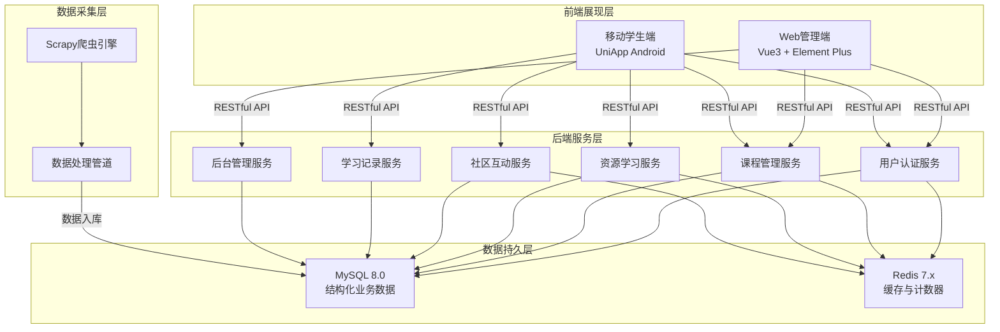

```mermaid
graph TB
    subgraph 前端展现层
        A1[Web管理端<br/>Vue3 + Element Plus]
        A2[移动学生端<br/>UniApp Android]
    end

    subgraph 后端服务层
        B1[用户认证服务]
        B2[课程管理服务]
        B3[资源学习服务]
        B4[社区互动服务]
        B5[学习记录服务]
        B6[后台管理服务]
    end

    subgraph 数据持久层
        C1[MySQL 8.0<br/>结构化业务数据]
        C2[Redis 7.x<br/>缓存与计数器]
    end

    subgraph 数据采集层
        D1[Scrapy爬虫引擎]
        D2[数据处理管道]
    end

    A1 -->|RESTful API| B1
    A1 -->|RESTful API| B2
    A1 -->|RESTful API| B6
    A2 -->|RESTful API| B2
    A2 -->|RESTful API| B3
    A2 -->|RESTful API| B4
    A2 -->|RESTful API| B5
    A2 -->|RESTful API| B1

    B1 --> C1
    B1 --> C2
    B2 --> C1
    B2 --> C2
    B3 --> C1
    B3 --> C2
    B4 --> C1
    B4 --> C2
    B5 --> C1
    B6 --> C1

    D1 --> D2
    D2 -->|数据入库| C1


```

