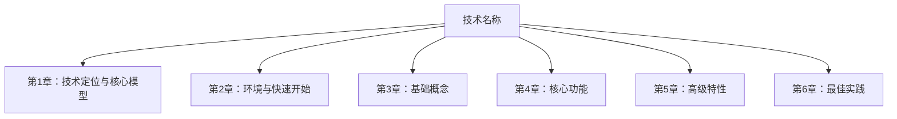

# 输出文档模板

此模板定义了最终输出的完整技术知识文档结构。

---

```markdown
# [技术名称] 知识精要与实战指南

> 资料来源：
> - 官方文档：[官方文档主页 URL]
> - API 文档：[API 文档 URL]
> - 官方仓库：[GitHub 仓库 URL]
> - 核心社区：[社区资源说明]
>
> 目标版本：[版本号]
> 适合人群：[初学者/中级/高级]
> 生成时间：[YYYY-MM-DD]

---

## 知识体系总览



**章节导航**：
1. [技术定位与核心模型](#第1章-技术定位与核心模型)
2. [环境与快速开始](#第2章-环境与快速开始)
3. [基础概念](#第3章-基础概念)
4. ...
5. ...

---

## 第1章 技术定位与核心模型

### 核心知识点
[按照 chapter-template.md 的结构展开]

### 章节题目（≥10道）
[...]

### 项目常用场景
[...]

### 易混淆知识点
[...]

### 常见陷阱与坑点
[...]

### 实践信号
[...]

---

## 第2章 环境与快速开始

[按照上述结构展开]

---

## ...（更多章节）

---

## 费曼总结

> 用简单通俗的语言重新解释本技术的核心概念

### 核心概念类比

[用一个生活中的类比来解释该技术的核心概念]

### 一句话总结

[用一句话概括这项技术的本质]

### 关键要点回顾

1. [核心要点1]
2. [核心要点2]
3. [核心要点3]

---

## 综合实践问题（3题）

> 跨章节综合应用，检验对技术的整体理解

### 问题1：[问题标题]

**问题描述**：
[详细的跨章节综合问题]

**涉及章节**：[列出需要综合运用的章节]

**解题思路**：
- 步骤1：[第一步分析]
- 步骤2：[第二步分析]
- ...

**参考答案要点**：
- [关键答案点1]
- [关键答案点2]

---

### 问题2：[问题标题]

[同上结构]

---

### 问题3：[问题标题]

[同上结构]

---

## 该领域最难挑战（5题）

> 该技术领域最深入、最复杂的问题，需要投入大量时间精力攻克

### 挑战1：[挑战标题]

**挑战描述**：
[详细的深度问题描述]

**难度等级**：⭐⭐⭐⭐⭐

**涉及知识点**：
- [深层知识点1]
- [深层知识点2]

**解决方向**：
- [解决思路1]
- [解决思路2]

**推荐资源**：
- [官方文档/论文/专家文章链接]

**预计攻克时间**：[小时/天]

---

### 挑战2：[挑战标题]

[同上结构]

---

### 挑战3：[挑战标题]

[同上结构]

---

### 挑战4：[挑战标题]

[同上结构]

---

### 挑战5：[挑战标题]

[同上结构]

---

## 学习检查清单

完成本文档学习后，你应该能够：

- [ ] [具体能力1]
- [ ] [具体能力2]
- [ ] [具体能力3]
- [ ] [具体能力4]
- [ ] [具体能力5]

---

## 进一步学习资源

### 官方资源
- [官方文档](链接)
- [官方教程](链接)
- [API 参考](链接)

### 社区资源
- [推荐书籍]
- [推荐课程]
- [技术博客]

### 实战项目
- [推荐项目1]
- [推荐项目2]

---

**文档版本**：v1.0
**最后更新**：[YYYY-MM-DD]
