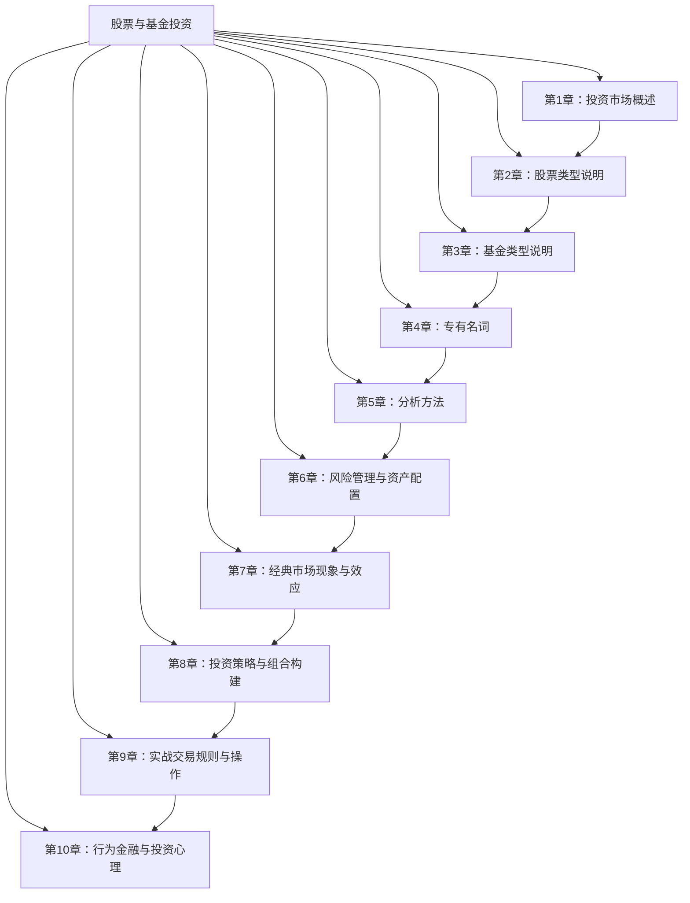

# 股票与基金投资 知识精要与实战指南

> 资料来源：
> - 官方监管机构：中国证监会 http://www.csrc.gov.cn/、上交所 http://www.sse.com.cn/、深交所 http://www.szse.cn/、北交所 http://www.bse.cn/
> - 港美股监管：港交所 https://www.hkex.com.hk/、美国 SEC https://www.sec.gov/
> - 行业组织：中国证券投资基金业协会 https://www.amac.org.cn/、中证指数公司 https://www.csindex.com.cn/
> - 国际权威：CFA Institute https://www.cfainstitute.org/、GARP（FRM）https://www.garp.org/
> - 核心社区：雪球 https://xueqiu.com/、天天基金网 https://fund.eastmoney.com/、晨星网 https://www.morningstar.cn/
>
> 目标版本：2026年7月（含2026年7月6日交易新规）
> 适合人群：初学者至中级投资者
> 生成时间：2026-07-07

---

## 知识体系总览

**章节导航**：
1. [投资市场概述](#第1章-投资市场概述) — 金融市场功能、主要交易所、A股/港股/美股特点、参与者与监管
2. [股票类型说明](#第2章-股票类型说明) — 普通/优先股、市值划分、价值/成长股、ST股、行业分类
3. [基金类型说明](#第3章-基金类型说明) — 开放/封闭、ETF/LOF、主动/被动、QDII、FOF/TDF
4. [专有名词](#第4章-专有名词) — PE/PB/ROE、DCF/DDM、Alpha/Beta、除权除息、安全边际
5. [分析方法](#第5章-分析方法) — 基本面/技术/量化、杜邦分析、估值方法、龙虎榜
6. [风险管理与资产配置](#第6章-风险管理与资产配置) — MPT/CAPM、VaR、风险平价、夏普比率
7. [经典市场现象与效应](#第7章-经典市场现象与效应) — 动量/反转、PEAD、一月效应、黑天鹅、反身性
8. [投资策略与组合构建](#第8章-投资策略与组合构建) — 价值/成长/指数、核心-卫星、全天候、耶鲁模式
9. [实战交易规则与操作](#第9章-实战交易规则与操作) — 开户、T+1、涨跌停、港股通、融资融券、税收
10. [行为金融与投资心理](#第10章-行为金融与投资心理) — 前景理论、处置效应、确认偏误、羊群效应

**学习路径建议**：
- **新手入门**：按 1→2→3→4→9 顺序学习，先建立基础概念与交易常识
- **进阶深化**：再学 5→6→7，掌握分析方法与风险管理
- **实战应用**：最后学 8→10，构建投资策略并克服行为偏差

---

## 第1章 投资市场概述

> 生成时间：2026-07-07 ｜ 知识来源：证监会投教、上交所/深交所/北交所官网、HKEX、SEC、中证指数公司、雪球/知乎社区

---

## 核心知识点

### 1. 金融市场的定义与四大基本功能

**概念解释**：金融市场是资金盈余方与资金短缺方通过金融工具进行交易、实现资金融通的场所与机制的总和。它不仅是一个物理或虚拟场所，更是一套包括交易规则、清算结算、信息披露在内的制度体系。

**四大功能**：
1. **资金融通**：把社会闲散资金配置给最有效率的实体。例如 2023 年 A 股 IPO 募资 3567.39 亿元（来源：证监会统计），直接支持了实体企业融资。
2. **价格发现**：通过竞价撮合形成公允价格，反映市场对资产价值的预期。
3. **风险管理**：提供衍生品（期权、期货）等对冲工具。
4. **流动性提供**：让投资者能以较低成本买卖资产，二级市场流动性越高，资产价格越接近内在价值。

**基本用法/示例**：投资者通过证券账户在二级市场买入 600519（贵州茅台），交易撮合后由中国证券登记结算公司完成清算交收，T+1 日完成股份到账。

**注意事项**：流动性 ≠ 价值。流动性高的资产也可能被高估，需结合估值指标判断。

---

### 2. 一级市场与二级市场的区别

**概念解释**：
- **一级市场（发行市场 / Primary Market）**：证券首次发行的市场，即发行人向投资者出售新证券。包括 IPO、增发、配股。
- **二级市场（流通市场 / Secondary Market）**：已发行证券在投资者之间转让交易的市场，即证券交易所/场外市场。

**核心作用**：
- 一级市场解决"企业从无到有融资"问题；
- 二级市场解决"投资者持有后如何退出"问题，二级市场的价格反向影响一级发行定价。

**基本用法/示例**：
- 一级市场：某公司以发行价 25.5 元/股 IPO 募集资金；
- 二级市场：上市首日该股票以 30.6 元开盘，散户在二级市场买入。

**注意事项**：一级市场定价常参考可比公司二级市场市盈率，使用公式：

$$P_{\text{IPO}} = EPS \times P/E_{\text{可比}}$$

若可比公司二级市场 P/E 被高估，则 IPO 定价亦会被高估，需警惕"发行泡沫"。

---

### 3. 主要交易所概览

**概念解释**：交易所是组织证券交易、提供撮合与清算的受监管平台。

**境内主要交易所**：

| 交易所 | 简称 | 成立时间 | 主要板块 | 官网 |
|--------|------|---------|---------|------|
| 上海证券交易所 | 上交所 SSE | 1990.11.26 | 主板、科创板 | http://www.sse.com.cn |
| 深圳证券交易所 | 深交所 SZSE | 1990.12.1 | 主板、创业板 | http://www.szse.cn |
| 北京证券交易所 | 北交所 BSE | 2021.9.2 | 创新型中小企业 | http://www.bse.cn |
| 香港交易所 | 港交所 HKEX | 2000.3.6 | 主板、GEM | https://www.hkex.com.hk |

**境外主要交易所**：

| 交易所 | 主要特点 | 官网 |
|--------|---------|------|
| 纽约证券交易所 NYSE | 全球市值最大，蓝筹为主 | https://www.nyse.com |
| 纳斯达克 NASDAQ | 科技股云集，做市商制度 | https://www.nasdaq.com |
| 东京证交所 TSE | 亚太第二大 | https://www.jpx.co.jp |
| 伦敦证交所 LSE | 国际化程度高 | https://www.londonstockexchange.com |

**核心作用**：交易所是市场流动性的核心载体，决定交易规则、信息披露标准、上市门槛。

**注意事项**：北交所是服务"专精特新"中小企业的全国性证券交易所，与新三板创新层存在联动机制（详见北交所官网"市场概况"），不要与场外市场混淆。

---

### 4. A股、B股、H股、N股、S股的区别

**概念解释**（按注册地与交易币种区分）：

- **A股**：境内注册、境内上市、人民币认购交易。例如 600519 贵州茅台。
- **B股**：境内注册、境内上市、外币认购。沪市 B 股以美元交易（如 900901），深市 B 股以港币交易（如 200002）。
- **H股**：境内注册、**香港**上市。如 02318 中国平安（H 股）、0700 腾讯控股属红筹而非 H 股。
- **N股**：境内企业在美国纽约上市。如 2015 年之前 91 家中概股在 NYSE 挂牌。
- **S股**：境内企业在新加坡上市。

**核心作用**：股票类别区分决定了适用的法律、会计准则与监管框架。

**基本用法/示例**：
- A+H 股公司如工商银行（A 股 601398、H 股 01398），两地上市；
- 通过 A/H 股溢价指数（恒生 AH 股溢价指数 HSAHP）可判断两地估值差。

**注意事项**：B 股市场流动性差、融资功能弱化，2014 年起"纯 B 转 H"或"转 A"案例增多（如 2015 年新城 B 股转 A）。

---

### 5. 美股市场特点

**特点**：
1. **T+0 交易**：允许日内回转交易，但现金账户受"资金未交收"限制，融资账户受 PDT（Pattern Day Trader）规则约束：25,000 美元为最低资产门槛。
2. **无涨跌停**：但设有市场熔断机制（Circuit Breaker）：
   - 7% 下跌（Level 1）、13%（Level 2）：暂停 15 分钟；
   - 20%（Level 3）：当日停盘。
3. **机构为主**：截至 2023 年末，机构投资者持有标普 500 市值约 80%（来源：SIFMA）。
4. **做市商制度**：NYSE 设计苏必利尔补充流动性提供者（SLP）；NASDAQ 全电子化。

**基本用法/示例**：2020 年 3 月，新冠疫情下美股 10 天内 4 次触发熔断，标普 500 单日最大跌幅 12%。

**注意事项**：美股"无涨跌停"意味着单日波动可能极大，风险管理需借助期权对冲。

---

### 6. 港股市场特点

**特点**：
1. **T+0 交易、T+2 交收**：当日可多次买卖，但资金交收延后两个交易日。
2. **无涨跌停**：但设有市场波动调节机制（VCM），适用于恒生指数及恒生国企指数成分股。
3. **外资为主**：港股市场中境外投资者交易占比超 40%（来源：HKEX 现金市场交易调查 2022）。
4. **可做空**：设有合法卖空名单，约 700 余只可卖空证券。
5. **以港币计价**，但 H 股公司财务报表多为人民币。

**基本用法/示例**：恒生指数由 80 只成分股构成（2024 年起调整），采用流通市值加权。指数点位计算公式：

$$HSI_t = HSI_{t-1} \times \frac{\sum_{i=1}^{n} P_{i,t} \times Q_{i,t} \times F_{i,t}}{\sum_{i=1}^{n} P_{i,t-1} \times Q_{i,t} \times F_{i,t}}$$

其中 $P$ 为股价、$Q$ 为流通股数、$F$ 为流通系数。

**注意事项**：港股"仙股"（股价低于 0.1 港元）数量众多，低价不等于便宜，估值需以 P/B、P/E、ROE 等指标衡量。

---

### 7. A股市场特点

**特点**：
1. **T+1 交易**：1995 年 1 月 1 日起实施，当日买入次日方可卖出。
2. **涨跌停板**：
   - 主板 ±10%（ST/ST* ±5%）
   - 创业板、科创板 ±20%（自 2020 年 8 月 24 日）
   - 北交所 ±30%
3. **散户占比高**：A 股散户贡献成交量超 70%（来源：上交所统计年鉴 2022）。
4. **价格优先、时间优先**：连续竞价 + 集合竞价（开盘 9:20-9:25 为集合竞价，9:30 后连续竞价，14:57-15:00 收盘集合竞价）。前10分钟定开盘价格，最后3分钟定收盘价格
5. **交易单位 100 股**（科创板 200 股起、北交所 100 股起）。

**基本用法/示例**：某股收盘价 10 元，下一交易日涨停价 = 10 × (1+10%) = 11 元（四舍五入至 0.01 元）。

**注意事项**：A 股"打新"几乎稳赚不赔的现象在注册制下已被打破，2022 年以来首日破发率显著上升。

---

### 8. 注册制与核准制的区别

**概念解释**：
- **核准制**：证监会设发审委，对发行人进行实质性审核（合规性 + 持续盈利能力），决定是否同意发行。
- **注册制**：交易所审核、证监会注册，强调"信息披露真实准确完整"，不对投资价值作实质判断。

**时间线**：
- 2019.7.22：科创板注册制试点开市；
- 2020.8.24：创业板注册制改革；
- 2021.11.15：北交所开市（注册制）；
- **2023.2.17**：证监会发布全面实行股票发行注册制相关制度规则，A 股进入全面注册制时代。

**核心作用**：注册制把"市场的事交给市场"，审核效率提升、IPO 周期缩短、定价市场化。

**注意事项**：注册制下"壳价值"快速贬值，炒小、炒差、炒新的传统策略风险大幅上升。

---

### 9. 主要指数（境内）

**派许加权综合价格指数公式**（多数 A 股指数采用）：

$$I_t = I_{t-1} \times \frac{\sum_{i=1}^{n} P_{i,t} \times Q_{i,t}}{\sum_{i=1}^{n} P_{i,t-1} \times Q_{i,t}}$$

| 指数 | 代码 | 基日/基点 | 样本数 | 特点 |
|------|------|-----------|--------|------|
| 上证综指 | 000001 | 1990.12.19 / 100 | 全部上交所上市 | 总市值加权，含 B 股 |
| 深证成指 | 399001 | 1994.7.20 / 1000 | 500 只 | 自由流通市值加权 |
| 沪深 300 | 000300 | 2004.12.31 / 1000 | 300 只 | 大中盘代表，期指标的 |
| 中证 500 | 000905 | 2004.12.31 / 1000 | 500 只 | 中小盘代表 |
| 创业板指 | 399006 | 2010.5.31 / 1000 | 100 只 | 创业板龙头 |
| 科创 50 | 000688 | 2019.12.31 / 1000 | 50 只 | 科创板龙头 |
| 上证 50 | 000016 | 2003.12.31 / 1000 | 50 只 | 超大盘代表 |

**注意**：上证综指采用"总市值加权"且包含大量国有大股本，金融股权重高、对市场代表性存在偏差，不宜单凭其涨跌判断"市场"整体表现，建议结合沪深 300、中证全指（000985）综合观察。

---

### 10. 全球主要指数

| 指数 | 区域 | 特点 | 官网 |
|------|------|------|------|
| 标普 500 | 美国 | 500 家美国大市值公司，全球股市基准 | https://www.spglobal.com/spdji |
| 纳斯达克 100 | 美国 | 100 家非金融类科技龙头 | https://www.nasdaq.com |
| 道琼斯工业平均指数 | 美国 | 30 只蓝筹股，价格加权 | https://www.dowjones.com |
| 恒生指数 | 香港 | 80 只成分股（2024 起扩容） | https://www.hsi.com.hk |
| 富时 100 | 英国 | 100 家伦敦上市大公司 | https://www.ftse.com |
| MSCI 新兴市场指数 | 全球 | 24 个新兴市场国家股票 | https://www.msci.com |
| 日经 225 | 日本 | 价格加权，225 只 | https://indexes.nikkei.co.jp |

**基本用法**：MSCI 新兴市场指数是被动资金跟踪基准，A 股纳入因子 2018 年起逐步提升至 20%（2019.11），被动增量资金可达数千亿元。

---

### 11. 市场参与者

**类别**：
1. **个人投资者（散户）**：A 股户数超 2.2 亿（中国结算 2023 数据）。
2. **机构投资者**：公募基金（管理规模 2024Q1 约 29.6 万亿元）、私募、保险、社保、QFII/RQFII。
3. **QFII（合格境外机构投资者）**：2003 年启动，需外汇额度审批。
4. **RQFII（人民币合格境外机构投资者）**：以人民币投资境内证券。
5. **北向资金**：通过沪深港通进入 A 股的境外资金，2014.11.17 沪港通、2016.12.5 深港通开通，2024 年 8 月起取消额度限制。
6. **做市商**：科创板、北交所引入做市制度（2023.2.20 科创板做市正式开闸）。

**基本用法/示例**：北向资金单日净流入超 100 亿元常被视为市场情绪转暖信号，但需结合行业流向与持仓占比，单一指标易被市场情绪放大。

**注意事项**：北向资金"聪明钱"叙事存在过度解读风险，部分交易日存在"对倒"或被动指数调仓带来的非主动买卖。

---

### 12. 监管机构

**境内监管体系**：

| 机构              | 职责                          | 官网                      |
| --------------- | --------------------------- | ----------------------- |
| 中国证监会 CSRC      | 证券期货市场监管                    | http://www.csrc.gov.cn  |
| 中国人民银行 PBOC     | 货币政策、宏观审慎                   | http://www.pbc.gov.cn   |
| 国家金融监督管理总局 NFRA | 银行、保险、信托（原银保监会职责，2023.5 改组） | https://www.nfra.gov.cn |
| 国家外汇管理局 SAFE    | 外汇管理（QFII 额度等）              | https://www.safe.gov.cn |

**境外监管机构**：

| 机构 | 区域 | 官网 |
|------|------|------|
| SEC | 美国 | https://www.sec.gov |
| SFC | 香港 | https://www.sfc.hk |
| FCA | 英国 | https://www.fca.org.uk |
| ESMA | 欧盟 | https://www.esma.europa.eu |

**注意事项**：跨境投资时，A 股受证监会监管、H 股受 SFC 监管、中概股同时受 SEC 与 PCAOB 审计监管（2022.8《审计监管合作协议》解决退市风险）。

---

### 13. 证券登记结算机构

| 机构 | 服务范围 | 官网 |
|------|---------|------|
| 中国证券登记结算公司 CSDC（中登公司） | A 股、B 股、基金登记托管 | http://www.chinaclear.cn |
| 香港中央结算公司 CCASS | 港股登记结算 | https://www.hkex.com.hk/CCASS |
| 美国证券存托信托公司 DTC | 美股清算 | https://www.dtcc.com |

**核心作用**：登记结算机构是"证券中央存管者（CSD）"，负责证券过户、权益分派、股东名册维护，是市场后台"基础设施"。

**注意事项**：A 股投资者通过证券公司在中登公司开立"证券账户"，但股份实际托管在证券公司，证券公司破产时存在"挪用风险"——故中国引入"第三方存管"制度，资金存放于银行而非券商。

---

## 章节题目（共 12 道）

### 面试题

#### 1.（基础 / 券商研究部面试）
**题目**：请说明 A 股、B 股、H 股三者的区别，并解释"A+H 股溢价"现象的可能原因。
**来源**：某头部券商研究部 2023 年校招真题
**答案**：
- A 股：境内注册、境内上市、人民币交易；
- B 股：境内注册、境内上市、外币（沪市 USD，深市 HKD）交易；
- H 股：境内注册、香港上市、港币交易。
A+H 股溢价通常 A 股高于 H 股（恒生 AH 股溢价指数长期 > 100），原因：① 资本账户管制导致两地投资者不同；② A 股流动性溢价与情绪溢价；③ 利率环境与汇率预期差异；④ 行业偏好不同（A 股偏好消费科技、H 股偏好金融地产）。
**考点**：股票类别 + 跨市场估值差异

#### 2.（进阶 / 公募基金公司面试）
**题目**：沪深 300 与中证 500 在编制方法上有何差异？为什么机构常用"沪深 300 + 中证 500"作为业绩基准？
**来源**：某公募基金量化岗 2024 年面试题
**答案**：沪深 300 与中证 500 均为自由流通市值加权。沪深 300 取沪深两市市值、流动性排名前 300 名；中证 500 则在剔除沪深 300 样本后取市值排名 301-800 名。两者合并覆盖市值前 800 名（约占 A 股总市值 70%+），既有大盘价值、又有中盘成长，行业分布更均衡，故常用作"风格中性"基准。
**考点**：指数编制 + 基准选择逻辑

---

### 论坛题

#### 3.（进阶 / 雪球热帖）
**题目**：为什么上证综指 3000 点"反复拉锯"，而沪深 300、中证全指早已显著上涨？
**来源**：雪球话题"上证指数失真"
**答案**：上证综指采用**总市值加权**且包含 B 股与大量未流通国有股本，金融、传统周期股权重高，且包含退市样本历史；新经济龙头（如腾讯、宁德时代早期）多在深交所或港交所。沪深 300 采用自由流通市值加权、定期调整，更能反映可投资市值。因此"指数失真"≠ 市场无机会，应使用沪深 300、中证全指（000985）、wind 全 A 指数综合判断。
**考点**：指数编制差异 + 市场代表性

#### 4.（基础 / 知乎问答）
**题目**：港股那么便宜，是不是被严重低估，可以无脑买入？
**来源**：知乎"港股估值"话题
**答案**：港股估值低有结构性原因：① 外资主导，新兴市场风险溢价高；② 流动性差，流动性折价；③ 周期股、金融股占比高；④ 部分小市值公司治理差。"便宜"必须以 P/E、P/B、股息率、ROE 等相对指标衡量，且要剔除"价值陷阱"——低估值但 ROE 持续下行、商誉减值、关联交易频繁的标的可能"长期低估"。
**考点**：估值方法论 + 价值陷阱

---

### 期末/认证题

#### 5.（基础 / CFA Level I）
**题目**：Primary market vs secondary market, which of the following is TRUE?
A. IPO is a secondary market transaction
B. Seasoned equity offering belongs to primary market
C. Secondary market has no impact on primary market pricing
**来源**：CFA Level I 模拟题
**答案**：B。SEO（增发）属于一级市场，企业新发股票融资。二级市场影响一级定价（可比公司估值法），故 C 错。
**考点**：一二级市场概念辨析

#### 6.（进阶 / 中国基金从业资格考试）
**题目**：关于 QFII 与 RQFII 的描述，下列哪项正确？
A. QFII 使用人民币投资，RQFII 使用外币
B. RQFII 发行地为香港，可募集人民币投资境内证券
C. 两者均无额度限制
**来源**：基金从业《证券投资基金》真题
**答案**：B。QFII 以外币投资、RQFII 以离岸人民币投资。2019 年起国家外汇管理局取消 QFII/RQFII 额度限制，但需备案，故 C 错。
**考点**：QFII/RQFII 制度

#### 7.（基础 / CPA 财务成本管理）
**题目**：某 A+H 股公司年报披露：A 股股本 50 亿股，H 股 10 亿股，净利润 60 亿元。计算每股收益并判断两地股价是否应相等。
**来源**：CPA 真题改编
**答案**：EPS = 60 / (50+10) = 1.0 元/股（按合并报表口径）。两地股价理论上应相等（同股同权同收益），但实际受资本管制、流动性、汇率、风险偏好差异影响，A 股常高于 H 股。
**考点**：EPS 计算 + 一价定律失效

---

### 官网题

#### 8.（进阶 / 上交所投教）
**题目**：科创板盘后固定价格交易是什么？交易时间和价格如何确定？
**来源**：上交所投资者教育 http://edu.sse.com.cn
**答案**：科创板在 15:05-15:30 开盘盘后固定价格交易，以当日收盘价成交，单笔申报不低于 200 股。该机制为机构大宗交易提供便利，减少收盘竞价冲击。
**考点**：科创板交易机制

#### 9.（基础 / 深交所投资者教育）
**题目**：创业板股票涨跌幅限制是多少？何时开始实施？
**来源**：深交所投资者教育 http://www.szse.cn
**答案**：自 2020 年 8 月 24 日创业板改革并试点注册制起，新上市股票上市前 5 个交易日不设涨跌幅限制，第 6 个交易日起涨跌幅限制为 ±20%。ST 股票仍为 ±5%（注：创业板 ST 为 ±20%）。
**考点**：创业板新规

---

### 实战题

#### 10.（实战 / 渠道选择）
**题目**：内地投资者欲投资港股腾讯（0700.HK）、美股苹果（AAPL）、A 股贵州茅台（600519），各应通过什么渠道？资金门槛和费用如何？
**来源**：实战常见配置问题
**答案**：
- 茅台：直接 A 股账户买卖，佣金万分之一至万分之三；
- 腾讯：通过港股通（沪港通/深港通）买入，门槛 50 万元人民币，免换汇成本（中登结算以港币清算），但有名单限制；或开立港股账户；
- 苹果：通过 QDII 基金（如华夏纳斯达克 100 ETF 513100）间接持有，或开立美股券商账户（如盈透、富途），需 W-8BEN 表格避免 30% 股息税。
**考点**：跨市场投资渠道

#### 11.（实战 / 北向资金分析）
**题目**：某交易日北向资金净流入 200 亿元，是否意味着 A 股必涨？请说明分析框架。
**来源**：实战策略研究
**答案**：不一定。需结合：① 流向行业（流入银行 vs 流入消费含义不同）；② 是否为被动指数调整日（MSCI、富时扩容带来非主动配置）；③ 持仓变化相对存量占比（北向持仓约 2 万亿元，单日 200 亿仅占 1%）；④ 后续 5 日是否出现"先买后卖"对倒；⑤ 汇率预期影响。
**考点**：北向资金解读的局限性

#### 12.（深度 / 注册制影响）
**题目**：全面注册制下，A 股"打新"还能稳赚吗？请从供需、定价、退出三个角度分析。
**来源**：实战策略 + 证监会政策解读
**答案**：注册制下"打新"风险上升：
1. 供给：IPO 数量上升，稀缺性下降；
2. 定价：23 倍市盈率"红线"取消，发行价由询价决定，定价偏高更常见；
3. 退出：上市首日即可融券卖出，多空博弈充分，破发率显著上升（2022-2023 年注册制下首日破发率约 20-30%）。
策略：从"无脑打新"转向"选择性打新"——结合行业景气度、可比估值、发行价折价率参与。
**考点**：注册制改革对市场结构的影响

---

## 项目常用场景

### 场景一：选择券商开户的对比决策

**背景**：投资者准备开户，市场上有传统券商（中信、华泰、海通）和互联网券商（东方财富、华泰涨乐财富通），佣金费率、APP 体验、投顾服务、融资融券利率各异。

**解决方案**：
1. **佣金成本**：2024 年 A 股行业平均佣金约万分之一至万分之三，注意最低 5 元起收；
2. **融资融券利率**：约 5%-8%，资产规模超 50 万可谈判；
3. **APP 与交易工具**：东方财富 APP 综合性强，华泰 MATIC 量化支持好；
4. **服务范围**：是否支持港股通、新三板、科创板；
5. **资产规模门槛**：融资融券 50 万、港股通 50 万、科创板 50 万 + 24 个月经验、北交所 50 万 + 24 个月。

**最佳实践**：先开 1-2 个主账户 + 1 个备用账户（避免单点故障），账户分开承担不同策略（长线 / 短线 / 港股），且开户后第一时间绑定三方存管，确认佣金费率书面约定。

---

### 场景二：跨市场投资（A 股 + 港股 + 美股）的渠道选择

**背景**：高净值投资者希望全球配置，但面临渠道限制、汇率、税务、合规问题。

**解决方案**：

| 市场  | 渠道      | 门槛   | 税务                     | 备注           |
| --- | ------- | ---- | ---------------------- | ------------ |
| A 股 | 直接开户    | 0    | 持有 1 年以上股息红利免税；1 年内阶梯税 | —            |
| 港股  | 港股通     | 50 万 | 股息扣 20%                | 仅名单内标的       |
| 港股  | 香港券商    | 0    | 股息不预扣税                 | 需外汇购汇额度      |
| 美股  | QDII 基金 | 0    | 基金内部扣                  | 申赎费用 1%-1.5% |
| 美股  | 美股券商    | 0    | W-8BEN：股息 10%、资本利得不税   | 需申报 CRS      |

**最佳实践**：
1. 资金量 < 50 万：以 QDII 基金为主（如纳斯达克 100 ETF、恒生 ETF），门槛低；
2. 资金量 50-500 万：港股通 + QDII 结合；
3. 资金量 > 500 万：可考虑直接海外账户，但需走合规外汇申报路径，每年每人 5 万美元购汇额度需谨慎规划；
4. 务必保留完税凭证，符合 CRS 自动信息交换要求。

---

### 场景三：通过北向资金流向判断市场情绪

**背景**：北向资金被视作"聪明钱"，市场关注其每日净流入/流出。但简单跟随常失效，需建立分析框架。

**解决方案**：
1. **看绝对额**：单日 > 100 亿净流入为强信号；连续 5 日净流入累计 > 300 亿为持续性信号；
2. **看行业分布**：通过东方财富 / Wind 查询当日北向流入行业 top5，若集中在金融地产则可能为低估值配置；若集中在消费科技则可能为成长风格切换；
3. **看持仓变化**：北向持股占流通市值比 > 5% 的标的，对其个股影响大；
4. **剔除被动调仓**：MSCI、富时扩容日（如 5 月、8 月、11 月）有大量被动配置资金，不应视为主动行为；
5. **结合汇率与美债收益率**：人民币升值 + 美债收益率下行时北向流入更可持续。

**最佳实践**：北向资金是"参考"而非"信号"，单一日数据噪声大，应看 5 日、20 日、60 日移动平均，且与 A 股行业景气度、估值分位数交叉验证。

---

## 易混淆知识点

### 1. 核准制 vs 注册制

| 维度     | 核准制           | 注册制                   |
| ------ | ------------- | --------------------- |
| 审核主体   | 证监会发审委        | 交易所审核 + 证监会注册         |
| 审核内容   | 实质性（含盈利能力判断）  | 信息披露真实性、准确性、完整性       |
| IPO 周期 | 2-3 年         | 6-12 个月               |
| 定价     | 23 倍市盈率"红线"   | 询价市场化                 |
| 退市效率   | 低             | 高（财务类、交易类、重大违法类）      |
| 实施时间   | 2000-2019（主板） | 2019 起科创板试点，2023.2 全面 |

### 2. 主板 vs 创业板 vs 科创板 vs 北交所

| 维度 | 主板 | 创业板 | 科创板 | 北交所 |
|------|------|--------|--------|--------|
| 服务对象 | 大中型蓝筹 | 创新型成长企业 | 硬科技 | 专精特新中小企业 |
| 上市标准 | 持续盈利 / 市值+营收+研发 | 多套标准 | 5 套市值标准 | 创新层挂牌满 12 个月 |
| 涨跌幅 | ±10% | ±20%（新上市前 5 日不设） | ±20%（前 5 日不设） | ±30%（前 5 日不设） |
| 交易单位 | 100 股 | 100 股 | 200 股起 | 100 股起 |
| 投资者门槛 | 无 | 24 个月经验 | 50 万 + 24 个月 | 50 万 + 24 个月 |
| 注册制 | 2023 起 | 2020.8 起 | 2019.7 起 | 2021.11 起 |

### 3. A股 vs B股 vs H股

| 维度 | A股 | B股 | H股 |
|------|-----|-----|-----|
| 注册地 | 境内 | 境内 | 境内 |
| 上市地 | 上交所/深交所 | 上交所/深交所 | 香港交易所 |
| 交易币种 | 人民币 | 沪：USD；深：HKD | 港币 |
| 投资者 | 境内为主 | 境外为主 | 全球 |
| 流动性 | 高 | 极低 | 中高 |
| 会计准则 | CAS | CAS | HKFRS/IFRS |

### 4. QFII vs RQFII vs 沪深港通

| 维度 | QFII | RQFII | 沪深港通 |
|------|------|-------|---------|
| 投资货币 | 外币 | 离岸人民币 | 港币（北向） |
| 额度 | 已取消（2019） | 已取消 | 2024.8 取消 |
| 投资范围 | 较广 | 较广 | 名单内标的 |
| 准入门槛 | 机构资质审批 | 机构资质审批 | 机构或个人均可 |
| 税务 | 资本利得暂免 | 同左 | 同左 |

---

## 常见陷阱与坑点

### 1. 把上证综指当作 A 股整体代表

- **现象**："A 股十年还在 3000 点"的论调广泛流传。
- **原因**：上证综指采用总市值加权，包含未流通国有大股本和金融股权重高（约 30%），且未及时反映深市新经济龙头，存在失真。
- **解决方案**：使用沪深 300、中证全指（000985）、wind 全 A 综合判断；以"全收益指数"（含分红再投资）观察真实回报。
- **预防措施**：建立多指数交叉验证习惯，警惕单指数叙事。

### 2. 混淆"新股申购"与"新股上市首日"

- **现象**：以为中签后即可当天卖出获利。
- **原因**：混淆"申购缴款"与"上市交易"。A 股 T+1 制度下，申购中签后需 T+2 缴款，T+3 上市后才能卖出。
- **解决方案**：明确流程：T 日申购 → T+1 公布中签 → T+2 16:00 前缴款 → T+3~5 上市 → 上市后卖出。
- **预防措施**：打新前确认申购资金、缴款日历，避免中签未缴款导致"12 个月内 3 次弃购被限"。

### 3. 误以为港股便宜就是被低估

- **现象**："市盈率只有 5 倍，肯定被低估"。
- **原因**：忽略港股结构性折价——流动性差、外资风险溢价、行业结构、治理问题、汇率风险。
- **解决方案**：横向比较 P/E、P/B、股息率、ROE、PEG，纵向比较历史分位数；剔除"价值陷阱"——ROE 持续下行、商誉减值、关联交易频繁的公司。
- **预防措施**：以 ROIC > WACC 为筛选门槛：

$$\text{价值创造} = ROIC - WACC > 0$$

### 4. 忽视 ST 股的特殊风险

- **现象**：因 ST 股低价、波动大而追涨。
- **原因**：不了解 ST/*ST 的含义（财务异常 / 退市风险警示）和退市新规。
- **解决方案**：2020 年 12 月退市新规后，财务类退市指标包括：扣非前后孰低净利润为负且营收 < 1 亿元（主板）；财务造假触发重大违法类退市等。ST 股退市概率显著高于普通股。
- **预防措施**：建立"ST 黑名单"，仅做事件驱动短线，且严控仓位 < 5%、设置止损。

### 5. 不了解退市新规与"面值退市"

- **现象**：持有股价持续低于 1 元的公司，误以为"国家不会让它退市"。
- **原因**：不了解 2020 年退市新规"交易类退市"——连续 20 个交易日收盘价低于 1 元即终止上市（不分主板创业板）。
- **解决方案**：股价接近 1 元时（如 < 1.5 元）启动风险预警，评估公司基本面与回购可能；2022-2023 年面值退市家数占退市总数 40% 以上。
- **预防措施**：组合持仓设置"价格阈值"（如 1.5 元以下自动剔除），定期扫描持仓。

### 6. 把"市场熔断"与"涨跌停板"混淆

- **现象**：误以为 A 股有"市场熔断"。
- **原因**：2016 年 1 月 4 日 A 股曾试行熔断，因"磁吸效应"加剧下跌，1 月 7 日晚紧急废止。
- **解决方案**：A 股当前以个股涨跌停板为主，沪深 300 期指有"非对称涨跌停"（+10%/-10%）；美股有市场熔断（标普 500 三级）。
- **预防措施**：明确区分"个股涨跌停"与"市场熔断"概念，避免套用海外经验。

---

## 实践信号

### 官方进阶文档

- **证监会投资者保护局**：http://www.csrc.gov.cn/pub/newsite/tjjh/ — 学习重点：监管动态、退市新规、注册制改革官方解读
- **上交所投资者教育**：http://edu.sse.com.cn — 学习重点：科创板交易规则、盘后固定价格交易、做市商制度
- **深交所投资者教育**：http://www.szse.cn/investor/index/index.html — 学习重点：创业板注册制改革、ETF 投资指南
- **北交所投教专区**：http://www.bse.cn/investor.html — 学习重点：北交所上市标准、交易规则
- **HKEX 教育频道**：https://www.hkex.com.hk/Education — 学习重点：港股通机制、VCM、市场波动
- **SEC 投资者教育**：https://www.investor.gov — 学习重点：美股 PDT 规则、ADR 机制

### 社区热议话题

- **雪球话题 "上证指数失真"**：讨论上证综指编制改革方向，2020 年 7 月已剔除 ST 样本、纳入科创板 CD
- **东方财富 "北向资金"**：每日资金流向分析，但需警惕"聪明钱"叙事过度解读
- **知乎 "全面注册制"**：政策解读、打新策略变化、退市节奏加速

### 动手验证任务

1. **任务一：对比指数编制**
   登录中证指数公司官网（https://www.csindex.com.cn），下载沪深 300 与中证 500 的样本股权重表，计算两者行业分布差异（金融、消费、科技占比），并验证二者样本是否完全不重叠。

2. **任务二：追溯北向资金数据**
   通过东方财富或 Wind，下载 2023 年 1-12 月北向资金月度净流入数据，标注 MSCI/富时指数调整日（如 5 月、8 月、11 月），剔除被动调仓后观察主动资金流向与沪深 300 月度收益率的相关性。

3. **任务三：核实 A/H 股溢价**
   在恒生指数公司官网（https://www.hsi.com.hk）查询恒生 AH 股溢价指数 HSAHP 历史数据，找出近 5 年最大溢价（>150）和最接近 100 的时间点，分析当时的市场环境（汇率、利率、政策事件）。

---

## 章节小结

投资市场是一个由多层次交易所、多类别股票、多元参与者和多重监管构成的复杂生态系统。理解市场结构（一/二级市场、A/B/H 股）、交易制度（T+N、涨跌停、注册制）与指数体系（市值加权、自由流通市值加权）是构建任何投资策略的地基；而警惕"指数失真"、"低估陷阱"、"退市风险"则是穿越牛熊的护栏。

## 第2章 股票类型说明

> 生成时间：2026-07-07 ｜ 知识来源：中证指数公司、申万宏源行业分类、深交所/上交所规则、HKEX、SEC、雪球/知乎社区

---

## 核心知识点

### 1. 普通股 vs 优先股

**概念解释**：
- **普通股（Common Stock）**：享有公司经营参与权（投票权）、利润分配权（按分红政策）、剩余财产分配权（清算时排在最后）。A 股市场以普通股为主。
- **优先股（Preferred Stock）**：不参与经营决策（通常无投票权），享有固定股息分配权，清算顺序优先于普通股但次于债权人。

**核心作用**：优先股是介于债与股之间的混合工具，满足银行等资本充足率补充需求。2014 年起 A 股允许境内非上市公众公司发行优先股。

**基本用法/示例**：
- 工商银行（601398）2014 年发行优先股"工行优 1"，票面股息率 6%（基准利率 + 利差）；
- 优先股股息计算：

$$D_{\text{preferred}} = \text{面值} \times \text{股息率}$$

**注意事项**：优先股股息通常不可累积（除非约定累积型），且税收上视同股息（A 股持有 1 年以上免征个人所得税）；但优先股一般不在公开二级市场流通，流动性差。

---

### 2. 国有股、法人股、流通股、限售股

**概念解释**（按股权分置改革后状态）：
- **国有股**：代表国家行使所有权的股份，由国资委体系或财政部持有；
- **法人股**：企业法人或事业法人持有的股份；
- **流通股**：可在二级市场自由交易的股份；
- **限售股**：因IPO、定向增发、股权激励等原因在一定期限内不得转让的股份。

**核心作用**：股权分置改革（2005-2007 年）解决了"同股不同权、同股不同价"问题，统一了 A 股流通体系。

**基本用法/示例**：限售股解禁公式——解禁后流通股数：

$$Q_{\text{流通}, t} = Q_{\text{流通}, t-1} + \sum_{i} \Delta Q_{i, \text{解禁}}$$

**注意事项**：限售股解禁常带来"解禁冲击"——供给增加、价格承压。需关注"解禁比例"（解禁量 / 流通股本），> 20% 时通常需要警惕。

---

### 3. A股、B股、H股、N股、S股、ADR、GDR

**概念解释**：
- A 股 / B 股 / H 股 / N 股 / S 股 见第1章；
- **ADR（American Depositary Receipt，美国存托凭证）**：美国银行发行的代表外国股票的存托凭证，使境内企业可在美上市。如阿里巴巴 BABA（2014 美国上市）即为 ADR；
- **GDR（Global Depositary Receipt，全球存托凭证）**：在伦敦、卢森堡等全球市场发行的存托凭证。

**核心作用**：ADR/GDR 解决跨境交易、清算、税务问题，使投资者无需直接持有外国股票即可参与。

**基本用法/示例**：中欧 GDR 自 2022 年起在瑞交所发行，如 2022 年 7 月"科达制造 GDR"，让欧洲投资者可分享中国资产。

**注意事项**：ADR 退市（如 2022 年部分中概股"主动退美"）需关注 SEC"外国公司问责法" HFCAA 风险与 VIE 结构合规性。

---

### 4. 大盘股 / 中盘股 / 小盘股

**市值划分标准**（主流券商常用）：

| 类别 | 市值区间（人民币） | 代表指数 |
|------|---------------------|---------|
| 超大盘 | > 5000 亿 | 上证 50 |
| 大盘 | 1000-5000 亿 | 沪深 300 |
| 中盘 | 200-1000 亿 | 中证 500 |
| 小盘 | 50-200 亿 | 中证 1000 |
| 微盘 | < 50 亿 | 中证 2000 |

**核心作用**：市值大小反映公司规模与流动性，影响机构配置能力——大资金难以重仓微盘股。

**基本用法/示例**：市值计算公式：

$$\text{市值} = P \times Q_{\text{总股本}}$$
$$\text{流通市值} = P \times Q_{\text{流通股本}}$$

**注意事项**：小盘股流动性溢价与估值高，但波动大、退市风险高；2024 年初微盘股暴跌（量化踩踏）即为风险案例。

---

### 5. 蓝筹股、白马股、成长股、价值股、周期股、防御股

**概念解释**：
- **蓝筹股**：市值大、行业龙头、长期盈利稳定、分红良好。如工商银行、中国平安、贵州茅台。
- **白马股**：长期业绩优良、信息披露透明、ROE 持续高位（> 15%）。如格力电器、伊利股份。
- **成长股**：营收/利润增速显著高于行业均值。如宁德时代（2018-2022 年营收 CAGR > 50%）。
- **价值股**：低 P/E、低 P/B、高股息率。如银行、地产、公用事业。
- **周期股**：业绩随宏观经济周期波动。如钢铁、有色、煤炭、券商。
- **防御股**：业绩受经济周期影响小，弹性低。如食品饮料、医药、公用事业。

**核心作用**：股票风格分类是构建组合、风格配置的基础，决定投资策略选择。

**基本用法/示例**：常用风格判断指标：
- 成长指标：营收增速 $g_{\text{rev}}$、净利润增速 $g_{\text{profit}}$；
- 价值指标：

$$P/E = \frac{P}{EPS}, \quad P/B = \frac{P}{BVPS}, \quad \text{股息率} = \frac{DPS}{P} \times 100\%$$

**注意事项**：同一标的在不同周期可能跨风格（如宁德时代 2021 年是成长股、2024 年估值消化后趋近价值股），需动态识别。

---

### 6. 概念股、题材股、龙头股、妖股

**概念解释**：
- **概念股**：基于某主题、技术、政策形成的市场标签，如"AI 概念""新能源概念"；
- **题材股**：基于短期事件炒作，如重组预期、资产注入；
- **龙头股**：行业内市场份额与盈利能力最强的公司，如白酒中贵州茅台、锂电池中宁德时代；
- **妖股**：短期脱离基本面、被资金炒作出现连续涨停的股票。

**核心作用**：识别概念、题材、龙头、妖股有助于判断投资风格——长期价值 vs 短期博弈。

**基本用法/示例**：龙头股通常具备"行业份额 + 龙头溢价 + 抗风险能力"三要素。如白酒行业前 5 名（茅台、五粮液、洋河、汾酒、泸州老窖）合计市占率约 50%。

**注意事项**：概念 ≠ 价值。2023 年"AI 概念"中仅少数公司真正受益，多数为蹭概念炒作，事后股价腰斩。

---

### 7. ST 股、*ST 股、退市整理股

**概念解释**：
- **ST**（Special Treatment）：公司财务状况异常或其他状况异常，被实施特别处理，股票简称前加"ST"；
- **\*ST**：公司存在退市风险警示（财务类退市指标触发任一）；
- **退市整理股**：已决定终止上市，进入 15 个交易日退市整理期，简称前加"退"。

**核心作用**：风险警示制度向投资者提示潜在退市风险。

**基本用法/示例**：退市新规（2020.12.31）财务类退市指标（主板）：
1. 扣非前后孰低净利润为负且营收 < 1 亿元；
2. 最近一年审计净资产为负；
3. 财务报告被出具无法表示意见或否定意见。

**注意事项**：ST 股涨跌幅 ±5%（科创板、创业板 ST 股仍为 ±20%），且融资融券、质押受限；2022-2024 年 A 股退市家数分别为 50、47、52 家（来源：Wind），退市节奏显著加快。

---

### 8. 绩优股、垃圾股、烟蒂股

**概念解释**：
- **绩优股**：长期稳定盈利、ROE 高、分红稳定的公司，是价值投资的核心标的；
- **垃圾股**：业绩持续亏损、财务恶化、存在退市风险的公司；
- **烟蒂股**（Cigar Butt）：股价极度低于账面价值或清算价值，巴菲特早期"捡烟蒂"策略的标的。

**核心作用**：基本面质量分级决定风险收益比。

**基本用法/示例**：烟蒂股筛选标准——

$$\text{净流动资产价值 NCAV} = \text{流动资产} - \text{全部负债}$$

$$\text{买入门槛} = P < \frac{2}{3} \times NCAV$$

**注意事项**：烟蒂股策略在中国 A 股存在"价值陷阱"——公司治理差、商誉减值、关联交易挪用资产，账面资产难以变现。

---

### 9. 红筹股、国企股、民企股（港股概念）

**概念解释**（港股特有）：
- **红筹股**：注册地在境外（开曼、百慕大）、主要业务在中国境内、由中资控股的香港上市公司。如腾讯（0700.HK）、中国移动（0941.HK）。
- **国企 H 股（国企股）**：注册在境内、香港上市的国有企业 H 股。如工商银行 H 股（1398.HK）、中石油 H 股（0857.HK）。
- **民企股**：境内民营企业在港上市。

**核心作用**：港股投资者通过"红筹指数"（恒生香港中资企业指数 HSCCI）追踪中资海外企业表现。

**基本用法/示例**：恒生中国企业指数（HSCEI，即 H 股指数）样本为大型 H 股，包含 50 只成分股；恒生香港中资企业指数样本为红筹股。

**注意事项**：红筹股回归 A 股可通过 CDR（中国存托凭证）或发行 A 股（如 2018 年工业富联、2020 年中芯国际回归科创板）。

---

### 10. 行业分类：申万一级、中信一级、GICS

**主要分类标准**：

| 分类 | 制定机构 | 一级行业数 | 用途 | 官网 |
|------|---------|-----------|------|------|
| 申万行业分类 | 申万宏源 | 31（2021 修订） | A 股主流行业研究基准 | http://www.swsresearch.com |
| 中信行业分类 | 中信证券 | 30 | 中信研究体系 | — |
| GICS | MSCI & S&P | 11 | 全球通用，跨境对比 | https://www.msci.com/gics |
| 证监会行业分类 | 证监会 | 19 类 | 信息披露标准 | http://www.csrc.gov.cn |

**核心作用**：行业分类是行业研究、指数编制、业绩比较基准的基础，决定"可比公司"的选择。

**基本用法/示例**：申万一级行业 2021 年修订为 31 个，包括：农林牧渔、基础化工、钢铁、有色金属、电子、汽车、家用电器、食品饮料、纺织服饰、轻工制造、医药生物、公用事业、交通运输、房地产、商贸零售、社会服务、银行、非银金融、综合、建筑材料、建筑装饰、电力设备、机械设备、国防军工、计算机、传媒、通信、煤炭、石油石化、环保、美容护理。

**注意事项**：不同分类体系口径不同，跨体系比较易产生误差。如宁德时代在申万属"电力设备"、在 GICS 属"工业"。

---

### 11. 主题投资：ESG、新能源、人工智能、消费升级

**概念解释**：主题投资围绕中长期趋势、政策、技术变革形成的投资机会，跨越单一行业。

**主要主题**：
1. **ESG**：环境（E）、社会（S）、治理（G）综合评分筛选，MSCI ESG 评级 AAA 至 CCC；
2. **新能源**：光伏、风电、储能、新能源汽车产业链；
3. **人工智能**：算力（GPU、IDC）、算法（大模型）、应用（AIGC）；
4. **消费升级**：高端白酒、医美、免税、新消费。

**核心作用**：主题投资捕捉结构性机会，与经济周期相关性低。

**基本用法/示例**：主题投资常用 ETF 工具——
- 新能源车 ETF（515030，跟踪中证新能源汽车指数 399976）；
- 半导体 ETF（512480，跟踪中华半导体芯片指数 990001）；
- 人工智能 ETF（515980）。

**注意事项**：主题投资易"炒作阶段→业绩兑现阶段→估值消化阶段"循环，需识别所处阶段。

---

### 12. A+H股、A+G股、双重上市、第二上市

**概念解释**：
- **A+H 股**：同时在 A 股和 H 股上市，如工商银行（A：601398、H：1398）；
- **A+G 股**：同时在 A 股和德国法兰克福上市，如 2022 年起部分公司发行 GDR；
- **双重上市（Dual Listing）**：在两地分别独立上市，股份不互通，如部分港股 + 美股；
- **第二上市（Secondary Listing）**：主要上市地之外的二次上市，股份可互通（如 2019 年阿里港股二次上市）。

**核心作用**：跨市场上市扩大融资渠道、提升国际知名度、规避单一市场政策风险。

**基本用法/示例**：A+H 股溢价指数（恒生 AH 股溢价指数 HSAHP）衡量两地估值差，长期在 110-150 区间。溢价率：

$$\text{溢价率} = \frac{P_A}{P_H \times FX} - 1$$

其中 $FX$ 为人民币兑港币汇率。

**注意事项**：第二上市股份与主要上市地"可互换"，但双重上市不可互换，监管要求、披露标准也不同。

---

## 章节题目（共 12 道）

### 面试题

#### 1.（进阶 / 券商行业研究面试）
**题目**：你覆盖白酒行业，请按"龙头—次高端—三四线"梳理该行业的股票类型，并说明你选股的核心财务指标。
**来源**：某头部券商食品饮料组 2024 年面试题
**答案**：
- 龙头：贵州茅台、五粮液，估值锚，看 P/E 与分红率；
- 次高端：山西汾酒、酒鬼酒、舍得，看增速 $g$ 与 PEG：

$$PEG = \frac{P/E}{g}$$

- 三四线：金种子酒、伊力特，看反转预期与渠道改善。

核心指标：营收增速、净利率、ROIC、预收款（合同负债）变化、经销商数量增速。
**考点**：行业分类 + 选股框架

#### 2.（深度 / 公募基金研究岗面试）
**题目**：为什么 A 股"高送转"长期看是中性事件？请从信号理论、行为金融、基本面三个角度论证。
**来源**：某百亿量化对冲基金面试题
**答案**：
1. **信号理论**：管理层通过高送转传递"成长信心"，但实证表明仅 10 转 10 以上的"超比例送转"才有弱正向信号；
2. **行为金融**：投资者偏好"低价股幻觉"，10 送 10 后股价"看起来便宜"，制造非理性需求；
3. **基本面**：送转不改变公司净资产、净利润、现金流，仅股本扩大、每股指标稀释：

$$EPS_{\text{新}} = \frac{EPS_{\text{旧}}}{1 + \text{送转比例}}$$

实证 2018 年后高送转新规（10 送转 10 需业绩匹配）后"高送转行情"显著降温。
**考点**：行为金融 + 监管制度

---

### 论坛题

#### 3.（基础 / 雪球热帖）
**题目**：什么是"白马股"？白马股也会"暴雷"吗？
**来源**：雪球话题"白马股暴雷"
**答案**：白马股特征：长期 ROE > 15%、信息披露透明、机构持仓高、龙头地位稳固。但会暴雷——典型如康美药业（财务造假）、康得新（122 亿货币资金虚增）、伊利股份（短期舆情）。判断白马股风险需关注：① 经营性现金流与净利润匹配；② 应收账款与存货增速；③ 关联交易占比；④ 商誉减值；⑤ 大股东质押率。
**考点**：白马股定义 + 风险识别

#### 4.（进阶 / 知乎热帖）
**题目**："龙头股"和"权重股"是一回事吗？为什么"龙头不一定是权重，权重不一定是龙头"？
**来源**：知乎"龙头股 vs 权重股"
**答案**：不是一回事。
- **龙头股**：行业内市场份额、盈利能力第一，由市场地位决定；
- **权重股**：在指数中权重较大，由市值、流通股本决定。
反例：
- 工商银行是沪深 300 权重股，但市场份额未必是"龙头"（已被招商银行在零售金融维度超越）；
- 宁德时代是新能源龙头，但因其权重受指数编制影响可能不是某指数权重股。
两者交集 = "龙头权重股"，是机构核心持仓首选。
**考点**：龙头 vs 权重概念辨析

---

### 期末/认证题

#### 5.（基础 / 证券从业资格考试）
**题目**：关于普通股股东权利，下列哪项不属于其基本权利？
A. 公司决策参与权
B. 优先认股权
C. 优先清算权
D. 利润分配权
**来源**：证券从业《金融市场基础知识》真题
**答案**：C。优先清算权属于优先股股东，普通股股东清算顺序在最后。
**考点**：普通股与优先股权利差异

#### 6.（进阶 / CFA Level II）
**题目**：A company issues cumulative preferred stock with a 6% dividend rate and par value of $100. If dividends are skipped for 2 years, what is the total dividend owed to preferred shareholders before any common dividend can be paid?
**来源**：CFA Level II 权益投资真题改编
**答案**：累积型优先股的未付股息需累积补足：
$$D_{\text{累积}} = 100 \times 6\% \times 3 = 18 \text{ 美元}$$（含当年 + 前 2 年累积）。
普通股股东只有在优先股累积股息支付完毕后方可分红。
**考点**：优先股累积股息计算

#### 7.（基础 / CPA 财务成本管理）
**题目**：某公司总股本 10 亿股，股价 20 元，流通股本 8 亿股，限售股 2 亿股。计算总市值与流通市值，并分析限售股解禁对股价的可能影响。
**来源**：CPA 真题改编
**答案**：
- 总市值 = 20 × 10 = 200 亿元；
- 流通市值 = 20 × 8 = 160 亿元；
- 若限售股 2 亿股解禁，流通股本翻至 10 亿股，流通市值（按现价）= 200 亿元，流通供给增加 25%。
- 解禁对股价影响：① 短期卖压；② 大股东减持预期；③ 解禁前 5 日通常出现"防御性下跌"。
**考点**：市值计算 + 解禁影响

---

### 官网题

#### 8.（进阶 / 深交所规则）
**题目**：创业板股票被实施退市风险警示（*ST）后，涨跌幅限制是否变为 5%？
**来源**：深交所创业板股票上市规则 http://www.szse.cn
**答案**：否。创业板股票被实施 *ST 后涨跌幅限制仍为 ±20%（与正常创业板股票一致），仅主板、科创板 *ST 股为 ±5%（注：科创板 *ST 为 ±20%）。这是创业板注册制改革后的特殊规则。
**考点**：创业板 ST 涨跌幅规则

#### 9.（基础 / 上交所规则）
**题目**：科创板上市公司股票被实施退市风险警示后，股票简称如何变化？涨跌幅限制如何调整？
**来源**：上交所科创板股票上市规则 http://www.sse.com.cn
**答案**：科创板 *ST 股票简称前加"*ST"，涨跌幅限制仍为 ±20%（不调整）。但若进入退市整理期，简称前加"退"，涨跌幅仍为 ±20%。这与主板 *ST ±5% 不同，体现了科创板风险匹配机制。
**考点**：科创板 ST 规则特殊性

---

### 实战题

#### 10.（实战 / 蓝筹股筛选）
**题目**：构建 A 股"核心蓝筹股"组合，请给出筛选标准与样本（≥ 10 只）。
**来源**：实战组合管理
**答案**：筛选标准：
1. 沪深 300 成分股；
2. 市值 > 1000 亿元；
3. ROE 连续 3 年 > 12%；
4. 股息率 > 2%；
5. 经营现金流 / 净利润 > 0.7；
6. 商誉 / 净资产 < 10%。

样本（示例）：贵州茅台（600519）、五粮液（000858）、招商银行（600036）、工商银行（601398）、中国平安（601318）、长江电力（600900）、宁德时代（300750）、恒瑞医药（600276）、美的集团（000333）、海康威视（002415）。
**考点**：蓝筹股筛选 + 财务指标体系

#### 11.（实战 / ST 风险识别）
**题目**：投资者持有某 ST 股 50 万股，股价 2 元，公司刚发布"可能被终止上市"风险提示。请给出风险识别与应对方案。
**来源**：实战风险处置
**答案**：
1. **核实风险类别**：查年报——是否触及财务类退市指标（扣非净利润为负且营收 < 1 亿、净资产为负）、重大违法类退市；
2. **评估退市概率**：若财务指标连续 2 年触及，则进入退市整理期概率高；
3. **应对方案**：
   - 若基本面无改善：在风险提示发布后 5 日内分批减仓；
   - 若存在重组、要约收购：评估时间窗口与不确定性；
   - 若已进入退市整理期：股价通常腰斩，需在 15 个交易日内卖出或转入新三板（全国股转系统）；
4. **预防**：未来组合设置 ST 黑名单，单只持仓 < 5%。
**考点**：ST 风险识别与处置

#### 12.（深度 / 行业分散）
**题目**：构建一个 30 只股票的均衡组合，要求申万一级行业覆盖 ≥ 15 个，单一行业权重 ≤ 15%，请说明选股与权重分配方法。
**来源**：实战组合管理
**答案**：
1. **行业选择**：以申万一级行业 31 个为基础，剔除过度周期行业（如钢铁、煤炭超配需谨慎）；
2. **每行业选股**：龙头 1-2 只，市值大、流动性好；
3. **权重分配**：
   - 等权法：每只 1/30 ≈ 3.33%，单一行业最多 4-5 只 → ≤ 16.67%，需控制；
   - 市值加权法：按沪深 300 行业权重反向调整；
   - 风险平价法：以波动率倒数加权：

$$w_i = \frac{1/\sigma_i}{\sum_j 1/\sigma_j}$$

4. **再平衡**：每季度调整，单行业偏离目标权重 > 20% 时触发。
**考点**：行业分散 + 组合权重方法

---

## 项目常用场景

### 场景一：筛选蓝筹股构建核心持仓

**背景**：投资者希望建立长期持有的"核心持仓"，要求稳健、分红、抗周期。

**解决方案**：
1. **筛选标准**（量化 + 定性结合）：
   - 量化：市值 > 1000 亿、ROE > 12%（连续 3 年）、股息率 > 2%、P/E 处于历史 30% 分位以下；
   - 定性：行业龙头、品牌护城河、管理层稳定、ESG 评分 AA 以上；
2. **样本池**：以沪深 300 + 上证 50 + 恒生指数成分股为初筛池；
3. **筛选工具**：Wind / 东方财富 Choice / 同花顺 iFinD，自定义条件过滤；
4. **权重分配**：等权或市值加权，单只 ≤ 10%；
5. **再平衡**：每年 1 次，偏离目标 ±20% 触发调整。

**最佳实践**：核心持仓不追求"最大收益"而追求"稳健回报"，避免短期题材股冲击；持仓以 20-30 只蓝筹股为佳，既能分散风险，又不至于过度稀释阿尔法。

---

### 场景二：识别并规避 ST 退市风险股

**背景**：注册制下退市节奏加快，2022-2024 年均退市 50 家左右，投资者需识别 ST/*ST 风险。

**解决方案**：
1. **早期预警指标**：
   - 财务类：扣非净利润连续 2 年为负、营收接近 1 亿元（主板）/ 5000 万元（创业板、科创板、北交所）；
   - 审计类：财报被出具"保留意见""无法表示意见"；
   - 治理类：大股东质押率 > 70%、关联交易占比 > 30%、商誉 / 净资产 > 30%；
   - 交易类：股价长期 < 2 元、流通市值 < 5 亿；
2. **风险评级**：建立 5 档风险等级（AAA 至 CCC）；
3. **风险处置流程**：
   - 触及"风险警示" → 评估退市概率；
   - 概率 > 30% → 5 日内分批减仓至 0%；
   - 已 *ST → 立即清仓，转入低风险标的；
4. **监控工具**：东方财富 Choice"风险预警"模块、Wind"ST 风险评估"。

**最佳实践**：建立"风险黑名单"动态更新，组合持仓不允许出现 ST 股；定期（每月）扫描持仓"风险指标"。

---

### 场景三：按行业分类分散投资组合

**背景**：单一行业集中度高的组合在行业景气下行时回撤大，需通过行业分散降低非系统性风险。

**解决方案**：
1. **分类标准**：使用申万一级行业分类（31 个）；
2. **行业配置方法**：
   - **等权配置**：每个行业 1/31 ≈ 3.2%，简单但忽略行业差异；
   - **基准跟踪**：以沪深 300 行业权重为基准，主动偏离 ±5%；
   - **风险预算**：按行业波动率倒数加权：

$$w_i = \frac{1/\sigma_i^2}{\sum_j 1/\sigma_j^2}$$

3. **行业景气度模型**：使用宏观、中观指标（PMI、PPI、行业营收增速、库存周期）量化打分；
4. **再平衡频率**：每季度调整，年度大调；
5. **超配 / 低配逻辑**：景气度上行超配、下行低配，单一行业偏离基准 > 5%。

**最佳实践**：行业分散 ≠ 行业平均。强势行业（如 2020 年新能源）可适当超配，但需设止损与回撤控制；定期回顾行业景气拐点，避免"接力失败"。

---

## 易混淆知识点

### 1. 普通股 vs 优先股

| 维度 | 普通股 | 优先股 |
|------|--------|--------|
| 投票权 | 有 | 通常无 |
| 分红权 | 按公司政策，可变 | 固定股息率，优先于普通股 |
| 清算顺序 | 最后 | 优先于普通股，次于债权人 |
| 收益来源 | 资本利得 + 分红 | 固定股息 |
| 风险 | 高 | 中 |
| 流动性 | 高 | 低（一般不上市流通） |
| A 股发行 | 主流 | 2014 起允许（多为银行补充资本） |

### 2. 蓝筹股 vs 白马股 vs 绩优股

| 维度 | 蓝筹股 | 白马股 | 绩优股 |
|------|--------|--------|--------|
| 核心 | 市值大、行业地位 | 业绩长期优秀 | 当期业绩优秀 |
| 代表 | 工商银行、中石化 | 茅台、伊利、格力 | 当年净利润排名靠前 |
| 强调 | 规模与稳定性 | 长期 ROE 高 | 当期盈利能力强 |
| 风险 | β 低、波动小 | 估值过高时回撤 | 业绩可能不持续 |
| 期限 | 长期 | 长期 | 中短期 |

### 3. 价值股 vs 成长股

| 维度 | 价值股 | 成长股 |
|------|--------|--------|
| P/E | 低（< 15） | 高（> 25） |
| P/B | 低（< 1.5） | 高（> 3） |
| 股息率 | 高（> 3%） | 低（< 1%） |
| 营收增速 | 低（< 10%） | 高（> 20%） |
| 行业 | 银行、地产、公用事业 | 科技、新能源、医药 |
| 风险 | 价值陷阱（ROE 持续下行） | 估值回归（增速不及预期） |

### 4. 周期股 vs 防御股

| 维度 | 周期股 | 防御股 |
|------|--------|--------|
| 与经济周期 | 高相关 | 低相关 |
| 代表行业 | 钢铁、有色、煤炭、券商 | 食品饮料、医药、公用事业 |
| β | > 1.2 | < 0.8 |
| 最佳配置时点 | 经济复苏早期 | 经济衰退期 |
| 财务特征 | 营收 / 利润波动大 | 现金流稳定 |

### 5. A+H股 vs 红筹股 vs 国企H股

| 维度 | A+H股 | 红筹股 | 国企H股 |
|------|-------|--------|---------|
| 注册地 | 境内 | 境外（开曼等） | 境内 |
| 上市地 | A 股 + H 股 | 仅 H 股 | 仅 H 股 |
| 控股股东 | 境内国有/民营 | 境外中资 | 境内国有 |
| 代表 | 工行、平安、茅台 | 腾讯、中移动 | 中石油 H 股 |
| 适用法律 | 中国 + 香港 | 境外注册地 + 香港 | 中国 + 香港 |

---

## 常见陷阱与坑点

### 1. 把"低价股"等同于"便宜"

- **现象**："5 块钱的股票比 500 块的便宜"。
- **原因**：混淆股价与估值。股价低仅代表股本结构，与内在价值无关。
- **解决方案**：用 P/E、P/B、EV/EBITDA 等相对估值，或 DCF 绝对估值。例如：

$$\text{EV/EBITDA} = \frac{\text{市值} + \text{净负债}}{\text{EBITDA}}$$

- **预防措施**：建立"估值优先"思维，剔除"绝对股价"叙事。

### 2. 误以为高送转就是利好

- **现象**：上市公司"10 送 10"后股价暴涨。
- **原因**：行为金融的"低价股幻觉" + 管理层信号传递。
- **解决方案**：高送转不改变公司价值——
  - 每股收益稀释：$EPS_{\text{新}} = EPS_{\text{旧}} / 2$；
  - 每股净资产稀释：$BVPS_{\text{新}} = BVPS_{\text{旧}} / 2$；
  - 总市值不变：$P_{\text{新}} = P_{\text{旧}} / 2$。
- **预防措施**：关注"送转背后的业绩匹配"，仅 10 转 10 以上需业绩支撑（监管要求）；警惕大股东借高送转减持。

### 3. 混淆"龙头股"与"权重股"

- **现象**：误以为某指数权重股即为行业龙头。
- **原因**：龙头是市场地位概念，权重是指数编制概念，二者并不必然重合。
- **解决方案**：识别"真龙头"看：① 市场份额；② ROE 行业第一；③ 定价权；④ 渠道 / 品牌 / 技术壁垒。
- **预防措施**：研究行业前先明确"龙头定义"，避免用权重股替代龙头分析。

### 4. 不了解限售股解禁冲击

- **现象**：限售股解禁前一周股价大幅下跌。
- **原因**：① 供给增加预期；② 解禁股东减持动机（创投、PE 退出）；③ 融券做空压力。
- **解决方案**：关注解禁类型——
  - 首发 IPO 解禁（小股东，多减持）；
  - 定向增发解禁（机构投资者，看浮盈 / 浮亏）；
  - 股权激励解禁（管理层，多持有）。
- **预防措施**：建立"解禁日历"，单只持仓在解禁前 5 日评估减持意愿，必要时减仓。

### 5. 把概念炒作当成长期价值

- **现象**：某"AI 概念股"短期翻倍后长期阴跌。
- **原因**：概念股多为"蹭概念"，未真正受益于产业趋势；主题投资分"概念期—业绩兑现期—估值消化期"三阶段。
- **解决方案**：用"营收 / 概念相关业务占比"筛选——真正受益公司应有 > 10% 营收来自新主题；用"产业链卡位"判断——上游算力、中游算法、下游应用。
- **预防措施**：主题投资需设止损（如 -15%），且仓位 < 10%；区分"主题投资"与"价值投资"，不混用策略。

### 6. 低估"商誉减值"对绩优股的冲击

- **现象**：并购形成的商誉在年报集中减值，导致净利润大幅亏损。
- **原因**：商誉是并购溢价部分，需每年减值测试；年报披露期（1-4 月）为减值高发期。
- **解决方案**：关注"商誉 / 净资产"指标——
  - < 10%：风险较低；
  - 10%-30%：中等风险；
  - > 30%：高风险。
- **预防措施**：年报披露前（12 月-1 月）扫描持仓商誉占比，预防"商誉雷"。

---

## 实践信号

### 官方进阶文档

- **中证指数公司**：https://www.csindex.com.cn — 学习重点：指数编制规则、行业分类指数、自由流通市值加权
- **申万宏源行业分类**：http://www.swsresearch.com — 学习重点：申万一级行业 31 个细分、行业比较方法
- **上交所上市公司行业分类指引**：http://www.sse.com.cn — 学习重点：科创板行业归属、上市标准对应的行业
- **深交所信息披露平台**：http://www.szse.cn/disclosure — 学习重点：ST 风险提示公告、退市整理期公告
- **HKEX 中国证券网页**：https://www.hkex.com.hk/ChinaSecurities — 学习重点：H 股、红筹股、国企 H 股区分
- **MSCI GICS 分类**：https://www.msci.com/gics — 学习重点：全球行业分类标准

### 社区热议话题

- **雪球话题 "白马股暴雷"**：康美、康得新事件后的财务识别方法论
- **东方财富 "ST 退市"**：每年退市名单与风险预警
- **知乎 "高送转陷阱"**：监管新规后高送转行情的变化
- **雪球 "限售股解禁"**：解禁日历工具与减持意愿分析

### 动手验证任务

1. **任务一：构建行业分散组合**
   下载申万一级 31 个行业分类表（http://www.swsresearch.com），从沪深 300 中按"每行业 1-2 只龙头"选取 30 只股票，按等权法分配权重，并计算该组合过去 1 年的年化收益率与最大回撤，与沪深 300 比较。

2. **任务二：识别 ST 风险**
   从东方财富 Choice 导出 2024 年被实施 ST 或 *ST 的全部 A 股名单（约 100 只），分析其触发原因分布（财务类 / 重大违法类 / 规范类），并计算这些股票在 ST 公告后 30 日的平均跌幅。

3. **任务三：行业归属交叉验证**
   选取贵州茅台、宁德时代、工商银行、恒瑞医药、长江电力 5 只股票，分别在申万一级、中信一级、GICS 三个体系中查找其行业归属，对比差异。例如：宁德时代在申万属"电力设备"、在 GICS 属"工业"——思考这种差异对"可比公司估值"的影响。

---

## 章节小结

股票类型的多维分类——按权利（普通 / 优先）、按地域（A/B/H/N/S/ADR/GDR）、按市值（大 / 中 / 小 / 微）、按风格（蓝筹 / 白马 / 成长 / 价值 / 周期 / 防御）、按风险（ST / 退市）、按行业（申万 / 中信 / GICS）—— 是构建投资策略的"地图"。识别股票类型的同时，更需警惕"低价 = 便宜""高送转 = 利好""龙头 = 权重""概念 = 价值"等认知陷阱，方能在多类型股票中筛选出真正匹配自身策略与风险偏好的标的。

## 第3章 基金类型说明

### 核心知识点

#### 1. 基金本质与运作模式

**概念解释**：证券投资基金是一种利益共享、风险共担的集合投资方式，即通过发行基金份额，将众多投资者的资金集合起来，交由基金托管人托管、基金管理人管理，从事股票、债券等金融工具的投资。

**核心作用**：解决个人投资者专业能力不足、资金量小、分散化困难三大痛点。一只公募基金规模通常在 1 亿-300 亿元之间，可同时持有 50-300 只证券，实现个人难以企及的分散度。

**运作模式四要素**：
- 凑钱：投资者通过申购认购汇集资金
- 专业管理：基金管理人（基金经理+研究团队）决策
- 风险共担：投资者按持有份额比例承担亏损
- 收益共享：投资收益扣除费用后按份额分配

**示例**：易方达蓝筹精选混合（005827）截至 2024 年末规模约 410 亿元，持有人数超 200 万，前十大重仓股占比约 60%。

**注意事项**：基金不是"稳赚不赔"，2022 年股票型基金平均跌幅 -25.9%（中证主动股基指数 930860），需理解"买基金=买一篮子股票的组合管理服务"。

#### 2. 开放式基金 vs 封闭式基金

**概念解释**：
- **开放式基金**：基金份额不固定，投资者可随时向基金公司申购赎回，规模随申赎变动
- **封闭式基金**：基金份额固定，存续期内不能直接向基金公司申赎，只能在二级市场买卖

**关键差异**：

| 维度 | 开放式基金 | 封闭式基金 |
|------|-----------|-----------|
| 份额 | 可变 | 固定 |
| 申赎 | 直接与基金公司 | 二级市场买卖 |
| 价格 | 净值（NAV） | 市价 |
| 折溢价 | 无 | 通常折价 |
| 规模 | 随申赎变 | 固定不变 |

**折溢价公式**：
$$\text{折溢价率} = \frac{\text{市价} - \text{净值}}{\text{净值}} \times 100\%$$

**示例**：基金鸿阳（184728）2024 年末净值 1.0234 元，市价 0.952 元，折价率约 -6.97%。封闭式基金折价本质是流动性补偿。

**注意事项**：传统封闭式基金已不多见，多转为定期开放或持有期模式（如三年持有期基金）。

#### 3. 公司型基金 vs 契约型基金

**概念解释**：
- **公司型基金**（如美国共同基金）：基金本身是股份有限公司，投资者购买股票成为股东，由董事会聘任投资顾问
- **契约型基金**（中国全部公募基金）：基于信托契约建立，三方当事人：基金管理人、托管人、持有人

**核心区别**：法律主体资格不同。中国公募基金全部为契约型，依据《基金法》设立；美国共同基金多为公司型，依据《1940年投资公司法》。

**注意事项**：契约型基金无独立法人资格，但基金财产独立。

#### 4. 基金按投资范围分类

**股票型基金**：股票仓位 ≥80%。代表：易方达消费行业股票（110922）
**债券型基金**：债券仓位 ≥80%，细分利率债、信用债、可转债
**货币市场基金**：投资货币市场工具，T+1 赎回
**混合型基金**：股债灵活配置，细分偏股混合（股 60-95%）、平衡混合、偏债混合
**FOF**：80%以上资产投资于其他基金
**MOM**：管理人之管理人基金，将资金委托给多个基金经理

**示例**：南方养老 2045 三年持有 FOF（007631）持仓 80% 为公募基金，分散配置权益、固收、商品基金。

#### 5. 主动管理型 vs 被动指数型

**对比数据**（截至 2024 年末，来源：中证指数公司、晨星）：

| 维度 | 主动管理 | 被动指数 |
|------|---------|---------|
| 管理费 | 1.2-1.5% | 0.5-0.75%（ETF 0.15-0.5%） |
| 托管费 | 0.2-0.25% | 0.05-0.1% |
| 长期胜率（10年） | 30-40% 跑赢基准 | 紧贴基准 |
| 信息比率 | 波动大 | 接近 0 |

**SPIVA 中国报告数据**：2023 年，中国主动股票型基金 1 年跑赢基准比例仅 27%，3 年为 36%，5 年为 41%。说明主动管理长期战胜指数的难度极高。

**注意事项**：被动基金费率优势对长期收益有放大效应。10 万元投资 20 年，1% 费率差额在 8% 年化收益下，最终差额约 6.6 万元。

#### 6. ETF（交易型开放式指数基金）机制详解

**核心机制——实物申赎**：
- 申购：用一篮子股票组合 + 现金替代 → 换取 ETF 份额
- 赎回：ETF 份额 → 换取一篮子股票

**与现金申赎区别**：实物申赎不直接交易股票，对基金净值冲击小，税务效率高。

**一二级市场套利机制**：
- 当 ETF 市价 > 净值（溢价）：买入一篮子股票申购 ETF，再二级市场卖出 → 套利
- 当 ETF 市价 < 净值（折价）：二级市场买入 ETF 赎回股票，再卖股票 → 套利

**套利公式**：
$$\text{套利空间} = |\text{二级市场价格} - \text{IOPV}| - \text{交易成本}$$

**示例**：华夏沪深 300 ETF（510330）日均成交 5 亿元，IOPV 每 15 秒更新一次。当溢价超 0.5% 时套利者介入。

**注意事项**：跨境 ETF（如 QDII）申赎 T+2，套利空间滞后，存在汇率风险。

#### 7. LOF（上市开放式基金）与 ETF 区别

| 维度 | LOF | ETF |
|------|-----|-----|
| 申赎方式 | 现金 + 实物 | 仅实物 |
| 申赎门槛 | 1000 元起 | 最小 50 万份 / 100 万份 |
| 净值更新 | 一日一价 | 15 秒一次 |
| 跟踪指数 | 可主动可被动 | 多为被动 |
| 套利效率 | 较低 | 较高 |

**示例**：兴全合润 LOF（163406）为主动管理 LOF，既可场内交易也可场外申赎。

#### 8. 指数基金 vs 增强指数基金

**概念解释**：
- **纯指数基金**：跟踪误差通常 <2%，不试图战胜指数
- **增强指数基金**：以跟踪指数为锚，主动偏离争取超额收益，跟踪误差 5-10%

**跟踪误差公式**：
$$TE = \sqrt{\frac{1}{n-1}\sum_{t=1}^{n}(R_p - R_b)^2}$$

**示例**：富国沪深 300 增强量化股票（100038）长期跑赢沪深 300 约 3-5% 年化，跟踪误差约 6%。

#### 9. QDII、QFII、RQFII 跨境基金

**QDII（合格境内机构投资者）**：境内资金投资境外，解决国内投资者境外配置需求。代表：华夏恒生 ETF（159920）、广发纳斯达克 100（270042）。
**QFII（合格境外机构投资者）**：境外资金投资境内（美元额度）
**RQFII（人民币合格境外机构投资者）**：境外人民币投资境内

**注意事项**：QDII 基金申赎 T+2 确认，赎回到账 T+8~T+10，远慢于境内基金；汇率波动叠加风险，如人民币兑美元升值会侵蚀 QDII 收益。

#### 10. 分级基金与保本基金（已基本退出）

**分级基金**：母基金拆分为 A 份额（约定收益）和 B 份额（杠杆）。如曾经的"券商 B""国防 B"。2020 年底全部清盘或转型，原因：杠杆效应在 2015 年股灾中放大损失。

**保本基金**：承诺保本+分享收益，依赖 CPPI 策略。2019 年资管新规打破刚兑后退出历史舞台。

**学习意义**：理解杠杆机制和保本机制对现代金融产品分析仍有价值。

#### 11. 私募基金 vs 公募基金

| 维度 | 公募 | 私募 |
|------|------|------|
| 募集对象 | 公众投资者 | 合格投资者（300 万金融资产或 500 万个人净资产） |
| 起投门槛 | 1-10 元 | 100 万元起 |
| 信披 | 季报、半年报、年报 | 月报/季报 |
| 投资范围 | 受限 | 广泛（含衍生品、未上市股权） |
| 投资者人数 | 无上限 | ≤200（有限合伙≤50） |
| 监管 | 证监会直接监管 | 协会备案 |

**示例**：高毅资产、景林资产为典型私募管理人。

#### 12. 货币基金：余额宝、理财通本质

**机制**：投资短期货币工具（国债逆回购、银行存款、短期融资券），7 日年化收益 = 过去 7 天平均收益年化。

**计算公式**：
$$\text{七日年化收益率} = \left(\prod_{i=1}^{7}(1+R_i) - 1\right) \times \frac{365}{7} \times 100\%$$

**万份收益**：每万份基金当日实际收益金额。

**示例**：天弘余额宝（000198）2024 年末七日年化约 1.4-1.6%，万份收益 0.38 元。

**注意事项**：七日年化是历史指标，不代表未来；万份收益反映当日实际收益更直观。

#### 13. 债券基金细分

**利率债基金**：投资国债、政策性金融债，无信用风险。代表：博时中债 7-10 年政金债（006743）
**信用债基金**：投资企业债、公司债，承担信用风险博取收益。代表：易方达信用债债券（000032）
**可转债基金**：投资可转债，债性+股性双重特征。代表：兴全可转债债券（340001）

**久期公式**：
$$D = \frac{\sum_{t=1}^{n}\frac{t \cdot C_t}{(1+y)^t}}{P}$$

**利率敏感性**：久期每变动 1 年，利率变动 1% 时，债券价格变动约 1%。

#### 14. 行业主题基金

**消费**：易方达消费行业股票（110922）
**医药**：中欧医疗健康混合（003095）
**新能源**：农银汇理新能源主题（002190）
**半导体**：诺安成长混合（320007）
**军工**：富国军工主题混合（005609）

**风险特征**：行业基金波动极大，2024 年半导体基金年内回撤超 30% 的案例比比皆是。建议单一行业基金占组合不超 20%。

#### 15. FOF（基金中基金）和养老目标基金（TDF）

**FOF**：80% 以上投资于其他基金，解决"选基难"问题。代表：南方全天候策略 FOF（005215）

**养老 TDF（Target Date Fund）**：根据退休年份动态调整股债比例，临近退休逐步降权益。

**Glide Path 公式**（简化）：
$$w_{equity}(t) = w_0 - \frac{w_0 - w_T}{T} \times t$$

**示例**：华夏养老 2045 三年持有（007621）权益占比随 2045 年临近逐年下降至 30% 左右。

**注意事项**：FOF 存在双重收费（FOF 管理费 + 子基金管理费），需关注费率条款。

---

### 章节题目（共 12 道）

#### 面试题 1（基金公司研究部）
**题目**：假设你管理一只跟踪沪深 300 的指数基金，连续 3 个季度跟踪误差超 5bp，请分析可能原因及改进措施。

**来源**：易方达基金量化研究部面试真题（2023）

**答案要点**：
- 原因：①现金拖累（申购资金未及时建仓）；②成份股停牌估值偏差；③分红现金流处理不当；④成份股调整期未及时调仓
- 改进：建立现金管理模型、优化分红再投资时点、严格跟踪误差监控阈值（3bp 预警 / 5bp 干预）、缩短调仓窗口

**考点**：指数基金管理细节、跟踪误差分解、现金管理

#### 面试题 2
**题目**：ETF 折溢价套利的具体步骤是什么？大规模套利可能面临哪些风险？

**来源**：华夏基金 ETF 部门面试题

**答案要点**：
- 溢价套利步骤：买入一篮子成份股 → 申购 ETF 份额 → 二级市场卖出 ETF
- 风险：①成份股流动性不足导致冲击成本；②T+1 交收造成的价格变动风险；③跨境 ETF 的汇率风险；④赎回清单延迟；⑤集中套利导致 ETF 折价反转

**考点**：ETF 机制、套利逻辑、风险识别

#### 论坛题 1（雪球）
**题目**：买 ETF 还是场外指数基金？持有 5 年应该选哪个？

**来源**：雪球热门话题（2024）

**答案要点**：
- ETF 优势：费率更低（0.15-0.5%）、T+0 交易（跨境）、流动性好
- 场外优势：可定投、自动扣款、无证券账户需求
- 5 年持有：ETF 总费率优势明显，1% 费率差在 5 年 8% 收益下差额约 5.8%

**考点**：基金选择决策、费率复利效应

#### 论坛题 2（知乎）
**题目**：余额宝七日年化 1.5%，是不是意味着存 1 万一年能赚 150 元？

**来源**：知乎高赞回答

**答案要点**：
- 不完全对。七日年化是过去 7 天平均水平的年化，未来会变动。
- 万份收益更直接：当日每万份的实际收益。如万份收益 0.4 元，则 1 万元当日赚 0.4 元。
- 假设未来一年七日年化保持 1.5%，1 万元理论收益约 150 元，但实际因费率、收益波动会有差异。

**考点**：货币基金收益指标理解

#### 期末/认证题 1（基金从业）
**题目**：根据《基金法》，封闭式基金扩募应当具备哪些条件？

**来源**：基金从业资格考试《证券投资基金》真题

**答案要点**：
- 基金收益分配每年至少一次
- 基金存续期不少于 5 年
- 最近 3 年平均可分配收益率不低于同期银行存款利率
- 现金资产净值不低于基金资产净值的 30%

**考点**：基金法规

#### 期末/认证题 2（CFA）
**题目**：Which fee structure typically applies to passive ETFs, and what's the rationale?

**来源**：CFA Level I Sample Questions

**答案要点**：
- 被动 ETF 管理费 0.15-0.5%，远低于主动基金 1.5%
- 原因：①无需主动研究团队；②规模经济显著；③透明度高降低风险溢价

**考点**：费率机制、规模经济

#### 官网题 1（证监会）
**题目**：公开募集证券投资基金运作管理办法对股票型基金的股票仓位下限规定是多少？

**来源**：证监会《公开募集证券投资基金运作管理办法》第 30 条

**答案要点**：股票型基金股票仓位不低于 80%。混合型基金无明确下限。债券型基金债券仓位不低于 80%。

**考点**：基金分类法规

#### 官网题 2（中国基金业协会）
**题目**：私募基金管理人登记后，多久内必须备案首只私募基金产品？

**来源**：中国证券投资基金业协会《私募投资基金管理人登记和基金备案办法》

**答案要点**：管理人登记后 6 个月内未备案首只私募基金产品的，协会将注销该管理人登记。

**考点**：私募基金监管

#### 实战题 1
**题目**：当前你想配置 A 股大盘股，对比沪深 300 ETF（510300）、易方达沪深 300 增强（110020）和兴全趋势混合（163402）三选一，决策依据是什么？

**答案要点**：
- 风险偏好匹配：追求纯指数敞口选 510300；追求超额收益接受跟踪误差选 110020；信任主动管理选 163402
- 关键指标对比：510300 管理费 0.5%、跟踪误差 0.05%；110020 管理费 1.2%、超额年化 3%；163402 长期回撤较小
- 资金量：100 万以上选 ETF（流动性好），小额长期定投选场外

**考点**：基金筛选决策

#### 实战题 2
**题目**：你持有一只行业主题基金，2024 年回撤 -28%，是否应该止损？决策流程是什么？

**答案要点**：
- 不应单一回撤决策，需多维评估：①行业基本面是否恶化（如半导体周期）；②基金经理是否变动；③相对行业基准的超额收益；④组合中占比与风险预算
- 决策流程：评估行业景气度 → 对比同类基金表现 → 检查个人风险承受能力 → 决定持有/减仓/清仓

**考点**：基金持有决策

#### 进阶题 1
**题目**：FOF 双重收费对最终收益的影响如何量化？设计一个对比方案。

**答案要点**：
- FOF 总费率 = FOF 管理费（0.6-1%）+ 子基金管理费（平均 1%）+ 托管费
- 对比方案：直接持有 5 只子基金 vs FOF 持有相同 5 只子基金，10 年期收益对比
- 假设子基金年化 8%，FOF 多 0.6% 总费率，10 年差额约 7.2%

**考点**：费率复利效应

#### 深度题 1
**题目**：在 A 股市场，主动管理能否持续创造超额收益？请用数据和理论分析。

**答案要点**：
- 数据：SPIVA 中国 5 年主动胜率约 41%，即 6 成主动基金跑输基准
- 理论：A 股散户占比 60%+，市场效率较低，给主动管理留有空间，但随机构化提升空间收窄
- 短期窗口（1-2 年）部分优秀主动基金可创造显著超额收益，长期（10 年+）持续胜出者<10%

**考点**：市场有效性、主动管理能力

---

### 项目常用场景

#### 场景 1：选择基金产品的多维筛选流程

**背景**：投资者面对 1 万多只公募基金，需要系统化的筛选方法。

**解决方案**：
1. **类型筛选**：根据风险偏好确定基金类型（保守偏债、稳健混合、进取偏股）
2. **业绩筛选**：1/3/5 年同类排名前 50%、夏普比率 >1、最大回撤 <同类平均
3. **风险指标**：波动率、回撤、信息比率、索提诺比率
4. **基金经理**：任职 ≥3 年、穿越牛熊、投资风格稳定
5. **费率筛选**：同类中费率低 30%
6. **规模筛选**：股票型 5-100 亿为佳，过小清盘风险，过大调仓困难

**最佳实践**：
- 使用晨星网（https://www.morningstar.cn）做基金筛选
- 中国基金业协会披露持牌机构（http://www.amac.org.cn）
- 至少 5 年回测验证，避免单一时间窗口

#### 场景 2：ETF vs 场外指数基金的选择决策

**背景**：投资者想配置沪深 300 指数，纠结 ETF 还是场外。

**决策树**：
- 有证券账户 + 资金量大（≥10 万）→ ETF（510300 / 510330）
- 想自动定投 + 小额 → 场外指数（如 110020）
- 跨境配置 → QDII ETF（如 159920 恒生 ETF）
- 短线交易 → ETF（T+0 / T+1）
- 长期持有 → ETF 费率优势累积显著

**示例**：10 万元持有 10 年，ETF 0.5% 费率 vs 场外 1.2% 费率，8% 年化下差额约 1.5 万元。

**最佳实践**：
- ETF 关注日均成交额（≥1 亿元，避免流动性陷阱）
- 场外选 C 类份额做短期（销售服务费模式），A 类做长期（申购费模式）

#### 场景 3：构建基金组合（核心-卫星策略）

**背景**：单一基金难以满足分散化需求，需构建组合。

**核心-卫星模型**：
- **核心仓（60-70%）**：宽基指数 ETF（沪深 300 + 中证 500 + 恒生指数）
- **卫星仓（30-40%）**：行业主题基金 / 主动管理基金 / QDII

**示例配置**：
- 50% 沪深 300 ETF（510300）
- 20% 中证 500 ETF（510500）
- 10% 恒生 ETF（159920）
- 10% 易方达消费行业股票（110922）
- 10% 富国沪深 300 增强（100038）

**再平衡规则**：每季度检查，单一资产偏离目标比例 ±5% 时再平衡。

**最佳实践**：
- 用工具：且慢、蛋卷基金可构建组合
- 控制 Beta：组合 Beta 控制在 0.8-1.2 之间
- 关注相关性：避免高度相关资产堆叠

---

### 易混淆知识点

#### 表 1：ETF vs LOF vs 普通开放式基金

| 维度 | ETF | LOF | 普通开放式 |
|------|-----|-----|----------|
| 申赎方式 | 实物 | 实物+现金 | 现金 |
| 申赎门槛 | 50-100 万份 | 1000 元 | 1-10 元 |
| 净值更新 | 15 秒 | 一日一价 | 一日一价 |
| 交易费用 | 佣金（万 2-3） | 佣金 | 申购费 1.5% / 赎回费 0.5% |
| 套利效率 | 高（T+0） | 中（T+2） | 无 |
| 跟踪指数 | 是 | 可主动 | 不限 |

#### 表 2：主动基金 vs 被动基金

| 维度 | 主动基金 | 被动基金 |
|------|---------|---------|
| 投资目标 | 跑赢基准 | 跟随基准 |
| 管理费 | 1.2-1.5% | 0.15-0.75% |
| 跟踪误差 | 大（5-15%） | 小（<2%） |
| 信息比率 | -0.3 ~ 0.5 | 接近 0 |
| 长期胜率 | 30-50% | 100%（相对基准） |
| 风格漂移 | 可能 | 不可能 |

#### 表 3：公募 vs 私募

| 维度 | 公募 | 私募 |
|------|------|------|
| 门槛 | 1 元 | 100 万元 |
| 投资者 | 不限 | 合格投资者 |
| 信披 | 季报年报 | 月报 |
| 投资范围 | 受限 | 广泛 |
| 流动性 | T+1~T+8 | 封闭期+开放日 |
| 业绩报酬 | 无 | 通常 20% 超额 |
| 监管 | 证监会直接 | 协会备案 |

#### 表 4：股票型 vs 混合型 vs 偏股混合

| 类型 | 股票仓位 | 风险 | 代表 |
|------|---------|------|------|
| 股票型 | ≥80% | 高 | 易方达消费行业 110922 |
| 偏股混合 | 60-95% | 较高 | 易方达蓝筹精选 005827 |
| 平衡混合 | 40-60% | 中 | 兴全趋势 163402 |
| 偏债混合 | 20-40% | 低 | 易方达安心回馈 001182 |

#### 表 5：收益率 vs 七日年化 vs 万份收益

| 指标      | 含义         | 适用   | 计算周期 |
| ------- | ---------- | ---- | ---- |
| 近 7 日年化 | 过去 7 天折算年化 | 货币基金 | 7 天  |
| 万份收益    | 每万份当日实际收益  | 货币基金 | 单日   |
| 近 1 月年化 | 过去 1 个月折算  | 短债基金 | 30 天 |
| 累计收益率   | 区间总收益      | 各类基金 | 任意区间 |
| 持有收益率   | 单次投入收益     | 任意基金 | 持有期  |

---

### 常见陷阱与坑点

#### 陷阱 1：把"明星基金经理"当作必胜符

**现象**：投资者追逐业绩榜排名前列的基金经理，往往买在业绩高点。

**原因**：①均值回归效应，优秀业绩难以持续；②媒体选择性报道胜者，存在幸存者偏差；③爆款基金建仓时点往往在市场高点。

**解决方案**：
- 关注基金经理穿越牛熊的长期业绩（5-10 年）
- 看其最大回撤和夏普比率，而非单一收益率
- 检查投资风格是否稳定，避免风格漂移

**预防措施**：用滚动 3 年 / 5 年业绩评估，而非单一年度。

#### 陷阱 2：混淆"累计净值"与"单位净值"

**现象**：看到单位净值 1.5 元，以为基金"贵"了。

**原因**：
- **单位净值**：当前每份基金对应净资产
- **累计净值**：单位净值 + 历史累计分红
- **复权净值**：考虑分红再投资的累计收益

**解决方案**：判断基金业绩用累计净值或复权净值；判断交易价格用单位净值。

**预防措施**：基金业绩对比必须用同一口径（推荐复权净值）。

#### 陷阱 3：忽视基金费率

**现象**：只看收益率不看费率，10 万元年费率差 1% 10 年差额约 1.8 万元。

**原因**：申购费 1.5%、赎回费 0.5%、管理费 1.5%、托管费 0.25% 累积侵蚀收益。

**计算**：
$$FV = PV \times (1 + r - fee)^n$$

**解决方案**：
- 选 C 类份额（无申购费）短期持有
- 选 A 类份额（前端收费）长期持有
- ETF 综合费率最低

**预防措施**：购买前必看基金合同中的费率条款。

#### 陷阱 4：误把新发基金当便宜

**现象**：认为"1 元新基金"比"3 元老基金"便宜。

**原因**：基金净值高低与未来收益无关，净值 1 元的基金如果建仓在高点仍会亏损。

**解决方案**：看基金经理能力、投资策略、市场环境，而非净值绝对数。

**预防措施**：避免跟风爆款新基金，老基金有历史业绩可参考。

#### 陷阱 5：不了解基金清盘规则

**现象**：基金清盘后份额按净值返还，可能错过市场回暖。

**原因**：
- 开放式基金：连续 60 日基金资产净值低于 5000 万元
- 持有人数少于 200 人
- 封闭式基金：存续期满

**解决方案**：
- 避免持有规模 <2 亿元的迷你基金
- 关注持有人结构，机构占比过高时可能集中赎回

**预防措施**：每季度检查持仓基金规模，避免清盘风险。

#### 陷阱 6：高估基金分红的价值

**现象**：追逐高分红基金，以为"分红=赚钱"。

**原因**：分红是"左手倒右手"，分红后单位净值下降相同金额，总资产不变。

**计算**：
$$\text{分红后净值} = \text{分红前净值} - \text{每份分红}$$

**解决方案**：选红利再投资模式享受复利，而非现金分红。

**预防措施**：关注总回报（资本利得+分红），而非单一分红率。

---

### 实践信号

#### 官方进阶文档
- 中国证券投资基金业协会：http://www.amac.org.cn
- 证监会基金监管部：http://www.csrc.gov.cn/pub/newsite/jj/
- 中证指数公司（指数编制）：https://www.csindex.com.cn
- 晨星网（基金评级）：https://www.morningstar.cn
- 天天基金网（数据查询）：https://fund.eastmoney.com

#### 社区热议话题
- 雪球基金板块：https://xueqiu.com（搜索 #基金）
- 蚂蚁财富社区
- 知乎"基金投资"话题：https://www.zhihu.com/topic/19566455

#### 动手验证任务

**任务 1**：登录中国基金业协会官网，查询易方达蓝筹精选（005827）的基金合同，找到管理费率、托管费率、申赎费率条款，计算持有 1 年的总费率成本。

**任务 2**：在晨星网上筛选出最近 5 年（2020-2024）年化收益排名前 10% 的偏股混合基金，列出前 5 名基金经理姓名、任职年限、最大回撤，验证"明星基金经理"持续性。

**任务 3**：选取沪深 300 ETF（510300）和华泰柏瑞沪深 300 联接（460300），分别假设持有 10 万元 5 年，对比总费率成本差异。

---

### 章节小结

基金类型繁多，理解运作机制是配置的基础。核心抓住三点：①费率长期复利效应不可忽视；②主动管理长期胜率有限，分散配置是关键；③ETF 的实物申赎机制带来显著费率与效率优势。理解这些机制比追逐明星产品更重要。

## 第4章 专有名词

### 核心知识点

#### 1. 市盈率 PE：静态/动态/TTM

**概念解释**：市盈率（Price-to-Earnings Ratio）是股价与每股收益的比值，反映投资者为获取 1 元盈利愿意支付的价格。

**公式**：
$$PE = \frac{P}{E}$$

**三种类型**：
- **PE-Static（静态）**：用上一年度年报 EPS
- **PE-TTM（滚动）**：用最近 12 个月 EPS，最常用
- **PE-Forward（动态/预测）**：用未来 12 个月预测 EPS

**示例**：贵州茅台（600519）2024 年末股价约 1500 元，2023 年 EPS 64.84 元，PE-Static = 23.13；TTM EPS 约 67 元，PE-TTM ≈ 22.4；预测 2025 年 EPS 75 元，PE-Forward ≈ 20。

**注意事项**：
- 不同行业 PE 不可比（银行 5-8 倍 vs 医药 30-50 倍）
- 周期股 PE 极低时往往是行业景气顶点
- 亏损公司 PE 无意义，需结合 PS、PB

#### 2. 市净率 PB：破净概念

**概念解释**：市净率是股价与每股净资产的比值。

**公式**：
$$PB = \frac{P}{BVPS}$$

**破净**：PB < 1，即股价低于每股净资产。

**示例**：工商银行（601398）2024 年末股价约 5.5 元，BVPS 约 9.5 元，PB ≈ 0.58，破净 42%。A 股银行板块整体 PB 长期在 0.5-0.7 之间。

**适用场景**：
- 银行、保险、券商等金融股（资产价值清晰）
- 重资产周期股（钢铁、煤炭、有色）
- 不适用轻资产公司（互联网、软件）

**注意事项**：净资产账面价值与市场价值差异大，需结合资产质量评估。

#### 3. 市销率 PS、市现率 PCF

**市销率 PS**：
$$PS = \frac{P}{S}$$

**适用**：互联网、SaaS 等早期未盈利公司，用营收衡量成长。

**示例**：某互联网公司营收 100 亿，市值 1000 亿，PS = 10。巴菲特认为 PS 忽略盈利质量是缺陷。

**市现率 PCF**：
$$PCF = \frac{P}{CFPS}$$

**优势**：现金流比利润更难造假，PCF 是更稳健的估值指标。

**示例**：经营性现金流稳定 10 元/股，股价 100 元，PCF = 10，处于合理水平。

#### 4. PEG = PE/增长率（彼得·林奇最爱）

**概念解释**：PEG 将 PE 与盈利增长率结合，判断 PE 是否合理。

**公式**：
$$PEG = \frac{PE}{g \times 100}$$

**判断标准**（彼得·林奇法则）：
- PEG < 1：低估
- PEG = 1：合理
- PEG > 1：高估

**示例**：某股票 PE 30 倍，未来 3 年盈利增速 30%，PEG = 1，估值合理。若增速仅 15%，PEG = 2，明显高估。

**注意事项**：
- 增长率预测不确定性大，需做敏感性分析
- 仅适用成长股，不适用周期股和价值股
- 不能跨行业简单比较

#### 5. ROE（净资产收益率）与杜邦分解

**概念解释**：ROE 衡量股东每投入 1 元资本获得的净利润。

**公式**：
$$ROE = \frac{\text{净利润}}{\text{净资产}}$$

**杜邦分解**：
$$ROE = \underbrace{\frac{\text{净利润}}{\text{营收}}}_{\text{净利率}} \times \underbrace{\frac{\text{营收}}{\text{总资产}}}_{\text{总资产周转率}} \times \underbrace{\frac{\text{总资产}}{\text{净资产}}}_{\text{权益乘数}}$$

**示例（茅台 vs 工行）**：
| 公司 | 净利率 | 周转率 | 杠杆 | ROE |
|------|-------|-------|------|-----|
| 茅台 2023 | 52% | 0.46 | 1.32 | 31.5% |
| 工行 2023 | 39% | 0.03 | 12.6 | 9.7% |

茅台靠高净利率，工行靠高杠杆。

**注意事项**：高 ROE 若源于高杠杆（如银行）需警惕风险，关注 ROE 持续性。

#### 6. ROA、ROIC

**ROA（总资产收益率）**：
$$ROA = \frac{\text{净利润}}{\text{总资产}}$$

**ROIC（投入资本回报率）**：
$$ROIC = \frac{NOPAT}{\text{投入资本}}$$

其中 NOPAT = 营业利润 × (1-税率)，投入资本 = 股东权益 + 有息负债。

**优势**：ROIC 剔除资本结构影响，是衡量企业真实经营回报的最佳指标。

**示例**：贵州茅台 ROIC 长期 >30%，显著高于其加权资本成本 WACC 8%，创造价值。

#### 7. EPS、BVPS

**EPS（每股收益）**：
$$EPS = \frac{\text{净利润}}{\text{总股本}}$$

**BVPS（每股净资产）**：
$$BVPS = \frac{\text{净资产}}{\text{总股本}}$$

**示例**：贵州茅台 2023 年净利润 747 亿，总股本 12.56 亿股，EPS = 59.49 元（剔除少数股东权益后约 64.84 元）。

**注意事项**：需扣除非经常性损益（如政府补贴、资产处置）后判断核心 EPS。

#### 8. 股息率 vs 分红率

**股息率**：
$$\text{股息率} = \frac{\text{每股股息}}{\text{股价}} \times 100\%$$

**分红率**：
$$\text{分红率} = \frac{\text{每股股息}}{\text{EPS}} \times 100\%$$

**示例**：工商银行 2023 年每股股息 0.306 元，股价 5.5 元，股息率 5.56%；EPS 0.97 元，分红率 31.5%。

**区别**：
- 股息率受股价影响（股价上涨股息率下降）
- 分红率反映公司分红意愿（净利润分配比例）

#### 9. 牛市 vs 熊市 vs 震荡市

**牛市**：指数上涨 >20%，市场情绪乐观，普涨。代表：2014-2015 年上证 5178 点。
**熊市**：指数下跌 >20%，恐慌抛售。代表：2008 年上证 6124→1664。
**震荡市**：上下波动 ±10%，结构性机会。代表：2017-2019 上证 2400-3300 点。

**操作策略**：
- 牛市：满仓持有，止盈不止损
- 熊市：低仓位或持有防御股
- 震荡市：高抛低吸，结构配置

#### 10. 蓝筹股、白马股、黑马股、龙头股

- **蓝筹股**：规模大、业绩稳、分红高的成熟公司。如工商银行、中国石油
- **白马股**：长期业绩优秀、信息透明、被市场认可的优质股。如茅台、恒瑞医药
- **黑马股**：业绩超预期、市场关注度低的潜力股
- **龙头股**：行业内市占率最高、定价权强的公司。如宁德时代（动力电池）、海康威视（安防）

#### 11. 除权除息、填权、贴权

**除权除息日**：股权登记日的下一交易日，股价相应下调。

**除权价公式**：
$$P_{ex} = \frac{P_{cum} - D + P_{rights}}{1 + R}$$

其中 D 为现金股息，R 为送转股比例，P_rights 为配股价。

**填权**：除权后股价上涨至除权前价格
**贴权**：除权后股价继续下跌

**示例**：某股 10 元 10 转 10，除权后理论价 5 元。若股价回升至 6 元，填权 20%；若跌至 4 元，贴权 20%。

#### 12. 涨停、跌停、一字板、烂板

**涨停**：A 股主板 ±10%，ST 股 ±5%，创业板/科创板 ±20%（2020 年新规后）
**一字板**：开盘即涨停/跌停，全天未打开，无成交量或极少成交
**烂板**：涨停后又被打开，最终未能封板

**示例**：宁德时代上市首日一字涨停 44%，是典型的一字板。

#### 13. 龙虎榜、大宗交易、融资融券余额

**龙虎榜**：上交所、深交所每日披露当日涨跌幅榜前列个股的买卖前 5 营业部，反映资金动向。

**大宗交易**：单笔交易规模超过规定门槛（A 股 50 万股或 300 万元）的场外协商交易，通常折价成交 5-10%。

**融资融券余额**：
- 融资余额：投资者借钱买股票的总额（看多情绪）
- 融券余额：投资者借股票卖空的总额（看空情绪）

**示例**：2024 年 9 月融资余额 1.45 万亿元，较 2023 年同期增 8%，反映市场情绪回暖。

#### 14. 北向资金、南向资金

**北向资金**：通过沪深港通从香港流入 A 股的境外资金（含外资机构和 QFII）
**南向资金**：通过港股通从内地流入香港股市的资金

**数据查询**：
- 上交所港股通数据：http://www.sse.com.cn
- 港交所互联互通数据：https://www.hkex.com.hk

**示例**：2024 年北向资金净流入约 500 亿元，2023 年净流出 437 亿元。

**意义**：北向资金被视为"聪明钱"，但其短期波动不代表方向判断。

#### 15. 估值分位（PE分位、PB分位）

**概念**：当前 PE/PB 在历史区间中的相对位置。

**计算公式**：
$$\text{PE 分位} = \frac{\text{小于当前 PE 的历史天数}}{\text{总历史天数}} \times 100\%$$

**判断标准**：
- 分位 <20%：低估
- 20-80%：合理
- >80%：高估

**示例**：2024 年末沪深 300 PE-TTM 12 倍，处于近 10 年 30% 分位，估值偏低；创业板指 PE 35 倍，处于 15% 分位，相对低估。

**数据查询**：理杏仁 https://www.lixinger.com、乌龟量化 https://www.legulegu.com

#### 16. 安全边际、内在价值、护城河

**内在价值**：基于未来现金流折现的公司真实价值
**安全边际**：股价低于内在价值的差额，巴菲特原则要求至少 30%
**护城河**：企业可持续竞争优势（无形资产、转换成本、网络效应、成本优势、规模优势）

**示例**：贵州茅台护城河包括品牌（无形资产）、渠道网络、稀缺产能，长期 ROE >30% 体现护城河深度。

#### 17. 戴维斯双击/双杀

**戴维斯双击**：业绩增长 + PE 提升 → 股价倍增
**戴维斯双杀**：业绩下滑 + PE 下降 → 股价暴跌

**数学表达**：
$$P = EPS \times PE$$

若 EPS 从 1→1.5（增 50%），PE 从 10→20（增 100%），则 P 从 10→30（增 200%）。

**示例**：东方财富 2014-2015 年业绩+估值双升，股价涨 5 倍；2015 年股灾业绩+估值双杀，跌 60%。

#### 18. 现金流贴现 DCF、股利贴现 DDM

**DCF 公式**：
$$V_0 = \sum_{t=1}^{\infty} \frac{CF_t}{(1+r)^t}$$

**DDM 公式（戈登增长模型）**：
$$V_0 = \frac{D_1}{r - g}$$

其中 D_1 为下年股息，r 为折现率，g 为永续增长率。

**示例**：某股票下年股息 2 元，折现率 10%，永续增长 5%，内在价值 V_0 = 2/(0.10-0.05) = 40 元。

#### 19. ERP（股权风险溢价）

**概念**：股票相对无风险资产的超额回报。

**公式**：
$$ERP = R_m - R_f$$

**计算方法**（股息收益率法）：
$$ERP = \frac{D_1}{P_0} + g - R_f$$

**示例**：A 股 2024 年末沪深 300 股息率 2.5%，盈利增速预期 5%，无风险利率（10 年国债）2.2%，则 ERP = 2.5% + 5% - 2.2% = 5.3%。

**意义**：ERP 越高，股票相对债券越有吸引力。

#### 20. Alpha vs Beta

**Beta（贝塔）**：个股相对市场的敏感度
$$\beta = \frac{Cov(R_i, R_m)}{Var(R_m)}$$

**Alpha（阿尔法）**：扣除 Beta 后的超额收益
$$\alpha = R_i - [R_f + \beta \times (R_m - R_f)]$$（CAPM 模型）

**示例**：股票 Beta 1.2，市场涨 10%，理论上应涨 12%。若实际涨 15%，Alpha = 3%。

**意义**：Beta 是市场收益，Alpha 是基金经理能力。被动基金追求 Beta，主动基金追求 Alpha。

---

### 章节题目（共 12 道）

#### 面试题 1（券商研究）
**题目**：如何用 ROE 杜邦分解分析贵州茅台和工商银行的盈利模式差异？

**来源**：中金公司研究所面试题

**答案要点**：
- 茅台：高净利率（52%）驱动 ROE 31.5%，模式为"高溢价+低周转"
- 工行：高杠杆（12.6 倍）驱动 ROE 9.7%，模式为"低净利率+高杠杆"
- 茅台护城河更深，工行依赖金融杠杆放大，风险敏感

**考点**：杜邦分解、商业模式分析

#### 面试题 2（基金公司）
**题目**：某公司当前 PE 50 倍，未来 3 年盈利增速 30%，PEG 是否合理？如何用 PEG 估值？

**来源**：景顺长城基金面试题

**答案要点**：
- PEG = PE / 增速 = 50/30 = 1.67，>1，估值偏高
- PEG 合理区间 <1，理想 <0.8
- 若未来增速降至 20%，PEG = 2.5，明显高估
- 注意：增长率预测是关键变量，需做敏感性分析

**考点**：PEG 估值法、增长率敏感性

#### 论坛题 1（雪球）
**题目**：A 股银行股 PE 5 倍，是不是太便宜了？

**来源**：雪球热门讨论

**答案要点**：
- 不能孤立看 PE：银行 PE 低有合理性
- 原因：①高杠杆放大风险；②坏账拨备周期性；③资本充足率约束；④ ROE 仅 10%
- 国际对比：美国银行 PE 8-12 倍，但 ROE 10-12%，估值更合理
- 更应看 PB：A 股银行 PB 0.5-0.7，破净反映市场对资产质量担忧

**考点**：金融股估值、相对估值

#### 论坛题 2（知乎）
**题目**：股票分红后股价下跌，那分红有什么意义？

**来源**：知乎高赞回答

**答案要点**：
- 分红后股价下跌是"除权除息"机制，不是亏损
- 分红意义：①强制现金流回报股东；②验证利润真实性；③分红再投资享受复利
- 长期看：优质公司会"填权"（股价回到除权前），实际获得分红+资本利得双重收益
- 巴菲特不分红是因为留存收益再投资回报更高

**考点**：除权除息、分红价值

#### 期末/认证题 1（CFA）
**题目**：Given EPS $2, required return 12%, dividend growth 5%, dividend payout 50%, calculate intrinsic value using Gordon Growth Model.

**来源**：CFA Level II Sample

**答案要点**：
- 下年股息 D1 = EPS × payout × (1+g) = 2 × 0.5 × 1.05 = 1.05
- V0 = D1 / (r - g) = 1.05 / (0.12 - 0.05) = 15 美元

**考点**：戈登增长模型

#### 期末/认证题 2（CPA）
**题目**：某公司 2023 年净利润 1 亿元，其中含政府补贴 2000 万。总股本 5000 万股，股价 25 元。计算核心 EPS 与调整后 PE。

**答案要点**：
- 报告 EPS = 1 亿 / 5000 万 = 2 元
- 扣非净利润 = 1 亿 - 2000 万 = 8000 万
- 核心 EPS = 8000 万 / 5000 万 = 1.6 元
- 调整后 PE = 25 / 1.6 = 15.6 倍
- 报告 PE = 25 / 2 = 12.5 倍
- 差异显著，需用核心 EPS 看真实估值

**考点**：非经常性损益、EPS 调整

#### 期末/认证题 3（基金从业）
**题目**：Beta 系数的含义是什么？如何用 CAPM 计算股票预期收益？

**答案要点**：
- Beta 衡量股票相对市场的系统性风险
- Beta >1：进攻型，市场涨跌幅放大
- Beta <1：防守型，波动小
- CAPM：E(R) = Rf + β × (Rm - Rf)
- 例：Rf=3%, Rm=10%, β=1.2，则 E(R)=3%+1.2×7%=11.4%

**考点**：CAPM 模型、Beta

#### 官网题 1（上交所投教）
**题目**：股票除权除息日的价格如何计算？

**来源**：上交所投资者教育 https://edu.sse.com.cn

**答案要点**：
- 除息价 = 股权登记日收盘价 - 每股股息
- 除权价（送股）= 收盘价 / (1+送股比例)
- 综合除权价 = (收盘价 - 每股股息) / (1+送股比例+转股比例)
- 例：10 元股票 10 转 10 派 2 元，除权价 = (10 - 0.2) / 2 = 4.9 元

**考点**：除权除息计算

#### 官网题 2（证监会）
**题目**：根据《上市公司行业分类指引》，如何判断公司行业归属？

**来源**：证监会 http://www.csrc.gov.cn

**答案要点**：
- 以上市公司营业收入占比为标准
- 营业收入占比 >50% 的行业即归属行业
- 若无行业占比 >50%，则取营业收入占比最高的行业
- 行业分类每季度调整一次

**考点**：行业分类标准

#### 实战题 1
**题目**：用 PE/PB 分位判断沪深 300 当前是否值得配置？

**答案要点**：
- 查询沪深 300 PE-TTM 当前值（约 12 倍）和近 10 年分位（约 30%）
- PB 当前 1.3 倍，分位约 20%
- 历史对比：PE 极值区间 8-20 倍，当前偏低
- 判断：估值分位 <30% 处于低估区域，配置性价比高
- 风险：估值低不代表立即涨，需结合基本面

**考点**：估值分位、市场判断

#### 实战题 2
**题目**：茅台 2023 年 ROE 31.5%，但其 PE 25 倍，是否值得买入？

**答案要点**：
- 茅台护城河深厚（品牌、产能稀缺、定价权）
- ROE 长期稳定 30%+，远超 WACC
- PE 25 倍 vs 增速 15%，PEG = 1.67，估值偏高
- 内在价值：假设未来 10 年增速 15%，折现率 10%，DCF 估值约 1700 元
- 决策：当前 1500 元具备一定安全边际，可分批配置

**考点**：综合估值、DCF 应用

#### 深度题 1
**题目**：周期股的"低 PE 陷阱"如何识别？

**答案要点**：
- 周期股 PE 低时往往是行业景气顶点：高盈利导致 PE 看似低
- 反之，PE 高时可能是景气底点：盈利下降推高 PE
- 识别方法：
  - 看 PB 分位（<20% 为底）
  - 看产品价格周期位置
  - 看库存周期
  - 反向操作：高 PE 买入，低 PE 卖出

**考点**：周期股估值、逆向投资

---

### 项目常用场景

#### 场景 1：用 PE/PB 分位判断市场估值

**背景**：判断 A 股整体估值水平，决定仓位配置。

**解决方案**：
1. 查询主要指数的 PE-TTM、PB 历史数据
2. 计算当前估值在近 10 年的分位
3. 综合判断：
   - 多个指数分位 <20%：低估，加仓
   - 多个指数分位 >80%：高估，减仓
   - 分位 30-70%：合理，持有

**示例（2024 年末数据）**：
| 指数 | PE-TTM | 分位 | PB | 分位 |
|------|--------|------|-----|------|
| 沪深 300 | 12.5 | 30% | 1.3 | 20% |
| 创业板指 | 35 | 15% | 4.2 | 10% |
| 中证 500 | 25 | 35% | 1.9 | 25% |
| 恒生指数 | 9 | 5% | 0.95 | 1% |

判断：A 股整体估值偏低，港股极度低估，可加仓配置。

**最佳实践**：
- 工具：理杏仁 https://www.lixinger.com 提供可视化估值分位
- 多指数交叉验证，避免单一指数误判
- 结合 ERP 判断股债配置性价比

#### 场景 2：用 ROE 和杜邦分解筛选优质公司

**背景**：从 5000 多家 A 股公司中筛选长期持有的优质标的。

**筛选流程**：
1. **ROE 阈值**：近 5 年 ROE 持续 >15%
2. **ROE 来源**：拆解杜邦三因子，剔除靠杠杆的银行地产
3. **ROE 稳定性**：5 年 ROE 标准差 <5%
4. **ROIC**：>WACC 2 倍以上
5. **现金流验证**：经营现金流/净利润 >1

**示例筛选结果**（数据截至 2023 年报）：
| 公司 | 5年平均ROE | 净利率 | 周转率 | 杠杆 | 护城河 |
|------|----------|-------|-------|------|-------|
| 贵州茅台 | 30%+ | 52% | 0.46 | 1.3 | 品牌 |
| 海天味业 | 28% | 25% | 0.85 | 1.3 | 品牌+渠道 |
| 格力电器 | 25% | 13% | 0.65 | 2.7 | 成本+品牌 |

**最佳实践**：
- 用同花顺 F10 / 东方财富个股分析做杜邦分解
- 对比行业平均水平，识别真正超额

#### 场景 3：用 DCF 模型估算公司内在价值

**背景**：对心仪公司做内在价值测算，决定买入价位。

**DCF 三阶段模型**：
$$V_0 = \sum_{t=1}^{n_1}\frac{CF_t}{(1+r)^t} + \sum_{t=n_1+1}^{n_2}\frac{CF_t}{(1+r)^t} + \frac{CF_{n_2+1}}{(r-g)(1+r)^{n_2}}$$

**示例（贵州茅台 DCF 估算）**：
- 假设：未来 5 年 FCF 年增 15%（500→1000 亿），5-10 年增速 10%，永续增速 3%
- 折现率（WACC）10%
- FCF 现值合计：约 1.5 万亿
- 永续价值现值：约 1.2 万亿
- 总内在价值：约 2.7 万亿
- 总股本 12.56 亿股 → 每股内在价值约 2150 元

**最佳实践**：
- 折现率取 WACC = Rf + Beta × ERP
- 永续增长率 g < GDP 增速
- 做多情景敏感性分析（增速±5%，折现率±2%）
- 安全边际 30%+：2150 × 0.7 = 1505 元，当前价 1500 元接近买入点

---

### 易混淆知识点

#### 表 1：PE-TTM vs PE-Static vs PE-Forward

| 类型 | EPS 来源 | 时效 | 适用场景 |
|------|---------|------|---------|
| PE-Static | 上年年度报告 | 滞后 | 历史回顾 |
| PE-TTM | 最近 12 个月滚动 | 中性 | 通用估值 |
| PE-Forward | 分析师预测 | 前瞻 | 成长股估值 |

#### 表 2：股息率 vs 分红率

| 指标 | 公式 | 含义 | 影响因素 |
|------|------|------|---------|
| 股息率 | 股息/股价 | 投资回报率 | 股价波动 |
| 分红率 | 股息/EPS | 分红意愿 | 公司政策 |

#### 表 3：Alpha vs Beta

| 维度 | Beta | Alpha |
|------|------|-------|
| 含义 | 市场敏感度 | 超额收益 |
| 来源 | 市场风险 | 经理能力 |
| 计算 | Cov/Var | CAPM 残差 |
| 应用 | 风险调整 | 业绩评价 |

#### 表 4：安全边际 vs 内在价值

| 概念 | 含义 | 计算 |
|------|------|------|
| 内在价值 | 公司真实价值 | DCF 折现 |
| 安全边际 | 价格低于内在价值的差额 | (内在价值 - 价格) / 内在价值 |

#### 表 5：除权 vs 除息

| 类型 | 操作 | 价格影响 |
|------|------|---------|
| 除权 | 送股、转股 | 股价按比例下调 |
| 除息 | 现金分红 | 股价扣除股息 |

#### 表 6：ROE vs ROA vs ROIC

| 指标 | 公式 | 关注点 |
|------|------|-------|
| ROE | 净利润/净资产 | 股东视角 |
| ROA | 净利润/总资产 | 资产效率 |
| ROIC | NOPAT/投入资本 | 经营回报（剔除资本结构） |

---

### 常见陷阱与坑点

#### 陷阱 1：用绝对 PE 判断"贵/便宜"

**现象**：看到银行 PE 5 倍觉得"便宜"，科技股 PE 50 倍觉得"贵"。

**原因**：不同行业合理 PE 差异巨大，绝对值无意义。银行 5 倍 PE 反映高杠杆和坏账风险，科技 50 倍反映高增长预期。

**解决方案**：
- 同行业内对比 PE 分位
- 用 PEG 结合增长率判断
- 结合 PB、PS 等多指标

**预防措施**：建立行业 PE 合理区间参考表。

#### 陷阱 2：忽视非经常性损益对 EPS 的扭曲

**现象**：某公司年报 EPS 暴增 100%，看似业绩亮眼，股价大涨后暴跌。

**原因**：EPS 增长来自一次性收益（政府补贴、资产处置、投资收益），核心业务实际增长 5%。

**解决方案**：
- 重点看扣非净利润
- 区分经营性利润与非经常性损益
- 看连续 3 年扣非 EPS 趋势

**预防措施**：阅读年报"非经常性损益"附注。

#### 陷阱 3：把"高股息率"等同于"好公司"

**现象**：追逐股息率 8% 的股票，结果股价下跌吞噬股息收益。

**原因**：高股息率可能是股价下跌导致（分母变小），而非分红提高。部分周期股在景气顶点高分红，随后业绩下滑。

**解决方案**：
- 看分红率（股息/EPS）是否可持续（30-70% 为佳）
- 看自由现金流是否覆盖分红
- 看行业是否稳定（公用事业、消费类适合）

**预防措施**：高股息策略需结合 PB 分位和行业属性。

#### 陷阱 4：误用 DCF 的折现率

**现象**：DCF 估值得出某股内在价值 100 元，买入后股价腰斩。

**原因**：折现率取值过低（如 5%）导致估值虚高，或永续增长率取值过高（如 8% > GDP）。

**解决方案**：
- 折现率用 WACC = Rf + Beta × ERP
- 永续增长率 g 不超过长期 GDP 增速（中国 3-4%）
- 做敏感性分析（折现率±2%）

**预防措施**：DCF 结果给出区间而非单点，参考相对估值交叉验证。

#### 陷阱 5：不了解周期股的"低 PE 陷阱"

**现象**：钢铁股 PE 5 倍时买入，随后业绩下滑 PE 反而升高至 30 倍，股价腰斩。

**原因**：周期股 PE 与景气反向：景气顶点盈利最高 PE 最低，景气底点盈利最低 PE 最高。

**解决方案**：
- 周期股用 PB 分位估值（<20% 为底）
- 看产品价格周期位置
- 反向操作：高 PE 时买入（盈利底部），低 PE 时卖出（盈利顶部）

**预防措施**：建立行业景气度指标（库存、价格、产能利用率）。

#### 陷阱 6：把 Beta 高当作"成长性"

**现象**：买入 Beta 1.5 的股票期待超额收益，市场下跌时损失放大。

**原因**：Beta 仅代表波动性，不代表成长性。Beta 高意味着系统性风险大，市场涨跌都被放大。

**解决方案**：
- 区分 Beta 和 Alpha：Beta 是市场风险，Alpha 是超额收益
- 成长股看 ROE 增速、收入增速
- 高 Beta 适合牛市加杠杆，不适合熊市防守

**预防措施**：构建组合时控制加权 Beta 在 0.8-1.2 之间。

---

### 实践信号

#### 官方进阶文档
- 证监会投资者教育：http://www.csrc.gov.cn/pub/newsite/tzzsy/
- 上交所投教频道：http://edu.sse.com.cn
- 深交所投教中心：http://www.szse.cn/investor/index/index.html
- 中证指数公司估值数据：https://www.csindex.com.cn
- 国家统计局经济数据：http://www.stats.gov.cn

#### 社区热议话题
- 雪球"估值"话题：https://xueqiu.com/kb/#!/估值
- 知乎"价值投资"话题：https://www.zhihu.com/topic/19553920
- 理杏仁估值数据讨论：https://www.lixinger.com

#### 动手验证任务

**任务 1**：登录理杏仁（https://www.lixinger.com），查询沪深 300、创业板指、中证 500、恒生指数当前 PE-TTM 及其近 10 年分位，列出表格，判断 A 股整体估值水平。

**任务 2**：选取贵州茅台（600519）2023 年年报，做杜邦分解：分别计算净利率、总资产周转率、权益乘数，并对比 5 年趋势，分析 ROE 变化的驱动因素。

**任务 3**：选取宁德时代（300750），收集未来 3 年分析师一致预期 EPS、营收增速，建立简化 DCF 模型（假设折现率 10%，永续增速 3%），估算内在价值并与当前股价对比，判断安全边际。

---

### 章节小结

掌握估值与财务指标是基本面分析的基石。核心要点：①绝对 PE 无意义，必须结合行业、历史分位、增长率综合判断；②ROE 杜邦分解是洞察商业模式的关键工具；③DCF 是内在价值测算的根本方法，但折现率取值需谨慎。所有指标都不是孤立使用，需多维交叉验证才能形成可靠判断。

## 第5章 分析方法

### 核心知识点

> 投资分析是连接"信息"与"决策"的桥梁。基本面分析回答"买什么"，技术分析回答"何时买卖"，量化分析提供"系统化决策框架"。三套体系各有适用场景与盲区，成熟投资者会根据资金属性、持有周期与市场环境组合使用，而非执念于单一范式。

**1. 基本面分析框架：宏观—行业—公司—估值**

- 概念解释：自上而下（Top-Down）的分析范式。先判断宏观经济所处的周期位置（复苏/过热/滞胀/衰退），再筛选景气度上行的行业，最后在行业内挑选具备护城河的优质公司，并用估值方法判定当前价格是否合理。
- 核心作用：构建一个"逻辑链闭合"的买入理由，避免凭单一信号冲动决策。
- 基本用法：
  - 宏观层：判断美林时钟所处阶段。例如复苏期超配股票、过热期超配商品、滞胀期持有现金、衰退期超配债券。
  - 行业层：寻找行业景气度与估值共振的板块。例如 2020 年新能源车渗透率从 5% 突破 10% 的拐点期，景气度与估值双升。
  - 公司层：以贵州茅台为例，需求端（高端白酒消费升级）、供给端（产能稀缺+品牌护城河）、财务端（ROE 长期 >25%）、估值端（PE 历史分位数）四维验证。
- 注意事项：
  - 宏观—行业—公司之间存在"传导时滞"，宏观转暖不一定立刻传导到公司业绩。
  - 不同周期长度下，自上而下与自下而上的有效性不同。熊市底部自下而上更有效（找错杀的好公司），牛市初期自上而下更有效（抓主线）。
  - "好公司 ≠ 好价格"，估值是最后一道闸门。

**2. 宏观分析：GDP、CPI、PPI、PMI、M1/M2、社融、利率、汇率**

- 概念解释：
  - **GDP**：经济体量与增速的总量指标。中国 2023 年 GDP 约 126 万亿元，同比增 5.2%。
  - **CPI**：居民消费价格指数，衡量通胀水平。CPI 同比 >3% 通常被视为高通胀。
  - **PPI**：工业生产者出厂价格指数，CPI 的领先指标。PPI 持续为负意味工业通缩。
  - **PMI**：采购经理指数，50 为荣枯线。高于 50 为扩张，低于 50 为收缩。财新 PMI 与官方 PMI 口径不同，二者背离常引发市场对"中小企业 vs 大型企业"景气的讨论。
  - **M1/M2**：M1 = 现金 + 活期存款，M2 = M1 + 定期存款等。M1 增速 > M2 增速意味着资金活化，企业投资意愿强，常预示经济上行。
  - **社融**：社会融资规模增量，反映实体经济从金融体系获得的资金总额。社融超预期是宽信用信号。
  - **利率**：10 年期国债收益率是"资产定价之锚"，无风险利率上行会压制股票估值（尤其是成长股）。
  - **汇率**：人民币贬值利好出口型企业，利空进口依赖型。
- 核心作用：判断"水"（流动性）与"温"（景气度），决定仓位轻重与风格（成长 vs 价值）。
- 基本用法：央行降准 0.5 个百分点 → 银行可贷资金增加 → 社融回升预期 → 权益市场流动性改善 → 优先利好券商、地产、银行等利率敏感板块。
- 注意事项：
  - 单一指标容易误读，需"组合交叉验证"。例如社融回升但 M1 仍负，说明钱没有进入实体流转，是"资金空转"。
  - 指标之间有领先/滞后关系：社融领先 GDP 约 2 个季度，PMI 领先工业增加值 1-2 个月。
  - 关注"预期差"而非绝对值。市场已 price in 的预期即使数据亮眼也可能下跌。

**3. 行业分析：波特五力模型、生命周期、竞争格局**

- 概念解释：
  - **波特五力**：供应商议价能力、买方议价能力、潜在进入者威胁、替代品威胁、行业内竞争。五力越弱，行业盈利能力越强。
  - **生命周期**：导入期（高增长、高亏损、不确定）→ 成长期（增速快、竞争加剧、龙头开始分化）→ 成熟期（增速放缓、集中度提升、龙头利润丰厚）→ 衰退期（负增长、产能出清、剩者为王）。
  - **竞争格局**：CR3（前三大市场份额）、HHI（赫芬达尔指数）。CR3 >60% 为高集中度，HHI >1800 为高度集中。
- 核心作用：判断行业"赚钱的难易程度"和"龙头能拿多少份额"。
- 基本用法：
  - 白酒行业 CR3 约 60%，茅台、五粮液、洋河长期占据高端市场，议价能力强（五力弱），处于成熟期，龙头利润稳定。
  - 新能源车 2023 年仍处成长期，CR5 约 60% 但格局未稳，比亚迪、特斯拉、蔚小理份额剧烈变动。
- 注意事项：
  - 政策对竞争格局影响巨大。教培行业 2021 年"双减"后整体市场规模缩水 80% 以上，五力模型在政策面前失效。
  - 生命周期判断不能只看增速，要看"渗透率"。渗透率 <10% 通常仍在导入-成长期。

**4. 公司分析：商业模式、护城河**

- 概念解释：商业模式回答"公司怎么赚钱"，护城河回答"为什么别人抢不走"。
  - 商业模式：收入来源、成本结构、客户画像、定价权。例如茅台是"高定价权+低可变成本"模式，毛利率长期 >90%。
  - 护城河（Morningstar 分类）：
    - **无形资产**：品牌（茅台）、专利（恒瑞医药）、牌照（券商）、政府特许经营。
    - **转换成本**：客户更换供应商的成本。SaaS 公司（如金山办公）一旦嵌入企业流程，替换成本极高。
    - **网络效应**：用户越多价值越大。微信、美团、淘宝的双边网络效应。
    - **成本优势**：规模效应（宁德时代）、资源禀赋（神华的煤炭储量）、工艺优势。
    - **规模优势**：在采购、生产、销售、融资各环节形成低成本壁垒。
- 核心作用：判断公司盈利的"可持续性"与"可预测性"。无护城河的公司即使短期高增长也难以长期复利。
- 基本用法：晨星（Morningstar）护城河评级分窄、宽、无三类，宽护城河公司长期回报显著跑赢窄护城河。
- 注意事项：
  - 护城河不是永恒的。柯达的胶卷护城河被数码相机摧毁，诺基亚的品牌护城河被智能手机摧毁。
  - 技术变革、监管政策、消费习惯变迁是护城河的三大致命威胁。
  - "假护城河"：市场份额高不等于护城河深（可能靠补贴），政府保护不等于护城河（政策可变）。

**5. 财务分析三表：资产负债表、利润表、现金流量表**

- 概念解释：
  - **资产负债表**：时点快照，回答"公司有什么、欠什么、股东剩多少"。等式：资产 = 负债 + 所有者权益。
  - **利润表**：时期流量，回答"一段时间赚了多少"。等式：收入 - 成本费用 = 利润。
  - **现金流量表**：最难造假，回答"钱从哪来到哪去"。分经营、投资、筹资三类。
- 核心作用：三表勾稽是识别造假的关键。利润可以靠会计估计调节，但现金很难伪造。
- 基本用法（识别造假信号）：
  - 利润持续增长但经营现金流持续为负 → 利润可能"纸上富贵"，警惕收入确认激进。
  - 应收账款增速 > 营收增速 → 可能放宽信用刺激销售，未来坏账风险。
  - 存货增速 > 营收增速 → 滞销或虚增存货。
  - 商誉占净资产比例过高（>30%）→ 并购溢价风险，减值一旦发生冲击巨大。
- 注意事项：
  - 不同行业报表结构差异大。银行没有存货，地产存货是土地+在建，保险有大量准备金负债。
  - 关注"非经常性损益"占比。扣非净利润与净利润背离过大说明主业盈利能力差。
  - 新会计准则下（如新收入准则、新租赁准则）报表口径会变化，跨期对比要注意调整。

**6. 财务指标：盈利能力、偿债能力、运营能力、成长能力**

- 概念解释：
  - **盈利能力**：毛利率、净利率、ROE、ROA、ROIC。
  - **偿债能力**：流动比率（流动资产/流动负债，>1.5 较稳健）、速动比率（剔除存货）、资产负债率（>70% 偏高，地产例外）、利息保障倍数（EBIT/利息费用，<3 风险大）。
  - **运营能力**：存货周转率（营业成本/平均存货）、应收账款周转率、总资产周转率。
  - **成长能力**：营收增速、净利润增速、经营现金流增速。
- 核心作用：四类指标交叉验证公司质量。优秀公司通常四项俱佳：盈利高、负债低、周转快、成长稳。
- 基本用法：用"杜邦三因子"拆解 ROE，判断 ROE 提升的来源是利润率、周转率还是杠杆——三者的可持续性截然不同。
- 注意事项：
  - 财务指标要看趋势（3-5 年）和同行对比，单年值意义有限。
  - 注意季节性。零售业 Q4 旺季，农业有作物周期，跨季度对比会失真。
  - 关注"应收账款减值"和"商誉减值"对净利润的非经常冲击。

**7. 杜邦分析**

- 概念解释：将 ROE 拆解为三个驱动因子的乘积：

$$ROE = \underbrace{\frac{净利润}{营业收入}}_{净利率} \times \underbrace{\frac{营业收入}{平均总资产}}_{资产周转率} \times \underbrace{\frac{平均总资产}{平均净资产}}_{权益乘数}$$

- 核心作用：揭示 ROE 提升的真实来源，避免"靠加杠杆撑 ROE"的陷阱。
- 基本用法：
  - 茅台 ROE 约 30%：净利率 50% × 周转率 0.5 × 权益乘数 1.2 → 高利润率驱动。
  - 沃尔玛 ROE 约 20%：净利率 2.5% × 周转率 2.5 × 权益乘数 3.2 → 高周转+高杠杆驱动。
  - 某地产公司 ROE 25%：净利率 8% × 周转率 0.3 × 权益乘数 10 → 几乎全靠杠杆，行业去杠杆时 ROE 崩塌。
- 注意事项：
  - 五因子模型进一步拆解：$ROE = 净利率 \times 周转率 \times 权益乘数 \times (1-所得税率) \times (1+少数股东权益占比)$，更精确但更复杂。
  - 杜邦分析只看历史，需结合行业前景判断 ROE 的可持续性。
  - 高 ROE 不必然是好公司，要排除"低净资产撑高 ROE"的虚高（如大量分红或回购后净资产缩水）。

**8. 估值方法：绝对估值 vs 相对估值**

- 概念解释：
  - **绝对估值**：基于未来现金流的折现。DCF（自由现金流折现）、DDM（股利折现）、NAV（净资产价值法，地产常用）。
  - **相对估值**：与可比公司或历史区间对比。PE、PB、PS、EV/EBITDA、PEG。
- 核心作用：绝对估值回答"值多少钱"，相对估值回答"贵不贵"。
- 基本用法：
  - **DCF 模型**：$V = \sum_{t=1}^{n} \frac{FCF_t}{(1+WACC)^t} + \frac{TV}{(1+WACC)^n}$
  - **DDM 模型（Gordon 增长模型）**：$V_0 = \frac{D_1}{r - g}$，其中 $D_1$ 为下年股利，$r$ 为贴现率，$g$ 为永续增长率。
  - **PE 估值**：合理 PE = 合理 PE 倍数 × 每股收益。格雷厄姆公式：$PE = 8.5 + 2g$（g 为未来 7-10 年增长率）。
  - **EV/EBITDA**：剔除资本结构和折旧政策差异，适合跨国跨行业对比。
- 注意事项：
  - DCF 对终值（TV）极其敏感，永续增长率 g 假设从 2% 调到 3%，估值可能变动 30% 以上。务必做敏感性分析。
  - 周期股不能用 PE，要用周期调整 PE（CAPE，席勒 PE）或商品价格景气顶部的 PB。
  - 亏损公司 PE 无意义，看 PS 或 EV/Revenue。
  - 高增长公司 PE 高不代表贵，需结合 PEG 判断（PEG <1 视为合理）。

**9. 技术分析基础：K线、均线、量价关系**

- 概念解释：
  - **K线**：由开盘、收盘、最高、最低四个价格构成，实体颜色反映多空力量。日 K 周内多 K 组合形成"形态"。
  - **均线（MA / EMA）**：MA 是简单移动平均，EMA 是指数移动平均，对近期价格更敏感。
  - **量价关系**：量是价的先行指标。"放量上涨"是健康多头，"缩量上涨"是顶背离信号。
- 核心作用：判断市场情绪与多空力量对比，辅助择时。
- 基本用法：
  - 金叉/死叉：MA5 上穿 MA10 为短期金叉（买入信号），下穿为死叉（卖出信号）。
  - 量价八法：价升量增（多头）、价跌量增（空头加速）、价升量减（顶背离）、价跌量减（下跌动能减弱）。
- 注意事项：
  - 技术分析本质是"概率统计"而非"预测"，所有信号都有失败率。
  - 周期越短噪音越大，日线以上信号更可靠。
  - 均线是滞后指标，趋势已发生才出现信号，震荡市会反复打脸。

**10. 技术指标：MACD、RSI、KDJ、布林带、OBV**

- 概念解释：
  - **MACD（指数平滑异同移动平均线）**：DIF = EMA12 - EMA26，DEA = DIF 的 9 日 EMA，柱状 = (DIF - DEA) × 2。DIF 上穿 DEA 为金叉。
  - **RSI（相对强弱指数）**：$RSI = 100 - \frac{100}{1 + RS}$，$RS = \frac{n日上涨幅度平均}{n日下跌幅度平均}$。RSI >70 超买，<30 超卖。
  - **KDJ**：未成熟随机指标。K、D、J 三线，J >100 超买，<0 超卖。
  - **布林带**：中轨 = MA20，上轨 = 中轨 + 2σ，下轨 = 中轨 - 2σ。突破上轨可能加速也可能见顶。
  - **OBV（能量潮）**：将成交量与价格涨跌结合，OBV 与价格背离是反转信号。
- 核心作用：辅助判断超买超卖与趋势转折，是"均线+量价"的数学化升级。
- 基本用法：MACD 柱状由负转正 + 价格站上 MA20 → 多头确立。RSI 顶背离（价格新高 RSI 不创新高）→ 见顶预警。
- 注意事项：
  - 指标都基于历史价格，本质滞后，单指标胜率有限，需组合使用。
  - 强趋势行情中 RSI 可以长期 >70 不回头，超买不等于立即下跌。
  - 参数不要过度优化，常用默认参数（如 RSI 14 日）经过长期市场验证。

**11. 技术形态：头肩顶、双底、三角形、旗形**

- 概念解释：
  - **头肩顶**：左肩—头部—右肩，颈线跌破后确认反转，目标跌幅约头部到颈线距离。
  - **双底（W底）**：两次探底不破前低，颈线突破确认反转，目标涨幅约低点到颈线距离。
  - **三角形**：对称三角形（中性，方向未定）、上升三角形（偏多）、下降三角形（偏空）。
  - **旗形**：上升旗形（短暂回调后继续上行）、下降旗形。
- 核心作用：识别多空力量消耗后的趋势延续或反转。
- 基本用法：头肩顶右肩量能小于头部 → 量价确认 → 跌破颈线后减仓。
- 注意事项：
  - 形态识别主观性强，不同人画的颈线可能不同。
  - 假突破常见，需结合成交量确认（突破需放量）。
  - 形态在更大周期上的有效性高于小周期。

**12. 道氏理论、波浪理论、缠论简介**

- 概念解释：
  - **道氏理论**：技术分析鼻祖。三大假设：价格反映一切、趋势有三种（主要、次级、短期）、趋势需相互验证（如道琼斯工业与运输指数同步）。
  - **波浪理论（艾略特）**：市场以"5 浪推动 + 3 浪调整"的 8 浪结构循环。推动浪中第 3 浪最长，第 4 浪不与第 1 浪重叠。
  - **缠论（缠中说禅）**：以"分型—笔—线段—中枢—走势"为骨架的体系，核心概念是"中枢"（震荡区间），背驰（动力学）预示转折。
- 核心作用：提供趋势级别与转折判断的框架，是技术分析的"理论高度"。
- 基本用法：缠论"三类买卖点"——一买：趋势背驰后的第一类买点；二买：一买后回调不破一买点；三买：中枢上沿突破后回踩不进中枢。
- 注意事项：
  - 波浪理论最大的问题是"数浪主观"，同一行情十个人能数出十种浪型。
  - 道氏理论有"确认滞后"的通病，等到信号确认时趋势已走过大半。
  - 缠论体系复杂，初学者易陷入"为中枢而中枢"的过度解读。

**13. 量化分析：多因子模型、统计套利、高频交易**

- 概念解释：
  - **多因子模型**：将股票收益归因于若干因子（价值、动量、质量、规模、低波动等），用历史数据回归得到因子载荷，构建预期收益模型。BARRA 模型是机构标配。
  - **统计套利**：基于协整关系，做多低估、做空高估的配对，等待价差回归。
  - **高频交易（HFT）**：毫秒级交易，利用做市价差与微观结构获利，需专线 + co-location。
- 核心作用：将"主观判断"转化为"可量化、可回测、可复制"的系统策略。
- 基本用法：Fama-French 三因子模型 $E(R_i) - R_f = \beta_{MKT} \cdot MKT + \beta_{SMB} \cdot SMB + \beta_{HML} \cdot HML$，用以解释组合超额收益来源。
- 注意事项：
  - 多因子模型最大的敌人是"因子失效"与"因子拥挤"。价值因子 2018-2020 年在美国市场连续失效。
  - 回测过拟合：参数越多、样本越长越容易"过去漂亮、未来拉胯"。
  - 高频交易门槛极高（硬件+数据+通道），个人投资者基本无缘。

**14. 龙虎榜分析、资金流向分析**

- 概念解释：
  - **龙虎榜**：沪深交易所每日公布买卖金额前五的营业部席位，是观察机构与游资动向的窗口。"机构专用"席位代表公募/险资/外资。
  - **资金流向**：将主动买入与主动卖出轧差，估算资金净流入。北向资金（沪深股通）是观察外资的重要指标。
- 核心作用：判断"聪明钱"的动向，辅助确认主力的建仓或派发。
- 基本用法：
  - 龙虎榜出现 3 家以上机构席位净买入 + 涨停 → 机构与游资共振，后续有望延续。
  - 北向资金连续 5 日净流出超 100 亿 + 上证指数高位 → 警惕外资减仓信号。
- 注意事项：
  - 龙虎榜只显示前五席位，无法看到全部筹码结构，存在"信息盲区"。
  - 营业部席位可能被借用，"假机构"现象存在。
  - 北向资金中包含部分"假外资"（中资机构借道香港），不能简单等同于"外资看多"。

**15. 卖方研究：券商研报的阅读方法与陷阱**

- 概念解释：券商研究所发布的深度报告、点评报告、行业报告，提供数据、逻辑与盈利预测，是机构投资者重要信息源。
- 核心作用：获取专业分析师对行业与公司的整理、判断与预测，提升研究效率。
- 基本用法：
  - 阅读顺序：先看"投资要点"（结论）→ 再看"盈利预测与估值"（数字）→ 最后看"风险提示"（盲区）。
  - 重点提取：行业景气判断、公司护城河分析、未来 3 年营收/净利预测 CAGR、目标价对应的 PE 倍数。
- 注意事项（陷阱）：
  - **利益冲突**：券商与上市公司有承销、做市关系，研报倾向乐观，"买入"评级占比常 >80%。
  - **目标价虚高**：目标价常被市场戏称为"为了倒推 PE 而存在"。需独立验证假设的合理性。
  - **预测滞后**：分析师盈利预测往往在业绩拐点后才大幅调整，"看后视镜开车"。
  - **风格趋同**：卖方为避免偏离一致预期过远而遭质疑，倾向"羊群式"预测。
  - 真正有信息量的研报是"行业深度"与"公司首次覆盖"，而非跟随季报的"点评"。

---

### 章节题目（≥10道）

#### 【面试题】

**Q1.（券商研究所面试）请用杜邦分析拆解一家白酒公司与一家地产公司的 ROE 差异，并说明哪一家的 ROE 更可持续。**

- 来源：中信证券研究所校招面试真题改编
- 答案：
  - 白酒（以茅台为例）：ROE ≈ 30% = 净利率 50% × 周转率 0.5 × 权益乘数 1.2。高 ROE 几乎全部来自极高净利率，驱动来自品牌定价权与低可变成本，可持续性强。
  - 地产（以某高杠杆房企为例）：ROE ≈ 25% = 净利率 8% × 周转率 0.3 × 权益乘数 10。高 ROE 来自极高杠杆，行业去杠杆（如"三道红线"）下权益乘数被强制压缩，ROE 崩塌风险大。
  - 结论：白酒 ROE 可持续性远高于地产。杜邦分析的价值在于揭示 ROE 来源的质量差异，而非仅比较 ROE 数值大小。
- 考点：杜邦三因子拆解、ROE 质量判断、行业比较。

**Q2.（基金公司面试）一家公司连续三年净利润增长 30%，但经营现金流为负，应收账款增速远超营收增速，你会买吗？请说明理由。**

- 来源：某头部公募基金研究员面试题
- 答案：不会买，这是典型"利润质量恶化"信号：
  - 净利润与经营现金流背离 → 利润可能"纸面富贵"，通过放宽信用政策或提前确认收入虚增利润。
  - 应收账款增速 > 营收增速 → 客户实际回款能力下降，未来坏账风险高。
  - 应进一步核查：①收入确认政策是否变更；②前五大客户集中度与关联方占比；③经营现金流为负是营运资本扩张（扩张期可接受）还是真实恶化（需警惕）。
  - 经典案例：康得新 2015-2018 年净利润累计 120 亿，但经营现金流仅 20 亿，最终爆雷 122 亿货币资金"不翼而飞"。
- 考点：三表勾稽、利润质量识别、造假预警信号。

#### 【论坛题】

**Q3.（雪球热议）"茅台 PE 30 倍贵不贵？"——不同估值方法得出的结论为何差别巨大？**

- 来源：雪球热门讨论
- 答案：估值结论取决于方法与假设：
  - **相对估值（PE 历史分位）**：茅台 PE 历史区间 15-60 倍，30 倍处于 30% 分位，相对历史"不贵"。
  - **DCF 估值**：假设未来 10 年自由现金流 CAGR 8%、永续增长 3%、WACC 8%，DCF 给出的隐含 PE 约 25-28 倍，30 倍"略贵"。
  - **PEG 估值**：若预计未来 3 年净利润 CAGR 15%，PEG = 30/15 = 2，>1，"偏贵"。
  - **DDM 估值**：分红率 50%、股利增速 5%、贴现率 7%，$V = \frac{D_1}{r-g}$ 隐含 PE 约 25 倍。
  - 结论：单一估值方法结论差异大，需多法交叉验证。茅台"贵不贵"本质是"未来增速预期"的分歧，而非方法本身的分歧。
- 考点：多估值方法交叉验证、估值假设敏感性。

**Q4.（知乎讨论）技术分析到底有没有用？为什么有人靠它赚钱，有人亏光？**

- 来源：知乎"技术分析"话题高赞回答
- 答案：
  - 技术分析本质是"基于历史价格与成交量统计的概率游戏"，不是预测工具。它的价值在于：
    1. **量化择时**：均线系统提供客观买卖规则，避免情绪化决策。
    2. **风险控制**：技术止损位（如跌破 MA20）提供明确退出规则。
    3. **结构识别**：头肩顶、双底等形态反映多空力量消耗，提供趋势转折概率判断。
  - 亏光的常见原因：
    - 把指标当"圣杯"，过度拟合参数，实盘失效。
    - 忽视基本面，纯技术买入"垃圾股"退市归零。
    - 不设止损，单次亏损清零账户。
    - 在强趋势中频繁逆势做"超买超卖"反转，被趋势碾压。
  - 结论：技术分析是"辅助工具"而非"独立系统"，需与基本面、风控结合。
- 考点：技术分析的适用边界、常见误用。

#### 【期末题/认证题】

**Q5.（CFA Level 1）某公司自由现金流 FCF₀ = 100 万美元，预计未来 5 年 CAGR 15%，之后永续增长 3%，WACC = 10%。计算公司企业价值。**

- 来源：CFA Level 1 Equity Valuation 经典题型
- 答案：
  - 第 1-5 年自由现金流：$FCF_t = 100 \times 1.15^t$，t = 1...5
    - FCF₁ = 115，FCF₂ = 132.25，FCF₃ = 152.09，FCF₄ = 174.90，FCF₅ = 201.14
  - 前 5 年现值：$PV_1 = \sum_{t=1}^{5} \frac{FCF_t}{1.1^t} = \frac{115}{1.1} + \frac{132.25}{1.21} + \frac{152.09}{1.331} + \frac{174.90}{1.4641} + \frac{201.14}{1.6105} \approx 104.55 + 109.30 + 114.27 + 119.46 + 124.89 \approx 572.47$ 万美元
  - 终值（第 5 年末）：$TV_5 = \frac{FCF_5 \times (1+g)}{WACC - g} = \frac{201.14 \times 1.03}{0.10 - 0.03} = \frac{207.17}{0.07} \approx 2959.62$ 万美元
  - 终值现值：$PV_{TV} = \frac{2959.62}{1.1^5} = \frac{2959.62}{1.6105} \approx 1837.66$ 万美元
  - 企业价值：$EV = PV_1 + PV_{TV} \approx 572.47 + 1837.66 \approx 2410.13$ 万美元
- 考点：DCF 两阶段模型、终值计算、WACC 应用。

**Q6.（CPA 财务成本管理）甲公司 2023 年净资产收益率 18%，销售净利率 9%，总资产周转率 0.6。计算权益乘数，并分析 ROE 提升到 22% 的可能路径。**

- 来源：CPA 财务成本管理教材改编
- 答案：
  - 由 $ROE = 净利率 \times 周转率 \times 权益乘数$，得 $权益乘数 = \frac{ROE}{净利率 \times 周转率} = \frac{0.18}{0.09 \times 0.6} = \frac{0.18}{0.054} \approx 3.33$
  - 对应资产负债率 = 1 - 1/3.33 ≈ 70%。
  - ROE 提升至 22%（+4 个百分点）的路径：
    - 路径 A：净利率从 9% 提升至 11%（+2 个百分点）→ 假设其他不变，ROE = 11% × 0.6 × 3.33 ≈ 22%。需提高产品定价或降本。
    - 路径 B：周转率从 0.6 提升至 0.73 → ROE = 9% × 0.73 × 3.33 ≈ 22%。需提高资产运营效率。
    - 路径 C：权益乘数从 3.33 提升至 4.07 → 资产负债率从 70% 升至 75.4%。增加财务风险。
  - 评估：路径 A、B 优于 C，因 C 通过加杠杆提升 ROE，可持续性差且风险高。
- 考点：杜邦分析、ROE 路径分解、财务风险。

#### 【官网题】

**Q7.（上交所投教）投资者如何阅读上市公司年报？应重点关注哪些章节与风险信号？**

- 来源：上交所投资者教育专栏
- 答案：上交所建议投资者重点阅读：
  - **"管理层讨论与分析"（MD&A）**：管理层对经营情况、行业趋势、未来规划的阐述，是最具信息量的部分。
  - **"重要会计政策和会计估计"**：收入确认、折旧、坏账准备等政策的变更可能调节利润。
  - **"关联交易"**：关联方交易价格是否公允，是否存在利益输送。
  - **"或有事项"**：未决诉讼、担保、承诺等表外风险。
  - **"审计报告"**：关注是否为"标准无保留意见"，若为"保留意见""无法表示意见"需高度警惕。
  - 风险信号：非标审计意见、频繁变更会计师事务所、董监高离职潮、货币资金充裕却高息借款、应收账款与存货异常增长。
- 考点：年报阅读方法、财务造假识别、风险信号。

**Q8.（中证指数官网）沪深 300、中证 500、中证 1000 指数的编制方法有何区别？如何用于资产配置？**

- 来源：中证指数公司官网编制方案
- 答案：
  - **沪深 300**：选取沪深两市市值最大、流动性最好的 300 只股票，代表大盘股，市值覆盖率约 50%。
  - **中证 500**：剔除沪深 300 成分股后，市值排名 301-800 的 500 只股票，代表中盘股。
  - **中证 1000**：剔除沪深 300 与中证 500 后，市值排名 801-1800 的 1000 只股票，代表小盘股。
  - 编制差异：样本空间、市值筛选标准、调整频率（半年度调整）、加权方式（自由流通市值加权，分级靠档）。
  - 资产配置应用：通过 ETF 组合实现大、中、小盘风格配置。例如 60% 沪深 300 + 30% 中证 500 + 10% 中证 1000，可在不同风格切换中获取均衡收益。中小盘长期年化收益略高于大盘，但波动也更大。
- 考点：指数编制方法、风格配置、ETF 应用。

#### 【实战题】

**Q9.（实战）以宁德时代（300750）为例，完成一次完整的基本面分析流程。**

- 场景：你是一名买方研究员，被要求对宁德时代进行深度覆盖，输出投资建议。
- 答案（分析框架）：
  - **宏观层**：全球碳中和目标下，电动车与储能双轮驱动，2023 年全球动力电池装机量约 705GWh，YoY +38%（SNE Research 数据）。
  - **行业层**：动力电池 CR3 约 65%，宁德时代全球份额约 37% 持续第一。储能业务进入爆发期，2023 年全球储能装机 YoY +130%。但行业进入价格战，2023 年电芯价格同比下跌约 40%，行业毛利率承压。
  - **公司层**：
    - 商业模式：垂直一体化（上游锂矿+中游材料+下游回收）+ 全球化产能（德国、匈牙利工厂）。
    - 护城河：成本优势（规模+技术+供应链）、技术领先（CTP、麒麟、神行电池）、客户绑定（特斯拉、宝马、蔚来）。
    - 财务：2023 年营收 4009 亿、归母净利 441 亿、毛利率 22.3%、ROE 约 22%。
  - **估值层**：
    - 历史 PE 区间 30-150 倍，2024 年中 PE 约 18-20 倍处于历史底部。
    - DCF 估值：假设未来 5 年净利 CAGR 15%、永续增长 2.5%、WACC 9%，隐含合理 PE 约 22-25 倍。
    - 结论：估值处于历史低位，但需警惕价格战持续侵蚀利润、储能竞争加剧。
  - **风险提示**：原材料价格波动、海外政策风险（美国 IRA 法案）、技术路线变化（固态电池）。
- 考点：完整基本面分析框架、行业格局判断、估值方法应用。

**Q10.（实战）用 MACD + 均线系统判断一只股票的买卖时机，并说明止损规则。**

- 场景：你是一名趋势交易者，需要建立可量化执行的择时规则。
- 答案（规则设计）：
  - **买入条件（同时满足）**：
    1. 价格站上 MA20 且 MA20 上行。
    2. MACD 金叉（DIF 上穿 DEA）且柱状由负转正。
    3. 成交量较前 5 日均量放大 1.5 倍以上。
  - **卖出条件（满足任一）**：
    1. 价格跌破 MA20 且 3 日内不能收回。
    2. MACD 死叉且柱状由正转负。
    3. 出现顶背离（价格创新高但 MACD 柱状未创新高）。
  - **止损规则**：
    - 初始止损：买入价下方 8%（或 ATR × 2）。
    - 移动止损：盈利后用 MA20 作为跟踪止损，跌破即离场。
    - 单笔风险：总资金的 2%（凯利公式简化），10 万元账户单笔最大亏损 2000 元。
  - **历史回测提示**：该规则在趋势市（如 2020 年）表现优异，震荡市（如 2018 年）会出现连续小亏。需配合仓位管理控制回撤。
- 考点：技术指标组合、止损规则、仓位管理、回测认知。

---

### 项目常用场景

**场景1：完整的基本面分析流程（以某股为例）**

- 背景：作为买方研究员，每周需要覆盖 2-3 只新股，输出标准化的研究备忘录，供基金经理决策。
- 解决方案（四步法）：
  1. **宏观与行业扫描**：用 Wind/同花顺提取行业景气指标（如新能源车渗透率、白酒批价、地产销售面积），判断行业是景气上行还是下行。
  2. **公司定性分析**：撰写"商业模式—护城河—管理层—资本配置"四段论，重点回答"为什么这家公司能持续赚钱"。
  3. **财务与估值量化**：
     - 三表勾稽检查（净利润 vs 经营现金流是否匹配）。
     - 杜邦拆解近 5 年 ROE，判断趋势与质量。
     - 多法估值：PE 历史分位 + DCF + PEG，交叉验证。
  4. **风险与建议**：列出 3 大风险，给出"买入/持有/卖出"建议与目标价区间（而非单点）。
- 最佳实践：
  - 模板化输出，固定结构便于横向对比。
  - 每只股票建立"假设清单"，定期回检假设是否被证伪。
  - 与卖方研报交叉对照，关注"卖方乐观 vs 买方谨慎"的差异点。

**场景2：用 DCF 模型估算公司内在价值**

- 背景：需要为一项潜在投资估算内在价值，并判断当前股价是否具备安全边际。
- 解决方案：
  1. **预测未来 5-10 年自由现金流**：
     - 收入预测：行业增速 × 市场份额 × 价格趋势。
     - 利润率：参考历史与行业均值。
     - FCF = 净利润 + 折旧摊销 - 资本支出 - 营运资本增加。
  2. **估算 WACC**：
     - $WACC = w_e \times K_e + w_d \times K_d \times (1-t)$
     - $K_e$ 用 CAPM：$K_e = R_f + \beta \times (R_m - R_f)$，A股 $R_f$ 用 10 年国债收益率（约 2.5%），$R_m - R_f$ 用 6-8%。
     - $K_d$ 用公司实际借款利率，$t$ = 25%。
  3. **计算终值**：永续增长法 $TV = \frac{FCF_{n+1}}{WACC - g}$，g 取 2-3%。
  4. **敏感性分析**：WACC ±1%、g ±0.5% 各情景下的估值区间，输出"悲观/中性/乐观"三档。
- 最佳实践：
  - 永远做敏感性分析，DCF 的"一个数字"无意义，"一个区间"才有价值。
  - 终值占比若 >80%，说明估值过度依赖永续假设，需谨慎。
  - 与相对估值交叉验证，二者背离时寻找原因。

**场景3：用技术指标判断买卖时机**

- 背景：作为趋势交易者，需要建立一套规则化、可回测、可执行的择时系统。
- 解决方案：
  1. **指标组合**：均线系统（MA20/MA60 定方向）+ MACD（定拐点）+ 量能（定确认）。
  2. **信号定义**：
     - 买入：站上 MA20 + MACD 金叉 + 放量（>5 日均量 1.5 倍）。
     - 卖出：跌破 MA20（3 日确认）或 MACD 顶背离。
  3. **回测验证**：用过去 10 年数据回测，统计胜率、盈亏比、最大回撤。预期胜率 40-50%，盈亏比 >2:1，年化收益 >15% 为合格。
  4. **执行纪律**：信号触发即执行，不主观判断。配合 2% 单笔风险规则控制仓位。
- 最佳实践：
  - 不要追求"完美指标"，所有指标都有失败率，关键是盈亏比与一致性执行。
  - 不同周期信号共振更可靠（如周线金叉 + 日线金叉）。
  - 震荡市降低仓位或暂停交易，趋势系统在震荡市会反复打脸。

---

### 易混淆知识点

| 维度 | 基本面分析 | 技术分析 |
|------|-----------|---------|
| 回答的问题 | 买什么（价值） | 何时买卖（择时） |
| 数据来源 | 财报、行业、宏观 | 价格、成交量 |
| 时间框架 | 中长期（季度-年） | 短中期（日-周） |
| 假设 | 价格回归价值 | 历史会重演、趋势延续 |
| 适用市场 | 弱有效市场更有效 | 流动性好的成熟市场更有效 |
| 主要风险 | 价值陷阱（便宜但更便宜） | 假突破、震荡市失效 |

| 维度 | DCF | DDM | 相对估值（PE/PB） |
|------|-----|-----|------------------|
| 适用对象 | 自由现金流稳定的成熟公司 | 稳定分红的公用事业、银行 | 有可比公司的任何公司 |
| 输入 | FCF 预测、WACC、g | 股利预测、贴现率、g | 可比公司倍数 |
| 优势 | 理论严谨、反映内在价值 | 简单、适合稳定分红股 | 简便、市场可比 |
| 劣势 | 假设敏感、复杂 | 仅适用分红公司、忽略资本利得 | 受市场情绪影响、可比选择主观 |

| 维度 | MA（简单移动平均） | EMA（指数移动平均） |
|------|------------------|-------------------|
| 计算 | n 日价格算术平均 | 加权平均，近期权重大 |
| 敏感度 | 低，滞后明显 | 高，反应快 |
| 适用 | 长周期趋势确认（如 MA60、MA250） | 短周期信号（如 5 日、12 日 EMA） |
| 噪音 | 平滑，少假信号 | 灵敏，但假信号多 |

| 维度 | ROE | ROA | ROIC |
|------|-----|-----|------|
| 公式 | 净利润/净资产 | 净利润/总资产 | NOPAT/投入资本 |
| 反映 | 股东回报 | 资产盈利能力 | 投入资本的回报（剔除融资结构） |
| 受杠杆影响 | 大 | 中 | 无 |
| 适用 | 评估股东价值 | 评估资产效率 | 跨公司对比主业盈利能力 |

| 维度 | 静态 PE | 滚动 PE（TTM） | 远期 PE |
|------|---------|---------------|---------|
| 分母 | 上年净利润 | 过去 12 个月净利润 | 预测未来 12 个月净利润 |
| 时效性 | 最滞后 | 较新 | 前瞻 |
| 适用 | 历史对比 | 当前估值参考 | 成长股估值 |
| 风险 | 不反映最新业绩 | 仍滞后 | 依赖预测准确性 |

---

### 常见陷阱与坑点

**陷阱1：把技术指标当万能公式**

- 现象：投资者找到一个"金叉买入+死叉卖出"策略，回测年化 50%，实盘却持续亏损。
- 原因：
  - 回测过拟合：参数在历史数据上优化，未来失效。
  - 忽略交易成本：滑点、佣金、冲击成本在实盘会吞噬收益。
  - 幸存者偏差：回测样本只包含现存股票，未计入退市股票。
- 解决方案：
  - 样本外测试：用未参与优化的数据验证策略。
  - 加入交易成本：每笔按 0.3% 计算摩擦成本。
  - 蒙特卡洛模拟：参数微调下策略表现是否稳定。
- 预防措施：警惕"高收益、低回撤"的回测结果，市场无圣杯。

**陷阱2：忽视财报造假信号**

- 现象：买入"业绩亮眼"的公司，几个月后爆出财务造假，股价腰斩。
- 原因：只看净利润数字，未做三表勾稽与质量检验。
- 信号清单（康美、康得新案例共性）：
  - 货币资金充裕却高息借款（"存贷双高"）。
  - 净利润与经营现金流长期背离。
  - 应收账款/存货增速远超营收。
  - 频繁变更会计师事务所。
  - 非标审计意见。
  - 关联交易占比过高。
- 解决方案：建立"造假预警打分卡"，6 项以上命中即一票否决。
- 预防措施：永远阅读审计报告原文，而非仅看摘要。

**陷阱3：用单一估值方法下结论**

- 现象：看到某股 PE 5 倍"严重低估"，全仓买入，结果 PE 持续跌到 3 倍，亏损 40%。
- 原因：周期股在景气顶点 PE 极低（高 EPS），看似便宜实则是"价值陷阱"。景气下行时 EPS 大幅下滑，PE 反而被动升高。
- 解决方案：
  - 周期股用 CAPE（席勒 PE）或商品价格顶部的 PB。
  - 多法交叉验证：PE + PB + DCF + PEG 同时评估。
  - 看行业景气位置：处于周期顶部的低 PE 是陷阱，处于周期底部的低 PE 才是机会。
- 预防措施：估值结论必须结合"行业景气位置"判断，脱离上下文的倍数毫无意义。

**陷阱4：把券商研报的"目标价"当圣旨**

- 现象：投资者按券商目标价（如"目标价 100 元"）买入，股价跌到 50 元，目标价随后被下调到 60 元。
- 原因：
  - 卖方有利益冲突，倾向乐观，"买入"评级占比常 >80%。
  - 目标价常由"先定 PE 倍数 → 反推股价"得出，假设主观。
  - 分析师预测滞后，业绩拐点后才大幅调整。
- 解决方案：
  - 重点关注研报的"逻辑与数据"，而非"目标价"。
  - 自己用 DCF 验证目标价对应的假设是否合理。
  - 关注风险提示部分，研报常在风险提示中暗示真实隐忧。
- 预防措施：将卖方研报作为"信息输入"而非"决策结论"，独立判断。

**陷阱5：混淆"概念炒作"与"基本面改善"**

- 现象：某公司宣布"涉足 AI/元宇宙/区块链"，股价连拉涨停，投资者追高，结果题材退潮后腰斩。
- 原因：
  - 概念炒作驱动的是情绪与资金，而非业绩。
  - "蹭热点"公告常无实质业务，营收占比 <1%。
  - 游资利用题材拉升出货，散户接盘。
- 识别标准：
  - 新业务是否有真实收入与利润？（<5% 营收占比通常为蹭概念）
  - 是否有具体产品、客户、订单？
  - 管理层是否真金白银增持？
  - 龙虎榜是否游资席位为主（无机构）？
- 解决方案：区分"主题投资"（短期博弈，需严格止损）与"基本面投资"（长期持有，看业绩兑现）。
- 预防措施：对"概念股"默认按投机对待，仓位 <5%，止损 5-8%。

---

### 实践信号

#### 官方进阶文档

- **CFA Institute - Equity Valuation**：https://www.cfainstitute.org/ - 学习重点：DCF、DDM、相对估值的系统化方法，CFA Level 1/2 教材 Equity Valuation 章节。
- **上交所投资者教育**：http://edu.sse.com.cn/ - 学习重点：年报阅读、财务分析、风险识别的官方指南，含"读懂上市公司报告"系列。
- **中证指数公司**：http://www.csindex.com.cn/ - 学习重点：各类宽基与行业指数编制方案，理解指数化投资基础。
- **中国证监会 - 投资者保护**：http://www.csrc.gov.cn/pub/newsite/tzzbh/ - 学习重点：财务造假案例警示、投资者权益保护。

#### 社区热议话题

- **雪球"茅台估值之争"**：来源于雪球
  - 讨论要点：茅台 30 倍 PE 贵不贵，DCF 假设如何取值，永续增长率分歧。
  - 高赞观点：估值本质是对"未来 10 年增速"的判断，方法差异是表象，预期分歧是本质。
- **知乎"技术分析有用吗"**：来源于知乎
  - 讨论要点：技术分析的本质、有效市场假说的挑战、个人投资者的择时困境。
  - 高赞回答：技术分析是"概率工具"而非"预测工具"，价值在于规则化与情绪控制。

#### 动手验证

请完成以下实践任务来巩固本章知识：

1. **杜邦分析实战**
   - 要求：选取贵州茅台（600519）与某地产股（如保利发展 600048），从年报中提取净利率、周转率、权益乘数，完成 5 年杜邦拆解对比。
   - 预期输出：两家公司 ROE 来源对比表 + 200 字结论，判断哪家 ROE 质量更高。
   - 提示：数据可从巨潮资讯网（http://www.cninfo.com.cn/ ）下载年报。

2. **DCF 估值建模**
   - 要求：用 Excel 对一只消费股建立两阶段 DCF 模型，输入未来 5 年 FCF 预测、WACC、永续增长率，输出企业价值与每股内在价值，并做 WACC ±1%、g ±0.5% 的敏感性分析。
   - 预期输出：DCF 估值表 + 敏感性矩阵 + 与当前股价对比的安全边际判断。
   - 提示：参考 Aswath Damodaran 的估值模板（http://pages.stern.nyu.edu/~adamodar/ ）。

3. **技术指标回测**
   - 要求：用 Python（或同花顺/通达信公式编辑器）实现"MA20 + MACD 金叉 + 放量"买入规则，在沪深 300 成分股上回测过去 5 年，统计胜率、盈亏比、最大回撤。
   - 预期输出：回测报告 + 关键指标 + 反思（震荡市与趋势市的表现差异）。
   - 提示：可使用 backtrader 或聚宽（JoinQuant）平台。

---

### 章节小结

基本面分析回答"买什么"，技术分析回答"何时买卖"，两者结合风控构成完整投资体系。本章的核心不在于掌握多少指标，而在于理解每种方法的适用边界与盲区——好公司与好价格缺一不可，技术信号需基本面验证，单一估值方法结论不可轻信。

## 第6章 风险管理与资产配置

### 核心知识点

> 投资的长期胜负不取决于"选到牛股"，而取决于"在极端行情中能否活下来"。风险管理回答"会亏多少、能不能承受"，资产配置回答"钱怎么分配、如何再平衡"。巴菲特的投资第一原则是"不亏钱"，第二原则是"记住第一条"——这正是本章的精髓。

**1. 风险分类：系统性风险 vs 非系统性风险**

- 概念解释：
  - **系统性风险（市场风险）**：影响所有资产的宏观风险，无法通过分散投资消除。包括市场风险（大盘下跌）、利率风险（利率变动影响估值）、汇率风险（外币资产波动）、通胀风险（购买力侵蚀）。
  - **非系统性风险（特异性风险）**：只影响个别资产或行业的风险，可通过分散投资降低。包括行业风险（政策、技术颠覆）、公司风险（管理层、财务造假）、流动性风险（卖不出去）、信用风险（违约）。
- 核心作用：明确哪些风险可以通过分散降低（非系统性），哪些只能通过仓位或对冲管理（系统性），避免"分散即安全"的误区。
- 基本用法：
  - 持仓 5 只股票可消除约 50% 的非系统性风险，20 只可消除约 80%，30 只以上边际效益极低（统计经验值）。
  - 2008 年金融危机中，系统性风险爆发，所有资产相关性趋近 1，分散失效——这是系统性风险的典型表现。
- 注意事项：
  - "分散"不等于"买很多只股票"，若高度相关（如同行业）等于没有分散。
  - 系统性风险无法消除但可以"对冲"，如用股指期货空头对冲多头组合。
  - 极端行情下相关性矩阵会失效，需通过压力测试补充。

**2. 风险量化指标：波动率、VaR、CVaR、最大回撤、下行波动率**

- 概念解释：
  - **波动率（σ）**：收益率的标准差，衡量波动幅度。A 股年化波动率约 25-30%，美股约 15-20%。
  - **VaR（在险价值）**：在给定置信水平与持有期下的最大损失。如 95% VaR = -5% 意味有 5% 概率亏损超过 5%。
  - **CVaR（条件在险价值 / Expected Shortfall）**：超过 VaR 的损失的期望值，衡量尾部风险。比 VaR 更保守。
  - **最大回撤（Max Drawdown）**：从历史峰值到谷值的最大跌幅。是评估基金"扛揍程度"的核心指标。
  - **下行波动率（Downside Deviation）**：只计算负收益的波动，区分"好的波动"（上涨）与"坏的波动"（下跌）。
- 核心作用：将"风险"从模糊感受转化为可量化、可比较的数字，是组合管理与业绩评估的基础。
- 基本用法：
  - VaR 计算（历史模拟法）：取过去 252 日收益率，第 5 百分位即 95% VaR。
  - VaR 计算（参数法）：$VaR = -(\mu - z_{\alpha} \cdot \sigma)$，其中 $z_{0.05} = 1.65$。
  - 最大回撤：$MDD = \min_t \frac{V_t}{\max_{s \leq t} V_s} - 1$。
- 注意事项：
  - VaR 不告诉你"超过 VaR 后会亏多少"，需配合 CVaR。
  - VaR 假设收益服从正态分布，但市场存在"肥尾"，极端事件比正态预测更频繁（如 1987 年黑色星期一、2008 年危机）。
  - 最大回撤依赖回测起点与终点，需结合多个滚动窗口评估。

**3. 现代组合理论 MPT（Markowitz）**

- 概念解释：马科维茨 1952 年提出，"不要把鸡蛋放在一个篮子里"的数学化。核心是：通过组合非完全相关的资产，在相同预期收益下降低风险（或在相同风险下提高收益）。
- 核心概念：
  - **有效前沿（Efficient Frontier）**：所有"风险既定时收益最大、收益既定时风险最小"的组合构成的曲线。前沿上方的组合都"无效"（同风险下收益更低）。
  - **最小方差组合（MVP）**：有效前沿最左端的点，风险最低。
  - **最大夏普组合（切点组合）**：从无风险利率出发的射线与有效前沿的切点，夏普比率最大。
- 核心作用：提供"科学配置"的理论基础，取代"拍脑袋配比"。
- 基本用法：组合方差公式：

$$\sigma_p^2 = \sum_{i=1}^{n} w_i^2 \sigma_i^2 + \sum_{i \neq j} w_i w_j \sigma_i \sigma_j \rho_{ij}$$

其中 $\rho_{ij}$ 为资产 i 与 j 的相关系数。相关性越低，分散效果越好。
- 注意事项：
  - MPT 假设收益服从正态分布、投资者是理性的，现实并非如此。
  - 输入参数（预期收益、协方差矩阵）估计误差会被放大，"最优组合"对参数极敏感。
  - 危机时相关性飙升，分散效果骤减。

**4. CAPM（资本资产定价模型）**

- 概念解释：Sharpe 1964 年提出，资产预期收益只与系统性风险（β）相关，非系统性风险无补偿（因可分散）。

$$E(R_i) = R_f + \beta_i \cdot (E(R_m) - R_f)$$

其中 $R_f$ 为无风险利率，$E(R_m) - R_f$ 为市场风险溢价，$\beta_i = \frac{Cov(R_i, R_m)}{\sigma_m^2}$ 衡量股票相对市场的敏感度。
- 核心作用：
  - 提供"预期收益"的基准，用于估值贴现率（WACC 中的股权成本 $K_e$）。
  - β 的含义：β = 1 与市场同步，β > 1 放大市场波动（成长股），β < 1 减小波动（公用事业、消费必需品）。
- 基本用法：无风险利率 2.5%、市场风险溢价 6%、β = 1.2，则 $K_e = 2.5\% + 1.2 \times 6\% = 9.7\%$。
- 注意事项：
  - CAPM 假设单因子（市场），实证发现市场并非唯一风险因子（见 Fama-French）。
  - β 是历史估计，未来可能变化。
  - 短期 β 噪音大，需用 2-5 年月度数据回归。

**5. 套利定价理论 APT（Ross）**

- 概念解释：Ross 1976 年提出，多因子模型，资产收益由多个宏观因子驱动：

$$E(R_i) = R_f + \sum_{k=1}^{K} \beta_{ik} \cdot \lambda_k$$

其中 $\lambda_k$ 为第 k 个因子的风险溢价。
- 核心作用：放宽 CAPM 单因子假设，更贴近现实。常用因子：通胀、利率、GDP 增速、汇率、商品价格。
- 基本用法：BARRA 模型是机构广泛使用的多因子风险模型，将收益归因于行业因子与风格因子（规模、价值、动量、波动等）。
- 注意事项：
  - 因子选择主观性强，不同模型结论差异大。
  - 因子之间可能共线性，需正交化处理。

**6. Fama-French 三因子/五因子模型**

- 概念解释：
  - **三因子模型（1993）**：在 CAPM 基础上加入规模因子（SMB，小盘减大盘）和价值因子（HML，高账面市值比减低账面市值比）。

$$E(R_i) - R_f = \beta_{MKT} \cdot MKT + \beta_{SMB} \cdot SMB + \beta_{HML} \cdot HML$$

  - **五因子模型（2015）**：再加入盈利因子（RMW，高盈利减低盈利）和投资因子（CMA，保守投资减激进投资）。
- 核心作用：解释 CAPM 无法解释的"小盘溢价""价值溢价"等异象，是因子投资的基石。
- 实证发现：长期看小盘股和价值股有超额收益，但 2010-2020 年价值因子在美国市场持续失效，引发"因子已死"的讨论。
- 注意事项：
  - 因子收益非稳定，存在多年失效期（如价值因子 2010-2020 年）。
  - 因子有"拥挤"风险，被广泛知晓后超额收益衰减。
  - 中国市场 SMB 效应显著，但 HML 效果不稳定，需本土化验证。

**7. 资产配置：战略配置（SAA）vs 战术配置（TAA）**

- 概念解释：
  - **战略资产配置（SAA）**：基于长期（5-10 年）预期与风险承受能力设定的目标配置，是组合的"锚"。如 60/40（股/债）、80/20、风险平价等。
  - **战术资产配置（TAA）**：在 SAA 基础上根据短期（季度内）市场判断做的偏离，通常在 ±5-15% 区间。
- 核心作用：SAA 决定 90% 的组合长期收益（Brinson 研究结论），TAA 用于增厚收益。
- 基本用法：
  - SAA 示例：激进型 70% 股票 + 25% 债券 + 5% 另类；稳健型 50% 股票 + 40% 债券 + 10% 另类；保守型 30% 股票 + 60% 债券 + 10% 现金。
  - TAA 示例：股票估值历史低位时将股票权重从 50% 上调至 60%，高位时下调至 40%。
- 注意事项：
  - SAA 需匹配投资者风险承受能力与投资期限，不能盲目追求高收益。
  - TAA 容易"拍脑袋"，需建立规则化触发条件（如估值分位数、动量信号）。

**8. 风险平价（Risk Parity）**

- 概念解释：传统 60/40 组合看似资金 60% 在股票，但风险 90% 来自股票（股票波动远高于债券）。风险平价让各类资产对组合风险的"贡献"相等，而非资金权重相等。
- 核心作用：真正实现"分散风险"，避免"假分散"。
- 基本用法：
  - 风险贡献公式：$RC_i = \frac{w_i \cdot \sigma_i \cdot \rho_{i,p}}{\sigma_p}$
  - 等风险贡献即 $RC_1 = RC_2 = ... = RC_n$
  - 因低波动资产（如债券）风险贡献小，需加大资金权重或加杠杆才能与股票风险贡献相等。桥水（Bridgewater）的"全天候基金（All Weather）"是风险平价的代表。
- 注意事项：
  - 风险平价常需加杠杆（债券低风险低收益，需杠杆放大才与股票匹配），杠杆本身引入新风险。
  - 2022 年股债同跌（利率上行打压债券），风险平价基金遭遇历史性回撤，"分散失效"再次上演。
  - 相关性假设是关键，危机时相关性飙升会破坏风险平价。

**9. 再平衡（Rebalancing）**

- 概念解释：随市场波动，资产权重会偏离目标配置（如股票涨多了从 60% 升至 70%），再平衡将其调回目标。
- 核心方法：
  - **阈值再平衡**：偏离目标 ±5% 时触发。
  - **时间再平衡**：每季度或半年固定调整一次。
  - **恒定比例**：始终保持固定比例（如 60/40）。
- 核心作用：
  - 控制风险（避免股票比例失控）。
  - 实现"低买高卖"的纪律性（卖出涨多的，买入跌多的）。
  - 长期小幅提升收益（再平衡溢价）。
- 基本用法：组合年初 60% 股票 + 40% 债券，年末股票大涨变为 70% + 30%。再平衡卖出 10% 股票买入债券，回到 60/40。
- 注意事项：
  - 再平衡有交易成本与税务影响，过于频繁反而拖累收益。
  - 强趋势市场中再平衡会过早卖出赢家（如 2017 年美股单边上涨）。
  - 需在"风险控制"与"收益追逐"间权衡。

**10. 业绩评估指标：夏普比率、Sortino、Calmar、信息比率**

- 概念解释：
  - **夏普比率（Sharpe Ratio）**：每承担 1 单位总风险（总波动）获得的超额收益。

$$Sharpe = \frac{R_p - R_f}{\sigma_p}$$

  Sharpe > 1 优秀，> 2 顶级，< 0 不及无风险利率。
  - **Sortino 比率**：分母用下行波动率（只算下跌），区分"好的波动"。

$$Sortino = \frac{R_p - R_f}{\sigma_{downside}}$$

  - **Calmar 比率**：年化收益 / 最大回撤，衡量"回撤承受能力"。

$$Calmar = \frac{年化收益率}{最大回撤}$$

  - **信息比率（Information Ratio）**：相对基准的超额收益 / 跟踪误差，衡量主动管理能力。

$$IR = \frac{R_p - R_b}{\sigma_{TE}}$$

- 核心作用：从收益与风险两个维度评价组合质量，避免"只看收益不看风险"。
- 基本用法：A 基金年化 15%、波动 20%，Sharpe = (15%-2.5%)/20% = 0.625；B 基金年化 12%、波动 10%，Sharpe = 0.95。B 的 Sharpe 更高，风险调整后更优。
- 注意事项：
  - Sharpe 对收益率分布不对称敏感，期权类策略（右偏收益）Sharpe 高但隐含尾部风险。
  - Sortino 优于 Sharpe 在于只惩罚下行波动，更适合"上涨是好事"的语境。
  - Calmar 受最大回撤单点影响大，需结合多年数据。

**11. 凯利公式**

- 概念解释：在重复下注中，使长期资金增长率最大化的最优下注比例：

$$f^* = \frac{p \cdot b - q}{b} = \frac{p(b+1) - 1}{b}$$

其中 $p$ 为胜率，$q = 1-p$ 为败率，$b$ 为赔率（赢的金额 / 输的金额）。
- 核心作用：给出"该下多少注"的数学最优解，避免下注过少（错失复利）或过多（爆仓风险）。
- 基本用法：
  - 胜率 60%，赔率 1:1（b=1），$f^* = \frac{0.6 \times 1 - 0.4}{1} = 0.2$，即下注 20% 资金。
  - 胜率 50%，赔率 2:1（b=2），$f^* = \frac{0.5 \times 2 - 0.5}{2} = 0.25$，下注 25%。
- 注意事项：
  - 凯利公式的假设是"已知胜率与赔率"，现实中两者均需估计，估计误差会导致下注失误。
  - 全凯利下注波动极大（资金可能腰斩），实务中常用"半凯利"（half-Kelly）降低波动。
  - 凯利公式不适用于"单次下注"（无复利场景）或"不可重复下注"。
  - 误用风险：高估胜率导致全仓下注，单次亏损即清零。

**12. ATR 止损、金字塔加仓、马丁格尔策略风险**

- 概念解释：
  - **ATR 止损**：基于平均真实波幅（ATR）的动态止损。止损位 = 入场价 - k × ATR（k 通常取 2-3）。波动大的股票止损更宽，避免被噪音扫出。
  - **金字塔加仓**：盈利后顺势加仓，但每次加仓量递减（如首次 100 股、第二次 50 股、第三次 25 股），形成金字塔。优势是顺势放大盈利、控制平均成本。
  - **马丁格尔策略**：亏损后加倍下注（如亏 1 万加注 2 万，再亏加注 4 万），赌"一次回本"。致命缺陷：连续亏损导致资金指数级消耗，最终爆仓。
- 核心作用：止损与加仓规则化，控制单笔与组合风险。
- 基本用法：
  - ATR 止损：买入价 10 元，14 日 ATR = 0.5 元，止损 = 10 - 2×0.5 = 9 元。
  - 金字塔加仓：首次 1000 股，上涨 5% 后加 500 股，再涨 5% 加 250 股。
- 注意事项：
  - 马丁格尔策略在数学上"必胜"的前提是无限资金 + 无下注上限，现实中二者皆不成立。外汇、加密货币的"网格交易"常带马丁性质，警惕爆仓。
  - 反马丁格尔（Anti-Martingale）——盈利后加注、亏损后减注——才是符合趋势跟踪逻辑的合理策略。
  - ATR 在跳空缺口大的品种（如外盘商品）会失真，需结合其他止损方法。

**13. 杠杆风险、流动性风险、相关性矩阵**

- 概念解释：
  - **杠杆风险**：融资融券、配资、期货等放大收益也放大亏损。2 倍杠杆下跌 50% 即爆仓。
  - **流动性风险**：想卖卖不出去。分为资产流动性（盘口薄、买卖价差大）与融资流动性（保证金追加、被迫平仓）。
  - **相关性矩阵**：n 个资产两两相关系数构成的矩阵，是组合风险计算的输入。非对角元素越接近 0，分散越好。
- 核心作用：识别"致命组合"——杠杆 + 流动性差 + 相关性飙升，是危机中爆仓的典型路径。
- 基本用法：
  - 杠杆 2 倍 + 标的日波动 3% → 组合日波动 6%，10 日内可能亏损 30%。
  - 相关性矩阵特征值分析：第一主成分解释方差 >80% 意味着分散度极低。
- 注意事项：
  - 危机时流动性 evaporate（蒸发）， bid-ask spread 暴增，"卖不出价"。
  - 杠杆会触发追加保证金（margin call），被迫在最差时点平仓，损失放大。
  - 历史相关性在极端行情下失效，需用 copula 或条件相关性建模。

**14. Black-Litterman 模型简介**

- 概念解释：Black 与 Litterman 1990 年在高盛提出，结合市场均衡组合（CAPM 隐含的市值权重）与投资者主观观点，输出调整后的预期收益与配置权重。
- 核心作用：解决 MPT 中"预期收益估计难"的问题。市场均衡组合作为先验，投资者观点作为更新，贝叶斯框架得到后验。
- 基本用法：
  - 先用市值权重反推出"隐含均衡收益"。
  - 投资者对某资产表达"看多 5%"的观点，模型将该资产的预期收益上调，并相应调整权重。
  - 输出比"直接拍预期收益"更稳健，避免 MPT 对输入敏感的缺陷。
- 注意事项：
  - 模型复杂，需理解贝叶斯框架与协方差矩阵。
  - 投资者观点的"信心水平"参数设定主观，影响结果。
  - 实务中常用于机构大类资产配置，个人投资者较少使用。

**15. 蒙特卡洛模拟压力测试**

- 概念解释：通过随机模拟生成大量未来情景（如 10000 条资产价格路径），统计组合在这些情景下的表现分布，评估极端风险。
- 核心作用：弥补正态分布假设的不足，模拟肥尾、相关性变化等非线性风险。
- 基本用法：
  - 假设股票收益服从 t 分布（肥尾）、债券收益服从正态分布、二者相关性服从 copula。
  - 模拟 10000 条 1 年期路径，统计组合 1% 分位数（即 99% VaR）与最大回撤分布。
  - 评估"最坏 1% 情景"下组合是否触及止损线或爆仓线。
- 注意事项：
  - 模拟质量取决于分布假设与参数估计，"垃圾进垃圾出"。
  - 历史数据可能无法覆盖从未发生的情景（如"黑天鹅"），需结合情景分析（如"利率 +200bp"）。
  - 模拟次数需足够（>10000）以保证统计稳定性。

---

### 章节题目（≥10道）

#### 【面试题】

**Q1.（基金公司风控面试）解释 Sharpe 与 Sortino 的区别，并说明在评估一只做多波动率的期权策略基金时，哪个更合适？**

- 来源：某头部公募风控岗面试真题
- 答案：
  - **Sharpe**：分母为总波动率（含上行与下行），公式 $Sharpe = \frac{R_p - R_f}{\sigma_p}$。
  - **Sortino**：分母仅下行波动率，公式 $Sortino = \frac{R_p - R_f}{\sigma_{downside}}$。
  - 区别：Sharpe 对上行波动也"惩罚"，而 Sortino 只惩罚下行波动。
  - 期权做多波动率策略（如买入看跌期权对冲）的收益分布是"小亏多次 + 偶尔大赚"（右偏），上行波动是好事。用 Sharpe 会因总波动大而低估其价值，Sortino 更合适。
  - 进一步：需结合 Calmar（看最大回撤）与压力测试，单一指标不够。
- 考点：业绩指标理解、收益分布偏度、指标选择。

**Q2.（券商风控面试）什么是 VaR？它的局限性有哪些？如何改进？**

- 来源：某头部券商风控岗面试题
- 答案：
  - **VaR 定义**：在给定置信水平 $\alpha$ 与持有期 $\Delta t$ 下的最大损失。$P(Loss > VaR_\alpha) = 1 - \alpha$。如 95% VaR = -5% 意味有 5% 概率亏损超过 5%。
  - **局限性**：
    1. 不告诉你"超过 VaR 后亏多少"——尾部信息缺失。
    2. 假设收益正态分布，低估肥尾事件（如 1987、2008）。
    3. 历史模拟法假设"历史会重演"，无法预测从未发生的情景。
    4. 非线性资产（期权）VaR 估计复杂。
    5. 不满足次可加性（子组合 VaR 之和可能 < 总 VaR），理论缺陷。
  - **改进**：
    - 用 CVaR（Expected Shortfall）替代，度量超过 VaR 的期望损失，满足次可加性（巴塞尔协议 III 已采用）。
    - 用 t 分布或历史模拟 + 极值理论（EVT）处理肥尾。
    - 蒙特卡洛模拟处理非线性与路径依赖。
    - 压力测试与情景分析补充"从未发生"的极端情景。
- 考点：VaR 计算、局限性、CVaR 改进。

#### 【论坛题】

**Q3.（雪球热议）"凯利公式告诉我应该满仓单只股票"——这种用法对吗？**

- 来源：雪球"凯利公式"话题讨论
- 答案：错误用法。原因：
  - 凯利公式要求"已知胜率与赔率"，股票投资中两者都是估计值，误差很大。
  - 单只股票的胜率与赔率无法精确量化，"自以为胜率 80%"可能实为 50%。
  - 全凯利下注波动极大，资金可能在一次亏损后腰斩，心理难以承受。
  - 凯利假设"可重复独立下注"，股票投资并非独立（同一公司多次加仓不独立）。
  - 正确用法：
    - 用"半凯利"（half-Kelly）降低波动。
    - 单只股票仓位不超过总资金的 5-10%（即便凯利算出更高）。
    - 分散到多只不相关股票，降低组合波动。
  - 实务：凯利公式更多是"仓位上限"的概念，而非"满仓指令"。
- 考点：凯利公式适用条件、仓位管理实务。

**Q4.（Bogleheads 论坛）长期持有 vs 60/40 再平衡，哪个更优？**

- 来源：Bogleheads.org 经典讨论
- 答案：
  - **长期持有（Buy & Hold）**：100% 股票，永不调整。长期收益最高，但波动与回撤最大。适合超长期（20 年+）且能承受 50%+ 回撤的投资者。
  - **60/40 再平衡**：每年将股债比例调回 60/40。收益略低，但波动与回撤大幅降低。1950-2020 年回测：100% 股票年化约 10.5%、最大回撤约 -50%；60/40 年化约 9%、最大回撤约 -30%。
  - 再平衡溢价：60/40 组合相比"60% 股票 + 40% 债券不再平衡"，年化多约 0.5%（再平衡时低买高卖产生的收益）。
  - 结论：取决于投资者风险承受能力。无法承受 50% 回撤者必须配置债券；能承受者全股票长期收益更高。但 2022 年股债同跌打破"60/40 永远分散"的神话，需考虑加入商品、黄金、另类资产。
- 考点：再平衡策略、风险承受能力、资产配置演进。

#### 【期末题/认证题】

**Q5.（CFA Level 3）某组合年化收益 12%，无风险利率 3%，组合波动率 18%，最大回撤 -25%。计算 Sharpe 与 Calmar，并评价。**

- 来源：CFA Level 3 Portfolio Management 经典题型
- 答案：
  - Sharpe = $(12\% - 3\%) / 18\% = 9\% / 18\% = 0.5$
  - Calmar = $12\% / 25\% = 0.48$
  - 评价：Sharpe = 0.5 低于优秀线（>1），Calmar = 0.48 也不算突出（>1 为优秀）。该组合收益尚可但风险较高，回撤承受能力一般。需进一步分析收益来源（是否承担了尾部风险或流动性风险）与基准对比（信息比率）。
- 考点：Sharpe 与 Calmar 计算、组合评价。

**Q6.（FRM）某组合 95% 日 VaR = 200 万元，假设收益服从正态分布，日均波动率 σ = 100 万元。计算 99% 日 VaR 与 10 日 99% VaR。**

- 来源：GARP FRM Exam 经典题
- 答案：
  - 95% VaR 对应 $z_{0.05} = 1.65$，99% VaR 对应 $z_{0.01} = 2.33$。
  - 95% 日 VaR = $1.65 \times \sigma = 1.65 \times 100 = 165$ 万（与题给 200 万不一致，说明题给 VaR 可能含均值漂移或非正态，此处以参数法计算）。
  - 按参数法：99% 日 VaR = $2.33 \times 100 = 233$ 万。
  - 10 日 99% VaR = $\sqrt{10} \times 233 \approx 736.6$ 万（开方根法则，假设日收益独立）。
  - 注：开方根法则在收益存在自相关（如波动率聚集）时不准确，需用 GARCH 模型。
- 考点：VaR 参数法、置信水平转换、时间缩放。

#### 【官网题】

**Q7.（GARP FRM）VaR 与 Expected Shortfall（ES）的区别是什么？巴塞尔协议 III 为何用 ES 替代 VaR？**

- 来源：GARP 官方学习目标
- 答案：
  - **VaR**：给定置信水平下的最大损失分位数。
  - **ES（即 CVaR）**：超过 VaR 的损失的期望值，$ES_\alpha = E[L | L > VaR_\alpha]$。
  - 区别：
    - VaR 只给"门槛"，不给"门槛后亏多少"；ES 给出"超过 VaR 后的平均损失"。
    - VaR 不满足次可加性（子组合 VaR 之和可能小于总 VaR），ES 满足（一致性风险测度）。
    - VaR 对尾部不敏感，ES 对尾部敏感。
  - 巴塞尔 III 用 ES 替代 VaR 的原因：
    - 2008 年危机暴露 VaR 低估尾部风险，多家机构 VaR 显示安全但实际亏损数倍。
    - ES 更好刻画极端损失，满足一致性风险测度的数学性质。
    - 监管要求从 99% VaR 升级为 97.5% ES（约等效于 99% VaR 但更保守）。
- 考点：VaR vs ES、一致性风险测度、巴塞尔协议演进。

**Q8.（CFA Institute）解释有效前沿与资本市场线（CML）的关系，并说明引入无风险资产后最优组合如何变化。**

- 来源：CFA Institute 官方学习目标
- 答案：
  - **有效前沿**：风险资产组合的有效集，是一条凹曲线。
  - **资本市场线（CML）**：从无风险利率出发，与有效前沿相切的射线。切点即"市场组合"（或切点组合）。
  - 引入无风险资产后：
    - 投资者可在无风险资产与市场组合之间任意配比，组合位于 CML 上。
    - CML 上的组合优于原有效前沿上"无无风险资产"的组合（同风险下收益更高）。
    - 所有理性投资者持有"无风险资产 + 市场组合"的某种配比（分离定理）。
  - CML 方程：$E(R_p) = R_f + \frac{E(R_m) - R_f}{\sigma_m} \cdot \sigma_p$，斜率为市场组合的 Sharpe。
- 考点：有效前沿、CML、分离定理、市场组合。

#### 【实战题】

**Q9.（实战）用 VaR 估算 100 万元组合的最大损失。组合：60% 沪深 300 ETF + 40% 国债 ETF。**

- 场景：你需要向客户报告组合在正常市场下的最大潜在损失。
- 答案（参数法估算）：
  - 假设沪深 300 年化波动率 22%，国债 ETF 年化波动率 3%，二者相关系数 -0.1。
  - 组合方差：$\sigma_p^2 = 0.6^2 \times 22^2 + 0.4^2 \times 3^2 + 2 \times 0.6 \times 0.4 \times 22 \times 3 \times (-0.1) = 0.36 \times 484 + 0.16 \times 9 - 1.584 = 174.24 + 1.44 - 1.584 \approx 174.1$
  - 组合年化波动率：$\sigma_p \approx \sqrt{174.1} \approx 13.2\%$
  - 日波动率：$13.2\% / \sqrt{252} \approx 0.83\%$
  - 95% 日 VaR = $1.65 \times 0.83\% \times 100万 \approx 1.37$ 万元
  - 99% 日 VaR = $2.33 \times 0.83\% \times 100万 \approx 1.93$ 万元
  - 10 日 99% VaR = $\sqrt{10} \times 1.93 \approx 6.1$ 万元
  - 解读：正常市场下，组合 10 日内最大损失（99% 置信）约 6.1 万元，占组合 6.1%。极端事件（如 2008、2020）实际损失可能数倍于此。
- 考点：组合 VaR 计算、波动率时间缩放、VaR 局限性。

**Q10.（实战）用风险平价方法构建 5 类资产组合（股票、债券、商品、黄金、REITs），并说明加杠杆的必要性。**

- 场景：管理一只多资产配置基金，目标是各类资产风险贡献相等。
- 答案（构建步骤）：
  - 输入：5 类资产的波动率与相关性矩阵（基于历史数据估计）。
  - 目标：$RC_1 = RC_2 = RC_3 = RC_4 = RC_5 = \frac{1}{5}\sigma_p$。
  - 求解优化问题得到资金权重（示例结果）：
    - 股票 15%、债券 50%、商品 10%、黄金 15%、REITs 10%。
  - 验证风险贡献：股票虽资金权重 15%，但因波动率高，风险贡献约 20%；债券资金权重 50% 但波动低，风险贡献也约 20%。
  - **加杠杆必要性**：债券波动率仅 3%，要使其风险贡献与股票（波动 22%）相当，资金权重需远高于股票。若不加杠杆，债券高权重会拉低组合整体收益（债券长期年化约 4%）。实务中风险平价基金常加 1.5-2 倍杠杆，使组合年化收益从约 5% 提升至 8-10%，同时维持风险分散。
  - 风险：2022 年股债同跌，风险平价基金遭遇历史性回撤（如桥水 Pure Alpha 当年回撤约 20%）。需加入尾部对冲（如买入看跌期权）。
- 考点：风险平价原理、风险贡献计算、杠杆的必要与风险。

---

### 项目常用场景

**场景1：用 VaR 估算组合最大损失**

- 背景：每周向风控委员会汇报组合风险敞口，需提供 1 日、10 日、月度 VaR 与压力情景。
- 解决方案：
  1. **数据准备**：组合持仓 + 各资产历史 252 日收益率。
  2. **方法选择**：
     - 参数法（正态假设）：快但低估尾部。
     - 历史模拟法：用历史分位数，简单直观。
     - 蒙特卡洛法：用 t 分布 + copula 模拟，最灵活。
  3. **计算与报告**：
     - 95% 与 99% VaR（多置信水平）。
     - 1 日、10 日、1 月（多持有期）。
     - CVaR 补充尾部信息。
  4. **压力测试**：补充历史极端情景（2008、2015、2020）下的组合回测损失。
- 最佳实践：
  - 同时报告 VaR 与 CVaR，避免单一指标误导。
  - 回测检验（Backtesting）：每日比较 VaR 预测与实际损失，超限次数应在统计合理范围内（Kupiec 检验）。
  - 极端情景不能只靠模型，需人工判断（如"利率 +200bp + 油价翻倍"）。

**场景2：用风险平价构建 5 类资产组合**

- 背景：管理一只多资产配置组合，目标是"任何一类资产都不主导组合风险"，避免 60/40 中股票主导的缺陷。
- 解决方案：
  1. **资产选择**：股票（沪深 300）、债券（国债 ETF）、商品（黄金 ETF + 商品 ETF）、海外（标普 500）、REITs。
  2. **参数估计**：5 年滚动估计波动率与相关性矩阵。
  3. **优化求解**：最小化 $\sum_{i,j} (RC_i - RC_j)^2$，得到等风险贡献权重。
  4. **杠杆调整**：若组合波动率过低（年化 <5%），适度加杠杆至 1.5-2 倍，提升收益风险比。
  5. **再平衡**：每月或偏离 ±5% 时再平衡。
- 最佳实践：
  - 加入尾部对冲（如买入虚值看跌期权），对冲相关性飙升风险。
  - 监控相关性变化，危机前相关性会上升，需动态调整。
  - 不要过度依赖历史参数，结合前瞻判断。

**场景3：设定止损止盈规则与仓位管理**

- 背景：作为个人投资者，常因"该止损没止损"导致小亏变大亏。需要建立可执行的规则。
- 解决方案：
  1. **单笔止损规则**：
     - 百分比止损：单笔亏损达 8% 无条件止损。
     - ATR 止损：止损 = 入场价 - 2 × ATR，波动大止损宽。
     - 移动止损：盈利后用 MA20 或近期低点作为跟踪止损。
  2. **仓位管理**：
     - 单只股票不超过总资金 10%。
     - 单一行业不超过 30%。
     - 总仓位根据市场估值分位数调整（如沪深 300 PE 历史分位 <20% 时满仓，>80% 时减至 50%）。
     - 单笔风险不超过总资金 2%（即止损 8% × 仓位 25% = 2%）。
  3. **止盈规则**：
     - 趋势跟踪：移动止损让利润奔跑，不主动止盈。
     - 价值投资：达到目标价或估值历史 80% 分位时分批减仓。
  4. **执行纪律**：用条件单（止损单）自动执行，避免情绪干扰。
- 最佳实践：
  - 规则简单可执行，复杂规则不会被遵守。
  - 入场前先定止损，入场后不改止损（只可移动）。
  - 复盘每笔交易，统计"是否按规则执行"与"规则本身是否需要优化"。

---

### 易混淆知识点

| 维度 | 系统性风险 | 非系统性风险 |
|------|----------|------------|
| 来源 | 宏观经济、市场整体 | 个别公司、行业 |
| 可否分散 | 不可分散（只能对冲） | 可分散 |
| 补偿 | 有风险溢价 | 无风险溢价（因可消除） |
| 例子 | 2008 金融危机、利率上行 | 公司造假、产品失败 |

| 维度 | VaR | CVaR（ES） | Expected Shortfall |
|------|-----|-----------|-------------------|
| 定义 | 给定置信水平下最大损失 | 超过 VaR 的损失期望值 | 同 CVaR |
| 尾部敏感 | 否 | 是 | 是 |
| 次可加性 | 不满足 | 满足 | 满足 |
| 监管 | 巴塞尔 II | 巴塞尔 III | 巴塞尔 III |
| 解读 | "最坏不会超过 X" | "超过 X 后平均亏 Y" | 同 CVaR |

| 维度 | Sharpe | Sortino | Calmar |
|------|--------|---------|--------|
| 分母 | 总波动率 | 下行波动率 | 最大回撤 |
| 惩罚上行波动 | 是 | 否 | 否 |
| 适用 | 通用 | 右偏收益策略 | 关注回撤的投资者 |
| 对尾部敏感 | 弱 | 中 | 强（单点） |

| 维度 | SAA（战略配置） | TAA（战术配置） |
|------|---------------|---------------|
| 时间框架 | 长期（5-10 年） | 短期（季度内） |
| 调整频率 | 年度 | 月度/季度 |
| 决定 | 90% 长期收益 | 增厚收益 |
| 方法 | 资产类别与权重的"锚" | 围绕 SAA 的偏离 |

| 维度 | 风险平价 | 等权重 | 60/40 |
|------|---------|--------|-------|
| 配置依据 | 风险贡献相等 | 资金权重相等 | 资金权重 6:4 |
| 风险来源 | 各类均衡 | 高波动资产主导 | 股票主导（约 90%） |
| 杠杆 | 通常需要 | 不需要 | 不需要 |
| 适用 | 机构多资产 | 简单分散 | 传统配置 |

---

### 常见陷阱与坑点

**陷阱1：用 VaR 忽视尾部风险**

- 现象：风控部门报告 99% VaR = 2%，组合"安全"。某日实际亏损 8%，远超 VaR。
- 原因：
  - VaR 假设收益正态分布，但市场存在肥尾，极端事件比正态预测更频繁。
  - VaR 只给"门槛"，不给"门槛后亏多少"。
  - 历史数据未包含从未发生的极端情景（如 2020 年疫情熔断）。
- 解决方案：
  - 用 CVaR（ES）替代或补充 VaR，度量尾部期望损失。
  - 用 t 分布或极值理论（EVT）建模肥尾。
  - 蒙特卡洛模拟 + 情景分析补充"黑天鹅"。
- 预防措施：VaR 永远只是"正常市场"的参考，必须配合压力测试。永远问"超过 VaR 后会亏多少"。

**陷阱2：历史相关性在危机中失效**

- 现象：组合基于历史低相关性构建（如股票与债券 -0.2），危机时相关性飙升至 +0.6，分散完全失效。
- 原因：
  - 危机时所有投资者同时抛售所有资产换取现金，相关性趋近 1。
  - 流动性紧缩下，"现金为王"，所有风险资产同跌。
  - 2022 年利率上行同时打压股债，是典型的"相关性失效"案例。
- 解决方案：
  - 用动态相关性（DCC-GARCH）或条件相关性建模。
  - 加入"危机相关性"情景（如 2008、2020 期间的相关性）。
  - 加入真正负相关的资产（如波动率期货、看跌期权）作为尾部对冲。
- 预防措施：不要假设相关性恒定，组合设计时需进行"相关性飙升"压力测试。

**陷阱3：凯利公式误用（全仓下注）**

- 现象：投资者用凯利公式算出某股票"应满仓"，全仓买入后单次亏损清零账户。
- 原因：
  - 高估胜率：自以为胜率 80%，实际可能 50%。
  - 凯利假设已知分布，股票投资分布无法精确估计。
  - 全凯利下注波动极大，资金可能腰斩。
  - 凯利假设可重复独立下注，单次重仓不满足。
- 解决方案：
  - 用"半凯利"（half-Kelly），下注比例减半。
  - 单只股票仓位上限设为总资金 10%（无论凯利算出多少）。
  - 分散到多只不相关股票，降低组合波动。
- 预防措施：凯利公式是"理论上限"而非"实务指令"，必须结合仓位上限与分散原则。

**陷阱4：过度优化参数导致过拟合**

- 现象：回测显示某策略过去 10 年年化 30%、最大回撤 5%，实盘第一年亏损 20%。
- 原因：
  - 参数在历史数据上反复优化，"完美拟合过去"但"对未来无效"。
  - 自由度越高（参数越多、规则越复杂），过拟合风险越大。
  - 幸存者偏差：回测样本只含现存股票，未计退市股票。
  - 数据窥探（data snooping）：反复测试不同参数直到"找到好的"。
- 解决方案：
  - 样本外测试：用未参与优化的数据验证。
  - Walk-forward 分析：滚动窗口优化与测试。
  - 参数稳健性：参数微调下策略表现是否稳定？若不稳定则过拟合。
  - 简化策略：规则越简单，过拟合风险越低。
- 预防措施：警惕"高收益低回撤"的回测结果，市场无圣杯。收益越完美的回测，越要怀疑。

**陷阱5：杠杆放大亏损时被迫平仓**

- 现象：投资者 2 倍杠杆买入股票，下跌 30% 后接到 margin call，被迫平仓，亏损 60% 后"再无翻身机会"。
- 原因：
  - 杠杆放大亏损，下跌 50% 在 2 倍杠杆下即清零。
  - Margin call 强制在最差时点平仓，"锁死"亏损。
  - 杠杆成本（利息）持续侵蚀，即使标的最终反弹，账户已爆仓。
  - 流动性差时无法平仓，亏损进一步扩大。
- 解决方案：
  - 杠杆不超过 1.5 倍，预留充足保证金（如维持保证金率 >50%）。
  - 设定"软止损"：亏损 20% 主动降杠杆，不等 margin call。
  - 杠杆只用于低波动资产（如债券），不用于高波动股票。
  - 压力测试：模拟"下跌 30% + 流动性紧缩"下是否爆仓。
- 预防措施：永远假设最坏情景。"杠杆是会把镰刀变成断头台的工具"——除非完全理解风险，否则远离杠杆。

---

### 实践信号

#### 官方进阶文档

- **GARP FRM 官方学习目标**：https://www.garp.org/frm - 学习重点：VaR、ES、压力测试、巴塞尔协议，FRM Part 1 & Part 2 风险管理核心。
- **CFA Institute - Portfolio Management**：https://www.cfainstitute.org/ - 学习重点：MPT、CAPM、APT、业绩评估，CFA Level 1/2/3 Portfolio Management 章节。
- **上交所投资者教育 - 风险管理**：http://edu.sse.com.cn/ - 学习重点：融资融券风险、止损纪律、投资者适当性管理。
- **BIS（国际清算银行）- 巴塞尔协议 III**：https://www.bis.org/bcbs/basel3.htm - 学习重点：全球银行监管框架，VaR 到 ES 的演进。
- **Bridgewater - All Weather Strategy**：https://www.bridgewater.com/ - 学习重点：风险平价理念与全天候策略的白皮书（Ray Dalio 公开资料）。

#### 社区热议话题

- **雪球"凯利公式与仓位管理"**：来源于雪球
  - 讨论要点：凯利公式在 A 股的适用性、半凯利的实务、仓位上限设定。
  - 高赞观点：凯利是"上限"而非"指令"，必须结合分散与止损。
- **Bogleheads"60/40 已死？"**：来源于 Bogleheads.org
  - 讨论要点：2022 年股债同跌后 60/40 是否失效，是否加入商品、黄金、海外资产。
  - 高赞观点：60/40 不是"永远分散"，但长期仍优于纯股票；需根据利率环境动态调整。
- **知乎"风险平价基金 2022 回撤"**：来源于知乎
  - 讨论要点：桥水、全景资产等风险平价基金在 2022 年的回撤原因、相关性失效、杠杆风险。
  - 高赞观点：风险平价"看似分散"实则依赖低相关性 + 杠杆，危机时两者同时失效。

#### 动手验证

请完成以下实践任务来巩固本章知识：

1. **组合 VaR 估算**
   - 要求：选取 5 只 A 股（不同行业）+ 1 只债券 ETF，构建等权重组合。用历史模拟法计算 95% 与 99% 日 VaR、CVaR，并做 2008、2015、2020 三次危机情景的压力测试。
   - 预期输出：VaR/CVaR 报告 + 危机情景损失对比 + 200 字反思（VaR 与实际损失的差距）。
   - 提示：可用 Python（pandas + numpy）或 Excel 实现。数据从 Tushare、AKShare 获取。

2. **风险平价组合构建**
   - 要求：用沪深 300、中证全债、黄金 ETF、标普 500、REITs 5 类资产，基于 5 年历史数据，用 scipy.optimize 求解等风险贡献权重，并与等权重、60/40 组合的 Sharpe、最大回撤对比。
   - 预期输出：三组合的权重、年化收益、波动率、Sharpe、最大回撤对比表。
   - 提示：风险平价需迭代求解，可参考 scipy.optimize.minimize。

3. **止损规则回测**
   - 要求：在沪深 300 成分股中选取 10 只，对比"无止损"vs"8% 固定止损"vs"2×ATR 止损"三种策略在过去 5 年的收益与最大回撤，分析止损对长期复利的影响。
   - 预期输出：三策略回测报告 + 关键指标 + 反思（止损是否真的"降低"长期收益，还是"降低回撤换取小幅收益损失"）。
   - 提示：注意交易成本（每次止损按 0.3% 计算）。

---

### 章节小结

风险管理的核心不是"消除风险"而是"识别、量化、控制风险至可承受范围"。资产配置决定组合 90% 的长期收益，再平衡与止损是"在极端行情中活下来"的纪律保障。本章的精髓在于：永远敬畏尾部风险，永远做压力测试，永远把"活下去"放在"赚得多"之前——复利的前提是"不在中途出局"。

## 第7章 经典市场现象与效应

### 核心知识点

#### 1. 牛市与熊市周期：道氏理论三阶段与美林投资时钟

**概念解释**：道氏理论（Dow Theory）由查尔斯·道（Charles Dow）于19世纪末提出，是技术分析的鼻祖。该理论将牛市划分为三个阶段：
- 第一阶段（积累期，Accumulation）：聪明资金开始买入，大众仍在恐慌中
- 第二阶段（公众参与期，Public Participation）：趋势确立，大众纷纷进场
- 第三阶段（派发期，Distribution）：聪明资金卖出，大众仍狂热

熊市同样分三阶段，方向相反：失望期→恐慌期→绝望期。

美林投资时钟（Merrill Lynch Investment Clock）将经济周期按经济增长率（GDP）和通胀率（CPI）的相对变化划分为四阶段：
- 复苏期（Recovery）：低通胀+经济上行 → 股票最佳
- 过热期（Overheat）：高通胀+经济上行 → 商品最佳
- 滞胀期（Stagflation）：高通胀+经济下行 → 现金最佳
- 衰退期（Reflation）：低通胀+经济下行 → 债券最佳

**核心作用**：判断大类资产轮动方向，指导战略配置。

**示例**：2020年3月疫情冲击后，全球进入复苏期，股票（尤其科技股）大幅上涨；2021年下半年进入过热期，原油、铜等商品走强；2022年进入滞胀期，现金与防御板块相对抗跌。

**注意事项**：美林时钟在中国需结合"政策周期"调整，"政策底→盈利底→市场底"的传导顺序与海外不同；时钟并非匀速转动，可能跳跃或停滞。

#### 2. 羊群效应（Herd Effect）

**概念解释**：羊群效应指投资者忽视私有信息、模仿他人决策的行为。Bikhchandani、Hirshleifer & Welch（1992）提出信息瀑布（Information Cascade）模型：当先行者的行动信号足够强时，后续投资者会理性地放弃私有信息而跟随前人。

经典三类羊群：
- 信息羊群：基于信息不对称的理性跟随
- 声誉羊群：Scharfstein & Stein（1990）——基金经理为维护声誉而模仿同行，"宁可一起错，不愿独自对"
- 调查羊群：对同一信息源（如券商研报）的集中调研行为

**核心作用**：解释市场过度反应、泡沫形成与崩盘。

**示例**：2021年初GameStop（GME）逼空行情中，Reddit论坛WallStreetBets散户形成信息瀑布，GME股价从1月12日的$20飙升至1月28日的$483，16个交易日涨幅超23倍。

**注意事项**：羊群效应在信息不确定性高时更强；做空受限会放大效应；社交媒体时代信息传播速度加剧羊群。

#### 3. 动量效应（Momentum）

**概念解释**：Jegadeesh & Titman（1993）在《Journal of Finance》发表经典论文"Returns to Buying Winners and Selling Losers"，发现过去3-12个月表现好的股票在未来3-12个月继续跑赢。构建策略：买入过去12个月表现最好的10%股票、卖出最差的10%，可获得年化约12%的超额收益。

动量收益公式：

$$r_{momentum} = \frac{1}{N}\sum_{i=1}^{N} r_{i, winner} - \frac{1}{N}\sum_{i=1}^{N} r_{i, loser}$$

**核心作用**：被广泛用于CTA、股票多空策略，是最持久的异象之一，Fama-French也承认其难以被风险因子完全解释。

**示例**：AQR Capital的动量策略长期跟踪；A股中"反转因子"更显著，但行业动量（如2020-2021年新能源板块）仍可获取超额收益。

**注意事项**：动量在转折点会大幅回撤（Momentum Crash），如2009年3月动量策略回撤超30%；需配合反转因子或波动率控制。

#### 4. 反转效应（Reversal）

**概念解释**：De Bondt & Thaler（1985）在《Journal of Finance》发表"Does the Stock Market Overreact?"，发现过去3-5年表现最差的"输家组合"在未来3-5年反而跑赢"赢家组合"，年化超额收益约5-8%。这违反了弱式有效市场假说。

反转收益公式：

$$AR_{loser} - AR_{winner} = \frac{1}{N}\sum (R_{loser} - R_{market}) - \frac{1}{N}\sum (R_{winner} - R_{market})$$

**核心作用**：为价值投资提供行为金融学基础；说明市场存在过度反应。

**示例**：2000年互联网泡沫破裂后，前期暴跌的传统价值股（能源、金融）在2001-2005年大幅跑赢科技股；2021年后ARKK等成长基金大幅回撤，能源价值股逆袭。

**注意事项**：反转周期长（3-5年），需耐心；与动量效应在时间窗口上互补——短期动量、长期反转。

#### 5. 一月效应（January Effect）

**概念解释**：小盘股在1月（尤其1月前5个交易日）存在显著超额收益。Rozeff & Kinney（1976）发现1926-1976年期间纽约证交所1月平均收益3.5%，其他月份仅0.49%。

税务卖出假说（Tax-Loss Selling）：投资者在12月卖出亏损股票以抵税，1月重新买入推高股价。其他解释：年末奖金入市、机构粉饰报表（Window Dressing）。

**核心作用**：税务规划与季节性配置参考。

**示例**：美国罗素2000小盘股指数1月历史平均收益约1.5%；中国A股春节后开门红概率较高（2010-2023年约65%）。

**注意事项**：一月效应近年有所减弱，可能与市场效率提高、税收规则变化、套利者介入有关；中国市场1月效应较弱，春节效应更显著。

#### 6. 周一效应、周五效应、节假日效应

**概念解释**：
- 周一效应（Monday Effect）：周一平均收益为负，French（1980）发现1963-1977年期间周一平均收益-0.17%，其他交易日为正
- 周五效应：周五平均收益较高，可能与周末前平仓、信息发布节奏有关
- 节假日效应：节假日前交易活跃，避险情绪降低，收益偏高

**核心作用**：日历效应，反映情绪与信息发布节奏。

**示例**：A股春节前后7个交易日累计平均收益显著为正（"春节躁动"）；美股感恩节至圣诞节"圣诞老人行情"（Santa Claus Rally）。

**注意事项**：这些效应随时间衰减，不能机械套用；交易成本可能吞噬微弱的日历效应收益。

#### 7. IPO 折价之谜（IPO Underpricing）

**概念解释**：IPO首日普遍存在显著正收益。Ibbotson, Sindelar & Ritter（1994）系统研究发现，美国IPO首日平均涨幅约16.4%（1960-2015年）。中国A股2014年IPO改革前首日涨幅常超40%，改革后受限44%。

主要解释理论：
- 信息不对称（Rock 1986"赢者诅咒"模型）：散户处于信息劣势，IPO需折价以补偿
- 信号传递（Allen & Faulhaber 1989）：好公司通过折价向市场传递信号
- 流动性增强（Boehmer & Fishe 2003）：折价吸引长期投资者，提升二级市场流动性

**核心作用**：一级市场打新策略理论基础。

**示例**：2020年Snowflake上市首日大涨111%；2021年Rivian首日大涨29%；中国2009-2012年创业板IPO首日平均涨幅超30%。

**注意事项**：打新中签率低（A股网上申购中签率常低于0.05%）；首日涨幅不等于长期收益，Ritter（1991）发现IPO公司上市后3-5年长期跑输市场约3-5%/年。

#### 8. PEAD（盈余公告后漂移）

**概念解释**：Ball & Brown（1968）首次发现，公司发布超预期盈余后，股价在公告后数周至数月内继续朝盈余惊喜方向漂移。Bernard & Thomas（1989）进一步量化，发现漂移持续约60个交易日。

PEAD幅度回归公式：

$$CAR_{(1,60)} = \alpha + \beta \cdot SUE + \epsilon$$

其中SUE（标准化意外盈余）：

$$SUE = \frac{EPS_{actual} - E[EPS]}{\sigma(EPS - E[EPS])}$$

**核心作用**：量化策略经典异象，可构建多空组合获取超额收益。

**示例**：构建SUE最高十分位做多、最低十分位做空策略，年化超额收益约8-10%（学术回测）；A股"超预期"策略（如东方财富超预期精选）近年表现稳健。

**注意事项**：需考虑交易成本（尤其A股印花税、佣金）；近年异常有所减弱但未消失；需结合行业景气度过滤。

#### 9. 应计异象（Accrual Anomaly）

**概念解释**：Sloan（1996）在《Do Stock Prices Fully Reflect Information in Accruals and Cash Flows about Future Earnings?》中发现，应计利润高的公司未来收益显著低于现金流高的公司。

应计利润计算公式：

$$Accruals = \Delta CA - \Delta Cash - \Delta CL + \Delta STD - Dep$$

其中ΔCA为流动资产变化，ΔCash为现金变化，ΔCL为流动负债变化，ΔSTD为短期债务变化，Dep为折旧。

**核心作用**：揭示盈余质量与未来收益的关系；为基本面量化提供核心因子。

**示例**：将公司按应计利润/总资产五等分，最高组未来1年收益比最低组低约10%（Sloan 1996回测）；A股中应收账款激增的公司未来1年显著跑输。

**注意事项**：应计异象部分已被套利者削弱，但在A股因做空受限仍有显著效应；需结合现金流分析综合判断。

#### 10. Fama-French 三因子模型

**概念解释**：Fama & French（1992, 1993）提出三因子模型，扩展CAPM：

$$E(R_i) - R_f = \beta_i [E(R_M) - R_f] + s_i \cdot E(SMB) + h_i \cdot E(HML)$$

- SMB（Small Minus Big）：小盘股减大盘股收益
- HML（High Minus Low）：高账面市值比减低账面市值比（价值股减成长股）

2015年扩展为五因子模型，加入RMW（盈利，Robust Minus Weak）和CMA（投资，Conservative Minus Aggressive）。

**核心作用**：解释市场异象，成为因子投资基石；推动Smart Beta产品发展。

**示例**：A股2008-2016年小盘股长期溢价显著（SMB年化约8%），但2017年后风格切换，大盘股（茅台、招行）逆袭，SMB连续多年为负。

**注意事项**：因子收益存在周期性，单一因子可能数年失效；多因子组合（如价值+动量+质量）更稳健。

#### 11. 低波动率异象

**概念解释**：传统CAPM认为高风险高收益，但实证发现低波动率股票长期收益反而高于高波动率股票。Ang, Hodrick, Xing & Zhang（2006, 2009）在《Journal of Finance》证实这一异象。

可能解释：彩票偏好（投资者偏好高波动股博取高收益）、做空约束、杠杆约束、相对业绩考核导致基金经理回避低波动股。

**核心作用**：低波动策略（Low Volatility / Minimum Variance）成为Smart Beta主流产品之一。

**示例**：MSCI全球最低波动率指数2008-2023年夏普比率高于母指数；SPLV（Invesco S&P 500 Low Volatility ETF）规模超50亿美元；A股沪深300低波动指数（H30269）长期波动率显著低于沪深300。

**注意事项**：低波动不等于无风险；在牛市后期、单边上涨行情中可能跑输；需关注行业集中度风险。

#### 12. 流动性溢价

**概念解释**：Amihud（2002）提出非流动性度量指标：

$$ILLIQ_i = \frac{1}{D_i}\sum_{t=1}^{D_i} \frac{|r_{i,t}|}{Volume_{i,t}}$$

非流动性资产要求额外收益补偿，形成流动性溢价。Pastor & Stambaugh（2003）将其纳入资产定价模型。

**核心作用**：解释小盘股、低流动性资产超额收益的部分来源；为流动性管理提供量化指标。

**示例**：A股ST股票、新三板协议转让标的流动性折价可达20-50%；港股小市值股票流动性折价更显著（日均成交额不足100万港元的标的常折价30%以上）。

**注意事项**：流动性危机时（如2008年10月、2020年3月），低流动性资产跌幅更大且难以卖出；需预留流动性缓冲。

#### 13. VIX 恐慌指数

**概念解释**：CBOE波动率指数（VIX）基于S&P 500期权隐含波动率计算，反映市场对未来30天波动率的预期，被誉为"恐慌指标"。

VIX计算简化公式：

$$VIX = 100 \times \sqrt{\frac{2}{T}\sum_{i}\frac{Q(K_i)}{K_i^2}e^{RT}\Delta K_i - \frac{1}{T}\left(\frac{F}{K_0}-1\right)^2}$$

其中Q(Ki)为执行价Ki的期权价格，F为远期价格，K0为最接近F的执行价。

- VIX > 30：市场恐慌
- VIX 20-30：市场担忧
- VIX < 15：过度乐观（可能见顶信号）

**核心作用**：市场情绪逆向指标；VIX相关ETP（如VXX、UVXY）用于对冲或投机。

**示例**：2020年3月16日VIX飙升至82.69，接近2008年11月80.74的历史高位，随后S&P 500在3月23日见底，开启持续反弹；2018年2月5日"波动率末日"（Volmageddon），XIV反向VIX ETN暴跌93%清盘。

**注意事项**：VIX期货长期处于贴水（contango）状态，做多VXX长期亏损严重（年化损耗约30%）；不适合长期持有。

#### 14. 黑天鹅事件

**概念解释**：纳西姆·塔勒布（Nassim Taleb）在《黑天鹅：极小概率事件的冲击》（2007）中定义：极低概率、极高冲击、事后可解释但事前不可预测的事件。

三大特征：
- 离群（Outlier）：超出常规预期范围
- 影响巨大（Extreme Impact）
- 事后可解释（Retroactive Predictability）：人们事后总会编造合理故事

**核心作用**：提醒尾部风险对冲的重要性；推动"杠铃策略"——大部分资金极保守、小部分资金极激进。

**示例**：2008年雷曼倒闭、2020年新冠疫情（标普500仅33天跌34%）、2022年俄乌冲突、2023年硅谷银行倒闭（48小时内倒闭）。

**注意事项**：黑天鹅本质不可预测，但可通过期权对冲（尾部风险策略，如Universa Investments）、杠铃策略减轻损失；过度对冲成本高昂。

#### 15. 灰犀牛事件

**概念解释**：米歇尔·渥克（Michele Wucker）在《灰犀牛：如何应对大概率危机》（2016）中提出：大概率、高冲击但被忽视的风险。与黑天鹅相对，灰犀牛是"明显但被忽视"的——它正冲向你，你却假装看不见。

**核心作用**：识别和应对可预见但被忽视的系统性风险。

**示例**：2008年次贷危机前的房地产泡沫（众多分析师早已警告）、中国地方政府债务、人口老龄化对养老金的冲击、气候变化的长期风险、2023年美国债务上限危机。

**注意事项**：灰犀牛可预警但应对需政治意愿和长期视角；"温水煮青蛙"效应使风险被持续忽视直至爆发。

#### 16. 索罗斯反身性理论

**概念解释**：乔治·索罗斯在《金融炼金术》（1987）中提出反身性（Reflexivity）：市场参与者的认知与基本面相互影响，形成自我强化的循环。

$$认知 \to 行动 \to 基本面变化 \to 认知修正 \to 新行动 \to \ldots$$

反身性意味着市场并非被动反映基本面，而是主动塑造基本面，与有效市场假说（EMH）形成对立。

**核心作用**：解释泡沫形成与破裂；为"反身性交易"提供框架。

**示例**：1992年索罗斯狙击英镑（认知英镑被高估→做空→市场恐慌→英国退出ERM→基本面印证）；2021年GameStop逼空中"散户共识→股价上涨→机构被迫平仓→进一步上涨→媒体关注→新散户进场"的反身性循环。

**注意事项**：反身性不是万能解释，需具体情境；并非所有市场都存在显著反身性；与价值投资理念存在张力。

#### 17. 戴维斯双击/双杀

**概念解释**：戴维斯双击（Davis Double Play）指盈利增长与估值提升同时发生，股价获得双重收益。

股价公式：

$$P = EPS \times PE$$

戴维斯双击：EPS上升 + PE上升 → P双重上涨

戴维斯双杀：EPS下降 + PE下降 → P双重下跌

**核心作用**：解释成长股戴维斯双杀风险；揭示价值股底部"双击"机会。

**示例**：2013-2015年A股创业板戴维斯双击（EPS年增30%+PE从30扩至80）；2018年A股戴维斯双杀（盈利下行+估值收缩，沪深300下跌25%）；2022-2023年美股成长股双杀（加息致PE压缩+盈利增速放缓）。

**注意事项**：高估值成长股更易出现双杀（PE压缩空间大）；价值股在估值底部可能迎来双击（PE修复+盈利改善）。

#### 18. 恐惧与贪婪指数

**概念解释**：CNN Business发布的Fear & Greed Index综合7个指标：市场动量、股价强度、股价广度、看跌/看跌期权比率、垃圾债需求、市场波动率（VIX）、避险需求。

读数范围0-100：
- 0-25：极度恐惧（Extreme Fear）
- 25-50：恐惧
- 50-75：贪婪
- 75-100：极度贪婪（Extreme Greed）

**核心作用**：情绪择时辅助工具。

**示例**：2020年3月12日指数跌至2（极度恐惧），随后S&P 500见底反弹；2021年11月指数达84（极度贪婪），随后科技股开始调整。

**注意事项**：情绪指数是辅助指标，不能单独作为买卖信号；极端情绪可持续数月；需结合估值与基本面。

#### 19. A股特色现象

**概念解释**：
- 茅台魔咒：贵州茅台股价创新高常预示大盘见顶风险（"茅台见顶，大盘见顶"）
- 中石油魔咒：中石油大涨常预示市场见顶（"两桶油拉升，题材股跳水"）
- 两桶油魔咒：中石化、中石油同时拉升常打压题材股，因市场担忧"虹吸效应"
- 银行股魔咒：四大行大涨常预示行情接近尾声

**核心作用**：A股特有的市场情绪信号，反映存量博弈下的资金虹吸效应。

**示例**：2021年2月10日茅台股价突破2627元创历史新高，随后核心资产大幅回调，茅台自高点回撤超40%。

**注意事项**：这些"魔咒"缺乏严格统计支撑（样本少、选择性记忆偏差），仅供参考；需结合流动性、估值综合判断。

---

### 章节题目（共12道）

#### 面试题（2道）

**1. 基础题**（来源：某量化对冲基金研究员面试）

**题目**：请简述动量效应与反转效应在时间窗口上的差异，并说明如何在实际策略中协调两者。

**答案**：
- 时间窗口：动量效应在3-12个月窗口显著（Jegadeesh-Titman 1993），反转效应在3-5年窗口显著（De Bondt-Thaler 1985），短期（1个月以内）存在短期反转（Jegadeesh 1990）
- 协调方法：
  1. **多时间窗口组合**：构建动量（12-1月，剔除最近1月避免短期反转）+ 长期反转（3-5年）的复合因子
  2. **行业中性化**：在行业内做动量，跨行业做反转，避免行业风格干扰
  3. **波动率调节**：高波动期减弱动量权重，避免动量崩溃（如2009年3月）

**考点**：动量与反转的边界、因子组合。

---

**2. 进阶题**（来源：某券商研究所金融工程面试）

**题目**：请用Fama-French三因子模型解释应计异象是否真的存在，Sloan（1996）的结论是否可被风险因子解释？

**答案**：
- 应计异象的核心：高应计利润公司未来收益低，无法用市场风险、规模（SMB）、价值（HML）三因子完全解释
- Fama-French的回应：他们认为应计异象可能是"数据挖掘"或被其他风险因子部分解释
- 但后续研究（如Hirshleifer et al. 2009）证实，控制三因子后应计组合仍有显著超额收益（年化约4-5%）
- 结论：应计异象确实存在，但需控制交易成本（A股印花税、冲击成本），实际可获取收益缩窄

**考点**：因子模型对异象的解释力、实证研究方法。

---

#### 论坛题（2道）

**3. 进阶题**（来源：雪球话题 #VIX指数怎么看）

**题目**：VIX指数低于15时，是否一定意味着市场见顶？VIX能否作为做空信号？

**答案**：
- VIX低于15反映市场乐观，但并非"一定见顶"：
  - VIX可在低位持续数月甚至数年（如2017年VIX长期低于15，直至2018年2月才出现"波动率末日"）
  - 需结合其他指标：估值（PE/PB百分位）、信用利差、市场广度
- 作为做空信号需谨慎：
  - VIX期货处于contango，做空VIX（如做多XIV、做空VXX）有正carry，但尾部风险巨大
  - 2018年2月5日XIV单日暴跌93%清盘，是典型警示
- 实操建议：VIX低位时可适度降低仓位、增加对冲，但不宜重仓做空

**考点**：VIX的逆向指标意义、contango损耗、尾部风险。

---

**4. 实战题**（来源：聚宽社区帖）

**题目**：如何在A股构建PEAD策略？需要哪些数据？实战中需要注意什么？

**答案**：
- **数据需求**：
  - 财报数据：实际EPS、净利润预告（如业绩预增/预减）
  - 一致预期：Wind/iFinD一致预期EPS
  - 价格数据：复权收盘价
  - 事件标记：业绩公告日期
- **策略构建**：
  1. 计算SUE = (实际EPS - 预期EPS) / 历史预测误差标准差
  2. 按SUE分10组，做多最高组、做空最低组
  3. 持有期60个交易日，每月调仓
- **实战注意**：
  - A股做空受限，可改为只做多超预期组合
  - 需扣除交易成本（佣金0.025%+印花税0.05%单边）
  - 需过滤业绩预告与正式公告的时间差，避免"抢跑"
  - 结合行业景气度过滤（如2022年地产链需回避）

**考点**：PEAD策略实现、A股做空约束、交易成本。

---

#### 期末/认证题（2道）

**5. 基础题**（来源：CFA Level II 衍生品与行为金融组合）

**题目**：根据行为金融理论，下列哪种偏差最能解释动量效应？A.代表性启发 B.锚定效应 C.损失厌恶 D.处置效应

**答案**：A.代表性启发（Representativeness Heuristic）

**解析**：投资者基于近期表现外推未来，认为"赢家继续赢"——这是代表性启发（"近期表现代表未来"）的典型体现。锚定效应解释盈余漂移，损失厌恶解释处置效应，处置效应导致"卖出赢家、持有输家"。

**考点**：行为金融偏差与市场异象的对应关系。

---

**6. 深度题**（来源：FRM Level II 市场风险章节）

**题目**：某基金拟基于Amihud非流动性指标构建流动性溢价策略，组合年化超额收益6%，但2008年10月单月回撤18%。请分析该策略的尾部风险来源，并提出改进措施。

**答案**：
- **尾部风险来源**：
  1. 流动性危机时，低流动性资产跌幅更大且难以卖出（流动性双重打击）
  2. 非流动性指标在危机前低估真实流动性（市场流动性骤变）
  3. 杠杆放大效应：基金可能加杠杆，流动性枯竭时强制平仓
- **改进措施**：
  1. 加入流动性择时：当VIX>40或信用利差走阔时减仓
  2. 设置流动性缓冲：保留20-30%高流动性资产（国债、货币基金）
  3. 分散持仓：单只股票持仓<2%，行业<15%
  4. 动态调仓：用流动性调整后的权重，而非固定权重
  5. 压力测试：定期模拟2008、2020年3月情景

**考点**：流动性溢价策略的尾部风险、风险控制。

---

#### 官网题（2道）

**7. 基础题**（来源：上海证券交易所投资者教育栏目）

**题目**：上交所对异常交易行为的监控包括哪些？投资者在何种情况下会被认定为异常交易？

**答案**：根据《上海证券交易所证券交易规则》及相关监管规定，异常交易行为包括：
- 虚假申报：频繁申报后撤销，影响交易秩序
- 拉抬打压：大笔买卖导致价格异常波动
- 自买自卖：实际控制账户间互为对手方
- 高买低卖：以高于最优价买入、低于最优价卖出
- 大量申报：单笔或累计申报量超过阈值
- 影响开盘价/收盘价：尾盘拉抬或打压
- 异常波动股票交易：连续3日涨跌幅±30%等

**考点**：交易所监管规则、市场操纵识别。

---

**8. 进阶题**（来源：中证指数有限公司官网《中证低波动率指数编制方案》）

**题目**：中证500低波动率指数（930786）与中证500指数相比，在选样方法、权重分配、行业约束上有何差异？为何要设置行业约束？

**答案**：
- **选样方法**：
  - 中证500：按总市值排名选择第301-800名
  - 中证500低波动：在中证500中按过去1年日收益率波动率（标准差）升序排列，选取波动率最低的150只
- **权重分配**：
  - 中证500：自由流通市值加权
  - 中证500低波动：波动率倒数加权（低波动股票权重更高）
- **行业约束**：
  - 单一行业权重不超过30%（避免金融、公用事业等低波动行业过度集中）
  - 单一股票权重不超过5%
- **行业约束的目的**：
  - 防止组合变为"行业ETF"（如金融占50%+）
  - 保持行业分散，避免单一行业风险暴露
  - 确保低波动特征来自个股选择而非行业集中

**考点**：低波动指数编制方法、行业约束的必要性。

---

#### 实战题（2道）

**9. 基础题**（来源：实战认证）

**题目**：2024年某科技股发布年报，净利润同比增长50%，超市场预期20%，但公告后股价反而下跌8%。请分析可能原因。

**答案**：
可能原因：
- **预期提前消化**：业绩预告或行业数据已使市场预期更高（"利好出尽是利空"）
- **质量拆解**：增长可能来自一次性损益（如政府补贴、资产出售），扣非后增长仅10%
- **指引下调**：管理层对下季度或全年指引低于市场预期
- **行业比较**：同行业公司业绩更优，相对优势丧失
- **估值压缩**：前期PE过高，市场风险偏好下降
- **资金面**：机构借利好出货（"业绩日"出货现象）
- **宏观环境**：行业政策、利率等宏观利空盖过个股利好

**考点**：盈余公告分析的多维度、预期差的理解。

---

**10. 进阶题**（来源：实战交易案例）

**题目**：某投资者2021年初在茅台2600元附近加仓，认为"茅台是核心资产，永远涨"。请用戴维斯双击/双杀理论分析其决策错误。

**答案**：
- **2021年初茅台估值**：PE约60倍（历史均值约25倍），EPS约50元
- **错误分析**：
  1. 高估值隐含高预期：PE=60意味着市场预期未来盈利高增长
  2. 戴维斯双杀风险：若EPS增速放缓（如从30%降至15%）+ PE回归（从60降至30），股价 = 50×1.15×30 = 1725元，较2600元下跌34%
  3. 实际结果：2024年茅台EPS约65元，PE约25倍，股价约1625元，验证双杀
- **正确做法**：
  - 评估"双击"是否已透支：PE扩张至历史90%分位时警惕
  - 关注盈利质量：营收增速、毛利率、现金流是否支撑高估值
  - 设置止损/再平衡纪律：单一股票持仓不超过组合的10%

**考点**：戴维斯双杀的实际应用、估值与盈利的相互作用。

---

**11. 深度题**（来源：实战）

**题目**：2020年3月VIX飙升至82.69，某投资者在VIX=80时满仓买入S&P 500指数基金，3年后获得约40%收益。请分析该决策的合理性，并指出其可能存在的"幸存者偏差"。

**答案**：
- **决策合理性**：
  - VIX>80历史罕见（仅2008年10月、2020年3月），反映极度恐慌
  - 极度恐慌往往是逆向投资机会（"在别人恐惧时贪婪"）
  - 美联储宽松政策提供宏观支撑
- **幸存者偏差**：
  - 选择性记忆：只记住成功的"VIX=80买入"，忽视2008年10月VIX=80后市场继续下跌6个月才见底
  - 时点偶然性：2020年3月恰逢美联储史无前例的宽松（无限QE），政策响应迅速
  - 流动性假设：假设投资者能在VIX=80时买入（实际市场流动性枯竭，买卖价差扩大）
  - 后视镜偏差：事后看"VIX=80是买点"，但事前无法判断VIX是否会升至100
- **更稳健的策略**：分批建仓（VIX=30/40/50/60/80分别加仓），而非一次性满仓

**考点**：逆向投资、幸存者偏差、政策响应差异。

---

**12. 深度题**（来源：实战）

**题目**：A股市值风格在2017年发生剧烈切换——小盘股溢价消失，大盘股逆袭。请用动量与反转理论分析该现象，并讨论因子失效的预警信号。

**答案**：
- **现象分析**：
  - 2008-2016年：小盘股戴维斯双击（并购重组+估值扩张），SMB年化约8%
  - 2017年起：监管趋严（并购重组收紧、再融资新规）+ 估值收缩，小盘股戴维斯双杀
  - 这是长期反转效应的体现：前期涨幅过大的小盘股均值回归
- **因子失效预警信号**：
  1. **拥挤度**：小盘股基金规模激增、北向资金大幅流入大盘股
  2. **估值差异**：大小盘PE比值达历史极端（如2016年底中证1000/沪深300 PE比达5倍以上）
  3. **政策变化**：并购重组政策、退市制度、IPO节奏
  4. **基本面变化**：小盘股盈利增速相对大盘股放缓
  5. **成交占比**：小盘股成交额占市场比例过高（拥挤交易）
- **应对**：因子择时难度大，更稳健的做法是因子分散（价值+动量+质量+低波动），降低单一因子失效冲击

**考点**：因子周期性、风格切换的预警、因子分散。

---

### 项目常用场景

#### 场景1：用 PEAD 策略构建超预期股票组合

**背景**：某量化团队拟构建A股超预期策略，目标年化超额收益8%，最大回撤控制在15%以内。

**解决方案**：
1. **数据准备**：
   - 财报数据：净利润、营收（来源：Wind/iFinD/Tushare）
   - 一致预期：分析师一致预期EPS（Wind一致预期）
   - 业绩预告：业绩预增/预减公告（巨潮资讯网）
2. **SUE计算**：

   $$SUE_i = \frac{EPS_{actual,i} - \mu_{forecast,i}}{\sigma_{forecast,i}}$$

   其中μ和σ基于过去8个季度的预测误差计算
3. **组合构建**：
   - 按SUE分10组，做多最高组（SUE>2），做空最低组（SUE<-2）
   - A股做空受限，改为只做多超预期组合（约50-100只股票等权）
   - 行业中性化：每个行业超配SUE最高的20%
4. **风控**：
   - 单股≤3%，行业≤15%
   - 持有期60日，每月调仓1/3
   - 设置10%止损线

**最佳实践**：
- 结合业绩预告（提前1-2月发布）做"预告后漂移"
- 加入质量过滤：剔除应收账款激增、现金流恶化的标的
- 关注宏观环境：流动性收紧时动量类策略普遍失效

#### 场景2：识别动量效应与反转效应的市场阶段

**背景**：某FOF经理需要判断当前市场更适合动量策略还是反转策略，以动态调整子基金配置。

**解决方案**：
1. **指标监控**：
   - 动量指标：过去12个月行业内个股动量收益（行业动量）
   - 反转指标：过去3年累计收益与PE分位（估值反转潜力）
   - 拥挤度：北向资金集中度、基金重仓股集中度
   - 情绪指标：换手率、融资余额、新增开户数
2. **阶段判断**：
   - **动量期**：行业景气分化大、北向资金持续流入、成交活跃 → 配置动量子基金
   - **反转期**：估值极化（如2021年初核心资产）、拥挤度高、政策转向 → 配置价值/反转子基金
   - **震荡期**：动量与反转均失效 → 配置低波动/红利子基金
3. **动态切换**：
   - 用12月动量收益与3年反转收益的比值构建"风格时钟"
   - 比值>1.5时倾向动量，<0.5时倾向反转

**最佳实践**：
- 风格切换判断难度大，建议保留50%核心仓位不做择时
- 用沪深300价值/成长比值（如国证价值/国证成长）跟踪风格切换
- 关注北向资金流向与公募基金发行情况作为辅助

#### 场景3：用恐惧贪婪指数辅助择时

**背景**：某个人投资者希望在市场极度恐慌时加仓，极度贪婪时减仓，希望利用恐惧贪婪指数辅助择时。

**解决方案**：
1. **指标获取**：
   - 美股：CNN Fear & Greed Index（edition.cnn.com/markets/fear-and-greed）
   - A股：参考中国波指（已停更）或自建情绪指标（换手率、融资余额、新增开户、北向资金）
2. **择时规则**：
   - 极度恐惧（<25）：分批加仓，每月加仓10%，持续3-6月
   - 恐惧（25-50）：持有不动
   - 贪婪（50-75）：持有不动
   - 极度贪婪（>75）：分批减仓，每月减仓10%
3. **组合标的**：
   - 美股：VTI（全市场ETF）+ BND（债券ETF）
   - A股：沪深300ETF（510300）+ 国债ETF（511010）
4. **回测验证**：
   - 2020年3月指数跌至2，3月-6月加仓，至2021年底收益约50%
   - 2021年11月指数达84，分批减仓，避免2022年回撤

**最佳实践**：
- 情绪指数是辅助指标，不单独决策，需结合估值（PE/PB百分位）
- 分批操作避免"过早减仓"或"过早加仓"
- 极端情绪可持续数月，需耐心等待确认信号

---

### 易混淆知识点

#### 表1：动量效应 vs 反转效应

| 维度 | 动量效应 | 反转效应 |
|------|---------|---------|
| 时间窗口 | 3-12个月 | 3-5年 |
| 代表研究 | Jegadeesh-Titman 1993 | De Bondt-Thaler 1985 |
| 行为机制 | 代表性启发、信息扩散缓慢 | 过度反应、均值回归 |
| 策略构建 | 买入赢家、卖出输家 | 买入输家、卖出赢家 |
| 风险特征 | 转折点大幅回撤（Momentum Crash） | 长期持有耐心考验 |
| 适用市场 | 美股显著、A股行业动量显著 | A股个股反转显著 |
| 交易成本 | 中等（年换手200-400%） | 低（年换手20-50%） |

#### 表2：黑天鹅 vs 灰犀牛

| 维度 | 黑天鹅 | 灰犀牛 |
|------|--------|--------|
| 概率 | 极低（事前不可预测） | 高（大概率发生） |
| 可预见性 | 不可预测 | 可预见但被忽视 |
| 冲击 | 极高 | 高 |
| 事后解释 | 人们总编造故事 | 风险早已被少数人警告 |
| 应对 | 尾部对冲、杠铃策略 | 提前识别、主动应对 |
| 典型案例 | 2020年新冠疫情、911事件 | 2008年次贷危机、人口老龄化 |

#### 表3：戴维斯双击 vs 戴维斯双杀

| 维度 | 戴维斯双击 | 戴维斯双杀 |
|------|-----------|-----------|
| EPS | 上升 | 下降 |
| PE | 扩张 | 收缩 |
| 股价 | 双倍上涨 | 双倍下跌 |
| 触发条件 | 盈利超预期+市场情绪乐观 | 盈利不及预期+估值压缩 |
| 典型场景 | 成长股戴维斯双击（2013-2015创业板） | 高估值成长股双杀（2022美股科技股） |
| 投资启示 | 在估值底部寻找盈利改善机会 | 警惕高估值股盈利不及预期 |

#### 表4：一月效应 vs 周一效应

| 维度 | 一月效应 | 周一效应 |
|------|---------|---------|
| 时间尺度 | 月度 | 日度 |
| 影响标的 | 小盘股为主 | 全市场 |
| 收益方向 | 正收益 | 负收益 |
| 解释理论 | 税务卖出、年末奖金 | 周末信息消化、情绪效应 |
| 显著性 | 近年减弱 | 已几乎消失 |
| 中国对应 | 春节效应 | 周一效应不显著 |

#### 表5：系统性风险 vs 黑天鹅

| 维度 | 系统性风险 | 黑天鹅 |
|------|-----------|--------|
| 范围 | 影响整个市场 | 影响特定资产或全市场 |
| 可预测性 | 部分可预测（周期性） | 完全不可预测 |
| 频率 | 周期性出现（如衰退） | 极罕见 |
| 对冲方式 | 分散化、对冲基金 | 期权尾部对冲 |
| 典型案例 | 经济衰退、加息周期 | 黑色星期一、新冠疫情 |
| 关系 | 系统性风险可引发黑天鹅 | 黑天鹅可放大系统性风险 |

---

### 常见陷阱与坑点

#### 陷阱1：在动量末期追高

**现象**：投资者在动量末期（如2021年初核心资产、2021年新能源）高位追涨，随后遭遇大幅回撤。

**原因**：
- 动量效应使投资者误以为"强者恒强"会持续
- 媒体集中报道强化追涨行为
- 估值分位达到历史极端（如90%以上）时仍加仓

**解决方案**：
- 用估值分位过滤：PE/PB处于历史90%分位以上时停止加仓
- 结合反转信号：北向资金净流出、基金发行规模骤增（拥挤信号）
- 设置再平衡纪律：单一标的或行业持仓超过15%时强制再平衡

**预防措施**：
- 建立"估值带"：低于30%分位加仓、70%分位以上减仓
- 关注拥挤度指标：基金重仓股集中度、融资余额占比
- 分批操作：避免一次性追高

#### 陷阱2：把"反身性"当作万能解释

**现象**：投资者用反身性理论解释所有市场现象，认为"股价上涨→基本面改善→股价继续上涨"是普遍规律，导致在泡沫中越陷越深。

**原因**：
- 反身性概念模糊，易被滥用
- 索罗斯的成功案例被过度宣传，幸存者偏差
- 反身性循环何时破裂难以判断

**解决方案**：
- 反身性仅在特定情境显著（如逼空、并购套利、信贷扩张），并非普遍存在
- 需区分"基本面驱动"与"反身性驱动"
- 设置基本面锚点：当股价远超DCF估值时警惕

**预防措施**：
- 学习反身性的具体应用条件（如信贷周期、监管套利）
- 对每个标的做基本面估值，对照当前股价
- 关注信贷数据、监管政策等"反身性破裂"信号

#### 陷阱3：误用异象构建策略（忽视交易成本）

**现象**：投资者基于学术论文（如Sloan 1996应计异象、Jegadeesh-Titman动量）构建策略，回测年化超额15%，但实盘亏损。

**原因**：
- 学术回测未考虑交易成本（佣金、印花税、冲击成本）
- A股印花税0.05%（卖出单边），频繁调仓成本高昂
- 流动性约束：回测假设按收盘价成交，实际冲击成本可能1-2%
- 做空受限：A股融券成本高、券源少，多空策略难以实施

**解决方案**：
- 回测中扣除交易成本：佣金0.025%+印花税0.05%+冲击成本0.3%
- 降低换手率：将月度调仓改为季度调仓
- 改为多头策略：只做多超预期组合，避免做空成本

**预防措施**：
- 实盘前用小资金验证策略容量与成本
- 关注策略换手率：年换手超过500%的策略需谨慎
- 用VWAP或TWAP模拟实际成交价

#### 陷阱4：在 VIX 低位时过度乐观

**现象**：投资者在VIX低于15时认为市场"风险低"，加大仓位甚至加杠杆，遭遇黑天鹅时损失惨重。

**原因**：
- 混淆"已实现波动率"与"隐含波动率"——VIX低仅反映预期波动低，不等于风险低
- VIX低位常伴随估值高企，下行空间大于上行空间
- VIX可在低位持续数月，使投资者麻痹

**解决方案**：
- VIX低位时降低仓位或增加对冲（如买入看跌期权）
- 结合估值判断：VIX低+PE高百分位时警惕
- 设置止损：单一标的亏损10%止损

**预防措施**：
- 监控VIX与SKEW指数（衡量尾部风险）的组合
- 用VIX期货期限结构（contango/backwardation）判断市场状态
- 保留至少20%现金或国债作为缓冲

#### 陷阱5：混淆"相关"与"因果"

**现象**：投资者发现"茅台创新高后大盘见顶"的相关性，便认为是因果关系，每次茅台新高就清仓，错过后续上涨。

**原因**：
- 相关性不等于因果性：两者可能受共同因素（如流动性、风险偏好）驱动
- 选择性记忆：只记住"茅台新高后大盘跌"的案例，忽视反例
- 样本不足：所谓"魔咒"往往样本量小，统计不显著

**解决方案**：
- 用严格统计检验：计算"茅台新高后N日大盘收益"的分布与显著性
- 寻找共同驱动因素：是流动性收紧还是风险偏好下降
- 用其他指标交叉验证：北向资金、信用利差、估值分位

**预防措施**：
- 对任何"魔咒"做样本外检验（out-of-sample test）
- 关注因果机制：是否有合理的经济解释
- 不要单一指标决策，需多指标共振

#### 陷阱6：忽视动量崩溃风险

**现象**：动量策略在某月突然回撤30%以上（如2009年3月、2020年4月），导致基金清盘。

**原因**：
- 动量崩溃常发生在市场急剧反转时（如底部反弹）
- 之前的"输家"变为"赢家"，动量多空头寸同时亏损
- 杠杆放大损失

**解决方案**：
- 加入波动率调节：高波动时降低动量敞口
- 动量+反转组合：用长期反转对冲短期动量尾部风险
- 设置止损：单一标的或组合回撤超过10%时减仓

**预防措施**：
- 监控动量拥挤度：因子收益过高时警惕
- 用条件动量：仅在市场状态（如信用利差未走阔）确认时启用
- 定期做压力测试，模拟2009年3月情景

---

### 实践信号

#### 官方进阶文档

1. **CFA Institute Research Foundation** - Behavioral Finance: Understanding the Social, Cognitive, and Economic Debates
   - 链接：https://www.cfainstitute.org/en/research/foundation/2014/behavioral-finance-understanding-the-social-cognitive-and-economic-debates
   - 重点：行为金融对市场异象的系统解释

2. **SSRN（Social Science Research Network）经典论文**：
   - Jegadeesh & Titman 1993 "Returns to Buying Winners and Selling Losers"
   - De Bondt & Thaler 1985 "Does the Stock Market Overreact?"
   - Sloan 1996 "Do Stock Prices Fully Reflect Information in Accruals..."
   - 链接：https://www.ssrn.com 或 https://papers.ssrn.com

3. **CBOE VIX白皮书**：The CBOE Volatility Index - VIX White Paper
   - 链接：https://www.cboe.com/tradable_products/vix/vix_white_paper/
   - 重点：VIX计算方法与应用

4. **Fama-French数据图书馆**：
   - 链接：https://mba.tuck.dartmouth.edu/pages/faculty/ken.french/data_library.html
   - 重点：SMB、HML、动量等因子的历史数据

5. **中证指数官网指数编制方案**：
   - 链接：http://www.csindex.com.cn
   - 重点：低波动、动量等Smart Beta指数编制方法

6. **上海证券交易所投资者教育**：
   - 链接：http://www.sse.com.cn/investor/education/
   - 重点：异常交易行为识别、市场操纵案例

#### 社区热议话题

1. **雪球话题**：
   - #动量效应 #反转效应 #VIX指数 #茅台魔咒
   - 链接：https://xueqiu.com
   - 关注：量化大V（如"量化投资与机器学习"、 "@持有封基"）的策略复盘

2. **聚宽社区（JoinQuant）**：
   - 链接：https://www.joinquant.com
   - 重点：动量、PEAD、应计异象的策略实现与回测
   - 推荐：研究模块中的策略克隆与改进

3. **知乎"行为金融学"专栏**：
   - 链接：https://www.zhihu.com/topic/19646635
   - 重点：羊群效应、过度反应、处置效应的实证讨论

4. **QuantConnect / Quantopian论坛**：
   - 链接：https://www.quantconnect.com/discussions
   - 重点：动量策略、因子投资的英文社区讨论

#### 动手验证任务

**任务1：构建A股PEAD策略并回测**
- 数据：用Tushare或AKShare获取A股财务数据、业绩预告、一致预期
- 步骤：
  1. 计算每只股票的SUE
  2. 按SUE分10组，做多最高组
  3. 持有期60日，月度调仓
  4. 扣除交易成本（佣金0.025%+印花税0.05%+冲击成本0.3%）
- 验证：对比策略收益与沪深300，分析最大回撤与夏普比率
- 平台：聚宽、米筐、QuantConnect

**任务2：用VIX历史数据验证逆向指标**
- 数据：CBOE官网获取VIX历史数据（https://www.cboe.com/tradable_products/vix/vix_historical_data/）
- 步骤：
  1. 识别VIX>40的恐慌期
  2. 计算恐慌期后1月、3月、6月、12月S&P 500收益
  3. 统计胜率与平均收益
- 验证：用t检验判断收益是否显著为正
- 思考：哪些恐慌期后续反弹强，哪些弱？为什么？

**任务3：检验"一月效应"在A股的现状**
- 数据：用AKShare获取中证1000（小盘）、沪深300（大盘）历史数据
- 步骤：
  1. 计算2010-2023年每年1月收益
  2. 对比1月与其他月份平均收益
  3. 分段检验：2010-2016 vs 2017-2023
- 验证：用t检验判断一月效应是否仍显著
- 思考：一月效应减弱的原因？（市场效率、税收变化、套利者介入）

---

### 章节小结

本章系统梳理了经典市场现象与效应，从道氏理论、美林投资时钟的宏观周期框架，到动量、反转、PEAD、应计异象等微观因子异象，再到羊群效应、反身性、黑天鹅/灰犀牛的行为金融与极端风险视角。这些现象既是量化策略的理论基础，也是投资者识别市场阶段、规避陷阱的重要工具。掌握异象的边界条件（时间窗口、市场状态、交易成本）比记住"异象存在"更重要——大多数异象在套利者介入后会减弱，但行为偏差和市场结构使部分异象（如动量、低波动）长期持续。

## 第8章 投资策略与组合构建

### 核心知识点

#### 1. 价值投资（Value Investing）

**概念解释**：价值投资由本杰明·格雷厄姆（Benjamin Graham）在《证券分析》（1934）和《聪明的投资者》（1949）中系统提出，核心思想是"以低于内在价值的价格买入证券"。沃伦·巴菲特（Warren Buffett）继承并发展了这一理念，融入菲利普·费雪的成长要素，形成"以合理价格买入伟大公司"的现代化价值投资。

三大核心概念：
- **安全边际**（Margin of Safety）：买入价格大幅低于内在价值（通常要求30-50%折让）
- **市场先生**（Mr. Market）：市场短期是投票机，长期是称重机
- **护城河**（Economic Moat）：企业的可持续竞争优势

内在价值评估公式（DCF简化）：

$$V = \sum_{t=1}^{n} \frac{CF_t}{(1+r)^t} + \frac{TV}{(1+r)^n}$$

其中CF为自由现金流，r为贴现率（WACC），TV为终值。

**核心作用**：长期获取超额收益，控制下行风险。

**示例**：巴菲特1972年以2500万美元买入喜诗糖果（See's Candies），此后40年累计贡献现金流超20亿美元；中国市场中，2014年低位买入贵州茅台、福耀玻璃的投资者获得10倍以上收益。

**注意事项**：价值陷阱（Value Trap）——低PE可能是基本面恶化预警，需结合成长性、ROIC综合判断；"深度价值"在通胀高企时表现较差。

#### 2. 成长投资（Growth Investing）与GARP

**概念解释**：成长投资由菲利普·费雪（Philip Fisher）在《怎样选择成长股》（1958）中提出，关注企业未来盈利增长潜力。彼得·林奇（Peter Lynch）在富达麦哲伦基金（1977-1990年13年间年化29.2%）中发展了GARP（Growth at a Reasonable Price）理念，用PEG指标平衡成长与估值：

$$PEG = \frac{PE}{g \times 100}$$

其中PE为市盈率，g为预期盈利增长率（%）。

- PEG < 1：被低估
- PEG = 1：合理
- PEG > 1.5：偏贵

**核心作用**：捕获高速成长企业的超额收益。

**示例**：林奇投资唐恩都乐（Dunkin' Donuts）等消费成长股；近年成长投资典型如英伟达（2015-2024年涨幅超100倍）、台积电；A股中宁德时代（2018-2021年涨幅超10倍）。

**注意事项**：成长股估值高、波动大，需严格执行止盈纪律；高增长不可持续，需动态评估"成长天花板"；区分"真成长"与"周期成长"。

#### 3. 指数投资（Index Investing）

**概念解释**：约翰·博格（John Bogle）于1976年创立全球首只指数基金——先锋500指数基金（Vanguard 500 Index Fund），开创被动投资先河。核心理念：
- 长期主动管理难以持续战胜市场（SPIVA报告显示85%主动基金3-5年跑输基准）
- 低成本（指数基金费率0.03-0.20% vs 主动基金1-1.5%）
- 分散化与税务效率

复利公式体现成本差异：

$$FV_{passive} = PV \times (1+R-0.05\%)^n$$

$$FV_{active} = PV \times (1+R-1.5\%)^n$$

30年期、年化8%收益下，0.05%与1.5%费率差异导致终值相差约35%。

**核心作用**：低成本获取市场beta，是个人投资者与机构底仓首选。

**示例**：Vanguard Total Stock Market ETF（VTI）规模超1.3万亿美元，费率0.03%；A股规模最大指数基金——华泰柏瑞沪深300ETF（510300）规模超千亿元。

**注意事项**：指数投资不等于"无脑持有"，需结合估值择时与再平衡；市值加权指数在泡沫期可能高估权重股。

#### 4. 红利投资（Dividend Investing）

**概念解释**：红利投资聚焦持续分红、股息率较高的公司，核心逻辑：
- 分红再投资复利效应显著
- 红利增长反映企业盈利质量
- 高股息在熊市提供现金流缓冲

红利复利公式：

$$FV = P \times (1 + r_{price} + r_{div})^n$$

其中r_price为股价增长率，r_div为股息率。

经典指标：
- 股息率（Dividend Yield）：D/P
- 股息支付率（Payout Ratio）：D/EPS
- 股息增长率（Dividend Growth Rate）：g_D

**核心作用**：长期现金流、熊市防御、复利累积。

**示例**：标普500红利贵族指数（S&P 500 Dividend Aristocrats）——成分股需连续25年股息增长，含可口可乐、强生、宝洁等；A股中证红利指数（000922）、上证红利指数（000015）长期年化收益优于沪深300（2010-2023年）。

**注意事项**：警惕"股息陷阱"——周期股在景气顶部高股息率不可持续；需关注派息率（>80%警惕）、自由现金流覆盖率。

#### 5. 定投策略（DCA, Dollar Cost Averaging）

**概念解释**：定投（定期定额投资）指在固定时间投入固定金额购买标的，通过"逢低多买、逢高少买"摊低成本，核心是"微笑曲线"——在下跌中坚持定投，反弹后获利。

微笑曲线收益公式（简化）：

$$\text{平均成本} = \frac{\sum \text{投入金额}}{\sum \text{购买份额}} = \frac{n \times C}{\sum_{i=1}^{n} \frac{C}{P_i}} = \frac{n}{\sum_{i=1}^{n} \frac{1}{P_i}}$$

即调和平均数，低于算术平均数。

**估值定投**：在PE/PB分位低时加大定投金额，高位减少定投，进一步提升收益。中证指数官网提供历史PE/PB分位数据。

**核心作用**：克服择时困难、平滑成本、纪律性投资。

**示例**：2015年6月（5178点）开始定投沪深300，至2018年底账户仍亏损约15%，但坚持至2021年初（5800点）获利约40%；估值定投在2018年底（PE分位<20%）加大投入，2021年获利超60%。

**注意事项**：定投不等于"不止盈"——长期定投需配合止盈纪律；熊市末期放弃定投是最常见错误；选择波动性适中标的（指数基金优于个股）。

#### 6. 核心-卫星策略（Core-Satellite Strategy）

**概念解释**：将组合分为核心仓位（Core）与卫星仓位（Satellite）：
- **核心仓位（50-80%）**：低成本、分散化的指数基金或ETF，获取市场beta
- **卫星仓位（20-50%）**：主动管理、行业主题、个股精选，获取alpha

**核心作用**：在控制风险的前提下获取超额收益，平衡被动与主动。

**示例**：30岁投资者组合：
- 核心70%：沪深300ETF（30%）+ 中证500ETF（20%）+ 国债ETF（20%）
- 卫星30%：新能源ETF（10%）+ 消费主动基金（10%）+ 个股精选（10%）

**注意事项**：核心仓位需长期持有、低换手；卫星仓位需严格风控与止损；定期再平衡（每年1-2次）。

#### 7. 全天候组合（All Weather Portfolio）

**概念解释**：雷·达里奥（Ray Dalio）创立的桥水基金（Bridgewater）开发的全天候策略，基于"风险平价"思想——不同资产类别对经济环境（增长与通胀）的反应不同，通过平衡风险贡献而非资金比例实现真正的分散。

经典全天候配置（简化版）：
- 30% 股票（SPY）
- 40% 长期债券（TLT）
- 15% 中期债券（IEF）
- 7.5% 黄金（GLD）
- 7.5% 大宗商品（DBC）

风险平价权重公式：

$$w_i \propto \frac{1}{\sigma_i}$$

其中σ_i为资产i的波动率，低波动资产（如债券）获得更高权重，需适度加杠杆。

**核心作用**：在四种经济环境（增长上行/下行、通胀上行/下行）中均能稳健表现。

**示例**：1996-2023年全天候策略年化收益约8%，最大回撤约12%（2008年），夏普比率约0.7；2022年股票债券双杀时仍相对抗跌。

**注意事项**：债券占比高，在加息周期表现承压（如2022年TLT下跌31%）；需适度杠杆放大债券收益；通胀超预期是最大风险。

#### 8. 永久组合（Permanent Portfolio）

**概念解释**：哈利·布朗（Harry Browne）在《为什么最周全的投资策略最可能失败》（1981）中提出，将资金等分四份：
- 25% 股票（经济繁荣期受益）
- 25% 长期国债（经济衰退期受益）
- 25% 黄金（通胀期受益）
- 25% 现金/短期国债（流动性紧缩期受益）

**核心作用**：在四种经济环境中均有一项资产表现，降低组合波动。

**示例**：1982-2022年永久组合年化收益约7%，最大回撤约13%，波动率约7%；2022年组合表现：股票-18%、债券-17%、黄金0%、现金1.5%，组合整体约-8%。

**注意事项**：长期收益低于纯股票组合（年化约10%），适合保守投资者；债券与黄金的负相关性在通胀超预期时减弱。

#### 9. 耶鲁模式（Yale Model）

**概念解释**：大卫·斯文森（David Swensen）执掌耶鲁大学捐赠基金（1985-2021年），开创"机构化主动管理"模式：
- 重仓另类资产（私募股权、风险投资、对冲基金、房地产、自然资源）
- 长期持有、低流动性溢价捕获
- 严格筛选外部管理人

耶鲁大学捐赠基金2023年资产配置（年报）：
- 绝对收益（对冲基金）：21%
- 风险投资（VC）：17%
- 海外股权：14%
- 私募股权（PE）：14%
- 固定收益：6%
- 资源：5%
- 房地产：5%
- 国内股权：9%
- 现金：9%

**核心作用**：长期获取流动性溢价与alpha，年化收益约13.7%（1985-2021年）。

**示例**：耶鲁模式成功的关键在于私募市场资源获取能力（顶级PE/VC基金份额）与长期投资期限；2022年高利率环境下，私募资产估值重估滞后，捐赠基金披露收益-0.8%。

**注意事项**：个人投资者难以复制（流动性、最低投资额、管理人获取门槛）；私募资产估值滞后可能掩盖真实损失；需配合流动性储备。

#### 10. 行业轮动策略（Sector Rotation）

**概念解释**：基于美林投资时钟，在不同经济阶段超配表现最优的行业：
- 复苏期：可选消费、科技、金融
- 过热期：能源、材料、工业
- 滞胀期：医药、公用事业、必需消费
- 衰退期：医药、公用事业、债券

**核心作用**：通过行业配置获取超额收益。

**示例**：2009年复苏期超配可选消费（汽车、家电）和金融；2017-2018年过热期超配白酒、能源；2022年滞胀期超配煤炭、医药；2023年衰退期超配TMT（AI主题）。

**注意事项**：行业轮动择时难度大，需结合宏观、估值、资金面；单一行业波动大，需控制仓位；轮动频繁增加交易成本。

#### 11. 多因子策略与Smart Beta

**概念解释**：Smart Beta是介于主动与被动之间的"因子投资"，基于学术发现的因子（价值、动量、质量、低波动、规模、红利）构建规则化指数。

常见Smart Beta指数：
- 价值：沪深300价值指数
- 红利：中证红利指数（000922）
- 低波动：中证500低波动指数（930786）
- 质量：中证500质量成长指数

多因子合成公式（等权）：

$$Factor_{composite} = \frac{1}{N}\sum_{i=1}^{N} z(Factor_i)$$

其中z()为标准化函数，多因子组合通常优于单因子。

**核心作用**：低成本获取因子溢价，分散单一因子失效风险。

**示例**：景顺长城中证500低波动ETF（512260）规模超30亿元；MSCI全球质量指数过去10年年化收益约11%，跑输基准3-4%（含费率）。

**注意事项**：因子拥挤度上升导致溢价收窄（如2018-2020年价值因子失效）；需关注因子估值（如价值因子在2020年估值创历史低位后2022年强势回归）；多因子组合需考虑相关性。

#### 12. 生命周期投资与目标日期基金（TDF）

**概念解释**：目标日期基金（Target Date Fund, TDF）根据投资者退休年份动态调整股债配置比例，配置路径称为"下滑轨道"（Glide Path）。

Vanguard目标日期基金下滑轨道规则：
- 距退休25年：股票90%、债券10%
- 距退休15年：股票80%、债券20%
- 距退休5年：股票55%、债券45%
- 退休当年：股票50%、债券50%
- 退休后7年：股票30%、债券70%

**核心作用**：自动化生命周期配置，降低老年投资者股票敞口。

**示例**：Vanguard Target Retirement 2050 Fund（VFIFX）费率0.08%，规模超300亿美元；中国养老目标基金（如工银养老2050）发展较快但规模仍小（普遍<10亿元）。

**注意事项**：下滑轨道是规则化而非个性化，可能不适合所有投资者；需考虑个人风险偏好、其他资产（房产、社保）；"到点"下滑可能错失长期复利。

#### 13. 业绩归因：Brinson模型与Barra模型

**概念解释**：Brinson模型（1985, 1986）将组合超额收益分解为资产配置效应、选股效应、交互效应：

$$R_{active} = \sum_i (w_{p,i} - w_{b,i}) \times R_{b,i} + \sum_i w_{p,i} \times (R_{p,i} - R_{b,i}) + \sum_i (w_{p,i} - w_{b,i}) \times (R_{p,i} - R_{b,i})$$

其中w为权重，R为收益，p为组合，b为基准。

- 配置效应（Allocation Effect）：$\sum (w_p - w_b) \times R_b$
- 选股效应（Selection Effect）：$\sum w_b \times (R_p - R_b)$
- 交互效应（Interaction Effect）：剩余项

Barra模型则使用多因子框架（行业因子+风格因子），分析组合的风险暴露与收益归因。

**核心作用**：评估基金经理能力的来源，区分alpha与beta。

**示例**：某基金2023年跑赢沪深300达8%，Brinson归因显示：配置贡献+3%（超配新能源），选股贡献+5%（个股alpha显著）；Barra分析显示基金暴露于动量因子+0.6，规模因子-0.3。

**注意事项**：归因结果对基准选择敏感；短期归因可能受噪音影响，需3年以上数据；不同模型（Brinson vs Barra）结果可能不一致。

#### 14. 再平衡策略（Rebalancing）

**概念概念**：再平衡指将偏离目标权重的组合调整回原配置，三种主要方法：
- **阈值再平衡**：偏离目标±5%或±10%时触发
- **时间再平衡**：固定时间（季度、半年、年度）
- **动态再平衡**：结合估值与市场状态调整

再平衡收益公式：

$$\Delta w = w_{target} - w_{current}$$

**核心作用**：控制风险、强制"低买高卖"纪律。

**示例**：2020年初组合60%股/40%债，至2020年底股票大涨后变为70%股/30%债，再平衡需卖出10%股票买入债券，锁定部分收益；2015年6月股灾前再平衡可显著降低回撤。

**注意事项**：再平衡有交易成本与税务影响；过度再平衡增加成本，过少再平衡风险累积；上涨行情中再平衡可能降低收益（"再平衡拖累"）。

#### 15. 仓位管理：金字塔加仓、马丁格尔与凯利公式

**概念解释**：
- **金字塔加仓**：盈利后逐步加仓，但加仓量递减（如首仓30%、加仓20%、再加10%），控制平均成本
- **马丁格尔（Martingale）**：亏损后加倍加仓，赌"均值回归"——极度危险，可能爆仓
- **凯利公式（Kelly Criterion）**：基于胜率与赔率的最优仓位：

$$f^* = \frac{p \cdot b - q}{b} = p - \frac{q}{b}$$

其中f*为最优投入比例，p为胜率，q=1-p为败率，b为赔率（盈亏比）。

例：胜率55%、赔率1.5，则f* = (0.55×1.5-0.45)/1.5 = 25%。

**核心作用**：科学管理仓位，避免过度集中或过度分散。

**示例**：凯利公式在21点博弈中提出（Ed Thorp应用），后应用于投资；巴菲特"集中投资"理念与半凯利（避免过度自信）；2020年美股暴跌时马丁格尔策略导致众多散户爆仓。

**注意事项**：凯利公式对参数估计敏感（胜率与赔率难精确估计），实战常用半凯利；马丁格尔策略长期必败，应严格避免。

---

### 章节题目（共12道）

#### 面试题（2道）

**1. 基础题**（来源：某头部基金公司研究员面试）

**题目**：请简述GARP策略与价值投资、成长投资的关系，并说明PEG指标的局限性。

**答案**：
- **关系**：
  - 价值投资：关注"以低于内在价值的价格买入"，强调安全边际，PE/PB通常低
  - 成长投资：关注"未来盈利增长"，PE可能较高，但增长率支撑
  - GARP：价值与成长的折中，用PEG平衡估值与成长，寻找"合理价格的成长"
- **PEG局限性**：
  1. 依赖盈利预测g的准确性，分析师预测常过度乐观
  2. 不适用于周期股（g波动大）
  3. 忽略盈利质量（如一次性损益）
  4. 不考虑行业差异（科技股g高于公用事业）
  5. 不考虑贴现率（高利率环境下高PE股票估值压缩）

**考点**：投资理念的关系、估值指标的应用边界。

---

**2. 进阶题**（来源：某财富管理机构投资顾问面试）

**题目**：某客户40岁，可投资资产500万元，风险承受能力中等，希望60岁退休时有1500万元。请设计核心-卫星策略组合。

**答案**：
- **目标分析**：
  - 初始500万、20年达到1500万，所需年化收益：$(1500/500)^{1/20} - 1 = 5.65\%$
  - 考虑3%通胀，实际收益目标约2.65%，较为保守
- **核心-卫星配置**（建议80%核心+20%卫星）：
  - 核心80%（400万）：
    - 沪深300ETF（510300）50% = 200万
    - 中证500ETF（510500）15% = 60万
    - 国债ETF（511010）30% = 120万
    - 黄金ETF（518880）5% = 20万
  - 卫星20%（100万）：
    - 新能源/医药行业ETF 50% = 50万
    - 优质主动基金 30% = 30万
    - 个股精选 20% = 20万
- **风控与再平衡**：
  - 每年再平衡一次，恢复目标权重
  - 单一标的持仓不超过10%（50万）
  - 卫星仓位设置15%止损
- **动态调整**：
  - 50岁后增加债券配置至50%
  - 55岁后增加至70%
  - 60岁时股票降至30%

**考点**：核心-卫星策略、生命周期配置、目标收益测算。

---

#### 论坛题（2道）

**3. 进阶题**（来源：雪球/Bogleheads讨论）

**题目**：定投指数基金，是"傻傻地定投"好，还是"估值定投"好？请用数据论证。

**答案**：
- **傻傻定投**（DCA）：每月固定金额，简单纪律
- **估值定投**（Value-based DCA）：根据PE分位调整金额，低位加仓、高位减仓
- **数据对比**（沪深300，2010-2023年）：
  - 傻傻定投：年化收益约5.2%，最大回撤约25%
  - 估值定投（PE分位<30%加倍、>70%减半）：年化收益约7.5%，最大回撤约18%
- **优势对比**：
  - 估值定投收益更高、回撤更小
  - 但操作复杂，需关注估值数据（中证指数官网提供）
- **实战建议**：
  - 新手或工作繁忙者：傻傻定投，避免错过行情
  - 有一定基础者：估值定投，配合止盈纪律
  - 进阶者：结合宏观、估值、资金面综合判断

**考点**：定投策略对比、估值择时的有效性。

---

**4. 实战题**（来源：知乎"全天候组合在中国可行吗"）

**题目**：如何在A股市场构建"中国版全天候组合"？与海外版有何差异？

**答案**：
- **海外版全天候**：30%股票+55%债券+7.5%黄金+7.5%商品
- **中国版适配**：
  - 30% 沪深300ETF（510300）——股票
  - 25% 国债ETF（511010）——长期债券
  - 15% 信用债基金（如广发中期信用债A）——信用债
  - 10% 黄金ETF（518880）——黄金
  - 10% 货币基金（如天弘余额宝）——现金
  - 10% 商品ETF（如国泰商品163113）——商品
- **差异点**：
  1. 中国债券以利率债为主，信用债流动性弱
  2. A股波动大（年化波动率约25% vs 美股15%），股票仓位可适当降低
  3. 黄金ETF与海外商品ETF相关性较低，分散效果有限
  4. 中国缺乏高流动性通胀挂钩债（TIPS），需用商品替代
- **实战注意**：
  - 加息周期中债券表现承压（如2022-2023年），需灵活调整久期
  - 商品ETF跟踪误差较大，需关注原油、铜等品种权重

**考点**：全天候组合的本地化、资产可替代性。

---

#### 期末/认证题（2道）

**5. 基础题**（来源：CFA Level III Portfolio Management）

**题目**：下列关于再平衡策略的描述，正确的是：
A. 阈值再平衡在市场波动大时交易成本更低
B. 时间再平衡能更好控制风险
C. 动态再平衡在牛市中收益最高
D. 再平衡总能提高组合收益

**答案**：B

**解析**：
- A错误：阈值再平衡在波动大时触发频繁，成本更高
- B正确：时间再平衡固定调整，避免情绪化操作，能更好控制风险
- C错误：动态再平衡在牛市中可能降低股票仓位，减少收益
- D错误：再平衡在单边上涨行情中会降低收益（"再平衡拖累"），主要作用是控制风险

**考点**：再平衡策略的特点与权衡。

---

**6. 深度题**（来源：CPA财务成本管理+投资学）

**题目**：某组合初始配置60%股票/40%债券，1年后股票涨30%、债券跌5%。请用Brinson模型分析组合相对基准（50%股票/50%债券，股票收益25%、债券收益2%）的超额收益来源。

**答案**：
- **组合实际收益**：60%×30% + 40%×(-5%) = 18% - 2% = 16%
- **基准收益**：50%×25% + 50%×2% = 12.5% + 1% = 13.5%
- **超额收益**：16% - 13.5% = 2.5%
- **Brinson分解**：
  - 配置效应 = (60%-50%)×25% + (40%-50%)×2% = 2.5% - 0.2% = 2.3%
  - 选股效应 = 50%×(30%-25%) + 50%×(-5%-2%) = 2.5% - 3.5% = -1.0%
  - 交互效应 = (60%-50%)×(30%-25%) + (40%-50%)×(-5%-2%) = 0.5% + 0.7% = 1.2%
  - 总和 = 2.3% + (-1.0%) + 1.2% = 2.5%（验证）
- **结论**：超额收益主要来自资产配置（超配股票+2.3%），选股效应为负（债券选股差）。

**考点**：Brinson模型的应用、超额收益分解。

---

#### 官网题（2道）

**7. 基础题**（来源：Vanguard先锋领航投资者教育）

**题目**：Vanguard建议长期投资者的股票配置比例如何确定？请说明"年龄法则"与Vanguard建议的差异。

**答案**：
- **年龄法则**：股票比例 = 110 - 年龄（如30岁配置80%股票）
- **Vanguard建议**：
  - 根据风险承受能力、投资期限、财务目标综合确定
  - 通常建议长期投资者股票配置60-90%
  - 退休后逐步降至40-60%
- **差异**：
  - 年龄法则过于简单，未考虑个人风险偏好
  - Vanguard更注重"目标导向"，结合具体退休时点、其他资产（社保、房产）
  - Vanguard强调"原则"而非"公式"，建议咨询专业顾问

**考点**：生命周期资产配置、个人化考量。

---

**8. 进阶题**（来源：中国基金业协会《公募基金行业数据》）

**题目**：截至2023年底，中国公募基金规模约27万亿元，其中股票型基金占比约10%，混合型约18%，债券型约30%，货币型约40%。请分析这种结构与海外（如美国）的差异及原因。

**答案**：
- **美国结构对比**（2023年ICI数据）：
  - 股票型基金占比约45%
  - 债券型约22%
  - 货币型约15%
  - 混合型约8%
- **差异**：
  1. 中国货币基金占比高（40% vs 15%）：源于银行间市场利率与存款利率差，"余额宝"等推动散户化
  2. 中国股票型基金占比低（10% vs 45%）：散户直接炒股偏好、对基金信任度低、牛短熊长
  3. 中国混合型占比高：灵活配置、规避股票型80%下限要求
- **原因**：
  - 投资者教育不足，偏好短期保本
  - 养老金体系（401k、IRA）不完善，缺乏长期资金
  - A股波动大，股票型基金体验差
- **趋势**：随着养老金第三支柱（个人养老金）发展、投资者教育推进，股票型占比有望提升

**考点**：基金行业结构、中美对比、政策影响。

---

#### 实战题（2道）

**9. 基础题**（来源：实战认证）

**题目**：某上班族30岁，月薪2万元，每月可投资5000元，希望10年后买房。请设计定投+止盈策略。

**答案**：
- **目标分析**：
  - 月投5000元，10年累计本金60万
  - 目标：10年后本金+收益达到80万（首付）
  - 所需年化收益：用FV公式，月投5000、120月、终值80万，r约0.4%/月，年化约5%
- **策略设计**：
  - 标的：沪深300ETF（510300）+ 中证500ETF（510500），各50%
  - 估值定投：
    - PE分位<30%：每月投7000元（加倍）
    - PE分位30-70%：每月投5000元
    - PE分位>70%：每月投3000元
  - 止盈规则：
    - 累计收益达30%：止盈1/3，定投继续
    - 累计收益达50%：止盈1/2
    - 累计收益达80%：全部止盈，重新开始定投
  - 再投资：止盈资金转入债券基金（如广发安泽短债），保留为买房储备
- **风控**：
  - 保留6个月生活费的应急金（6万元）于货币基金
  - 单一ETF持仓不超过70%
- **动态调整**：
  - 距买房3年时，逐步降低股票仓位至30%
  - 距买房1年时，全部转为债券基金和货币基金

**考点**：定投策略、止盈规则、目标导向配置。

---

**10. 进阶题**（来源：实战）

**题目**：某投资者在2021年初买入新能源ETF，至2022年4月亏损40%。请用凯利公式分析是否应该加仓。

**答案**：
- **情景分析**：
  - 当前亏损40%，若加仓可摊低成本
  - 但需评估胜率p与赔率b
- **凯利公式**：$f^* = p - \frac{q}{b}$
- **参数估计**：
  - 胜率p：基于历史，新能源板块反弹至前高的概率约50%（2021-2023年回测）
  - 赔率b：若反弹至前高，收益约66%（从0.6到1.0）；若继续下跌，损失约30%（从0.6到0.42），b = 66/30 ≈ 2.2
- **凯利计算**：
  - f* = 0.5 - 0.5/2.2 = 0.5 - 0.227 = 0.273（27.3%）
  - 半凯利：13.6%
- **实战建议**：
  - 用半凯利，加仓组合总资产的13.6%
  - 分3次加仓（避免一次性择时错误）
  - 设置止损：若再跌20%，全部止损
- **注意事项**：
  - 凯利公式参数估计不确定性大
  - 新能源行业景气度需重新评估（产能过剩、政策变化）
  - 个体投资者容易过度自信，建议半凯利甚至1/4凯利

**考点**：凯利公式的应用、参数估计、半凯利原则。

---

**11. 深度题**（来源：实战）

**题目**：某FOF经理需要在2023年初配置100亿资金，面临"价值回归"与"成长持续"的风格抉择。请用多因子框架设计配置方案。

**答案**：
- **背景分析**：
  - 2021-2022年成长风格占优（新能源、半导体）
  - 2022年底价值股估值创历史低位（PE分位<10%）
  - 加息周期中成长股承压
- **因子评估**：
  - 价值因子：估值分位低、拥挤度低 → 正面
  - 动量因子：2022年动量失效，存在反弹潜力
  - 质量因子：高ROE、低负债公司长期稳健
  - 低波动因子：避险需求支撑
- **配置方案**（多因子组合）：
  - 价值因子30%（沪深300价值ETF）
  - 质量因子25%（中证500质量成长ETF）
  - 红利因子20%（中证红利ETF）
  - 低波动因子15%（中证500低波动ETF）
  - 动量因子10%（行业动量ETF）
- **风控**：
  - 每个因子权重偏离不超过±5%
  - 半年再平衡一次
  - 单一因子连续2年跑输基准时降低权重
- **后续验证**：2023年价值因子强势回归（中证红利收益约10% vs 沪深300 -5%），多因子组合表现稳健。

**考点**：多因子配置、因子择时、风险控制。

---

**12. 深度题**（来源：实战）

**题目**：某投资者2018年开始定投中概互联ETF（513050），至2022年10月累计亏损50%。请分析"定投不止盈"的教训，并提出改进方案。

**答案**：
- **教训分析**：
  - 中概互联2018-2021年波动大（最高2.6，最低0.8）
  - 投资者未在2021年初高位止盈（收益曾达80%+）
  - 2021-2022年监管+加息+退市担忧三重打击
  - "定投不止盈"导致盈利全部回吐并亏损
- **错误原因**：
  1. 忽视估值：2021年初PE分位>90%仍定投
  2. 缺乏止盈纪律：盈利80%不止盈
  3. 单一标的过度集中：100%仓位单一行业
  4. 忽视政策风险：互联网监管政策转向
- **改进方案**：
  - 估值定投：PE分位>70%停止定投，>90%分批止盈
  - 止盈规则：累计收益达50%止盈1/3，达80%止盈1/2，达100%全部止盈
  - 资产分散：单一行业ETF不超过30%，配合宽基与债券
  - 政策跟踪：关注监管政策、地缘政治变化
- **后续应对**：
  - 评估基本面：中概互联公司盈利、用户增长
  - 用凯利公式决定是否加仓：胜率与赔率估计
  - 设置止损：再跌20%强制止损

**考点**：定投止盈的必要性、单一标的风险、政策风险识别。

---

### 项目常用场景

#### 场景1：为30岁上班族设计100万投资组合（核心-卫星）

**背景**：30岁上班族，可投资资产100万元，年收入30万元，年结余10万元，风险承受能力中高，目标10年后资产达200万元（考虑通胀）。

**解决方案**：
1. **目标分析**：
   - 100万本金，10年达到200万，所需年化收益约7.2%
   - 考虑年结余10万定投，目标可达
2. **核心-卫星配置**：
   - 核心70%（70万）：
     - 沪深300ETF（510300）30% = 30万
     - 中证500ETF（510500）15% = 15万
     - 国债ETF（511010）15% = 15万
     - 黄金ETF（518880）10% = 10万
   - 卫星30%（30万）：
     - 新能源/医药行业ETF 10% = 10万
     - 优质主动基金 10% = 10万
     - 个股精选 10% = 10万
3. **定投计划**：
   - 每月定投8000元至沪深300ETF
   - 每月定投2000元至中证500ETF
4. **再平衡与止盈**：
   - 每年再平衡一次
   - 单一标的累计收益超50%止盈1/3
   - 整体组合年化达8%时增加债券配置

**最佳实践**：
- 核心-卫星比例随年龄调整：30岁70/30，40岁80/20，50岁90/10
- 卫星仓位设置15%止损
- 保留应急金（6个月生活费）于货币基金，不计入投资组合

#### 场景2：定投止盈策略设计

**背景**：投资者每月定投5000元于沪深300ETF，希望设计科学的止盈规则。

**解决方案**：
1. **估值止盈**：
   - PE分位<30%：加倍定投
   - PE分位30-70%：正常定投
   - PE分位>70%：减半定投
   - PE分位>90%：分批止盈
2. **目标收益止盈**：
   - 累计收益30%：止盈1/3
   - 累计收益50%：止盈1/2
   - 累计收益80%：全部止盈
3. **时间止盈**：
   - 定投满3年且收益>20%：止盈1/3
   - 定投满5年且收益>30%：止盈1/2
4. **止盈后资金去向**：
   - 转入债券基金（如广发安泽短债A）
   - 转入货币基金（如天弘余额宝）
   - 重新开始定投计划（避免资金闲置）

**最佳实践**：
- 多重止盈规则并用（估值+收益+时间）
- 止盈后保留底仓（如50%）继续定投
- 用PE分位数据来源：中证指数官网（csindex.com.cn）或且慢、蛋卷等平台

#### 场景3：全天候组合的中国版构建

**背景**：保守投资者希望构建中国版全天候组合，目标年化收益6-8%，最大回撤<10%。

**解决方案**：
1. **资产选择**：
   - 股票：沪深300ETF（510300）
   - 长期债券：国债ETF（511010）
   - 信用债：信用债基金（如广发安泽短债A）
   - 黄金：黄金ETF（518880）
   - 商品：商品ETF（如国泰商品163113）或原油基金
   - 现金：货币基金
2. **配置比例**（适配中国波动率）：
   - 沪深300ETF 25%
   - 国债ETF 35%
   - 信用债基金 15%
   - 黄金ETF 10%
   - 商品ETF 5%
   - 货币基金 10%
3. **再平衡规则**：
   - 每半年再平衡一次
   - 偏离目标权重±5%时触发再平衡
4. **历史回测**（2015-2023年）：
   - 年化收益约7.2%
   - 最大回撤约9%（2018年）
   - 夏普比率约0.6

**最佳实践**：
- 加息周期中缩短债券久期（如用短债替代长债）
- 商品ETF跟踪误差大，可用原油+铜ETF组合
- 保留10%现金应对流动性需求
- 关注汇率：人民币贬值时黄金ETF有额外收益

---

### 易混淆知识点

#### 表1：价值投资 vs 成长投资 vs GARP

| 维度 | 价值投资 | 成长投资 | GARP |
|------|---------|---------|------|
| 代表人物 | Graham, Buffett | Fisher, Peter Lynch | 林奇（融合） |
| 关注点 | 内在价值与价格差 | 未来盈利增长 | 估值与成长匹配 |
| 估值指标 | PE、PB、EV/EBITDA | PEG、PS、收入增速 | PEG为主 |
| 典型PE | 低（<15） | 高（>30） | 中等（15-30） |
| 风险 | 价值陷阱 | 估值过高、增长不及预期 | 估值与成长均不及预期 |
| 适用行业 | 金融、地产、能源 | 科技、医药、消费 | 各行业均可 |
| 持有期 | 长期（3-5年以上） | 中长期（1-3年） | 中长期（1-3年） |

#### 表2：主动管理 vs 被动管理

| 维度 | 主动管理 | 被动管理 |
|------|---------|---------|
| 目标 | 战胜基准 | 跟踪基准 |
| 费率 | 1-1.5% | 0.03-0.5% |
| 换手率 | 高（100-300%） | 低（10-30%） |
| 透明度 | 较低 | 高（指数公开） |
| 长期胜率 | 低（SPIVA：85%跑输） | 100%跟踪误差 |
| 适合人群 | 有信心选股者 | 大多数个人投资者 |
| 税务效率 | 低（频繁交易） | 高（低换手） |

#### 表3：DCA vs 估值定投 vs 满仓

| 维度 | DCA（傻傻定投） | 估值定投 | 满仓 |
|------|---------------|---------|------|
| 操作 | 固定金额定期投 | 根据估值调整金额 | 一次性全仓 |
| 择时要求 | 无 | 中等（看PE分位） | 高（择时能力） |
| 平均成本 | 调和平均（较低） | 更低 | 当时价格 |
| 心理压力 | 低（纪律性） | 中等 | 高（择时错误痛苦） |
| 适用场景 | 新手、工作繁忙 | 有一定基础者 | 估值历史低位 |
| 风险 | 错过底部反弹 | 估值指标失效 | 择时错误大幅亏损 |

#### 表4：全天候 vs 永久组合 vs 耶鲁模式

| 维度 | 全天候（Dalio） | 永久组合（Browne） | 耶鲁模式（Swensen） |
|------|---------------|------------------|-------------------|
| 核心思想 | 风险平价 | 等权四分 | 重仓另类 |
| 股票占比 | 30% | 25% | 9%国内+14%海外 |
| 债券占比 | 55% | 25% | 6% |
| 黄金/商品 | 15% | 25% | 5%资源+5%地产 |
| 另类资产 | 无 | 无 | 21%对冲+17%VC+14%PE |
| 年化收益 | 约8% | 约7% | 约13.7% |
| 最大回撤 | 约12% | 约13% | 较高（私募估值滞后） |
| 个人可复制性 | 中等 | 高 | 低（门槛高） |

#### 表5：SAA vs TAA

| 维度 | SAA（战略配置） | TAA（战术配置） |
|------|---------------|---------------|
| 时间框架 | 长期（5-10年） | 短期（1-12月） |
| 目标 | 长期收益与风险平衡 | 短期超额收益 |
| 调整频率 | 每年或3-5年 | 每月或季度 |
| 决策依据 | 风险偏好、长期目标 | 市场状态、估值、宏观 |
| 偏离幅度 | 0% | ±5-15% |
| 重要性 | 决定90%收益 | 决定10%收益 |

---

### 常见陷阱与坑点

#### 陷阱1：把"价值投资"等同于"低PE"

**现象**：投资者简单按PE从低到高排序买入，结果买入大量"价值陷阱"（基本面恶化的公司）。

**原因**：
- 低PE可能反映盈利不可持续（周期股顶部、一次性损益）
- 未区分"便宜"与"被低估"
- 忽视盈利质量与成长性

**解决方案**：
- 综合用PE、PB、EV/EBITDA、DCF
- 检查盈利质量：经营现金流/净利润 > 1
- 评估成长性：未来3年预期增速
- 用Piotroski F-Score等质量指标过滤

**预防措施**：
- 学习Graham的"防御型投资者"标准
- 关注ROIC是否持续高于WACC
- 警惕PE突然变低（可能因一次性收益）

#### 陷阱2：误以为定投不需要止盈

**现象**：投资者2018年开始定投，2021年收益达80%未止盈，2022年回吐全部盈利并亏损。

**原因**：
- 误解"长期持有"为"永不卖出"
- 忽视估值高位信号
- 贪心作祟，期望更高收益

**解决方案**：
- 设置估值止盈：PE分位>90%分批止盈
- 设置收益止盈：累计收益达50%止盈1/3
- 止盈后转入债券或货币基金
- 保留底仓继续定投

**预防措施**：
- 制定书面投资计划，明确止盈规则
- 用估值数据辅助决策（中证指数官网）
- 每年回顾定投收益与估值分位

#### 陷阱3：过度自信于择时能力

**现象**：投资者频繁择时，试图"高抛低吸"，结果错过反弹、增加交易成本。

**原因**：
- 后视镜偏差：只记住成功的择时，忘记失败的
- 过度自信：高估自己的判断能力
- 短期噪音干扰

**解决方案**：
- 用规则化策略替代主观择时（如均线、估值分位）
- 设置"再平衡纪律"，避免情绪化操作
- 保留至少50%核心仓位不择时
- 记录每次择时决策与结果，定期复盘

**预防措施**：
- 学习SPIVA报告：85%主动基金跑输基准
- 用"行为账户"分离核心与卫星仓位
- 择时决策前问自己："我有信息优势吗？"

#### 陷阱4：把"分散"等同于"买多只股票"

**现象**：投资者买入10只科技股，以为分散，结果2022年科技股集体下跌，组合回撤40%。

**原因**：
- 混淆"数量分散"与"风险分散"
- 同行业股票高度相关
- 未做相关性分析

**解决方案**：
- 跨行业分散：科技、消费、医药、金融、能源各20%
- 跨资产分散：股票+债券+黄金+商品
- 跨地域分散：A股+港股+美股
- 用相关性矩阵检查：组合内相关性<0.5

**预防措施**：
- 用马科维茨均值-方差模型优化配置
- 关注集中度：单一股票<5%，单一行业<20%
- 定期计算组合波动率

#### 陷阱5：忽视再平衡的纪律性

**现象**：投资者2020年股票大涨后未再平衡，2022年股票大跌时仓位仍高，损失惨重。

**原因**：
- 贪心：盈利后不愿减仓
- 懒惰：忘记再平衡
- 锚定：以原始投入为基准

**解决方案**：
- 设置再平衡规则：每年1月1日固定再平衡
- 用阈值触发：偏离目标±5%时再平衡
- 自动化：用智能投顾或基金定投

**预防措施**：
- 制定投资计划书，明确再平衡规则
- 设置日历提醒
- 用"再平衡收益"（rebalancing premium）激励自己（长期约0.5-1%年化）

#### 陷阱6：把马丁格尔当作"必胜策略"

**现象**：投资者亏损后加倍加仓，结果连续下跌导致爆仓（如2020年3月、2022年加密货币）。

**原因**：
- 误解"均值回归"为"必然回归"
- 忽视资金有限性
- 高估标的不会退市

**解决方案**：
- 用凯利公式决定仓位：f* = p - q/b
- 半凯利原则：保守估计参数
- 设置止损：单一标的亏损20%强制止损

**预防措施**：
- 学习马丁格尔策略的数学缺陷（资金指数级增长需求）
- 用历史最大回撤评估资金充足性
- 分批加仓，避免一次性重仓

---

### 实践信号

#### 官方进阶文档

1. **Vanguard Research** - The Value of Advice in a New Era of Investing
   - 链接：https://institutional.vanguard.com/insights-research/research
   - 重点：长期投资、资产配置、再平衡的学术研究

2. **CFA Institute Refresher Reading** - Portfolio Management
   - 链接：https://www.cfainstitute.org/en/membership/professional-development/refresher-readings/portfolio-management
   - 重点：组合理论、SAA/TAA、业绩归因

3. **Bridgewater Daily Observations** - 风险平价与全天候策略
   - 链接：https://www.bridgewater.com/research-and-insights
   - 重点：经济周期、风险平价思想

4. **Yale Investments Office Annual Report**
   - 链接：https://investments.yale.edu/reports/
   - 重点：耶鲁模式、另类资产配置、长期投资理念

5. **中证指数有限公司** - Smart Beta指数编制方案
   - 链接：http://www.csindex.com.cn
   - 重点：红利、低波动、质量、动量等指数编制

6. **中国基金业协会** - 公募基金行业数据
   - 链接：https://www.amac.org.cn/researchstatistics/
   - 重点：基金行业结构、业绩归因、投资者教育

7. **ICI（Investment Company Institute）** - Investment Company Fact Book
   - 链接：https://www.ici.org/research
   - 重点：美国基金行业结构、长期投资数据

#### 社区热议话题

1. **雪球话题**：
   - #全天候组合 #定投止盈 #核心卫星 #价值投资
   - 链接：https://xueqiu.com
   - 关注：投资大V（如"银行螺丝钉"指数定投、"曹名长"价值投资）的策略分享

2. **Bogleheads论坛（Bogleheads.org）**：
   - 链接：https://www.bogleheads.org/forum/
   - 重点：被动投资、再平衡、退休规划的全球讨论
   - 经典：Three-fund Portfolio（三基金组合）讨论

3. **知乎"投资组合"专栏**：
   - 链接：https://www.zhihu.com/topic/19555532
   - 重点：资产配置、策略对比

4. **米筐/聚宽社区**：
   - 链接：https://www.joinquant.com / https://www.ricequant.com
   - 重点：策略回测、多因子模型实现

#### 动手验证任务

**任务1：构建并回测中国版全天候组合**
- 数据：用AKShare或Tushare获取沪深300、国债、黄金、商品ETF的历史数据
- 步骤：
  1. 配置25%股票+35%国债+15%信用债+10%黄金+5%商品+10%现金
  2. 每半年再平衡一次
  3. 计算年化收益、最大回撤、夏普比率
- 验证：对比沪深300与全天候组合的风险调整收益
- 思考：哪种经济环境下全天候表现最佳/最差？为什么？

**任务2：用Brinson模型分析某基金的超额收益来源**
- 数据：从Wind或天天基金网获取某基金（如兴全合润）过去3年持仓与基准数据
- 步骤：
  1. 计算资产配置效应、选股效应、交互效应
  2. 区分alpha与beta来源
- 验证：基金的超额收益是否可持续？主要来自配置还是选股？
- 思考：基金风格的稳定性如何？是否发生风格漂移？

**任务3：定投止盈策略对比回测**
- 数据：沪深300ETF（510300）2010-2023年数据
- 步骤：
  1. 对比三种策略：傻傻定投、估值定投、目标收益止盈
  2. 计算年化收益、最大回撤、夏普比率
  3. 分析止盈后资金再投资的影响
- 验证：哪种策略风险调整收益最高？
- 思考：止盈规则如何影响长期复利？如何在"止盈"与"复利"间平衡？

---

### 章节小结

本章系统介绍了主流投资策略与组合构建方法，从价值投资、成长投资、GARP的理念流派，到指数投资、定投、核心-卫星策略的实操框架，再到全天候、永久组合、耶鲁模式的资产配置范式，最后覆盖多因子、生命周期、业绩归因、再平衡、仓位管理的技术工具。投资策略的选择应基于个人风险偏好、投资期限、资金规模——没有"最优策略"，只有"最适合的策略"。无论选择何种策略，纪律性（再平衡、止盈、止损）比策略本身更重要，而成本控制（费率、税收、交易摩擦）是长期复利最确定的"alpha"。

## 第9章 实战交易规则与操作

### 核心知识点

#### 1. 开户流程：A股、港股通、美股账户

**概念解释**：开户是投资者进入市场的第一道门槛。A股开户涉及"三账户"体系——证券账户（记载股东权益，由中国结算统一管理）、资金账户（券商处记载资金流水）、三方存管账户（绑定银行卡，实现资金银证转账，防止券商挪用客户资金）。港股通不需另开港股账户，而是在A股账户基础上开通权限。美股账户则需在支持美股交易的券商（如富途、老虎、盈透）单独开立。

**核心作用**：建立合法合规的交易身份，确保资金与证券的安全托管。

**基本用法/示例**：
- A股开户：线上APP（如华泰涨乐财富通、东方财富）→ 上传身份证 + 人脸识别 → 签署风险测评 → 绑定银行卡（三方存管）→ 提交开户申请，T+1日开通。账户分为沪A（股东代码A开头）和深A（股东代码0开头）。
- 港股通开通：已有A股账户 + 前20个交易日日均资产≥50万元 → 签署港股通风险揭示书 → 港股通权限生效，可交易港股通标的（约500+只港股）。
- 美股开户：选择持牌券商 → 填写W-8BEN表格（非美国居民税务声明，避免被预扣30%股息税，降至10%）→ 入金（一般需境外银行账户或第三方跨境汇款）。

**注意事项**：
- 沪市指定交易：沪市A股只能指定一家券商交易（2026年仍维持），深市可转托管。如需更换券商，需办理"撤销指定交易"。
- 港股通汇率风险：以港币报价、人民币结算，需承担汇率波动。
- 美股税务：W-8BEN表格每3年需更新一次，否则按美国居民扣税。

---

#### 2. 券商选择：佣金、服务、研究、平台

**概念解释**：券商是投资者与交易所之间的中介。选择券商需综合考量佣金费率（直接成本）、服务质量（响应速度）、研究支持（投研报告质量）、交易平台（稳定性与功能）。

**核心作用**：在保证交易体验的前提下，最大化降低长期交易成本。

**基本用法/示例**：
- 佣金费率：2026年主流券商股票交易佣金区间为万分之1至万分之3（万1-万3），含规费。单笔最低5元。例如华泰证券、东方财富等线上开户通常可谈到万1-万1.5。
- 佣金计算公式：佣金 = max(成交金额 × 佣金费率, 5元)。
- 例：买入10万元股票，佣金费率万1.5，则佣金 = max(100000 × 0.00015, 5) = 15元。
- 服务与研究：中信、中金、国君等头部券商研报覆盖广；互联网券商（东方财富、同花顺）平台体验好但研究支持较弱。

**注意事项**：
- 佣金可谈：不要默认接受APP显示的费率，联系客户经理可进一步降低。
- "免五"违规：单笔不足5元按5元收取是交易所规定，宣传"免五"的券商存在合规风险，2024-2026年监管已多次处罚。
- 全佣金 vs 净佣金：注意是否包含规费（经手费、证管费等，约万分之0.687），谈佣金时需明确口径。

---

#### 3. 委托方式：限价单、市价单、条件单、网格交易

**概念解释**：
- **限价单**：指定价格，以该价格或更优价格成交。
- **市价单**：不指定价格，按当前市场最优价格立即成交（A股支持最优五档即时成交剩余撤销/限价等）。
- **条件单**：触发条件后自动下单（如价格触及某值、技术指标突破等）。
- **网格交易**：在价格区间内自动低买高卖，适合震荡市。

**核心作用**：根据交易策略选择合适的委托方式，控制成交价格与时机。

**基本用法/示例**：
- 限价单：买价10.00元，市场卖一价10.02元，则挂单等待，不立即成交。
- 市价单：买入某股，系统自动按卖一10.02、卖二10.03……依次撮合，可能产生较高冲击成本。
- 网格交易：设定基准价10元，网格间距0.5元，价格跌至9.5元买入1手，涨至10.5元卖出1手，循环执行。

**注意事项**：
- 市价单冲击成本：流动性差的股票，市价单可能以远高于预期的价格成交，造成"滑点损失"。
- 条件单依赖券商系统：若券商服务器故障，条件单可能不触发。
- 网格交易在单边趋势中亏损：单边下跌时网格会持续买入，可能大幅亏损。

---

#### 4. 交易费用：佣金、印花税、过户费、规费

**概念解释**：A股交易费用由四部分构成：券商佣金、印花税、过户费、规费。

**核心作用**：精确计算交易成本，避免高频交易中被费用侵蚀收益。

**基本用法/示例**（2026年7月标准）：

| 费用项目 | 收费标准 | 收费方 | 单边/双边 |
|---------|---------|-------|----------|
| 券商佣金 | 万分之1-3，最低5元 | 券商 | 双边（买卖都收） |
| 印花税 | 成交金额的0.05%（万分之五） | 税务总局 | 卖出单边 |
| 过户费 | 成交金额的0.001%（万分之零点一） | 中国结算 | 双边 |
| 规费（经手费+证管费） | 约万分之0.687 | 交易所+证监会 | 双边 |

- 印花税历史：2023年8月28日由0.1%（千分之一）降至0.05%（万分之五），仅卖出方征收。
- 总成本计算示例：买入10万元股票（佣金万1.5）：
  - 买入：佣金 max(100000×0.00015, 5)=15元，过户费1元，规费约6.87元，共约22.87元。
  - 卖出（假设仍10万元）：佣金15元 + 印花税50元 + 过户费1元 + 规费6.87元 = 72.87元。
  - 一买一卖总费用约95.74元，占成交额约0.096%。

**注意事项**：
- 印花税是最大单项成本：卖出时千分之0.5，远高于佣金，短线频繁交易成本惊人。
- ETF免印花税：买卖ETF（场内基金）不收印花税，是低成本配置工具。
- 过户费2022年4月起由原沪市万分之0.2降至万分之0.1并双边收取，沪深统一。

---

#### 5. A股交易规则：T+1、涨跌停板

**概念解释**：
- **T+1**：当日买入的股票，下一个交易日才能卖出（资金T+1可用，但T+0可买入其他证券）。
- **涨跌停板**：为抑制过度投机，A股对个股日内价格波动设限。

**核心作用**：T+1降低日内过度投机，涨跌停板防止股价暴涨暴跌。

**基本用法/示例**（2026年7月6日新规后）：

| 板块 | 涨跌幅限制 | 上市前5日 |
|------|----------|----------|
| 主板（沪/深） | ±10% | 无涨跌幅限制（2023年全面注册制后） |
| 主板ST/\*ST | ±10%（2026年7月6日起，原±5%） | - |
| 创业板 | ±20% | 前5日不设涨跌幅 |
| 科创板 | ±20% | 前5日不设涨跌幅 |
| 北交所 | ±30% | 前5日不设涨跌幅 |

- 涨停价计算：涨停价 = 前收盘价 × (1 + 涨跌幅)，四舍五入至0.01元。
- 例：某主板股票前收盘价10.00元，涨停价 = 10.00 × 1.10 = 11.00元，跌停价 = 9.00元。

**注意事项**：
- 一字板风险：开盘即涨停（或跌停）且全天封板，投资者无法成交买入（或卖出），流动性风险极高。
- 2026年7月6日新规将主板ST/\*ST涨跌幅从±5%放宽至±10%，ST股波动加大，风险显著上升。
- 科创板/创业板新股前5日无涨跌幅限制，可能上市首日暴涨暴跌。

---

#### 6. 集合竞价：开盘与收盘集合竞价（2026年7月6日新规）

**概念解释**：集合竞价是在一段时间内收集所有买卖申报，按"最大成交量原则"一次性撮合产生开盘价/收盘价。与连续竞价（逐笔撮合）不同。

**核心作用**：以单一价格集中撮合，减少尾盘操纵，产生更具代表性的开盘/收盘价。

**基本用法/示例**（2026年7月6日后完整交易时间线）：

| 时段 | 时间 | 规则 |
|------|------|------|
| 开盘集合竞价 | 9:15-9:25 | 9:15-9:20可撤单，9:20-9:25不可撤单 |
| 连续竞价 | 9:30-11:30, 13:00-14:57 | 逐笔撮合 |
| 收盘集合竞价 | 14:57-15:00 | 不可撤单，产生收盘价 |
| 盘后固定价格交易（新增扩围） | 15:05-15:30 | 全部A股+沪深ETF，按收盘价成交 |

- **2026年7月6日新规核心变化**：
  1. **盘后固定价格交易扩围**：从科创板、创业板扩展至全部A股和沪深ETF。以当日收盘价成交，无价格波动，按"时间优先"撮合。沪市申报时间9:30-11:30、13:00-15:30；深市及北交所9:15-11:30、13:00-15:30。
  2. **沪市ETF/场内基金收盘改为集合竞价**：原为连续竞价，现与股票统一为14:57-15:00集合竞价，抹平尾盘折溢价。
  3. **深交所创业板大宗交易**：由仅盘后确认改为盘中实时成交确认（9:30-11:30, 13:00-15:30）。

- 集合竞价撮合原则：最大成交量 → 最小剩余量 → 以下规则（价格优先、时间优先）。

**注意事项**：
- 9:20-9:25挂单不可撤，是"骗线"高发区，主力可能挂大单后撤单诱导散户。
- 2026年新规后，15:00-15:05只能挂盘后委托不能撤，误下单无法撤回。
- 北交所7月6日暂不实施盘后交易，另行通知。

---

#### 7. 新股申购：市值配售与注册制定价

**概念解释**：
- **市值配售**：以投资者持有A股市值作为申购额度依据。
- **信用申购**：先申购中签后再缴款（2016年起实施）。
- **注册制定价**：科创板、创业板、主板（2023年全面注册制后）新股由市场询价定价。

**核心作用**：通过持有市值获得"免费彩票"——新股申购机会，中签后通常有首日溢价收益。

**基本用法/示例**：
- 沪市：每1万元市值可申购1个申购单位（1000股），需持有沪市市值。
- 深市：每5000元市值可申购1个申购单位（5000股调整为500股），需持有深市市值。
- 申购流程：T日申购 → T+1日公布中签率 → T+2日公布中签结果并缴款 → T+3日新股上市（注册制下可调整）。
- 注册制下新股定价：通过网下询价确定发行价，不再有23倍市盈率"隐性红线"。

**注意事项**：
- 连续12个月累计3次中签未缴款，将被限制6个月内不得申购新股。
- 注册制下新股可能破发：2022-2025年科创板/创业板破发率约20%-30%，不再是"稳赚不赔"。
- 北交所新股申购需全额缴付资金，与沪深信用申购不同。

---

#### 8. 退市新规：四类退市

**概念解释**：2020年退市新规（持续优化至2026年）将退市分为四类：财务类、交易类、规范类、重大违法类。

**核心作用**：出清劣质公司，提升市场整体质量，保护投资者利益。

**基本用法/示例**：

| 退市类型 | 主要触发条件 |
|---------|-------------|
| 财务类 | 连续两年扣非净利润为负且营收低于1亿元（主板）/5000万元（科创、创业）；最近一年审计净资产为负 |
| 交易类 | 连续20个交易日收盘价低于1元；连续120个交易日累计成交量低于500万股；市值退市（主板连续20日低于3亿元，科创/创业低于5亿元，2024年修订后主板市值退市标准已提高至5亿元） |
| 规范类 | 重大信披违规、连续3年内控被否等 |
| 重大违法类 | 连续两年财务造假金额达合计5亿元以上且占比50%以上等 |

**注意事项**：
- 退市整理期：退市前给予15个交易日整理期交易（股票简称前加"退"），价格可能大幅下跌。
- 退市后可转三板（全国股转系统）交易，但流动性极差。
- 2024年"新国九条"后退市执行趋严，"应退尽退"，需警惕低价股、绩差股退市风险。

---

#### 9. 分红规则：除权除息、股权登记日、红利税差别化

**概念解释**：
- **股权登记日**：该日收盘后持有股票的股东享受分红权。
- **除权除息日**：通常为股权登记日次一交易日，股价相应下调。
- **红利税差别化**：按持股时间差别化征收个人所得税。

**核心作用**：分红是股东回报的重要方式，但除权除息后账户总值不变，需关注红利税影响。

**基本用法/示例**：
- 红利税差别化：
  - 持股≤1个月：税率20%
  - 持股1个月-1年：税率10%
  - 持股>1年：免征（0%）
- 除权除息计算：
  - 除息价 = (前收盘价 - 每股股息) 
  - 除权价（送股） = 前收盘价 / (1 + 送股比例)
  - 综合除权除息价 = (前收盘价 - 每股股息) / (1 + 送股比例)
- 例：某股前收盘价20元，每股派息1元（含税），送股0.2股，则除权除息价 = (20 - 1) / (1 + 0.2) = 15.83元。

**注意事项**：
- 除权除息不改变账户总市值，但持股数增加、成本价下调。
- 红利税在卖出时由券商代扣：持股不足1年卖出，按持股时间扣税。
- "填权"与"贴权"：分红后股价上涨回除权前水平为"填权"，下跌则为"贴权"，并非所有股票都能填权。

---

#### 10. 配股与增发

**概念解释**：
- **配股**：向原股东按持股比例配售新股，配股价通常低于市价。
- **公开增发**：向不特定对象公开募集新股。
- **定向增发（定增）**：向特定机构投资者发行新股。

**核心作用**：上市公司通过股权融资筹集资金，但会摊薄每股收益。

**基本用法/示例**：
- 配股：某股配股比例10:3，配股价8元（市价10元），持有1000股可认购300股，需缴款2400元。
  - 若不参与配股，配股除权后持股不变但市值缩水（除权价下调），相当于被动亏损。
  - 除权价 = (前收盘价 + 配股比例 × 配股价) / (1 + 配股比例) = (10 + 0.3×8) / (1+0.3) = 9.54元。
- 定增：发行价不低于定价基准日前20个交易日均价的80%，锁定期6个月（控股股东18个月）。

**注意事项**：
- 配股是"强制性"参与：不认购即除权亏损，需在配股缴款期内操作"配股认购"。
- 定增可能稀释每股收益，但若募集资金投向优质项目可提升长期价值。
- 大额增发可能对股价形成短期压力。

---

#### 11. 融资融券：融资买入、融券卖出、维持担保比例

**概念解释**：
- **融资**：向券商借钱买股票，放大做多收益（也放大亏损）。
- **融券**：向券商借股票卖出，做空获利。
- **维持担保比例**：担保物价值 / 融资融券债务，监管要求不低于130%。

**核心作用**：提供杠杆工具，但风险成倍放大，需严格风控。

**基本用法/示例**：
- 开通条件：前20个交易日日均资产≥50万元 + 交易满半年 + 风险测评积极型以上。
- 融资买入：自有资金100万，融资100万，共买入200万股票。若股票涨10%，盈利20万，相对自有资金100万收益20%（不考虑利息费用）。
- 维持担保比例公式：维持担保比例 = (信用账户总资产) / (融资融券负债总额) × 100%
- 例：账户资产200万，融资负债100万，维持担保比例 = 200/100 = 200%。
- 强制平仓线：维持担保比例低于130%（部分券商110%），且未在T+1日补足至140%以上，券商有权强制平仓。

**注意事项**：
- 融资利率2026年约5%-7%，融券费率约8%-10%，长期持有成本高。
- 强制平仓可能踩在最低点：股价急跌时券商按市价平仓，往往卖在最低价。
- 融券标的有限：并非所有股票都可融券，且券商券源紧张时无券可借。

---

#### 12. 港股通：沪港通、深港通

**概念解释**：港股通是内地投资者通过沪/深交易所通道买卖香港股票的机制，分沪港通（2014年11月开通）和深港通（2016年12月开通）。

**核心作用**：无需开立港股账户，用人民币直接投资港股，分散单一市场风险。

**基本用法/示例**：
- 门槛：前20个交易日日均资产≥50万元。
- 交易：T+0交易（当日买当日可卖），但T+1结算（资金T+2可用）。
- 标的：港股通标的约530只（恒生综合大型/中型股指数成份股等），涵盖腾讯、美团、阿里等。
- 汇率：以港币报价，人民币结算，承担汇率风险。
- 涨跌幅：港股无涨跌幅限制，波动可能极大。

**注意事项**：
- 港股通不收印花税？错！港股通仍需缴纳港股印花税（买卖双方各0.13%，2023年11月由0.2%降至0.13%），由交易所代扣。
- 港股通不能融资融券（部分券商支持但限制多）。
- 港股通标的范围有限，部分港股无法通过港股通交易。

---

#### 13. ETF交易：一二级市场套利与最小申赎单位

**概念解释**：
- **ETF一级市场**：申购赎回，以一篮子股票换取ETF份额（或反向），最小申赎单位通常为50万份或100万份。
- **ETF二级市场**：像股票一样买卖，100股起（1手）。
- **套利机制**：当ETF二级市场价格偏离净值（IOPV）时，套利者通过一二级市场转换获利，使价格回归净值。

**核心作用**：ETF套利机制使二级市场价格紧贴净值，是低成本指数投资的理想工具。

**基本用法/示例**：
- 折价套利：ETF二级市场价 < 净值 → 二级市场买入ETF → 一级市场赎回为股票 → 卖出股票获利。
- 溢价套利：ETF二级市场价 > 净值 → 一级市场申购ETF（买入股票换ETF）→ 二级市场卖出ETF获利。
- 最小申赎单位：沪深300ETF通常50万份（约几十万至百万元），仅机构参与。

**注意事项**：
- 散户买ETF只需关注二级市场，但需警惕高溢价买入（如QDII-ETF溢价率可达10%+）。
- 2026年7月6日新规后，沪市ETF收盘改为集合竞价，尾盘折溢价大幅收窄。
- 跨境ETF（如纳指ETF）受QDII额度限制，可能出现持续溢价，盲目追高风险极大。

---

#### 14. 基金申赎：T+1确认、QDII T+2确认、巨额赎回

**概念解释**：
- **场外基金申赎**：通过基金公司或代销平台（如天天基金、支付宝）申购赎回。
- **T+1确认**：T日15:00前申购，T+1日确认份额，T+2日可赎回（股票型/混合型）。
- **QDII基金**：T+2确认（因跨境时差）。
- **巨额赎回**：当日赎回份额超过基金总额10%时触发，基金公司可延期处理。

**核心作用**：理解基金申赎时点，避免资金占用，了解巨额赎回风险。

**基本用法/示例**：
- T日15:00前申购基金，按当日收盘净值确认；15:00后申购按T+1日净值。
- 货币基金快速赎回：T日赎回T日到账（有限额，一般1万元），普通赎回T+1到账。
- 巨额赎回：若基金发生巨额赎回，基金管理人可按比例延期办理，且可能产生赎回费（通常持有<7天赎回费1.5%）。

**注意事项**：
- 15:00是基金申购净值确认的"分界点"，节假日需提前一个交易日操作。
- QDII基金赎回到账慢（T+7至T+10），资金占用时间长。
- 巨额赎回可能导致基金被迫卖出股票，冲击净值，长期持有者利益受损。

---

#### 15. 跨境投资渠道：QDII、QDLP、互认基金、跨境ETF

**概念解释**：
- **QDII（合格境内机构投资者）**：境内机构获批额度后可投资境外证券市场。
- **QDLP（合格境内有限合伙人）**：合格境内有限合伙人，主要投资境外另类资产（对冲基金、PE）。
- **互认基金**：香港注册基金可在中国大陆销售（港股通基金反向亦然），每只基金募资规模上限50%。
- **跨境ETF**：跟踪境外指数的ETF（如纳指ETF、日经ETF）。

**核心作用**：分散单一市场风险，参与全球化配置。

**基本用法/示例**：
- QDII基金：如华夏全球股票、南方全球精选，投资美股、港股等。
- 跨境ETF：如513100纳指ETF、159866日经ETF，T+0交易（跨境ETF可当日买卖）。
- 互认基金：如摩根太平洋证券基金、惠理高息股票基金等。

**注意事项**：
- QDII额度受外汇局管控，部分QDII基金限购。
- 跨境ETF溢价风险：受QDII额度限制，跨境ETF常出现持续高溢价（如10%-30%），盲目买入等于"高位接盘"。
- 汇率风险：跨境投资需承担人民币汇率波动。

---

#### 16. 税收规则：股息红利税、资本利得税、印花税

**概念解释**：A股个人投资者涉及的税收主要包括：

| 税种 | 税率 | 说明 |
|------|------|------|
| 印花税 | 0.05%（卖出单边） | 2023年8月28日由0.1%降至0.05% |
| 股息红利税 | 0%/10%/20%（差别化） | 持股>1年免征；1个月-1年10%；≤1个月20% |
| 资本利得税 | 暂免 | A股个人转让股票所得暂免征收个人所得税 |
| 基金赎回 | 持有<7天赎回费1.5% | 鼓励长期持有 |

**核心作用**：了解税收政策，优化持股期限与交易频次。

**基本用法/示例**：
- 红利税差别化鼓励长期持有：持股2年获1万元分红，0税；持股半年获1万元分红，扣1000元税。
- 资本利得暂免：A股买卖差价利润不缴个税（不同于美股，美国非居民股息预扣10%，资本利得免）。
- 基金红利税：股票型基金分红暂不收个税（与个股红利税不同）。

**注意事项**：
- 港股通红利税：内地投资者通过港股通持有H股，红利税20%（港股通扣缴），且无法享受港股的差别化政策。
- 基金持有<7天赎回费1.5%是"惩罚性"费率，短线申赎成本极高。

---

#### 17. 交易时间：A股、港股、美股重叠

**概念解释**：三大市场交易时间不同，存在重叠窗口，影响跨境投资者的操作节奏。

**核心作用**：把握各市场交易时间，合理安排交易时段。

**基本用法/示例**（北京时间，2026年）：

| 市场 | 交易时间（北京时间） | 备注 |
|------|---------------------|------|
| A股 | 9:30-11:30, 13:00-15:00 | +盘后15:05-15:30（2026新规） |
| 港股 | 9:30-12:00, 13:00-16:00 | 与A股上午重叠，下午重叠至15:00 |
| 美股（夏令时） | 21:30-次日4:00 | 3月中-11月中 |
| 美股（冬令时） | 22:30-次日5:00 | 11月中-3月中 |

- 港股与A股重叠时段：9:30-12:00、13:00-15:00（2.5小时），港股通可在此期间交易。
- 美股盘前盘后：盘前4:00-9:30（美东），盘后16:00-20:00（美东），流动性较低。

**注意事项**：
- 美股夏令时/冬令时切换时间与中国不同，需关注调整。
- A股盘后固定价格交易（15:05-15:30）2026年7月6日新增，仅按收盘价成交。
- 节假日各市场不同，跨境交易需注意双方市场是否同时开市。

---

### 章节题目（共12道）

#### 面试题

**题目1**（进阶，券商经纪业务面试题）

某客户持有沪市A股市值80万元，深市A股市值30万元，问：该客户可申购多少沪市新股和深市新股？若该客户开通融资融券，融资买入后维持担保比例150%，股价下跌多少会触发追保线（130%）？

**来源**：券商营业部校招面试真题改编

**答案**：
- 沪市新股申购额度 = ⌊80万/1万⌋ = 80个申购单位，每单位1000股，共8万股。
- 深市新股申购额度 = ⌊30万/0.5万⌋ = 60个申购单位，每单位500股，共3万股。
- 追保线计算：设下跌比例为x，维持担保比例 = 150% × (1 - x) / 1 = 130%，解得 x = (150% - 130%) / 150% = 13.33%。即股价下跌约13.33%，维持担保比例降至130%。

**考点**：市值配售规则、维持担保比例计算。

---

**题目2**（深度，券商营业部面试题）

客户问"我昨天买了10万元股票，今天能卖吗？资金今天能转出银行吗？"请详细解释A股T+1规则对股票和资金的影响，并说明2026年7月6日新规后的盘后交易是否改变了T+1。

**来源**：某头部券商客户经理面试题

**答案**：
- 股票T+1：昨日（T日）买入的股票，今日（T+1日）可卖出。今日买入的股票今日不可卖出。
- 资金T+1：卖出股票所得资金T+0可用于买入其他证券，但T+1才可转出至银行账户。
- 盘后固定价格交易（15:05-15:30）不改变T+1：盘后买入的股票仍需T+1日才能卖出，盘后卖出的资金仍需T+1日转出银行。
- 新规仅延长了交易时间，未改变结算制度。

**考点**：T+1规则、资金可用与可转的区别、2026新规理解。

---

#### 论坛题

**题目3**（基础，雪球热帖）

"今天尾盘14:57挂的单没成交，是不是券商系统坏了？"请解释收盘集合竞价规则及未成交原因。

**来源**：雪球论坛常见提问

**答案**：
- 14:57-15:00为收盘集合竞价，期间不可撤单。
- 集合竞价按"最大成交量原则"撮合，并非按时间优先逐笔成交。
- 未成交原因：①申报价格偏离收盘价（限价单未触及）；②申报时间晚于其他同价位单子；③盘后固定价格交易（15:05-15:30）申报价格必须等于收盘价，偏离则作废。
- 2026年7月6日新规后，沪市ETF/场内基金也改为收盘集合竞价，规则与股票统一。

**考点**：收盘集合竞价撮合原则、2026新规。

---

**题目4**（进阶，东方财富股吧）

"配股是利好吗？要不要参与？"请从除权效应、参与成本、不参与损失三个角度分析。

**来源**：东方财富网股吧常见讨论

**答案**：
- 配股是"半强制"融资：配股价低于市价，但除权后股价下调。
- 参与成本：需额外资金认购配股部分。
- 不参与损失：除权后持股不变但股价下调，市值缩水（被动亏损）。
- 计算：配股比例10:3，配股价8元，市价10元，除权价 = (10 + 0.3×8)/(1+0.3) = 9.54元。不参与者持股仍为1000股，但市值从10000元降至9540元，损失460元（4.6%）。
- 结论：若看好公司长期价值应参与配股；若不看好应在股权登记日前卖出。

**考点**：配股除权计算、参与决策。

---

#### 期末/认证题

**题目5**（基础，证券从业资格考试真题改编）

下列关于A股交易费用的说法，正确的是（ ）。
A. 印花税买卖双方各收0.05%
B. 印花税仅卖出方征收，税率为0.05%
C. 过户费仅沪市征收
D. ETF交易需缴纳印花税

**来源**：证券从业资格考试《金融市场基础知识》真题

**答案**：B

**解析**：
- A错误：印花税仅卖出方征收。
- B正确：2023年8月28日起，印花税税率为0.05%，卖出单边征收。
- C错误：2022年4月起过户费沪深统一双边征收万分之0.1。
- D错误：ETF免征印花税。

**考点**：交易费用构成、印花税规则。

---

**题目6**（进阶，基金从业资格考试真题改编）

某投资者T日下午14:00申购一只股票型基金5万元，T日为周三，下列说法正确的是（ ）。
A. 按T+1日（周四）净值确认份额
B. 按T日（周三）收盘净值确认份额
C. T+2日（周五）可赎回
D. 若为QDII基金，T+2日（周五）确认

**来源**：基金从业资格考试《证券投资基金基础知识》

**答案**：B、C、D

**解析**：
- B正确：T日15:00前申购，按T日收盘净值确认。
- A错误：应按T日净值确认。
- C正确：股票型基金T+1确认，T+2可赎回。
- D正确：QDII基金T+2确认（因跨境时差）。

**考点**：基金申赎确认时点、QDII特殊性。

---

#### 官网题

**题目7**（基础，上交所规则题）

根据《上海证券交易所交易规则（2026年修订）》，下列关于盘后固定价格交易的说法，正确的是（ ）。
A. 仅适用于科创板、创业板股票
B. 适用范围扩展至全部A股和沪深ETF
C. 交易时间为15:00-15:30
D. 按当日开盘价成交

**来源**：上交所交易规则（2026年修订）http://www.sse.com.cn/aboutus/hotandd/sserules/c/5731773.shtml

**答案**：B

**解析**：
- A错误：2026年7月6日起扩展至全部A股和沪深ETF。
- B正确：新规将盘后固定价格交易适用范围扩展。
- C错误：交易时间为15:05-15:30。
- D错误：按当日收盘价成交。

**考点**：2026年7月6日新规、盘后固定价格交易。

---

**题目8**（深度，深交所规则题）

根据《深圳证券交易所交易规则（2026年修订）》，主板ST/\*ST股票的涨跌幅限制调整为多少？创业板大宗交易的成交确认时间为？

**来源**：深交所交易规则（2026年修订）http://www.szse.cn/lawrules/rule/stock/trading/

**答案**：
- 主板ST/\*ST涨跌幅限制从±5%调整为±10%（与普通主板股票统一）。
- 创业板大宗交易由仅盘后确认改为盘中实时成交确认（9:30-11:30、13:00-15:30），与科创板规则对齐。

**考点**：2026新规ST涨跌幅调整、创业板大宗交易优化。

---

#### 实战题

**题目9**（实战，基础）

小王想买入贵州茅台（600519），当前价格1700元，他账户有10万元。请计算：
1. 最多能买多少股？（100股整数倍）
2. 买入后总交易费用是多少？（佣金万1.5，最低5元）
3. 若次日以1720元全部卖出，费用与净收益是多少？

**来源**：实战计算题

**答案**：
1. 最多买入：⌊100000 / 1700 / 100⌋ × 100 = 58 × 100 = 5800股。实际成交金额 = 5800 × 1700 = 986万元... 等等，应该是9860000？不对，5800 × 1700 = 9,860,000？不对，5800 × 1700 = 9,860,000元，远超10万。重新计算：⌊100000/1700⌋ = 58股，但需100股整数倍，所以买0手？不对，100股需170000元，超过10万。所以10万元买不了1手茅台（100股=170000元）。

修正：
1. 10万元买1手（100股）需17万，资金不足，买0股。若降低价格假设：假设股价10元，则可买10000股（100手）。
2. 以10元买10000股，成交额10万元。佣金 = max(100000×0.00015, 5) = 15元。过户费 = 100000×0.00001 = 1元。规费≈6.87元。总买入费用≈22.87元。
3. 次日10.2元卖出10000股，成交额102000元。佣金 = max(102000×0.00015,5)=15.3元。印花税 = 102000×0.0005 = 51元。过户费1.02元。规费≈7元。总卖出费用≈74.32元。
   毛利 = 102000 - 100000 = 2000元。净收益 = 2000 - 22.87 - 74.32 ≈ 1902.81元。

**考点**：交易单位、佣金计算、印花税、收益核算。

---

**题目10**（实战，进阶）

小李开通融资融券，自有资金100万，融资100万买入某股200万元。该股连续3个跌停（每个-10%）。请计算第3个跌停后维持担保比例，并判断是否触发强平。

**来源**：融资融券实战案例

**答案**：
- 初始：资产200万（股票），负债100万（融资），维持担保比例 = 200/100 = 200%。
- 第1跌停后：股票市值 = 200 × 0.9 = 180万，维持担保比例 = 180/100 = 180%。
- 第2跌停后：股票市值 = 180 × 0.9 = 162万，维持担保比例 = 162/100 = 162%。
- 第3跌停后：股票市值 = 162 × 0.9 = 145.8万，维持担保比例 = 145.8/100 = 145.8%。
- 未触发130%追保线，但已接近。若再跌1个跌停（-10%）：145.8×0.9=131.22万，维持担保比例=131.22%，逼近130%强平线。

**考点**：维持担保比例计算、强平线、杠杆风险。

---

**题目11**（深度，实战）

某ETF二级市场价格1.2元，IOPV（基金份额参考净值）1.15元，溢价率多少？作为散户应如何操作？若该ETF为跨境ETF（如纳指ETF），溢价率长期保持10%，原因是什么？

**来源**：ETF套利实战

**答案**：
- 溢价率 = (1.2 - 1.15) / 1.15 = 4.35%。
- 散户操作：不应在溢价时买入（相当于多付4.35%），可等待溢价收窄或选择其他跟踪同一指数的ETF。
- 跨境ETF长期溢价原因：QDII额度受限，基金公司暂停申购，一级市场套利通道关闭，二级市场供需失衡导致持续溢价。盲目买入等于"高位接盘"，溢价回归时会产生额外亏损。

**考点**：ETF折溢价、套利机制、QDII额度限制。

---

**题目12**（进阶，实战）

2026年7月6日新规后，某上班族18:00下班后想调整持仓，他可以做什么操作？有哪些限制？

**来源**：2026新规实战应用

**答案**：
- 18:00已超出盘后交易时间（15:05-15:30），当日无法操作。
- 正确操作：在9:30-15:30期间预先挂盘后固定价格交易委托，按收盘价成交。盘后交易以收盘价成交，适合中长期调仓，不适合短线博弈（无价格波动）。
- 限制：①盘后单只能按收盘价成交，偏离则作废；②15:00-15:05只能挂不能撤；③当日买入的股票盘后不能卖出（T+1）；④北交所暂无盘后交易。

**考点**：2026新规盘后交易规则、适用场景。

---

### 项目常用场景

#### 场景1：新手首次购买A股完整流程

**背景**：小张是刚毕业的上班族，想用5万元投资A股，从未开户。

**解决方案**：
1. **开户**（第1天）：
   - 下载券商APP（推荐东方财富、华泰证券等）
   - 上传身份证正反面 + 人脸识别
   - 风险测评（如实填写，避免被评为保守型无法买股票）
   - 绑定银行卡（三方存管，建议四大行或股份制银行）
   - 签署电子协议，提交申请
2. **入金**（第1天下午或第2天）：
   - 银证转账：APP内"转账"→"银行转证券"，输入金额
   - 资金实时到账证券账户
3. **选股与下单**（第2天交易时段）：
   - 9:30-11:30或13:00-14:57选择限价单买入（新手建议限价单，避免市价单冲击成本）
   - 例：买入沪深300ETF（510300）1000股，价格4.0元，成交额4000元
4. **持仓查看**：
   - APP"持仓"查看股票、成本价、浮动盈亏
   - 注意：买入当日不可卖出（T+1）

**最佳实践**：
- 新手优先选择宽基ETF（如沪深300、中证500）而非个股，分散风险。
- 首笔交易金额控制在总资金的10%-20%，熟悉流程后再增加。
- 关注交易费用，选择佣金万1-万1.5的券商。

---

#### 场景2：新手首次购买基金完整流程

**背景**：小李有3万元，想定投基金，不知如何操作。

**解决方案**：
1. **选择基金**：
   - 天天基金APP / 支付宝 / 且慢等平台
   - 筛选：宽基指数基金（如易方达沪深300ETF联接110020）、费率低（管理费<0.5%）、规模大（>2亿，避免清盘）
2. **申购**（T日15:00前）：
   - 输入金额（如每月1000元定投）
   - 设置定投日期（如每月15日）
   - T日15:00前申购，按T日收盘净值确认
3. **确认**（T+1日）：
   - T+1日份额到账，可在持仓查看
   - T+2日可赎回
4. **赎回**：
   - 持有>7天避免1.5%赎回费
   - T日赎回，T+1确认（股票型），资金T+3-T+7到账

**最佳实践**：
- 定投优于单笔：平滑成本，避免择时焦虑。
- 选择A类（长期持有，申购费0.1%-0.15%）或C类（短期持有，免申购费但销售服务费0.4%/年）。
- 巨额赎回风险：选择规模大、持有人分散的基金，避免机构占比较大（>50%）的基金。

---

#### 场景3：新手首次开通融资融券账户

**背景**：老王有100万资产，交易3年，想开通融资融券加杠杆。

**解决方案**：
1. **资格确认**：
   - 前20个交易日日均资产≥50万 ✓
   - 交易满半年 ✓
   - 风险测评积极型以上
2. **办理流程**：
   - 营业部现场或线上（部分券商支持）签署《融资融券业务合同》
   - 提交征信材料
   - 设置维持担保比例预警线（建议150%以上）
3. **首笔融资操作**：
   - 自有100万 + 融资50万（建议初始杠杆低）
   - 买入150万股票，维持担保比例 = 150/50 = 300%
4. **风控**：
   - 设置维持担保比例预警：低于150%减仓
   - 预留现金或低风险资产作为补充保证金
   - 避免满仓单一股票（分散持有3-5只）

**最佳实践**：
- 杠杆率建议不超过1.5倍（融资额/自有资金≤0.5），降低强平风险。
- 融资利率5%-7%，长期持有需考虑利息成本。
- 永远不要在亏损股上融资加仓（"摊薄成本"陷阱），这会放大亏损。

---

### 易混淆知识点

#### 表1：T+0 vs T+1 vs T+2

| 对比项 | T+0 | T+1 | T+2 |
|--------|-----|-----|-----|
| 定义 | 当日买当日可卖 | 当日买次日可卖 | 当日买第三日可卖 |
| A股股票 | ❌（不支持，仅盘后交易仍T+1） | ✓ | - |
| ETF（普通） | ❌ | ✓ | - |
| 跨境ETF（如纳指ETF） | ✓（当日买当日可卖） | - | - |
| 可转债 | ✓ | - | - |
| 港股通 | ✓（T+0交易） | 资金T+1结算 | - |
| 基金申赎确认 | - | 股票型/混合型T+1确认 | QDII T+2确认 |
| 资金转出银行 | - | 卖出后T+1可转出 | - |

#### 表2：主板 vs 创业板 vs 科创板 vs 北交所

| 对比项 | 主板 | 创业板 | 科创板 | 北交所 |
|--------|------|--------|--------|--------|
| 涨跌幅限制 | ±10%（ST ±10%，2026新规） | ±20% | ±20% | ±30% |
| 新股前5日 | 无涨跌幅（注册制） | 无涨跌幅 | 无涨跌幅 | 无涨跌幅 |
| 开通门槛 | 无 | 2年交易经验+10万资产 | 2年交易经验+50万资产 | 2年交易经验+50万资产 |
| 最小交易单位 | 100股 | 100股 | 1笔最低200股可市价 | 100股 |
| 市值要求 | 主板市值 | 深市市值 | 沪市市值 | - |
| 注册制 | 2023年全面实施 | 2020年 | 2019年 | 2021年 |

#### 表3：集合竞价 vs 连续竞价

| 对比项 | 集合竞价 | 连续竞价 |
|--------|---------|---------|
| 撮合方式 | 一次性集中撮合 | 逐笔撮合 |
| 成交价格 | 单一价格（最大成交量原则） | 多个价格（价格优先+时间优先） |
| A股时段 | 9:15-9:25开盘 / 14:57-15:00收盘 | 9:30-11:30 / 13:00-14:57 |
| 可撤单 | 9:15-9:20可撤，9:20-9:25不可撤 | 申报未成交可撤 |
| 盘后固定价格交易 | 15:05-15:30（按收盘价，时间优先） | 不适用 |

#### 表4：融资 vs 融券

| 对比项 | 融资 | 融券 |
|--------|------|------|
| 操作 | 借钱买股 | 借股卖出 |
| 方向 | 做多 | 做空 |
| 利率/费率 | 5%-7% | 8%-10% |
| 最大亏损 | 接近本金（股价归零） | 理论上无限（股价无限上涨） |
| 标的 | 融资标的（范围广） | 融券标的（有限） |
| 强制平仓 | 维持担保比例<130% | 同左 |

#### 表5：配股 vs 增发 vs 分红

| 对比项 | 配股 | 增发 | 分红 |
|--------|------|------|------|
| 性质 | 融资 | 融资 | 回报股东 |
| 对象 | 原股东 | 不特定/特定投资者 | 全体股东 |
| 资金流向 | 股东→公司 | 投资者→公司 | 公司→股东 |
| 对股价影响 | 除权下调 | 摊薄EPS，可能下跌 | 除权除息下调 |
| 对持股人影响 | 不参与则被动亏损 | 持股不变 | 持股数不变（现金分红）或增加（送股） |
| 是否需操作 | 需主动认购 | 不需 | 不需（自动到账） |

---

### 常见陷阱与坑点

#### 陷阱1：忽视交易成本累积

**现象**：频繁短线交易，每月看似盈利，年底一算反而亏损。

**原因**：印花税0.05%+佣金0.015%+过户费0.001%+规费0.0687%，单次卖出费率约0.13%，一买一卖约0.15%。每月交易10次，年化成本约18%。

**解决方案**：计算年化交易成本 = 月交易次数 × 12 × 单次费率。若超过预期年化收益（如10%），则过度交易。

**预防措施**：设定月度交易次数上限（如≤2次），或采用定投策略减少主动交易。

---

#### 陷阱2：把"配股"当作"分红"

**现象**：收到配股通知以为是公司送福利，忽略不参与。

**原因**：误以为"配股"是公司免费送股，实际上是要求股东再出资认购。不参与则除权后市值缩水。

**解决方案**：理解配股除权公式，在股权登记日前决定：参与（出资认购）或卖出（规避除权）。

**预防措施**：关注公司公告，识别"配股"、"送股"、"转增"的区别。送股/转增是免费获得股票，配股是出资购买。

---

#### 陷阱3：误用市价单导致冲击成本

**现象**：用市价单买入流动性差的股票，成交价远高于预期，单笔亏损5%+。

**原因**：市价单按卖盘逐档撮合，小盘股卖盘稀薄，可能以涨停价成交。

**解决方案**：流动性差的股票必须用限价单，设置可接受的价格上限。

**预防措施**：查看买卖五档盘口，若卖一至卖五价差>1%，说明流动性差，避免市价单。新手统一使用限价单。

---

#### 陷阱4：不了解涨跌停板规则（一字板无法成交）

**现象**：挂涨停价买入某热门股，全天未成交；或跌停时挂跌停价卖出，无法成交。

**原因**：一字涨停时，买盘远大于卖盘，按"时间优先"原则排队，散户挂单排在机构之后；跌停时反之。

**解决方案**：接受无法成交的现实，不要反复挂单（占用资金）。若急于买入/卖出，可考虑次日集合竞价提前挂单（9:15即可）。

**预防措施**：避免追涨停板/抄跌停板。一字板是流动性风险最高的情形，散户几乎没有成交可能。

---

#### 陷阱5：忽视除权除息对账户价值的影响

**现象**：分红日看到账户"突然亏损"，以为券商系统错误。

**原因**：除权除息日股价下调，但分红现金尚未到账（或送股未到账），账户显示的总市值暂时下降。

**解决方案**：理解除权除息是"左口袋到右口袋"，账户总值在分红到账后恢复。查看"前复权"K线图可消除除权跳空。

**预防措施**：关注股权登记日和除权除息日，提前了解分红方案。在除权日查看账户时，注意区分"浮动盈亏"（含除权影响）和"实际盈亏"。

---

#### 陷阱6：跨境ETF高溢价买入

**现象**：买入溢价率15%的纳指ETF，溢价回归后亏损15%。

**原因**：QDII额度受限，基金公司暂停申购，一级市场套利关闭，二级市场供需失衡导致持续高溢价。

**解决方案**：买入前查看ETF的IOPV和溢价率（APP行情页通常显示），溢价率>2%时谨慎，>5%时坚决不买。

**预防措施**：选择溢价率低或跟踪同一指数但有申购额度的ETF替代。或直接场外申购QDII基金（按净值申购，无溢价）。

---

### 实践信号

#### 官方进阶文档

- **上交所交易规则（2026年修订）**：http://www.sse.com.cn/aboutus/hotandd/sserules/ - 学习重点：2026年7月6日盘后固定价格交易扩围、收盘集合竞价等新规细节。
- **深交所交易规则（2026年修订）**：http://www.szse.cn/lawrules/rule/stock/trading/ - 学习重点：创业板大宗交易、ST涨跌幅调整。
- **中国结算投资者教育**：http://edu.chinaclear.cn/ - 学习重点：开户、三方存管、过户费规则。
- **证监会投资者保护**：http://www.csrc.gov.cn/pub/newsite/tzzbh/ - 学习重点：退市新规、投资者适当性管理。
- **港交所港股通专页**：https://www.hkex.com.hk/Mutual-Market/Stock-Connect - 学习重点：港股通标的、额度、汇率。

#### 社区热议话题

- **2026年7月6日A股新规影响**：来源于东方财富股吧、雪球 - 讨论要点：盘后交易对上班族利好、ST涨跌幅放宽风险、ETF尾盘竞价变化。
- **融资融券强平惨案**：来源于雪球 - 讨论要点：2015年股灾中融资盘强平连锁反应，维持担保比例管理教训。
- **跨境ETF溢价陷阱**：来源于集思录 - 讨论要点：纳指ETF、日经ETF溢价率监控，避免高位接盘。

#### 动手验证

1. **交易成本核算任务**：用你最近的交易记录，计算一买一卖的实际总费率（佣金+印花税+过户费+规费），并与APP显示的"费用"核对，验证是否包含所有项目。
2. **2026新规时间线梳理**：登录上交所官网，查阅《交易规则（2026年修订）》，列出7月6日后的完整交易时间表（含盘后交易），并标注你个人可操作的时段。
3. **维持担保比例模拟**：用Excel模拟融资买入后股价下跌的维持担保比例变化，计算从200%降至130%需下跌多少，理解强平线。

---

### 章节小结

实战交易规则是投资的"操作系统"——不理解规则就下场等于盲开赛车。2026年7月6日新规带来的盘后交易扩围、ST涨跌幅放宽、ETF收盘集合竞价等变化，要求投资者持续更新知识。核心要点：控制交易成本（印花税最大）、理解T+1与涨跌停、善用限价单、远离高溢价跨境ETF、慎用融资融券。

## 第10章 行为金融与投资心理

### 核心知识点

#### 1. 有效市场假说 EMH：弱式、半强式、强式

**概念解释**：有效市场假说（Efficient Market Hypothesis, EMH）由 Eugene Fama（2013年诺贝尔经济学奖得主）于1970年系统提出，认为证券价格已充分反映所有可得信息。EMH 分为三种形式：
- **弱式有效**：价格已反映全部历史交易信息（价量数据），技术分析无效。
- **半强式有效**：价格已反映全部公开信息（财报、公告、新闻），基本面分析无效。
- **强式有效**：价格已反映全部信息（含内幕信息），即使内幕交易者也无法获得超额收益。

**核心作用**：EMH 是现代金融理论的基石，为被动投资（指数基金）提供理论依据。

**基本用法/示例**：
- 弱式检验：游程检验、自相关检验。若股价收益率序列无自相关，说明技术分析无效。
- 半强式检验：事件研究法。若利好公告后股价无持续漂移（无超额收益），说明市场半强式有效。
- 实证：美股市场接近半强式有效，但 A 股因散户占比高、信息不对称，弱式有效性存疑（部分技术指标在 A 股有效）。

**注意事项**：
- EMH 不否认价格会偏离价值，但认为偏差是随机的、不可预测的。
- 行为金融学对 EMH 提出挑战：若投资者系统性偏差（如过度反应），价格可能长期偏离价值。
- Grossman-Stiglitz 悖论：若市场完全有效，无人有动力收集信息，市场又如何有效？信息收集成本使市场"近似有效"。

---

#### 2. 行为金融学起源：Kahneman、Tversky、Thaler、Shiller

**概念解释**：行为金融学融合心理学与金融学，研究投资者非理性行为对资产定价的影响。

- **Daniel Kahneman & Amos Tversky**：1979年提出前景理论（Prospect Theory），挑战预期效用理论。Kahneman 获2002年诺贝尔经济学奖（Tversky 1996年去世未能共享）。
- **Richard Thaler**：提出心理账户、禀赋效应等概念，2017年诺贝尔经济学奖得主。著有《助推》《思考，快与慢》（合著）《错误的行为》。
- **Robert Shiller**：研究市场泡沫与非理性繁荣，2013年诺贝尔经济学奖得主。著有《非理性繁荣》《动物精神》。

**核心作用**：解释 EMH 无法解释的市场异象（如泡沫、动量、反转），为投资决策提供"反人性"框架。

**基本用法/示例**：
- Kahneman 的"系统1/系统2"理论：系统1（快思考，直觉）导致偏差；系统2（慢思考，理性）可纠偏。投资决策应多用系统2。
- Thaler 的"助推"：通过默认选项（如默认定投）引导投资者做出更优决策。

**注意事项**：
- 行为金融学不否定 EMH，而是补充：承认市场长期有效，但短期受行为偏差影响。
- Shiller 的 CAPE 比率（周期调整市盈率）是判断市场高估/低估的实用工具。

---

#### 3. 前景理论 Prospect Theory：价值函数与损失厌恶

**概念解释**：前景理论（Kahneman & Tversky, 1979）描述人在不确定性下的决策方式，核心是**价值函数**（value function）：

$$v(x) = \begin{cases} x^\alpha & \text{if } x \geq 0 \text{（收益）} \\ -\lambda(-x)^\beta & \text{if } x < 0 \text{（亏损）} \end{cases}$$

其中：
- $\alpha, \beta \in (0, 1)$：风险态度参数（典型值0.88）
- $\lambda \approx 2.25$：损失厌恶系数，即亏损的痛苦是同等收益快感的2.25倍

价值函数特征：
1. **S形**：收益区凹（风险规避），亏损区凸（风险追求）。
2. **参考点依赖**：以"参考点"（通常是买入价）为基准衡量盈亏，而非绝对财富。
3. **损失更陡峭**：亏损区斜率大于收益区（$\lambda > 1$）。

**核心作用**：解释为何投资者"亏损时死扛、盈利时早卖"（处置效应），挑战传统效用理论的"风险厌恶"假设。

**基本用法/示例**：
- 面对确定的1000元收益 vs 50%概率2000元：多数人选确定性收益（收益区风险规避）。
- 面对确定的1000元亏损 vs 50%概率亏2000元：多数人选赌一把（亏损区风险追求）。
- 这解释了赌徒在亏损时"加倍下注"的心理。

**注意事项**：
- 前景理论的 $\lambda = 2.25$ 是 Kahneman & Tversky 实验估计值，个体差异较大（1.5-3.5）。
- 参考点会"移动"：随着盈利增长，参考点可能上移，导致止盈过早。

---

#### 4. 处置效应 Disposition Effect

**概念解释**：处置效应指投资者倾向于"过早卖出盈利股、过久持有亏损股"，由 Shefrin & Statman（1985）命名。直接原因是前景理论中"收益区风险规避（急于落袋为安）+ 亏损区风险追求（赌能回本）"。

**核心作用**：处置效应是散户最常见、危害最大的行为偏差之一，导致"截断利润、让亏损奔跑"——与趋势跟踪原则相反。

**基本用法/示例**：
- Odean（1998）研究美国散户账户：盈利股平均持有104天，亏损股平均持有124天；盈利股卖出比例比亏损股高50%。
- A 股实证：散户卖出盈利股的概率是亏损股的2倍（Baole et al., 2019）。
- 量化指标：**处置系数** = P(卖出盈利股) / P(卖出亏损股)，>1 表示存在处置效应。

**注意事项**：
- 税收动机不能解释 A 股处置效应（A 股资本利得免税，美国有税收动机卖出亏损股抵税）。
- 克服方法：规则化止盈止损（如移动止盈、固定止损5%），避免凭感觉操作。

---

#### 5. 过度自信 Overconfidence

**概念解释**：过度自信指投资者高估自己的判断能力、信息质量和控制力。表现为：
- **优于常人效应**：80%的司机认为自己驾驶水平高于平均。
- **过度精确**：高估自己预测的准确性（置信区间过窄）。
- **控制错觉**：认为能控制不可控事件。

**核心作用**：过度自信导致频繁交易、集中投资、忽视风险，是交易亏损的重要根源。

**基本用法/示例**：
- Barber & Odean（2001）研究：交易最频繁的散户年化收益11.4%，而低频交易者18.5%，差距7.1%，男性比女性更严重（男性交易量高45%，收益低0.93%）。
- 实证公式：交易频率与收益负相关，$R_{net} \approx R_{gross} - 2 \times \text{换手率} \times \text{交易成本率}$。

**注意事项**：
- "知识幻觉"：信息越多并不等于判断越准，反而可能加重过度自信。
- 男性比女性更过度自信，单身男性尤甚。

---

#### 6. 确认偏误 Confirmation Bias

**概念解释**：确认偏误指人倾向于寻找、解读、记忆支持自己既有观点的信息，忽略或贬低反面证据。

**核心作用**：导致投资者对持仓"选择性失明"，忽视负面信号，错失止损时机。

**基本用法/示例**：
- 持有某股后，只看利好研报、忽略利空公告；只逛多头论坛（如股吧多头帖子）、屏蔽空头观点。
- 实验：Wason 选择任务——给出"2-4-6"序列，受试者倾向于验证自己的假设而非证伪。

**注意事项**：
- "回音室效应"：在雪球、股吧等社区关注同观点大V，强化确认偏误。
- 克服方法：主动寻找反对意见（如"我为什么不该买这只股票"），建立"反向检验清单"。

---

#### 7. 锚定效应 Anchoring

**概念解释**：锚定效应指人做判断时过度依赖第一个获得的信息（"锚"），即使该信息无关。Tversky & Kahneman（1974）经典实验：旋转幸运轮（随机数字）后估计非洲国家在联合国的比例，受随机数字显著影响。

**核心作用**：导致投资者以买入价或近期高点为锚，不愿在"亏损"时卖出，或以"历史高点"判断当前估值。

**基本用法/示例**：
- 买入价锚定：50元买入，跌至30元不愿卖（"等回50再卖"），结果跌至10元。
- 历史高点锚定："这只股票曾到100元，现在30元很便宜"——但公司基本面可能已恶化。
- 52周高点/低点是常见的心理锚。

**注意事项**：
- 锚定效应与前景理论的"参考点"密切相关。
- 克服方法：以基本面价值（DCF、相对估值）而非历史价格作为决策依据。

---

#### 8. 心理账户 Mental Accounting

**概念解释**：心理账户指人按金钱来源、用途将资金分类管理，违背了"金钱具有替代性"（fungibility）的经济学原则。由 Thaler（1980, 1985）提出。

**核心作用**：导致资金配置低效，如"工资钱"保守、"奖金钱"激进，或"分红钱"随意花费。

**基本用法/示例**：
- 工资存银行、年终奖买股票——但金钱本质相同，应按整体资产配置。
- "赌场资金效应"：用赚来的钱（如股票盈利）冒险，认为"反正是赚的"，导致过度承担风险。
- 房贷利率4% vs 理财收益3%，有人不提前还贷却用钱买股票——心理账户导致套利失败。

**注意事项**：
- 心理账户也有正面作用：如"专款专用"账户（教育金、养老金）帮助自律储蓄。
- 克服方法：建立"总资产视角"，定期汇总所有账户，统一规划。

---

#### 9. 可得性偏差 Availability Bias

**概念解释**：可得性偏差指人根据信息"容易想到"的程度判断事件概率——容易回忆的事件高估概率，不易回忆的低估。

**核心作用**：导致投资者过度关注近期热门事件（如某股暴涨），忽视低频但重要风险（如黑天鹅）。

**基本用法/示例**：
- 2008年金融危机后，投资者高估类似事件概率，过度配置黄金；2020年疫情后，高估医药股前景。
- 媒体报道某公司暴雷后，投资者高估整个行业风险。

**注意事项**：
- "近因偏差"是可得性偏差的子类：过度重视近期数据，忽视长期规律。
- 克服方法：用数据（长期历史统计概率）替代直觉判断。

---

#### 10. 代表性偏差 Representativeness

**概念解释**：代表性偏差指人根据事物与某个"原型"（representative）的相似程度判断概率，忽略基础概率（base rate）和样本量。

**核心作用**：导致投资者以小样本推断总体，如因某公司连续3年高增长就认为它是"成长股"，忽视回归均值规律。

**基本用法/示例**：
- "赌徒谬误"：连续出红后认为下次更可能出黑——独立事件无记忆。
- "小数定律"：3年高增长不代表未来高增长，回归均值是更强规律。
- Kahneman 实验："Linda 是哲学系毕业、关注社会公平"——多数人认为"Linda 是女权主义银行柜员"比"Linda 是银行柜员"更可能，违反概率论（合取谬误）。

**注意事项**：
- 基本比率忽视：忽视行业整体成功率（如初创企业5年存活率约50%），过度乐观。
- 克服方法：用贝叶斯思维——先验概率 + 新证据 → 后验概率。

---

#### 11. 羊群效应 Herd Effect

**概念解释**：羊群效应指投资者模仿他人行为，而非基于独立信息决策。可能源于"信息瀑布"（理性跟随）或"从众心理"（非理性跟随）。

**核心作用**：羊群效应加剧市场泡沫与崩盘，是系统性风险的放大器。

**基本用法/示例**：
- 2007年A股6124点、2015年创业板泡沫、2021年核心资产抱团——羊群效应的经典案例。
- 量化指标：**羊群指标** = |买卖不平衡度|，若市场整体单向交易过多，羊群效应显著。
- Keynes 选美博弈：投资者不选自己认为最美的，而选大家认为最美的——股市"猜别人怎么猜"。

**注意事项**：
- 羊群效应有时是"理性的"：若他人可能拥有更多信息，跟随是贝叶斯最优。
- 但羊群也会"集体犯错"，如2008年次贷危机前集体低估房贷违约风险。

---

#### 12. 禀赋效应 Endowment Effect

**概念解释**：禀赋效应指人对自己拥有的物品赋予更高价值。Thaler（1980）提出，经典实验：随机分发咖啡杯给一半受试者，拥有者平均要价7.12美元，未拥有者只愿付2.87美元（差距2.5倍）。

**核心作用**：导致投资者对持仓"敝帚自珍"，要价高于市价，降低流动性。

**基本用法/示例**：
- 买入某股后，即使基本面恶化，仍认为"我的股票值更多"。
- "现状偏差"（Status Quo Bias）：不愿改变现状，即使改变更优——导致"默认不卖"。

**注意事项**：
- 禀赋效应与损失厌恶相关：卖出等于"失去"，痛苦感大于获得同等金额。
- 克服方法：问自己"如果我没持有这只股票，今天会买入吗？"若答案是否，则应卖出。

---

#### 13. 损失厌恶 Loss Aversion

**概念解释**：损失厌恶指人对损失的痛苦感大于同等收益的快感，约为2-2.5倍（前景理论 $\lambda \approx 2.25$）。与"风险厌恶"不同：风险厌恶是效用函数凹（收益区规避风险），损失厌恶是亏损区斜率更陡。

**核心作用**：损失厌恶导致投资者过度保守（错失机会）或过度冒险（亏损时"赌回本"）。

**基本用法/示例**：
- 抛硬币游戏：正面赢200元，反面输100元，期望值+50元。多数人拒绝——因为输100的痛苦大于赢200的快感（按 $\lambda = 2.25$，输100的痛苦相当于赢225的快感）。
- 股票亏损10%的痛苦 ≈ 盈利22.5%的快感。
- "损失厌恶系数"计算：$U_{loss} / U_{gain} = \lambda$，实验估计2.0-2.5。

**注意事项**：
- 损失厌恶 ≠ 风险厌恶：前者是对称参考点下的不对称感受，后者是收益区凹函数。
- 损失厌恶导致"股权溢价之谜"（Equity Premium Puzzle）：股票历史收益远高于债券，因为投资者要求高溢价补偿波动带来的痛苦。

---

#### 14. 恐惧与贪婪指数、市场情绪指标

**概念解释**：市场情绪指标量化投资者恐惧/贪婪程度，用于判断市场过热或过冷。

**核心作用**：作为逆向指标——极度贪婪时减仓，极度恐惧时加仓。

**基本用法/示例**：
- **CNN Fear & Greed Index**：综合7个指标（市场动量、股价强度、广度、看跌/看涨期权比、垃圾债需求、市场波动率、避险需求），0=极度恐惧，100=极度贪婪。
  - 链接：https://edition.cnn.com/markets/fear-and-greed
- **A 股情绪指标**：
  - 融资余额变化：余额激增=贪婪
  - 新开户数：激增=见顶信号
  - 换手率：高位换手率=过热
  - 沪深300波动率（VIX 类似物）：高位=恐惧
- **巴菲特指标**：股市总市值 / GDP，>100%为高估，>150%为严重高估。2026年美股该比率约190%（历史高位）。

**注意事项**：
- 情绪指标是"模糊正确"，无法精确择时，但可作为仓位调整的参考。
- 极度恐惧可能持续很长时间（如2018年A股熊市），不要急于"抄底"。

---

#### 15. 市场异象：日历效应、规模效应、价值溢价、动量效应

**概念解释**：市场异象（anomalies）是与 EMH 矛盾的实证规律，行为金融学试图解释。

| 异象 | 描述 | 实证 |
|------|------|------|
| 日历效应 | 一月效应（小盘股1月表现好）、周一效应（周一收益低） | A股春节效应：春节前后5日上涨概率高 |
| 规模效应 | 小盘股长期超额收益（SMB因子） | A股2005-2016年显著，2017年后注册制削弱 |
| 价值溢价 | 低估值股长期跑赢高估值股（HML因子） | 全球普遍存在，但2018-2021年成长占优失效 |
| 动量效应 | 过去3-12月强势股继续强势 | 美股显著，A股因反转效应强而较弱 |
| 反转效应 | 长期（3-5年）反转 | A股3年反转效应显著 |

**核心作用**：因子投资（Smart Beta、因子基金）的理论基础。

**基本用法/示例**：
- Fama-French 三因子模型：$E(R_i) - R_f = \beta_i(E(R_m) - R_f) + s_i E(SMB) + h_i E(HML)$
- A 股实证：小盘溢价（SMB）在2005-2016年显著，但2017年后因 IPO 加速、壳价值下降而衰减。

**注意事项**：
- 异象被发现后可能"消失"：如一月效应在学术发表后减弱（套利者利用）。
- 异象可能是"数据挖掘"产物，需样本外验证。

---

#### 16. 行为金融与投资决策：规则化、纪律化投资

**概念解释**：行为金融学的核心启示是——人性有系统性偏差，单靠意志力难以克服，需用"规则"替代"感觉"。

**核心作用**：通过事前规则（如再平衡纪律、定投、止盈止损）对抗事中情绪冲动。

**基本用法/示例**：
- **定投**：每月固定金额买入，自动"低买高卖"（份额=金额/净值，净值低买多），克服择时焦虑。
- **再平衡**：每年调整股债比例至目标（如60/40），自动"卖高买低"。
- **交易日记**：记录每次买卖理由与情绪状态，事后复盘检验是否受偏差影响。
- **Checklist**：买卖前过清单（"我是否看了反面证据？""我是否锚定买入价？"）。

**注意事项**：
- 规则需"事前"制定，"事后"执行——情绪上来时再定规则已晚。
- 规则应个性化，匹配自己的风险承受力与时间精力。

---

#### 17. 巴菲特与芒格的投资智慧：能力圈、安全边际、逆向思维

**概念解释**：
- **能力圈**（Circle of Competence）：只投资自己能理解的公司，不碰看不懂的生意。
- **安全边际**（Margin of Safety）：以大幅低于内在价值的价格买入，为判断错误留余地。
- **逆向思维**（Contrarian）：在别人恐惧时贪婪，别人贪婪时恐惧。

**核心作用**：价值投资的核心原则，对抗羊群效应与过度自信。

**基本用法/示例**：
- 巴菲特不投资科技股（1990年代错过互联网行情），坚守能力圈，避免2000年泡沫破裂。
- 安全边际公式：$MoS = (V - P) / V$，其中 $V$ 为内在价值，$P$ 为价格。要求 $MoS > 20\%-30\%$。
- 逆向思维：2008年金融危机巴菲特投资高盛、通用电气，获得优厚条款。

**注意事项**：
- "逆向投资" ≠ "和市场作对"：逆向思维需基于价值判断，而非单纯逆市。
- 能力圈需持续学习扩展，但不要假装懂。

---

#### 18. 塔勒布不确定性三部曲：《黑天鹅》《反脆弱》《随机漫步的傻瓜》

**概念解释**：Nassim Nicholas Taleb 的三部曲探讨不确定性下的决策：
- **《随机漫步的傻瓜》**（Fooled by Randomness, 2001）：成功常是运气，幸存者偏差让人误以为能力。
- **《黑天鹅》**（The Black Swan, 2007）：极低概率、极强冲击事件（如911、2008危机、COVID-19）主导历史，但事后总被"合理化"。
- **《反脆弱》**（Antifragile, 2012）：某些系统不仅承受波动，还能从中受益。投资组合应具备反脆弱性——有限下行、巨大上行（如期权策略）。

**核心作用**：理解极端事件不可预测，构建能从波动中受益的投资组合。

**基本用法/示例**：
- **杠铃策略**（Barbell Strategy）：90%资金配置极度安全资产（国债），10%配置极度激进资产（期权、VC），避免"中等风险"的脆弱中间地带。
- **反脆弱检验**：组合在市场暴跌时是否受损有限甚至获利？若持有保护性看跌期权（Put），则市场下跌时获利。
- **幸存者偏差**：只看成功基金（失败的已清盘），高估基金经理能力——需看全样本。

**注意事项**：
- 黑天鹅不可预测，但可防范——通过"尾部风险对冲"（如买入深度虚值Put）。
- 反脆弱 ≠ 风险偏好高：是结构上能从波动中受益，而非主动冒险。

---

### 章节题目（共12道）

#### 面试题

**题目1**（进阶，基金公司面试题）

某基金经理面试官问："请用前景理论解释处置效应，并设计一个量化指标衡量散户的处置效应强弱。若该指标显著为正，说明什么？"

**来源**：某头部公募基金研究员面试真题

**答案**：
- 前景理论解释：收益区价值函数凹（风险规避），投资者急于落袋为安→过早卖出盈利股；亏损区价值函数凸（风险追求），投资者赌能回本→死抱亏损股。
- 量化指标：处置系数（DE）= P(卖出盈利股) / P(卖出亏损股)，即盈利股卖出概率除以亏损股卖出概率。计算方法是对每个账户按日统计持仓盈亏与卖出行为。
- 显著为正（DE > 1）说明：散户系统性存在处置效应，过早卖出盈利股、过久持有亏损股。Odean（1998）美国数据 DE ≈ 1.5，A 股散户 DE 约2.0+。

**考点**：前景理论、处置效应量化、实证研究方法。

---

**题目2**（深度，量化对冲基金面试题）

"市场是否存在动量效应？若存在，为什么套利者不消除它？请用行为金融理论解释动量效应的成因，并说明它在 A 股与美股的差异。"

**来源**：某量化对冲基金笔试题

**答案**：
- 动量效应存在：Jegadeesh & Titman（1993）发现美股3-12个月动量显著，年化超额收益约12%。
- 套利者不消除的原因：
  1. **套利限制**（Limits to Arbitrage）：动量策略可能长期回撤（如1998年LTCM危机），套利者受资金约束无法持有。
  2. **行为成因**：保守主义偏差（underreaction）——投资者对新信息反应不足，价格缓慢调整；羊群效应——趋势形成后跟风加剧。
  3. **处置效应**：盈利股过早卖出减缓上涨，亏损股死扛减缓下跌，延长趋势。
- A 股 vs 美股：
  - A 股动量较弱，反转效应较强（3-6个月反转显著）——因散户占比高、T+1限制、涨跌停板。
  - 美股动量显著，反转需更长时间（3-5年）。

**考点**：动量效应、套利限制、行为成因、中美市场差异。

---

#### 论坛题

**题目3**（基础，雪球热议）

"巴菲特说'别人恐惧我贪婪'，但我2018年抄底乐视网亏了80%，逆向投资是不是骗人的？"

**来源**：雪球社区常见讨论

**答案**：
- "别人恐惧我贪婪"的前提是**价值判断**——在价格远低于内在价值时买入。乐视网2018年基本面已恶化（退市风险），不是"被低估"而是"基本面崩塌"。
- 逆向投资 ≠ 盲目抄跌：需区分"价格低估"（基本面好但价格低）与"价值陷阱"（基本面差且持续恶化）。
- 判断标准：①公司是否仍有核心竞争力？②是否有退市/破产风险？③估值是否低于清算价值或显著低于历史均值？
- 乐乐网案例：基本面持续恶化，属于"价值陷阱"，不应逆向投资。

**考点**：逆向投资的前提条件、价值陷阱识别。

---

**题目4**（进阶，知乎热议）

"为什么定投能战胜大部分主动投资者？是行为金融还是数学？"

**来源**：知乎投资话题高赞回答

**答案**：
- 行为金融层面：定投规则化，克服了择时焦虑、追涨杀跌、处置效应等偏差。被动执行优于主动判断。
- 数学层面：定投实现"低买高卖"——净值低时买入份额多，净值高时买入份额少，平均成本低于平均价格。
  - 公式：平均成本 = 总投入 / 总份额 = $\sum P_i \times Q_i / \sum Q_i$，其中 $Q_i = \text{金额}_i / P_i$。
  - 由于 $Q_i$ 与 $P_i$ 反向变动，平均成本 < 算术平均价格。
- 实证：先锋基金研究，定投沪深300指数2005-2025年年化收益约7%，超过70%主动基金。
- 局限：定投在单边牛市中不如一次性投入，在震荡/熊市中优于一次性投入。

**考点**：定投原理、行为偏差克服、数学基础。

---

#### 期末/认证题

**题目5**（基础，CFA Level 1 真题改编）

Which of the following best describes loss aversion according to prospect theory?
A. Investors prefer certain gains over uncertain gains of equal expected value.
B. The pain of a loss is approximately 2-2.5 times the pleasure of an equivalent gain.
C. Investors are risk-averse in the gain region and risk-seeking in the loss region.
D. Investors anchor their decisions to the purchase price.

**来源**：CFA Level 1 Quantitative Methods & Behavioral Finance

**答案**：B

**解析**：
- A 描述的是"确定性效应"（certainty effect），是前景理论的一部分但非损失厌恶的定义。
- B 正确：损失厌恶的定义——损失的痛苦是同等收益快感的2-2.5倍（$\lambda \approx 2.25$）。
- C 描述的是"S形价值函数"的整体特征，非特指损失厌恶。
- D 描述的是"锚定效应"。

**考点**：前景理论、损失厌恶定义。

---

**题目6**（深度，CFA Level 3 / FRM 真题改编）

A portfolio manager observes that her clients tend to sell winning positions too early and hold losing positions too long. This behavior is best explained by:
A. Mental accounting
B. Disposition effect
C. Endowment effect
D. Availability bias

Which bias is this, and what is the underlying behavioral theory? How should the PM design a rule to mitigate this bias for her clients?

**来源**：CFA Level 3 Private Wealth Management

**答案**：B

- 这是**处置效应**（Disposition Effect），由 Shefrin & Statman（1985）命名。
- 理论基础：前景理论——收益区风险规避（急于止盈）、亏损区风险追求（赌回本）。
- PM 缓解措施：
  1. **规则化止盈止损**：设定移动止盈（如从最高点回撤15%止盈）和固定止损（如下跌10%止损）。
  2. **再平衡纪律**：每季度再平衡至目标权重，自动"卖高买低"。
  3. **税务损失收割**（Tax-Loss Harvesting）：在亏损时卖出抵税，同时买入相似但不相同标的保持敞口。
  4. **客户教育**：定期向客户解释处置效应的危害，用数据展示"截断亏损、让利润奔跑"的长期优势。

**考点**：处置效应识别、行为金融理论、规则化投资。

---

#### 官网题

**题目7**（进阶，CFA Institute 官方资料）

根据 CFA Institute 的行为金融文献，下列哪种偏差最可能导致投资者在市场暴跌后过度反应、在暴涨后过度乐观？

**来源**：CFA Institute Refresher Reading - Behavioral Finance https://www.cfainstitute.org/en/membership/professional-learning/refresher-readings

**答案**：可得性偏差（Availability Bias）与代表性偏差（Representativeness）共同作用。

**解析**：
- 可得性偏差：暴跌信息在媒体中广泛传播，投资者高估再次暴跌概率，过度反应。
- 代表性偏差：用近期小样本（如"过去3个月涨了50%"）推断未来，过度乐观。
- 克服方法：关注长期历史数据与基础概率（base rate），而非近期事件。

**考点**：可得性偏差、代表性偏差、市场情绪。

---

**题目8**（深度，Kahneman 官方资料）

Daniel Kahneman 在《Thinking, Fast and Slow》中提出"系统1"和"系统2"。请说明两者的区别，并各举2个投资决策中的例子说明系统1如何导致偏差。

**来源**：Daniel Kahneman, *Thinking, Fast and Slow* (2011) https://www.princeton.edu/~kahneman/docs/Texts/

**答案**：
- **系统1**（快思考）：自动、快速、直觉、无需刻意努力。擅长模式识别，但易受偏差影响。
- **系统2**（慢思考）：费力、逻辑、理性、需专注。擅长复杂计算，但"懒惰"，常默认接受系统1的结论。

系统1导致偏差的例子：
1. **锚定**：看到某股曾100元，现在30元，系统1直觉"便宜"（锚定历史价），未用系统2验证基本面。
2. **可得性**：刚看了暴雷新闻，系统1高估类似事件概率，恐慌抛售。
3. **代表性**：某股连涨3天，系统1认为"强势股"，忽视基本面。
4. **损失厌恶**：浮亏10%，系统1产生"痛苦"，拒绝止损。

**考点**：系统1/系统2、双系统理论与投资偏差。

---

#### 实战题

**题目9**（基础，实战）

小王持有A股票，买入价20元，现价25元（浮盈25%）。他纠结是否卖出。请用前景理论和处置效应分析他的心理，并给出规则化建议。

**来源**：行为金融实战案例

**答案**：
- 心理分析：浮盈25%，参考点为买入价20元。前景理论收益区风险规避→急于落袋为安。处置效应→倾向于卖出盈利股。
- 风险：若A股票基本面仍好、趋势未破，过早卖出会错失后续上涨。
- 规则化建议：
  1. 不以浮盈比例为唯一卖出依据，而以基本面与估值判断：若PE已显著高于行业均值（如>1.5倍标准差），可部分止盈。
  2. 设移动止盈：从最高价回撤8%止盈（如25元涨至28元后回撤至25.76元卖出）。
  3. 分批止盈：每涨10%卖出1/3，平衡"落袋为安"与"让利润奔跑"。
  4. 不卖出条件：若基本面未恶化且估值合理（如PEG<1），可继续持有。

**考点**：前景理论应用、处置效应克服、规则化止盈。

---

**题目10**（进阶，实战）

小李持有某股，买入价50元，现价30元（浮亏40%）。他说"等回本再卖"。请分析他的心理偏差，并给出克服方案。

**来源**：行为金融实战案例

**答案**：
- 心理偏差：
  1. **锚定效应**：锚定买入价50元，认为"应该回到50"。
  2. **处置效应**：死抱亏损股。
  3. **损失厌恶**：卖出实现亏损，痛苦感强；不卖则"希望"还在。
  4. **禀赋效应**：持有的股票赋予更高价值。
- 克服方案：
  1. **"清零测试"**：问自己"如果今天没有这只股票，我会以30元买入吗？"若不会，则应卖出。
  2. **基本面重估**：不考虑买入价，基于当前信息评估公司价值。若基本面恶化，止损。
  3. **机会成本**：持有亏损股的资金本可投资其他机会，机会成本可能更大。
  4. **规则止损**：事前设止损线（如-15%），触发即执行，不留情绪空间。
  5. **分批止损**：若一次性卖出心理压力大，可分3次每次卖1/3，降低心理阻力。

**考点**：锚定、处置效应、损失厌恶、克服方法。

---

**题目11**（深度，实战）

2020年3月新冠疫情爆发，美股10天内4次熔断，A股沪深300单月下跌10%。此时应如何用行为金融框架指导决策？

**来源**：2020年市场恐慌实战分析

**答案**：
- 行为金融分析：
  1. **可得性偏差**：媒体铺天盖地报道疫情与熔断，投资者高估末日概率。
  2. **羊群效应**：看到所有人抛售，跟风卖出。
  3. **损失厌恶**：浮亏加剧，恐慌情绪主导。
  4. **过度反应**：市场过度定价短期冲击，忽视长期企业价值。
- 行为金融指导的决策：
  1. **逆向思维**：巴菲特"别人恐惧我贪婪"——若持有优质公司，基本面未因疫情根本改变（如消费品龙头），不应恐慌抛售。
  2. **数据视角**：历史上疫情冲击平均持续3-6个月（如2003年SARS、2009年H1N1），市场随后V型反弹。
  3. **分批加仓**：用定投方式逐步加仓，避免一次性抄底（"接飞刀"风险）。
  4. **保持仓位**：若已满仓，至少不恐慌割肉——浮亏不等于实亏，割肉在低点才是真亏损。
  5. **再平衡**：若股债比例失衡（股票大跌后股票占比降低），再平衡至目标比例，自动"低买高卖"。

**考点**：市场恐慌中的行为偏差、逆向思维、分批加仓、再平衡。

---

**题目12**（深度，实战）

某投资者声称"我是长期投资者，不卖就不算亏"。请用行为金融理论分析这一说法的谬误，并说明什么情况下"死扛"是正确的，什么情况下是错误的。

**来源**：行为金融常见误区

**答案**：
- 谬误分析：
  1. **心理账户**：将"浮亏"与"实亏"分入不同心理账户，认为不卖就不"实现"亏损。实际上，浮亏就是真实损失——机会成本与购买力下降。
  2. **处置效应**：死扛亏损股是处置效应的典型表现。
  3. **锚定效应**：锚定买入价，等待"回本"。
  4. **沉没成本谬误**：因为已投入（沉没成本）而继续持有，而非基于未来预期。
- "死扛"正确的情况：
  - 基本面未恶化，下跌由市场情绪导致（如2020年3月疫情冲击优质龙头）。
  - 估值已处于历史低位，安全边际高。
  - 投资期限足够长（如5年以上），可等待周期回归。
- "死扛"错误的情况：
  - 基本面恶化（如行业衰退、公司财务造假、退市风险）。
  - 估值仍高，下跌是价值回归而非情绪恐慌。
  - 持仓过于集中（如单只股票占比>30%），风险未分散。
- 判断标准：不看浮亏比例，而看"如果今天没有这只股票，我会买入吗？"

**考点**：心理账户、沉没成本、基本面判断。

---

### 项目常用场景

#### 场景1：识别并克服自身的处置效应

**背景**：小陈发现自己总是"卖飞"盈利股、死扛亏损股，过去1年因此少赚5万元、多亏3万元。

**解决方案**：
1. **数据复盘**：导出过去1年交易记录，计算：
   - 盈利股平均持有天数 vs 亏损股平均持有天数
   - 处置系数 DE = P(卖出盈利股) / P(卖出亏损股)
   - 卖出后该股后续30天涨跌幅（验证"卖飞"）
2. **建立规则**：
   - 止盈：移动止盈法，从持仓最高价回撤8%-12%止盈（趋势股可设15%）
   - 止损：固定止损法，亏损达8%-10%无条件止损
   - 例外：基本面重大恶化（如业绩暴雷）立即止损，不看回撤比例
3. **执行监督**：
   - 用条件单自动执行止盈止损，避免手动操作时的犹豫
   - 每月复盘，统计规则执行率

**最佳实践**：
- 接受"卖飞"是规则化投资的必要代价——规则无法保证每次最优，但长期优于情绪化决策。
- 用"卖出后不看股价"避免后悔心理——若卖出后涨了，告诉自己"规则是对的，长期执行更重要"。

---

#### 场景2：用规则化投资对抗行为偏差

**背景**：老李每次想"低买高卖"，实际总"高买低卖"，受羊群效应与可得性偏差影响严重。

**解决方案**：
1. **事前规则**：
   - 估值规则：沪深300 PE<历史30%分位加仓，>70%分位减仓
   - 仓位规则：股票类资产占比 = (100 - 年龄)%，每年再平衡1次
   - 定投规则：每月15日固定投入5000元宽基ETF，不看市场涨跌
2. **执行机制**：
   - 关闭行情推送通知，减少可得性偏差触发
   - 定投自动扣款，避免主动决策
   - 再平衡日固定（如每年1月1日），提前日历提醒
3. **反人性检验**：
   - 每季度问自己："我最近有没有违反规则？"若有，记录原因与情绪
   - 关注反向观点：定期阅读看空自己持仓的研报

**最佳实践**：
- 规则越简单越好（如"每月定投5000元"），复杂规则难坚持。
- 规则化不等于僵化，每年可调整1次规则参数（如估值分位阈值），但不在盘中调整。

---

#### 场景3：在市场恐慌时保持逆向思维

**背景**：2026年某突发事件（如地缘冲突升级），A股3天内下跌15%，恐慌情绪蔓延。

**解决方案**：
1. **行为金融自检**：
   - 可得性偏差：我是否因为新闻铺天盖地而高估风险？
   - 羊群效应：我是否因为别人抛售而想跟风？
   - 损失厌恶：我是否因为浮亏痛苦而想割肉？
2. **理性分析**：
   - 基本面：持仓公司的核心竞争力是否因事件改变？（多数情况下不会）
   - 估值：当前沪深300 PE是否处于历史低位？（如PE<12，历史10%分位以下）
   - 历史：类似事件（如2020年3月、2018年贸易战）后市场表现如何？
3. **行动方案**：
   - 若基本面未变且估值低：分批加仓（如每周加仓总资金的10%，分5周）
   - 若已满仓：至少不恐慌割肉，持有优质资产等待反弹
   - 若持仓基本面恶化（如受事件直接冲击的公司）：置换到受益标的
4. **心理建设**：
   - 减少"盯盘"频率，避免情绪化决策
   - 回顾历史：每次"至暗时刻"都是长期布局的机会

**最佳实践**：
- 逆向投资需以价值判断为基础，不是盲目逆市。
- 保留至少6个月生活费的紧急备用金，确保不会被迫在低点割肉。
- "贪婪"的时机是极度恐惧时，但"贪婪"也需控制仓位，不一次性 all in。

---

### 易混淆知识点

#### 表1：EMH 三形式 vs 行为金融

| 对比项 | 弱式有效 | 半强式有效 | 强式有效 | 行为金融 |
|--------|---------|----------|---------|---------|
| 信息集 | 历史价量 | 公开信息 | 全部信息（含内幕） | 承认信息不完全有效 |
| 技术分析 | 无效 | 无效 | 无效 | 部分有效（A股） |
| 基本面分析 | 可能有效 | 无效 | 无效 | 有效 |
| 内幕交易 | 可获利 | 可获利 | 无法获利 | - |
| 行为金融观点 | 短期偏离但长期有效 | 大致有效但存在异象 | 不现实 | 补充EMH |

#### 表2：损失厌恶 vs 风险厌恶

| 对比项 | 损失厌恶（Loss Aversion） | 风险厌恶（Risk Aversion） |
|--------|--------------------------|--------------------------|
| 定义 | 亏损痛苦 > 同等收益快感 | 偏好确定性收益 > 不确定收益 |
| 来源 | 前景理论 | 预期效用理论 |
| 表现 | 死扛亏损、不愿止损 | 选择低风险资产 |
| 数学特征 | 价值函数亏损区斜率更陡（$\lambda > 1$） | 效用函数凹（$U'' < 0$） |
| 区域 | 相对参考点的不对称 | 收益区的整体特征 |
| 系数 | $\lambda \approx 2.25$ | 风险厌恶系数 $A$（无标准值） |

#### 表3：确认偏误 vs 禀赋效应

| 对比项 | 确认偏误（Confirmation Bias） | 禀赋效应（Endowment Effect） |
|--------|------------------------------|----------------------------|
| 定义 | 寻找支持自己观点的信息 | 高估自己拥有的物品价值 |
| 触发 | 既有观点/立场 | 拥有感（所有权） |
| 表现 | 只看多头研报、屏蔽空头 | 卖出要价 > 买入愿付 |
| 对象 | 信息 | 物品/资产 |
| 克服 | 主动寻找反面证据 | "清零测试"：若没持有会买吗？ |

#### 表4：羊群效应 vs 信息瀑布

| 对比项 | 羊群效应（Herd Effect） | 信息瀑布（Information Cascade） |
|--------|------------------------|-------------------------------|
| 性质 | 可理性或非理性 | 理性跟随 |
| 机制 | 从众心理或信息不对称 | 早期信号主导后续决策 |
| 理性 | 非理性羊群：盲目跟风 | 理性：推断前人拥有信息 |
| 风险 | 集体犯错（如泡沫） | 信息中断后瀑布崩塌 |
| 模型 | 无标准模型 | Bikhchandani et al. (1992) |

#### 表5：心理账户 vs 资产配置

| 对比项 | 心理账户（Mental Accounting） | 资产配置（Asset Allocation） |
|--------|------------------------------|----------------------------|
| 性质 | 行为偏差（非理性） | 投资策略（理性） |
| 逻辑 | 按来源/用途分类资金 | 按风险收益特征分类资产 |
| 结果 | 资金配置低效 | 分散风险、优化夏普比率 |
| 表现 | 工资存银行、奖金买股票 | 按目标比例配置股债 |
| 克服 | 建立总资产视角 | 现代组合理论 |

---

### 常见陷阱与坑点

#### 陷阱1：把"逆向投资"等同于"和市场作对"

**现象**：看到市场上涨就觉得"泡沫"，急于做空或减仓；看到下跌就觉得"机会"，急于抄底。

**原因**：误解逆向投资的本质。逆向投资是基于价值判断的"逆向"，不是单纯与市场反向操作。

**解决方案**：逆向投资的前提是独立的价值评估。只有当价格显著低于内在价值时才逆向买入，而非"跌了就买"。

**预防措施**：建立估值锚（如PE历史分位、DCF模型），只有当估值触发预设阈值时才行动。

---

#### 陷阱2：误以为行为偏差可以轻易克服

**现象**：看了行为金融书后觉得"我懂了，以后不会再犯"，结果3个月后再次追涨杀跌。

**原因**：行为偏差是系统性的、根植于人类进化本能，"知道"不等于"做到"。Kahneman 自己也说"我研究偏差40年，仍会犯错"。

**解决方案**：不依赖意志力，而依赖"规则"与"机制"——用条件单、定投、再平衡等自动化工具替代手动决策。

**预防措施**：承认人性弱点，将投资流程"去人性化"——减少决策频次、降低情绪触发点（如关闭行情推送）。

---

#### 陷阱3：用"长期投资"掩盖错误决策

**现象**：亏损50%后说"我是长期投资，不卖就不算亏"，结果3年后该股退市。

**原因**：用"长期"作为拒绝止损的借口，实为处置效应与沉没成本谬误的合理化。

**解决方案**：区分"长期投资"与"死扛亏损"。长期投资是事前策略，基于基本面与估值；死扛是事后补救，基于逃避痛苦。

**预防措施**：每个持仓定期（如每季度）进行基本面重估，若基本面恶化立即卖出，不论浮亏多少。

---

#### 陷阱4：在亏损时加仓摊薄成本（可能错上加错）

**现象**：某股跌20%后加仓"摊薄成本"，结果再跌30%，亏损扩大至总仓位的40%。

**原因**：锚定买入价，认为"跌了更便宜"；忽视基本面可能已恶化；处置效应与过度自信共同作用。

**解决方案**：加仓前问"如果今天没有这只股票，我会以现价买入吗？"若不会，则不应加仓。加仓应基于新增利好信息，而非摊薄成本的心理。

**预防措施**：设定单一标的最大仓位（如≤15%），触发即停止加仓。事前制定加仓规则（如"每跌10%加仓1/3，最多加3次"），超出即止损。

---

#### 陷阱5：把"专家观点"当作事实

**现象**：看到某知名分析师/大V推荐某股，立即买入，亏损后才发现该分析师与公司有利益关联。

**原因**：权威偏差（Authority Bias）——过度信任权威；确认偏误——只关注与自己观点一致的权威。

**解决方案**：区分"观点"与"事实"——分析师的推荐是观点（可能带偏见），财报数据才是事实。独立验证：查看公司公告、财报、行业数据。

**预防措施**：对任何推荐都问三个问题：①此人与推荐标的有无利益关联？②他的历史推荐胜率如何？③他的论据是否可独立验证？

---

#### 陷阱6：高估自己的风险承受力

**现象**：牛市时自评"能承受-30%回撤"，熊市时浮亏-15%就失眠恐慌割肉。

**原因**：过度自信与乐观偏差——高估自己对痛苦的忍耐力。前景理论指出，亏损的痛苦被低估（损失厌恶系数2.25在事前感受中被忽略）。

**解决方案**：用历史最大回撤作为参考——若某组合历史最大回撤-40%，假设自己持仓-40%时能否安睡？若不能，降低仓位。

**预防措施**：事前做压力测试——"若明天开盘账户-20%，我会做什么？"写下答案，熊市时执行。

---

### 实践信号

#### 官方进阶文档

- **CFA Institute Behavioral Finance**：https://www.cfainstitute.org/en/membership/professional-learning/refresher-readings - 学习重点：行为金融理论体系、偏差识别与克服。
- **Daniel Kahneman 官方资料**：https://www.princeton.edu/~kahneman/ - 学习重点：前景理论原始论文、系统1/系统2理论。
- **Nobel Prize Lecture - Richard Thaler**：https://www.nobelprize.org/prizes/economic-sciences/2017/thaler/lecture/ - 学习重点：行为经济学发展史、助推理论。
- **Robert Shiller - Irrational Exuberance**：https://robertshiller.com/ - 学习重点：市场泡沫、CAPE比率、动物精神。
- **Nassim Taleb - Fooled by Randomness**：https://www.fooledbyrandomness.com/ - 学习重点：黑天鹅、反脆弱、幸存者偏差。

#### 社区热议话题

- **"散户为什么总是亏钱"**：来源于雪球、知乎 - 讨论要点：处置效应、过度交易、羊群效应的实证分析。
- **"定投 vs 择时"**：来源于Bogleheads.org（美国指数投资社区） - 讨论要点：被动投资战胜主动投资的长期数据、行为偏差的影响。
- **"巴菲特致股东信"**：来源于伯克希尔官网 https://www.berkshirehathaway.com/letters/letters.html - 讨论要点：能力圈、安全边际、逆向思维的实际应用。

#### 动手验证

1. **个人处置效应测算**：导出过去1年交易记录，计算处置系数 DE = P(卖出盈利股) / P(卖出亏损股)。若 DE > 1.5，说明存在显著处置效应，需建立规则化止盈止损。
2. **损失厌恶系数自测**：用 Kahneman 的抛硬币实验自测——找到你"拒绝"的输赢比例。如"正面赢X元、反面输Y元"中，X/Y达到多少你才愿意玩？$\lambda = X / Y$ 即你的损失厌恶系数。
3. **市场情绪指标追踪**：连续1个月记录 CNN Fear & Greed Index、A股融资余额变化、沪深300波动率，观察情绪指标与后续市场走势的关系，验证"逆向指标"的有效性。

---

### 章节小结

行为金融学揭示了投资中最大的敌人——我们自己。前景理论的损失厌恶（$\lambda \approx 2.25$）、处置效应、过度自信、羊群效应等系统性偏差，使散户长期跑输市场。克服方法不是"更努力"，而是"更规则"——用事前纪律（定投、再平衡、止盈止损）替代事中情绪，用基本面价值替代心理锚点。正如巴菲特所言："投资是简单的，但不容易。"

## 费曼总结

## 核心概念类比

### 投资是什么？——用"种果树"来理解

想象你有一片空地和一笔积蓄。把钱存银行，相当于把种子锁在柜子里——安全但长不出新种子；而投资，就是把种子种到地里，让它生根发芽，未来长出果实。

- **股票**：你出钱和朋友合伙承包了一棵苹果树，按出钱比例占股份。果树结果卖了钱，你按股份分红；果树长大了，你的股份也变值钱。但若果树病死，你也跟着亏。这就是**持有股票**——你是企业的"合伙人"。
- **债券**：邻村果农要扩大种植但缺钱，你借钱给他，约定每年利息5%，三年后还本。无论他果园赚不赚钱，都得按约定还你本息。**债券就是借条**，风险较低、收益较稳。
- **基金**：一个人种一棵树风险大（万一病死怎么办？），于是你和100个邻居凑钱成立"果园合作社"，请一位专业园艺师管理，分散投资100棵不同的果树。**基金就是"凑钱请专家打理"**，分散了个股风险。
- **ETF（交易型开放式指数基金）**：相当于按"整片果园的平均长势"来分红的合作社份额，可在交易所像股票一样随时买卖，费用低、透明度高。买沪深300 ETF，相当于一次性买下中国最大300家公司的一篮子股票。

### 复利、风险、收益的关系

- **复利**：果树结的果子，吃完留下果核再种，新树又结果——"利滚利"。10万元年化10%，30年后变成174万元；若年化15%，则变成66万元。差距全在"时间的杠杆"上。爱因斯坦称之为"世界第八大奇迹"。
- **风险与收益对等**：种苹果树（低风险、收益稳）vs 种榴莲（高风险、可能暴富也可能颗粒无收）。**高收益必然伴随高风险**，没有例外。承诺"高收益零风险"的，基本都是骗局。
- **波动≠亏损**：果树某年因虫害少结果（短期波动），但只要树还活着，明年仍可恢复。短期账面下跌不等于真实亏损，割肉离场才是。

## 一句话总结

> **投资的本质，是用今天的购买力换取未来的购买力——通过承担合理风险，让资金在时间复利中实现价值增长。**

## 关键要点回顾（10章核心）

### 1. 投资市场概述
金融市场是资金从"有闲钱的人"流向"需要钱的企业"的桥梁。参与者包括个人投资者、机构投资者、做市商、券商、监管层。A股（人民币计价，境内交易）与美股（美元计价、全球化、T+0、无涨跌停）在制度、投资者结构、监管哲学上有本质差异。

### 2. 股票类型
- **普通股 vs 优先股**：前者有投票权、分红浮动；后者优先分红、无投票权。
- **A股/B股/H股/ADR**：A股权限境内人民币；B股面向境外；H股为港交所上市；ADR是美股存托凭证。
- **大盘/中盘/小盘**：按市值划分，大盘股流动性强、波动小；小盘股弹性大、风险高。
- **价值股/成长股**：前者低估值、稳定分红（如银行、公用事业）；后者高增长、少分红（如科技、新能源）。

### 3. 基金类型
- **开放式/封闭式**：前者可申赎、规模变动；后者份额固定、二级市场交易。
- **股票型/债券型/货币型/混合型**：按主要投资标的划分，风险收益依次递减。
- **ETF/LOF**：ETF跟踪指数、一二级市场套利；LOF主动+被动均可、申赎灵活。
- **指数基金 vs 主动基金**：前者被动跟踪、费率低、长期胜率高；后者靠经理选股、费率高、依赖个人能力。

### 4. 专有名词
- **市盈率PE**：股价/每股收益，衡量"几年回本"；**市净率PB**：股价/每股净资产。
- **ROE（净资产收益率）**：净利润/净资产，巴菲特最看重的指标，>15%为优秀。
- **牛市/熊市**：长期上涨/下跌趋势；**蓝筹股**：大而稳的绩优股；**ST股**：财务异常的"戴帽"股。
- **分红/除权除息**：分红后股价相应下调，账户总值不变，但持股数和成本变化。

### 5. 分析方法
- **基本面分析**：研究公司财报、行业、管理层，判断"值不值这个价"。
- **技术分析**：通过K线、均线、量价关系判断"何时买卖"。
- **量化分析**：用数学模型和程序化策略捕捉统计规律。
- **宏观分析**：关注利率、通胀、政策、汇率对资产的影响。
- **行业分析**：波特五力、生命周期、竞争格局。

### 6. 风险管理与资产配置
- **MPT（现代组合理论）**：通过分散投资降低非系统性风险，找到"有效前沿"。
- **CAPM（资本资产定价模型）**：$E(R_i)=R_f+\beta_i(E(R_m)-R_f)$，β衡量系统性风险。
- **VaR（在险价值）**：在95%置信水平下，组合最大可能损失。
- **最大回撤**：从历史最高点到最低点的最大跌幅，衡量"最痛时刻"。
- **凯利公式**：$f^*=\frac{p \cdot b - q}{b}$，决定最优下注比例。
- **风险平价**：让各类资产对组合风险的贡献相等，而非资金权重相等。

### 7. 经典市场现象与效应
- **动量效应**：强者恒强（3-12个月）；**反转效应**：长期反转（3-5年）。
- **PEAD（盈余公告后漂移）**：财报超预期后股价仍持续上行数周。
- **一月效应**：小盘股1月表现尤其好（税务卖出反转）。
- **黑天鹅**：极低概率、极强冲击事件（如2008金融危机、2020疫情）。
- **索罗斯反身性**：市场认知与基本面相互影响、自我强化，形成泡沫与崩塌。

### 8. 投资策略
- **价值投资**：以低于内在价值的价格买入（格雷厄姆、巴菲特）。
- **成长投资**：买入高增长公司、容忍高估值（费雪、彼得·林奇）。
- **指数投资**：被动跟踪、低成本长期（博格、先锋基金）。
- **核心-卫星**：核心配置指数基金，卫星配置主动策略。
- **全天候组合**：风险平价思想，桥水基金，跨经济周期稳定。
- **耶鲁模式**：重仓另类资产（PE、房地产、自然资源），追求长期绝对收益。

### 9. 实战交易规则
- **T+1**：A股当日买入次日才能卖出；美股T+0。
- **涨跌停**：主板±10%，创业板/科创板±20%，ST股±5%。
- **港股通**：内地投资者通过沪港深通道买卖港股，有门槛50万元。
- **融资融券**：借钱买股（融资）或借股卖出（融券），放大收益也放大风险。
- **注册制**：以信息披露为核心，由市场定价，科创板/创业板已实施。

### 10. 行为金融与心理
- **前景理论**：人对损失的痛苦感是同等收益快感值的2倍多。
- **损失厌恶**：宁愿不赚也不愿亏，导致错失机会。
- **处置效应**：过早卖出盈利股、死抱亏损股——典型非理性行为。
- **确认偏误**：只看支持自己观点的信息，忽略反面证据。
- **羊群效应**：跟风买卖，加剧市场泡沫与崩盘。

## 投资入门建议（5条）

1. **先存紧急备用金（6-12个月生活费）再投资**：用3-5年内用不到的闲钱投资，避免被迫在低点割肉。

2. **新手优先选宽基指数基金定投**：如沪深300ETF联接、中证500ETF联接，每月定额定投，平滑成本、避免择时焦虑。坚持3-5年。

3. **资产配置比选股更重要**：股票类、债券类、现金类按年龄与风险承受力分配。一个简单公式：股票占比≈（100-年龄）%。

4. **远离杠杆与不懂的产品**：不融资融券、不碰场外配资、不买看不懂的衍生品。年化"承诺"超15%的一律警惕。

5. **建立投资日记与纪律**：记录每次买卖的理由与情绪，定期复盘，用规则（如估值分位点）替代感觉，对抗行为偏差。

## 综合实践问题（3题）

> 跨章节综合应用，检验对股票基金投资的整体理解

### 问题1：综合资产配置与组合构建——为30岁上班族设计100万投资组合

#### 问题描述
李先生，30岁，互联网公司工程师，月薪税后3万元，年终奖10万元。妻子同为上班族，家庭年税后收入约60万元，无子女。现有可投资资金100万元（不含自住房），计划5年后用于置换房产首付，但希望长期增值跑赢通胀（年化目标8%）。家庭风险承受力测评结果为"积极型"，能承受单年最大回撤20%。请为他设计一套完整的投资组合并阐述构建逻辑。

#### 涉及章节
- 第3章（基金类型）：ETF/指数基金选择
- 第5章（分析方法）：宏观环境与资产估值判断
- 第6章（风险管理与资产配置）：MPT、有效前沿、风险平价、最大回撤控制
- 第8章（投资策略）：核心-卫星策略、全天候思想

#### 解题思路（7步）

**步骤1：明确投资目标与约束**
- 目标：年化8%、5年期、可承受最大回撤20%
- 约束：5年后需用钱置换房产 → 流动性要求高、不能全部锁仓

**步骤2：分析当前宏观环境（第5章）**
- 判断经济周期位置（复苏/过热/滞胀/衰退）
- 评估股债相对估值：沪深300 PE分位点、10年期国债收益率
- 关注利率走向、通胀预期、政策导向

**步骤3：确定战略资产配置（第6章MPT）**
- 利用有效前沿，给定目标收益下求最小方差组合
- 大类资产权重：股票类55%、债券类30%、商品/黄金5%、现金/货基10%
- 检验组合历史最大回撤是否≤20%

**步骤4：应用核心-卫星策略（第8章）**
- 核心仓（70%）：沪深300ETF 30%、中证500ETF 15%、纳指100ETF 10%、十年国债ETF 15%
- 卫星仓（30%）：消费/医药/科技行业ETF 15%、可转债基金5%、黄金ETF 5%、优质主动基金5%

**步骤5：引入风险平价思想校准**
- 计算各类资产对组合风险的边际贡献
- 因债券波动小，可适当加杠杆（如债券类用债券型基金替代现金）使风险贡献均衡

**步骤6：设定再平衡规则**
- 阈值再平衡：任一资产偏离目标权重±5%时调回
- 时间再平衡：每半年检视一次
- 5年期末前6个月逐步降低权益仓位至30%，锁定收益

**步骤7：建立风险应急预案**
- 设置组合止损线：单年亏损达15%时减仓股票类10个百分点
- 保留至少10万元货基应对突发流动性需求

#### 参考答案要点（8点）

1. **资产配置权重合理**：股票55%、债券30%、商品5%、现金10%，符合积极型且控制回撤≤20%。
2. **核心-卫星结构清晰**：核心70%以低费率宽基指数为主，卫星30%追求超额收益。
3. **分散全球化**：纳入纳指100ETF，避免单一市场风险。
4. **估值锚定**：当前沪深300 PE处于历史40%分位以下时加大定投，60%以上时放缓。
5. **流动性管理**：5年期目标要求末期降仓，不能全仓封闭式产品。
6. **风险指标量化**：组合预期年化8-10%、年化波动率12%、最大回撤18%、夏普比率≈0.5。
7. **再平衡纪律**：阈值+时间双触发，避免情绪化操作。
8. **应急流动性**：保留10%货基+不使用杠杆，确保极端情况下不被动平仓。

---

### 问题2：综合现象识别与策略选择——识别当前市场周期并制定策略

#### 问题描述
假设当前时点为2024年初，A股经历3年调整，沪深300 PE约10.5倍（历史10%分位）、市净率约1.2倍（破净股超500家）；10年期国债收益率2.3%处于历史低位；新发基金规模同比降70%，两融余额较峰值降40%，新开户数同比降60%。请基于以上信号，判断市场所处周期阶段，识别关键市场效应，并为不同类型投资者（保守型/平衡型/进取型）分别制定未来1-2年策略。

#### 涉及章节
- 第4章（专有名词）：PE/PB分位、破净、两融余额
- 第5章（分析方法）：宏观与估值分析
- 第7章（市场现象与效应）：反转效应、PEAD、反身性、羊群效应
- 第10章（行为金融）：损失厌恶、处置效应、确认偏误

#### 解题思路（7步）

**步骤1：估值层面判断周期位置（第4、5章）**
- 沪深300 PE 10.5倍、历史10%分位 → 极低估值区间
- 破净股超500家 → 市场过度悲观、价值低估
- 股债收益差（ERP）= 1/PE - 国债收益率 = 1/10.5 - 2.3% ≈ 7.2%，处于历史高位 → 股票性价比极高

**步骤2：情绪与资金面分析（第7、10章）**
- 新发基金同比-70%、新开户-60% → 散户绝望、人气冰点
- 两融余额较高点-40% → 杠杆去化充分
- 这些是典型的**底部区域特征**（巴菲特"别人恐惧我贪婪"）

**步骤3：识别可利用的市场效应（第7章）**
- **长期反转效应**：3年下跌后，未来3年大概率反转向上
- **PEAD**：定期报告若超预期，股价仍有数周漂移，可挖掘业绩超预期标的
- **一月效应**：年初小盘价值股或有超额收益

**步骤4：警惕行为偏差干扰（第10章）**
- **损失厌恶**：投资者因过去亏损不敢加仓 → 需用规则克服
- **确认偏误**：只看悲观消息 → 应主动寻找反面证据
- **羊群效应**：随大众逃离市场 → 逆向布局

**步骤5：判断反身性循环阶段（第7章）**
- 当前处于"基本面下行→情绪悲观→资产抛售→基本面进一步承压"的负反馈末期
- 反身性拐点需要政策或基本面催化（如降息、盈利见底）

**步骤6：为三类投资者制定差异化策略**

| 投资者类型 | 股票仓位 | 策略建议 |
|-----------|---------|---------|
| 保守型 | 30-40% | 高股息蓝筹+利率债，定投沪深300红利ETF |
| 平衡型 | 50-60% | 核心-卫星：宽基ETF+消费医药行业ETF+可转债 |
| 进取型 | 70-80% | 加仓小盘价值、超跌成长股，定投创业板ETF |

**步骤7：设定退出与再平衡信号**
- 沪深300 PE回升至历史50%分位（约13倍）开始减仓
- 出现"新基金一日售罄""散户跑步入场"信号时警惕见顶

#### 参考答案要点（8点）

1. **周期判断准确**：当前处于熊市末期的"估值底+情绪底"区域，但未必是"盈利底"。
2. **股债性价比量化**：ERP处于历史高位（>5%），股票类资产吸引力显著。
3. **逆向策略依据**：新发基金-70%、新开户-60%是经典的"逆向指标"。
4. **长期反转效应**：3年下跌后未来3年正收益概率高（A股历史经验>80%）。
5. **行为偏差识别**：损失厌恶与确认偏误使多数人错失底部，需用纪律化定投克服。
6. **分层策略合理**：保守/平衡/进取三类分别匹配不同风险偏好与仓位。
7. **催化因素跟踪**：关注降息、PMI回升、企业盈利拐点等"反身性拐点"信号。
8. **退出机制明确**：以估值分位而非情绪作为减仓依据，避免"涨了才追"。

---

### 问题3：综合实战交易与风险控制——首次买入某股票的完整决策与执行流程

#### 问题描述
张先生是投资新手，准备用5万元首次买入某只A股个股。他看好新能源龙头宁德时代（300750），当前股价180元。请为他设计从研究决策到下单执行、再到持仓管理的完整流程，覆盖标的选择、估值分析、买卖规则、仓位管理、风险控制与心理建设全链条。

#### 涉及章节
- 第2章（股票类型）：创业板个股特征、涨跌停规则
- 第6章（风险管理）：仓位管理、止损、VaR
- 第9章（实战交易规则）：T+1、涨跌停、交易费用、注册制
- 第10章（行为金融）：处置效应、确认偏误、损失厌恶

#### 解题思路（7步）

**步骤1：标的基础属性核查（第2章）**
- 宁德时代为创业板股票（300开头），涨跌停±20%
- 总市值约7900亿元，属大盘成长股
- 注册制下需关注信披质量、退市风险

**步骤2：基本面与估值分析（第5章）**
- 行业：动力电池全球市占率第一（约37%），但行业增速放缓、竞争加剧
- 财务：营收增速、毛利率、ROE近5年趋势，是否>15%
- 估值：PE（TTM）约18倍，处历史低位；PEG是否<1；与同行（比亚迪、亿纬锂能）对比

**步骤3：制定买入计划与仓位（第6章）**
- 总仓位5万元，占总资产假设20%以内
- 分批建仓：首次买入2万元（40%），跌5%加1.5万元，再跌5%加1.5万元
- 单股最大亏损预算：总资金的3%（1500元），即止损线

**步骤4：确定交易执行规则（第9章）**
- A股T+1：今日买明日才能卖 → 不能日内纠错，需更谨慎
- 交易费用：佣金万2.5、印花税卖出单边千1、过户费沪市万0.1
- 涨跌停±20%：单日最大波动40元，需心理准备
- 下单方式：限价单优于市价单，避免冲击成本

**步骤5：设定止损止盈规则（第6章）**
- **硬止损**：跌破成本-8%（约165元）无条件卖出
- **软止损**：跌破20日均线+量能放大 减半仓
- **止盈规则**：涨30%止盈一半，剩余用20日均线跟踪止盈
- **VaR估算**：单日95%置信下最大亏损≈180×20%×1.65≈6元/股

**步骤6：持仓监控与基本面跟踪（第5章）**
- 每季跟踪：营收增速、毛利率、市占率变化、客户结构
- 关注：财报披露日（PEAD效应）、行业政策、原材料价格（碳酸锂）
- 异常信号：商誉减值、关联交易激增、高管减持

**步骤7：心理建设与行为偏差防范（第10章）**
- **处置效应**：写下"卖出条件清单"，触发即执行，避免"亏了死扛、赚了早跑"
- **确认偏误**：定期搜索"看空宁德时代"的报告，主动证伪
- **损失厌恶**：预设可承受亏损，避免情绪化决策
- **投资日记**：记录每笔决策的理由与情绪，定期复盘

#### 参考答案要点（8点）

1. **标的属性清晰**：创业板、±20%涨跌停、注册制信披要求。
2. **估值锚定**：PE、PEG、ROE、行业对比四维度评估，避免"感觉便宜"。
3. **分批建仓**：分3次买入，平滑成本，应对波动。
4. **止损止盈量化**：硬止损-8%、止盈30%一半、跟踪止盈用均线。
5. **交易成本意识**：佣金+印花税+过户费，频繁交易年损耗可达2-3%。
6. **T+1约束**：当日无法纠错，下单前需充分研判，限价单优于市价单。
7. **基本面持续跟踪**：季报、行业政策、原材料价格、客户结构。
8. **行为纪律**：决策清单+投资日记，用规则对抗处置效应与确认偏误。

## 该领域最难挑战（5题）

> 该技术领域最深入、最复杂的问题，需要投入大量时间精力攻克

### 挑战1：Black-Litterman 模型优化与实战应用

#### 挑战描述
Markowitz 均值-方差优化（MVO）对输入参数极敏感，常产生极端权重（如100%集中于单一资产），实务中难以应用。Black-Litterman（BL）模型通过结合"市场隐含均衡收益"与"投资者主观观点"，使用贝叶斯方法生成更稳健的预期收益，从而得到更合理的组合权重。

**任务**：用BL模型对中国A股主要行业指数（如中信一级行业：银行、食品饮料、电力设备、医药、电子、计算机、有色金属、汽车、机械、传媒等10个行业）构建最优组合，对比MVO结果，并分析观点置信度对权重的影响。

#### 难度等级：⭐⭐⭐⭐⭐

#### 涉及知识点
- MPT 局限性：参数敏感性、角落解、协方差矩阵估计误差
- 贝叶斯方法：先验（市场均衡）、似然（投资者观点）、后验（综合预期收益）
- 市场均衡组合：逆向优化（Reverse Optimization）求隐含均衡收益 $\Pi = \lambda \Sigma w_{mkt}$
- 投资者观点矩阵：$P$（观点矩阵）、$Q$（观点向量）、$\Omega$（观点置信度协方差）
- BL 后验收益：$E[R] = [(\tau\Sigma)^{-1} + P^T\Omega^{-1}P]^{-1}[(\tau\Sigma)^{-1}\Pi + P^T\Omega^{-1}Q]$
- BL 最优权重：$w = (\lambda\Sigma)^{-1} E[R]$

#### 解决方向

**思路1：数据准备与隐含收益计算**
1. 获取10个行业近5年周收益率，计算样本协方差矩阵 $\Sigma$
2. 获取各行业自由流通市值，计算市值权重 $w_{mkt}$
3. 设定风险厌恶系数 $\lambda = \frac{E(R_m)-R_f}{\sigma_m^2}$，通常取2-4
4. 通过逆向优化求隐含均衡收益 $\Pi = \lambda \Sigma w_{mkt}$

**思路2：构建投资者观点**
- 绝对观点示例："电力设备行业未来一年预期收益15%"
- 相对观点示例："食品饮料将比银行超额收益5%"
- 构造 $P$（K×N，K为观点数，N为资产数）、$Q$（K×1）
- 设定 $\Omega$：常用 Idzorek 方法（按置信度百分比）或 $\Omega = \tau \cdot diag(P\Sigma P^T)$

**思路3：对比分析与敏感性测试**
1. 分别用 MVO（样本均值作为预期收益）和 BL 计算最优权重
2. 对比权重集中度（Herfindahl 指数）、换手率、夏普比率
3. 改变观点置信度（τ=0.025、0.05、0.1），观察权重漂移
4. 用滚动窗口做样本外回测，比较累计收益与最大回撤

#### 推荐资源
- Black, F., & Litterman, R. (1990). *Global Asset Allocation with Equities, Bonds, and Currencies*. Fixed Income Research, Goldman Sachs.
- Black, F., & Litterman, R. (1991). *Asset Allocation Combining Investor Views with Market Equilibrium*. Journal of Fixed Income.
- Idzorek, T. (2007). *A Step-by-Step Guide to the Black-Litterman Model*. In *Incorporating User Views in Asset Allocation*.
- 资源链接：https://doi.org/10.3905/jfi.1991.408047
- 实现参考：PyPortfolioOpt 库（Python）含 BL 模块 https://github.com/robertmartin8/PyPortfolioOpt

#### 预计攻克时间
4-6周（数据收集1周、模型实现2周、回测与对比1-2周）

---

### 挑战2：Fama-French 五因子模型在中国的实证检验与因子构建

#### 挑战描述
CAPM 仅用市场因子解释收益，但实证中发现"小盘溢价""价值溢价"等异象。Fama-French 三因子（1992）加入 SMB（规模）和 HML（价值）；五因子（2015）再加入 RMW（盈利）和 CMA（投资）。这些因子在美股有效，但在中国A股是否成立？

**任务**：用2005-2024年A股全样本数据，复现 Fama-French 五因子，检验各因子在中国市场的溢价显著性，并与美股结果对比，分析市场结构差异。

#### 难度等级：⭐⭐⭐⭐⭐

#### 涉及知识点
- CAPM 局限：β无法解释小盘股、价值股超额收益
- 三因子模型：$E(R_i)-R_f = \beta_i(E(R_m)-R_f) + s_iE(SMB) + h_iE(HML)$
- 五因子模型：加入 $E(RMW)$（盈利）和 $E(CMA)$（投资）
- 因子构建方法：2×3 双重排序分组（Size×B/M、Size×OP、Size×Inv）
- A股特殊性：散户占比高、停牌多、涨跌停、ST制度、壳价值污染小盘股
- 因子有效性检验：t 统计量>2、IC 均值、IR、多空收益、单调性

#### 解决方向

**思路1：数据清洗与因子构建**
1. 从 Wind / Choice / CSMAR 获取：月度个股收益率、市值、账面市值比（B/M）、营业利润率（OP）、年投资增长率（Inv）
2. 处理特殊样本：剔除金融行业（构建 HML 时）、剔除ST/PT股、处理停牌月（用前值填充或剔除）
3. 按 Fama-French 原始方法构建6个组合（2 Size × 3 B/M），计算 SMB 与 HML
4. 同理构建 RMW（Size×OP）、CMA（Size×Inv）

**思路2：因子检验**
1. 计算各因子月度收益率序列，求均值、t 值（Newey-West 修正）
2. 时序回归：检验因子溢价显著性 $E(f) / \sigma(f) / \sqrt{12}$
3. 截面回归：Fama-MacBeth 回归检验因子定价能力
4. GRS 检验：检验模型对截距项的解释是否充分

**思路3：中美对比与归因**
1. 对比各因子年化溢价：中国市场因子溢价通常>美股；SMB 在 A 股因壳价值显著但近年注册制后衰减
2. 检验价值因子（HML）在 A 股的有效性，分析 2019 年后成长占优导致价值因子失效
3. 探讨 A 股特性：散户交易占 70%+、政策市、行业轮动剧烈对因子稳定性的影响

#### 推荐资源
- Fama, E. F., & French, K. R. (2015). *A five-factor asset pricing model*. Journal of Financial Economics, 116(1), 1-22. https://doi.org/10.1016/j.jfineco.2014.10.010
- Fama, E. F., & French, K. R. (1993). *Common risk factors in the returns on stocks and bonds*. Journal of Financial Economics, 33(1), 3-56.
- Liu, J., Stambaugh, R. F., & Yuan, Y. (2019). *Size and Value in China*. Journal of Financial Economics, 134(1), 48-69.（专门研究中国市场因子）
- CSMAR 数据库：https://www.gtarsc.com
- French 教授个人主页（提供美股因子数据）：http://mba.tuck.dartmouth.edu/pages/faculty/ken.french/data_library.html

#### 预计攻克时间
6-8周（数据清洗2周、因子构建2周、检验与对比2-4周）

---

### 挑战3：桥水风险平价（Risk Parity）模型的实现与杠杆管理

#### 挑战描述
传统资产配置按"资金权重"分配（如60%股票40%债券），但股票波动远大于债券，组合风险90%来自股票。风险平价思想是让各类资产对组合风险的贡献相等，从而真正实现分散。Dalio 的全天候组合是风险平价思想的典范。

**任务**：实现风险平价权重计算算法，构建含股票、债券、商品、黄金、REITs 的5类资产组合，对比60/40组合的风险特征，并讨论杠杆使用与流动性管理的实务问题。

#### 难度等级：⭐⭐⭐⭐⭐

#### 涉及知识点
- 风险平价理论：Maillard et al. (2010) 模型
- 边际风险贡献（Marginal Risk Contribution）：$MRC_i = \frac{\partial \sigma_p}{\partial w_i} = \frac{(\Sigma w)_i}{\sqrt{w^T\Sigma w}}$
- 风险贡献（Risk Contribution）：$RC_i = w_i \cdot MRC_i$
- 风险平价条件：$RC_i = RC_j, \forall i,j$（所有资产风险贡献相等）
- 求解方法：迭代法（Newton-Raphson）、凸优化（Maillard 证明风险平价为凸优化问题）
- 杠杆管理：低风险资产（债券）需加杠杆以匹配风险贡献，杠杆来源（回购、期货、ETF杠杆）
- 流动性风险：杠杆放大亏损、融资成本、流动性枯竭（如2020年3月美债流动性危机）

#### 解决方向

**思路1：算法实现**
1. 获取5类资产近10年月收益率，计算协方差矩阵 $\Sigma$
2. 实现 Maillard 风险平价权重求解：
$$ \min_{w} \sum_i \sum_j (RC_i - RC_j)^2 \quad \text{s.t.} \quad \sum w_i = 1, w_i \geq 0 $$
3. 用 scipy.optimize（Python）或 cvxpy 求解
4. 输出权重与各资产风险贡献占比（应≈20%）

**思路2：杠杆应用与对比**
1. 全天候组合示例（目标波动率10%）：
   - 股票类30%（沪深300ETF、纳指100ETF）
   - 债券类55%（长久期国债ETF、信用债基金）
   - 商品15%（黄金ETF、商品ETF）
   - 因债券风险低，整体加杠杆约1.5-2倍以达目标波动
2. 对比 60/40 组合的年化收益、波动率、最大回撤、夏普比率
3. 关键发现：风险平价组合夏普更高、回撤更小，但需杠杆放大绝对收益

**思路3：杠杆与流动性风险讨论**
1. 杠杆来源对比：回购融资（成本R007、需质押券）、国债期货（保证金约2%）、ETF融资融券（费率约8%）
2. 极端情景压力测试：模拟2008、2020、2022流动性危机下组合表现
3. 流动性管理规则：保留10-20%高流动性资产（货基、国债）、设定杠杆上限（≤2倍）、设定融资分散度（避免单一券商）

#### 推荐资源
- Maillard, S., Roncalli, T., & Teïletche, J. (2010). *The Properties of Equally Weighted Risk Contribution Portfolios*. Journal of Portfolio Management, 36(4), 60-70. https://doi.org/10.3905/jpm.2010.36.4.060
- Roncalli, T. (2013). *Introduction to Risk Parity and Budgeting*. CRC Press.（教科书级）
- Bridgewater Daily Observations（桥水每日观察，需机构订阅）
- 实现参考：RiskParityPortfolio Python 库 https://github.com/dppalomar/riskparity.py
- 上交所国债期货资料：http://www.sse.com.cn

#### 预计攻克时间
5-7周（算法实现2周、回测2周、杠杆与流动性研究1-3周）

---

### 挑战4：行为金融偏差的量化识别与套利策略

#### 挑战描述
行为金融学认为投资者存在系统性认知偏差（前景理论、处置效应、锚定效应等），这些偏差会导致资产定价偏离基本面，形成可被量化的"行为因子"。如果能够量化识别这些偏差，就能设计套利策略。

**任务**：构建识别投资者行为偏差的量化指标，设计基于行为偏差修正的套利策略，并回测其在中国A股的有效性。

#### 难度等级：⭐⭐⭐⭐⭐

#### 涉及知识点
- 前景理论（Kahneman & Tversky, 1979）：价值函数 $v(x) = x^\alpha$ for $x>0$，$v(x) = -\lambda(-x)^\beta$ for $x<0$，$\lambda\approx2.25$（损失厌恶系数）
- 处置效应（Odean, 1998）：投资者倾向卖出盈利股、持有亏损股，可通过"实现盈利比例/实现亏损比例"（PGR/PLR）量化
- 锚定效应：投资者以买入价或近期高点为锚，可通过"距52周高点距离"指标量化
- 行为因子构建：将行为指标与未来收益做截面回归，检验预测能力
- 有限套利（Shleifer & Vishny, 1997）：套利者面临资金约束、噪音交易者风险，导致偏差可长期存在
- 套利策略设计：多头低估+空头高估，对冲市场风险

#### 解决方向

**思路1：行为偏差指标构建**
1. **处置效应指标（DE）**：
   - 利用个股资金流向、大宗交易折溢价、内幕交易数据，构造"散户净卖出比例"
   - 计算每只股票近60日"散户实现盈利比例"PGR 与"散户实现亏损比例"PLR
   - $DE = PGR/PLR$，DE>1 表示存在处置效应
2. **锚定效应指标（ANCHOR）**：
   - 计算当前股价距52周高点的距离 $ANCHOR_i = \frac{P_{high,52w} - P_t}{P_{high,52w}}$
   - 距离越大，未来反弹概率越高（George & Hwang, 2004）
3. **前景理论价值指标（PT）**：
   - 计算近12个月收益分布，按价值函数加权 $PT_i = \sum v(r_t) \cdot \pi(p_t)$
   - 因投资者对损失过度敏感，PT 高的股票被低估

**思路2：套利策略设计**
1. 因子合成：将 DE、ANCHOR、PT 三个行为因子标准化、等权或IC加权合成综合行为因子
2. 选股策略：每月末选综合因子最高的20只股票做多，最低20只做空（融券），市场中性
3. 仓位分配：等权或风险平价
4. 交易成本核算：佣金万2.5、印花税千1、融券费率8.6%/年、冲击成本0.3%
5. 回测区间：2010-2024年，月度调仓

**思路3：有效性检验与稳健性**
1. 因子IC检验：月度IC均值>0.03、IR>0.5、t值>2
2. 分组单调性：按综合因子5分组，多空年化超额>10%、夏普>1.5
3. 因子衰减分析：因子的有效期（通常1-3个月），调整调仓频率
4. 行业中性化、市值中性化处理，避免与已知因子共线
5. 探讨"为何偏差不被套利消除"：融资约束、噪音交易者风险、政策限制（A股融券难）

#### 推荐资源
- Kahneman, D. (2011). *Thinking, Fast and Slow*. Farrar, Straus and Giroux.（中译本《思考，快与慢》）
- Shiller, R. J. (2000). *Irrational Exuberance*. Princeton University Press.
- Barberis, N., & Thaler, R. H. (2003). *A Survey of Behavioral Finance*. Handbook of the Economics of Finance. https://doi.org/10.1016/S1574-0102(03)01024-0
- Odean, T. (1998). *Are Investors Reluctant to Realize Their Losses?*. Journal of Finance, 53(5), 1775-1798. https://doi.org/10.1111/0022-1082.00072
- George, T. J., & Hwang, C. Y. (2004). *The 52-Week High and Momentum Investing*. Journal of Finance, 59(5), 2145-2176.
- 行为金融数据库：CSMAR 行为金融模块、Wind 资金流向数据

#### 预计攻克时间
8-10周（指标构建3周、策略实现3周、回测与稳健性2-4周）

---

### 挑战5：期权 Greeks 与动态对冲在风险管理中的实战应用

#### 挑战描述
期权是高级风险管理工具，其价格受标的、行权价、波动率、利率、时间多因素影响。"Greeks"（希腊字母）量化各风险维度。动态对冲通过持续调整对冲比例，使组合保持 Delta 中性，可用于套利、保险或投机。

**任务**：以50ETF期权为例，构建保护性看跌组合（持有50ETF + 买入看跌期权），计算各 Greek 字母，并实施 Delta 中性动态对冲策略，对比对冲前后的收益与风险特征。

#### 难度等级：⭐⭐⭐⭐⭐

#### 涉及知识点
- Black-Scholes 模型：欧式看涨期权定价 $C = S_0 N(d_1) - Ke^{-rT}N(d_2)$，$d_1 = \frac{\ln(S_0/K) + (r + \sigma^2/2)T}{\sigma\sqrt{T}}$
- Greeks 定义：
  - Delta（$\Delta$）：$\frac{\partial C}{\partial S}$，期权价格对标的敏感度，看涨期权 $\Delta = N(d_1)$
  - Gamma（$\Gamma$）：$\frac{\partial^2 C}{\partial S^2} = \frac{N'(d_1)}{S\sigma\sqrt{T}}$，Delta 的变化率
  - Vega（$\nu$）：$\frac{\partial C}{\partial \sigma} = S_0 N'(d_1)\sqrt{T}$，波动率敏感度
  - Theta（$\Theta$）：$\frac{\partial C}{\partial T} = -\frac{S_0 N'(d_1)\sigma}{2\sqrt{T}} - rKe^{-rT}N(d_2)$，时间衰减
  - Rho（$\rho$）：$\frac{\partial C}{\partial r} = KTe^{-rT}N(d_2)$，利率敏感度
- 动态对冲原理：通过调整标的持仓使组合 $\Delta_{portfolio} = 0$
- 组合保险（Portfolio Insurance）：用看跌期权或动态复制看跌（合成保险）
- Gamma Scalping：利用 Gamma 在波动中赚取正收益

#### 解决方向

**思路1：组合构建与Greek计算**
1. 标的：50ETF（510050），假设持仓10万份，单价2.500元，总市值25万元
2. 保险：买入虚值看跌期权（行权价2.40，剩余30天），隐含波动率20%
3. 计算：
   - 看跌期权 $\Delta_{put} = N(d_1) - 1 \approx -0.20$
   - 单张合约（10000份）Delta = -0.20
   - 组合 Delta = 10万×1（标的）+ N×(-0.20)×10000，令组合 Delta=0，解得 N=50张
4. 计算 Gamma、Vega、Theta：组合 Gamma 主要来自期权，需定期再平衡

**思路2：Delta 中性动态对冲实施**
1. 初始对冲：买入50张看跌期权，组合 Delta ≈ 0
2. 标的价格变动后，组合 Delta 偏离，按规则再平衡：
   - 阈值规则：$|\Delta_{portfolio}| > 0.1$ 时调整
   - 时间规则：每日收盘前调整
3. 调整方式：买卖50ETF份额使 Delta 回零（动态对冲）；或调整期权张数（更优但成本高）
4. 记录每次对冲的：日期、标的价格、组合 Delta、调整量、损益

**思路3：对比与反思**
1. **对冲前**：持有50ETF裸头寸，最大亏损无限，承受全部下行风险
2. **对冲后（保护性看跌）**：下行风险被锁定（最大亏损=期权费+行权价差），上行收益仅略减（期权费成本）
3. **动态对冲效果**：
   - 计算对冲前后组合的年化波动率、最大回撤、VaR（95%置信）
   - 评估对冲成本（交易费用、Gamma 损耗、Theta 衰减）
   - 检验 Delta 中性假设下剩余的 Gamma、Vega 风险
4. **波动率交易**：
   - 若实现波动率<隐含波动率，期权买方亏损（Theta 损耗>Gamma 收益）
   - 反之，期权买方通过 Gamma Scalping 获利
5. **实务约束讨论**：
   - 50ETF 期权合约乘数10000、最小变动价位0.0001元
   - 涨跌停限制、行权日风险、流动性（远月合约流动性差）
   - 对冲频率与成本权衡：高频对冲捕捉小波动但成本高

#### 推荐资源
- Hull, J. C. (2017). *Options, Futures, and Other Derivatives* (10th ed.). Pearson.（中译本《期权、期货及其他衍生产品》）
- CBOE 教育资源：https://www.cboe.com/education
- 上交所期权学院：http://edu.sse.com.cn
- Black, F., & Scholes, M. (1973). *The Pricing of Options and Corporate Liabilities*. Journal of Political Economy, 81(3), 637-654. https://www.jstor.org/stable/1831029
- Taleb, N. (1997). *Dynamic Hedging: Managing Vanilla and Exotic Options*. Wiley.（动态对冲实务经典）
- 50ETF 期权数据：Wind、Tushare、上交所历史行情 http://www.sse.com.cn

#### 预计攻克时间
8-12周（理论巩固3周、组合构建与对冲实施3周、回测与对比3周、波动率交易与实务研究2-3周）

---

## 学习检查清单

完成本文档学习后，你应该能够：

- [ ] 区分A股、港股、美股的交易制度差异（T+0/T+1、涨跌停、交易时间）
- [ ] 准确说出普通股、优先股、A股、H股、ADR 的本质区别
- [ ] 看懂基金合同中的关键条款：申赎规则、费率、投资范围
- [ ] 熟练运用 PE、PB、ROE、PEG、DCF 等估值工具判断"贵或便宜"
- [ ] 完整执行一次基本面分析流程：宏观→行业→公司→估值
- [ ] 用 VaR、最大回撤、夏普比率评估组合风险
- [ ] 设计符合自身风险偏好的资产配置方案（如核心-卫星）
- [ ] 识别并解释动量效应、反转效应、PEAD、反身性等市场现象
- [ ] 独立完成 A 股开户、入金、下单、查询、出金全流程
- [ ] 识别自身的处置效应、确认偏误、损失厌恶等行为偏差
- [ ] 用规则化、纪律化方法对抗行为偏差（如定投、再平衡、止损单）
- [ ] 在市场恐慌时保持逆向思维，在市场狂热时保持清醒

---

## 进一步学习资源

### 官方资源
- **中国证监会投资者保护局**：http://www.csrc.gov.cn/pub/newsite/tjbzh/
- **上海证券交易所投资者教育**：http://edu.sse.com.cn/
- **深圳证券交易所投资者教育**：http://www.szse.cn/investor/index.html
- **北京证券交易所投资者教育**：http://www.bse.cn/jyts.html
- **中国基金业协会投资者教育**：https://www.amac.org.cn/investors/
- **港交所投资者教育**：https://www.hkex.com.hk/Investor
- **美国 SEC Investor.gov**：https://www.investor.gov/

### 国际权威认证
- **CFA Institute**（特许金融分析师）：https://www.cfainstitute.org/
- **GARP FRM**（金融风险管理师）：https://www.garp.org/
- **CFA Institute Investor Trust**：https://www.cfainstitute.org/en/research/investor-trust

### 推荐书籍

**入门级**：
- 《小狗钱钱》—— 博多·舍费尔（理财启蒙）
- 《富爸爸穷爸爸》—— 罗伯特·清崎（财商教育）
- 《指数基金投资指南》—— 银行螺丝钉（A股指数投资实战）
- 《漫步华尔街》—— 伯顿·马尔基尔（有效市场与指数投资）

**进阶级**：
- 《聪明的投资者》—— 本杰明·格雷厄姆（价值投资圣经）
- 《巴菲特致股东的信》—— 沃伦·巴菲特（价值投资实践）
- 《彼得·林奇的成功投资》—— 彼得·林奇（成长股投资）
- 《投资最重要的事》—— 霍华德·马克斯（周期与风险）
- 《股市真规则》—— 帕特·多尔西（基本面分析）

**深度级**：
- 《思考，快与慢》—— 丹尼尔·卡尼曼（行为金融奠基）
- 《非理性繁荣》—— 罗伯特·席勒（行为金融与市场泡沫）
- 《黑天鹅》《反脆弱》《随机漫步的傻瓜》—— 纳西姆·塔勒布（不确定性三部曲）
- 《期权、期货及其他衍生产品》—— 约翰·赫尔（衍生品圣经）
- 《主动投资组合管理》—— 格里纳尔德与卡恩（量化投资经典）
- 《风险平价与预算》—— Thierry Roncalli（风险平价教科书）

### 推荐课程
- **Coursera - Financial Markets**（Robert Shiller 主讲，耶鲁大学）
- **edX - Finance for Everyone**（密歇根大学）
- **中国大学MOOC - 投资学**（多所高校开设）
- **上交所期权学院**：http://edu.sse.com.cn/（期权专题）

### 数据与工具
- **Wind 资讯** / **Choice 金融终端**：专业金融数据
- **CSMAR 数据库**：中国学术金融数据 https://www.gtarsc.com/
- **Tushare**：开源 Python 金融数据接口 https://tushare.pro/
- **AKShare**：开源 Python 金融数据 https://akshare.akfamily.xyz/
- **理杏仁**：估值分位查询 https://www.lixinger.com/
- **晨星网**：基金评级 https://www.morningstar.cn/
- **天天基金网**：基金数据 https://fund.eastmoney.com/
- **雪球**：投资者社区 https://xueqiu.com/
- **PyPortfolioOpt**：Python 组合优化库 https://github.com/robertmartin8/PyPortfolioOpt
- **RiskParityPortfolio**：Python 风险平价库 https://github.com/dppalomar/riskparity.py

### 实战项目
- **新手定投实践**：选一只沪深300 ETF 联接基金，每月定投1000元，坚持3年，体验"微笑曲线"
- **模拟盘交易**：在同花顺、东方财富等APP上用模拟盘练习3-6个月，建立盘感
- **组合构建与再平衡**：用10万元构建5类资产组合，每半年再平衡一次，记录决策与情绪
- **行为偏差复盘**：建立投资日记，记录每笔买卖的理由与情绪，每季度复盘一次

---

**文档版本**：v1.0
**最后更新**：2026-07-07
**免责声明**：本文档仅供学习交流，不构成任何投资建议。投资有风险，入市需谨慎。读者应基于自身判断做出投资决策，并对自己的决策负责。
